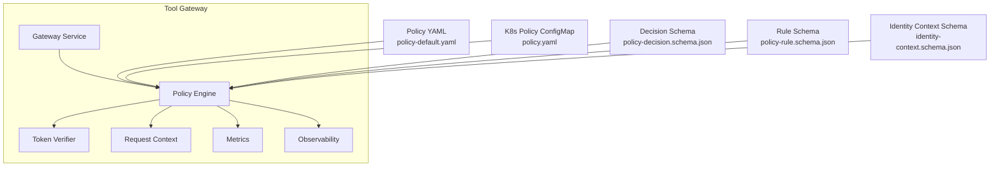
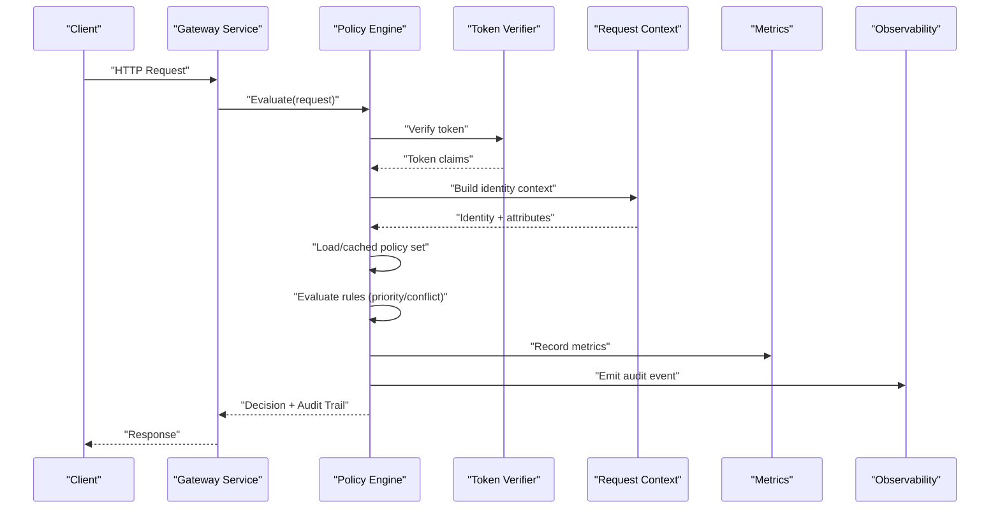
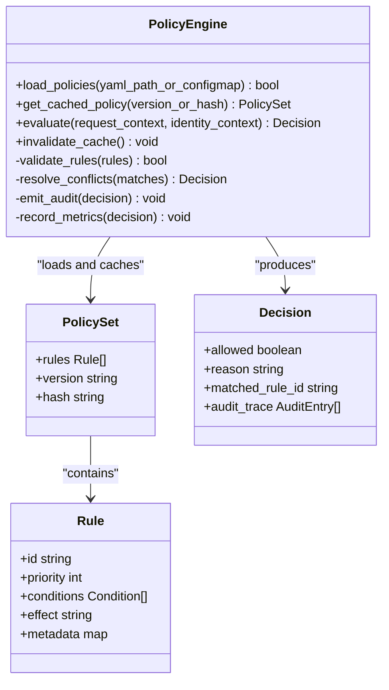
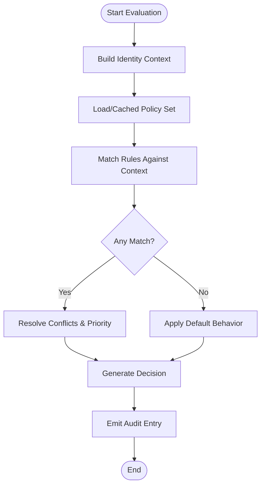
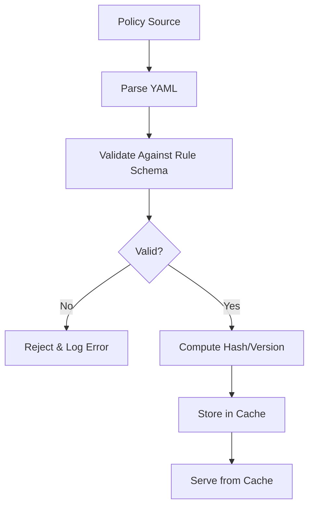
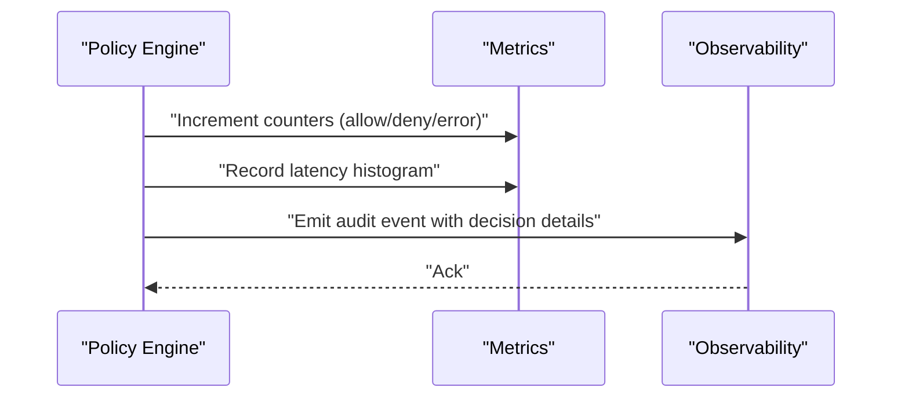
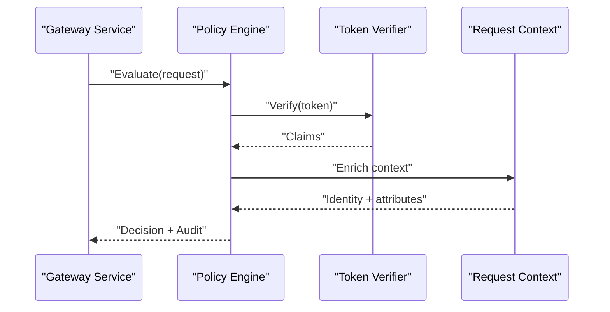
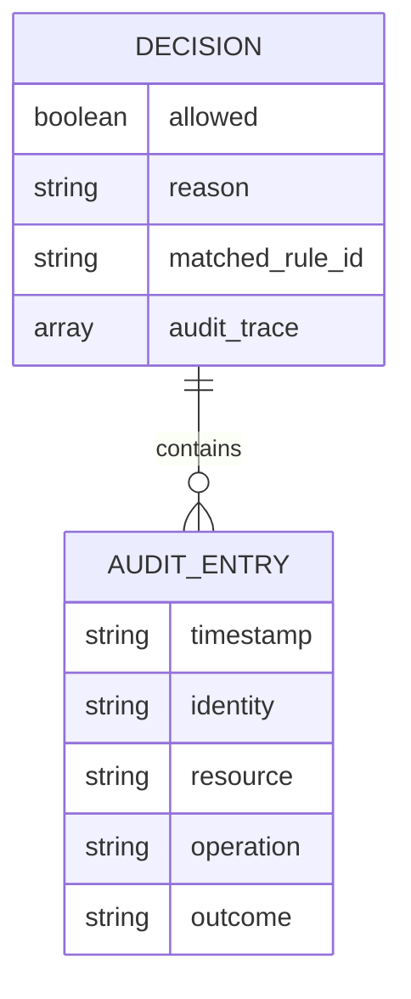
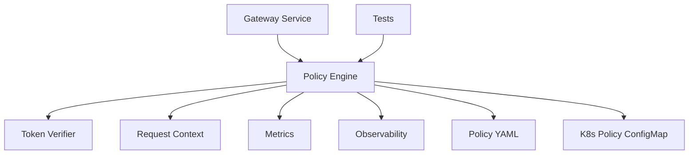

# Policy Engine

<cite>
**Referenced Files in This Document**
- [policy_engine.py](file://products/tool-gateway/src/api_gateway/services/policy_engine.py)
- [policy-default.yaml](file://products/tool-gateway/src/api_gateway/policies/policy-default.yaml)
- [policy.yaml](file://shared/platform-ops/gitops/dev-k8s/base/shared/tool-gateway/policy.yaml)
- [policy-decision.schema.json](file://shared/shared-contracts/schemas/policy-decision.schema.json)
- [policy-rule.schema.json](file://shared/shared-contracts/schemas/policy-rule.schema.json)
- [identity-context.schema.json](file://shared/shared-contracts/schemas/identity-context.schema.json)
- [test_policy_engine.py](file://products/tool-gateway/tests/test_policy_engine.py)
- [test_policy_enforcement.py](file://products/tool-gateway/tests/test_policy_enforcement.py)
- [gateway_service.py](file://products/tool-gateway/src/api_gateway/services/gateway_service.py)
- [token_verifier.py](file://products/tool-gateway/src/api_gateway/services/token_verifier.py)
- [request_context.py](file://products/tool-gateway/src/api_gateway/core/request_context.py)
- [metrics.py](file://products/tool-gateway/src/api_gateway/core/metrics.py)
- [observability.py](file://products/tool-gateway/src/api_gateway/core/observability.py)
</cite>

## Table of Contents
1. [Introduction](#introduction)
2. [Project Structure](#project-structure)
3. [Core Components](#core-components)
4. [Architecture Overview](#architecture-overview)
5. [Detailed Component Analysis](#detailed-component-analysis)
6. [Dependency Analysis](#dependency-analysis)
7. [Performance Considerations](#performance-considerations)
8. [Troubleshooting Guide](#troubleshooting-guide)
9. [Conclusion](#conclusion)
10. [Appendices](#appendices)

## Introduction
This document explains the policy engine that evaluates and enforces policies at runtime within the tool gateway service. It covers how policies are loaded, cached, and executed during request processing; how identity contexts influence authorization decisions; how audit trails are generated; and how to monitor and tune performance for high-throughput environments. It also documents decision schema conventions, priority and conflict resolution strategies, fallback mechanisms, and practical examples for evaluation scenarios, error handling, and debugging.

## Project Structure
The policy engine is implemented as a service within the tool gateway product. Policies are defined in YAML files and validated against shared JSON schemas. The engine integrates with token verification and request context to make authorization decisions and emit metrics and observability signals.

**Diagram sources**
- [policy_engine.py](file://products/tool-gateway/src/api_gateway/services/policy_engine.py)
- [policy-default.yaml](file://products/tool-gateway/src/api_gateway/policies/policy-default.yaml)
- [policy.yaml](file://shared/platform-ops/gitops/dev-k8s/base/shared/tool-gateway/policy.yaml)
- [policy-decision.schema.json](file://shared/shared-contracts/schemas/policy-decision.schema.json)
- [policy-rule.schema.json](file://shared/shared-contracts/schemas/policy-rule.schema.json)
- [identity-context.schema.json](file://shared/shared-contracts/schemas/identity-context.schema.json)
- [gateway_service.py](file://products/tool-gateway/src/api_gateway/services/gateway_service.py)
- [token_verifier.py](file://products/tool-gateway/src/api_gateway/services/token_verifier.py)
- [request_context.py](file://products/tool-gateway/src/api_gateway/core/request_context.py)
- [metrics.py](file://products/tool-gateway/src/api_gateway/core/metrics.py)
- [observability.py](file://products/tool-gateway/src/api_gateway/core/observability.py)

**Section sources**
- [policy_engine.py](file://products/tool-gateway/src/api_gateway/services/policy_engine.py)
- [policy-default.yaml](file://products/tool-gateway/src/api_gateway/policies/policy-default.yaml)
- [policy.yaml](file://shared/platform-ops/gitops/dev-k8s/base/shared/tool-gateway/policy.yaml)
- [policy-decision.schema.json](file://shared/shared-contracts/schemas/policy-decision.schema.json)
- [policy-rule.schema.json](file://shared/shared-contracts/schemas/policy-rule.schema.json)
- [identity-context.schema.json](file://shared/shared-contracts/schemas/identity-context.schema.json)
- [gateway_service.py](file://products/tool-gateway/src/api_gateway/services/gateway_service.py)
- [token_verifier.py](file://products/tool-gateway/src/api_gateway/services/token_verifier.py)
- [request_context.py](file://products/tool-gateway/src/api_gateway/core/request_context.py)
- [metrics.py](file://products/tool-gateway/src/api_gateway/core/metrics.py)
- [observability.py](file://products/tool-gateway/src/api_gateway/core/observability.py)

## Core Components
- Policy Engine: Loads and caches policies, evaluates rules against request context and identity, produces decisions, and emits metrics and observability events.
- Token Verifier: Validates tokens and enriches identity context used by policy evaluation.
- Request Context: Provides per-request attributes (e.g., user, roles, scopes, resource, operation).
- Metrics and Observability: Record latency, throughput, allow/deny counts, and errors.

Key responsibilities:
- Load policies from YAML and validate against rule schema.
- Cache policies in memory with versioning and TTL.
- Evaluate rules deterministically with priority and conflict resolution.
- Generate structured decisions conforming to the decision schema.
- Emit audit logs and metrics for every evaluation.

**Section sources**
- [policy_engine.py](file://products/tool-gateway/src/api_gateway/services/policy_engine.py)
- [token_verifier.py](file://products/tool-gateway/src/api_gateway/services/token_verifier.py)
- [request_context.py](file://products/tool-gateway/src/api_gateway/core/request_context.py)
- [metrics.py](file://products/tool-gateway/src/api_gateway/core/metrics.py)
- [observability.py](file://products/tool-gateway/src/api_gateway/core/observability.py)

## Architecture Overview
The policy engine sits between the gateway service and downstream services. For each request, it:
- Retrieves or validates the token via the token verifier.
- Builds an identity context from the request and token.
- Loads the applicable policy set (from local YAML or K8s configmap).
- Evaluates rules in priority order, resolving conflicts using precedence and deny-first semantics.
- Produces a decision and audit trail, then returns control to the gateway.

**Diagram sources**
- [policy_engine.py](file://products/tool-gateway/src/api_gateway/services/policy_engine.py)
- [token_verifier.py](file://products/tool-gateway/src/api_gateway/services/token_verifier.py)
- [request_context.py](file://products/tool-gateway/src/api_gateway/core/request_context.py)
- [metrics.py](file://products/tool-gateway/src/api_gateway/core/metrics.py)
- [observability.py](file://products/tool-gateway/src/api_gateway/core/observability.py)

## Detailed Component Analysis

### Policy Engine Service
Responsibilities:
- Policy loading: Reads YAML policy definitions and validates them against the rule schema.
- Caching: Maintains an in-memory cache keyed by policy version or content hash, with TTL and invalidation hooks.
- Evaluation: Applies rules in priority order, supports deny-first, and resolves conflicts deterministically.
- Decision generation: Produces a structured decision object conforming to the decision schema.
- Audit and metrics: Emits structured audit entries and records performance metrics.

**Diagram sources**
- [policy_engine.py](file://products/tool-gateway/src/api_gateway/services/policy_engine.py)
- [policy-rule.schema.json](file://shared/shared-contracts/schemas/policy-rule.schema.json)
- [policy-decision.schema.json](file://shared/shared-contracts/schemas/policy-decision.schema.json)

Evaluation flow highlights:
- Priority ordering ensures higher-priority rules take effect first.
- Deny-first semantics: if any matching rule denies, the decision is denied unless overridden by explicit allow at higher priority.
- Conflict resolution uses rule metadata and precedence to pick the most specific match.
- Fallback mechanism: if no rule matches, default behavior is configured (typically deny-by-default).

**Section sources**
- [policy_engine.py](file://products/tool-gateway/src/api_gateway/services/policy_engine.py)
- [policy-rule.schema.json](file://shared/shared-contracts/schemas/policy-rule.schema.json)
- [policy-decision.schema.json](file://shared/shared-contracts/schemas/policy-decision.schema.json)

### Identity Integration and Authorization Decisions
- Identity context is built from token claims and request attributes.
- Rules can reference identity fields such as user, roles, scopes, tenant, and resource attributes.
- Authorization decisions depend on identity context and policy rules.

**Diagram sources**
- [policy_engine.py](file://products/tool-gateway/src/api_gateway/services/policy_engine.py)
- [identity-context.schema.json](file://shared/shared-contracts/schemas/identity-context.schema.json)

**Section sources**
- [identity-context.schema.json](file://shared/shared-contracts/schemas/identity-context.schema.json)
- [policy_engine.py](file://products/tool-gateway/src/api_gateway/services/policy_engine.py)

### Policy Loading and Caching Strategy
- Sources: Local YAML file and Kubernetes ConfigMap.
- Validation: Each policy set is validated against the rule schema before caching.
- Cache key: Version or content hash to ensure consistency across replicas.
- TTL and invalidation: TTL-based expiration and explicit invalidation on reload.
- Hot path: Cached policy sets are used for all evaluations to minimize overhead.

**Diagram sources**
- [policy-default.yaml](file://products/tool-gateway/src/api_gateway/policies/policy-default.yaml)
- [policy.yaml](file://shared/platform-ops/gitops/dev-k8s/base/shared/tool-gateway/policy.yaml)
- [policy-engine.py](file://products/tool-gateway/src/api_gateway/services/policy_engine.py)

**Section sources**
- [policy-default.yaml](file://products/tool-gateway/src/api_gateway/policies/policy-default.yaml)
- [policy.yaml](file://shared/platform-ops/gitops/dev-k8s/base/shared/tool-gateway/policy.yaml)
- [policy_engine.py](file://products/tool-gateway/src/api_gateway/services/policy_engine.py)

### Audit Logging and Monitoring
- Audit entries include decision outcome, matched rule ID, identity context summary, and timestamp.
- Metrics capture latency, allow/deny counts, and error rates.
- Observability emits structured events for tracing and alerting.

**Diagram sources**
- [metrics.py](file://products/tool-gateway/src/api_gateway/core/metrics.py)
- [observability.py](file://products/tool-gateway/src/api_gateway/core/observability.py)
- [policy_engine.py](file://products/tool-gateway/src/api_gateway/services/policy_engine.py)

**Section sources**
- [metrics.py](file://products/tool-gateway/src/api_gateway/core/metrics.py)
- [observability.py](file://products/tool-gateway/src/api_gateway/core/observability.py)
- [policy_engine.py](file://products/tool-gateway/src/api_gateway/services/policy_engine.py)

### Integration with Gateway Service and Token Verification
- Gateway service invokes the policy engine for each request.
- Token verifier validates tokens and provides claims to build identity context.
- Request context supplies additional attributes needed for rule evaluation.

**Diagram sources**
- [gateway_service.py](file://products/tool-gateway/src/api_gateway/services/gateway_service.py)
- [token_verifier.py](file://products/tool-gateway/src/api_gateway/services/token_verifier.py)
- [request_context.py](file://products/tool-gateway/src/api_gateway/core/request_context.py)
- [policy_engine.py](file://products/tool-gateway/src/api_gateway/services/policy_engine.py)

**Section sources**
- [gateway_service.py](file://products/tool-gateway/src/api_gateway/services/gateway_service.py)
- [token_verifier.py](file://products/tool-gateway/src/api_gateway/services/token_verifier.py)
- [request_context.py](file://products/tool-gateway/src/api_gateway/core/request_context.py)
- [policy_engine.py](file://products/tool-gateway/src/api_gateway/services/policy_engine.py)

### Decision Schema and Audit Trail
- Decision schema defines allowed, reason, matched_rule_id, and audit_trace fields.
- Audit trail includes timestamps, identities, resources, operations, and outcomes.
- Schemas ensure consistent structure across components and enable downstream analysis.

**Diagram sources**
- [policy-decision.schema.json](file://shared/shared-contracts/schemas/policy-decision.schema.json)

**Section sources**
- [policy-decision.schema.json](file://shared/shared-contracts/schemas/policy-decision.schema.json)

### Examples of Policy Evaluation Scenarios
- Scenario 1: Allow read-only access for users with role “viewer” on public resources.
- Scenario 2: Deny write operations for users without scope “admin”.
- Scenario 3: Allow cross-tenant access only when tenant attribute matches and scope includes “cross-tenant”.
- Scenario 4: Fallback deny when no rule matches (deny-by-default).

These scenarios are validated through tests that exercise rule matching, priority, conflict resolution, and default behaviors.

**Section sources**
- [test_policy_engine.py](file://products/tool-gateway/tests/test_policy_engine.py)
- [test_policy_enforcement.py](file://products/tool-gateway/tests/test_policy_enforcement.py)

### Error Handling and Debugging Techniques
- Invalid policy YAML: Rejected with validation errors and logged.
- Missing identity fields: Handled with safe defaults and explicit warnings.
- Token verification failures: Denied with clear reasons and audit entries.
- Debugging: Enable verbose logging, inspect cached policy versions, and review audit traces for decision reasoning.

**Section sources**
- [policy_engine.py](file://products/tool-gateway/src/api_gateway/services/policy_engine.py)
- [test_policy_engine.py](file://products/tool-gateway/tests/test_policy_engine.py)
- [test_policy_enforcement.py](file://products/tool-gateway/tests/test_policy_enforcement.py)

## Dependency Analysis
The policy engine depends on token verification, request context, metrics, and observability. Policies are externalized via YAML and K8s ConfigMaps. Tests provide coverage for evaluation logic and enforcement paths.

**Diagram sources**
- [policy_engine.py](file://products/tool-gateway/src/api_gateway/services/policy_engine.py)
- [token_verifier.py](file://products/tool-gateway/src/api_gateway/services/token_verifier.py)
- [request_context.py](file://products/tool-gateway/src/api_gateway/core/request_context.py)
- [metrics.py](file://products/tool-gateway/src/api_gateway/core/metrics.py)
- [observability.py](file://products/tool-gateway/src/api_gateway/core/observability.py)
- [policy-default.yaml](file://products/tool-gateway/src/api_gateway/policies/policy-default.yaml)
- [policy.yaml](file://shared/platform-ops/gitops/dev-k8s/base/shared/tool-gateway/policy.yaml)
- [gateway_service.py](file://products/tool-gateway/src/api_gateway/services/gateway_service.py)
- [test_policy_engine.py](file://products/tool-gateway/tests/test_policy_engine.py)
- [test_policy_enforcement.py](file://products/tool-gateway/tests/test_policy_enforcement.py)

**Section sources**
- [policy_engine.py](file://products/tool-gateway/src/api_gateway/services/policy_engine.py)
- [gateway_service.py](file://products/tool-gateway/src/api_gateway/services/gateway_service.py)
- [test_policy_engine.py](file://products/tool-gateway/tests/test_policy_engine.py)
- [test_policy_enforcement.py](file://products/tool-gateway/tests/test_policy_enforcement.py)

## Performance Considerations
- Caching: Use content-hash keys and TTL to avoid repeated parsing/validation.
- Rule evaluation: Precompute rule indexes by resource/operation to reduce matching cost.
- Deny-first: Short-circuit evaluation upon first deny to minimize overhead.
- Metrics: Track latency percentiles and error rates to identify hotspots.
- Scalability: Horizontal scaling with consistent cache keys; consider distributed cache for multi-replica deployments.
- Memory: Limit policy set size and enforce strict schema validation to prevent oversized payloads.

[No sources needed since this section provides general guidance]

## Troubleshooting Guide
Common issues:
- Policy load failures: Check YAML syntax and schema compliance.
- Unexpected denials: Review identity context and rule conditions; verify priority and conflict resolution.
- Token errors: Inspect token verification results and claim mappings.
- Performance regressions: Analyze metrics histograms and audit trace volume.

Debugging steps:
- Enable detailed logging for policy engine and token verifier.
- Dump cached policy versions and hashes.
- Correlate audit traces with request IDs.
- Validate identity context enrichment logic.

**Section sources**
- [policy_engine.py](file://products/tool-gateway/src/api_gateway/services/policy_engine.py)
- [test_policy_engine.py](file://products/tool-gateway/tests/test_policy_engine.py)
- [test_policy_enforcement.py](file://products/tool-gateway/tests/test_policy_enforcement.py)

## Conclusion
The policy engine provides robust, scalable, and observable policy evaluation at runtime. By leveraging schema-validated policies, deterministic rule evaluation with priority and conflict resolution, and comprehensive audit and metrics, it enables secure and predictable authorization decisions. Proper caching, monitoring, and debugging practices ensure high throughput and reliability in production environments.

[No sources needed since this section summarizes without analyzing specific files]

## Appendices

### Decision Schema Reference
- Fields: allowed, reason, matched_rule_id, audit_trace.
- Purpose: Standardize decision outputs for downstream consumers and auditing.

**Section sources**
- [policy-decision.schema.json](file://shared/shared-contracts/schemas/policy-decision.schema.json)

### Rule Schema Reference
- Fields: id, priority, conditions, effect, metadata.
- Purpose: Define evaluatable rules with explicit precedence and contextual conditions.

**Section sources**
- [policy-rule.schema.json](file://shared/shared-contracts/schemas/policy-rule.schema.json)

### Identity Context Reference
- Fields: user, roles, scopes, tenant, resource attributes.
- Purpose: Provide rich context for rule evaluation and decision reasoning.

**Section sources**
- [identity-context.schema.json](file://shared/shared-contracts/schemas/identity-context.schema.json)