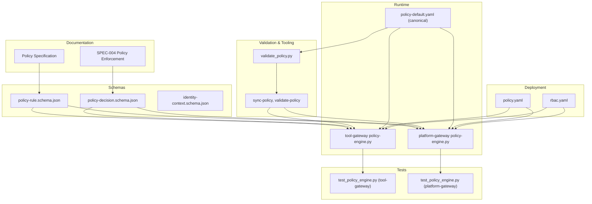
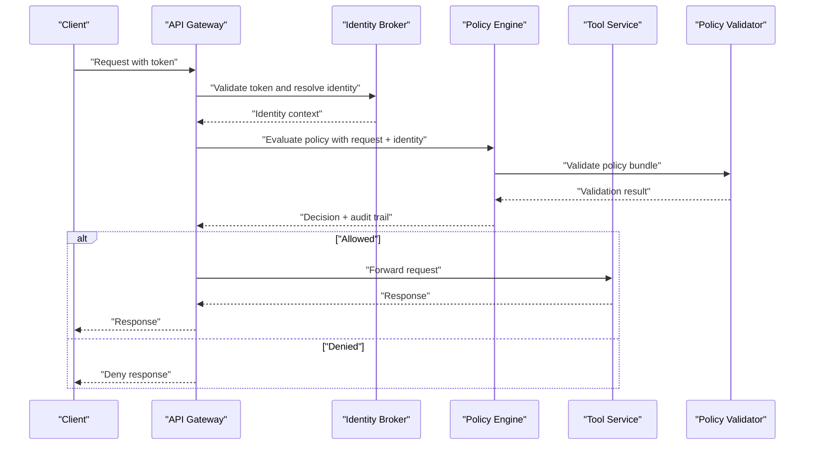
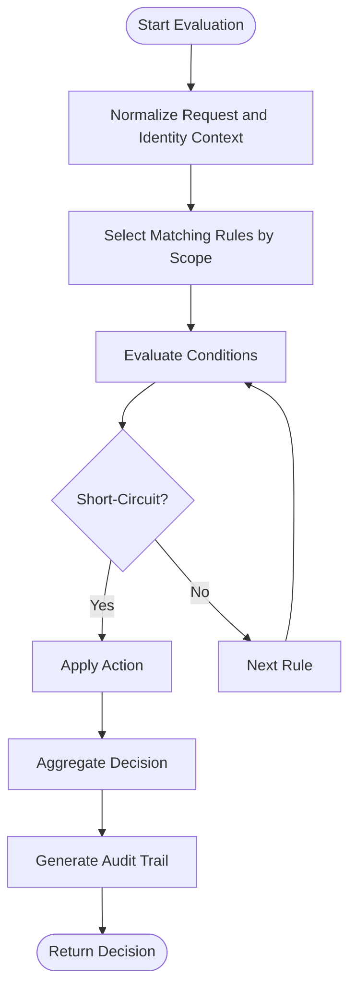
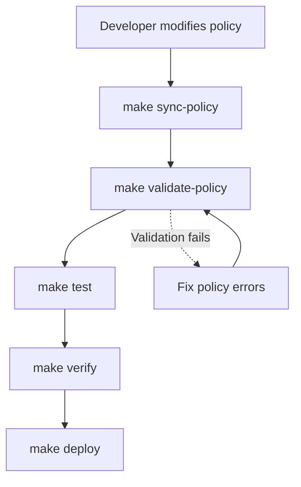
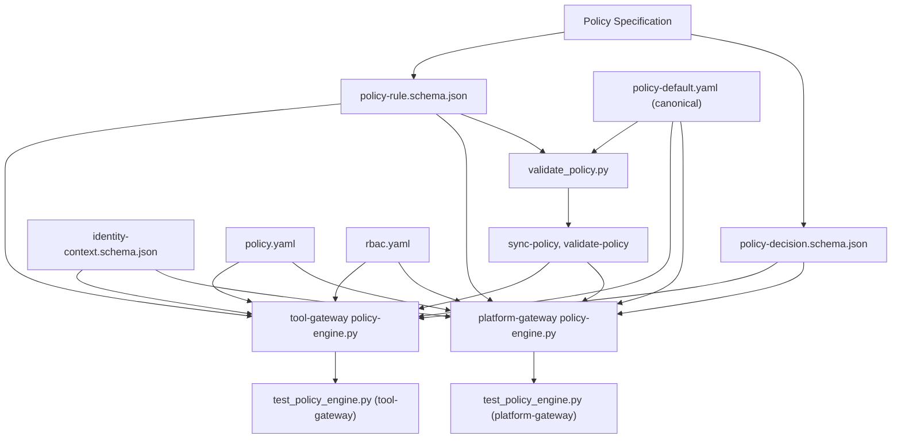

# Policy Management

<cite>
**Referenced Files in This Document**
- [policy-specification.md](file://docs/agentic-aiops-platform/policy-specification.md)
- [SPEC-004-policy-enforcement/spec.md](file://docs/specs/SPEC-004-policy-enforcement/spec.md)
- [validate_policy.py](file://shared/shared-contracts/scripts/validate_policy.py)
- [Makefile](file://Makefile)
- [policy-default.yaml](file://shared/shared-contracts/policies/policy-default.yaml)
- [policy-rule.schema.json](file://shared/shared-contracts/schemas/policy-rule.schema.json)
- [policy-engine.py](file://products/tool-gateway/src/tool_gateway/services/policy_engine.py)
- [policy-engine.py](file://products/platform-gateway/src/platform_gateway/services/policy_engine.py)
- [test_policy_engine.py](file://products/tool-gateway/tests/test_policy_engine.py)
- [test_policy_engine.py](file://products/platform-gateway/tests/test_policy_engine.py)
- [policy.yaml](file://shared/platform-ops/gitops/dev-k8s/base/shared/policy.yaml)
- [rbac.yaml](file://shared/platform-ops/gitops/dev-k8s/base/shared/tool-gateway/rbac.yaml)
- [identity-context.schema.json](file://shared/shared-contracts/schemas/identity-context.schema.json)
- [policy-decision.schema.json](file://shared/shared-contracts/schemas/policy-decision.schema.json)
</cite>

## Update Summary
**Changes Made**
- Added new section on Enhanced Policy Tooling with Makefile targets and validation script
- Updated Policy Testing, Validation, and Deployment section to include new validation workflow
- Added Policy Bundle Validation subsection with detailed validation checks
- Updated Development Workflow to incorporate new validation tools
- Enhanced troubleshooting guide with validation-related issues

## Table of Contents
1. [Introduction](#introduction)
2. [Project Structure](#project-structure)
3. [Core Components](#core-components)
4. [Architecture Overview](#architecture-overview)
5. [Detailed Component Analysis](#detailed-component-analysis)
6. [Enhanced Policy Tooling](#enhanced-policy-tooling)
7. [Dependency Analysis](#dependency-analysis)
8. [Performance Considerations](#performance-considerations)
9. [Troubleshooting Guide](#troubleshooting-guide)
10. [Conclusion](#conclusion)
11. [Appendices](#appendices)

## Introduction
This document describes the policy management system that enables declarative policy definitions and runtime enforcement across the platform. It covers the policy language syntax, built-in rule types, custom policy development, evaluation flow, decision logic, audit trail generation, testing, validation, deployment, versioning, conflict resolution, performance optimization, and integration with identity contexts and authorization decisions across services.

The system is designed to be declarative, auditable, and extensible, allowing operators to define policies centrally and enforce them consistently at the API gateway boundary and within tool execution paths. **Updated** with enhanced tooling for policy bundle validation and synchronization across multiple service locations.

## Project Structure
Policy-related artifacts are distributed across documentation, schemas, runtime implementation, tests, and Kubernetes manifests:

- Documentation and specifications define the policy model, evaluation semantics, and operational guidance.
- Schemas formalize policy rules, decisions, and identity context structures used by services.
- The policy engine implements evaluation logic and integrates with request processing.
- Tests validate behavior and edge cases for policy evaluation and enforcement.
- Kubernetes manifests provide default policies and RBAC configurations for deployment.
- **New**: Centralized policy validation and synchronization tooling via Makefile targets and Python scripts.



**Diagram sources**
- [policy-specification.md](file://docs/agentic-aiops-platform/policy-specification.md)
- [SPEC-004-policy-enforcement/spec.md](file://docs/specs/SPEC-004-policy-enforcement/spec.md)
- [policy-rule.schema.json](file://shared/shared-contracts/schemas/policy-rule.schema.json)
- [policy-decision.schema.json](file://shared/shared-contracts/schemas/policy-decision.schema.json)
- [identity-context.schema.json](file://shared/shared-contracts/schemas/identity-context.schema.json)
- [validate_policy.py](file://shared/shared-contracts/scripts/validate_policy.py)
- [Makefile](file://Makefile)
- [policy-engine.py](file://products/tool-gateway/src/tool_gateway/services/policy_engine.py)
- [policy-engine.py](file://products/platform-gateway/src/platform_gateway/services/policy_engine.py)
- [policy-default.yaml](file://shared/shared-contracts/policies/policy-default.yaml)
- [test_policy_engine.py](file://products/tool-gateway/tests/test_policy_engine.py)
- [test_policy_engine.py](file://products/platform-gateway/tests/test_policy_engine.py)
- [policy.yaml](file://shared/platform-ops/gitops/dev-k8s/base/shared/policy.yaml)
- [rbac.yaml](file://shared/platform-ops/gitops/dev-k8s/base/shared/tool-gateway/rbac.yaml)

**Section sources**
- [policy-specification.md](file://docs/agentic-aiops-platform/policy-specification.md)
- [SPEC-004-policy-enforcement/spec.md](file://docs/specs/SPEC-004-policy-enforcement/spec.md)
- [validate_policy.py](file://shared/shared-contracts/scripts/validate_policy.py)
- [Makefile](file://Makefile)
- [policy-default.yaml](file://shared/shared-contracts/policies/policy-default.yaml)
- [policy-engine.py](file://products/tool-gateway/src/tool_gateway/services/policy_engine.py)
- [policy-engine.py](file://products/platform-gateway/src/platform_gateway/services/policy_engine.py)
- [test_policy_engine.py](file://products/tool-gateway/tests/test_policy_engine.py)
- [test_policy_engine.py](file://products/platform-gateway/tests/test_policy_engine.py)
- [policy.yaml](file://shared/platform-ops/gitops/dev-k8s/base/shared/policy.yaml)
- [rbac.yaml](file://shared/platform-ops/gitops/dev-k8s/base/shared/tool-gateway/rbac.yaml)
- [identity-context.schema.json](file://shared/shared-contracts/schemas/identity-context.schema.json)
- [policy-decision.schema.json](file://shared/shared-contracts/schemas/policy-decision.schema.json)
- [policy-rule.schema.json](file://shared/shared-contracts/schemas/policy-rule.schema.json)

## Core Components
- Policy Engine: Evaluates requests against loaded policies, resolves identity context, applies rule precedence, and produces a decision with an audit trail.
- Policy Definitions: Declarative YAML files defining rules, scopes, conditions, and actions.
- Schemas: JSON schemas for policy rules, decisions, and identity contexts ensuring consistent structure across services.
- Tests: Unit and integration tests validating policy evaluation outcomes and enforcement behavior.
- Deployment Artifacts: Kubernetes manifests for policy configuration and RBAC controls.
- **New**: Policy Validation Tools: Automated validation and synchronization utilities for maintaining policy consistency.

Key responsibilities:
- Load and validate policy documents.
- Resolve identity context from tokens or upstream services.
- Evaluate rules in order, handling conflicts via precedence and scope.
- Generate structured decisions and audit records.
- Expose metrics and observability hooks for monitoring.
- **New**: Validate policy bundles against JSON Schema Draft 2020-12 and synchronize across service locations.

**Section sources**
- [policy-engine.py](file://products/tool-gateway/src/tool_gateway/services/policy_engine.py)
- [policy-engine.py](file://products/platform-gateway/src/platform_gateway/services/policy_engine.py)
- [policy-default.yaml](file://shared/shared-contracts/policies/policy-default.yaml)
- [policy-rule.schema.json](file://shared/shared-contracts/schemas/policy-rule.schema.json)
- [policy-decision.schema.json](file://shared/shared-contracts/schemas/policy-decision.schema.json)
- [identity-context.schema.json](file://shared/shared-contracts/schemas/identity-context.schema.json)
- [test_policy_engine.py](file://products/tool-gateway/tests/test_policy_engine.py)
- [test_policy_engine.py](file://products/platform-gateway/tests/test_policy_engine.py)
- [validate_policy.py](file://shared/shared-contracts/scripts/validate_policy.py)
- [Makefile](file://Makefile)

## Architecture Overview
The policy enforcement architecture integrates at the API gateway layer and tool invocation path. Requests carry identity context; the policy engine evaluates policies and returns decisions that gate access or modify behavior. Audit trails are recorded for compliance and debugging.



**Diagram sources**
- [policy-engine.py](file://products/tool-gateway/src/tool_gateway/services/policy_engine.py)
- [policy-engine.py](file://products/platform-gateway/src/platform_gateway/services/policy_engine.py)
- [identity-context.schema.json](file://shared/shared-contracts/schemas/identity-context.schema.json)
- [policy-decision.schema.json](file://shared/shared-contracts/schemas/policy-decision.schema.json)
- [validate_policy.py](file://shared/shared-contracts/scripts/validate_policy.py)

**Section sources**
- [policy-engine.py](file://products/tool-gateway/src/tool_gateway/services/policy_engine.py)
- [policy-engine.py](file://products/platform-gateway/src/platform_gateway/services/policy_engine.py)
- [identity-context.schema.json](file://shared/shared-contracts/schemas/identity-context.schema.json)
- [policy-decision.schema.json](file://shared/shared-contracts/schemas/policy-decision.schema.json)

## Detailed Component Analysis

### Policy Language Syntax and Rule Types
The policy language is defined through YAML-based declarations and validated against schemas. Rules include:
- Scope: Target resources, endpoints, tools, or operations.
- Conditions: Identity attributes, time windows, rate limits, request properties.
- Actions: Allow, deny, throttle, log, transform.
- Precedence: Order and priority to resolve conflicts.

Built-in rule types typically cover:
- Access control based on roles, groups, or claims.
- Rate limiting per user, tenant, or resource.
- Tool usage restrictions by capability or environment.
- Data access control by sensitivity labels or ownership.

Custom policy development involves extending condition evaluators and action handlers while adhering to schema constraints.

**Section sources**
- [policy-specification.md](file://docs/agentic-aiops-platform/policy-specification.md)
- [policy-rule.schema.json](file://shared/shared-contracts/schemas/policy-rule.schema.json)
- [policy-default.yaml](file://shared/shared-contracts/policies/policy-default.yaml)

### Policy Evaluation Flow and Decision Logic
Evaluation proceeds through:
- Input normalization (request, identity context).
- Rule selection by scope matching.
- Condition evaluation with short-circuit semantics where applicable.
- Action application and decision aggregation.
- Audit trail assembly including timestamps, rule IDs, and reasons.

Conflict resolution uses precedence rules and explicit allow/deny overrides. Deny typically takes precedence unless explicitly configured otherwise.



**Diagram sources**
- [policy-engine.py](file://products/tool-gateway/src/tool_gateway/services/policy_engine.py)
- [policy-engine.py](file://products/platform-gateway/src/platform_gateway/services/policy_engine.py)
- [policy-decision.schema.json](file://shared/shared-contracts/schemas/policy-decision.schema.json)

**Section sources**
- [policy-engine.py](file://products/tool-gateway/src/tool_gateway/services/policy_engine.py)
- [policy-engine.py](file://products/platform-gateway/src/platform_gateway/services/policy_engine.py)
- [policy-decision.schema.json](file://shared/shared-contracts/schemas/policy-decision.schema.json)

### Audit Trail Generation
Audit records capture:
- Decision outcome (allow/deny/throttle).
- Matching rule identifiers and precedence.
- Identity context snapshot (sanitized).
- Timestamps and correlation IDs.
- Reason codes and messages.

These records support compliance reporting, debugging, and performance analysis.

**Section sources**
- [policy-decision.schema.json](file://shared/shared-contracts/schemas/policy-decision.schema.json)
- [policy-engine.py](file://products/tool-gateway/src/tool_gateway/services/policy_engine.py)
- [policy-engine.py](file://products/platform-gateway/src/platform_gateway/services/policy_engine.py)

### Common Policy Scenarios
- Rate Limiting: Enforce per-user or per-tenant request quotas using time-window counters and thresholds.
- Data Access Control: Restrict access to sensitive data based on labels, ownership, or clearance levels.
- Tool Usage Restrictions: Limit tool invocations by capability, environment, or role.

Examples are implemented via rule definitions and condition evaluators aligned with schemas.

**Section sources**
- [policy-default.yaml](file://shared/shared-contracts/policies/policy-default.yaml)
- [policy-rule.schema.json](file://shared/shared-contracts/schemas/policy-rule.schema.json)

### Policy Versioning and Conflict Resolution
- Versioning: Policies are versioned to enable rollback and staged rollouts.
- Conflict Resolution: Precedence rules determine which policy applies when multiple match; explicit deny overrides allow unless configured otherwise.
- Migration: Schema evolution ensures backward compatibility during upgrades.

**Section sources**
- [policy-specification.md](file://docs/agentic-aiops-platform/policy-specification.md)
- [policy-rule.schema.json](file://shared/shared-contracts/schemas/policy-rule.schema.json)

### Performance Optimization
- Rule Indexing: Pre-index rules by scope and identity attributes for fast matching.
- Caching: Cache identity context resolutions and frequent decision outcomes with TTL.
- Short-Circuiting: Early exit on decisive rules to reduce evaluation overhead.
- Batching: Batch audit writes and metrics updates to minimize I/O.

**Section sources**
- [policy-engine.py](file://products/tool-gateway/src/tool_gateway/services/policy_engine.py)
- [policy-engine.py](file://products/platform-gateway/src/platform_gateway/services/policy_engine.py)

### Integration with Identity Contexts and Authorization Decisions
- Identity Context: Resolved from tokens or upstream services; includes roles, groups, claims, and tenant identifiers.
- Authorization Decisions: Policy engine consumes identity context to evaluate rules and produce decisions consumed by gateway and tool services.
- Cross-Service Consistency: Shared schemas ensure uniform interpretation of identity and decisions across services.

**Section sources**
- [identity-context.schema.json](file://shared/shared-contracts/schemas/identity-context.schema.json)
- [policy-decision.schema.json](file://shared/shared-contracts/schemas/policy-decision.schema.json)
- [policy-engine.py](file://products/tool-gateway/src/tool_gateway/services/policy_engine.py)
- [policy-engine.py](file://products/platform-gateway/src/platform_gateway/services/policy_engine.py)

## Enhanced Policy Tooling

**New Section** - Added comprehensive policy management tooling with automated validation and synchronization capabilities.

### Makefile Targets for Policy Management

The root Makefile provides two key targets for policy management:

#### `make sync-policy`
Synchronizes the canonical policy bundle from `shared/shared-contracts/policies/policy-default.yaml` to all consumer locations:
- `products/tool-gateway/src/tool_gateway/policies/policy-default.yaml`
- `products/platform-gateway/src/platform_gateway/policies/policy-default.yaml`
- `shared/platform-ops/gitops/dev-k8s/base/shared/policy.yaml`

This ensures all services use identical policy definitions and eliminates configuration drift.

#### `make validate-policy`
Validates the canonical policy bundle against the JSON Schema Draft 2020-12 specification using the validation script. This target runs as part of the verification gate (`make verify`) to ensure policy integrity before deployment.

### Policy Bundle Validation Script

The validation script at `shared/shared-contracts/scripts/validate_policy.py` provides comprehensive policy bundle validation with the following checks:

#### Validation Checks
1. **Bundle Structure Validation**: Ensures the bundle is a valid YAML mapping with required fields
2. **Version Compatibility**: Validates bundle version is supported (currently v1)
3. **Non-empty Rules List**: Ensures the bundle contains at least one rule
4. **Duplicate Rule ID Detection**: Prevents duplicate rule IDs within the same bundle
5. **Schema Validation**: Validates each rule against the JSON Schema Draft 2020-12 specification

#### Error Handling
The script provides detailed error reporting including:
- File not found errors for missing bundles or schemas
- YAML parsing errors with specific line information
- Schema validation errors with exact field paths and messages
- Duplicate ID detection with specific rule identification

#### Exit Codes
- `0`: All validations passed successfully
- `1`: Any validation error occurred (useful for CI/CD pipelines)

### Integration with Development Workflow

The enhanced tooling integrates seamlessly into the existing development workflow:



**Diagram sources**
- [Makefile](file://Makefile)
- [validate_policy.py](file://shared/shared-contracts/scripts/validate_policy.py)

### Benefits of Enhanced Tooling

1. **Consistency**: Ensures all services use identical policy definitions
2. **Early Validation**: Catches policy errors before deployment
3. **Automation**: Reduces manual effort in policy synchronization
4. **Compliance**: Maintains adherence to JSON Schema standards
5. **Debugging**: Provides clear error messages for policy issues

**Section sources**
- [Makefile](file://Makefile)
- [validate_policy.py](file://shared/shared-contracts/scripts/validate_policy.py)
- [policy-default.yaml](file://shared/shared-contracts/policies/policy-default.yaml)
- [policy-rule.schema.json](file://shared/shared-contracts/schemas/policy-rule.schema.json)

## Dependency Analysis
Policy components depend on schemas for validation and consistency, and on identity services for context resolution. Deployment manifests configure runtime behavior and access controls. **Updated** with new dependencies on validation tooling and Makefile targets.



**Diagram sources**
- [policy-specification.md](file://docs/agentic-aiops-platform/policy-specification.md)
- [policy-rule.schema.json](file://shared/shared-contracts/schemas/policy-rule.schema.json)
- [policy-decision.schema.json](file://shared/shared-contracts/schemas/policy-decision.schema.json)
- [identity-context.schema.json](file://shared/shared-contracts/schemas/identity-context.schema.json)
- [policy-engine.py](file://products/tool-gateway/src/tool_gateway/services/policy_engine.py)
- [policy-engine.py](file://products/platform-gateway/src/platform_gateway/services/policy_engine.py)
- [policy-default.yaml](file://shared/shared-contracts/policies/policy-default.yaml)
- [test_policy_engine.py](file://products/tool-gateway/tests/test_policy_engine.py)
- [test_policy_engine.py](file://products/platform-gateway/tests/test_policy_engine.py)
- [policy.yaml](file://shared/platform-ops/gitops/dev-k8s/base/shared/policy.yaml)
- [rbac.yaml](file://shared/platform-ops/gitops/dev-k8s/base/shared/tool-gateway/rbac.yaml)
- [validate_policy.py](file://shared/shared-contracts/scripts/validate_policy.py)
- [Makefile](file://Makefile)

**Section sources**
- [policy-engine.py](file://products/tool-gateway/src/tool_gateway/services/policy_engine.py)
- [policy-engine.py](file://products/platform-gateway/src/platform_gateway/services/policy_engine.py)
- [policy-default.yaml](file://shared/shared-contracts/policies/policy-default.yaml)
- [policy-rule.schema.json](file://shared/shared-contracts/schemas/policy-rule.schema.json)
- [policy-decision.schema.json](file://shared/shared-contracts/schemas/policy-decision.schema.json)
- [identity-context.schema.json](file://shared/shared-contracts/schemas/identity-context.schema.json)
- [test_policy_engine.py](file://products/tool-gateway/tests/test_policy_engine.py)
- [test_policy_engine.py](file://products/platform-gateway/tests/test_policy_engine.py)
- [policy.yaml](file://shared/platform-ops/gitops/dev-k8s/base/shared/policy.yaml)
- [rbac.yaml](file://shared/platform-ops/gitops/dev-k8s/base/shared/tool-gateway/rbac.yaml)
- [validate_policy.py](file://shared/shared-contracts/scripts/validate_policy.py)
- [Makefile](file://Makefile)

## Performance Considerations
- Minimize rule evaluation cost by narrowing scopes and leveraging indexed lookups.
- Cache identity resolutions and frequent decisions with appropriate TTLs.
- Use short-circuit semantics to avoid unnecessary evaluations.
- Batch audit and metrics emissions to reduce overhead.
- Monitor hot paths and tune thresholds for rate limiting and caching.
- **New**: Leverage validation tooling to catch performance issues early in development cycle.

[No sources needed since this section provides general guidance]

## Troubleshooting Guide
Common issues and resolutions:
- Invalid policy YAML: Validate against schemas; fix structural errors.
- Unexpected denials: Inspect audit trail for matching rule and reason code.
- Identity context missing: Verify token validation and upstream identity service connectivity.
- Performance regressions: Check cache hit rates and rule complexity; optimize scopes and conditions.
- **New**: Policy validation failures: Use `make validate-policy` to identify specific schema violations and bundle issues.
- **New**: Policy synchronization errors: Run `make sync-policy` to ensure all service locations have consistent policy definitions.

Operational checks:
- Confirm policy deployment via Kubernetes manifests.
- Review RBAC permissions for policy reads and writes.
- Validate test coverage for new rules and scenarios.
- **New**: Run `make verify` to execute complete validation pipeline including policy checks.

**Section sources**
- [test_policy_engine.py](file://products/tool-gateway/tests/test_policy_engine.py)
- [test_policy_engine.py](file://products/platform-gateway/tests/test_policy_engine.py)
- [policy.yaml](file://shared/platform-ops/gitops/dev-k8s/base/shared/policy.yaml)
- [rbac.yaml](file://shared/platform-ops/gitops/dev-k8s/base/shared/tool-gateway/rbac.yaml)
- [validate_policy.py](file://shared/shared-contracts/scripts/validate_policy.py)
- [Makefile](file://Makefile)

## Conclusion
The policy management system provides a robust, declarative framework for enforcing access control, rate limiting, and tool usage restrictions across services. With well-defined schemas, a clear evaluation flow, comprehensive auditing, strong testing and deployment practices, **and enhanced tooling for validation and synchronization**, it ensures consistent and secure behavior. Operators can extend capabilities through custom policies while maintaining performance and reliability. **Updated** with automated policy validation and synchronization capabilities that streamline policy management and reduce operational overhead.

[No sources needed since this section summarizes without analyzing specific files]

## Appendices

### Example Scenarios
- Rate Limiting: Define per-user quotas with time windows and throttle actions.
- Data Access Control: Restrict sensitive endpoints based on identity labels and ownership.
- Tool Usage Restrictions: Limit tool invocations by capability and environment.

**Section sources**
- [policy-default.yaml](file://shared/shared-contracts/policies/policy-default.yaml)
- [policy-rule.schema.json](file://shared/shared-contracts/schemas/policy-rule.schema.json)

### Development Workflow
- Author policy YAML aligned with schemas.
- Run unit tests to verify rule evaluation.
- **New**: Use `make validate-policy` to validate policy bundle against JSON Schema.
- **New**: Use `make sync-policy` to synchronize policies across all service locations.
- Deploy via Kubernetes manifests with RBAC.
- Monitor audit trails and adjust policies iteratively.

**Section sources**
- [test_policy_engine.py](file://products/tool-gateway/tests/test_policy_engine.py)
- [test_policy_engine.py](file://products/platform-gateway/tests/test_policy_engine.py)
- [policy.yaml](file://shared/platform-ops/gitops/dev-k8s/base/shared/policy.yaml)
- [rbac.yaml](file://shared/platform-ops/gitops/dev-k8s/base/shared/tool-gateway/rbac.yaml)
- [validate_policy.py](file://shared/shared-contracts/scripts/validate_policy.py)
- [Makefile](file://Makefile)

### Policy Bundle Validation Examples

**New Section** - Practical examples of using the enhanced validation tooling.

#### Basic Validation
```bash
# Validate the default policy bundle
make validate-policy

# Or run the validation script directly
python shared/shared-contracts/scripts/validate_policy.py
```

#### Custom Bundle Validation
```bash
# Validate a custom policy bundle
python shared/shared-contracts/scripts/validate_policy.py /path/to/custom-policy.yaml
```

#### Integration with CI/CD
```yaml
# Example GitHub Actions step
- name: Validate Policy Bundles
  run: make validate-policy
```

#### Common Validation Errors
- **Unsupported bundle version**: Ensure bundle has `version: 1`
- **Missing rules list**: Add empty or populated `rules:` array
- **Duplicate rule IDs**: Ensure all rule IDs are unique within the bundle
- **Schema validation errors**: Check rule structure against `policy-rule.schema.json`

**Section sources**
- [validate_policy.py](file://shared/shared-contracts/scripts/validate_policy.py)
- [Makefile](file://Makefile)
- [policy-rule.schema.json](file://shared/shared-contracts/schemas/policy-rule.schema.json)