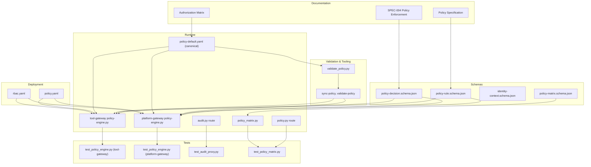
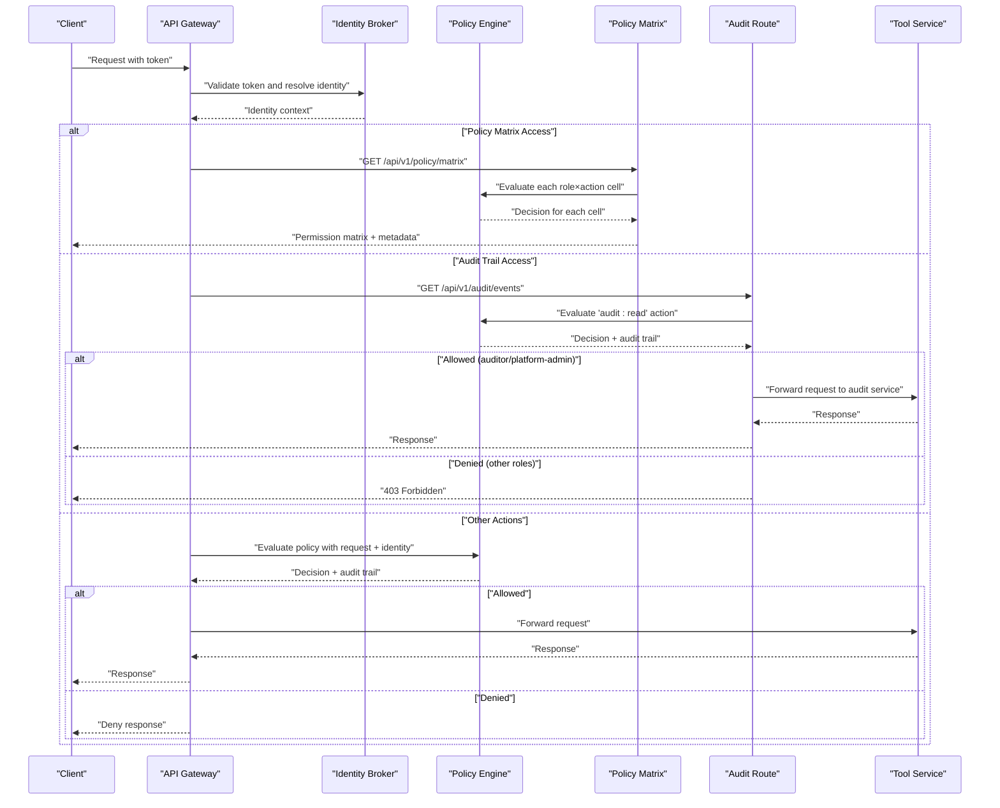
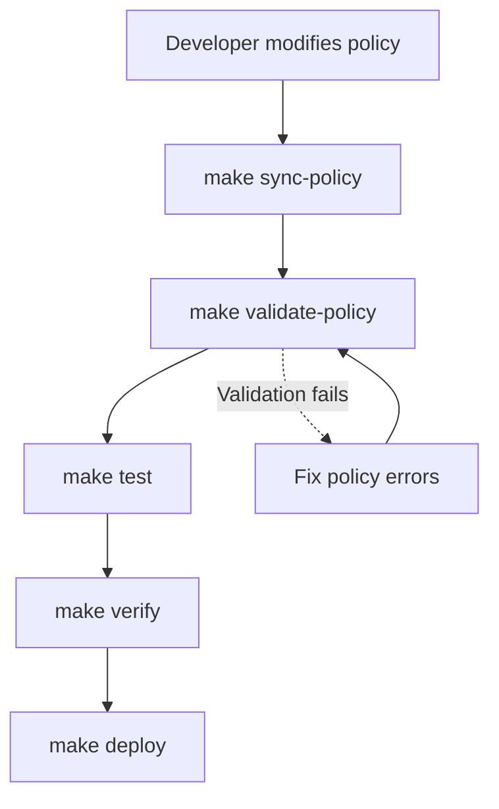
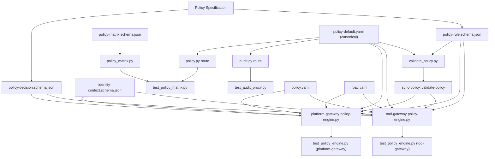

# Policy Management

<cite>
**Referenced Files in This Document**
- [policy-specification.md](file://docs/agentic-aiops-platform/policy-specification.md)
- [SPEC-004-policy-enforcement/spec.md](file://docs/specs/SPEC-004-policy-enforcement/spec.md)
- [validate_policy.py](file://shared/shared-contracts/scripts/validate_policy.py)
- [Makefile](file://Makefile)
- [policy-default.yaml](file://shared/shared-contracts/policies/policy-default.yaml)
- [policy-rule.schema.json](file://shared/shared-contracts/schemas/policy-rule.schema.json)
- [policy-matrix.schema.json](file://shared/shared-contracts/schemas/policy-matrix.schema.json)
- [policy-engine.py](file://products/tool-gateway/src/tool_gateway/services/policy_engine.py)
- [policy-engine.py](file://products/platform-gateway/src/platform_gateway/services/policy_engine.py)
- [policy_matrix.py](file://products/platform-gateway/src/platform_gateway/services/policy_matrix.py)
- [policy.py](file://products/platform-gateway/src/platform_gateway/api/routes/policy.py)
- [test_policy_engine.py](file://products/tool-gateway/tests/test_policy_engine.py)
- [test_policy_engine.py](file://products/platform-gateway/tests/test_policy_engine.py)
- [test_policy_matrix.py](file://products/platform-gateway/tests/test_policy_matrix.py)
- [policy.yaml](file://shared/platform-ops/gitops/dev-k8s/base/shared/policy.yaml)
- [rbac.yaml](file://shared/platform-ops/gitops/dev-k8s/base/shared/tool-gateway/rbac.yaml)
- [identity-context.schema.json](file://shared/shared-contracts/schemas/identity-context.schema.json)
- [policy-decision.schema.json](file://shared/shared-contracts/schemas/policy-decision.schema.json)
- [audit.py](file://products/platform-gateway/src/platform_gateway/api/routes/audit.py)
- [authorization-matrix.md](file://docs/agentic-aiops-platform/authorization-matrix.md)
- [troubleshooting.md](file://docs/guides/troubleshooting.md)
</cite>

## Update Summary
**Changes Made**
- Added comprehensive documentation for the new policy matrix functionality that evaluates currently enforced policy bundle to generate role × action permission table
- Documented server-side row scoping for different user contexts (full matrix for platform-admin, own rows for other roles)
- Updated policy actions vocabulary to include new `tools:list` and `skills:read` actions
- Enhanced policy evaluation flow with transparency endpoint for live permission visibility
- Added detailed coverage of policy matrix schema validation and response structure
- Updated troubleshooting guide with policy matrix access scenarios

## Table of Contents
1. [Introduction](#introduction)
2. [Project Structure](#project-structure)
3. [Core Components](#core-components)
4. [Architecture Overview](#architecture-overview)
5. [Detailed Component Analysis](#detailed-component-analysis)
6. [Enhanced Policy Tooling](#enhanced-policy-tooling)
7. [Policy Matrix Functionality](#policy-matrix-functionality)
8. [Dependency Analysis](#dependency-analysis)
9. [Performance Considerations](#performance-considerations)
10. [Troubleshooting Guide](#troubleshooting-guide)
11. [Conclusion](#conclusion)
12. [Appendices](#appendices)

## Introduction
This document describes the policy management system that enables declarative policy definitions and runtime enforcement across the platform. It covers the policy language syntax, built-in rule types, custom policy development, evaluation flow, decision logic, audit trail generation, testing, validation, deployment, versioning, conflict resolution, performance optimization, and integration with identity contexts and authorization decisions across services.

The system is designed to be declarative, auditable, and extensible, allowing operators to define policies centrally and enforce them consistently at the API gateway boundary and within tool execution paths. **Updated** with enhanced policy matrix functionality that provides live visibility into effective permissions through a role × action permission table, server-side row scoping for different user contexts, and new policy actions (`tools:list`, `skills:read`) for enhanced workspace transparency.

## Project Structure
Policy-related artifacts are distributed across documentation, schemas, runtime implementation, tests, and Kubernetes manifests:

- Documentation and specifications define the policy model, evaluation semantics, and operational guidance.
- Schemas formalize policy rules, decisions, identity contexts, and matrix responses used by services.
- The policy engine implements evaluation logic and integrates with request processing.
- Tests validate behavior and edge cases for policy evaluation and enforcement.
- Kubernetes manifests provide default policies and RBAC configurations for deployment.
- **New**: Policy matrix functionality provides live transparency surface for effective permissions.



**Diagram sources**
- [policy-specification.md](file://docs/agentic-aiops-platform/policy-specification.md)
- [SPEC-004-policy-enforcement/spec.md](file://docs/specs/SPEC-004-policy-enforcement/spec.md)
- [authorization-matrix.md](file://docs/agentic-aiops-platform/authorization-matrix.md)
- [policy-rule.schema.json](file://shared/shared-contracts/schemas/policy-rule.schema.json)
- [policy-decision.schema.json](file://shared/shared-contracts/schemas/policy-decision.schema.json)
- [identity-context.schema.json](file://shared/shared-contracts/schemas/identity-context.schema.json)
- [policy-matrix.schema.json](file://shared/shared-contracts/schemas/policy-matrix.schema.json)
- [validate_policy.py](file://shared/shared-contracts/scripts/validate_policy.py)
- [Makefile](file://Makefile)
- [policy-engine.py](file://products/tool-gateway/src/tool_gateway/services/policy_engine.py)
- [policy-engine.py](file://products/platform-gateway/src/platform_gateway/services/policy_engine.py)
- [policy_matrix.py](file://products/platform-gateway/src/platform_gateway/services/policy_matrix.py)
- [policy.py](file://products/platform-gateway/src/platform_gateway/api/routes/policy.py)
- [audit.py](file://products/platform-gateway/src/platform_gateway/api/routes/audit.py)
- [policy-default.yaml](file://shared/shared-contracts/policies/policy-default.yaml)
- [test_policy_engine.py](file://products/tool-gateway/tests/test_policy_engine.py)
- [test_policy_engine.py](file://products/platform-gateway/tests/test_policy_engine.py)
- [test_audit_proxy.py](file://products/platform-gateway/tests/test_audit_proxy.py)
- [test_policy_matrix.py](file://products/platform-gateway/tests/test_policy_matrix.py)
- [policy.yaml](file://shared/platform-ops/gitops/dev-k8s/base/shared/policy.yaml)
- [rbac.yaml](file://shared/platform-ops/gitops/dev-k8s/base/shared/tool-gateway/rbac.yaml)

**Section sources**
- [policy-specification.md](file://docs/agentic-aiops-platform/policy-specification.md)
- [SPEC-004-policy-enforcement/spec.md](file://docs/specs/SPEC-004-policy-enforcement/spec.md)
- [authorization-matrix.md](file://docs/agentic-aiops-platform/authorization-matrix.md)
- [validate_policy.py](file://shared/shared-contracts/scripts/validate_policy.py)
- [Makefile](file://Makefile)
- [policy-default.yaml](file://shared/shared-contracts/policies/policy-default.yaml)
- [policy-engine.py](file://products/tool-gateway/src/tool_gateway/services/policy_engine.py)
- [policy-engine.py](file://products/platform-gateway/src/platform_gateway/services/policy_engine.py)
- [policy_matrix.py](file://products/platform-gateway/src/platform_gateway/services/policy_matrix.py)
- [policy.py](file://products/platform-gateway/src/platform_gateway/api/routes/policy.py)
- [audit.py](file://products/platform-gateway/src/platform_gateway/api/routes/audit.py)
- [test_policy_engine.py](file://products/tool-gateway/tests/test_policy_engine.py)
- [test_policy_engine.py](file://products/platform-gateway/tests/test_policy_engine.py)
- [test_audit_proxy.py](file://products/platform-gateway/tests/test_audit_proxy.py)
- [test_policy_matrix.py](file://products/platform-gateway/tests/test_policy_matrix.py)
- [policy.yaml](file://shared/platform-ops/gitops/dev-k8s/base/shared/policy.yaml)
- [rbac.yaml](file://shared/platform-ops/gitops/dev-k8s/base/shared/tool-gateway/rbac.yaml)
- [identity-context.schema.json](file://shared/shared-contracts/schemas/identity-context.schema.json)
- [policy-decision.schema.json](file://shared/shared-contracts/schemas/policy-decision.schema.json)
- [policy-rule.schema.json](file://shared/shared-contracts/schemas/policy-rule.schema.json)
- [policy-matrix.schema.json](file://shared/shared-contracts/schemas/policy-matrix.schema.json)

## Core Components
- Policy Engine: Evaluates requests against loaded policies, resolves identity context, applies rule precedence, and produces a decision with an audit trail.
- Policy Definitions: Declarative YAML files defining rules, scopes, conditions, and actions.
- Schemas: JSON schemas for policy rules, decisions, identity contexts, and matrix responses ensuring consistent structure across services.
- Tests: Unit and integration tests validating policy evaluation outcomes and enforcement behavior.
- Deployment Artifacts: Kubernetes manifests for policy configuration and RBAC controls.
- **New**: Policy Matrix Engine: Generates live role × action permission tables from currently enforced policy bundle with server-side row scoping.

Key responsibilities:
- Load and validate policy documents.
- Resolve identity context from tokens or upstream services.
- Evaluate rules in order, handling conflicts via precedence and scope.
- Generate structured decisions and audit records.
- Expose metrics and observability hooks for monitoring.
- **New**: Build effective permission matrices with full policy semantics inheritance.
- **Updated**: Enforce deny-by-default authorization for sensitive operations like audit trail access.

**Section sources**
- [policy-engine.py](file://products/tool-gateway/src/tool_gateway/services/policy_engine.py)
- [policy-engine.py](file://products/platform-gateway/src/platform_gateway/services/policy_engine.py)
- [policy_matrix.py](file://products/platform-gateway/src/platform_gateway/services/policy_matrix.py)
- [policy.py](file://products/platform-gateway/src/platform_gateway/api/routes/policy.py)
- [audit.py](file://products/platform-gateway/src/platform_gateway/api/routes/audit.py)
- [policy-default.yaml](file://shared/shared-contracts/policies/policy-default.yaml)
- [policy-rule.schema.json](file://shared/shared-contracts/schemas/policy-rule.schema.json)
- [policy-decision.schema.json](file://shared/shared-contracts/schemas/policy-decision.schema.json)
- [identity-context.schema.json](file://shared/shared-contracts/schemas/identity-context.schema.json)
- [test_policy_engine.py](file://products/tool-gateway/tests/test_policy_engine.py)
- [test_policy_engine.py](file://products/platform-gateway/tests/test_policy_engine.py)
- [test_audit_proxy.py](file://products/platform-gateway/tests/test_audit_proxy.py)
- [test_policy_matrix.py](file://products/platform-gateway/tests/test_policy_matrix.py)
- [validate_policy.py](file://shared/shared-contracts/scripts/validate_policy.py)
- [Makefile](file://Makefile)

## Architecture Overview
The policy enforcement architecture integrates at the API gateway layer and tool invocation path. Requests carry identity context; the policy engine evaluates policies and returns decisions that gate access or modify behavior. Audit trails are recorded for compliance and debugging. **Updated** with policy matrix endpoint providing live transparency into effective permissions.



**Diagram sources**
- [policy-engine.py](file://products/tool-gateway/src/tool_gateway/services/policy_engine.py)
- [policy-engine.py](file://products/platform-gateway/src/platform_gateway/services/policy_engine.py)
- [policy_matrix.py](file://products/platform-gateway/src/platform_gateway/services/policy_matrix.py)
- [policy.py](file://products/platform-gateway/src/platform_gateway/api/routes/policy.py)
- [audit.py](file://products/platform-gateway/src/platform_gateway/api/routes/audit.py)
- [identity-context.schema.json](file://shared/shared-contracts/schemas/identity-context.schema.json)
- [policy-decision.schema.json](file://shared/shared-contracts/schemas/policy-decision.schema.json)

**Section sources**
- [policy-engine.py](file://products/tool-gateway/src/tool_gateway/services/policy_engine.py)
- [policy-engine.py](file://products/platform-gateway/src/platform_gateway/services/policy_engine.py)
- [policy_matrix.py](file://products/platform-gateway/src/platform_gateway/services/policy_matrix.py)
- [policy.py](file://products/platform-gateway/src/platform_gateway/api/routes/policy.py)
- [audit.py](file://products/platform-gateway/src/platform_gateway/api/routes/audit.py)
- [identity-context.schema.json](file://shared/shared-contracts/schemas/identity-context.schema.json)
- [policy-decision.schema.json](file://shared/shared-contracts/schemas/policy-decision.schema.json)

## Detailed Component Analysis

### Policy Language Syntax and Rule Types
The policy language is defined through YAML-based declarations and validated against schemas. Rules include:
- Scope: Target resources, endpoints, tools, or operations.
- Conditions: Identity attributes, time windows, rate limits, request properties.
- Actions: Allow, deny, throttle, log, transform.
- Precedence: Order and priority to resolve conflicts.

Built-in rule types typically cover:
- Access control based on roles, groups, or claims.
- Rate limiting per user, tenant, or resource.
- Tool usage restrictions by capability or environment.
- Data access control by sensitivity labels or ownership.
- **Updated**: New policy actions including `tools:list` for tool discovery and `skills:read` for skills inventory access.

Custom policy development involves extending condition evaluators and action handlers while adhering to schema constraints.

**Section sources**
- [policy-specification.md](file://docs/agentic-aiops-platform/policy-specification.md)
- [policy-rule.schema.json](file://shared/shared-contracts/schemas/policy-rule.schema.json)
- [policy-default.yaml](file://shared/shared-contracts/policies/policy-default.yaml)

### Policy Evaluation Flow and Decision Logic
Evaluation proceeds through:
- Input normalization (request, identity context).
- Rule selection by scope matching.
- Condition evaluation with short-circuit semantics where applicable.
- Action application and decision aggregation.
- Audit trail assembly including timestamps, rule IDs, and reasons.

Conflict resolution uses precedence rules and explicit allow/deny overrides. Deny typically takes precedence unless explicitly configured otherwise.


**Diagram sources**
- [policy-engine.py](file://products/tool-gateway/src/tool_gateway/services/policy_engine.py)
- [policy-engine.py](file://products/platform-gateway/src/platform_gateway/services/policy_engine.py)
- [policy-decision.schema.json](file://shared/shared-contracts/schemas/policy-decision.schema.json)

**Section sources**
- [policy-engine.py](file://products/tool-gateway/src/tool_gateway/services/policy_engine.py)
- [policy-engine.py](file://products/platform-gateway/src/platform_gateway/services/policy_engine.py)
- [policy-decision.schema.json](file://shared/shared-contracts/schemas/policy-decision.schema.json)

### Policy Matrix Functionality

**New Section** - Comprehensive coverage of the policy matrix functionality that provides live visibility into effective permissions.

#### Live Permission Transparency
The policy matrix endpoint (`GET /api/v1/policy/matrix`) serves the effective role × action permission matrix derived from the policy bundle the gateway actually enforces. Every cell goes through the standard `evaluate()` path — priority, explicit-deny-wins, and disabled-rule semantics are inherited, never re-implemented — so a matrix cell always equals what `enforce_policy` would decide for that role.

#### Server-Side Row Scoping
The matrix implements strict server-side row scoping based on caller identity:
- **Platform-Admin Role**: Receives full matrix showing all roles referenced by the bundle
- **All Other Roles**: Receive only their own granted roles with boolean permissions for each action
- **Action Catalog**: Shared across all scopes, showing complete action vocabulary

#### Implementation Details
The policy matrix builder extracts roles and actions from the loaded bundle, unions protected route actions, and evaluates each role × action combination:

```python
# In policy_matrix.py
def build_policy_matrix(settings, identity):
    rules = load_bundle(settings)
    metadata = bundle_metadata(settings)
    
    bundle_roles = {role for rule in rules for role in rule.roles_any}
    bundle_actions = {action for rule in rules for action in rule.actions_any}
    actions = sorted(bundle_actions | PROTECTED_ACTIONS)
    
    is_admin = ADMIN_ROLE in identity.roles
    visible_roles = sorted(bundle_roles) if is_admin else sorted(identity.roles)
    
    matrix = {
        role: {
            action: evaluate(settings, [role], action).decision == "allow"
            for action in actions
        }
        for role in visible_roles
    }
```

#### Security Model
- **Deny-by-Default**: Matrix endpoint requires `policy:read` action
- **Server-Side Filtering**: No client-side manipulation possible
- **Bundle Provenance**: Response includes source and version metadata
- **Schema Validation**: All responses validated against `policy-matrix.schema.json`

**Section sources**
- [policy_matrix.py](file://products/platform-gateway/src/platform_gateway/services/policy_matrix.py)
- [policy.py](file://products/platform-gateway/src/platform_gateway/api/routes/policy.py)
- [policy-matrix.schema.json](file://shared/shared-contracts/schemas/policy-matrix.schema.json)
- [test_policy_matrix.py](file://products/platform-gateway/tests/test_policy_matrix.py)

### Audit Trail Access Control
Audit trail access control enforces strict role-based permissions for the `audit:read` action:

#### Role-Based Authorization
- **Auditor Role**: Granted exclusive access to query audit trails for compliance and investigation purposes
- **Platform-Admin Role**: Full administrative access to audit trails for platform management
- **All Other Roles**: Denied by default, including operators, approvers, and read-only observers

#### Implementation Details
The audit route at `/api/v1/audit/events` enforces policy checks before forwarding requests to the audit service.

#### Security Model
- **Deny-by-Default**: No implicit access to audit trails
- **Explicit Allow**: Only `auditor` and `platform-admin` roles can access
- **Early Denial**: Policy check occurs before any audit service calls
- **Structured Errors**: 403 responses include action details for debugging

**Section sources**
- [audit.py](file://products/platform-gateway/src/platform_gateway/api/routes/audit.py)
- [policy-default.yaml](file://shared/shared-contracts/policies/policy-default.yaml)
- [authorization-matrix.md](file://docs/agentic-aiops-platform/authorization-matrix.md)

### Audit Trail Generation
Audit records capture:
- Decision outcome (allow/deny/throttle).
- Matching rule identifiers and precedence.
- Identity context snapshot (sanitized).
- Timestamps and correlation IDs.
- Reason codes and messages.

These records support compliance reporting, debugging, and performance analysis.

**Section sources**
- [policy-decision.schema.json](file://shared/shared-contracts/schemas/policy-decision.schema.json)
- [policy-engine.py](file://products/tool-gateway/src/tool_gateway/services/policy_engine.py)
- [policy-engine.py](file://products/platform-gateway/src/platform_gateway/services/policy_engine.py)

### Common Policy Scenarios
- Rate Limiting: Enforce per-user or per-tenant request quotas using time-window counters and thresholds.
- Data Access Control: Restrict access to sensitive data based on labels, ownership, or clearance levels.
- Tool Usage Restrictions: Limit tool invocations by capability, environment, or role.
- **Updated**: New policy actions for enhanced workspace transparency:
  - `tools:list`: Discover available tools (granted to operational, developer, and observer roles)
  - `skills:read`: View federated skills inventory (granted to all platform roles)
  - `policy:read`: Access live permission matrix (granted to all platform roles)

Examples are implemented via rule definitions and condition evaluators aligned with schemas.

**Section sources**
- [policy-default.yaml](file://shared/shared-contracts/policies/policy-default.yaml)
- [policy-rule.schema.json](file://shared/shared-contracts/schemas/policy-rule.schema.json)

### Policy Versioning and Conflict Resolution
- Versioning: Policies are versioned to enable rollback and staged rollouts.
- Conflict Resolution: Precedence rules determine which policy applies when multiple match; explicit deny overrides allow unless configured otherwise.
- Migration: Schema evolution ensures backward compatibility during upgrades.

**Section sources**
- [policy-specification.md](file://docs/agentic-aiops-platform/policy-specification.md)
- [policy-rule.schema.json](file://shared/shared-contracts/schemas/policy-rule.schema.json)

### Performance Optimization
- Rule Indexing: Pre-index rules by scope and identity attributes for fast matching.
- Caching: Cache identity context resolutions and frequent decision outcomes with TTL.
- Short-Circuiting: Early exit on decisive rules to reduce evaluation overhead.
- Batching: Batch audit writes and metrics updates to minimize I/O.
- **New**: Policy matrix evaluation leverages existing policy engine caching and evaluation semantics.

**Section sources**
- [policy-engine.py](file://products/tool-gateway/src/tool_gateway/services/policy_engine.py)
- [policy-engine.py](file://products/platform-gateway/src/platform_gateway/services/policy_engine.py)

### Integration with Identity Contexts and Authorization Decisions
- Identity Context: Resolved from tokens or upstream services; includes roles, groups, claims, and tenant identifiers.
- Authorization Decisions: Policy engine consumes identity context to evaluate rules and produce decisions consumed by gateway and tool services.
- Cross-Service Consistency: Shared schemas ensure uniform interpretation of identity and decisions across services.
- **Updated**: Policy matrix functionality integrates with normalized identity context for server-side row scoping.

**Section sources**
- [identity-context.schema.json](file://shared/shared-contracts/schemas/identity-context.schema.json)
- [policy-decision.schema.json](file://shared/shared-contracts/schemas/policy-decision.schema.json)
- [policy-engine.py](file://products/tool-gateway/src/tool_gateway/services/policy_engine.py)
- [policy-engine.py](file://products/platform-gateway/src/platform_gateway/services/policy_engine.py)

## Enhanced Policy Tooling

### Makefile Targets for Policy Management

The root Makefile provides two key targets for policy management:

#### `make sync-policy`
Synchronizes the canonical policy bundle from `shared/shared-contracts/policies/policy-default.yaml` to all consumer locations:
- `products/tool-gateway/src/tool_gateway/policies/policy-default.yaml`
- `products/platform-gateway/src/platform_gateway/policies/policy-default.yaml`
- `shared/platform-ops/gitops/dev-k8s/base/shared/policy.yaml`

This ensures all services use identical policy definitions and eliminates configuration drift.

#### `make validate-policy`
Validates the canonical policy bundle against the JSON Schema Draft 2020-12 specification using the validation script. This target runs as part of the verification gate (`make verify`) to ensure policy integrity before deployment.

### Policy Bundle Validation Script

The validation script at `shared/shared-contracts/scripts/validate_policy.py` provides comprehensive policy bundle validation with the following checks:

#### Validation Checks
1. **Bundle Structure Validation**: Ensures the bundle is a valid YAML mapping with required fields
2. **Version Compatibility**: Validates bundle version is supported (currently v1)
3. **Non-empty Rules List**: Ensures the bundle contains at least one rule
4. **Duplicate Rule ID Detection**: Prevents duplicate rule IDs within the same bundle
5. **Schema Validation**: Validates each rule against the JSON Schema Draft 2020-12 specification

#### Error Handling
The script provides detailed error reporting including:
- File not found errors for missing bundles or schemas
- YAML parsing errors with specific line information
- Schema validation errors with exact field paths and messages
- Duplicate ID detection with specific rule identification

#### Exit Codes
- `0`: All validations passed successfully
- `1`: Any validation error occurred (useful for CI/CD pipelines)

### Integration with Development Workflow



**Diagram sources**
- [Makefile](file://Makefile)
- [validate_policy.py](file://shared/shared-contracts/scripts/validate_policy.py)

### Benefits of Enhanced Tooling

1. **Consistency**: Ensures all services use identical policy definitions
2. **Early Validation**: Catches policy errors before deployment
3. **Automation**: Reduces manual effort in policy synchronization
4. **Compliance**: Maintains adherence to JSON Schema standards
5. **Debugging**: Provides clear error messages for policy issues

**Section sources**
- [Makefile](file://Makefile)
- [validate_policy.py](file://shared/shared-contracts/scripts/validate_policy.py)
- [policy-default.yaml](file://shared/shared-contracts/policies/policy-default.yaml)
- [policy-rule.schema.json](file://shared/shared-contracts/schemas/policy-rule.schema.json)

## Policy Matrix Functionality

**New Section** - Detailed documentation of the policy matrix functionality introduced for live permission transparency.

### Policy Matrix Endpoint
The `/api/v1/policy/matrix` endpoint provides read-only transparency into effective permissions by evaluating the currently enforced policy bundle.

#### Request Processing
1. Identity resolution from request token
2. Policy enforcement check for `policy:read` action
3. Matrix construction with server-side row scoping
4. Response validation against `policy-matrix.schema.json`

#### Response Structure
The endpoint returns a structured response containing:
- `version`: Policy bundle version
- `source`: Bundle provenance ("configured" or "packaged-default")
- `scope`: Row scoping level ("full" for platform-admin, "own" for others)
- `roles`: Array of visible roles (sorted)
- `actions`: Complete action vocabulary (sorted)
- `matrix`: Role → Action → Boolean permission map

#### Server-Side Row Scoping
- **Full Scope**: Platform-admin receives all roles referenced by the bundle
- **Own Scope**: Regular users receive only their granted roles
- **Action Catalog**: Always complete, shared across all scopes

#### Policy Semantics Inheritance
Every matrix cell evaluation inherits full policy engine semantics:
- Priority-based rule resolution
- Explicit deny overrides allow
- Disabled rules are ignored
- Deny-by-default for ungranted actions

**Section sources**
- [policy_matrix.py](file://products/platform-gateway/src/platform_gateway/services/policy_matrix.py)
- [policy.py](file://products/platform-gateway/src/platform_gateway/api/routes/policy.py)
- [policy-matrix.schema.json](file://shared/shared-contracts/schemas/policy-matrix.schema.json)
- [test_policy_matrix.py](file://products/platform-gateway/tests/test_policy_matrix.py)

## Dependency Analysis
Policy components depend on schemas for validation and consistency, and on identity services for context resolution. Deployment manifests configure runtime behavior and access controls. **Updated** with new dependencies on policy matrix functionality and validation tooling.



**Diagram sources**
- [policy-specification.md](file://docs/agentic-aiops-platform/policy-specification.md)
- [policy-rule.schema.json](file://shared/shared-contracts/schemas/policy-rule.schema.json)
- [policy-decision.schema.json](file://shared/shared-contracts/schemas/policy-decision.schema.json)
- [identity-context.schema.json](file://shared/shared-contracts/schemas/identity-context.schema.json)
- [policy-matrix.schema.json](file://shared/shared-contracts/schemas/policy-matrix.schema.json)
- [policy-engine.py](file://products/tool-gateway/src/tool_gateway/services/policy_engine.py)
- [policy-engine.py](file://products/platform-gateway/src/platform_gateway/services/policy_engine.py)
- [policy_matrix.py](file://products/platform-gateway/src/platform_gateway/services/policy_matrix.py)
- [audit.py](file://products/platform-gateway/src/platform_gateway/api/routes/audit.py)
- [policy.py](file://products/platform-gateway/src/platform_gateway/api/routes/policy.py)
- [policy-default.yaml](file://shared/shared-contracts/policies/policy-default.yaml)
- [test_policy_engine.py](file://products/tool-gateway/tests/test_policy_engine.py)
- [test_policy_engine.py](file://products/platform-gateway/tests/test_policy_engine.py)
- [test_audit_proxy.py](file://products/platform-gateway/tests/test_audit_proxy.py)
- [test_policy_matrix.py](file://products/platform-gateway/tests/test_policy_matrix.py)
- [policy.yaml](file://shared/platform-ops/gitops/dev-k8s/base/shared/policy.yaml)
- [rbac.yaml](file://shared/platform-ops/gitops/dev-k8s/base/shared/tool-gateway/rbac.yaml)
- [validate_policy.py](file://shared/shared-contracts/scripts/validate_policy.py)
- [Makefile](file://Makefile)

**Section sources**
- [policy-engine.py](file://products/tool-gateway/src/tool_gateway/services/policy_engine.py)
- [policy-engine.py](file://products/platform-gateway/src/platform_gateway/services/policy_engine.py)
- [policy_matrix.py](file://products/platform-gateway/src/platform_gateway/services/policy_matrix.py)
- [policy.py](file://products/platform-gateway/src/platform_gateway/api/routes/policy.py)
- [audit.py](file://products/platform-gateway/src/platform_gateway/api/routes/audit.py)
- [policy-default.yaml](file://shared/shared-contracts/policies/policy-default.yaml)
- [policy-rule.schema.json](file://shared/shared-contracts/schemas/policy-rule.schema.json)
- [policy-decision.schema.json](file://shared/shared-contracts/schemas/policy-decision.schema.json)
- [identity-context.schema.json](file://shared/shared-contracts/schemas/identity-context.schema.json)
- [policy-matrix.schema.json](file://shared/shared-contracts/schemas/policy-matrix.schema.json)
- [test_policy_engine.py](file://products/tool-gateway/tests/test_policy_engine.py)
- [test_policy_engine.py](file://products/platform-gateway/tests/test_policy_engine.py)
- [test_audit_proxy.py](file://products/platform-gateway/tests/test_audit_proxy.py)
- [test_policy_matrix.py](file://products/platform-gateway/tests/test_policy_matrix.py)
- [policy.yaml](file://shared/platform-ops/gitops/dev-k8s/base/shared/policy.yaml)
- [rbac.yaml](file://shared/platform-ops/gitops/dev-k8s/base/shared/tool-gateway/rbac.yaml)
- [validate_policy.py](file://shared/shared-contracts/scripts/validate_policy.py)
- [Makefile](file://Makefile)

## Performance Considerations
- Minimize rule evaluation cost by narrowing scopes and leveraging indexed lookups.
- Cache identity resolutions and frequent decisions with appropriate TTLs.
- Use short-circuit semantics to avoid unnecessary evaluations.
- Batch audit and metrics emissions to reduce overhead.
- Monitor hot paths and tune thresholds for rate limiting and caching.
- **New**: Policy matrix evaluation benefits from existing policy engine caching and efficient role × action computation.
- **Updated**: Audit trail access controls add minimal overhead through early policy evaluation.

[No sources needed since this section provides general guidance]

## Troubleshooting Guide
Common issues and resolutions:
- Invalid policy YAML: Validate against schemas; fix structural errors.
- Unexpected denials: Inspect audit trail for matching rule and reason code.
- Identity context missing: Verify token validation and upstream identity service connectivity.
- Performance regressions: Check cache hit rates and rule complexity; optimize scopes and conditions.
- **New**: Policy validation failures: Use `make validate-policy` to identify specific schema violations and bundle issues.
- **New**: Policy synchronization errors: Run `make sync-policy` to ensure all service locations have consistent policy definitions.
- **New**: Policy matrix access denied: Verify caller has `policy:read` action; check bundle contains `allow-all-policy-read` rule.
- **Updated**: Audit access denied (403): Verify caller has `auditor` or `platform-admin` role; check policy bundle contains `allow-auditors-audit-read` rule.

Operational checks:
- Confirm policy deployment via Kubernetes manifests.
- Review RBAC permissions for policy reads and writes.
- Validate test coverage for new rules and scenarios.
- **New**: Run `make verify` to execute complete validation pipeline including policy checks.
- **Updated**: For audit access issues, verify OIDC group membership for `ops-auditors` and `ops-admins`.

**Section sources**
- [test_policy_engine.py](file://products/tool-gateway/tests/test_policy_engine.py)
- [test_policy_engine.py](file://products/platform-gateway/tests/test_policy_engine.py)
- [test_audit_proxy.py](file://products/platform-gateway/tests/test_audit_proxy.py)
- [test_policy_matrix.py](file://products/platform-gateway/tests/test_policy_matrix.py)
- [policy.yaml](file://shared/platform-ops/gitops/dev-k8s/base/shared/policy.yaml)
- [rbac.yaml](file://shared/platform-ops/gitops/dev-k8s/base/shared/tool-gateway/rbac.yaml)
- [validate_policy.py](file://shared/shared-contracts/scripts/validate_policy.py)
- [Makefile](file://Makefile)
- [troubleshooting.md](file://docs/guides/troubleshooting.md)

## Conclusion
The policy management system provides a robust, declarative framework for enforcing access control, rate limiting, and tool usage restrictions across services. With well-defined schemas, a clear evaluation flow, comprehensive auditing, strong testing and deployment practices, **and enhanced tooling for validation and synchronization**, it ensures consistent and secure behavior. Operators can extend capabilities through custom policies while maintaining performance and reliability. **Updated** with automated policy validation and synchronization capabilities that streamline policy management and reduce operational overhead, including comprehensive audit trail access controls with deny-by-default authorization for sensitive operations and new policy matrix functionality for live permission transparency.

[No sources needed since this section summarizes without analyzing specific files]

## Appendices

### Example Scenarios
- Rate Limiting: Define per-user quotas with time windows and throttle actions.
- Data Access Control: Restrict sensitive endpoints based on identity labels and ownership.
- Tool Usage Restrictions: Limit tool invocations by capability and environment.
- **Updated**: New policy actions for enhanced workspace transparency:
  - `tools:list`: Tool discovery for operational, developer, and observer roles
  - `skills:read`: Skills inventory access for all platform roles
  - `policy:read`: Permission matrix access for all platform roles

**Section sources**
- [policy-default.yaml](file://shared/shared-contracts/policies/policy-default.yaml)
- [policy-rule.schema.json](file://shared/shared-contracts/schemas/policy-rule.schema.json)

### Development Workflow
- Author policy YAML aligned with schemas.
- Run unit tests to verify rule evaluation.
- **New**: Use `make validate-policy` to validate policy bundle against JSON Schema.
- **New**: Use `make sync-policy` to synchronize policies across all service locations.
- Deploy via Kubernetes manifests with RBAC.
- Monitor audit trails and adjust policies iteratively.

**Section sources**
- [test_policy_engine.py](file://products/tool-gateway/tests/test_policy_engine.py)
- [test_policy_engine.py](file://products/platform-gateway/tests/test_policy_engine.py)
- [policy.yaml](file://shared/platform-ops/gitops/dev-k8s/base/shared/policy.yaml)
- [rbac.yaml](file://shared/platform-ops/gitops/dev-k8s/base/shared/tool-gateway/rbac.yaml)
- [validate_policy.py](file://shared/shared-contracts/scripts/validate_policy.py)
- [Makefile](file://Makefile)

### Policy Bundle Validation Examples

#### Basic Validation
```bash
# Validate the default policy bundle
make validate-policy

# Or run the validation script directly
python shared/shared-contracts/scripts/validate_policy.py
```

#### Custom Bundle Validation
```bash
# Validate a custom policy bundle
python shared/shared-contracts/scripts/validate_policy.py /path/to/custom-policy.yaml
```

#### Integration with CI/CD
```yaml
# Example GitHub Actions step
- name: Validate Policy Bundles
  run: make validate-policy
```

#### Common Validation Errors
- **Unsupported bundle version**: Ensure bundle has `version: 1`
- **Missing rules list**: Add empty or populated `rules:` array
- **Duplicate rule IDs**: Ensure all rule IDs are unique within the bundle
- **Schema validation errors**: Check rule structure against `policy-rule.schema.json`

**Section sources**
- [validate_policy.py](file://shared/shared-contracts/scripts/validate_policy.py)
- [Makefile](file://Makefile)
- [policy-rule.schema.json](file://shared/shared-contracts/schemas/policy-rule.schema.json)

### Audit Trail Access Troubleshooting

#### Common Symptoms
- 403 Forbidden responses when accessing `/api/v1/audit/events`
- Audit navigation hidden in portal UI
- Successful authentication but failed authorization

#### Diagnostic Steps
```bash
# Check platform-gateway logs for audit:read denials
kubectl -n dev-luban-aiops logs deployment/platform-gateway --tail=30 | grep "audit:read"

# Verify deployed policy bundle contains audit rule
kubectl -n dev-luban-aiops exec deployment/platform-gateway -- \
  cat /etc/luban/policy/policy.yaml | grep -A6 allow-auditors-audit-read
```

#### Resolution Steps
1. **Verify User Roles**: Ensure user has `auditor` or `platform-admin` role
2. **Check OIDC Groups**: Confirm membership in `ops-auditors` or `ops-admins` groups
3. **Validate Policy Bundle**: Ensure `allow-auditors-audit-read` rule is present
4. **Synchronize Policies**: Run `make sync-policy` if bundle appears outdated

**Section sources**
- [troubleshooting.md](file://docs/guides/troubleshooting.md)
- [test_audit_proxy.py](file://products/platform-gateway/tests/test_audit_proxy.py)
- [policy-default.yaml](file://shared/shared-contracts/policies/policy-default.yaml)

### Policy Matrix Troubleshooting

**New Section** - Specific guidance for resolving policy matrix access and functionality issues.

#### Common Symptoms
- 403 Forbidden responses when accessing `/api/v1/policy/matrix`
- Empty or incomplete permission matrix responses
- Incorrect role scoping in matrix output

#### Diagnostic Steps
```bash
# Check platform-gateway logs for policy:read denials
kubectl -n dev-luban-aiops logs deployment/platform-gateway --tail=30 | grep "policy:read"

# Verify deployed policy bundle contains policy read rule
kubectl -n dev-luban-aiops exec deployment/platform-gateway -- \
  cat /etc/luban/policy/policy.yaml | grep -A6 allow-all-policy-read
```

#### Resolution Steps
1. **Verify User Roles**: Ensure user has one of the granted roles for `policy:read`
2. **Check Policy Bundle**: Ensure `allow-all-policy-read` rule is present and enabled
3. **Validate Bundle Path**: Confirm policy bundle is accessible and valid
4. **Test Matrix Endpoint**: Direct curl test to verify endpoint functionality

**Section sources**
- [test_policy_matrix.py](file://products/platform-gateway/tests/test_policy_matrix.py)
- [policy-default.yaml](file://shared/shared-contracts/policies/policy-default.yaml)
- [policy.py](file://products/platform-gateway/src/platform_gateway/api/routes/policy.py)