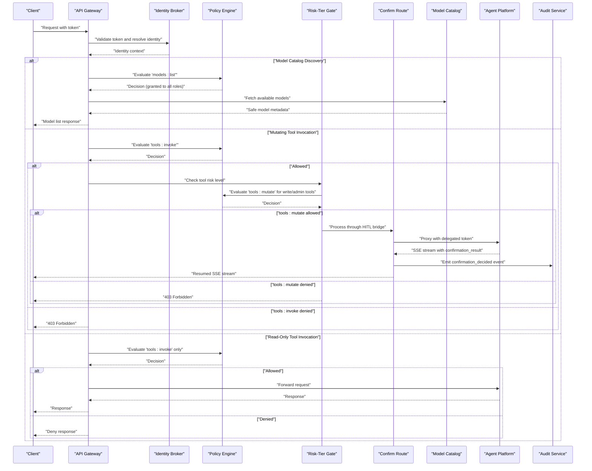
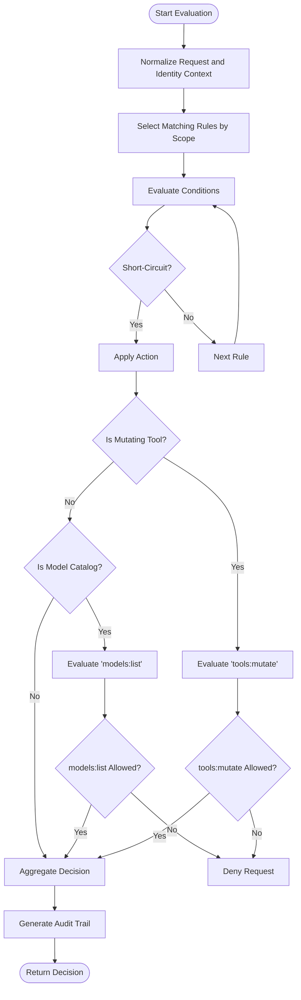
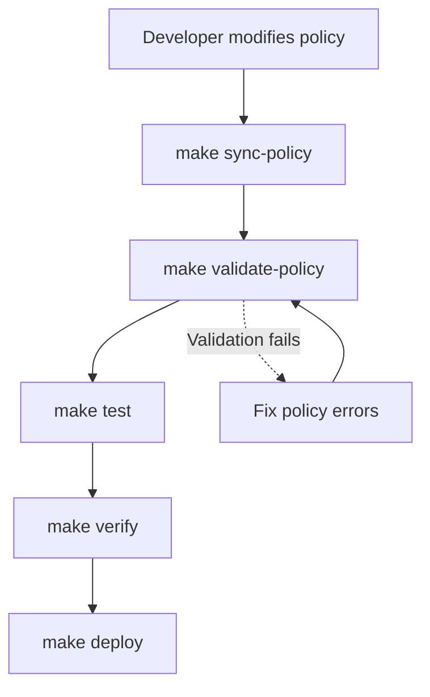

# Policy Management

<cite>
**Referenced Files in This Document**
- [policy-specification.md](file://docs/agentic-aiops-platform/policy-specification.md)
- [SPEC-004-policy-enforcement/spec.md](file://docs/specs/SPEC-004-policy-enforcement/spec.md)
- [SPEC-020-hitl-confirmation-bridging/spec.md](file://docs/specs/SPEC-020-hitl-confirmation-bridging/spec.md)
- [SPEC-021-bounded-mutating-actions/spec.md](file://docs/specs/SPEC-021-bounded-mutating-actions/spec.md)
- [SPEC-024-runtime-llm-model-switching/spec.md](file://docs/specs/SPEC-024-runtime-llm-model-switching/spec.md)
- [validate_policy.py](file://shared/shared-contracts/scripts/validate_policy.py)
- [Makefile](file://Makefile)
- [policy-default.yaml](file://shared/shared-contracts/policies/policy-default.yaml)
- [policy-rule.schema.json](file://shared/shared-contracts/schemas/policy-rule.schema.json)
- [policy-matrix.schema.json](file://shared/shared-contracts/schemas/policy-matrix.schema.json)
- [policy-engine.py](file://products/tool-gateway/src/tool_gateway/services/policy_engine.py)
- [policy-engine.py](file://products/platform-gateway/src/platform_gateway/services/policy_engine.py)
- [gateway_service.py](file://products/tool-gateway/src/tool_gateway/services/gateway_service.py)
- [k8s_connector.py](file://products/tool-gateway/src/tool_gateway/tools/k8s_connector.py)
- [policy_matrix.py](file://products/platform-gateway/src/platform_gateway/services/policy_matrix.py)
- [policy.py](file://products/platform-gateway/src/platform_gateway/api/routes/policy.py)
- [chat.py](file://products/platform-gateway/src/platform_gateway/api/routes/chat.py)
- [test_policy_engine.py](file://products/tool-gateway/tests/test_policy_engine.py)
- [test_policy_engine.py](file://products/platform-gateway/tests/test_policy_engine.py)
- [test_chat_confirm.py](file://products/platform-gateway/tests/test_chat_confirm.py)
- [test_policy_matrix.py](file://products/platform-gateway/tests/test_policy_matrix.py)
- [authorization-matrix.md](file://docs/agentic-aiops-platform/authorization-matrix.md)
- [configuration-reference.md](file://docs/guides/configuration-reference.md)
- [approval-and-hitl.md](file://docs/guides/approval-and-hitl.md)
- [troubleshooting.md](file://docs/guides/troubleshooting.md)
</cite>

## Update Summary
**Changes Made**
- Added comprehensive documentation for the new `tools:mutate` policy action introduced by SPEC-021 (Bounded Mutating Actions)
- Updated policy engine with risk-tier gating that enforces separate authorization for mutating tool execution
- Enhanced default policies across platform-gateway and tool-gateway services with deny-by-default for mutating actions
- Documented the triple-gated approval model: gateway risk-tier admission → agent auto-allow invariant → HITL confirmation
- Added detailed coverage of the first bounded mutating tool (`k8s.delete_pod`) and its security model
- Updated authorization matrix to include `tools:mutate` action with restricted role-based access control
- Enhanced troubleshooting guide with mutating tool-specific scenarios and diagnostic steps
- **Updated**: Enhanced development Kubernetes policy configuration to grant `models:list` permissions alongside existing chat-related actions for platform-admin, approver, operator, developer, and observer roles, enabling safe catalog discovery operations per SPEC-024

## Table of Contents
1. [Introduction](#introduction)
2. [Project Structure](#project-structure)
3. [Core Components](#core-components)
4. [Architecture Overview](#architecture-overview)
5. [Detailed Component Analysis](#detailed-component-analysis)
6. [Enhanced Policy Tooling](#enhanced-policy-tooling)
7. [Policy Matrix Functionality](#policy-matrix-functionality)
8. [HITL Confirmation Bridging](#hitl-confirmation-bridging)
9. [Risk-Tier Gating and Mutating Actions](#risk-tier-gating-and-mutating-actions)
10. [Model Catalog Discovery and Permissions](#model-catalog-discovery-and-permissions)
11. [Dependency Analysis](#dependency-analysis)
12. [Performance Considerations](#performance-considerations)
13. [Troubleshooting Guide](#troubleshooting-guide)
14. [Conclusion](#conclusion)
15. [Appendices](#appendices)

## Introduction
This document describes the policy management system that enables declarative policy definitions and runtime enforcement across the platform. It covers the policy language syntax, built-in rule types, custom policy development, evaluation flow, decision logic, audit trail generation, testing, validation, deployment, versioning, conflict resolution, performance optimization, and integration with identity contexts and authorization decisions across services.

The system is designed to be declarative, auditable, and extensible, allowing operators to define policies centrally and enforce them consistently at the API gateway boundary and within tool execution paths. **Updated** with enhanced policy matrix functionality that provides live visibility into effective permissions through a role × action permission table, server-side row scoping for different user contexts, new policy actions including `tools:list`, `skills:read`, `chat:confirm`, `models:list`, and the new `tools:mutate` action for bounded mutating operations, and comprehensive HITL (Human-in-the-Loop) confirmation bridging for approval-gated bounded actions.

**New**: The platform now includes risk-tier gating that separates read-only tool execution from mutating operations, providing an additional layer of security for potentially destructive actions through the new `tools:mutate` policy action.

**Updated**: The platform now grants `models:list` permissions to all operational roles (platform-admin, approver, operator, developer, and read-only-observer), enabling safe catalog discovery operations as specified in SPEC-024 for runtime LLM model switching capabilities.

## Project Structure
Policy-related artifacts are distributed across documentation, schemas, runtime implementation, tests, and Kubernetes manifests:

- Documentation and specifications define the policy model, evaluation semantics, and operational guidance.
- Schemas formalize policy rules, decisions, identity contexts, and matrix responses used by services.
- The policy engine implements evaluation logic and integrates with request processing.
- Tests validate behavior and edge cases for policy evaluation and enforcement.
- Kubernetes manifests provide default policies and RBAC configurations for deployment.
- **New**: Risk-tier gating provides separation between read and mutating tool execution.
- **New**: Bounded mutating tools like `k8s.delete_pod` require explicit approval through the triple-gated model.
- **Updated**: Model catalog discovery permissions enable safe read-only access to available LLM models across all operational roles.

```mermaid
graph TB
subgraph "Documentation"
PS["Policy Specification"]
SPEC["SPEC-004 Policy Enforcement"]
SPEC20["SPEC-020 HITL Confirmation"]
SPEC21["SPEC-021 Bounded Mutating"]
SPEC24["SPEC-024 Model Switching"]
AUTH_MATRIX["Authorization Matrix"]
end
subgraph "Schemas"
SCHEMA_RULE["policy-rule.schema.json"]
SCHEMA_DECISION["policy-decision.schema.json"]
SCHEMA_IDENTITY["identity-context.schema.json"]
SCHEMA_MATRIX["policy-matrix.schema.json"]
SCHEMA_CONFIRM["chat-confirm.schema.json"]
SCHEMA_MODEL["model-catalog.schema.json"]
end
subgraph "Runtime"
ENGINE_TOOL["tool-gateway policy-engine.py"]
ENGINE_PLATFORM["platform-gateway policy-engine.py"]
GATEWAY_SERVICE["gateway_service.py"]
MATRIX_ENGINE["policy_matrix.py"]
CHAT_ROUTE["chat.py confirm route"]
K8S_CONNECTOR["k8s_connector.py"]
DEFAULT_POLICY["policy-default.yaml (canonical)"]
MODEL_CATALOG["model_catalog.py"]
end
subgraph "Validation & Tooling"
VALIDATE_SCRIPT["validate_policy.py"]
MAKEFILE_TARGETS["sync-policy, validate-policy"]
end
subgraph "Tests"
TEST_TOOL["test_policy_engine.py (tool-gateway)"]
TEST_PLATFORM["test_policy_engine.py (platform-gateway)"]
TEST_CHAT["test_chat_confirm.py"]
TEST_MATRIX["test_policy_matrix.py"]
TEST_K8S["test_k8s_connector.py"]
TEST_MODEL["test_model_catalog.py"]
end
subgraph "Deployment"
K8S_POLICY["policy.yaml"]
RBAC_CONFIG["rbac.yaml"]
end
PS --> SCHEMA_RULE
SPEC --> SCHEMA_DECISION
SPEC20 --> SCHEMA_CONFIRM
SPEC21 --> K8S_CONNECTOR
SPEC24 --> MODEL_CATALOG
AUTH_MATRIX --> DEFAULT_POLICY
SCHEMA_RULE --> ENGINE_TOOL
SCHEMA_RULE --> ENGINE_PLATFORM
SCHEMA_DECISION --> ENGINE_TOOL
SCHEMA_DECISION --> ENGINE_PLATFORM
SCHEMA_MATRIX --> MATRIX_ENGINE
SCHEMA_CONFIRM --> CHAT_ROUTE
SCHEMA_MODEL --> MODEL_CATALOG
DEFAULT_POLICY --> VALIDATE_SCRIPT
VALIDATE_SCRIPT --> MAKEFILE_TARGETS
MAKEFILE_TARGETS --> ENGINE_TOOL
MAKEFILE_TARGETS --> ENGINE_PLATFORM
DEFAULT_POLICY --> ENGINE_TOOL
DEFAULT_POLICY --> ENGINE_PLATFORM
GATEWAY_SERVICE --> TEST_TOOL
K8S_CONNECTOR --> TEST_K8S
ENGINE_TOOL --> TEST_TOOL
ENGINE_PLATFORM --> TEST_PLATFORM
CHAT_ROUTE --> TEST_CHAT
POLICY_ROUTE --> TEST_MATRIX
MATRIX_ENGINE --> TEST_MATRIX
K8S_POLICY --> ENGINE_TOOL
K8S_POLICY --> ENGINE_PLATFORM
RBAC_CONFIG --> ENGINE_TOOL
RBAC_CONFIG --> ENGINE_PLATFORM
MODEL_CATALOG --> TEST_MODEL
```



**Diagram sources**
- [policy-specification.md](file://docs/agentic-aiops-platform/policy-specification.md)
- [SPEC-004-policy-enforcement/spec.md](file://docs/specs/SPEC-004-policy-enforcement/spec.md)
- [SPEC-020-hitl-confirmation-bridging/spec.md](file://docs/specs/SPEC-020-hitl-confirmation-bridging/spec.md)
- [SPEC-021-bounded-mutating-actions/spec.md](file://docs/specs/SPEC-021-bounded-mutating-actions/spec.md)
- [SPEC-024-runtime-llm-model-switching/spec.md](file://docs/specs/SPEC-024-runtime-llm-model-switching/spec.md)
- [authorization-matrix.md](file://docs/agentic-aiops-platform/authorization-matrix.md)
- [policy-rule.schema.json](file://shared/shared-contracts/schemas/policy-rule.schema.json)
- [policy-decision.schema.json](file://shared/shared-contracts/schemas/policy-decision.schema.json)
- [identity-context.schema.json](file://shared/shared-contracts/schemas/identity-context.schema.json)
- [policy-matrix.schema.json](file://shared/shared-contracts/schemas/policy-matrix.schema.json)
- [chat-confirm.schema.json](file://shared/shared-contracts/schemas/chat-confirm.schema.json)
- [model-catalog.schema.json](file://shared/shared-contracts/schemas/model-catalog.schema.json)
- [validate_policy.py](file://shared/shared-contracts/scripts/validate_policy.py)
- [Makefile](file://Makefile)
- [policy-engine.py](file://products/tool-gateway/src/tool_gateway/services/policy_engine.py)
- [policy-engine.py](file://products/platform-gateway/src/platform_gateway/services/policy_engine.py)
- [gateway_service.py](file://products/tool-gateway/src/tool_gateway/services/gateway_service.py)
- [k8s_connector.py](file://products/tool-gateway/src/tool_gateway/tools/k8s_connector.py)
- [policy_matrix.py](file://products/platform-gateway/src/platform_gateway/services/policy_matrix.py)
- [chat.py](file://products/platform-gateway/src/platform_gateway/api/routes/chat.py)
- [model_catalog.py](file://products/agent-platform/src/agent_service/services/model_catalog.py)
- [policy-default.yaml](file://shared/shared-contracts/policies/policy-default.yaml)
- [test_policy_engine.py](file://products/tool-gateway/tests/test_policy_engine.py)
- [test_policy_engine.py](file://products/platform-gateway/tests/test_policy_engine.py)
- [test_chat_confirm.py](file://products/platform-gateway/tests/test_chat_confirm.py)
- [test_policy_matrix.py](file://products/platform-gateway/tests/test_policy_matrix.py)
- [test_k8s_connector.py](file://products/tool-gateway/tests/test_k8s_connector.py)
- [test_model_catalog.py](file://products/agent-platform/tests/test_model_catalog.py)
- [policy.yaml](file://shared/platform-ops/gitops/dev-k8s/base/shared/policy.yaml)
- [rbac.yaml](file://shared/platform-ops/gitops/dev-k8s/base/shared/tool-gateway/rbac.yaml)

**Section sources**
- [policy-specification.md](file://docs/agentic-aiops-platform/policy-specification.md)
- [SPEC-004-policy-enforcement/spec.md](file://docs/specs/SPEC-004-policy-enforcement/spec.md)
- [SPEC-020-hitl-confirmation-bridging/spec.md](file://docs/specs/SPEC-020-hitl-confirmation-bridging/spec.md)
- [SPEC-021-bounded-mutating-actions/spec.md](file://docs/specs/SPEC-021-bounded-mutating-actions/spec.md)
- [SPEC-024-runtime-llm-model-switching/spec.md](file://docs/specs/SPEC-024-runtime-llm-model-switching/spec.md)
- [authorization-matrix.md](file://docs/agentic-aiops-platform/authorization-matrix.md)
- [validate_policy.py](file://shared/shared-contracts/scripts/validate_policy.py)
- [Makefile](file://Makefile)
- [policy-default.yaml](file://shared/shared-contracts/policies/policy-default.yaml)
- [policy-engine.py](file://products/tool-gateway/src/tool_gateway/services/policy_engine.py)
- [policy-engine.py](file://products/platform-gateway/src/platform_gateway/services/policy_engine.py)
- [gateway_service.py](file://products/tool-gateway/src/tool_gateway/services/gateway_service.py)
- [k8s_connector.py](file://products/tool-gateway/src/tool_gateway/tools/k8s_connector.py)
- [policy_matrix.py](file://products/platform-gateway/src/platform_gateway/services/policy_matrix.py)
- [chat.py](file://products/platform-gateway/src/platform_gateway/api/routes/chat.py)
- [model_catalog.py](file://products/agent-platform/src/agent_service/services/model_catalog.py)
- [test_policy_engine.py](file://products/tool-gateway/tests/test_policy_engine.py)
- [test_policy_engine.py](file://products/platform-gateway/tests/test_policy_engine.py)
- [test_chat_confirm.py](file://products/platform-gateway/tests/test_chat_confirm.py)
- [test_policy_matrix.py](file://products/platform-gateway/tests/test_policy_matrix.py)
- [test_k8s_connector.py](file://products/tool-gateway/tests/test_k8s_connector.py)
- [test_model_catalog.py](file://products/agent-platform/tests/test_model_catalog.py)
- [policy.yaml](file://shared/platform-ops/gitops/dev-k8s/base/shared/policy.yaml)
- [rbac.yaml](file://shared/platform-ops/gitops/dev-k8s/base/shared/tool-gateway/rbac.yaml)
- [identity-context.schema.json](file://shared/shared-contracts/schemas/identity-context.schema.json)
- [policy-decision.schema.json](file://shared/shared-contracts/schemas/policy-decision.schema.json)
- [policy-rule.schema.json](file://shared/shared-contracts/schemas/policy-rule.schema.json)
- [policy-matrix.schema.json](file://shared/shared-contracts/schemas/policy-matrix.schema.json)

## Core Components
- Policy Engine: Evaluates requests against loaded policies, resolves identity context, applies rule precedence, and produces a decision with an audit trail.
- Policy Definitions: Declarative YAML files defining rules, scopes, conditions, and actions.
- Schemas: JSON schemas for policy rules, decisions, identity contexts, and matrix responses ensuring consistent structure across services.
- Tests: Unit and integration tests validating policy evaluation outcomes and enforcement behavior.
- Deployment Artifacts: Kubernetes manifests for policy configuration and RBAC controls.
- **New**: Risk-Tier Gate: Enforces separate authorization for mutating tool execution through the `tools:mutate` action.
- **New**: Bounded Mutating Tools: First implementation includes `k8s.delete_pod` with triple-gated approval model.
- **Updated**: Policy Matrix Engine: Generates live role × action permission tables from currently enforced policy bundle with server-side row scoping.
- **Updated**: HITL Confirmation Bridge: Provides approval-gated workflow for mutating operations with durable audit trails.
- **Updated**: Model Catalog Discovery: Enables safe read-only access to available LLM models across all operational roles.

Key responsibilities:
- Load and validate policy documents.
- Resolve identity context from tokens or upstream services.
- Evaluate rules in order, handling conflicts via precedence and scope.
- Generate structured decisions and audit records.
- Expose metrics and observability hooks for monitoring.
- **New**: Enforce risk-tier gating that requires separate authorization for mutating operations.
- **New**: Handle bounded mutating tools with triple-gated approval model.
- **Updated**: Build effective permission matrices with full policy semantics inheritance.
- **Updated**: Handle HITL confirmation flows with proper delegation and audit trails.
- **Updated**: Enforce deny-by-default authorization for sensitive operations including mutating tool execution.
- **Updated**: Enable safe model catalog discovery with `models:list` permissions for all operational roles.

**Section sources**
- [policy-engine.py](file://products/tool-gateway/src/tool_gateway/services/policy_engine.py)
- [policy-engine.py](file://products/platform-gateway/src/platform_gateway/services/policy_engine.py)
- [gateway_service.py](file://products/tool-gateway/src/tool_gateway/services/gateway_service.py)
- [k8s_connector.py](file://products/tool-gateway/src/tool_gateway/tools/k8s_connector.py)
- [policy_matrix.py](file://products/platform-gateway/src/platform_gateway/services/policy_matrix.py)
- [chat.py](file://products/platform-gateway/src/platform_gateway/api/routes/chat.py)
- [model_catalog.py](file://products/agent-platform/src/agent_service/services/model_catalog.py)
- [policy-default.yaml](file://shared/shared-contracts/policies/policy-default.yaml)
- [policy-rule.schema.json](file://shared/shared-contracts/schemas/policy-rule.schema.json)
- [policy-decision.schema.json](file://shared/shared-contracts/schemas/policy-decision.schema.json)
- [identity-context.schema.json](file://shared/shared-contracts/schemas/identity-context.schema.json)
- [test_policy_engine.py](file://products/tool-gateway/tests/test_policy_engine.py)
- [test_policy_engine.py](file://products/platform-gateway/tests/test_policy_engine.py)
- [test_chat_confirm.py](file://products/platform-gateway/tests/test_chat_confirm.py)
- [test_policy_matrix.py](file://products/platform-gateway/tests/test_policy_matrix.py)
- [test_k8s_connector.py](file://products/tool-gateway/tests/test_k8s_connector.py)
- [test_model_catalog.py](file://products/agent-platform/tests/test_model_catalog.py)
- [validate_policy.py](file://shared/shared-contracts/scripts/validate_policy.py)
- [Makefile](file://Makefile)

## Architecture Overview
The policy enforcement architecture integrates at the API gateway layer and tool invocation path. Requests carry identity context; the policy engine evaluates policies and returns decisions that gate access or modify behavior. Audit trails are recorded for compliance and debugging. **Updated** with risk-tier gating that separates read-only tool execution from mutating operations, requiring separate authorization through the `tools:mutate` action for write/admin risk tools, and enhanced model catalog discovery permissions for safe read-only operations.



**Diagram sources**
- [policy-engine.py](file://products/tool-gateway/src/tool_gateway/services/policy_engine.py)
- [policy-engine.py](file://products/platform-gateway/src/platform_gateway/services/policy_engine.py)
- [gateway_service.py](file://products/tool-gateway/src/tool_gateway/services/gateway_service.py)
- [chat.py](file://products/platform-gateway/src/platform_gateway/api/routes/chat.py)
- [model_catalog.py](file://products/agent-platform/src/agent_service/services/model_catalog.py)
- [identity-context.schema.json](file://shared/shared-contracts/schemas/identity-context.schema.json)
- [policy-decision.schema.json](file://shared/shared-contracts/schemas/policy-decision.schema.json)

**Section sources**
- [policy-engine.py](file://products/tool-gateway/src/tool_gateway/services/policy_engine.py)
- [policy-engine.py](file://products/platform-gateway/src/platform_gateway/services/policy_engine.py)
- [gateway_service.py](file://products/tool-gateway/src/tool_gateway/services/gateway_service.py)
- [chat.py](file://products/platform-gateway/src/platform_gateway/api/routes/chat.py)
- [model_catalog.py](file://products/agent-platform/src/agent_service/services/model_catalog.py)
- [identity-context.schema.json](file://shared/shared-contracts/schemas/identity-context.schema.json)
- [policy-decision.schema.json](file://shared/shared-contracts/schemas/policy-decision.schema.json)

## Detailed Component Analysis

### Policy Language Syntax and Rule Types
The policy language is defined through YAML-based declarations and validated against schemas. Rules include:
- Scope: Target resources, endpoints, tools, or operations.
- Conditions: Identity attributes, time windows, rate limits, request properties.
- Actions: Allow, deny, throttle, log, transform.
- Precedence: Order and priority to resolve conflicts.

Built-in rule types typically cover:
- Access control based on roles, groups, or claims.
- Rate limiting per user, tenant, or resource.
- Tool usage restrictions by capability or environment.
- Data access control by sensitivity labels or ownership.
- **Updated**: New policy actions including `tools:list` for tool discovery, `skills:read` for skills inventory access, `chat:confirm` for HITL confirmation bridging, `models:list` for safe model catalog discovery, and the new `tools:mutate` for bounded mutating operations.

Custom policy development involves extending condition evaluators and action handlers while adhering to schema constraints.

**Section sources**
- [policy-specification.md](file://docs/agentic-aiops-platform/policy-specification.md)
- [policy-rule.schema.json](file://shared/shared-contracts/schemas/policy-rule.schema.json)
- [policy-default.yaml](file://shared/shared-contracts/policies/policy-default.yaml)

### Policy Evaluation Flow and Decision Logic
Evaluation proceeds through:
- Input normalization (request, identity context).
- Rule selection by scope matching.
- Condition evaluation with short-circuit semantics where applicable.
- Action application and decision aggregation.
- Audit trail assembly including timestamps, rule IDs, and reasons.

Conflict resolution uses precedence rules and explicit allow/deny overrides. Deny typically takes precedence unless explicitly configured otherwise.

**Updated**: The evaluation flow now includes risk-tier gating for tool invocations, where mutating tools require both `tools:invoke` and `tools:mutate` authorization, and enhanced model catalog discovery with `models:list` permissions granted to all operational roles.



**Diagram sources**
- [policy-engine.py](file://products/tool-gateway/src/tool_gateway/services/policy_engine.py)
- [policy-engine.py](file://products/platform-gateway/src/platform_gateway/services/policy_engine.py)
- [gateway_service.py](file://products/tool-gateway/src/tool_gateway/services/gateway_service.py)
- [policy-decision.schema.json](file://shared/shared-contracts/schemas/policy-decision.schema.json)

**Section sources**
- [policy-engine.py](file://products/tool-gateway/src/tool_gateway/services/policy_engine.py)
- [policy-engine.py](file://products/platform-gateway/src/platform_gateway/services/policy_engine.py)
- [gateway_service.py](file://products/tool-gateway/src/tool_gateway/services/gateway_service.py)
- [policy-decision.schema.json](file://shared/shared-contracts/schemas/policy-decision.schema.json)

### Policy Matrix Functionality

**New Section** - Comprehensive coverage of the policy matrix functionality that provides live visibility into effective permissions.

#### Live Permission Transparency
The policy matrix endpoint (`GET /api/v1/policy/matrix`) serves the effective role × action permission matrix derived from the policy bundle the gateway actually enforces. Every cell goes through the standard `evaluate()` path — priority, explicit-deny-wins, and disabled-rule semantics are inherited, never re-implemented — so a matrix cell always equals what `enforce_policy` would decide for that role.

#### Server-Side Row Scoping
The matrix implements strict server-side row scoping based on caller identity:
- **Platform-Admin Role**: Receives full matrix showing all roles referenced by the bundle
- **All Other Roles**: Receive only their own granted roles with boolean permissions for each action
- **Action Catalog**: Shared across all scopes, showing complete action vocabulary including `tools:mutate` and `models:list`

#### Implementation Details
The policy matrix builder extracts roles and actions from the loaded bundle, unions protected route actions, and evaluates each role × action combination:

```python
# In policy_matrix.py
def build_policy_matrix(settings, identity):
    rules = load_bundle(settings)
    metadata = bundle_metadata(settings)
    
    bundle_roles = {role for rule in rules for role in rule.roles_any}
    bundle_actions = {action for rule in rules for action in rule.actions_any}
    actions = sorted(bundle_actions | PROTECTED_ACTIONS)
    
    is_admin = ADMIN_ROLE in identity.roles
    visible_roles = sorted(bundle_roles) if is_admin else sorted(identity.roles)
    
    matrix = {
        role: {
            action: evaluate(settings, [role], action).decision == "allow"
            for action in actions
        }
        for role in visible_roles
    }
```

#### Security Model
- **Deny-by-Default**: Matrix endpoint requires `policy:read` action
- **Server-Side Filtering**: No client-side manipulation possible
- **Bundle Provenance**: Response includes source and version metadata
- **Schema Validation**: All responses validated against `policy-matrix.schema.json`

**Section sources**
- [policy_matrix.py](file://products/platform-gateway/src/platform_gateway/services/policy_matrix.py)
- [policy.py](file://products/platform-gateway/src/platform_gateway/api/routes/policy.py)
- [policy-matrix.schema.json](file://shared/shared-contracts/schemas/policy-matrix.schema.json)
- [test_policy_matrix.py](file://products/platform-gateway/tests/test_policy_matrix.py)

### HITL Confirmation Bridging

**New Section** - Comprehensive coverage of the Human-in-the-Loop confirmation bridging functionality introduced by SPEC-020.

#### Approval-Gated Workflow
The HITL confirmation bridge provides a secure mechanism for approving or denying potentially mutating tool calls before they execute. When the agent kernel encounters a non-allow-listed tool call, it parks the request and emits a `confirmation_request` frame, suspending execution until human approval is received.

#### Chat Confirmation Endpoint
The `/api/v1/chat/confirm` endpoint handles approval decisions with the following flow:
1. Identity resolution and policy enforcement for `chat:confirm` action
2. Delegated token acquisition for downstream authentication
3. Proxy to agent-platform's `/api/v2/chat/confirm` endpoint
4. SSE stream passthrough with confirmation result frames
5. Durable audit trail emission for all decisions

#### Role-Based Authorization
Access to the `chat:confirm` action is restricted to specific roles:
- **Granted**: `platform-admin`, `approver`, `operator`, `developer`
- **Denied**: `read-only-observer` (by design, as confirmation is an act-on-system action)

#### Implementation Details
The confirmation route follows established patterns for request correlation, structured logging, and error handling:

```python
# In chat.py
@router.post("/api/v1/chat/confirm")
async def chat_confirm_route(
    request: Request,
    body: ChatConfirmRequest,
    x_request_id: str | None = Header(default=None),
    settings: PlatformGatewaySettings = Depends(get_settings),
) -> StreamingResponse:
    request_id = resolve_request_id(x_request_id)
    identity = await resolve_request_identity(settings, request, request_id)
    enforce_policy(settings, identity, ACTION_CHAT_CONFIRM, request_id)
    delegated_token = await obtain_delegated_token(
        settings,
        identity.subject,
        _bearer_token(request),
    )
    log_event(LOGGER, "chat_confirm_started", ...)
    return await chat_confirm(...)
```

#### Audit Trail Integration
Every confirmation decision generates a durable `confirmation_decided` audit event containing:
- Session and confirmation identifiers
- Decision outcome (approve/deny)
- Tool names involved in the confirmation
- User identity and roles
- Timestamp and correlation information

#### Portal Integration
The operator portal renders parked confirmations as inline approval cards with Approve/Deny buttons, hidden for users without `chat:confirm` permissions. The UI handles various states including expired confirmations, concurrent turn conflicts, and streaming continuation after decisions.

**Section sources**
- [SPEC-020-hitl-confirmation-bridging/spec.md](file://docs/specs/SPEC-020-hitl-confirmation-bridging/spec.md)
- [chat.py](file://products/platform-gateway/src/platform_gateway/api/routes/chat.py)
- [test_chat_confirm.py](file://products/platform-gateway/tests/test_chat_confirm.py)
- [policy-default.yaml](file://shared/shared-contracts/policies/policy-default.yaml)
- [authorization-matrix.md](file://docs/agentic-aiops-platform/authorization-matrix.md)

### Risk-Tier Gating and Mutating Actions

**New Section** - Comprehensive coverage of the risk-tier gating system introduced by SPEC-021 for bounded mutating actions.

#### Triple-Gated Approval Model
The platform implements a three-layer security model for mutating operations:

1. **Gateway Risk-Tier Admission**: The tool-gateway enforces risk-tier gating at the execution boundary
2. **Agent Auto-Allow Invariant**: The agent platform guarantees mutating tools are never auto-approved
3. **HITL Confirmation**: Human-in-the-Loop confirmation required for all mutating operations

#### Risk-Tier Classification
Tools are classified by risk level:
- **Read**: Read-only operations (e.g., `k8s.list_pods`, `k8s.get_pod`)
- **Write**: Mutating operations (e.g., `k8s.delete_pod`)
- **Admin**: Administrative operations with elevated privileges

#### Policy Action Separation
- **`tools:invoke`**: Required for read-only tool execution (granted to multiple roles)
- **`tools:mutate`**: Required for write/admin tool execution (restricted to platform-admin and operator)

#### Implementation Details
The risk-tier gate is implemented in the gateway service:

```python
# In gateway_service.py
target = registry.get(tool_name)
if target is not None and target.definition.risk_level != "read":
    mutate_decision = evaluate(settings, identity.roles, "tools:mutate")
    record_policy_decision("tools:mutate", mutate_decision.decision)
    if mutate_decision.decision == "deny":
        # Log and emit audit event for denied mutating tool
        result = make_denied_result(tool_name, mutate_decision.reason, target.definition.risk_level)
        return JSONResponse(content=result.to_dict(), status_code=403)
```

#### First Bounded Mutating Tool: `k8s.delete_pod`
The first implementation of bounded mutating capabilities includes:
- **Tool Name**: `k8s.delete_pod`
- **Risk Level**: `write`
- **Parameters**: `name` (required), `namespace` (optional, defaults to connector namespace)
- **Behavior**: Deletes a single named pod; controller-managed pods are automatically recreated

#### Configuration and Security Controls
- **Feature Flag**: `GATEWAY_MUTATING_TOOLS_ENABLED` (default: false)
- **RBAC Requirements**: Opt-in pod-delete permissions for tool-gateway service account
- **Audit Trail**: All mutating operations generate comprehensive audit events
- **Error Handling**: Structured error codes for various failure scenarios

#### Security Model
- **Deny-by-Default**: Mutating tools are completely absent when feature flag is disabled
- **Explicit Authorization**: Requires both `tools:invoke` and `tools:mutate` for write/admin tools
- **Triple Protection**: Each layer independently fails closed
- **Comprehensive Auditing**: All attempts logged with detailed context

**Section sources**
- [SPEC-021-bounded-mutating-actions/spec.md](file://docs/specs/SPEC-021-bounded-mutating-actions/spec.md)
- [gateway_service.py](file://products/tool-gateway/src/tool_gateway/services/gateway_service.py)
- [k8s_connector.py](file://products/tool-gateway/src/tool_gateway/tools/k8s_connector.py)
- [policy-default.yaml](file://shared/shared-contracts/policies/policy-default.yaml)
- [configuration-reference.md](file://docs/guides/configuration-reference.md)
- [approval-and-hitl.md](file://docs/guides/approval-and-hitl.md)

### Model Catalog Discovery and Permissions

**New Section** - Comprehensive coverage of the model catalog discovery functionality introduced by SPEC-024 for runtime LLM model switching.

#### Safe Catalog Discovery
The `models:list` action enables safe read-only access to the available LLM model catalog. This operation is considered safe by construction as it only exposes non-sensitive metadata including model IDs, labels, providers, and default flags—never credentials or base URLs.

#### Role-Based Authorization
The `models:list` action is granted to all operational roles:
- **Granted**: `platform-admin`, `approver`, `operator`, `developer`, `read-only-observer`
- **Rationale**: Catalog discovery is read-only and contains no sensitive information
- **Security Model**: Follows the same pattern as `tools:list` for read-only operations

#### Implementation Details
The model catalog discovery endpoint is implemented in the agent-platform service:

```python
# In model_catalog.py
def get_model_catalog(settings: RuntimeSettings) -> ModelCatalogResponse:
    """Build the credential-gated model catalog from environment configuration."""
    entries = []
    for provider in PROVIDERS:
        entry = _resolve_entry(provider, settings)
        if entry is not None:  # Only include providers with valid credentials
            entries.append(entry)
    
    return ModelCatalogResponse(
        models=[entry.model_dump() for entry in entries],
        default=settings.provider,
    )
```

#### Credential-Gated Catalog
The model catalog is constructed from environment configuration with the following characteristics:
- **Credential Validation**: Only providers with valid API keys are included in the catalog
- **Deploy-Time Default**: The active profile's provider remains the default
- **Additive Configuration**: Additional providers can be added via environment variables
- **Fail-Closed**: Unknown or invalid configuration fails startup with clear errors

#### Portal Integration
The operator portal integrates with the model catalog discovery endpoint to provide:
- **Dynamic Model Selection**: Dropdown populated from available models
- **Default Selection**: Pre-selected to the deploy-time default model
- **Single Model Optimization**: Fixed label display when only one model is available
- **Fail-Open UX**: Graceful degradation when catalog is unavailable

#### Audit Trail Integration
Model selection decisions are captured in the audit trail:
- **Chat Events**: `chat_started` and `chat_completed` events include resolved model information
- **Session Affinity**: Selected models persist at session level for consistency
- **Change Tracking**: Model switches are logged with timestamps and user context

**Section sources**
- [SPEC-024-runtime-llm-model-switching/spec.md](file://docs/specs/SPEC-024-runtime-llm-model-switching/spec.md)
- [model_catalog.py](file://products/agent-platform/src/agent_service/services/model_catalog.py)
- [policy-default.yaml](file://shared/shared-contracts/policies/policy-default.yaml)
- [authorization-matrix.md](file://docs/agentic-aiops-platform/authorization-matrix.md)
- [configuration-reference.md](file://docs/guides/configuration-reference.md)

### Audit Trail Access Control
Audit trail access control enforces strict role-based permissions for the `audit:read` action:

#### Role-Based Authorization
- **Auditor Role**: Granted exclusive access to query audit trails for compliance and investigation purposes
- **Platform-Admin Role**: Full administrative access to audit trails for platform management
- **All Other Roles**: Denied by default, including operators, approvers, and read-only observers

#### Implementation Details
The audit route at `/api/v1/audit/events` enforces policy checks before forwarding requests to the audit service.

#### Security Model
- **Deny-by-Default**: No implicit access to audit trails
- **Explicit Allow**: Only `auditor` and `platform-admin` roles can access
- **Early Denial**: Policy check occurs before any audit service calls
- **Structured Errors**: 403 responses include action details for debugging

**Section sources**
- [audit.py](file://products/platform-gateway/src/platform_gateway/api/routes/audit.py)
- [policy-default.yaml](file://shared/shared-contracts/policies/policy-default.yaml)
- [authorization-matrix.md](file://docs/agentic-aiops-platform/authorization-matrix.md)

### Audit Trail Generation
Audit records capture:
- Decision outcome (allow/deny/throttle).
- Matching rule identifiers and precedence.
- Identity context snapshot (sanitized).
- Timestamps and correlation IDs.
- Reason codes and messages.

**Updated**: Audit trails now include risk-level information for tool invocations, detailed context for mutating tool attempts, and model selection information for chat sessions.

These records support compliance reporting, debugging, and performance analysis.

**Section sources**
- [policy-decision.schema.json](file://shared/shared-contracts/schemas/policy-decision.schema.json)
- [policy-engine.py](file://products/tool-gateway/src/tool_gateway/services/policy_engine.py)
- [policy-engine.py](file://products/platform-gateway/src/platform_gateway/services/policy_engine.py)
- [gateway_service.py](file://products/tool-gateway/src/tool_gateway/services/gateway_service.py)

### Common Policy Scenarios
- Rate Limiting: Enforce per-user or per-tenant request quotas using time-window counters and thresholds.
- Data Access Control: Restrict access to sensitive data based on labels, ownership, or clearance levels.
- Tool Usage Restrictions: Limit tool invocations by capability, environment, or role.
- **Updated**: New policy actions for enhanced workspace transparency and HITL workflows:
  - `tools:list`: Discover available tools (granted to operational, developer, and observer roles)
  - `skills:read`: View federated skills inventory (granted to all platform roles)
  - `policy:read`: Access live permission matrix (granted to all platform roles)
  - `chat:confirm`: Approve or deny parked HITL tool confirmations (granted to platform-admin, approver, operator, and developer roles)
  - `models:list`: Discover available LLM models (granted to all operational roles)
  - **New**: `tools:mutate`: Execute mutating (write/admin risk) tools (granted to platform-admin and operator only)

Examples are implemented via rule definitions and condition evaluators aligned with schemas.

**Section sources**
- [policy-default.yaml](file://shared/shared-contracts/policies/policy-default.yaml)
- [policy-rule.schema.json](file://shared/shared-contracts/schemas/policy-rule.schema.json)

### Policy Versioning and Conflict Resolution
- Versioning: Policies are versioned to enable rollback and staged rollouts.
- Conflict Resolution: Precedence rules determine which policy applies when multiple match; explicit deny overrides allow unless configured otherwise.
- Migration: Schema evolution ensures backward compatibility during upgrades.

**Section sources**
- [policy-specification.md](file://docs/agentic-aiops-platform/policy-specification.md)
- [policy-rule.schema.json](file://shared/shared-contracts/schemas/policy-rule.schema.json)

### Performance Optimization
- Rule Indexing: Pre-index rules by scope and identity attributes for fast matching.
- Caching: Cache identity context resolutions and frequent decision outcomes with TTL.
- Short-Circuiting: Early exit on decisive rules to reduce evaluation overhead.
- Batching: Batch audit writes and metrics updates to minimize I/O.
- **New**: Risk-tier gating adds minimal overhead through efficient tool registry lookups and early rejection of unauthorized mutating operations.
- **New**: Bounded mutating tools leverage existing policy engine caching and evaluation semantics.
- **New**: Model catalog discovery benefits from credential-gated filtering and efficient environment variable resolution.
- **Updated**: Policy matrix functionality benefits from existing policy engine caching and efficient role × action computation.
- **Updated**: HITL confirmation bridging minimizes overhead through efficient SSE passthrough and deferred audit emission.
- **Updated**: Audit trail access controls add minimal overhead through early policy evaluation.

**Section sources**
- [policy-engine.py](file://products/tool-gateway/src/tool_gateway/services/policy_engine.py)
- [policy-engine.py](file://products/platform-gateway/src/platform_gateway/services/policy_engine.py)
- [gateway_service.py](file://products/tool-gateway/src/tool_gateway/services/gateway_service.py)
- [model_catalog.py](file://products/agent-platform/src/agent_service/services/model_catalog.py)

### Integration with Identity Contexts and Authorization Decisions
- Identity Context: Resolved from tokens or upstream services; includes roles, groups, claims, and tenant identifiers.
- Authorization Decisions: Policy engine consumes identity context to evaluate rules and produce decisions consumed by gateway and tool services.
- Cross-Service Consistency: Shared schemas ensure uniform interpretation of identity and decisions across services.
- **Updated**: Risk-tier gating integrates with normalized identity context for evaluating both `tools:invoke` and `tools:mutate` actions.
- **Updated**: Model catalog discovery integrates with normalized identity context for role-based access control.
- **Updated**: Policy matrix functionality integrates with normalized identity context for server-side row scoping.
- **Updated**: HITL confirmation bridging uses delegated tokens to maintain identity continuity through approval workflows.

**Section sources**
- [identity-context.schema.json](file://shared/shared-contracts/schemas/identity-context.schema.json)
- [policy-decision.schema.json](file://shared/shared-contracts/schemas/policy-decision.schema.json)
- [policy-engine.py](file://products/tool-gateway/src/tool_gateway/services/policy_engine.py)
- [policy-engine.py](file://products/platform-gateway/src/platform_gateway/services/policy_engine.py)
- [gateway_service.py](file://products/tool-gateway/src/tool_gateway/services/gateway_service.py)
- [model_catalog.py](file://products/agent-platform/src/agent_service/services/model_catalog.py)

## Enhanced Policy Tooling

### Makefile Targets for Policy Management

The root Makefile provides two key targets for policy management:

#### `make sync-policy`
Synchronizes the canonical policy bundle from `shared/shared-contracts/policies/policy-default.yaml` to all consumer locations:
- `products/tool-gateway/src/tool_gateway/policies/policy-default.yaml`
- `products/platform-gateway/src/platform_gateway/policies/policy-default.yaml`
- `shared/platform-ops/gitops/dev-k8s/base/shared/policy.yaml`

This ensures all services use identical policy definitions and eliminates configuration drift.

#### `make validate-policy`
Validates the canonical policy bundle against the JSON Schema Draft 2020-12 specification using the validation script. This target runs as part of the verification gate (`make verify`) to ensure policy integrity before deployment.

### Policy Bundle Validation Script

The validation script at `shared/shared-contracts/scripts/validate_policy.py` provides comprehensive policy bundle validation with the following checks:

#### Validation Checks
1. **Bundle Structure Validation**: Ensures the bundle is a valid YAML mapping with required fields
2. **Version Compatibility**: Validates bundle version is supported (currently v1)
3. **Non-empty Rules List**: Ensures the bundle contains at least one rule
4. **Duplicate Rule ID Detection**: Prevents duplicate rule IDs within the same bundle
5. **Schema Validation**: Validates each rule against the JSON Schema Draft 2020-12 specification

#### Error Handling
The script provides detailed error reporting including:
- File not found errors for missing bundles or schemas
- YAML parsing errors with specific line information
- Schema validation errors with exact field paths and messages
- Duplicate ID detection with specific rule identification

#### Exit Codes
- `0`: All validations passed successfully
- `1`: Any validation error occurred (useful for CI/CD pipelines)

### Integration with Development Workflow



**Diagram sources**
- [Makefile](file://Makefile)
- [validate_policy.py](file://shared/shared-contracts/scripts/validate_policy.py)

### Benefits of Enhanced Tooling

1. **Consistency**: Ensures all services use identical policy definitions
2. **Early Validation**: Catches policy errors before deployment
3. **Automation**: Reduces manual effort in policy synchronization
4. **Compliance**: Maintains adherence to JSON Schema standards
5. **Debugging**: Provides clear error messages for policy issues

**Section sources**
- [Makefile](file://Makefile)
- [validate_policy.py](file://shared/shared-contracts/scripts/validate_policy.py)
- [policy-default.yaml](file://shared/shared-contracts/policies/policy-default.yaml)
- [policy-rule.schema.json](file://shared/shared-contracts/schemas/policy-rule.schema.json)

## Policy Matrix Functionality

**New Section** - Detailed documentation of the policy matrix functionality introduced for live permission transparency.

### Policy Matrix Endpoint
The `/api/v1/policy/matrix` endpoint provides read-only transparency into effective permissions by evaluating the currently enforced policy bundle.

#### Request Processing
1. Identity resolution from request token
2. Policy enforcement check for `policy:read` action
3. Matrix construction with server-side row scoping
4. Response validation against `policy-matrix.schema.json`

#### Response Structure
The endpoint returns a structured response containing:
- `version`: Policy bundle version
- `source`: Bundle provenance ("configured" or "packaged-default")
- `scope`: Row scoping level ("full" for platform-admin, "own" for others)
- `roles`: Array of visible roles (sorted)
- `actions`: Complete action vocabulary (sorted)
- `matrix`: Role → Action → Boolean permission map

#### Server-Side Row Scoping
- **Full Scope**: Platform-admin receives all roles referenced by the bundle
- **Own Scope**: Regular users receive only their granted roles
- **Action Catalog**: Always complete, shared across all scopes

#### Policy Semantics Inheritance
Every matrix cell evaluation inherits full policy engine semantics:
- Priority-based rule resolution
- Explicit deny overrides allow
- Disabled rules are ignored
- Deny-by-default for ungranted actions

**Section sources**
- [policy_matrix.py](file://products/platform-gateway/src/platform_gateway/services/policy_matrix.py)
- [policy.py](file://products/platform-gateway/src/platform_gateway/api/routes/policy.py)
- [policy-matrix.schema.json](file://shared/shared-contracts/schemas/policy-matrix.schema.json)
- [test_policy_matrix.py](file://products/platform-gateway/tests/test_policy_matrix.py)

## HITL Confirmation Bridging

**New Section** - Comprehensive documentation of the Human-in-the-Loop confirmation bridging system.

### HITL Confirmation Flow
The HITL confirmation bridge creates a secure approval workflow for potentially mutating operations:

#### Request Parking
When the agent kernel encounters a non-allow-listed tool call, it:
1. Emits a `RequireUserConfirmEvent` 
2. Creates a `confirmation_request` frame with tool details
3. Parks the tool call in an in-memory registry
4. Ends the stream without a message_end frame

#### Approval Interface
The operator portal renders parked confirmations as inline cards showing:
- Pending tool name(s) and parameters
- Permission message explaining why approval is needed
- Approve and Deny buttons (hidden for unauthorized users)
- Status indicators for pending, approved, denied, or expired states

#### Decision Processing
Approval decisions follow this flow:
1. Client posts to `/api/v1/chat/confirm` with session_id, confirm_id, and decision
2. Gateway enforces `chat:confirm` policy action
3. If allowed, obtains delegated token and proxies to agent-platform
4. Agent-platform resumes parked tool calls with confirmation result
5. Gateway emits `confirmation_decided` audit event
6. Original SSE stream continues with confirmation_result frame

#### Security Model
- **Deny-by-Default**: Only specific roles can approve confirmations
- **Delegation**: Confirmer identity rides delegated token into resulting tool invocations
- **Expiration**: Pending confirmations expire after configurable timeout (default 600 seconds)
- **Concurrency**: Sessions with pending confirmations reject new turns until resolved

### Configuration and Testing
- **Timeout Configuration**: `AGENT_HITL_CONFIRM_TIMEOUT` controls confirmation expiration
- **Testing Coverage**: Comprehensive tests for policy enforcement, proxy behavior, error handling, and audit emission
- **Portal Integration**: Client-side button hiding mirrors server-side authorization

**Section sources**
- [SPEC-020-hitl-confirmation-bridging/spec.md](file://docs/specs/SPEC-020-hitl-confirmation-bridging/spec.md)
- [chat.py](file://products/platform-gateway/src/platform_gateway/api/routes/chat.py)
- [test_chat_confirm.py](file://products/platform-gateway/tests/test_chat_confirm.py)
- [policy-default.yaml](file://shared/shared-contracts/policies/policy-default.yaml)

## Dependency Analysis
Policy components depend on schemas for validation and consistency, and on identity services for context resolution. Deployment manifests configure runtime behavior and access controls. **Updated** with new dependencies on risk-tier gating, bounded mutating tools, policy matrix functionality, HITL confirmation bridging, model catalog discovery, and validation tooling.

```mermaid
graph TB
POLICY_SPEC["Policy Specification"]
RULE_SCHEMA["policy-rule.schema.json"]
DECISION_SCHEMA["policy-decision.schema.json"]
IDENTITY_SCHEMA["identity-context.schema.json"]
MATRIX_SCHEMA["policy-matrix.schema.json"]
CONFIRM_SCHEMA["chat-confirm.schema.json"]
MODEL_SCHEMA["model-catalog.schema.json"]
ENGINE_TOOL["tool-gateway policy-engine.py"]
ENGINE_PLATFORM["platform-gateway policy-engine.py"]
GATEWAY_SERVICE["gateway_service.py"]
MATRIX_ENGINE["policy_matrix.py"]
CHAT_ROUTE["chat.py confirm route"]
K8S_CONNECTOR["k8s_connector.py"]
MODEL_CATALOG["model_catalog.py"]
DEFAULT_YAML["policy-default.yaml (canonical)"]
TEST_TOOL["test_policy_engine.py (tool-gateway)"]
TEST_PLATFORM["test_policy_engine.py (platform-gateway)"]
TEST_CHAT["test_chat_confirm.py"]
TEST_AUDIT["test_audit_proxy.py"]
TEST_MATRIX["test_policy_matrix.py"]
TEST_K8S["test_k8s_connector.py"]
TEST_MODEL["test_model_catalog.py"]
K8S_POLICY["policy.yaml"]
K8S_RBAC["rbac.yaml"]
VALIDATE_SCRIPT["validate_policy.py"]
MAKEFILE_TARGETS["sync-policy, validate-policy"]
AUDIT_ROUTE["audit.py route"]
POLICY_ROUTE["policy.py route"]
POLICY_SPEC --> RULE_SCHEMA
POLICY_SPEC --> DECISION_SCHEMA
SPEC20 --> CONFIRM_SCHEMA
SPEC21 --> K8S_CONNECTOR
SPEC24 --> MODEL_SCHEMA
RULE_SCHEMA --> ENGINE_TOOL
RULE_SCHEMA --> ENGINE_PLATFORM
RULE_SCHEMA --> VALIDATE_SCRIPT
DECISION_SCHEMA --> ENGINE_TOOL
DECISION_SCHEMA --> ENGINE_PLATFORM
IDENTITY_SCHEMA --> ENGINE_TOOL
IDENTITY_SCHEMA --> ENGINE_PLATFORM
MATRIX_SCHEMA --> MATRIX_ENGINE
CONFIRM_SCHEMA --> CHAT_ROUTE
MODEL_SCHEMA --> MODEL_CATALOG
DEFAULT_YAML --> VALIDATE_SCRIPT
DEFAULT_YAML --> ENGINE_TOOL
DEFAULT_YAML --> ENGINE_PLATFORM
DEFAULT_YAML --> AUDIT_ROUTE
DEFAULT_YAML --> POLICY_ROUTE
DEFAULT_YAML --> CHAT_ROUTE
DEFAULT_YAML --> K8S_CONNECTOR
DEFAULT_YAML --> MODEL_CATALOG
VALIDATE_SCRIPT --> MAKEFILE_TARGETS
MAKEFILE_TARGETS --> ENGINE_TOOL
MAKEFILE_TARGETS --> ENGINE_PLATFORM
GATEWAY_SERVICE --> TEST_TOOL
K8S_CONNECTOR --> TEST_K8S
ENGINE_TOOL --> TEST_TOOL
ENGINE_PLATFORM --> TEST_PLATFORM
CHAT_ROUTE --> TEST_CHAT
AUDIT_ROUTE --> TEST_AUDIT
POLICY_ROUTE --> TEST_MATRIX
MATRIX_ENGINE --> TEST_MATRIX
MODEL_CATALOG --> TEST_MODEL
K8S_POLICY --> ENGINE_TOOL
K8S_POLICY --> ENGINE_PLATFORM
K8S_RBAC --> ENGINE_TOOL
K8S_RBAC --> ENGINE_PLATFORM
```



**Diagram sources**
- [policy-specification.md](file://docs/agentic-aiops-platform/policy-specification.md)
- [SPEC-004-policy-enforcement/spec.md](file://docs/specs/SPEC-004-policy-enforcement/spec.md)
- [SPEC-020-hitl-confirmation-bridging/spec.md](file://docs/specs/SPEC-020-hitl-confirmation-bridging/spec.md)
- [SPEC-021-bounded-mutating-actions/spec.md](file://docs/specs/SPEC-021-bounded-mutating-actions/spec.md)
- [SPEC-024-runtime-llm-model-switching/spec.md](file://docs/specs/SPEC-024-runtime-llm-model-switching/spec.md)
- [policy-rule.schema.json](file://shared/shared-contracts/schemas/policy-rule.schema.json)
- [policy-decision.schema.json](file://shared/shared-contracts/schemas/policy-decision.schema.json)
- [identity-context.schema.json](file://shared/shared-contracts/schemas/identity-context.schema.json)
- [policy-matrix.schema.json](file://shared/shared-contracts/schemas/policy-matrix.schema.json)
- [chat-confirm.schema.json](file://shared/shared-contracts/schemas/chat-confirm.schema.json)
- [model-catalog.schema.json](file://shared/shared-contracts/schemas/model-catalog.schema.json)
- [policy-engine.py](file://products/tool-gateway/src/tool_gateway/services/policy_engine.py)
- [policy-engine.py](file://products/platform-gateway/src/platform_gateway/services/policy_engine.py)
- [gateway_service.py](file://products/tool-gateway/src/tool_gateway/services/gateway_service.py)
- [k8s_connector.py](file://products/tool-gateway/src/tool_gateway/tools/k8s_connector.py)
- [model_catalog.py](file://products/agent-platform/src/agent_service/services/model_catalog.py)
- [policy_matrix.py](file://products/platform-gateway/src/platform_gateway/services/policy_matrix.py)
- [chat.py](file://products/platform-gateway/src/platform_gateway/api/routes/chat.py)
- [audit.py](file://products/platform-gateway/src/platform_gateway/api/routes/audit.py)
- [policy.py](file://products/platform-gateway/src/platform_gateway/api/routes/policy.py)
- [policy-default.yaml](file://shared/shared-contracts/policies/policy-default.yaml)
- [test_policy_engine.py](file://products/tool-gateway/tests/test_policy_engine.py)
- [test_policy_engine.py](file://products/platform-gateway/tests/test_policy_engine.py)
- [test_chat_confirm.py](file://products/platform-gateway/tests/test_chat_confirm.py)
- [test_audit_proxy.py](file://products/platform-gateway/tests/test_audit_proxy.py)
- [test_policy_matrix.py](file://products/platform-gateway/tests/test_policy_matrix.py)
- [test_k8s_connector.py](file://products/tool-gateway/tests/test_k8s_connector.py)
- [test_model_catalog.py](file://products/agent-platform/tests/test_model_catalog.py)
- [policy.yaml](file://shared/platform-ops/gitops/dev-k8s/base/shared/policy.yaml)
- [rbac.yaml](file://shared/platform-ops/gitops/dev-k8s/base/shared/tool-gateway/rbac.yaml)
- [validate_policy.py](file://shared/shared-contracts/scripts/validate_policy.py)
- [Makefile](file://Makefile)

**Section sources**
- [policy-engine.py](file://products/tool-gateway/src/tool_gateway/services/policy_engine.py)
- [policy-engine.py](file://products/platform-gateway/src/platform_gateway/services/policy_engine.py)
- [gateway_service.py](file://products/tool-gateway/src/tool_gateway/services/gateway_service.py)
- [k8s_connector.py](file://products/tool-gateway/src/tool_gateway/tools/k8s_connector.py)
- [model_catalog.py](file://products/agent-platform/src/agent_service/services/model_catalog.py)
- [policy_matrix.py](file://products/platform-gateway/src/platform_gateway/services/policy_matrix.py)
- [chat.py](file://products/platform-gateway/src/platform_gateway/api/routes/chat.py)
- [policy.py](file://products/platform-gateway/src/platform_gateway/api/routes/policy.py)
- [audit.py](file://products/platform-gateway/src/platform_gateway/api/routes/audit.py)
- [policy-default.yaml](file://shared/shared-contracts/policies/policy-default.yaml)
- [policy-rule.schema.json](file://shared/shared-contracts/schemas/policy-rule.schema.json)
- [policy-decision.schema.json](file://shared/shared-contracts/schemas/policy-decision.schema.json)
- [identity-context.schema.json](file://shared/shared-contracts/schemas/identity-context.schema.json)
- [policy-matrix.schema.json](file://shared/shared-contracts/schemas/policy-matrix.schema.json)
- [chat-confirm.schema.json](file://shared/shared-contracts/schemas/chat-confirm.schema.json)
- [model-catalog.schema.json](file://shared/shared-contracts/schemas/model-catalog.schema.json)
- [test_policy_engine.py](file://products/tool-gateway/tests/test_policy_engine.py)
- [test_policy_engine.py](file://products/platform-gateway/tests/test_policy_engine.py)
- [test_chat_confirm.py](file://products/platform-gateway/tests/test_chat_confirm.py)
- [test_audit_proxy.py](file://products/platform-gateway/tests/test_audit_proxy.py)
- [test_policy_matrix.py](file://products/platform-gateway/tests/test_policy_matrix.py)
- [test_k8s_connector.py](file://products/tool-gateway/tests/test_k8s_connector.py)
- [test_model_catalog.py](file://products/agent-platform/tests/test_model_catalog.py)
- [policy.yaml](file://shared/platform-ops/gitops/dev-k8s/base/shared/policy.yaml)
- [rbac.yaml](file://shared/platform-ops/gitops/dev-k8s/base/shared/tool-gateway/rbac.yaml)
- [validate_policy.py](file://shared/shared-contracts/scripts/validate_policy.py)
- [Makefile](file://Makefile)

## Performance Considerations
- Minimize rule evaluation cost by narrowing scopes and leveraging indexed lookups.
- Cache identity resolutions and frequent decisions with appropriate TTLs.
- Use short-circuit semantics to avoid unnecessary evaluations.
- Batch audit and metrics emissions to reduce overhead.
- Monitor hot paths and tune thresholds for rate limiting and caching.
- **New**: Risk-tier gating adds minimal overhead through efficient tool registry lookups and early rejection of unauthorized mutating operations.
- **New**: Bounded mutating tools leverage existing policy engine caching and evaluation semantics.
- **New**: Model catalog discovery benefits from credential-gated filtering and efficient environment variable resolution.
- **New**: Policy matrix evaluation benefits from existing policy engine caching and efficient role × action computation.
- **New**: HITL confirmation bridging uses efficient SSE passthrough and deferred audit emission to minimize latency.
- **Updated**: Audit trail access controls add minimal overhead through early policy evaluation.

[No sources needed since this section provides general guidance]

## Troubleshooting Guide
Common issues and resolutions:
- Invalid policy YAML: Validate against schemas; fix structural errors.
- Unexpected denials: Inspect audit trail for matching rule and reason code.
- Identity context missing: Verify token validation and upstream identity service connectivity.
- Performance regressions: Check cache hit rates and rule complexity; optimize scopes and conditions.
- **New**: Policy validation failures: Use `make validate-policy` to identify specific schema violations and bundle issues.
- **New**: Policy synchronization errors: Run `make sync-policy` to ensure all service locations have consistent policy definitions.
- **New**: Policy matrix access denied: Verify caller has `policy:read` action; check bundle contains `allow-all-policy-read` rule.
- **New**: Chat confirmation access denied (403): Verify caller has one of the granted roles (`platform-admin`, `approver`, `operator`, `developer`); check bundle contains `allow-chat-confirm` rule.
- **New**: Mutating tool access denied (403): Verify caller has `tools:mutate` action; check bundle contains `allow-operators-tools-mutate` rule; ensure `GATEWAY_MUTATING_TOOLS_ENABLED=true`.
- **New**: Model catalog access denied: Verify caller has `models:list` permission; check bundle contains updated rules for all operational roles.
- **Updated**: Audit access denied (403): Verify caller has `auditor` or `platform-admin` role; check policy bundle contains `allow-auditors-audit-read` rule.

Operational checks:
- Confirm policy deployment via Kubernetes manifests.
- Review RBAC permissions for policy reads and writes.
- Validate test coverage for new rules and scenarios.
- **New**: Run `make verify` to execute complete validation pipeline including policy checks.
- **Updated**: For audit access issues, verify OIDC group membership for `ops-auditors` and `ops-admins`.
- **Updated**: For chat confirmation issues, verify user has appropriate role and confirmation hasn't expired.
- **New**: For mutating tool issues, verify feature flag is enabled, user has `tools:mutate` grant, and tool is properly registered.
- **New**: For model catalog issues, verify environment configuration for additional providers and check credential setup.

**Section sources**
- [test_policy_engine.py](file://products/tool-gateway/tests/test_policy_engine.py)
- [test_policy_engine.py](file://products/platform-gateway/tests/test_policy_engine.py)
- [test_chat_confirm.py](file://products/platform-gateway/tests/test_chat_confirm.py)
- [test_audit_proxy.py](file://products/platform-gateway/tests/test_audit_proxy.py)
- [test_policy_matrix.py](file://products/platform-gateway/tests/test_policy_matrix.py)
- [test_k8s_connector.py](file://products/tool-gateway/tests/test_k8s_connector.py)
- [test_model_catalog.py](file://products/agent-platform/tests/test_model_catalog.py)
- [policy.yaml](file://shared/platform-ops/gitops/dev-k8s/base/shared/policy.yaml)
- [rbac.yaml](file://shared/platform-ops/gitops/dev-k8s/base/shared/tool-gateway/rbac.yaml)
- [validate_policy.py](file://shared/shared-contracts/scripts/validate_policy.py)
- [Makefile](file://Makefile)
- [troubleshooting.md](file://docs/guides/troubleshooting.md)

## Conclusion
The policy management system provides a robust, declarative framework for enforcing access control, rate limiting, and tool usage restrictions across services. With well-defined schemas, a clear evaluation flow, comprehensive auditing, strong testing and deployment practices, **and enhanced tooling for validation and synchronization**, it ensures consistent and secure behavior. Operators can extend capabilities through custom policies while maintaining performance and reliability. 

**Updated**: The platform now includes comprehensive risk-tier gating that separates read-only tool execution from mutating operations through the new `tools:mutate` policy action. This provides an additional layer of security for potentially destructive actions, implementing a triple-gated approval model that combines gateway risk-tier admission, agent auto-allow invariants, and HITL confirmation requirements. The first bounded mutating tool (`k8s.delete_pod`) demonstrates this approach, requiring explicit authorization and human approval before execution.

**Updated**: The platform now grants `models:list` permissions to all operational roles (platform-admin, approver, operator, developer, and read-only-observer), enabling safe catalog discovery operations as specified in SPEC-024 for runtime LLM model switching capabilities. This enhancement allows users to discover available LLM models without exposing sensitive credentials or configuration details.

**Updated**: Automated policy validation and synchronization capabilities streamline policy management and reduce operational overhead, including comprehensive audit trail access controls with deny-by-default authorization for sensitive operations, new policy matrix functionality for live permission transparency, HITL confirmation bridging for approval-gated workflows, risk-tier gating for safe execution of potentially mutating operations, and enhanced model catalog discovery for runtime LLM model switching.

[No sources needed since this section summarizes without analyzing specific files]

## Appendices

### Example Scenarios
- Rate Limiting: Define per-user quotas with time windows and throttle actions.
- Data Access Control: Restrict sensitive endpoints based on identity labels and ownership.
- Tool Usage Restrictions: Limit tool invocations by capability and environment.
- **Updated**: New policy actions for enhanced workspace transparency and HITL workflows:
  - `tools:list`: Tool discovery for operational, developer, and observer roles
  - `skills:read`: Skills inventory access for all platform roles
  - `policy:read`: Permission matrix access for all platform roles
  - `chat:confirm`: HITL confirmation approval for platform-admin, approver, operator, and developer roles
  - `models:list`: Model catalog discovery for all operational roles
  - **New**: `tools:mutate`: Mutating tool execution for platform-admin and operator roles only

**Section sources**
- [policy-default.yaml](file://shared/shared-contracts/policies/policy-default.yaml)
- [policy-rule.schema.json](file://shared/shared-contracts/schemas/policy-rule.schema.json)

### Development Workflow
- Author policy YAML aligned with schemas.
- Run unit tests to verify rule evaluation.
- **New**: Use `make validate-policy` to validate policy bundle against JSON Schema.
- **New**: Use `make sync-policy` to synchronize policies across all service locations.
- Deploy via Kubernetes manifests with RBAC.
- Monitor audit trails and adjust policies iteratively.

**Section sources**
- [test_policy_engine.py](file://products/tool-gateway/tests/test_policy_engine.py)
- [test_policy_engine.py](file://products/platform-gateway/tests/test_policy_engine.py)
- [test_chat_confirm.py](file://products/platform-gateway/tests/test_chat_confirm.py)
- [test_k8s_connector.py](file://products/tool-gateway/tests/test_k8s_connector.py)
- [test_model_catalog.py](file://products/agent-platform/tests/test_model_catalog.py)
- [policy.yaml](file://shared/platform-ops/gitops/dev-k8s/base/shared/policy.yaml)
- [rbac.yaml](file://shared/platform-ops/gitops/dev-k8s/base/shared/tool-gateway/rbac.yaml)
- [validate_policy.py](file://shared/shared-contracts/scripts/validate_policy.py)
- [Makefile](file://Makefile)

### Policy Bundle Validation Examples

#### Basic Validation
```bash
# Validate the default policy bundle
make validate-policy

# Or run the validation script directly
python shared/shared-contracts/scripts/validate_policy.py
```

#### Custom Bundle Validation
```bash
# Validate a custom policy bundle
python shared/shared-contracts/scripts/validate_policy.py /path/to/custom-policy.yaml
```

#### Integration with CI/CD
```yaml
# Example GitHub Actions step
- name: Validate Policy Bundles
  run: make validate-policy
```

#### Common Validation Errors
- **Unsupported bundle version**: Ensure bundle has `version: 1`
- **Missing rules list**: Add empty or populated `rules:` array
- **Duplicate rule IDs**: Ensure all rule IDs are unique within the bundle
- **Schema validation errors**: Check rule structure against `policy-rule.schema.json`

**Section sources**
- [validate_policy.py](file://shared/shared-contracts/scripts/validate_policy.py)
- [Makefile](file://Makefile)
- [policy-rule.schema.json](file://shared/shared-contracts/schemas/policy-rule.schema.json)

### Audit Trail Access Troubleshooting

#### Common Symptoms
- 403 Forbidden responses when accessing `/api/v1/audit/events`
- Audit navigation hidden in portal UI
- Successful authentication but failed authorization

#### Diagnostic Steps
```bash
# Check platform-gateway logs for audit:read denials
kubectl -n dev-luban-aiops logs deployment/platform-gateway --tail=30 | grep "audit:read"

# Verify deployed policy bundle contains audit rule
kubectl -n dev-luban-aiops exec deployment/platform-gateway -- \
  cat /etc/luban/policy/policy.yaml | grep -A6 allow-auditors-audit-read
```

#### Resolution Steps
1. **Verify User Roles**: Ensure user has `auditor` or `platform-admin` role
2. **Check OIDC Groups**: Confirm membership in `ops-auditors` or `ops-admins` groups
3. **Validate Policy Bundle**: Ensure `allow-auditors-audit-read` rule is present
4. **Synchronize Policies**: Run `make sync-policy` if bundle appears outdated

**Section sources**
- [troubleshooting.md](file://docs/guides/troubleshooting.md)
- [test_audit_proxy.py](file://products/platform-gateway/tests/test_audit_proxy.py)
- [policy-default.yaml](file://shared/shared-contracts/policies/policy-default.yaml)

### Policy Matrix Troubleshooting

**New Section** - Specific guidance for resolving policy matrix access and functionality issues.

#### Common Symptoms
- 403 Forbidden responses when accessing `/api/v1/policy/matrix`
- Empty or incomplete permission matrix responses
- Incorrect role scoping in matrix output

#### Diagnostic Steps
```bash
# Check platform-gateway logs for policy:read denials
kubectl -n dev-luban-aiops logs deployment/platform-gateway --tail=30 | grep "policy:read"

# Verify deployed policy bundle contains policy read rule
kubectl -n dev-luban-aiops exec deployment/platform-gateway -- \
  cat /etc/luban/policy/policy.yaml | grep -A6 allow-all-policy-read
```

#### Resolution Steps
1. **Verify User Roles**: Ensure user has one of the granted roles for `policy:read`
2. **Check Policy Bundle**: Ensure `allow-all-policy-read` rule is present and enabled
3. **Validate Bundle Path**: Confirm policy bundle is accessible and valid
4. **Test Matrix Endpoint**: Direct curl test to verify endpoint functionality

**Section sources**
- [test_policy_matrix.py](file://products/platform-gateway/tests/test_policy_matrix.py)
- [policy-default.yaml](file://shared/shared-contracts/policies/policy-default.yaml)
- [policy.py](file://products/platform-gateway/src/platform_gateway/api/routes/policy.py)

### Chat Confirmation Troubleshooting

**New Section** - Specific guidance for resolving chat confirmation access and functionality issues.

#### Common Symptoms
- 403 Forbidden responses when accessing `/api/v1/chat/confirm`
- Confirmation cards not appearing in portal UI
- Expired confirmations preventing approval
- Missing approval buttons for authorized users

#### Diagnostic Steps
```bash
# Check platform-gateway logs for chat:confirm denials
kubectl -n dev-luban-aiops logs deployment/platform-gateway --tail=30 | grep "chat:confirm"

# Verify deployed policy bundle contains chat confirm rule
kubectl -n dev-luban-aiops exec deployment/platform-gateway -- \
  cat /etc/luban/policy/policy.yaml | grep -A6 allow-chat-confirm

# Check agent-platform logs for confirmation state
kubectl -n dev-luban-aiops logs deployment/agent-platform --tail=50 | grep "confirmation"
```

#### Resolution Steps
1. **Verify User Roles**: Ensure user has one of the granted roles (`platform-admin`, `approver`, `operator`, `developer`)
2. **Check Policy Bundle**: Ensure `allow-chat-confirm` rule is present and enabled
3. **Validate Confirmation State**: Check if confirmation has expired or been resolved
4. **Test Confirm Endpoint**: Direct curl test to verify endpoint functionality
5. **Review Portal Integration**: Verify client-side button visibility matches server-side authorization

#### Common Issues
- **Observer Role**: `read-only-observer` is intentionally denied `chat:confirm` as it's an act-on-system action
- **Expired Confirmations**: Default 600-second timeout may cause confirmations to expire before approval
- **Concurrent Turns**: Sessions with pending confirmations reject new chat turns until resolved
- **Delegation Token Issues**: Problems obtaining delegated tokens prevent confirmation processing

**Section sources**
- [test_chat_confirm.py](file://products/platform-gateway/tests/test_chat_confirm.py)
- [policy-default.yaml](file://shared/shared-contracts/policies/policy-default.yaml)
- [chat.py](file://products/platform-gateway/src/platform_gateway/api/routes/chat.py)
- [SPEC-020-hitl-confirmation-bridging/spec.md](file://docs/specs/SPEC-020-hitl-confirmation-bridging/spec.md)

### Mutating Tool Troubleshooting

**New Section** - Specific guidance for resolving mutating tool access and functionality issues.

#### Common Symptoms
- 403 Forbidden responses when invoking mutating tools
- Mutating tools absent from tool discovery
- Confirmation cards not appearing for mutating operations
- Successful approval but subsequent RBAC errors

#### Diagnostic Steps
```bash
# Check platform-gateway logs for tools:mutate denials
kubectl -n dev-luban-aiops logs deployment/platform-gateway --tail=30 | grep "tools:mutate"

# Verify deploying policy bundle contains tools:mutate rule
kubectl -n dev-luban-aiops exec deployment/platform-gateway -- \
  cat /etc/luban/policy/policy.yaml | grep -A6 allow-operators-tools-mutate

# Check if mutating tools are enabled
kubectl -n dev-luban-aiops get configmap tool-gateway-config -o yaml | grep GATEWAY_MUTATING_TOOLS_ENABLED

# Verify k8s connector registration
kubectl -n dev-luban-aiops logs deployment/tool-gateway --tail=50 | grep "kubernetes connector"
```

#### Resolution Steps
1. **Enable Feature Flag**: Set `GATEWAY_MUTATING_TOOLS_ENABLED=true` in tool-gateway configuration
2. **Verify User Permissions**: Ensure user has `tools:mutate` action (granted to platform-admin and operator)
3. **Check Policy Bundle**: Ensure `allow-operators-tools-mutate` rule is present and enabled
4. **Validate RBAC**: Confirm tool-gateway service account has pod delete permissions
5. **Test Tool Discovery**: Verify mutating tools appear in tool listing when enabled
6. **Review Audit Trail**: Check for detailed denial reasons in audit events

#### Common Issues
- **Feature Flag Disabled**: Mutating tools are completely absent when `GATEWAY_MUTATING_TOOLS_ENABLED=false`
- **Insufficient Permissions**: Users need both `tools:invoke` and `tools:mutate` for write/admin tools
- **RBAC Misconfiguration**: Tool-gateway service account needs explicit pod delete permissions
- **Confirmation Timeout**: HITL confirmations expire after 600 seconds by default
- **Self-Confirmation Caveat**: Current implementation allows self-confirmation (separation of duties deferred to future policy-center)

**Section sources**
- [test_k8s_connector.py](file://products/tool-gateway/tests/test_k8s_connector.py)
- [gateway_service.py](file://products/tool-gateway/src/tool_gateway/services/gateway_service.py)
- [k8s_connector.py](file://products/tool-gateway/src/tool_gateway/tools/k8s_connector.py)
- [policy-default.yaml](file://shared/shared-contracts/policies/policy-default.yaml)
- [SPEC-021-bounded-mutating-actions/spec.md](file://docs/specs/SPEC-021-bounded-mutating-actions/spec.md)
- [configuration-reference.md](file://docs/guides/configuration-reference.md)

### Model Catalog Troubleshooting

**New Section** - Specific guidance for resolving model catalog discovery and functionality issues.

#### Common Symptoms
- 403 Forbidden responses when accessing `/api/v1/models`
- Empty model catalog responses
- Missing model selector in portal UI
- Authentication successful but no models displayed

#### Diagnostic Steps
```bash
# Check platform-gateway logs for models:list denials
kubectl -n dev-luban-aiops logs deployment/platform-gateway --tail=30 | grep "models:list"

# Verify deployed policy bundle contains models:list rule
kubectl -n dev-luban-aiops exec deployment/platform-gateway -- \
  cat /etc/luban/policy/policy.yaml | grep -A6 allow-operators-chat

# Check agent-platform logs for model catalog issues
kubectl -n dev-luban-aiops logs deployment/agent-platform --tail=50 | grep "model.*catalog"

# Verify environment configuration for additional providers
kubectl -n dev-luban-aiops get secret agent-platform-secrets -o yaml | grep -E "(OPENAI_API_KEY|DEEPSEEK_API_KEY|DASHSCOPE_API_KEY)"
```

#### Resolution Steps
1. **Verify User Roles**: Ensure user has one of the granted roles for `models:list` (all operational roles)
2. **Check Policy Bundle**: Ensure `allow-operators-chat` rule includes `models:list` action
3. **Validate Environment Configuration**: Verify API keys are properly configured for additional providers
4. **Test Model Catalog Endpoint**: Direct curl test to verify endpoint functionality
5. **Review Provider Configuration**: Check that provider-specific environment variables are set correctly

#### Common Issues
- **Missing API Keys**: Providers without configured API keys are excluded from the catalog
- **Invalid Provider Names**: Unknown provider names fail startup with clear error messages
- **Environment Variable Format**: Provider-specific variables must follow the format `PROVIDER_API_KEY` and `PROVIDER_MODEL_NAME`
- **Default Provider**: The deploy-time default provider remains active even when other providers are configured

**Section sources**
- [SPEC-024-runtime-llm-model-switching/spec.md](file://docs/specs/SPEC-024-runtime-llm-model-switching/spec.md)
- [model_catalog.py](file://products/agent-platform/src/agent_service/services/model_catalog.py)
- [policy-default.yaml](file://shared/shared-contracts/policies/policy-default.yaml)
- [configuration-reference.md](file://docs/guides/configuration-reference.md)

### Protected Actions Reference

**New Section** - Complete reference of all protected actions enforced by the policy engine.

#### Platform Gateway Protected Actions
The platform-gateway enforces policy for the following actions:
- `chat`: Standard chat operations
- `chat:confirm`: HITL confirmation approvals (SPEC-020)
- `session:create`: Create new chat sessions
- `session:read`: Read chat session information
- `audit:read`: Query audit trails (restricted to auditor/platform-admin)
- `incident:read`: View incidents and triage reports
- `incident:create`: Report manual incidents
- `incident:triage`: Initiate agent triage of incidents
- `policy:read`: Access live permission matrix
- `tools:list`: List available tools
- `skills:read`: View federated skills inventory
- `models:list`: Discover available LLM models (SPEC-024)
- **New**: `tools:mutate`: Execute mutating (write/admin risk) tools (SPEC-021)

#### Tool Gateway Protected Actions
The tool-gateway enforces policy for:
- `tools:list`: List available tools
- `tools:invoke`: Invoke tool functions (read-only operations)
- **New**: `tools:mutate`: Execute mutating tool functions (write/admin operations)

#### Role-Based Access Matrix
| Action | platform-admin | approver | operator | developer | read-only-observer | auditor |
|--------|----------------|----------|----------|-----------|-------------------|---------|
| chat | ✓ | ✓ | ✓ | ✓ | ✓ | ✗ |
| chat:confirm | ✓ | ✓ | ✓ | ✓ | ✗ | ✗ |
| session:create | ✓ | ✓ | ✓ | ✓ | ✓ | ✗ |
| session:read | ✓ | ✓ | ✓ | ✓ | ✓ | ✗ |
| audit:read | ✓ | ✗ | ✗ | ✗ | ✗ | ✓ |
| incident:read | ✓ | ✓ | ✓ | ✓ | ✓ | ✗ |
| incident:create | ✓ | ✓ | ✓ | ✓ | ✗ | ✗ |
| incident:triage | ✓ | ✓ | ✓ | ✓ | ✗ | ✗ |
| policy:read | ✓ | ✓ | ✓ | ✓ | ✓ | ✓ |
| tools:list | ✓ | ✓ | ✓ | ✓ | ✓ | ✗ |
| skills:read | ✓ | ✓ | ✓ | ✓ | ✓ | ✓ |
| **models:list** | ✓ | ✓ | ✓ | ✓ | ✓ | ✗ |
| **tools:mutate** | ✓ | ✗ | ✓ | ✗ | ✗ | ✗ |

**Section sources**
- [policy-engine.py](file://products/platform-gateway/src/platform_gateway/services/policy_engine.py)
- [policy-engine.py](file://products/tool-gateway/src/tool_gateway/services/policy_engine.py)
- [gateway_service.py](file://products/tool-gateway/src/tool_gateway/services/gateway_service.py)
- [policy-default.yaml](file://shared/shared-contracts/policies/policy-default.yaml)
- [authorization-matrix.md](file://docs/agentic-aiops-platform/authorization-matrix.md)