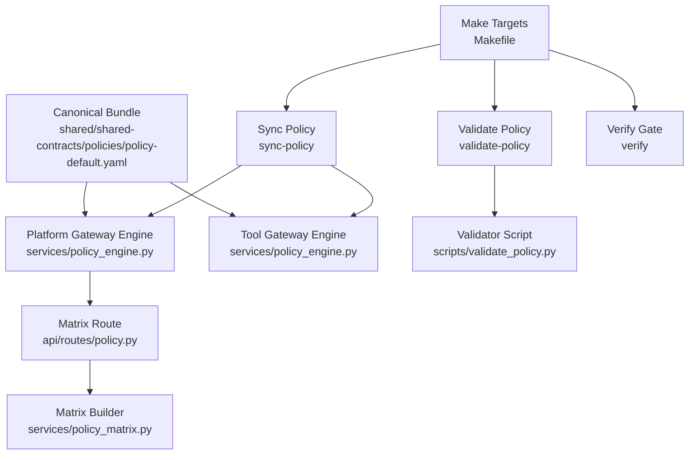
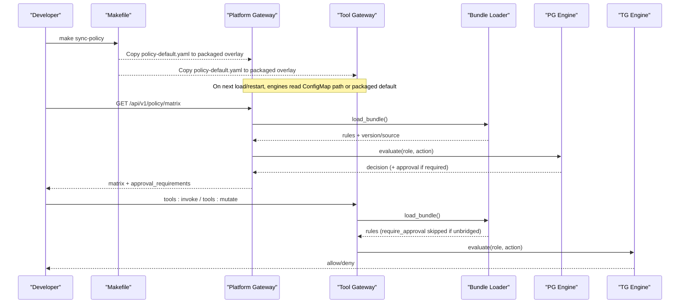
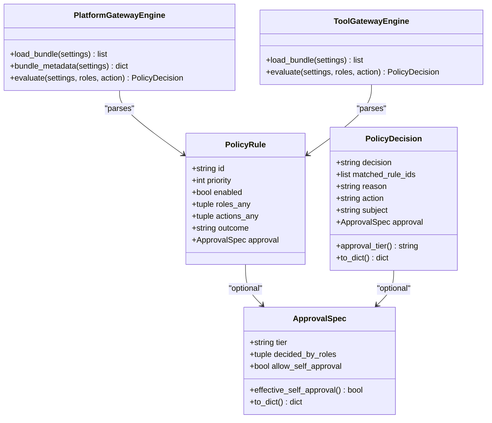
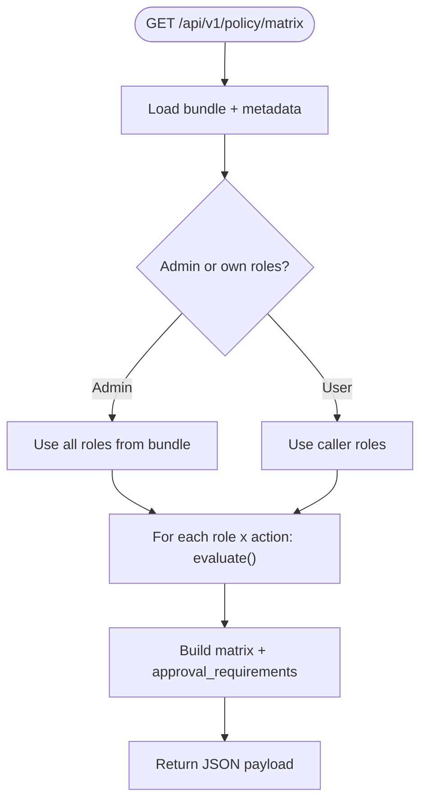
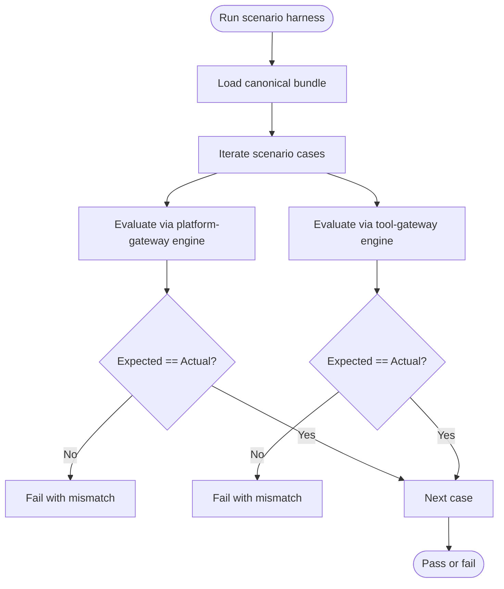
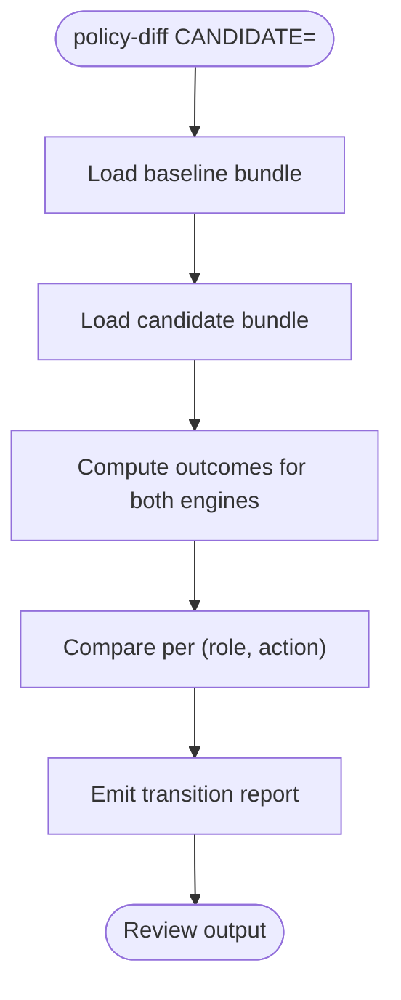
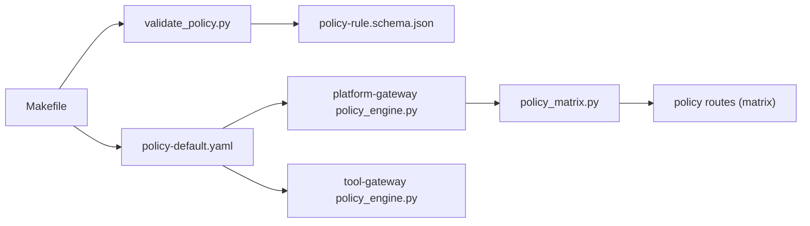

# Policy Rollout Controls Spike

<cite>
**Referenced Files in This Document**
- [policy-rollout-controls-spike.md](file://docs/workspace/policy-rollout-controls-spike.md)
- [policy_engine.py (platform-gateway)](file://products/platform-gateway/src/platform_gateway/services/policy_engine.py)
- [policy_engine.py (tool-gateway)](file://products/tool-gateway/src/tool_gateway/services/policy_engine.py)
- [policy-default.yaml](file://shared/shared-contracts/policies/policy-default.yaml)
- [policy_matrix.py](file://products/platform-gateway/src/platform_gateway/services/policy_matrix.py)
- [policy.py (routes)](file://products/platform-gateway/src/platform_gateway/api/routes/policy.py)
- [Makefile](file://Makefile)
- [validate_policy.py](file://shared/shared-contracts/scripts/validate_policy.py)
- [test_policy_matrix.py](file://products/platform-gateway/tests/test_policy_matrix.py)
</cite>

## Table of Contents
1. [Introduction](#introduction)
2. [Project Structure](#project-structure)
3. [Core Components](#core-components)
4. [Architecture Overview](#architecture-overview)
5. [Detailed Component Analysis](#detailed-component-analysis)
6. [Dependency Analysis](#dependency-analysis)
7. [Performance Considerations](#performance-considerations)
8. [Troubleshooting Guide](#troubleshooting-guide)
9. [Conclusion](#conclusion)
10. [Appendices](#appendices)

## Introduction
This document synthesizes the Policy Rollout Controls Spike into a practical, code-mapped guide for testing and controlling policy rollouts across the platform’s two gateways. It explains how the current evaluation engines work, where the canonical bundle lives, what is currently validated, and how to introduce provenance, scenario-based testing, and impact reporting without staged promotion or hot reload.

## Project Structure
The spike centers on:
- A canonical policy bundle under shared contracts
- Two gateway policy engines that parse and evaluate rules
- A live permission matrix route exposing effective permissions
- Make targets to sync, validate, and verify policy changes

**Diagram sources**
- [policy-default.yaml:1-301](file://shared/shared-contracts/policies/policy-default.yaml#L1-L301)
- [policy_engine.py (platform-gateway):1-419](file://products/platform-gateway/src/platform_gateway/services/policy_engine.py#L1-L419)
- [policy_engine.py (tool-gateway):1-335](file://products/tool-gateway/src/tool_gateway/services/policy_engine.py#L1-L335)
- [policy.py (routes):26-54](file://products/platform-gateway/src/platform_gateway/api/routes/policy.py#L26-L54)
- [policy_matrix.py:1-85](file://products/platform-gateway/src/platform_gateway/services/policy_matrix.py#L1-L85)
- [Makefile:122-158](file://Makefile#L122-L158)
- [validate_policy.py:1-91](file://shared/shared-contracts/scripts/validate_policy.py#L1-L91)

**Section sources**
- [policy-rollout-controls-spike.md:23-58](file://docs/workspace/policy-rollout-controls-spike.md#L23-L58)
- [Makefile:122-158](file://Makefile#L122-L158)

## Core Components
- Canonical policy bundle: single source of truth with versioned rules and explicit deny-by-default semantics.
- Platform gateway engine: evaluates API actions, supports require_approval tiers, and exposes metadata including version/source.
- Tool gateway engine: evaluates tool invocation actions; skips unenforceable require_approval rules at load time.
- Matrix builder and route: derive effective role x action permissions and approval requirements for transparency.
- Validation and sync tooling: schema validation, duplicate ID detection, and synchronized deployment copies.

Key responsibilities:
- Parse and cache bundles per configured path.
- Enforce precedence: deny > require_approval > allow; highest priority within outcome class.
- Render caller-scoped matrix with third-state approval details.
- Provide CI hooks to validate and verify policy integrity.

**Section sources**
- [policy_engine.py (platform-gateway):117-195](file://products/platform-gateway/src/platform_gateway/services/policy_engine.py#L117-L195)
- [policy_engine.py (platform-gateway):318-362](file://products/platform-gateway/src/platform_gateway/services/policy_engine.py#L318-L362)
- [policy_engine.py (tool-gateway):53-137](file://products/tool-gateway/src/tool_gateway/services/policy_engine.py#L53-L137)
- [policy_engine.py (tool-gateway):187-276](file://products/tool-gateway/src/tool_gateway/services/policy_engine.py#L187-L276)
- [policy_matrix.py:1-85](file://products/platform-gateway/src/platform_gateway/services/policy_matrix.py#L1-L85)
- [validate_policy.py:32-86](file://shared/shared-contracts/scripts/validate_policy.py#L32-L86)

## Architecture Overview
Policy changes flow from the canonical bundle through sync targets into both gateways. At runtime, requests are evaluated by the appropriate engine; the platform gateway also exposes a matrix endpoint for transparency.

**Diagram sources**
- [Makefile:122-158](file://Makefile#L122-L158)
- [policy_engine.py (platform-gateway):318-362](file://products/platform-gateway/src/platform_gateway/services/policy_engine.py#L318-L362)
- [policy_engine.py (platform-gateway):365-419](file://products/platform-gateway/src/platform_gateway/services/policy_engine.py#L365-L419)
- [policy_engine.py (tool-gateway):187-276](file://products/tool-gateway/src/tool_gateway/services/policy_engine.py#L187-L276)
- [policy_engine.py (tool-gateway):279-335](file://products/tool-gateway/src/tool_gateway/services/policy_engine.py#L279-L335)
- [policy.py (routes):26-54](file://products/platform-gateway/src/platform_gateway/api/routes/policy.py#L26-L54)
- [policy_matrix.py:31-85](file://products/platform-gateway/src/platform_gateway/services/policy_matrix.py#L31-L85)

## Detailed Component Analysis

### Policy Engines (Platform vs Tool)
Both engines implement deny-by-default with three outcomes and strict parsing. Differences:
- Platform gateway bridges chat:confirm and enforces require_approval via approval workflow.
- Tool gateway has no bridged actions for require_approval; such rules are parsed but skipped at load time with a warning.

**Diagram sources**
- [policy_engine.py (platform-gateway):127-195](file://products/platform-gateway/src/platform_gateway/services/policy_engine.py#L127-L195)
- [policy_engine.py (platform-gateway):318-362](file://products/platform-gateway/src/platform_gateway/services/policy_engine.py#L318-L362)
- [policy_engine.py (platform-gateway):365-419](file://products/platform-gateway/src/platform_gateway/services/policy_engine.py#L365-L419)
- [policy_engine.py (tool-gateway):62-137](file://products/tool-gateway/src/tool_gateway/services/policy_engine.py#L62-L137)
- [policy_engine.py (tool-gateway):187-276](file://products/tool-gateway/src/tool_gateway/services/policy_engine.py#L187-L276)
- [policy_engine.py (tool-gateway):279-335](file://products/tool-gateway/src/tool_gateway/services/policy_engine.py#L279-L335)

**Section sources**
- [policy_engine.py (platform-gateway):29-115](file://products/platform-gateway/src/platform_gateway/services/policy_engine.py#L29-L115)
- [policy_engine.py (tool-gateway):29-51](file://products/tool-gateway/src/tool_gateway/services/policy_engine.py#L29-L51)

### Live Permission Matrix
The matrix route builds a caller-scoped view of effective permissions, mapping require_approval to false in the boolean matrix while surfacing detailed approval requirements separately.

**Diagram sources**
- [policy.py (routes):26-54](file://products/platform-gateway/src/platform_gateway/api/routes/policy.py#L26-L54)
- [policy_matrix.py:31-85](file://products/platform-gateway/src/platform_gateway/services/policy_matrix.py#L31-L85)

**Section sources**
- [policy.py (routes):26-54](file://products/platform-gateway/src/platform_gateway/api/routes/policy.py#L26-L54)
- [policy_matrix.py:1-85](file://products/platform-gateway/src/platform_gateway/services/policy_matrix.py#L1-L85)
- [test_policy_matrix.py:316-340](file://products/platform-gateway/tests/test_policy_matrix.py#L316-L340)

### Bundle Provenance and Versioning
Current state:
- The bundle carries a version field parsed and exposed via metadata.
- No content hash is computed today; the spike recommends adding SHA-256 to provenance surfaces.
- Rollout is ConfigMap mount plus restart; engines cache the bundle keyed on path.

Recommendations aligned with the spike:
- Add computed content hash to bundle metadata and expose it on matrix/readiness surfaces.
- Adopt a documented discipline to bump version on every rule change.
- Keep rollout as ConfigMap + restart; do not add hot reload in this slice.

**Section sources**
- [policy-engine.py (platform-gateway):352-362](file://products/platform-gateway/src/platform_gateway/services/policy_engine.py#L352-L362)
- [policy-rollout-controls-spike.md:40-51](file://docs/workspace/policy-rollout-controls-spike.md#L40-L51)
- [policy-rollout-controls-spike.md:70-80](file://docs/workspace/policy-rollout-controls-spike.md#L70-L80)

### Scenario-Based Testing Harness
Current state:
- Schema validation exists and runs in verify; no scenario expectations exist.
- The spike proposes a curated scenario table asserting expected outcomes for sentinel (role, action) pairs across both engines’ vocabularies.

Recommended shape:
- Place a YAML scenario file beside the canonical bundle.
- Implement a script that imports each engine module and evaluates scenarios against them.
- Fail on unintended grant/deny flips; wire into make verify.

[No diagram sources needed since this diagram shows conceptual workflow, not actual code structure]

**Section sources**
- [policy-rollout-controls-spike.md:82-97](file://docs/workspace/policy-rollout-controls-spike.md#L82-L97)
- [validate_policy.py:32-86](file://shared/shared-contracts/scripts/validate_policy.py#L32-L86)

### Impact Reporting (policy-diff)
Current state:
- No diff tool exists today.
- The spike proposes a command that compares two bundles and emits per (role, action) transitions across both vocabularies.

Recommended shape:
- Reuse engine modules to compute outcomes for both bundles.
- Emit human-readable transitions (allow→deny, allow→require_approval, new grant, removed grant).
- Integrate into review workflows before merge.

[No diagram sources needed since this diagram shows conceptual workflow, not actual code structure]

**Section sources**
- [policy-rollout-controls-spike.md:99-109](file://docs/workspace/policy-rollout-controls-spike.md#L99-L109)

## Dependency Analysis
Coupling and cohesion:
- Both engines depend on their product settings and YAML parsing; they are cohesive around rule evaluation.
- The matrix builder depends on the platform gateway engine and identity context.
- Makefile orchestrates sync and validation; validator script depends on JSON schema.

External integration points:
- Kubernetes ConfigMap mounts policy files at known paths.
- CI uses make verify to enforce tests, overlays, policy validation, and version lockstep.

Potential risks:
- Drift between overlay copies can occur if manual edits bypass sync-policy.
- Require_approval rules on tool-gateway are intentionally non-enforceable; ensure authoring aligns with bridged actions.

**Diagram sources**
- [validate_policy.py:1-91](file://shared/shared-contracts/scripts/validate_policy.py#L1-L91)
- [Makefile:122-158](file://Makefile#L122-L158)
- [policy_engine.py (platform-gateway):1-419](file://products/platform-gateway/src/platform_gateway/services/policy_engine.py#L1-L419)
- [policy_engine.py (tool-gateway):1-335](file://products/tool-gateway/src/tool_gateway/services/policy_engine.py#L1-L335)
- [policy_matrix.py:1-85](file://products/platform-gateway/src/platform_gateway/services/policy_matrix.py#L1-L85)
- [policy.py (routes):26-54](file://products/platform-gateway/src/platform_gateway/api/routes/policy.py#L26-L54)

**Section sources**
- [Makefile:122-158](file://Makefile#L122-L158)
- [policy_rollout_controls_spike.md:23-58](file://docs/workspace/policy-rollout-controls-spike.md#L23-L58)

## Performance Considerations
- Bundle loading is cached per process; changes require restart due to ConfigMap mounting semantics.
- Matrix computation evaluates every role x action combination; keep role/action sets bounded.
- Scenario harness should reuse engine modules to avoid re-parsing bundles multiple times.

[No sources needed since this section provides general guidance]

## Troubleshooting Guide
Common issues and mitigations:
- Missing or invalid bundle path: matrix route returns 503; ensure sync-policy ran and ConfigMap mounted correctly.
- require_approval misconfiguration: platform gateway rejects unbridged require_approval rules; tool gateway logs and skips them.
- Duplicate rule IDs: caught by validator; fix IDs to be unique.
- Drift after deploy: use matrix readiness surface to confirm enforced bundle version/source; plan to add content hash per spike recommendation.

Operational checks:
- Run make verify locally to catch schema and version issues early.
- After deploy, call the matrix endpoint to confirm effective permissions and metadata.

**Section sources**
- [policy.py (routes):26-54](file://products/platform-gateway/src/platform_gateway/api/routes/policy.py#L26-L54)
- [policy_engine.py (platform-gateway):284-299](file://products/platform-gateway/src/platform_gateway/services/policy_engine.py#L284-L299)
- [policy_engine.py (tool-gateway):212-225](file://products/tool-gateway/src/tool_gateway/services/policy_engine.py#L212-L225)
- [validate_policy.py:66-86](file://shared/shared-contracts/scripts/validate_policy.py#L66-L86)
- [test_policy_matrix.py:316-340](file://products/platform-gateway/tests/test_policy_matrix.py#L316-L340)

## Conclusion
The spike identifies a minimal, high-value set of controls to make policy changes testable, reviewable, and verifiable without building a separate policy-center service. By adding provenance, scenario-based testing, and an impact report, operators gain confidence that bundle edits behave as intended before rollout. Staged promotion and hot reload are deferred to a future slice.

[No sources needed since this section summarizes without analyzing specific files]

## Appendices

### Current Workflow Summary
- Edit canonical bundle.
- Run make sync-policy to propagate to all consumers.
- Run make verify (tests, overlays, validate-policy, validate-version).
- Review any policy-diff output (once implemented).
- Deploy and confirm enforced bundle via matrix/readiness surfaces.

**Section sources**
- [Makefile:122-158](file://Makefile#L122-L158)
- [policy-rollout-controls-spike.md:99-109](file://docs/workspace/policy-rollout-controls-spike.md#L99-L109)