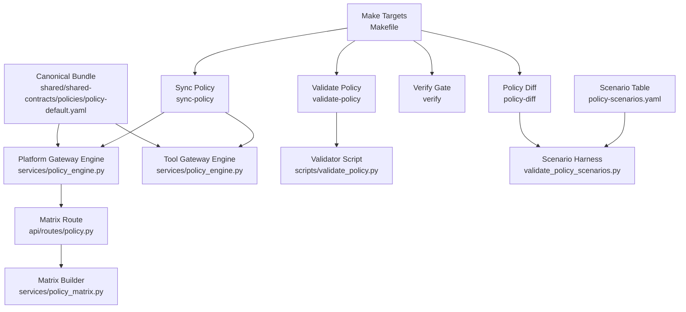
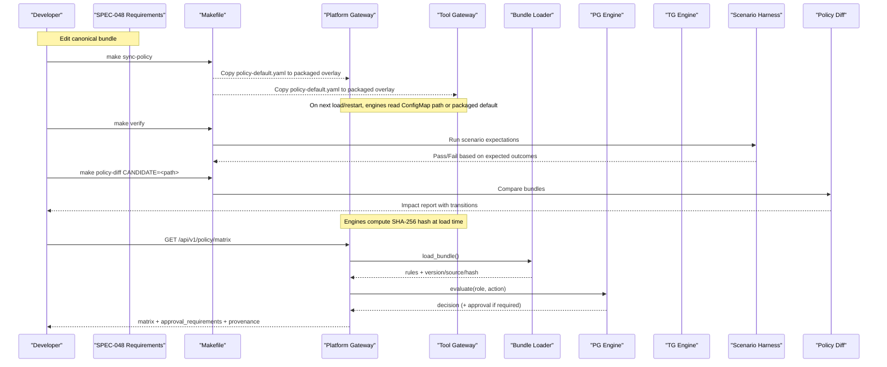
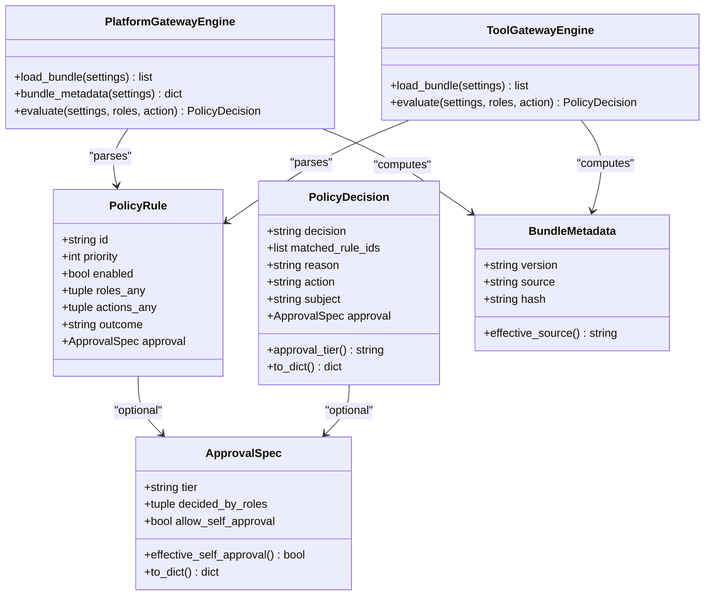
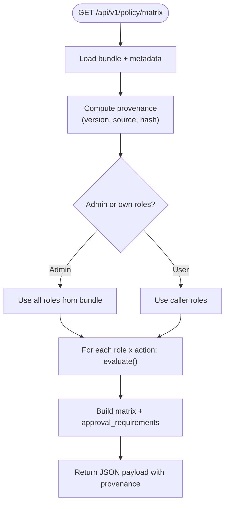
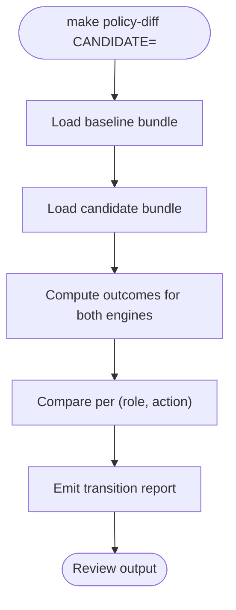
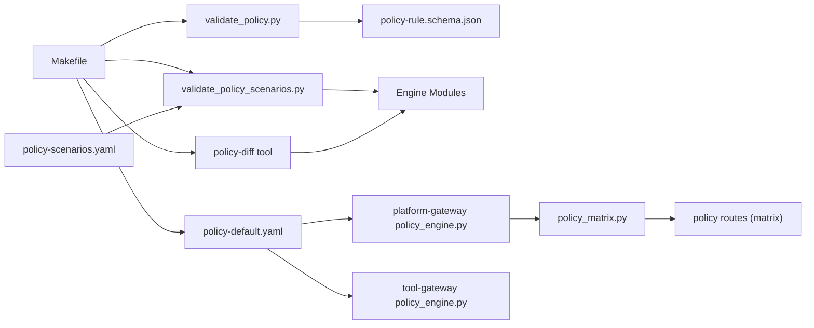

# Policy Rollout Controls Spike

<cite>
**Referenced Files in This Document**
- [policy-rollout-controls-spike.md](file://docs/workspace/policy-rollout-controls-spike.md)
- [SPEC-048 spec.md](file://docs/specs/SPEC-048-policy-testing-rollout-controls/spec.md)
- [policy_engine.py (platform-gateway)](file://products/platform-gateway/src/platform_gateway/services/policy_engine.py)
- [policy_engine.py (tool-gateway)](file://products/tool-gateway/src/tool_gateway/services/policy_engine.py)
- [policy-default.yaml](file://shared/shared-contracts/policies/policy-default.yaml)
- [policy_matrix.py](file://products/platform-gateway/src/platform_gateway/services/policy_matrix.py)
- [policy.py (routes)](file://products/platform-gateway/src/platform_gateway/api/routes/policy.py)
- [Makefile](file://Makefile)
- [validate_policy.py](file://shared/shared-contracts/scripts/validate_policy.py)
- [test_policy_matrix.py](file://products/platform-gateway/tests/test_policy_matrix.py)
- [policy-scenarios.yaml](file://shared/shared-contracts/policies/policy-scenarios.yaml)
</cite>

## Update Summary
**Changes Made**
- Updated to reflect SPEC-048 promotion from spike memo to approved formal specification with concrete implementation requirements
- Enhanced bundle provenance section with SHA-256 content hash implementation details across both engines
- Added scenario-expectation harness specifications and implementation guidance with curated test cases
- Expanded policy-diff impact report requirements and workflow integration
- Updated rollout runbook references and operational procedures
- Clarified out-of-scope items and future promotion triggers based on operator adjudication
- Added comprehensive testing coverage for provenance hash verification

## Table of Contents
1. [Introduction](#introduction)
2. [Project Structure](#project-structure)
3. [Core Components](#core-components)
4. [Architecture Overview](#architecture-overview)
5. [Detailed Component Analysis](#detailed-component-analysis)
6. [Dependency Analysis](#dependency-analysis)
7. [Performance Considerations](#performance-considerations)
8. [Troubleshooting Guide](#troubleshooting-guide)
9. [Conclusion](#conclusion)
10. [Appendices](#appendices)

## Introduction
This document synthesizes the Policy Rollout Controls Spike into a practical, code-mapped guide for testing and controlling policy rollouts across the platform's two gateways. The spike has evolved into **SPEC-048: Policy Testing and Rollout Controls**, an approved formal specification that defines four repo-native, CI-runnable controls: bundle provenance with content hashing, scenario-expectation harnessing, policy-diff impact reporting, and documented rollout procedures. These controls make policy changes testable, reviewable, and verifiable without building a separate policy-center service or introducing staged promotion.

## Project Structure
The implementation centers on:
- A canonical policy bundle under shared contracts with versioned rules and explicit deny-by-default semantics
- Two gateway policy engines that parse and evaluate rules with enhanced metadata exposure
- A live permission matrix route exposing effective permissions with provenance information
- Make targets to sync, validate, verify scenarios, and generate impact reports
- Scenario expectation tables and validation scripts for regression protection

**Diagram sources**
- [policy-default.yaml:1-308](file://shared/shared-contracts/policies/policy-default.yaml#L1-L308)
- [policy_engine.py (platform-gateway):1-433](file://products/platform-gateway/src/platform_gateway/services/policy_engine.py#L1-L433)
- [policy_engine.py (tool-gateway):1-355](file://products/tool-gateway/src/tool_gateway/services/policy_engine.py#L1-L355)
- [policy.py (routes):1-55](file://products/platform-gateway/src/platform_gateway/api/routes/policy.py#L1-L55)
- [policy_matrix.py:1-88](file://products/platform-gateway/src/platform_gateway/services/policy_matrix.py#L1-L88)
- [Makefile:122-178](file://Makefile#L122-L178)
- [validate_policy.py:1-91](file://shared/shared-contracts/scripts/validate_policy.py#L1-L91)

**Section sources**
- [policy-rollout-controls-spike.md:23-58](file://docs/workspace/policy-rollout-controls-spike.md#L23-L58)
- [SPEC-048 spec.md:44-121](file://docs/specs/SPEC-048-policy-testing-rollout-controls/spec.md#L44-L121)
- [Makefile:122-178](file://Makefile#L122-L178)

## Core Components
- **Enhanced bundle provenance**: Both engines now expose SHA-256 content hashes alongside version and source information, computed at load time rather than authored in the bundle
- **Scenario-expectation harness**: Curated YAML table defining expected outcomes for sentinel role-action pairs, preventing silent grant flips during rule edits
- **Policy-diff impact report**: Review-time tooling that compares bundles and emits per-(role, action) outcome transitions across both vocabularies
- **Rollout runbook**: Documented procedure for editing, validating, reviewing, deploying, and confirming policy changes
- **Copy-parity enforcement**: Extended contract tests to include overlay copies, preventing manual drift

Key responsibilities:
- Parse and cache bundles per configured path with enhanced metadata tracking
- Enforce precedence: deny > require_approval > allow; highest priority within outcome class
- Render caller-scoped matrix with third-state approval details and provenance information
- Provide CI hooks to validate schema, scenarios, and verify policy integrity
- Generate human-readable impact reports for review workflows

**Section sources**
- [policy_engine.py (platform-gateway):352-362](file://products/platform-gateway/src/platform_gateway/services/policy_engine.py#L352-L362)
- [policy_engine.py (tool-gateway):279-287](file://products/tool-gateway/src/tool_gateway/services/policy_engine.py#L279-L287)
- [policy_matrix.py:1-88](file://products/platform-gateway/src/platform_gateway/services/policy_matrix.py#L1-L88)
- [SPEC-048 spec.md:46-121](file://docs/specs/SPEC-048-policy-testing-rollout-controls/spec.md#L46-L121)

## Architecture Overview
Policy changes flow through an enhanced pipeline with provenance tracking, scenario validation, and impact assessment before reaching production gateways.

**Diagram sources**
- [SPEC-048 spec.md:46-121](file://docs/specs/SPEC-048-policy-testing-rollout-controls/spec.md#L46-L121)
- [policy_engine.py (platform-gateway):352-362](file://products/platform-gateway/src/platform_gateway/services/policy_engine.py#L352-L362)
- [policy_engine.py (tool-gateway):279-287](file://products/tool-gateway/src/tool_gateway/services/policy_engine.py#L279-L287)
- [policy.py (routes):30-55](file://products/platform-gateway/src/platform_gateway/api/routes/policy.py#L30-L55)
- [Makefile:122-178](file://Makefile#L122-L178)

## Detailed Component Analysis

### Enhanced Policy Engines with Provenance
Both engines implement deny-by-default with three outcomes and strict parsing, now enhanced with content hash computation:

- **Platform gateway engine**: Evaluates API actions, supports require_approval tiers, exposes metadata including version/source/content-hash
- **Tool gateway engine**: Evaluates tool invocation actions; skips unenforceable require_approval rules at load time with warnings
- **Enhanced metadata**: `bundle_metadata()` now includes SHA-256 content hash computed at load time, never authored in bundle

**Diagram sources**
- [policy_engine.py (platform-gateway):131-199](file://products/platform-gateway/src/platform_gateway/services/policy_engine.py#L131-L199)
- [policy_engine.py (platform-gateway):363-376](file://products/platform-gateway/src/platform_gateway/services/policy_engine.py#L363-L376)
- [policy_engine.py (platform-gateway):379-433](file://products/platform-gateway/src/platform_gateway/services/policy_engine.py#L379-L433)
- [policy_engine.py (tool-gateway):66-134](file://products/tool-gateway/src/tool_gateway/services/policy_engine.py#L66-L134)
- [policy_engine.py (tool-gateway):290-297](file://products/tool-gateway/src/tool_gateway/services/policy_engine.py#L290-L297)
- [policy_engine.py (tool-gateway):299-355](file://products/tool-gateway/src/tool_gateway/services/policy_engine.py#L299-L355)

**Section sources**
- [policy_engine.py (platform-gateway):28-116](file://products/platform-gateway/src/platform_gateway/services/policy_engine.py#L28-L116)
- [policy_engine.py (tool-gateway):28-52](file://products/tool-gateway/src/tool_gateway/services/policy_engine.py#L28-L52)
- [SPEC-048 spec.md:46-63](file://docs/specs/SPEC-048-policy-testing-rollout-controls/spec.md#L46-L63)

### Live Permission Matrix with Provenance
The matrix route builds a caller-scoped view of effective permissions, mapping require_approval to false in the boolean matrix while surfacing detailed approval requirements and provenance information separately.

**Diagram sources**
- [policy.py (routes):30-55](file://products/platform-gateway/src/platform_gateway/api/routes/policy.py#L30-L55)
- [policy_matrix.py:31-88](file://products/platform-gateway/src/platform_gateway/services/policy_matrix.py#L31-L88)

**Section sources**
- [policy.py (routes):30-55](file://products/platform-gateway/src/platform_gateway/api/routes/policy.py#L30-L55)
- [policy_matrix.py:1-88](file://products/platform-gateway/src/platform_gateway/services/policy_matrix.py#L1-L88)
- [test_policy_matrix.py:316-340](file://products/platform-gateway/tests/test_policy_matrix.py#L316-L340)

### Bundle Provenance and Content Hashing
**Updated** Enhanced with SPEC-048 requirements for content hash computation and exposure:

Current state:
- The bundle carries a version field parsed and exposed via metadata
- **New**: SHA-256 content hash computed at load time, never authored in bundle
- Hash exposed via `bundle_metadata()` and rendered on matrix/readiness surfaces
- Rollout remains ConfigMap mount plus restart; engines cache bundle keyed on path

Implementation details:
- Content hash is hex digest of exact loaded text, computed during bundle loading
- Version-bump discipline documented: bump version on every rule change
- Git history serves as authority for version management (no monotonicity enforcement)
- Provenance block available under existing `policy:read` gate

**Section sources**
- [policy_engine.py (platform-gateway):352-362](file://products/platform-gateway/src/platform_gateway/services/policy_engine.py#L352-L362)
- [policy_engine.py (tool-gateway):279-287](file://products/tool-gateway/src/tool_gateway/services/policy_engine.py#L279-L287)
- [SPEC-048 spec.md:46-63](file://docs/specs/SPEC-048-policy-testing-rollout-controls/spec.md#L46-L63)
- [policy-rollout-controls-spike.md:70-80](file://docs/workspace/policy-rollout-controls-spike.md#L70-L80)

### Scenario-Based Testing Harness
**Updated** Enhanced with SPEC-048 scenario expectation specifications:

Current state:
- Schema validation exists and runs in verify; no scenario expectations existed previously
- **New**: Curated scenario table (`policy-scenarios.yaml`) beside canonical bundle
- **New**: Validation script evaluates scenarios using exact engine semantics
- **New**: Integrated into `make verify` to prevent unintended grant/deny flips

Recommended shape:
- Place YAML scenario file beside canonical bundle with expected outcomes for sentinel (role, action) pairs
- Every grant in canonical bundle covered by at least one expectation plus deliberate denials
- Script imports both engine modules to evaluate scenarios against their respective vocabularies
- Fail on unintended grant/deny flips; wire into make verify for CI protection

[No diagram sources needed since this diagram shows conceptual workflow, not actual code structure]

**Section sources**
- [SPEC-048 spec.md:65-90](file://docs/specs/SPEC-048-policy-testing-rollout-controls/spec.md#L65-L90)
- [policy-rollout-controls-spike.md:82-97](file://docs/workspace/policy-rollout-controls-spike.md#L82-L97)
- [validate_policy.py:32-86](file://shared/shared-contracts/scripts/validate_policy.py#L32-L86)
- [policy-scenarios.yaml:1-232](file://shared/shared-contracts/policies/policy-scenarios.yaml#L1-L232)

### Impact Reporting (policy-diff)
**Updated** Enhanced with SPEC-048 impact report specifications:

Current state:
- **New**: `make policy-diff CANDIDATE=<path>` target for comparing bundles
- **New**: Per-(role, action) outcome transition reporting across both vocabularies
- **New**: Human-readable transitions (allow→deny, allow→require_approval, new grant, removed grant)
- **New**: Integration into review workflows before merge

Implementation details:
- Reuses engine modules to compute outcomes for both baseline and candidate bundles
- Same evaluation path as scenario harness - one shared implementation
- Missing candidate path or unparseable candidate results in hard error
- Canonical bundle never modified by the tool

[No diagram sources needed since this diagram shows conceptual workflow, not actual code structure]

**Section sources**
- [SPEC-048 spec.md:91-105](file://docs/specs/SPEC-048-policy-testing-rollout-controls/spec.md#L91-L105)
- [policy-rollout-controls-spike.md:99-109](file://docs/workspace/policy-rollout-controls-spike.md#L99-L109)

### Rollout Runbook and Operational Procedures
**Updated** Enhanced with SPEC-048 rollout procedures:

Current state:
- **New**: Documented rollout runbook in configuration reference
- **New**: Explicit restart posture documentation (bundles cached keyed on path)
- **New**: Hot reload deliberately absent from scope
- **New**: Verified deployment confirmation via provenance hash on matrix/readiness surfaces

Operational workflow:
1. Edit canonical bundle
2. Run `make sync-policy` to propagate changes
3. Run `make verify` (schema validation + scenario guard)
4. Run `make policy-diff` for review-time impact assessment
5. Commit changes with explicit intent
6. Deploy and confirm enforced bundle via provenance hash
7. Verify hash matches intended commit on matrix/readiness surfaces

**Section sources**
- [SPEC-048 spec.md:106-115](file://docs/specs/SPEC-048-policy-testing-rollout-controls/spec.md#L106-L115)
- [policy-rollout-controls-spike.md:107-109](file://docs/workspace/policy-rollout-controls-spike.md#L107-L109)

## Dependency Analysis
**Updated** Enhanced with SPEC-048 dependencies and coupling:

Coupling and cohesion:
- Both engines depend on their product settings and YAML parsing; they are cohesive around rule evaluation with enhanced metadata
- The matrix builder depends on the platform gateway engine and identity context
- Scenario harness depends on importing both engine modules (deliberate coupling to ensure contract parity)
- Policy-diff tool shares implementation with scenario harness for consistent evaluation
- Makefile orchestrates sync, validation, verification, and diff generation

External integration points:
- Kubernetes ConfigMap mounts policy files at known paths
- CI uses make verify to enforce tests, overlays, policy validation, scenario checks, and version lockstep
- Overlay copies maintained with parity tests to prevent manual drift

Potential risks:
- Drift between overlay copies can occur if manual edits bypass sync-policy (now protected by parity tests)
- Require_approval rules on tool-gateway are intentionally non-enforceable; ensure authoring aligns with bridged actions
- Scenario table maintenance requires careful curation to avoid becoming stale

**Diagram sources**
- [validate_policy.py:1-91](file://shared/shared-contracts/scripts/validate_policy.py#L1-L91)
- [SPEC-048 spec.md:65-105](file://docs/specs/SPEC-048-policy-testing-rollout-controls/spec.md#L65-L105)
- [Makefile:122-178](file://Makefile#L122-L178)
- [policy_engine.py (platform-gateway):1-433](file://products/platform-gateway/src/platform_gateway/services/policy_engine.py#L1-L433)
- [policy_engine.py (tool-gateway):1-355](file://products/tool-gateway/src/tool_gateway/services/policy_engine.py#L1-L355)
- [policy_matrix.py:1-88](file://products/platform-gateway/src/platform_gateway/services/policy_matrix.py#L1-L88)
- [policy.py (routes):30-55](file://products/platform-gateway/src/platform_gateway/api/routes/policy.py#L30-L55)

**Section sources**
- [SPEC-048 spec.md:116-187](file://docs/specs/SPEC-048-policy-testing-rollout-controls/spec.md#L116-L187)
- [Makefile:122-178](file://Makefile#L122-L178)
- [policy_rollout_controls_spike.md:23-58](file://docs/workspace/policy-rollout-controls-spike.md#L23-L58)

## Performance Considerations
- Bundle loading is cached per process; changes require restart due to ConfigMap mounting semantics
- Matrix computation evaluates every role x action combination; keep role/action sets bounded
- Scenario harness reuses engine modules to avoid re-parsing bundles multiple times
- Policy-diff tool computes outcomes for both bundles but only runs during review, not runtime
- Content hash computation adds minimal overhead during bundle load (single SHA-256 operation)

[No sources needed since this section provides general guidance]

## Troubleshooting Guide
**Updated** Enhanced with SPEC-048 troubleshooting scenarios:

Common issues and mitigations:
- Missing or invalid bundle path: matrix route returns 503; ensure sync-policy ran and ConfigMap mounted correctly
- require_approval misconfiguration: platform gateway rejects unbridged require_approval rules; tool gateway logs and skips them
- Duplicate rule IDs: caught by validator; fix IDs to be unique
- Drift after deploy: use matrix readiness surface to confirm enforced bundle version/source/hash; plan to add content hash per SPEC-048
- Scenario failures: indicates unintended grant/deny flip; edit scenario expectations in same commit as policy changes
- Policy-diff errors: missing candidate path or unparseable bundle; verify file path and syntax

Operational checks:
- Run make verify locally to catch schema, scenario, and version issues early
- After deploy, call the matrix endpoint to confirm effective permissions and provenance hash
- Use policy-diff to review impact before merging policy changes
- Confirm deployed bundle hash matches intended commit via matrix/readiness surfaces

**Section sources**
- [policy.py (routes):30-55](file://products/platform-gateway/src/platform_gateway/api/routes/policy.py#L30-L55)
- [policy_engine.py (platform-gateway):284-299](file://products/platform-gateway/src/platform_gateway/services/policy_engine.py#L284-L299)
- [policy_engine.py (tool-gateway):212-225](file://products/tool-gateway/src/tool_gateway/services/policy_engine.py#L212-L225)
- [validate_policy.py:66-86](file://shared/shared-contracts/scripts/validate_policy.py#L66-L86)
- [test_policy_matrix.py:316-340](file://products/platform-gateway/tests/test_policy_matrix.py#L316-L340)
- [SPEC-048 spec.md:102-105](file://docs/specs/SPEC-048-policy-testing-rollout-controls/spec.md#L102-L105)

## Conclusion
The spike has successfully evolved into **SPEC-048: Policy Testing and Rollout Controls**, providing a comprehensive set of repo-native, CI-runnable controls that make policy changes testable, reviewable, and verifiable. The specification defines four key deliverables: bundle provenance with content hashing, scenario-expectation harnessing, policy-diff impact reporting, and documented rollout procedures. These controls close the gap between policy authoring and safe deployment without requiring a separate policy-center service, staged promotion, or hot reload capabilities. The implementation maintains backward compatibility while adding significant operational confidence for policy management.

[No sources needed since this section summarizes without analyzing specific files]

## Appendices

### Current Workflow Summary
**Updated** Enhanced with SPEC-048 workflow steps:

- Edit canonical bundle
- Run `make sync-policy` to propagate to all consumers
- Run `make verify` (tests, overlays, validate-policy, scenario guard, validate-version)
- Run `make policy-diff CANDIDATE=<path>` for review-time impact assessment
- Review any policy-diff output and scenario failures
- Commit changes with explicit intent
- Deploy and confirm enforced bundle via provenance hash on matrix/readiness surfaces

**Section sources**
- [Makefile:122-178](file://Makefile#L122-L178)
- [SPEC-048 spec.md:106-115](file://docs/specs/SPEC-048-policy-testing-rollout-controls/spec.md#L106-L115)
- [policy-rollout-controls-spike.md:99-109](file://docs/workspace/policy-rollout-controls-spike.md#L99-L109)

### Out-of-Scope Items and Future Promotions
**Updated** Based on SPEC-048 design decisions:

Deliberately out of scope for this slice:
- Staged promotion (staging vs production bundles)
- Hot reload/reload endpoints
- Policy-center service
- Change windows
- New audit event types
- Bundle-lifecycle audit events
- Portal rendering of provenance block
- Version monotonicity enforcement

Future promotion triggers:
- First operator ask for audited bundle lifecycle
- First observed version drift requiring enforcement
- First operator request for portal Settings rendering
- Policy-center service development when ready

**Section sources**
- [SPEC-048 spec.md:191-205](file://docs/specs/SPEC-048-policy-testing-rollout-controls/spec.md#L191-L205)
- [policy-rollout-controls-spike.md:111-118](file://docs/workspace/policy-rollout-controls-spike.md#L111-L118)