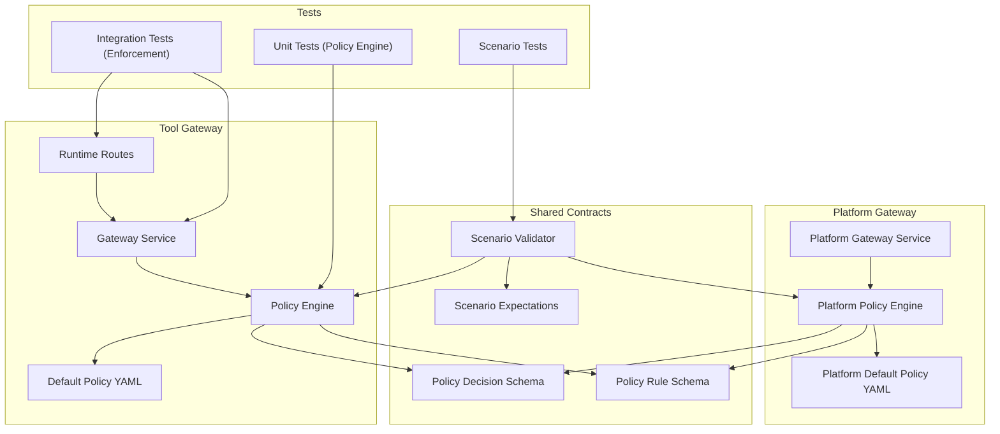
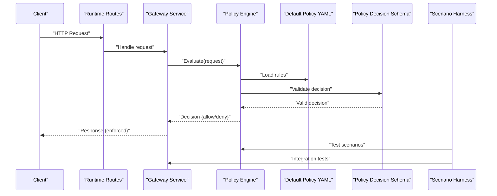
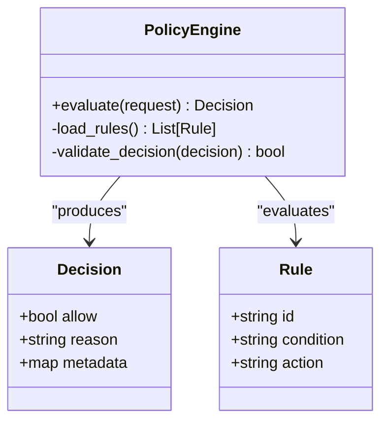
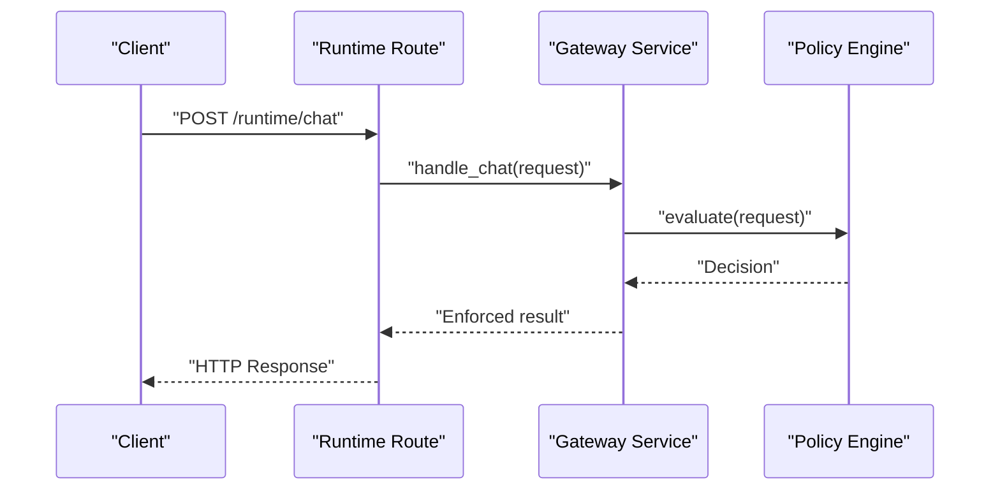
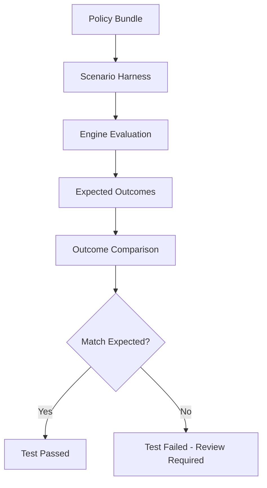
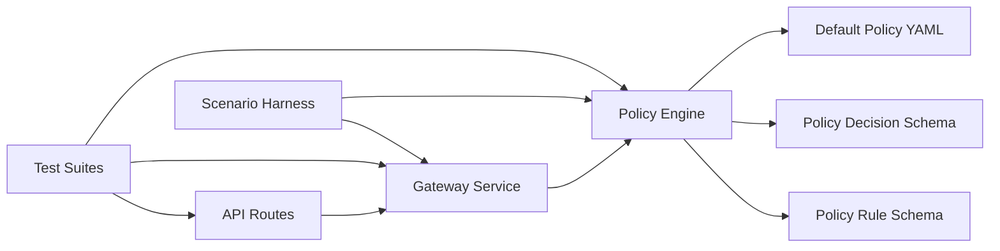

# Policy Testing and Validation

<cite>
**Referenced Files in This Document**
- [policy-engine.py](file://products/tool-gateway/src/tool_gateway/services/policy_engine.py)
- [policy-engine.py](file://products/platform-gateway/src/platform_gateway/services/policy_engine.py)
- [test_policy_engine.py](file://products/tool-gateway/tests/test_policy_engine.py)
- [test_policy_engine.py](file://products/platform-gateway/tests/test_policy_engine.py)
- [gateway_service.py](file://products/tool-gateway/src/tool_gateway/services/gateway_service.py)
- [routes.py](file://products/tool-gateway/src/tool_gateway/api/routes/runtime.py)
- [policy-default.yaml](file://products/tool-gateway/src/tool_gateway/policies/policy-default.yaml)
- [policy-default.yaml](file://products/platform-gateway/src/platform_gateway/policies/policy-default.yaml)
- [policy-decision.schema.json](file://shared/shared-contracts/schemas/policy-decision.schema.json)
- [policy-rule.schema.json](file://shared/shared-contracts/schemas/policy-rule.schema.json)
- [validate_policy.py](file://shared/shared-contracts/scripts/validate_policy.py)
- [Makefile](file://Makefile)
- [SPEC-048-policy-testing-rollout-controls/spec.md](file://docs/specs/SPEC-048-policy-testing-rollout-controls/spec.md)
- [deploy.sh](file://shared/platform-ops/gitops/dev-k8s/deploy.sh)
- [kustomization.yaml](file://shared/platform-ops/gitops/dev-k8s/kustomization.yaml)
- [pyproject.toml](file://products/tool-gateway/pyproject.toml)
</cite>

## Update Summary
**Changes Made**
- Added SPEC-048 scenario-expectation harness integration into make verify workflow
- Enhanced policy validation tools with scenario testing capabilities
- Updated continuous integration setup to include scenario validation
- Added new sections for scenario-expectation harness and enhanced validation tools
- Updated troubleshooting guidance for scenario test failures

## Table of Contents
1. [Introduction](#introduction)
2. [Project Structure](#project-structure)
3. [Core Components](#core-components)
4. [Architecture Overview](#architecture-overview)
5. [Detailed Component Analysis](#detailed-component-analysis)
6. [Dependency Analysis](#dependency-analysis)
7. [Performance Considerations](#performance-considerations)
8. [Troubleshooting Guide](#troubleshooting-guide)
9. [Conclusion](#conclusion)
10. [Appendices](#appendices)

## Introduction
This document explains how to test and validate policies in the Luban AIOps platform. It covers the policy testing framework, creating test cases, assertion methods, unit tests for custom policies, integration tests for policy evaluation, and end-to-end tests for enforcement. It also documents validation tools, schema validation, static analysis techniques, performance and load testing approaches, benchmarking methodologies, continuous integration setup, automated validation pipelines, quality gates, and troubleshooting guidance.

**Updated** Added comprehensive scenario-expectation harness integration as specified in SPEC-048, providing automated policy testing capabilities that prevent silent permission changes during policy updates.

## Project Structure
Policy-related code and tests are primarily located under the tool-gateway and platform-gateway products:
- Policy engine implementations and default policy configurations
- Gateway services that integrate policy evaluation into request handling
- API routes that trigger policy checks
- Test suites for policy engine behavior and end-to-end enforcement
- Shared schemas defining policy decision and rule structures
- Scenario-expectation harness for automated policy validation
- Platform ops scripts for deployment and environment setup

**Diagram sources**
- [gateway_service.py](file://products/tool-gateway/src/tool_gateway/services/gateway_service.py)
- [policy-engine.py](file://products/tool-gateway/src/tool_gateway/services/policy_engine.py)
- [policy-engine.py](file://products/platform-gateway/src/platform_gateway/services/policy_engine.py)
- [routes.py](file://products/tool-gateway/src/tool_gateway/api/routes/runtime.py)
- [policy-default.yaml](file://products/tool-gateway/src/tool_gateway/policies/policy-default.yaml)
- [policy-default.yaml](file://products/platform-gateway/src/platform_gateway/policies/policy-default.yaml)
- [policy-decision.schema.json](file://shared/shared-contracts/schemas/policy-decision.schema.json)
- [policy-rule.schema.json](file://shared/shared-contracts/schemas/policy-rule.schema.json)
- [validate_policy.py](file://shared/shared-contracts/scripts/validate_policy.py)
- [test_policy_engine.py](file://products/tool-gateway/tests/test_policy_engine.py)
- [test_policy_engine.py](file://products/platform-gateway/tests/test_policy_engine.py)

**Section sources**
- [policy-engine.py](file://products/tool-gateway/src/tool_gateway/services/policy_engine.py)
- [policy-engine.py](file://products/platform-gateway/src/platform_gateway/services/policy_engine.py)
- [gateway_service.py](file://products/tool-gateway/src/tool_gateway/services/gateway_service.py)
- [routes.py](file://products/tool-gateway/src/tool_gateway/api/routes/runtime.py)
- [policy-default.yaml](file://products/tool-gateway/src/tool_gateway/policies/policy-default.yaml)
- [policy-default.yaml](file://products/platform-gateway/src/platform_gateway/policies/policy-default.yaml)
- [policy-decision.schema.json](file://shared/shared-contracts/schemas/policy-decision.schema.json)
- [policy-rule.schema.json](file://shared/shared-contracts/schemas/policy-rule.schema.json)
- [validate_policy.py](file://shared/shared-contracts/scripts/validate_policy.py)
- [test_policy_engine.py](file://products/tool-gateway/tests/test_policy_engine.py)
- [test_policy_engine.py](file://products/platform-gateway/tests/test_policy_engine.py)

## Core Components
- Policy Engines: Evaluate requests against policy rules and return decisions conforming to the shared schema
- Gateway Services: Integrate policy evaluation into request processing, enforcing allow/deny outcomes
- API Routes: Expose endpoints that trigger policy checks as part of runtime operations
- Default Policies: YAML-based policy configurations used by engines during evaluation
- Schemas: JSON schemas defining the structure of policy decisions and rules for validation and static analysis
- Scenario-Expectation Harness: Automated testing framework that validates policy behavior against expected outcomes
- Validation Scripts: Tools for schema validation and scenario testing

Key responsibilities:
- Policy Engines: Load rules, evaluate conditions, produce standardized decisions
- Gateway Services: Orchestrate request flow, invoke policy engines, enforce decisions
- API Routes: Map HTTP endpoints to gateway handlers with policy checks
- Scenario Harness: Validate policy behavior against curated scenarios to prevent unintended permission changes
- Tests: Validate engine logic, integration flows, and end-to-end enforcement behaviors

**Section sources**
- [policy-engine.py](file://products/tool-gateway/src/tool_gateway/services/policy_engine.py)
- [policy-engine.py](file://products/platform-gateway/src/platform_gateway/services/policy_engine.py)
- [gateway_service.py](file://products/tool-gateway/src/tool_gateway/services/gateway_service.py)
- [routes.py](file://products/tool-gateway/src/tool_gateway/api/routes/runtime.py)
- [policy-default.yaml](file://products/tool-gateway/src/tool_gateway/policies/policy-default.yaml)
- [policy-default.yaml](file://products/platform-gateway/src/platform_gateway/policies/policy-default.yaml)
- [policy-decision.schema.json](file://shared/shared-contracts/schemas/policy-decision.schema.json)
- [policy-rule.schema.json](file://shared/shared-contracts/schemas/policy-rule.schema.json)
- [validate_policy.py](file://shared/shared-contracts/scripts/validate_policy.py)

## Architecture Overview
The policy evaluation architecture integrates tightly with the gateway's request lifecycle. Requests enter through API routes, which delegate to gateway services. The gateway services invoke policy engines to evaluate requests against configured policies. The engines load rules from default policy files and produce decision objects validated against shared schemas. The gateways enforce decisions by allowing or denying requests.

**Updated** The architecture now includes a scenario-expectation harness that runs during `make verify` to ensure no policy changes silently flip operator-visible grants.

**Diagram sources**
- [routes.py](file://products/tool-gateway/src/tool_gateway/api/routes/runtime.py)
- [gateway_service.py](file://products/tool-gateway/src/tool_gateway/services/gateway_service.py)
- [policy-engine.py](file://products/tool-gateway/src/tool_gateway/services/policy_engine.py)
- [policy-engine.py](file://products/platform-gateway/src/platform_gateway/services/policy_engine.py)
- [policy-default.yaml](file://products/tool-gateway/src/tool_gateway/policies/policy-default.yaml)
- [policy-default.yaml](file://products/platform-gateway/src/platform_gateway/policies/policy-default.yaml)
- [policy-decision.schema.json](file://shared/shared-contracts/schemas/policy-decision.schema.json)
- [validate_policy.py](file://shared/shared-contracts/scripts/validate_policy.py)

## Detailed Component Analysis

### Policy Engines
The policy engines are responsible for loading policy rules, evaluating them against incoming requests, and producing standardized decisions. They validate outputs against the policy decision schema to ensure consistency across the platform.

**Diagram sources**
- [policy-engine.py](file://products/tool-gateway/src/tool_gateway/services/policy_engine.py)
- [policy-engine.py](file://products/platform-gateway/src/platform_gateway/services/policy_engine.py)
- [policy-decision.schema.json](file://shared/shared-contracts/schemas/policy-decision.schema.json)
- [policy-rule.schema.json](file://shared/shared-contracts/schemas/policy-rule.schema.json)

**Section sources**
- [policy-engine.py](file://products/tool-gateway/src/tool_gateway/services/policy_engine.py)
- [policy-engine.py](file://products/platform-gateway/src/platform_gateway/services/policy_engine.py)
- [policy-decision.schema.json](file://shared/shared-contracts/schemas/policy-decision.schema.json)
- [policy-rule.schema.json](file://shared/shared-contracts/schemas/policy-rule.schema.json)

### Gateway Service Integration
The gateway services orchestrate request handling and integrate policy evaluation. They call the policy engines and enforce the resulting decisions by either proceeding with the request or rejecting it.

**Diagram sources**
- [gateway_service.py](file://products/tool-gateway/src/tool_gateway/services/gateway_service.py)
- [policy-engine.py](file://products/tool-gateway/src/tool_gateway/services/policy_engine.py)
- [policy-engine.py](file://products/platform-gateway/src/platform_gateway/services/policy_engine.py)

**Section sources**
- [gateway_service.py](file://products/tool-gateway/src/tool_gateway/services/gateway_service.py)
- [policy-engine.py](file://products/tool-gateway/src/tool_gateway/services/policy_engine.py)
- [policy-engine.py](file://products/platform-gateway/src/platform_gateway/services/policy_engine.py)

### API Routes Triggering Policy Checks
API routes expose endpoints that initiate policy checks as part of their processing pipeline. They delegate to the gateway service, which then invokes the policy engine.

**Diagram sources**
- [routes.py](file://products/tool-gateway/src/tool_gateway/api/routes/runtime.py)
- [gateway_service.py](file://products/tool-gateway/src/tool_gateway/services/gateway_service.py)
- [policy-engine.py](file://products/tool-gateway/src/tool_gateway/services/policy_engine.py)
- [policy-engine.py](file://products/platform-gateway/src/platform_gateway/services/policy_engine.py)

**Section sources**
- [routes.py](file://products/tool-gateway/src/tool_gateway/api/routes/runtime.py)
- [gateway_service.py](file://products/tool-gateway/src/tool_gateway/services/gateway_service.py)
- [policy-engine.py](file://products/tool-gateway/src/tool_gateway/services/policy_engine.py)
- [policy-engine.py](file://products/platform-gateway/src/platform_gateway/services/policy_engine.py)

### Unit Tests for Custom Policies
Unit tests focus on validating the policy engines' logic in isolation. They typically mock external dependencies and assert that the engines return correct decisions for various inputs.

Common patterns:
- Mock policy rule loaders and return controlled rule sets
- Assert decision fields match expected values
- Verify error handling for malformed inputs or missing rules

Example test scenarios:
- Valid request allowed by default policy
- Request denied due to explicit deny rule
- Edge case: empty request payload
- Edge case: unsupported operation type

**Section sources**
- [test_policy_engine.py](file://products/tool-gateway/tests/test_policy_engine.py)
- [test_policy_engine.py](file://products/platform-gateway/tests/test_policy_engine.py)
- [policy-engine.py](file://products/tool-gateway/src/tool_gateway/services/policy_engine.py)
- [policy-engine.py](file://products/platform-gateway/src/platform_gateway/services/policy_engine.py)

### Integration Tests for Policy Evaluation
Integration tests verify that the gateway services correctly integrate with the policy engines and enforce decisions within the request lifecycle.

Typical approach:
- Use test clients to send HTTP requests to API routes
- Assert responses reflect policy decisions
- Validate side effects (e.g., metrics, logs)

Example scenarios:
- Successful chat request allowed by policy
- Denied request returns appropriate error
- Policy change reflected in subsequent requests

**Section sources**
- [test_policy_engine.py](file://products/tool-gateway/tests/test_policy_engine.py)
- [test_policy_engine.py](file://products/platform-gateway/tests/test_policy_engine.py)
- [gateway_service.py](file://products/tool-gateway/src/tool_gateway/services/gateway_service.py)
- [routes.py](file://products/tool-gateway/src/tool_gateway/api/routes/runtime.py)

### End-to-End Tests for Policy Enforcement
End-to-end tests simulate real-world usage by deploying components and exercising full request flows through the system. These tests validate that policy enforcement works across all layers.

Approach:
- Deploy services using platform ops scripts
- Send realistic payloads via API clients
- Assert enforcement behavior and observability signals

Example scenarios:
- Multi-step workflow with conditional policy checks
- High-load scenario with concurrent requests
- Policy update hot-reload and enforcement continuity

**Section sources**
- [deploy.sh](file://shared/platform-ops/gitops/dev-k8s/deploy.sh)
- [kustomization.yaml](file://shared/platform-ops/gitops/dev-k8s/kustomization.yaml)
- [test_policy_engine.py](file://products/tool-gateway/tests/test_policy_engine.py)
- [test_policy_engine.py](file://products/platform-gateway/tests/test_policy_engine.py)

### Scenario-Expectation Harness
**New** The scenario-expectation harness provides automated policy testing capabilities that prevent silent permission changes during policy updates. This harness is integrated into the `make verify` workflow and evaluates the canonical bundle against curated scenarios using the exact engine semantics.

Key features:
- Curated scenario table defining expected outcomes for sentinel role-action pairs
- Evaluation using actual engine modules (no re-implementation)
- Coverage of every grant in the canonical bundle plus deliberate denials
- Integration with `make verify` to fail if expectations are violated
- Support for both platform-gateway and tool-gateway vocabularies

**Diagram sources**
- [validate_policy.py](file://shared/shared-contracts/scripts/validate_policy.py)
- [policy-engine.py](file://products/tool-gateway/src/tool_gateway/services/policy_engine.py)
- [policy-engine.py](file://products/platform-gateway/src/platform_gateway/services/policy_engine.py)
- [Makefile](file://Makefile)

**Section sources**
- [validate_policy.py](file://shared/shared-contracts/scripts/validate_policy.py)
- [policy-engine.py](file://products/tool-gateway/src/tool_gateway/services/policy_engine.py)
- [policy-engine.py](file://products/platform-gateway/src/platform_gateway/services/policy_engine.py)
- [Makefile](file://Makefile)
- [SPEC-048-policy-testing-rollout-controls/spec.md](file://docs/specs/SPEC-048-policy-testing-rollout-controls/spec.md)

## Dependency Analysis
Policy evaluation depends on several internal and external components:
- Internal: Gateway services, API routes, default policy YAML files
- External: Shared schemas for validation, platform ops for deployment
- New: Scenario-expectation harness for automated testing

**Diagram sources**
- [routes.py](file://products/tool-gateway/src/tool_gateway/api/routes/runtime.py)
- [gateway_service.py](file://products/tool-gateway/src/tool_gateway/services/gateway_service.py)
- [policy-engine.py](file://products/tool-gateway/src/tool_gateway/services/policy_engine.py)
- [policy-engine.py](file://products/platform-gateway/src/platform_gateway/services/policy_engine.py)
- [policy-default.yaml](file://products/tool-gateway/src/tool_gateway/policies/policy-default.yaml)
- [policy-default.yaml](file://products/platform-gateway/src/platform_gateway/policies/policy-default.yaml)
- [policy-decision.schema.json](file://shared/shared-contracts/schemas/policy-decision.schema.json)
- [policy-rule.schema.json](file://shared/shared-contracts/schemas/policy-rule.schema.json)
- [validate_policy.py](file://shared/shared-contracts/scripts/validate_policy.py)
- [test_policy_engine.py](file://products/tool-gateway/tests/test_policy_engine.py)
- [test_policy_engine.py](file://products/platform-gateway/tests/test_policy_engine.py)

**Section sources**
- [routes.py](file://products/tool-gateway/src/tool_gateway/api/routes/runtime.py)
- [gateway_service.py](file://products/tool-gateway/src/tool_gateway/services/gateway_service.py)
- [policy-engine.py](file://products/tool-gateway/src/tool_gateway/services/policy_engine.py)
- [policy-engine.py](file://products/platform-gateway/src/platform_gateway/services/policy_engine.py)
- [policy-default.yaml](file://products/tool-gateway/src/tool_gateway/policies/policy-default.yaml)
- [policy-default.yaml](file://products/platform-gateway/src/platform_gateway/policies/policy-default.yaml)
- [policy-decision.schema.json](file://shared/shared-contracts/schemas/policy-decision.schema.json)
- [policy-rule.schema.json](file://shared/shared-contracts/schemas/policy-rule.schema.json)
- [validate_policy.py](file://shared/shared-contracts/scripts/validate_policy.py)
- [test_policy_engine.py](file://products/tool-gateway/tests/test_policy_engine.py)
- [test_policy_engine.py](file://products/platform-gateway/tests/test_policy_engine.py)

## Performance Considerations
- Policy Engine Efficiency: Minimize rule parsing overhead by caching loaded rules; avoid repeated I/O during evaluation
- Schema Validation Cost: Validate only when necessary; consider lazy validation for large payloads
- Concurrency: Ensure thread-safe evaluation and decision generation under concurrent requests
- Memory Usage: Avoid loading entire policy files into memory repeatedly; use streaming or incremental parsing where possible
- Benchmarking: Measure latency and throughput under varying load profiles; track p50, p95, p99 latencies
- **Updated** Scenario Testing Performance: Optimize scenario evaluation to run efficiently during CI/CD without excessive resource consumption

## Troubleshooting Guide
Common issues and resolutions:
- Policy Decision Schema Mismatch: Validate decision objects against the shared schema; check field types and required keys
- Rule Loading Failures: Verify default policy YAML syntax and accessibility; ensure environment paths are correct
- Gateway Integration Errors: Inspect request context propagation; confirm policy engine invocation and error handling
- Test Flakiness: Stabilize mocks and fixtures; isolate external dependencies; add retries for transient failures
- Performance Degradation: Profile policy evaluation paths; identify bottlenecks in rule matching or schema validation
- **Updated** Scenario Test Failures: Review scenario expectations against policy changes; ensure all grants are covered by at least one expectation; verify deliberate denials are properly tested
- **Updated** Make Verify Failures: Check scenario-expectation harness output; review policy diff reports; ensure policy bundle changes are accompanied by updated expectations

**Section sources**
- [policy-decision.schema.json](file://shared/shared-contracts/schemas/policy-decision.schema.json)
- [policy-rule.schema.json](file://shared/shared-contracts/schemas/policy-rule.schema.json)
- [policy-default.yaml](file://products/tool-gateway/src/tool_gateway/policies/policy-default.yaml)
- [policy-default.yaml](file://products/platform-gateway/src/platform_gateway/policies/policy-default.yaml)
- [gateway_service.py](file://products/tool-gateway/src/tool_gateway/services/gateway_service.py)
- [policy-engine.py](file://products/tool-gateway/src/tool_gateway/services/policy_engine.py)
- [policy-engine.py](file://products/platform-gateway/src/platform_gateway/services/policy_engine.py)
- [validate_policy.py](file://shared/shared-contracts/scripts/validate_policy.py)
- [Makefile](file://Makefile)

## Conclusion
The Luban AIOps platform provides a robust policy testing and validation framework centered around the policy engines, gateway integration, and shared schemas. The addition of the scenario-expectation harness significantly enhances the testing capabilities, ensuring that policy changes cannot silently alter operator-visible permissions. By following the outlined unit, integration, end-to-end, and scenario testing strategies, teams can ensure policies are correctly evaluated and enforced. Adhering to schema validation, static analysis, and performance best practices further strengthens reliability and scalability.

**Updated** The SPEC-048 enhancements provide comprehensive policy testing capabilities that integrate seamlessly into the existing development workflow, making policy management safer and more predictable.

## Appendices

### Continuous Integration Setup
- Automated Pipelines: Configure CI to run unit and integration tests on every commit; gate merges on passing tests
- Quality Gates: Enforce code coverage thresholds, schema validation checks, and policy linting
- Deployment Validation: Use platform ops scripts to deploy test environments and execute E2E tests
- **Updated** Scenario Testing: Include scenario-expectation harness in `make verify` to prevent unintended policy changes
- **Updated** Policy Diff Reports: Generate impact reports for policy changes before merge approval

**Section sources**
- [Makefile](file://Makefile)
- [pyproject.toml](file://products/tool-gateway/pyproject.toml)
- [deploy.sh](file://shared/platform-ops/gitops/dev-k8s/deploy.sh)
- [kustomization.yaml](file://shared/platform-ops/gitops/dev-k8s/kustomization.yaml)
- [validate_policy.py](file://shared/shared-contracts/scripts/validate_policy.py)
- [SPEC-048-policy-testing-rollout-controls/spec.md](file://docs/specs/SPEC-048-policy-testing-rollout-controls/spec.md)

### Policy Specification Reference
For detailed policy enforcement requirements and design decisions, refer to the official specification.

**Section sources**
- [SPEC-004-policy-enforcement/spec.md](file://docs/specs/SPEC-004-policy-enforcement/spec.md)
- [SPEC-048-policy-testing-rollout-controls/spec.md](file://docs/specs/SPEC-048-policy-testing-rollout-controls/spec.md)

### Enhanced Validation Tools
**New** The enhanced validation tools provide comprehensive policy testing capabilities:

- Schema Validation: Validates policy bundles against JSON schemas
- Scenario Testing: Evaluates policy behavior against curated scenarios
- Impact Analysis: Generates reports showing policy change impacts
- Contract Alignment: Ensures packaged bundles match shared contracts

These tools are integrated into the development workflow through `make verify` and provide immediate feedback on policy changes.

**Section sources**
- [validate_policy.py](file://shared/shared-contracts/scripts/validate_policy.py)
- [Makefile](file://Makefile)
- [SPEC-048-policy-testing-rollout-controls/spec.md](file://docs/specs/SPEC-048-policy-testing-rollout-controls/spec.md)