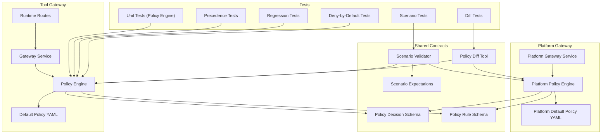
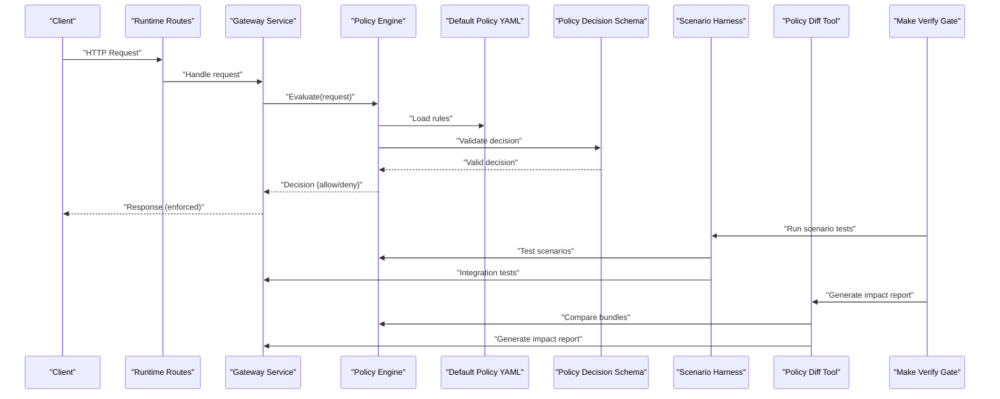
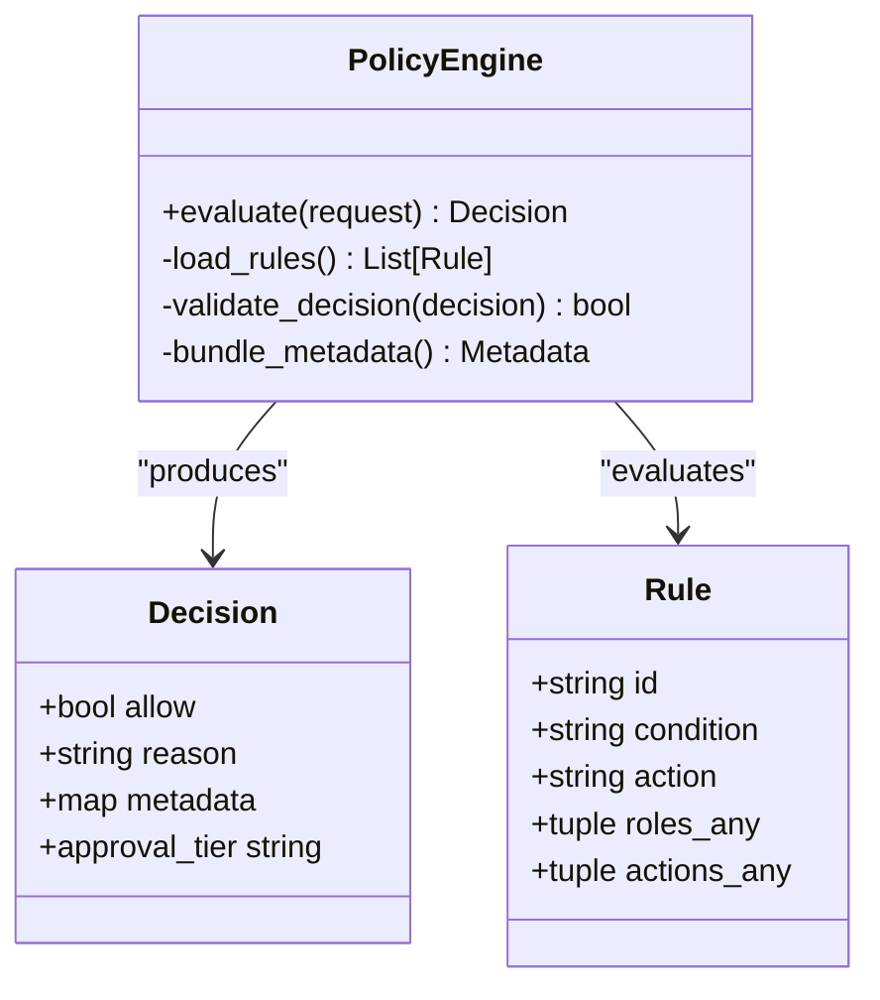
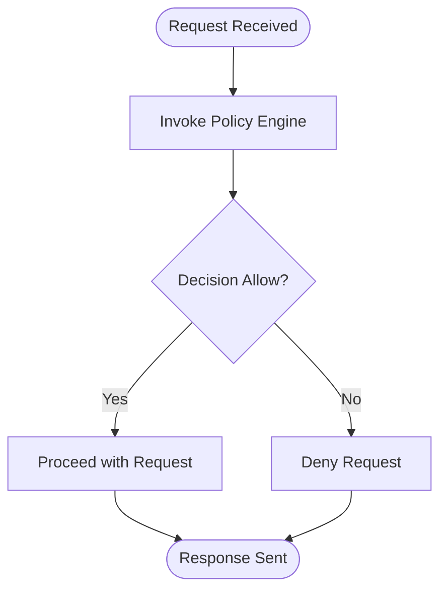
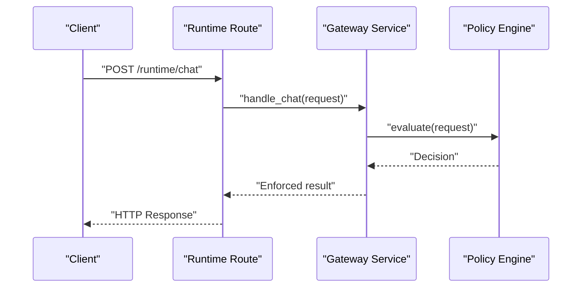
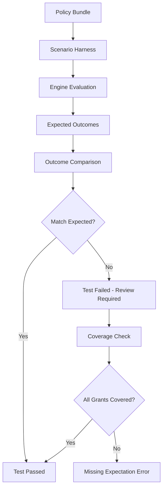
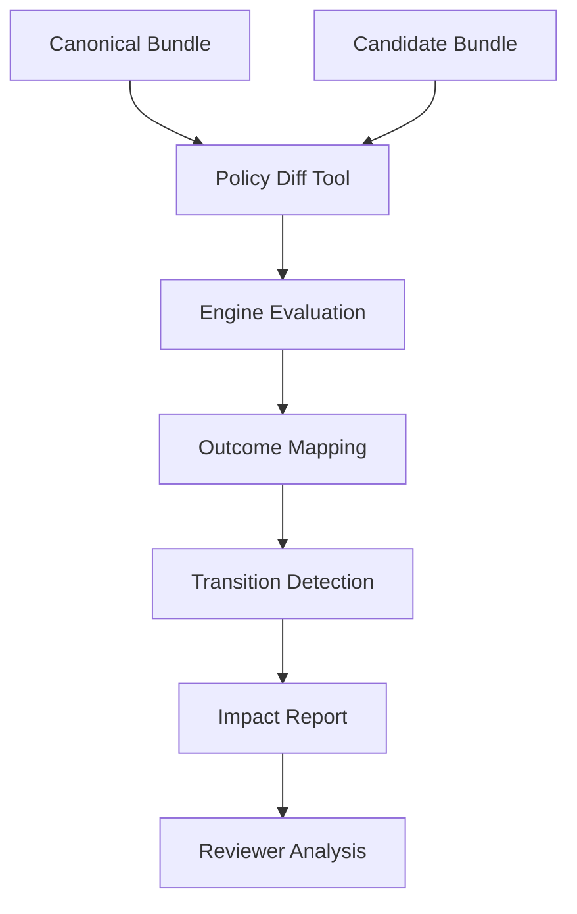
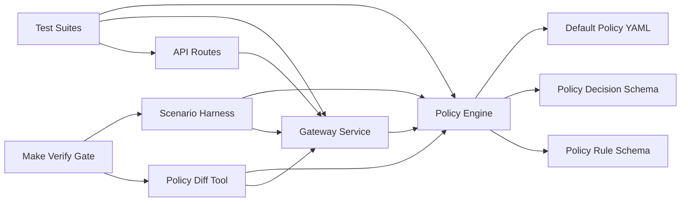

# Policy Testing and Validation

<cite>
**Referenced Files in This Document**
- [policy-engine.py](file://products/tool-gateway/src/tool_gateway/services/policy_engine.py)
- [policy-engine.py](file://products/platform-gateway/src/platform_gateway/services/policy_engine.py)
- [test_policy_engine.py](file://products/tool-gateway/tests/test_policy_engine.py)
- [test_policy_engine.py](file://products/platform-gateway/tests/test_policy_engine.py)
- [gateway_service.py](file://products/tool-gateway/src/tool_gateway/services/gateway_service.py)
- [routes.py](file://products/tool-gateway/src/tool_gateway/api/routes/runtime.py)
- [policy-default.yaml](file://products/tool-gateway/src/tool_gateway/policies/policy-default.yaml)
- [policy-default.yaml](file://products/platform-gateway/src/platform_gateway/policies/policy-default.yaml)
- [policy-decision.schema.json](file://shared/shared-contracts/schemas/policy-decision.schema.json)
- [policy-rule.schema.json](file://shared/shared-contracts/schemas/policy-rule.schema.json)
- [validate_policy.py](file://shared/shared-contracts/scripts/validate_policy.py)
- [validate_policy_scenarios.py](file://shared/shared-contracts/scripts/validate_policy_scenarios.py)
- [policy_diff.py](file://shared/shared-contracts/scripts/policy_diff.py)
- [policy-scenarios.yaml](file://shared/shared-contracts/policies/policy-scenarios.yaml)
- [Makefile](file://Makefile)
- [SPEC-048-policy-testing-rollout-controls/spec.md](file://docs/specs/SPEC-048-policy-testing-rollout-controls/spec.md)
- [deploy.sh](file://shared/platform-ops/gitops/dev-k8s/deploy.sh)
- [kustomization.yaml](file://shared/platform-ops/gitops/dev-k8s/kustomization.yaml)
- [pyproject.toml](file://products/tool-gateway/pyproject.toml)
- [test_policy_scenarios.py](file://products/platform-gateway/tests/test_policy_scenarios.py)
- [test_policy_scenarios.py](file://products/tool-gateway/tests/test_policy_scenarios.py)
- [test_policy_diff.py](file://products/platform-gateway/tests/test_policy_diff.py)
- [test_policy_diff.py](file://products/tool-gateway/tests/test_policy_diff.py)
</cite>

## Update Summary
**Changes Made**
- Updated to document the expanded testing strategy with all four required test types (engine unit tests, precedence tests, regression tests, deny-by-default tests) running before deployment
- Enhanced scenario-based regression testing section with mechanical enforcement through policy-scenarios.yaml
- Added detailed coverage of the scenario-expectation harness that validates 131 API expectations and 19 tools expectations
- Updated continuous integration setup to include comprehensive scenario validation and policy diff checks
- Enhanced troubleshooting guidance for scenario test failures and policy diff analysis
- Updated architecture diagrams to reflect the complete testing pipeline

## Table of Contents
1. [Introduction](#introduction)
2. [Project Structure](#project-structure)
3. [Core Components](#core-components)
4. [Architecture Overview](#architecture-overview)
5. [Detailed Component Analysis](#detailed-component-analysis)
6. [Dependency Analysis](#dependency-analysis)
7. [Performance Considerations](#performance-considerations)
8. [Troubleshooting Guide](#troubleshooting-guide)
9. [Conclusion](#conclusion)
10. [Appendices](#appendices)

## Introduction
This document explains how to test and validate policies in the Luban AIOps platform. It covers the comprehensive policy testing framework, creating test cases, assertion methods, unit tests for custom policies, integration tests for policy evaluation, and end-to-end tests for enforcement. The platform implements a robust four-tier testing strategy that runs before deployment: engine unit tests, precedence tests, regression tests, and deny-by-default tests, with scenario-based regression testing mechanically enforced through policy-scenarios.yaml.

**Updated** The platform now includes a comprehensive scenario-expectation harness that prevents silent permission changes during policy updates, along with policy-diff impact reporting tools and enhanced validation workflows covering both platform-gateway and tool-gateway engines. All four required test types run before deployment, ensuring no policy change can silently flip operator-visible grants.

## Project Structure
Policy-related code and tests are primarily located under the tool-gateway and platform-gateway products:
- Policy engine implementations and default policy configurations
- Gateway services that integrate policy evaluation into request handling
- API routes that trigger policy checks
- Test suites for policy engine behavior and end-to-end enforcement
- Shared schemas defining policy decision and rule structures
- Scenario-expectation harness for automated policy validation
- Policy-diff impact reporting tools
- Platform ops scripts for deployment and environment setup

**Diagram sources**
- [gateway_service.py](file://products/tool-gateway/src/tool_gateway/services/gateway_service.py)
- [policy-engine.py](file://products/tool-gateway/src/tool_gateway/services/policy_engine.py)
- [policy-engine.py](file://products/platform-gateway/src/platform_gateway/services/policy_engine.py)
- [routes.py](file://products/tool-gateway/src/tool_gateway/api/routes/runtime.py)
- [policy-default.yaml](file://products/tool-gateway/src/tool_gateway/policies/policy-default.yaml)
- [policy-default.yaml](file://products/platform-gateway/src/platform_gateway/policies/policy-default.yaml)
- [policy-decision.schema.json](file://shared/shared-contracts/schemas/policy-decision.schema.json)
- [policy-rule.schema.json](file://shared/shared-contracts/schemas/policy-rule.schema.json)
- [validate_policy.py](file://shared/shared-contracts/scripts/validate_policy.py)
- [validate_policy_scenarios.py](file://shared/shared-contracts/scripts/validate_policy_scenarios.py)
- [policy_diff.py](file://shared/shared-contracts/scripts/policy_diff.py)
- [test_policy_engine.py](file://products/tool-gateway/tests/test_policy_engine.py)
- [test_policy_engine.py](file://products/platform-gateway/tests/test_policy_engine.py)

**Section sources**
- [policy-engine.py](file://products/tool-gateway/src/tool_gateway/services/policy_engine.py)
- [policy-engine.py](file://products/platform-gateway/src/platform_gateway/services/policy_engine.py)
- [gateway_service.py](file://products/tool-gateway/src/tool_gateway/services/gateway_service.py)
- [routes.py](file://products/tool-gateway/src/tool_gateway/api/routes/runtime.py)
- [policy-default.yaml](file://products/tool-gateway/src/tool_gateway/policies/policy-default.yaml)
- [policy-default.yaml](file://products/platform-gateway/src/platform_gateway/policies/policy-default.yaml)
- [policy-decision.schema.json](file://shared/shared-contracts/schemas/policy-decision.schema.json)
- [policy-rule.schema.json](file://shared/shared-contracts/schemas/policy-rule.schema.json)
- [validate_policy.py](file://shared/shared-contracts/scripts/validate_policy.py)
- [validate_policy_scenarios.py](file://shared/shared-contracts/scripts/validate_policy_scenarios.py)
- [policy_diff.py](file://shared/shared-contracts/scripts/policy_diff.py)
- [test_policy_engine.py](file://products/tool-gateway/tests/test_policy_engine.py)
- [test_policy_engine.py](file://products/platform-gateway/tests/test_policy_engine.py)

## Core Components
- Policy Engines: Evaluate requests against policy rules and return decisions conforming to the shared schema
- Gateway Services: Integrate policy evaluation into request processing, enforcing allow/deny outcomes
- API Routes: Expose endpoints that trigger policy checks as part of runtime operations
- Default Policies: YAML-based policy configurations used by engines during evaluation
- Schemas: JSON schemas defining the structure of policy decisions and rules for validation and static analysis
- Scenario-Expectation Harness: Automated testing framework that validates policy behavior against expected outcomes
- Policy-Diff Tool: Impact reporting tool that compares policy bundles and shows outcome transitions
- Validation Scripts: Tools for schema validation, scenario testing, and policy comparison

Key responsibilities:
- Policy Engines: Load rules, evaluate conditions, produce standardized decisions
- Gateway Services: Orchestrate request flow, invoke policy engines, enforce decisions
- API Routes: Map HTTP endpoints to gateway handlers with policy checks
- Scenario Harness: Validate policy behavior against curated scenarios to prevent unintended permission changes
- Policy-Diff Tool: Generate impact reports showing policy change effects across role-action pairs
- Tests: Validate engine logic, integration flows, and end-to-end enforcement behaviors

**Section sources**
- [policy-engine.py](file://products/tool-gateway/src/tool_gateway/services/policy_engine.py)
- [policy-engine.py](file://products/platform-gateway/src/platform_gateway/services/policy_engine.py)
- [gateway_service.py](file://products/tool-gateway/src/tool_gateway/services/gateway_service.py)
- [routes.py](file://products/tool-gateway/src/tool_gateway/api/routes/runtime.py)
- [policy-default.yaml](file://products/tool-gateway/src/tool_gateway/policies/policy-default.yaml)
- [policy-default.yaml](file://products/platform-gateway/src/platform_gateway/policies/policy-default.yaml)
- [policy-decision.schema.json](file://shared/shared-contracts/schemas/policy-decision.schema.json)
- [policy-rule.schema.json](file://shared/shared-contracts/schemas/policy-rule.schema.json)
- [validate_policy.py](file://shared/shared-contracts/scripts/validate_policy.py)
- [validate_policy_scenarios.py](file://shared/shared-contracts/scripts/validate_policy_scenarios.py)
- [policy_diff.py](file://shared/shared-contracts/scripts/policy_diff.py)

## Architecture Overview
The policy evaluation architecture integrates tightly with the gateway's request lifecycle. Requests enter through API routes, which delegate to gateway services. The gateway services invoke policy engines to evaluate requests against configured policies. The engines load rules from default policy files and produce decision objects validated against shared schemas. The gateways enforce decisions by allowing or denying requests.

**Updated** The architecture now includes a comprehensive four-tier testing strategy where all required test types (engine unit tests, precedence tests, regression tests, deny-by-default tests) run before deployment. The scenario-expectation harness is integrated into `make verify` to ensure no policy changes silently flip operator-visible grants, plus a policy-diff tool for reviewing changes before deployment.

**Diagram sources**
- [routes.py](file://products/tool-gateway/src/tool_gateway/api/routes/runtime.py)
- [gateway_service.py](file://products/tool-gateway/src/tool_gateway/services/gateway_service.py)
- [policy-engine.py](file://products/tool-gateway/src/tool_gateway/services/policy_engine.py)
- [policy-engine.py](file://products/platform-gateway/src/platform_gateway/services/policy_engine.py)
- [policy-default.yaml](file://products/tool-gateway/src/tool_gateway/policies/policy-default.yaml)
- [policy-default.yaml](file://products/platform-gateway/src/platform_gateway/policies/policy-default.yaml)
- [policy-decision.schema.json](file://shared/shared-contracts/schemas/policy-decision.schema.json)
- [validate_policy.py](file://shared/shared-contracts/scripts/validate_policy.py)
- [validate_policy_scenarios.py](file://shared/shared-contracts/scripts/validate_policy_scenarios.py)
- [policy_diff.py](file://shared/shared-contracts/scripts/policy_diff.py)
- [Makefile](file://Makefile)

## Detailed Component Analysis

### Policy Engines
The policy engines are responsible for loading policy rules, evaluating them against incoming requests, and producing standardized decisions. They validate outputs against the policy decision schema to ensure consistency across the platform.

**Diagram sources**
- [policy-engine.py](file://products/tool-gateway/src/tool_gateway/services/policy_engine.py)
- [policy-engine.py](file://products/platform-gateway/src/platform_gateway/services/policy_engine.py)
- [policy-decision.schema.json](file://shared/shared-contracts/schemas/policy-decision.schema.json)
- [policy-rule.schema.json](file://shared/shared-contracts/schemas/policy-rule.schema.json)

**Section sources**
- [policy-engine.py](file://products/tool-gateway/src/tool_gateway/services/policy_engine.py)
- [policy-engine.py](file://products/platform-gateway/src/platform_gateway/services/policy_engine.py)
- [policy-decision.schema.json](file://shared/shared-contracts/schemas/policy-decision.schema.json)
- [policy-rule.schema.json](file://shared/shared-contracts/schemas/policy-rule.schema.json)

### Gateway Service Integration
The gateway services orchestrate request handling and integrate policy evaluation. They call the policy engines and enforce the resulting decisions by either proceeding with the request or rejecting it.

**Diagram sources**
- [gateway_service.py](file://products/tool-gateway/src/tool_gateway/services/gateway_service.py)
- [policy-engine.py](file://products/tool-gateway/src/tool_gateway/services/policy_engine.py)
- [policy-engine.py](file://products/platform-gateway/src/platform_gateway/services/policy_engine.py)

**Section sources**
- [gateway_service.py](file://products/tool-gateway/src/tool_gateway/services/gateway_service.py)
- [policy-engine.py](file://products/tool-gateway/src/tool_gateway/services/policy_engine.py)
- [policy-engine.py](file://products/platform-gateway/src/platform_gateway/services/policy_engine.py)

### API Routes Triggering Policy Checks
API routes expose endpoints that initiate policy checks as part of their processing pipeline. They delegate to the gateway service, which then invokes the policy engine.

**Diagram sources**
- [routes.py](file://products/tool-gateway/src/tool_gateway/api/routes/runtime.py)
- [gateway_service.py](file://products/tool-gateway/src/tool_gateway/services/gateway_service.py)
- [policy-engine.py](file://products/tool-gateway/src/tool_gateway/services/policy_engine.py)
- [policy-engine.py](file://products/platform-gateway/src/platform_gateway/services/policy_engine.py)

**Section sources**
- [routes.py](file://products/tool-gateway/src/tool_gateway/api/routes/runtime.py)
- [gateway_service.py](file://products/tool-gateway/src/tool_gateway/services/gateway_service.py)
- [policy-engine.py](file://products/tool-gateway/src/tool_gateway/services/policy_engine.py)
- [policy-engine.py](file://products/platform-gateway/src/platform_gateway/services/policy_engine.py)

### Four-Tier Testing Strategy
**Updated** The platform implements a comprehensive four-tier testing strategy that runs before deployment to ensure policy integrity:

#### Engine Unit Tests
Engine unit tests focus on validating the policy engines' logic in isolation. They typically mock external dependencies and assert that the engines return correct decisions for various inputs.

Common patterns:
- Mock policy rule loaders and return controlled rule sets
- Assert decision fields match expected values
- Verify error handling for malformed inputs or missing rules

Example test scenarios:
- Valid request allowed by default policy
- Request denied due to explicit deny rule
- Edge case: empty request payload
- Edge case: unsupported operation type

#### Precedence Tests
Precedence tests validate the rule priority system and conflict resolution mechanisms. These tests ensure that when multiple rules match a request, the correct one takes precedence according to the defined priority rules.

Key test cases:
- Explicit deny overrides allow
- Higher priority rules win over lower priority ones
- Disabled rules are properly ignored
- Priority ordering within same outcome class

#### Regression Tests
Regression tests cover known approval paths and ensure that existing functionality continues to work as expected. These tests maintain backward compatibility and prevent accidental breaking changes.

Focus areas:
- Approval workflow paths
- Multi-step authorization processes
- Cross-engine compatibility
- Legacy policy rule support

#### Deny-by-Default Tests
Deny-by-default tests ensure that the security floor remains intact. These tests verify that unknown roles, ungranted actions, and edge cases result in appropriate denials.

Critical test scenarios:
- Unknown action results in deny
- Ungranted role results in deny
- Empty roles list results in deny
- Missing policy rules result in deny

**Section sources**
- [test_policy_engine.py](file://products/tool-gateway/tests/test_policy_engine.py)
- [test_policy_engine.py](file://products/platform-gateway/tests/test_policy_engine.py)
- [policy-engine.py](file://products/tool-gateway/src/tool_gateway/services/policy_engine.py)
- [policy-engine.py](file://products/platform-gateway/src/platform_gateway/services/policy_engine.py)

### Integration Tests for Policy Evaluation
Integration tests verify that the gateway services correctly integrate with the policy engines and enforce decisions within the request lifecycle.

Typical approach:
- Use test clients to send HTTP requests to API routes
- Assert responses reflect policy decisions
- Validate side effects (e.g., metrics, logs)

Example scenarios:
- Successful chat request allowed by policy
- Denied request returns appropriate error
- Policy change reflected in subsequent requests

**Section sources**
- [test_policy_engine.py](file://products/tool-gateway/tests/test_policy_engine.py)
- [test_policy_engine.py](file://products/platform-gateway/tests/test_policy_engine.py)
- [gateway_service.py](file://products/tool-gateway/src/tool_gateway/services/gateway_service.py)
- [routes.py](file://products/tool-gateway/src/tool_gateway/api/routes/runtime.py)

### End-to-End Tests for Policy Enforcement
End-to-end tests simulate real-world usage by deploying components and exercising full request flows through the system. These tests validate that policy enforcement works across all layers.

Approach:
- Deploy services using platform ops scripts
- Send realistic payloads via API clients
- Assert enforcement behavior and observability signals

Example scenarios:
- Multi-step workflow with conditional policy checks
- High-load scenario with concurrent requests
- Policy update hot-reload and enforcement continuity

**Section sources**
- [deploy.sh](file://shared/platform-ops/gitops/dev-k8s/deploy.sh)
- [kustomization.yaml](file://shared/platform-ops/gitops/dev-k8s/kustomization.yaml)
- [test_policy_engine.py](file://products/tool-gateway/tests/test_policy_engine.py)
- [test_policy_engine.py](file://products/platform-gateway/tests/test_policy_engine.py)

### Scenario-Expectation Harness
**Updated** The scenario-expectation harness provides comprehensive automated policy testing capabilities that prevent silent permission changes during policy updates. This harness is integrated into the `make verify` workflow and evaluates the canonical bundle against curated scenarios using the exact engine semantics.

Key features:
- Curated scenario table defining expected outcomes for sentinel role-action pairs
- Evaluation using actual engine modules (no re-implementation)
- Coverage of every grant in the canonical bundle plus deliberate denials
- Integration with `make verify` to fail if expectations are violated
- Support for both platform-gateway and tool-gateway vocabularies
- 131 API expectations and 19 tools expectations covering all granted pairs
- Mechanical enforcement of completeness invariant - every grant must have at least one expectation

**Diagram sources**
- [validate_policy_scenarios.py](file://shared/shared-contracts/scripts/validate_policy_scenarios.py)
- [policy-engine.py](file://products/tool-gateway/src/tool_gateway/services/policy_engine.py)
- [policy-engine.py](file://products/platform-gateway/src/platform_gateway/services/policy_engine.py)
- [Makefile](file://Makefile)

**Section sources**
- [validate_policy_scenarios.py](file://shared/shared-contracts/scripts/validate_policy_scenarios.py)
- [policy-engine.py](file://products/tool-gateway/src/tool_gateway/services/policy_engine.py)
- [policy-engine.py](file://products/platform-gateway/src/platform_gateway/services/policy_engine.py)
- [Makefile](file://Makefile)
- [SPEC-048-policy-testing-rollout-controls/spec.md](file://docs/specs/SPEC-048-policy-testing-rollout-controls/spec.md)
- [policy-scenarios.yaml](file://shared/shared-contracts/policies/policy-scenarios.yaml)

### Policy-Diff Impact Reporting Tool
**Updated** The policy-diff tool generates comprehensive impact reports comparing policy bundles to show outcome transitions between canonical and candidate bundles. This tool helps reviewers understand the security implications of policy changes before deployment.

Key capabilities:
- Per-(role, action) outcome transition detection across both vocabularies
- Shows allow→deny, allow→require_approval, approval-tier changes, new grants, removed grants
- Shares the same evaluation path as the scenario harness for consistent results
- Reports unchanged pairs by count for summary information
- Hard errors for missing or unparseable candidate bundles
- Provenance hash tracking for bundle identification

**Diagram sources**
- [policy_diff.py](file://shared/shared-contracts/scripts/policy_diff.py)
- [policy-engine.py](file://products/tool-gateway/src/tool_gateway/services/policy_engine.py)
- [policy-engine.py](file://products/platform-gateway/src/platform_gateway/services/policy_engine.py)

**Section sources**
- [policy_diff.py](file://shared/shared-contracts/scripts/policy_diff.py)
- [policy-engine.py](file://products/tool-gateway/src/tool_gateway/services/policy_engine.py)
- [policy-engine.py](file://products/platform-gateway/src/platform_gateway/services/policy_engine.py)
- [Makefile](file://Makefile)

## Dependency Analysis
Policy evaluation depends on several internal and external components:
- Internal: Gateway services, API routes, default policy YAML files
- External: Shared schemas for validation, platform ops for deployment
- New: Scenario-expectation harness for automated testing
- New: Policy-diff tool for impact analysis

**Diagram sources**
- [routes.py](file://products/tool-gateway/src/tool_gateway/api/routes/runtime.py)
- [gateway_service.py](file://products/tool-gateway/src/tool_gateway/services/gateway_service.py)
- [policy-engine.py](file://products/tool-gateway/src/tool_gateway/services/policy_engine.py)
- [policy-engine.py](file://products/platform-gateway/src/platform_gateway/services/policy_engine.py)
- [policy-default.yaml](file://products/tool-gateway/src/tool_gateway/policies/policy-default.yaml)
- [policy-default.yaml](file://products/platform-gateway/src/platform_gateway/policies/policy-default.yaml)
- [policy-decision.schema.json](file://shared/shared-contracts/schemas/policy-decision.schema.json)
- [policy-rule.schema.json](file://shared/shared-contracts/schemas/policy-rule.schema.json)
- [validate_policy.py](file://shared/shared-contracts/scripts/validate_policy.py)
- [validate_policy_scenarios.py](file://shared/shared-contracts/scripts/validate_policy_scenarios.py)
- [policy_diff.py](file://shared/shared-contracts/scripts/policy_diff.py)
- [test_policy_engine.py](file://products/tool-gateway/tests/test_policy_engine.py)
- [test_policy_engine.py](file://products/platform-gateway/tests/test_policy_engine.py)
- [Makefile](file://Makefile)

**Section sources**
- [routes.py](file://products/tool-gateway/src/tool_gateway/api/routes/runtime.py)
- [gateway_service.py](file://products/tool-gateway/src/tool_gateway/services/gateway_service.py)
- [policy-engine.py](file://products/tool-gateway/src/tool_gateway/services/policy_engine.py)
- [policy-engine.py](file://products/platform-gateway/src/platform_gateway/services/policy_engine.py)
- [policy-default.yaml](file://products/tool-gateway/src/tool_gateway/policies/policy-default.yaml)
- [policy-default.yaml](file://products/platform-gateway/src/platform_gateway/policies/policy-default.yaml)
- [policy-decision.schema.json](file://shared/shared-contracts/schemas/policy-decision.schema.json)
- [policy-rule.schema.json](file://shared/shared-contracts/schemas/policy-rule.schema.json)
- [validate_policy.py](file://shared/shared-contracts/scripts/validate_policy.py)
- [validate_policy_scenarios.py](file://shared/shared-contracts/scripts/validate_policy_scenarios.py)
- [policy_diff.py](file://shared/shared-contracts/scripts/policy_diff.py)
- [test_policy_engine.py](file://products/tool-gateway/tests/test_policy_engine.py)
- [test_policy_engine.py](file://products/platform-gateway/tests/test_policy_engine.py)
- [Makefile](file://Makefile)

## Performance Considerations
- Policy Engine Efficiency: Minimize rule parsing overhead by caching loaded rules; avoid repeated I/O during evaluation
- Schema Validation Cost: Validate only when necessary; consider lazy validation for large payloads
- Concurrency: Ensure thread-safe evaluation and decision generation under concurrent requests
- Memory Usage: Avoid loading entire policy files into memory repeatedly; use streaming or incremental parsing where possible
- Benchmarking: Measure latency and throughput under varying load profiles; track p50, p95, p99 latencies
- **Updated** Scenario Testing Performance: Optimize scenario evaluation to run efficiently during CI/CD without excessive resource consumption
- **Updated** Policy-Diff Performance: Cache engine instances and reuse evaluation paths to minimize computational overhead during bundle comparisons
- **Updated** Four-Tier Testing Optimization: Parallelize test execution across different test types to reduce overall verification time

## Troubleshooting Guide
Common issues and resolutions:
- Policy Decision Schema Mismatch: Validate decision objects against the shared schema; check field types and required keys
- Rule Loading Failures: Verify default policy YAML syntax and accessibility; ensure environment paths are correct
- Gateway Integration Errors: Inspect request context propagation; confirm policy engine invocation and error handling
- Test Flakiness: Stabilize mocks and fixtures; isolate external dependencies; add retries for transient failures
- Performance Degradation: Profile policy evaluation paths; identify bottlenecks in rule matching or schema validation
- **Updated** Scenario Test Failures: Review scenario expectations against policy changes; ensure all grants are covered by at least one expectation; verify deliberate denials are properly tested
- **Updated** Make Verify Failures: Check scenario-expectation harness output; review policy diff reports; ensure policy bundle changes are accompanied by updated expectations
- **Updated** Policy-Diff Issues: Analyze transition reports to understand security implications; verify candidate bundle syntax; check for missing required fields
- **Updated** Four-Tier Test Failures: Identify which test tier failed (unit, precedence, regression, deny-by-default); analyze specific test cases; verify test data integrity

**Section sources**
- [policy-decision.schema.json](file://shared/shared-contracts/schemas/policy-decision.schema.json)
- [policy-rule.schema.json](file://shared/shared-contracts/schemas/policy-rule.schema.json)
- [policy-default.yaml](file://products/tool-gateway/src/tool_gateway/policies/policy-default.yaml)
- [policy-default.yaml](file://products/platform-gateway/src/platform_gateway/policies/policy-default.yaml)
- [gateway_service.py](file://products/tool-gateway/src/tool_gateway/services/gateway_service.py)
- [policy-engine.py](file://products/tool-gateway/src/tool_gateway/services/policy_engine.py)
- [policy-engine.py](file://products/platform-gateway/src/platform_gateway/services/policy_engine.py)
- [validate_policy.py](file://shared/shared-contracts/scripts/validate_policy.py)
- [validate_policy_scenarios.py](file://shared/shared-contracts/scripts/validate_policy_scenarios.py)
- [policy_diff.py](file://shared/shared-contracts/scripts/policy_diff.py)
- [Makefile](file://Makefile)

## Conclusion
The Luban AIOps platform provides a robust policy testing and validation framework centered around the policy engines, gateway integration, and shared schemas. The addition of the scenario-expectation harness and policy-diff tool significantly enhances the testing capabilities, ensuring that policy changes cannot silently alter operator-visible permissions. By following the outlined four-tier testing strategy (engine unit tests, precedence tests, regression tests, deny-by-default tests), teams can ensure policies are correctly evaluated and enforced. Adhering to schema validation, static analysis, and performance best practices further strengthens reliability and scalability.

**Updated** The SPEC-048 enhancements provide comprehensive policy testing capabilities that integrate seamlessly into the existing development workflow, making policy management safer and more predictable with automated guards against unintended permission changes. The mechanical enforcement through policy-scenarios.yaml ensures that every policy change is thoroughly vetted before deployment.

## Appendices

### Continuous Integration Setup
**Updated** The continuous integration setup now includes comprehensive testing coverage:

- Automated Pipelines: Configure CI to run unit and integration tests on every commit; gate merges on passing tests
- Quality Gates: Enforce code coverage thresholds, schema validation checks, and policy linting
- Deployment Validation: Use platform ops scripts to deploy test environments and execute E2E tests
- **Updated** Four-Tier Testing: Run all required test types (engine unit tests, precedence tests, regression tests, deny-by-default tests) before deployment
- **Updated** Scenario Testing: Include scenario-expectation harness in `make verify` to prevent unintended policy changes
- **Updated** Policy Diff Reports: Generate impact reports for policy changes before merge approval using `make policy-diff`
- **Updated** Comprehensive Coverage: Run both API and tools engine validations to ensure cross-platform policy consistency

**Section sources**
- [Makefile](file://Makefile)
- [pyproject.toml](file://products/tool-gateway/pyproject.toml)
- [deploy.sh](file://shared/platform-ops/gitops/dev-k8s/deploy.sh)
- [kustomization.yaml](file://shared/platform-ops/gitops/dev-k8s/kustomization.yaml)
- [validate_policy.py](file://shared/shared-contracts/scripts/validate_policy.py)
- [validate_policy_scenarios.py](file://shared/shared-contracts/scripts/validate_policy_scenarios.py)
- [policy_diff.py](file://shared/shared-contracts/scripts/policy_diff.py)
- [SPEC-048-policy-testing-rollout-controls/spec.md](file://docs/specs/SPEC-048-policy-testing-rollout-controls/spec.md)

### Policy Specification Reference
For detailed policy enforcement requirements and design decisions, refer to the official specification.

**Section sources**
- [SPEC-004-policy-enforcement/spec.md](file://docs/specs/SPEC-004-policy-enforcement/spec.md)
- [SPEC-048-policy-testing-rollout-controls/spec.md](file://docs/specs/SPEC-048-policy-testing-rollout-controls/spec.md)

### Enhanced Validation Tools
**Updated** The enhanced validation tools provide comprehensive policy testing capabilities:

- Schema Validation: Validates policy bundles against JSON schemas
- Scenario Testing: Evaluates policy behavior against curated scenarios with 131 API and 19 tools expectations
- Impact Analysis: Generates reports showing policy change impacts using policy-diff tool
- Contract Alignment: Ensures packaged bundles match shared contracts
- Cross-Platform Validation: Tests both platform-gateway and tool-gateway engines for consistency
- **Updated** Four-Tier Testing: Implements comprehensive testing strategy with engine unit tests, precedence tests, regression tests, and deny-by-default tests

These tools are integrated into the development workflow through `make verify` and provide immediate feedback on policy changes.

**Section sources**
- [validate_policy.py](file://shared/shared-contracts/scripts/validate_policy.py)
- [validate_policy_scenarios.py](file://shared/shared-contracts/scripts/validate_policy_scenarios.py)
- [policy_diff.py](file://shared/shared-contracts/scripts/policy_diff.py)
- [Makefile](file://Makefile)
- [SPEC-048-policy-testing-rollout-controls/spec.md](file://docs/specs/SPEC-048-policy-testing-rollout-controls/spec.md)

### Scenario Testing Framework
**Updated** The scenario testing framework ensures comprehensive policy coverage through curated expectations:

- Complete Grant Coverage: Every granted (role, action) pair must have at least one corresponding expectation
- Named Denials: Explicitly documented denials for sensitive roles like auditor and observer
- Engine Non-Parity Handling: Different expectations for platform-gateway vs tool-gateway engines
- Self-Testing: Built-in tests verify harness functionality against known good and bad scenarios
- CI Integration: Automatically runs during `make verify` to catch policy drift
- **Updated** Mechanical Enforcement: Fails verification if any grant lacks corresponding expectation, preventing silent permission changes

**Section sources**
- [policy-scenarios.yaml](file://shared/shared-contracts/policies/policy-scenarios.yaml)
- [validate_policy_scenarios.py](file://shared/shared-contracts/scripts/validate_policy_scenarios.py)
- [test_policy_scenarios.py](file://products/platform-gateway/tests/test_policy_scenarios.py)
- [test_policy_scenarios.py](file://products/tool-gateway/tests/test_policy_scenarios.py)

### Policy Diff Analysis
**Updated** The policy diff analysis tool provides detailed impact assessment for policy changes:

- Transition Detection: Identifies allow→deny, allow→require_approval, and approval tier changes
- Unchanged Pair Summarization: Reports counts of unaffected role-action pairs
- Error Handling: Provides hard errors for missing or malformed candidate bundles
- Provenance Tracking: Includes SHA-256 hashes for bundle identification
- Review Workflow: Integrates with `make policy-diff` for pre-merge review process
- **Updated** Cross-Engine Analysis: Reports differences across both platform-gateway and tool-gateway engines

**Section sources**
- [policy_diff.py](file://shared/shared-contracts/scripts/policy_diff.py)
- [test_policy_diff.py](file://products/platform-gateway/tests/test_policy_diff.py)
- [test_policy_diff.py](file://products/tool-gateway/tests/test_policy_diff.py)
- [Makefile](file://Makefile)

### Four-Tier Testing Implementation
**New** The four-tier testing strategy provides comprehensive policy validation:

#### Engine Unit Tests
- Validate core policy engine functionality in isolation
- Test rule matching, decision generation, and error handling
- Cover edge cases and boundary conditions

#### Precedence Tests  
- Verify rule priority and conflict resolution
- Test deny > require_approval > allow hierarchy
- Validate disabled rule handling

#### Regression Tests
- Maintain backward compatibility
- Test approval workflow paths
- Ensure cross-engine compatibility

#### Deny-by-Default Tests
- Verify security floor remains intact
- Test unknown roles and actions
- Validate empty input handling

**Section sources**
- [test_policy_engine.py](file://products/tool-gateway/tests/test_policy_engine.py)
- [test_policy_engine.py](file://products/platform-gateway/tests/test_policy_engine.py)
- [SPEC-048-policy-testing-rollout-controls/spec.md](file://docs/specs/SPEC-048-policy-testing-rollout-controls/spec.md)