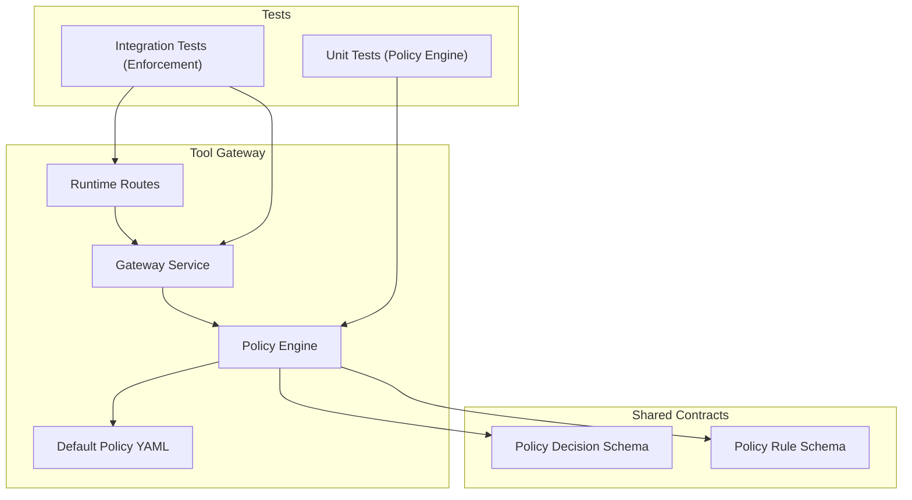
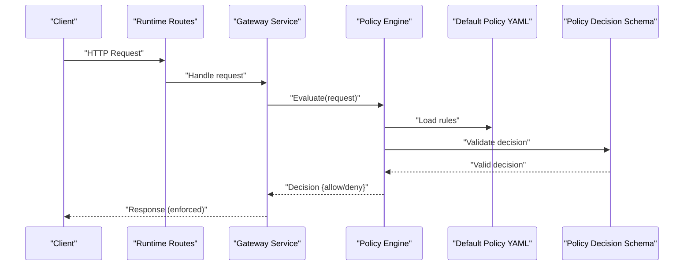
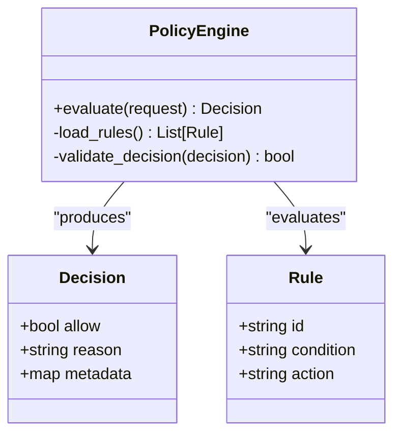
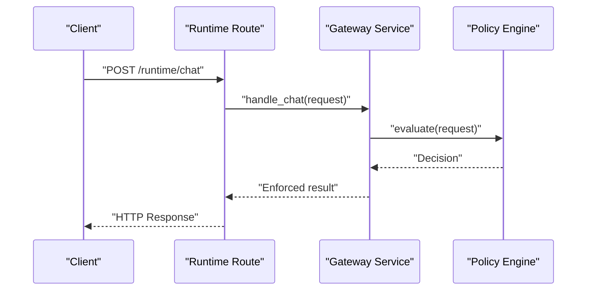
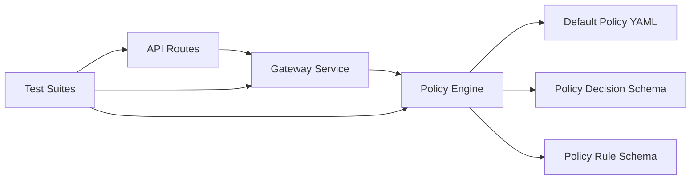

# Policy Testing and Validation

<cite>
**Referenced Files in This Document**
- [policy-engine.py](file://products/tool-gateway/src/api_gateway/services/policy_engine.py)
- [test_policy_engine.py](file://products/tool-gateway/tests/test_policy_engine.py)
- [test_policy_enforcement.py](file://products/tool-gateway/tests/test_policy_enforcement.py)
- [gateway_service.py](file://products/tool-gateway/src/api_gateway/services/gateway_service.py)
- [routes.py](file://products/tool-gateway/src/api_gateway/api/routes/runtime.py)
- [policy-default.yaml](file://products/tool-gateway/src/api_gateway/policies/policy-default.yaml)
- [policy-decision.schema.json](file://shared/shared-contracts/schemas/policy-decision.schema.json)
- [policy-rule.schema.json](file://shared/shared-contracts/schemas/policy-rule.schema.json)
- [SPEC-004-policy-enforcement/spec.md](file://docs/specs/SPEC-004-policy-enforcement/spec.md)
- [deploy.sh](file://shared/platform-ops/gitops/dev-k8s/deploy.sh)
- [kustomization.yaml](file://shared/platform-ops/gitops/dev-k8s/kustomization.yaml)
- [Makefile](file://products/tool-gateway/Makefile)
- [pyproject.toml](file://products/tool-gateway/pyproject.toml)
</cite>

## Table of Contents
1. [Introduction](#introduction)
2. [Project Structure](#project-structure)
3. [Core Components](#core-components)
4. [Architecture Overview](#architecture-overview)
5. [Detailed Component Analysis](#detailed-component-analysis)
6. [Dependency Analysis](#dependency-analysis)
7. [Performance Considerations](#performance-considerations)
8. [Troubleshooting Guide](#troubleshooting-guide)
9. [Conclusion](#conclusion)
10. [Appendices](#appendices)

## Introduction
This document explains how to test and validate policies in the Luban AIOps platform. It covers the policy testing framework, creating test cases, assertion methods, unit tests for custom policies, integration tests for policy evaluation, and end-to-end tests for enforcement. It also documents validation tools, schema validation, static analysis techniques, performance and load testing approaches, benchmarking methodologies, continuous integration setup, automated validation pipelines, quality gates, and troubleshooting guidance.

## Project Structure
Policy-related code and tests are primarily located under the tool-gateway product:
- Policy engine implementation and default policy configuration
- Gateway service that integrates policy evaluation into request handling
- API routes that trigger policy checks
- Test suites for policy engine behavior and end-to-end enforcement
- Shared schemas defining policy decision and rule structures
- Platform ops scripts for deployment and environment setup

**Diagram sources**
- [gateway_service.py](file://products/tool-gateway/src/api_gateway/services/gateway_service.py)
- [policy-engine.py](file://products/tool-gateway/src/api_gateway/services/policy_engine.py)
- [routes.py](file://products/tool-gateway/src/api_gateway/api/routes/runtime.py)
- [policy-default.yaml](file://products/tool-gateway/src/api_gateway/policies/policy-default.yaml)
- [policy-decision.schema.json](file://shared/shared-contracts/schemas/policy-decision.schema.json)
- [policy-rule.schema.json](file://shared/shared-contracts/schemas/policy-rule.schema.json)
- [test_policy_engine.py](file://products/tool-gateway/tests/test_policy_engine.py)
- [test_policy_enforcement.py](file://products/tool-gateway/tests/test_policy_enforcement.py)

**Section sources**
- [policy-engine.py](file://products/tool-gateway/src/api_gateway/services/policy_engine.py)
- [gateway_service.py](file://products/tool-gateway/src/api_gateway/services/gateway_service.py)
- [routes.py](file://products/tool-gateway/src/api_gateway/api/routes/runtime.py)
- [policy-default.yaml](file://products/tool-gateway/src/api_gateway/policies/policy-default.yaml)
- [policy-decision.schema.json](file://shared/shared-contracts/schemas/policy-decision.schema.json)
- [policy-rule.schema.json](file://shared/shared-contracts/schemas/policy-rule.schema.json)
- [test_policy_engine.py](file://products/tool-gateway/tests/test_policy_engine.py)
- [test_policy_enforcement.py](file://products/tool-gateway/tests/test_policy_enforcement.py)

## Core Components
- Policy Engine: Evaluates requests against policy rules and returns decisions conforming to the shared schema.
- Gateway Service: Integrates policy evaluation into request processing, enforcing allow/deny outcomes.
- API Routes: Expose endpoints that trigger policy checks as part of runtime operations.
- Default Policy: YAML-based policy configuration used by the engine during evaluation.
- Schemas: JSON schemas defining the structure of policy decisions and rules for validation and static analysis.

Key responsibilities:
- Policy Engine: Load rules, evaluate conditions, produce standardized decisions.
- Gateway Service: Orchestrate request flow, invoke policy engine, enforce decisions.
- API Routes: Map HTTP endpoints to gateway handlers with policy checks.
- Tests: Validate engine logic, integration flows, and end-to-end enforcement behaviors.

**Section sources**
- [policy-engine.py](file://products/tool-gateway/src/api_gateway/services/policy_engine.py)
- [gateway_service.py](file://products/tool-gateway/src/api_gateway/services/gateway_service.py)
- [routes.py](file://products/tool-gateway/src/api_gateway/api/routes/runtime.py)
- [policy-default.yaml](file://products/tool-gateway/src/api_gateway/policies/policy-default.yaml)
- [policy-decision.schema.json](file://shared/shared-contracts/schemas/policy-decision.schema.json)
- [policy-rule.schema.json](file://shared/shared-contracts/schemas/policy-rule.schema.json)

## Architecture Overview
The policy evaluation architecture integrates tightly with the gateway’s request lifecycle. Requests enter through API routes, which delegate to the gateway service. The gateway service invokes the policy engine to evaluate the request against configured policies. The engine loads rules from the default policy file and produces a decision object validated against the shared schema. The gateway enforces the decision by allowing or denying the request.

**Diagram sources**
- [routes.py](file://products/tool-gateway/src/api_gateway/api/routes/runtime.py)
- [gateway_service.py](file://products/tool-gateway/src/api_gateway/services/gateway_service.py)
- [policy-engine.py](file://products/tool-gateway/src/api_gateway/services/policy_engine.py)
- [policy-default.yaml](file://products/tool-gateway/src/api_gateway/policies/policy-default.yaml)
- [policy-decision.schema.json](file://shared/shared-contracts/schemas/policy-decision.schema.json)

## Detailed Component Analysis

### Policy Engine
The policy engine is responsible for loading policy rules, evaluating them against incoming requests, and producing standardized decisions. It validates outputs against the policy decision schema to ensure consistency across the platform.

**Diagram sources**
- [policy-engine.py](file://products/tool-gateway/src/api_gateway/services/policy_engine.py)
- [policy-decision.schema.json](file://shared/shared-contracts/schemas/policy-decision.schema.json)
- [policy-rule.schema.json](file://shared/shared-contracts/schemas/policy-rule.schema.json)

**Section sources**
- [policy-engine.py](file://products/tool-gateway/src/api_gateway/services/policy_engine.py)
- [policy-decision.schema.json](file://shared/shared-contracts/schemas/policy-decision.schema.json)
- [policy-rule.schema.json](file://shared/shared-contracts/schemas/policy-rule.schema.json)

### Gateway Service Integration
The gateway service orchestrates request handling and integrates policy evaluation. It calls the policy engine and enforces the resulting decision by either proceeding with the request or rejecting it.

**Diagram sources**
- [gateway_service.py](file://products/tool-gateway/src/api_gateway/services/gateway_service.py)
- [policy-engine.py](file://products/tool-gateway/src/api_gateway/services/policy_engine.py)

**Section sources**
- [gateway_service.py](file://products/tool-gateway/src/api_gateway/services/gateway_service.py)
- [policy-engine.py](file://products/tool-gateway/src/api_gateway/services/policy_engine.py)

### API Routes Triggering Policy Checks
API routes expose endpoints that initiate policy checks as part of their processing pipeline. They delegate to the gateway service, which then invokes the policy engine.

**Diagram sources**
- [routes.py](file://products/tool-gateway/src/api_gateway/api/routes/runtime.py)
- [gateway_service.py](file://products/tool-gateway/src/api_gateway/services/gateway_service.py)
- [policy-engine.py](file://products/tool-gateway/src/api_gateway/services/policy_engine.py)

**Section sources**
- [routes.py](file://products/tool-gateway/src/api_gateway/api/routes/runtime.py)
- [gateway_service.py](file://products/tool-gateway/src/api_gateway/services/gateway_service.py)
- [policy-engine.py](file://products/tool-gateway/src/api_gateway/services/policy_engine.py)

### Unit Tests for Custom Policies
Unit tests focus on validating the policy engine’s logic in isolation. They typically mock external dependencies and assert that the engine returns correct decisions for various inputs.

Common patterns:
- Mock policy rule loaders and return controlled rule sets
- Assert decision fields match expected values
- Verify error handling for malformed inputs or missing rules

Example test scenarios:
- Valid request allowed by default policy
- Request denied due to explicit deny rule
- Edge case: empty request payload
- Edge case: unsupported operation type

**Section sources**
- [test_policy_engine.py](file://products/tool-gateway/tests/test_policy_engine.py)
- [policy-engine.py](file://products/tool-gateway/src/api_gateway/services/policy_engine.py)

### Integration Tests for Policy Evaluation
Integration tests verify that the gateway service correctly integrates with the policy engine and enforces decisions within the request lifecycle.

Typical approach:
- Use test clients to send HTTP requests to API routes
- Assert responses reflect policy decisions
- Validate side effects (e.g., metrics, logs)

Example scenarios:
- Successful chat request allowed by policy
- Denied request returns appropriate error
- Policy change reflected in subsequent requests

**Section sources**
- [test_policy_enforcement.py](file://products/tool-gateway/tests/test_policy_enforcement.py)
- [gateway_service.py](file://products/tool-gateway/src/api_gateway/services/gateway_service.py)
- [routes.py](file://products/tool-gateway/src/api_gateway/api/routes/runtime.py)

### End-to-End Tests for Policy Enforcement
End-to-end tests simulate real-world usage by deploying components and exercising full request flows through the system. These tests validate that policy enforcement works across all layers.

Approach:
- Deploy services using platform ops scripts
- Send realistic payloads via API clients
- Assert enforcement behavior and observability signals

Example scenarios:
- Multi-step workflow with conditional policy checks
- High-load scenario with concurrent requests
- Policy update hot-reload and enforcement continuity

**Section sources**
- [deploy.sh](file://shared/platform-ops/gitops/dev-k8s/deploy.sh)
- [kustomization.yaml](file://shared/platform-ops/gitops/dev-k8s/kustomization.yaml)
- [test_policy_enforcement.py](file://products/tool-gateway/tests/test_policy_enforcement.py)

## Dependency Analysis
Policy evaluation depends on several internal and external components:
- Internal: Gateway service, API routes, default policy YAML
- External: Shared schemas for validation, platform ops for deployment

**Diagram sources**
- [routes.py](file://products/tool-gateway/src/api_gateway/api/routes/runtime.py)
- [gateway_service.py](file://products/tool-gateway/src/api_gateway/services/gateway_service.py)
- [policy-engine.py](file://products/tool-gateway/src/api_gateway/services/policy_engine.py)
- [policy-default.yaml](file://products/tool-gateway/src/api_gateway/policies/policy-default.yaml)
- [policy-decision.schema.json](file://shared/shared-contracts/schemas/policy-decision.schema.json)
- [policy-rule.schema.json](file://shared/shared-contracts/schemas/policy-rule.schema.json)
- [test_policy_engine.py](file://products/tool-gateway/tests/test_policy_engine.py)
- [test_policy_enforcement.py](file://products/tool-gateway/tests/test_policy_enforcement.py)

**Section sources**
- [routes.py](file://products/tool-gateway/src/api_gateway/api/routes/runtime.py)
- [gateway_service.py](file://products/tool-gateway/src/api_gateway/services/gateway_service.py)
- [policy-engine.py](file://products/tool-gateway/src/api_gateway/services/policy_engine.py)
- [policy-default.yaml](file://products/tool-gateway/src/api_gateway/policies/policy-default.yaml)
- [policy-decision.schema.json](file://shared/shared-contracts/schemas/policy-decision.schema.json)
- [policy-rule.schema.json](file://shared/shared-contracts/schemas/policy-rule.schema.json)
- [test_policy_engine.py](file://products/tool-gateway/tests/test_policy_engine.py)
- [test_policy_enforcement.py](file://products/tool-gateway/tests/test_policy_enforcement.py)

## Performance Considerations
- Policy Engine Efficiency: Minimize rule parsing overhead by caching loaded rules; avoid repeated I/O during evaluation.
- Schema Validation Cost: Validate only when necessary; consider lazy validation for large payloads.
- Concurrency: Ensure thread-safe evaluation and decision generation under concurrent requests.
- Memory Usage: Avoid loading entire policy files into memory repeatedly; use streaming or incremental parsing where possible.
- Benchmarking: Measure latency and throughput under varying load profiles; track p50, p95, p99 latencies.

[No sources needed since this section provides general guidance]

## Troubleshooting Guide
Common issues and resolutions:
- Policy Decision Schema Mismatch: Validate decision objects against the shared schema; check field types and required keys.
- Rule Loading Failures: Verify default policy YAML syntax and accessibility; ensure environment paths are correct.
- Gateway Integration Errors: Inspect request context propagation; confirm policy engine invocation and error handling.
- Test Flakiness: Stabilize mocks and fixtures; isolate external dependencies; add retries for transient failures.
- Performance Degradation: Profile policy evaluation paths; identify bottlenecks in rule matching or schema validation.

**Section sources**
- [policy-decision.schema.json](file://shared/shared-contracts/schemas/policy-decision.schema.json)
- [policy-rule.schema.json](file://shared/shared-contracts/schemas/policy-rule.schema.json)
- [policy-default.yaml](file://products/tool-gateway/src/api_gateway/policies/policy-default.yaml)
- [gateway_service.py](file://products/tool-gateway/src/api_gateway/services/gateway_service.py)
- [policy-engine.py](file://products/tool-gateway/src/api_gateway/services/policy_engine.py)

## Conclusion
The Luban AIOps platform provides a robust policy testing and validation framework centered around the policy engine, gateway integration, and shared schemas. By following the outlined unit, integration, and end-to-end testing strategies, teams can ensure policies are correctly evaluated and enforced. Adhering to schema validation, static analysis, and performance best practices further strengthens reliability and scalability.

[No sources needed since this section summarizes without analyzing specific files]

## Appendices

### Continuous Integration Setup
- Automated Pipelines: Configure CI to run unit and integration tests on every commit; gate merges on passing tests.
- Quality Gates: Enforce code coverage thresholds, schema validation checks, and policy linting.
- Deployment Validation: Use platform ops scripts to deploy test environments and execute E2E tests.

**Section sources**
- [Makefile](file://products/tool-gateway/Makefile)
- [pyproject.toml](file://products/tool-gateway/pyproject.toml)
- [deploy.sh](file://shared/platform-ops/gitops/dev-k8s/deploy.sh)
- [kustomization.yaml](file://shared/platform-ops/gitops/dev-k8s/kustomization.yaml)

### Policy Specification Reference
For detailed policy enforcement requirements and design decisions, refer to the official specification.

**Section sources**
- [SPEC-004-policy-enforcement/spec.md](file://docs/specs/SPEC-004-policy-enforcement/spec.md)