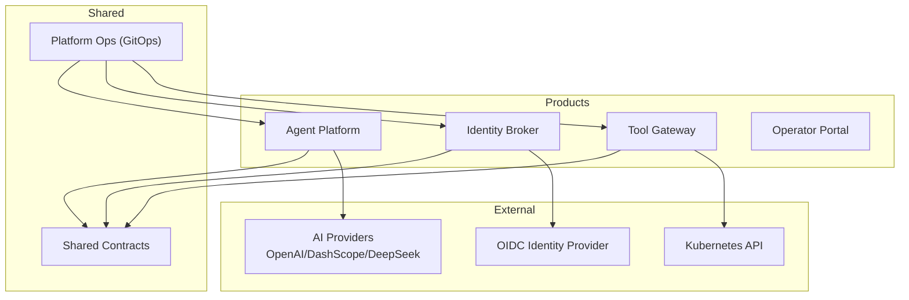
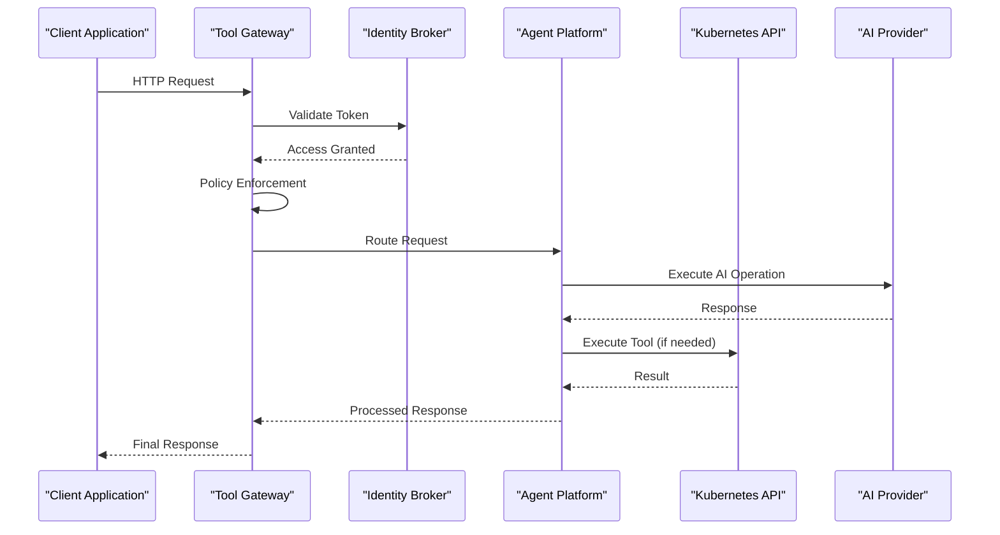
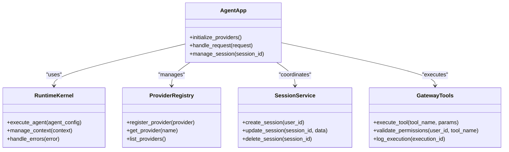
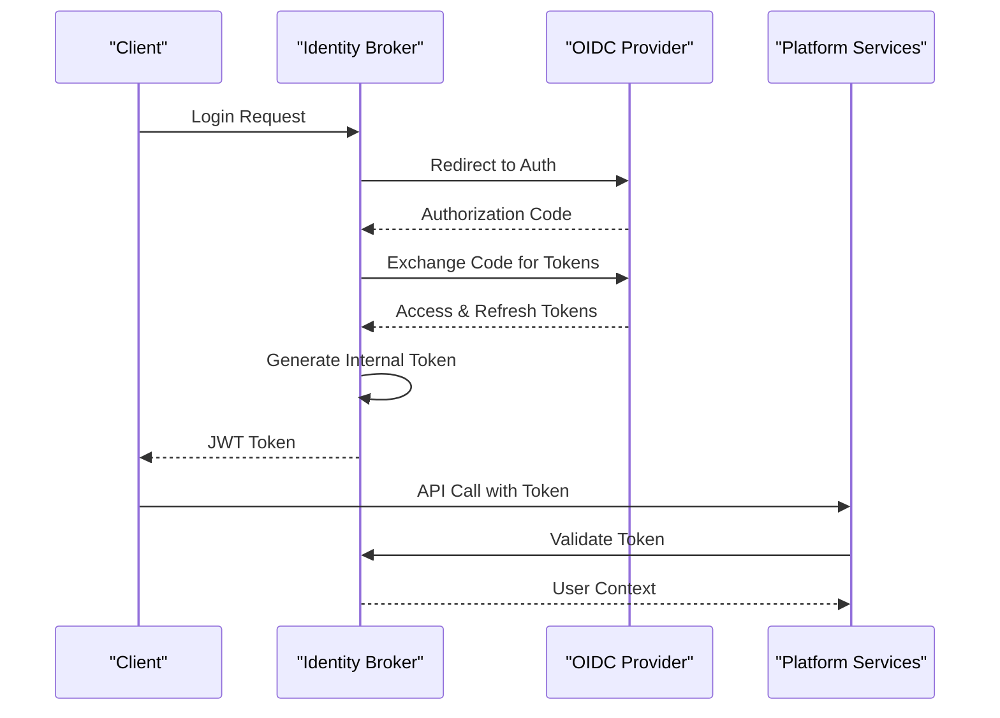
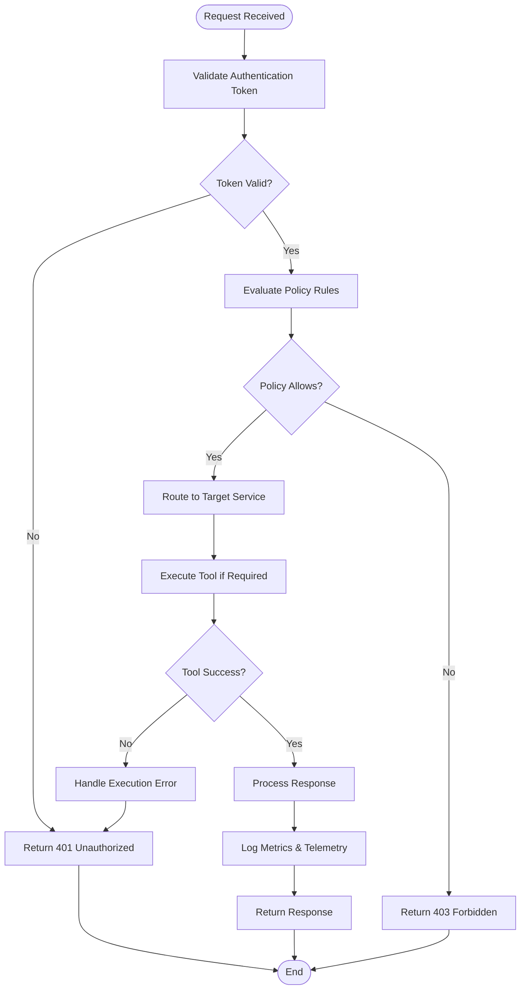
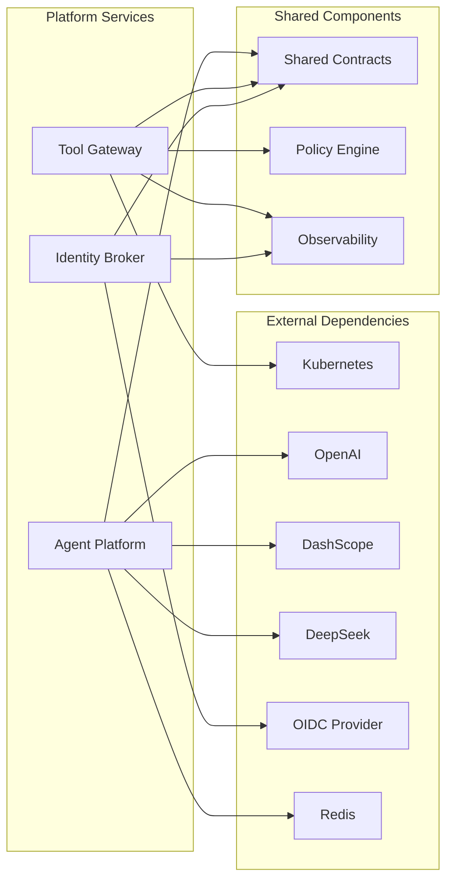
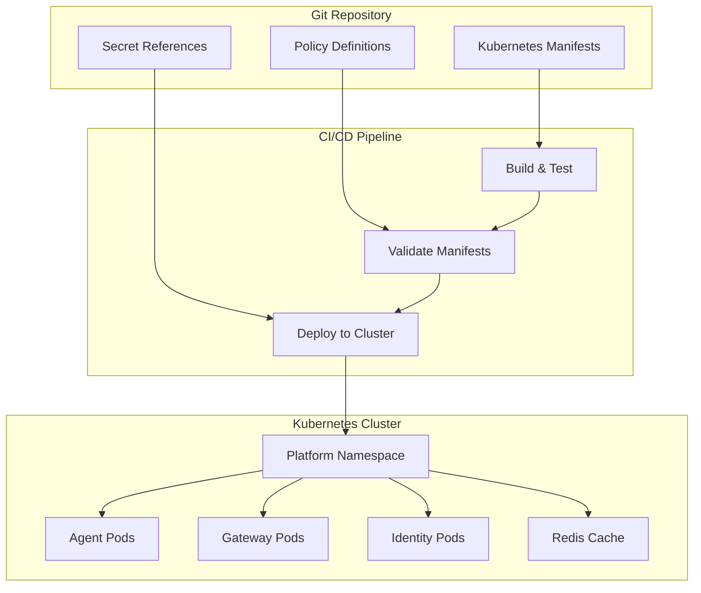

# Project Overview

<cite>
**Referenced Files in This Document**
- [README.md](file://README.md)
- [SECURITY.md](file://SECURITY.md)
- [CONTRIBUTING.md](file://CONTRIBUTING.md)
- [Makefile](file://Makefile)
- [agent-platform README.md](file://products/agent-platform/README.md)
- [identity-broker README.md](file://products/identity-broker/README.md)
- [operator-portal README.md](file://products/operator-portal/README.md)
- [tool-gateway README.md](file://products/tool-gateway/README.md)
- [platform GitOps README.md](file://shared/platform-ops/gitops/dev-k8s/README.md)
- [runtime profiles README.md](file://shared/platform-ops/gitops/runtime-profiles/README.md)
- [agent platform app.py](file://products/agent-platform/src/agent_platform/app.py)
- [agent platform main.py](file://products/agent-platform/src/agent_platform/main.py)
- [agent platform providers registry](file://products/agent-platform/src/agent_platform/providers/registry.py)
- [agent platform runtime kernel](file://products/agent-platform/src/agent_platform/runtime_kernel.py)
- [agent platform session service](file://products/agent-platform/src/agent_platform/services/session_service.py)
- [agent platform gateway tools](file://products/agent-platform/src/agent_platform/tools/gateway_tools.py)
- [identity broker app.py](file://products/identity-broker/src/identity_service/app.py)
- [identity broker identity service](file://products/identity-broker/src/identity_service/services/identity_service.py)
- [identity broker token service](file://products/identity-broker/src/identity_service/services/token_service.py)
- [tool gateway app.py](file://products/tool-gateway/src/api_gateway/app.py)
- [tool gateway gateway service](file://products/tool-gateway/src/api_gateway/services/gateway_service.py)
- [tool gateway policy engine](file://products/tool-gateway/src/api_gateway/services/policy_engine.py)
- [tool gateway k8s connector](file://products/tool-gateway/src/api_gateway/tools/k8s_connector.py)
- [tool gateway policy default](file://products/tool-gateway/src/api_gateway/policies/policy-default.yaml)
- [shared contracts schemas README](file://shared/shared-contracts/README.md)
- [observability conventions](file://shared/shared-contracts/observability-conventions.md)
- [dev-k8s base kustomization](file://shared/platform-ops/gitops/dev-k8s/base/kustomization.yaml)
- [dev-k8s agent deployment](file://shared/platform-ops/gitops/dev-k8s/base/agent-platform/agent-service-deployment.yaml)
- [dev-k8s identity deployment](file://shared/platform-ops/gitops/dev-k8s/base/identity-broker/identity-service-deployment.yaml)
- [dev-k8s tool gateway deployment](file://shared/platform-ops/gitops/dev-k8s/base/tool-gateway/api-gateway-deployment.yaml)
- [dev-k8s redis deployment](file://shared/platform-ops/gitops/dev-k8s/base/infra/redis-deployment.yaml)
- [openai runtime profile configmap](file://shared/platform-ops/gitops/runtime-profiles/openai/configmap.yaml)
- [dashscope runtime profile configmap](file://shared/platform-ops/gitops/runtime-profiles/dashscope/configmap.yaml)
- [deepseek runtime profile configmap](file://shared/platform-ops/gitops/runtime-profiles/deepseek/configmap.yaml)
</cite>

## Table of Contents
1. [Introduction](#introduction)
2. [Project Structure](#project-structure)
3. [Core Components](#core-components)
4. [Architecture Overview](#architecture-overview)
5. [Detailed Component Analysis](#detailed-component-analysis)
6. [Dependency Analysis](#dependency-analysis)
7. [Performance Considerations](#performance-considerations)
8. [Troubleshooting Guide](#troubleshooting-guide)
9. [Conclusion](#conclusion)
10. [Appendices](#appendices)

## Introduction
Luban AIOps Platform is an AI-powered operations automation system designed to orchestrate intelligent agents, enforce policies, manage identities, and execute operational tools safely at scale. It provides a microservices-based runtime that integrates with Kubernetes for orchestration, external AI providers (OpenAI, DashScope, DeepSeek), and identity providers via OIDC. The platform emphasizes secure-by-design operations, observability, and GitOps-driven deployments.

Key value propositions:
- Centralized AI agent orchestration with standardized contracts
- Strong identity and authorization model with OIDC integration
- Policy enforcement as code for safe tool execution
- Extensible tool execution framework for Kubernetes and other systems
- End-to-end observability and telemetry
- GitOps-native deployment and configuration management

Target audience:
- Developers building AI-powered automation workflows
- Operators managing production-grade platforms
- Security teams enforcing compliance and governance

**Section sources**
- [README.md](file://README.md)
- [SECURITY.md](file://SECURITY.md)
- [CONTRIBUTING.md](file://CONTRIBUTING.md)

## Project Structure
The platform follows a product-based microservices architecture with shared contracts and GitOps infrastructure:

**Diagram sources**
- [agent-platform README.md](file://products/agent-platform/README.md)
- [identity-broker README.md](file://products/identity-broker/README.md)
- [tool-gateway README.md](file://products/tool-gateway/README.md)
- [shared contracts schemas README](file://shared/shared-contracts/README.md)
- [platform GitOps README.md](file://shared/platform-ops/gitops/dev-k8s/README.md)

**Section sources**
- [agent-platform README.md](file://products/agent-platform/README.md)
- [identity-broker README.md](file://products/identity-broker/README.md)
- [tool-gateway README.md](file://products/tool-gateway/README.md)
- [shared contracts schemas README](file://shared/shared-contracts/README.md)
- [platform GitOps README.md](file://shared/platform-ops/gitops/dev-k8s/README.md)

## Core Components
The platform consists of four primary microservices:

### Agent Platform
- Orchestrates AI agents with provider abstraction
- Manages sessions and runtime context
- Integrates with external AI providers through a unified interface
- Provides tool execution capabilities

### Identity Broker
- Handles OIDC authentication and authorization
- Issues and validates tokens for service-to-service communication
- Manages user and service identities

### Tool Gateway
- Central entry point for all API requests
- Enforces policies before tool execution
- Routes requests to appropriate services
- Integrates with Kubernetes for cluster operations

### Operator Portal
- Web-based interface for platform management
- Provides monitoring and control capabilities

**Section sources**
- [agent-platform README.md](file://products/agent-platform/README.md)
- [identity-broker README.md](file://products/identity-broker/README.md)
- [tool-gateway README.md](file://products/tool-gateway/README.md)
- [operator-portal README.md](file://products/operator-portal/README.md)

## Architecture Overview
The platform implements a layered microservices architecture with clear separation of concerns:

**Diagram sources**
- [tool gateway app.py](file://products/tool-gateway/src/api_gateway/app.py)
- [identity broker app.py](file://products/identity-broker/src/identity_service/app.py)
- [agent platform app.py](file://products/agent-platform/src/agent_platform/app.py)

**Section sources**
- [tool gateway app.py](file://products/tool-gateway/src/api_gateway/app.py)
- [identity broker app.py](file://products/identity-broker/src/identity_service/app.py)
- [agent platform app.py](file://products/agent-platform/src/agent_platform/app.py)

## Detailed Component Analysis

### Agent Platform Architecture
The Agent Platform serves as the core AI orchestration engine with provider abstraction and session management:

**Diagram sources**
- [agent platform app.py](file://products/agent-platform/src/agent_platform/app.py)
- [agent platform runtime kernel](file://products/agent-platform/src/agent_platform/runtime_kernel.py)
- [agent platform providers registry](file://products/agent-platform/src/agent_platform/providers/registry.py)
- [agent platform session service](file://products/agent-platform/src/agent_platform/services/session_service.py)
- [agent platform gateway tools](file://products/agent-platform/src/agent_platform/tools/gateway_tools.py)

### Identity Management Flow
The Identity Broker handles OIDC authentication and token management:

**Diagram sources**
- [identity broker app.py](file://products/identity-broker/src/identity_service/app.py)
- [identity broker identity service](file://products/identity-broker/src/identity_service/services/identity_service.py)
- [identity broker token service](file://products/identity-broker/src/identity_service/services/token_service.py)

### Tool Execution Framework
The Tool Gateway provides centralized tool execution with policy enforcement:

**Diagram sources**
- [tool gateway app.py](file://products/tool-gateway/src/api_gateway/app.py)
- [tool gateway gateway service](file://products/tool-gateway/src/api_gateway/services/gateway_service.py)
- [tool gateway policy engine](file://products/tool-gateway/src/api_gateway/services/policy_engine.py)
- [tool gateway k8s connector](file://products/tool-gateway/src/api_gateway/tools/k8s_connector.py)

**Section sources**
- [agent platform app.py](file://products/agent-platform/src/agent_platform/app.py)
- [agent platform runtime kernel](file://products/agent-platform/src/agent_platform/runtime_kernel.py)
- [agent platform providers registry](file://products/agent-platform/src/agent_platform/providers/registry.py)
- [agent platform session service](file://products/agent-platform/src/agent_platform/services/session_service.py)
- [agent platform gateway tools](file://products/agent-platform/src/agent_platform/tools/gateway_tools.py)
- [identity broker app.py](file://products/identity-broker/src/identity_service/app.py)
- [identity broker identity service](file://products/identity-broker/src/identity_service/services/identity_service.py)
- [identity broker token service](file://products/identity-broker/src/identity_service/services/token_service.py)
- [tool gateway app.py](file://products/tool-gateway/src/api_gateway/app.py)
- [tool gateway gateway service](file://products/tool-gateway/src/api_gateway/services/gateway_service.py)
- [tool gateway policy engine](file://products/tool-gateway/src/api_gateway/services/policy_engine.py)
- [tool gateway k8s connector](file://products/tool-gateway/src/api_gateway/tools/k8s_connector.py)

## Dependency Analysis
The platform maintains clear dependency boundaries between services:

**Diagram sources**
- [agent platform providers registry](file://products/agent-platform/src/agent_platform/providers/registry.py)
- [tool gateway k8s connector](file://products/tool-gateway/src/api_gateway/tools/k8s_connector.py)
- [shared contracts schemas README](file://shared/shared-contracts/README.md)

**Section sources**
- [agent platform providers registry](file://products/agent-platform/src/agent_platform/providers/registry.py)
- [tool gateway k8s connector](file://products/tool-gateway/src/api_gateway/tools/k8s_connector.py)
- [shared contracts schemas README](file://shared/shared-contracts/README.md)

## Performance Considerations
The platform is designed for high-performance operations with several key considerations:

- **Connection Pooling**: Efficient resource utilization through connection pooling for external services
- **Async Processing**: Asynchronous request handling for improved throughput
- **Caching Strategies**: Session caching and response caching where appropriate
- **Resource Limits**: Container resource limits and requests for predictable performance
- **Monitoring**: Comprehensive metrics collection and alerting
- **Scalability**: Horizontal scaling capabilities for all microservices

[No sources needed since this section provides general guidance]

## Troubleshooting Guide
Common issues and their resolution strategies:

### Authentication Issues
- Verify OIDC provider configuration
- Check token validation settings
- Ensure proper certificate configuration

### Tool Execution Failures
- Review policy engine configurations
- Validate Kubernetes RBAC permissions
- Check tool-specific error logs

### Performance Problems
- Monitor resource utilization
- Analyze request latency patterns
- Review database connection pools

### Observability Setup
- Configure logging levels appropriately
- Set up metrics collection endpoints
- Implement distributed tracing

**Section sources**
- [observability conventions](file://shared/shared-contracts/observability-conventions.md)
- [tool gateway policy engine](file://products/tool-gateway/src/api_gateway/services/policy_engine.py)
- [identity broker token service](file://products/identity-broker/src/identity_service/services/token_service.py)

## Conclusion
Luban AIOps Platform provides a comprehensive solution for AI-powered operations automation through its microservices architecture. The platform successfully addresses the needs of developers, operators, and security teams by offering robust agent orchestration, strong identity management, policy enforcement, and extensible tool execution capabilities. Its GitOps-native approach ensures reliable deployments while maintaining high standards for security and observability.

The platform's design enables organizations to build sophisticated AI-powered automation workflows while maintaining full control over security, compliance, and operational aspects. With support for multiple AI providers and seamless Kubernetes integration, it provides a solid foundation for modern AI operations.

[No sources needed since this section summarizes without analyzing specific files]

## Appendices

### Deployment Architecture
The platform uses GitOps practices with Kubernetes for deployment:

**Diagram sources**
- [dev-k8s base kustomization](file://shared/platform-ops/gitops/dev-k8s/base/kustomization.yaml)
- [platform GitOps README.md](file://shared/platform-ops/gitops/dev-k8s/README.md)

### AI Provider Integration
The platform supports multiple AI providers through a unified interface:

| Provider | Configuration Key | Base URL | Authentication |
|----------|-------------------|----------|----------------|
| OpenAI | OPENAI_API_KEY | api.openai.com | API Key |
| DashScope | DASHSCOPE_API_KEY | dashscope.aliyuncs.com | API Key |
| DeepSeek | DEEPSEEK_API_KEY | api.deepseek.com | API Key |

**Section sources**
- [openai runtime profile configmap](file://shared/platform-ops/gitops/runtime-profiles/openai/configmap.yaml)
- [dashscope runtime profile configmap](file://shared/platform-ops/gitops/runtime-profiles/dashscope/configmap.yaml)
- [deepseek runtime profile configmap](file://shared/platform-ops/gitops/runtime-profiles/deepseek/configmap.yaml)

### Security Model
The platform implements a multi-layered security approach:

- **Authentication**: OIDC-based user authentication
- **Authorization**: Role-based access control with policy enforcement
- **Encryption**: TLS for all communications, encrypted secrets storage
- **Audit Logging**: Comprehensive audit trails for all operations
- **Network Security**: Network policies and service mesh integration

**Section sources**
- [SECURITY.md](file://SECURITY.md)
- [tool gateway policy engine](file://products/tool-gateway/src/api_gateway/services/policy_engine.py)
- [identity broker identity service](file://products/identity-broker/src/identity_service/services/identity_service.py)