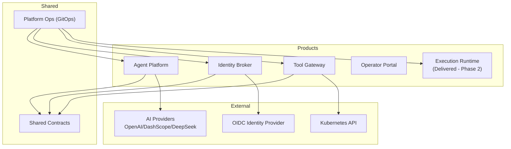
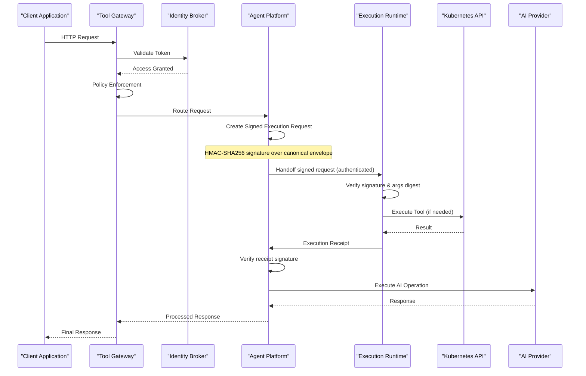
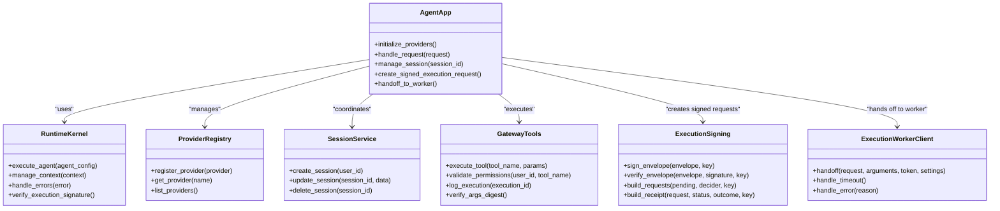
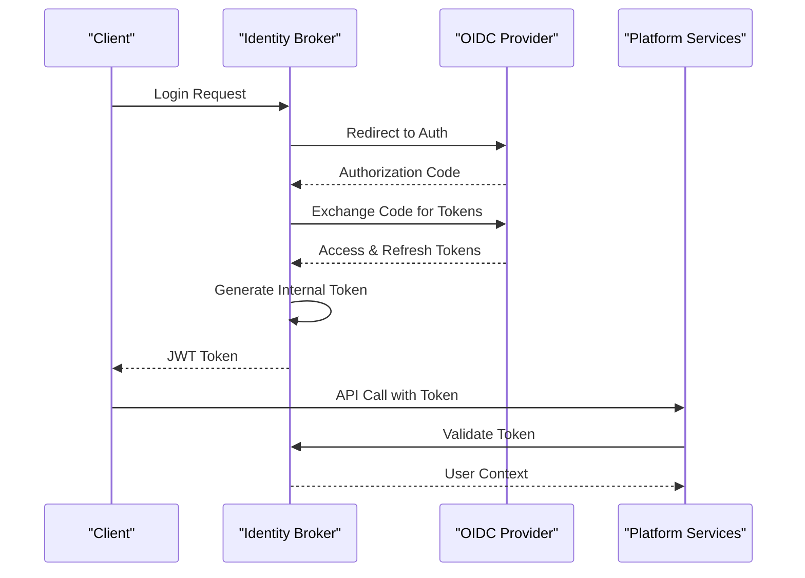
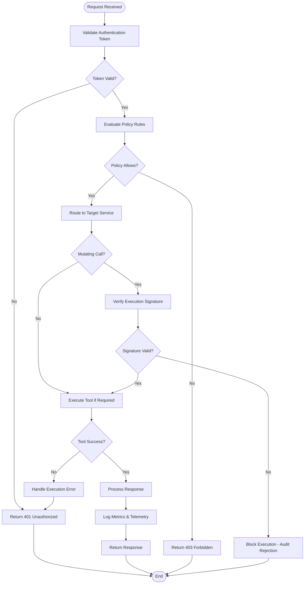
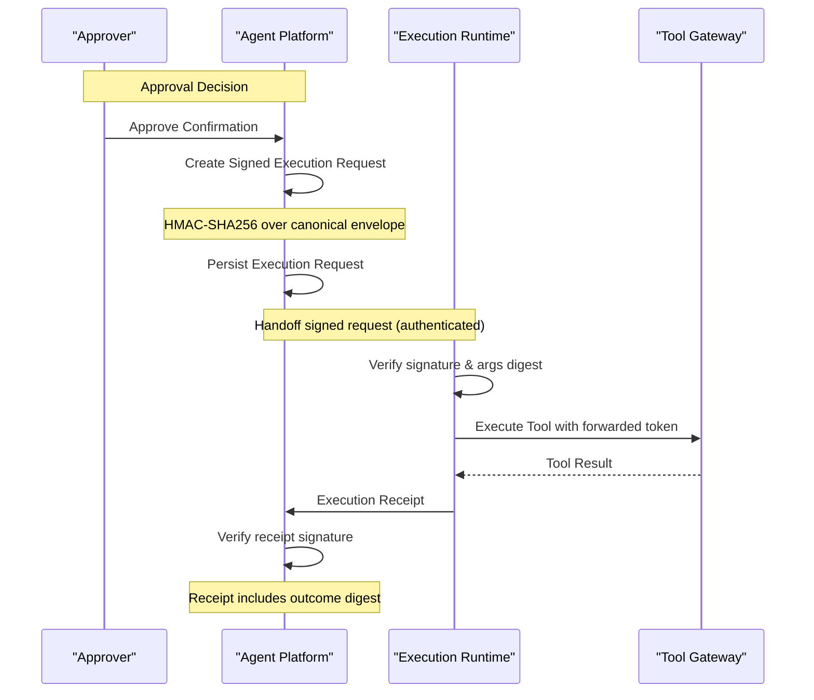
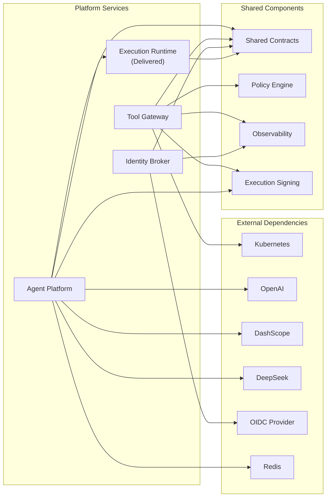
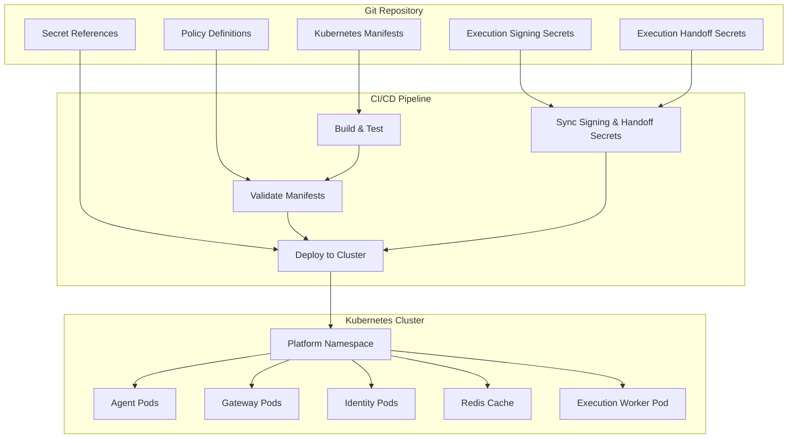

# Project Overview

<cite>
**Referenced Files in This Document**
- [README.md](file://README.md)
- [SECURITY.md](file://SECURITY.md)
- [CONTRIBUTING.md](file://CONTRIBUTING.md)
- [Makefile](file://Makefile)
- [agent-platform README.md](file://products/agent-platform/README.md)
- [identity-broker README.md](file://products/identity-broker/README.md)
- [operator-portal README.md](file://products/operator-portal/README.md)
- [tool-gateway README.md](file://products/tool-gateway/README.md)
- [execution-runtime README.md](file://products/execution-runtime/README.md)
- [platform GitOps README.md](file://shared/platform-ops/gitops/dev-k8s/README.md)
- [runtime profiles README.md](file://shared/platform-ops/gitops/runtime-profiles/README.md)
- [agent platform app.py](file://products/agent-platform/src/agent_platform/app.py)
- [agent platform main.py](file://products/agent-platform/src/agent_platform/main.py)
- [agent platform providers registry](file://products/agent-platform/src/agent_platform/providers/registry.py)
- [agent platform runtime kernel](file://products/agent-platform/src/agent_platform/runtime_kernel.py)
- [agent platform session service](file://products/agent-platform/src/agent_platform/services/session_service.py)
- [agent platform gateway tools](file://products/agent-platform/src/agent_platform/tools/gateway_tools.py)
- [agent platform execution signing](file://products/agent-platform/src/agent_service/services/execution_signing.py)
- [agent platform execution worker client](file://products/agent-platform/src/agent_service/services/execution_worker_client.py)
- [identity broker app.py](file://products/identity-broker/src/identity_service/app.py)
- [identity broker identity service](file://products/identity-broker/src/identity_service/services/identity_service.py)
- [identity broker token service](file://products/identity-broker/src/identity_service/services/token_service.py)
- [tool gateway k8s connector](file://products/tool-gateway/src/tool_gateway/tools/k8s_connector.py)
- [sync execution signing secret](file://shared/platform-ops/gitops/sync-execution-signing-secret.sh)
- [sync execution handoff secret](file://shared/platform-ops/gitops/sync-execution-handoff-secret.sh)
- [shared contracts schemas README](file://shared/shared-contracts/README.md)
- [observability conventions](file://shared/shared-contracts/observability-conventions.md)
- [dev-k8s base kustomization](file://shared/platform-ops/gitops/dev-k8s/base/kustomization.yaml)
- [dev-k8s agent deployment](file://shared/platform-ops/gitops/dev-k8s/base/agent-platform/agent-service-deployment.yaml)
- [dev-k8s identity deployment](file://shared/platform-ops/gitops/dev-k8s/base/identity-broker/identity-service-deployment.yaml)
- [dev-k8s tool gateway deployment](file://shared/platform-ops/gitops/dev-k8s/base/tool-gateway/api-gateway-deployment.yaml)
- [dev-k8s redis deployment](file://shared/platform-ops/gitops/dev-k8s/base/infra/redis-deployment.yaml)
- [openai runtime profile configmap](file://shared/platform-ops/gitops/runtime-profiles/openai/configmap.yaml)
- [dashscope runtime profile configmap](file://shared/platform-ops/gitops/runtime-profiles/dashscope/configmap.yaml)
- [deepseek runtime profile configmap](file://shared/platform-ops/gitops/runtime-profiles/deepseek/configmap.yaml)
- [delivery roadmap](file://docs/agentic-aiops-platform/delivery-roadmap.md)
- [SPEC-037 signed execution requests spec](file://docs/specs/SPEC-037-signed-execution-requests/spec.md)
- [SPEC-037 implementation plan](file://docs/specs/SPEC-037-signed-execution-requests/plan.md)
- [SPEC-038 isolated execution worker spec](file://docs/specs/SPEC-038-isolated-execution-worker/spec.md)
- [SPEC-038 implementation plan](file://docs/specs/SPEC-038-isolated-execution-worker/plan.md)
- [execution runtime spike memo](file://docs/workspace/execution-runtime-spike.md)
- [reference architecture security section](file://docs/agentic-aiops-platform/part-2-reference-architecture.md)
- [identity and authorization design](file://docs/agentic-aiops-platform/identity-and-authorization-design.md)
- [v0.19.0 release notes](file://docs/agentic-aiops-platform/release-notes/2026-08-27-signed-execution-requests.md)
- [v0.20.0 release notes](file://docs/agentic-aiops-platform/release-notes/2026-08-27-isolated-execution-worker.md)
</cite>

## Update Summary
**Changes Made**
- Updated R4 deliverable status to reflect completion of both SPEC-037 (delivered in v0.19.0) and SPEC-038 (delivered in v0.20.0)
- Enhanced security model documentation with production-ready execution signing capabilities and isolated execution worker
- Added detailed sections covering tamper-evident execution records, cryptographic approval-to-execution binding, and process isolation
- Updated architecture diagrams to show the complete execution signing flow including the deployed isolated worker
- Expanded security considerations to include HMAC-SHA256 envelope verification, fail-closed design principles, and authenticated internal handoff
- Updated delivery roadmap to show R4 completion status with all six deliverables shipped

## Table of Contents
1. [Introduction](#introduction)
2. [Project Structure](#project-structure)
3. [Core Components](#core-components)
4. [Architecture Overview](#architecture-overview)
5. [Detailed Component Analysis](#detailed-component-analysis)
6. [Security Model and Execution Signing](#security-model-and-execution-signing)
7. [Dependency Analysis](#dependency-analysis)
8. [Performance Considerations](#performance-considerations)
9. [Troubleshooting Guide](#troubleshooting-guide)
10. [Conclusion](#conclusion)
11. [Appendices](#appendices)

## Introduction
Luban AIOps Platform is an AI-powered operations automation system designed to orchestrate intelligent agents, enforce policies, manage identities, and execute operational tools safely at scale. It provides a microservices-based runtime that integrates with Kubernetes for orchestration, external AI providers (OpenAI, DashScope, DeepSeek), and identity providers via OIDC. The platform emphasizes secure-by-design operations, observability, and GitOps-driven deployments.

Key value propositions:
- Centralized AI agent orchestration with standardized contracts
- Strong identity and authorization model with OIDC integration
- Policy enforcement as code for safe tool execution
- **Tamper-evident execution signing for approved actions (SPEC-037 delivered in v0.19.0)**
- **Isolated execution worker architecture (SPEC-038 delivered in v0.20.0)**
- Extensible tool execution framework for Kubernetes and other systems
- End-to-end observability and telemetry
- GitOps-native deployment and configuration management

Target audience:
- Developers building AI-powered automation workflows
- Operators managing production-grade platforms
- Security teams enforcing compliance and governance

**Section sources**
- [README.md](file://README.md)
- [SECURITY.md](file://SECURITY.md)
- [CONTRIBUTING.md](file://CONTRIBUTING.md)

## Project Structure
The platform follows a product-based microservices architecture with shared contracts and GitOps infrastructure:

**Diagram sources**
- [agent-platform README.md](file://products/agent-platform/README.md)
- [identity-broker README.md](file://products/identity-broker/README.md)
- [tool-gateway README.md](file://products/tool-gateway/README.md)
- [execution-runtime README.md](file://products/execution-runtime/README.md)
- [shared contracts schemas README](file://shared/shared-contracts/README.md)
- [platform GitOps README.md](file://shared/platform-ops/gitops/dev-k8s/README.md)

**Section sources**
- [agent-platform README.md](file://products/agent-platform/README.md)
- [identity-broker README.md](file://products/identity-broker/README.md)
- [tool-gateway README.md](file://products/tool-gateway/README.md)
- [execution-runtime README.md](file://products/execution-runtime/README.md)
- [shared contracts schemas README](file://shared/shared-contracts/README.md)
- [platform GitOps README.md](file://shared/platform-ops/gitops/dev-k8s/README.md)

## Core Components
The platform consists of five primary microservices:

### Agent Platform
- Orchestrates AI agents with provider abstraction
- Manages sessions and runtime context
- Integrates with external AI providers through a unified interface
- Provides tool execution capabilities with **production-ready signed execution requests**
- **Hands off approved mutating calls to the isolated execution worker**

### Identity Broker
- Handles OIDC authentication and authorization
- Issues and validates tokens for service-to-service communication
- Manages user and service identities

### Tool Gateway
- Central entry point for all API requests
- Enforces policies before tool execution
- Routes requests to appropriate services
- Integrates with Kubernetes for cluster operations
- **Verifies execution request signatures for mutating calls**

### Operator Portal
- Web-based interface for platform management
- Provides monitoring and control capabilities
- **Displays execution receipts and digest match status on confirmation cards**

### Execution Runtime (Delivered - Phase 2)
- **Deployed isolated worker service** that receives signed execution requests over authenticated internal handoff
- **Independently verifies signatures and argument digests** from the SPEC-037 envelope
- **Performs tool-gateway calls with forwarded delegated tokens**
- **Provides process isolation for approved bounded actions**
- **Maintains single-flight idempotency keyed by execution ID**

**Section sources**
- [agent-platform README.md](file://products/agent-platform/README.md)
- [identity-broker README.md](file://products/identity-broker/README.md)
- [tool-gateway README.md](file://products/tool-gateway/README.md)
- [operator-portal README.md](file://products/operator-portal/README.md)
- [execution-runtime README.md](file://products/execution-runtime/README.md)

## Architecture Overview
The platform implements a layered microservices architecture with clear separation of concerns:

**Diagram sources**
- [tool gateway app.py](file://products/tool-gateway/src/api_gateway/app.py)
- [identity broker app.py](file://products/identity-broker/src/identity_service/app.py)
- [agent platform app.py](file://products/agent-platform/src/agent_platform/app.py)
- [execution-runtime README.md](file://products/execution-runtime/README.md)

**Section sources**
- [tool gateway app.py](file://products/tool-gateway/src/api_gateway/app.py)
- [identity broker app.py](file://products/identity-broker/src/identity_service/app.py)
- [agent platform app.py](file://products/agent-platform/src/agent_platform/app.py)

## Detailed Component Analysis

### Agent Platform Architecture
The Agent Platform serves as the core AI orchestration engine with provider abstraction and session management:

**Diagram sources**
- [agent platform app.py](file://products/agent-platform/src/agent_platform/app.py)
- [agent platform runtime kernel](file://products/agent-platform/src/agent_platform/runtime_kernel.py)
- [agent platform providers registry](file://products/agent-platform/src/agent_platform/providers/registry.py)
- [agent platform session service](file://products/agent-platform/src/agent_platform/services/session_service.py)
- [agent platform gateway tools](file://products/agent-platform/src/agent_platform/tools/gateway_tools.py)
- [agent platform execution signing](file://products/agent-platform/src/agent_service/services/execution_signing.py)
- [agent platform execution worker client](file://products/agent-platform/src/agent_service/services/execution_worker_client.py)

### Identity Management Flow
The Identity Broker handles OIDC authentication and token management:

**Diagram sources**
- [identity broker app.py](file://products/identity-broker/src/identity_service/app.py)
- [identity broker identity service](file://products/identity-broker/src/identity_service/services/identity_service.py)
- [identity broker token service](file://products/identity-broker/src/identity_service/services/token_service.py)

### Tool Execution Framework
The Tool Gateway provides centralized tool execution with policy enforcement:

**Diagram sources**
- [tool gateway app.py](file://products/tool-gateway/src/api_gateway/app.py)
- [tool gateway gateway service](file://products/tool-gateway/src/api_gateway/services/gateway_service.py)
- [tool gateway policy engine](file://products/tool-gateway/src/api_gateway/services/policy_engine.py)
- [tool gateway k8s connector](file://products/tool-gateway/src/tool_gateway/tools/k8s_connector.py)

**Section sources**
- [agent platform app.py](file://products/agent-platform/src/agent_platform/app.py)
- [agent platform runtime kernel](file://products/agent-platform/src/agent_platform/runtime_kernel.py)
- [agent platform providers registry](file://products/agent-platform/src/agent_platform/providers/registry.py)
- [agent platform session service](file://products/agent-platform/src/agent_platform/services/session_service.py)
- [agent platform gateway tools](file://products/agent-platform/src/agent_platform/tools/gateway_tools.py)
- [agent platform execution signing](file://products/agent-platform/src/agent_service/services/execution_signing.py)
- [agent platform execution worker client](file://products/agent-platform/src/agent_service/services/execution_worker_client.py)
- [identity broker app.py](file://products/identity-broker/src/identity_service/app.py)
- [identity broker identity service](file://products/identity-broker/src/identity_service/services/identity_service.py)
- [identity broker token service](file://products/identity-broker/src/identity_service/services/token_service.py)
- [tool gateway app.py](file://products/tool-gateway/src/api_gateway/app.py)
- [tool gateway gateway service](file://products/tool-gateway/src/api_gateway/services/gateway_service.py)
- [tool gateway policy engine](file://products/tool-gateway/src/api_gateway/services/policy_engine.py)
- [tool gateway k8s connector](file://products/tool-gateway/src/tool_gateway/tools/k8s_connector.py)

## Security Model and Execution Signing

### Tamper-Evident Execution Records

**Updated** The platform now implements production-ready cryptographic binding between approvals and executions through HMAC-SHA256 signed execution requests and an isolated execution worker. When a parked confirmation is resumed with approval, the agent platform constructs one signed execution request per approved tool call before any invocation happens, then hands it off to the isolated execution worker for independent verification and execution. This capability was delivered in v0.19.0 (SPEC-037) and enhanced in v0.20.0 (SPEC-038).

#### Execution Signing Architecture

**Diagram sources**
- [SPEC-037 signed execution requests spec](file://docs/specs/SPEC-037-signed-execution-requests/spec.md)
- [SPEC-037 implementation plan](file://docs/specs/SPEC-037-signed-execution-requests/plan.md)
- [SPEC-038 isolated execution worker spec](file://docs/specs/SPEC-038-isolated-execution-worker/spec.md)
- [execution runtime spike memo](file://docs/workspace/execution-runtime-spike.md)

#### Key Security Features

- **HMAC-SHA256 Envelope**: Each execution request contains a signature computed over canonical JSON arguments, tool name, confirmation ID, session ID, decider user ID, and timestamp
- **Fail-Closed Design**: Missing signing keys cause execution rejection rather than silent degradation
- **Argument Integrity**: Executed arguments are verified against the signed digest at the gateway boundary
- **Durable Records**: Both execution requests and receipts are persisted alongside confirmation records
- **Audit Trail**: New audit events (`execution_requested`, `execution_completed`, `execution_rejected`) extend the existing audit schema
- **Production Deployment**: Signing key provisioned via `sync-execution-signing-secret.sh` with automatic restart
- **Authenticated Internal Handoff**: Worker authenticates agent-service with static handoff token and independently verifies signatures
- **Process Isolation**: Approved actions execute in separate process with infrastructure-enforced boundaries

#### Trust Zone Integration

The execution signing capability strengthens the platform's trust zones by ensuring that the execution zone receives only cryptographically verified instructions from the control zone:

- **Reasoning Zone**: Continues to handle AI model reasoning without direct execution privileges
- **Control Zone**: Maintains authority over approval decisions and execution request creation
- **Execution Zone**: Receives only signed, verified execution requests with integrity guarantees through authenticated handoff

#### Deployed Isolated Execution Worker (SPEC-038)

**Updated** The platform has successfully delivered an isolated execution worker that further strengthens security boundaries. This Phase 2 component delivers:

- **Authenticated Internal Handoff**: Receives signed execution requests over authenticated internal endpoint with static handoff token
- **Independent Verification**: Verifies signatures and argument digests independently using `execution_signing.verify_envelope`
- **Forwarded Delegation**: Performs tool-gateway calls with forwarded delegated tokens while maintaining identity posture
- **Process Isolation**: Provides genuine process isolation for approved bounded actions through dedicated Deployment/ClusterIP Service
- **Single-Flight Idempotency**: Maintains single-flight idempotency keyed by execution ID with in-process registry
- **Infrastructure Enforcement**: No HTTPRoute or portal exposure - only reachable via authenticated internal handoff

The worker inherits the SPEC-037 envelope contract verbatim and represents the first production consumer of the `execution_signing.verify_envelope` function, providing genuine independent verification of the approval-to-execution chain.

**Section sources**
- [SPEC-037 signed execution requests spec](file://docs/specs/SPEC-037-signed-execution-requests/spec.md)
- [SPEC-037 implementation plan](file://docs/specs/SPEC-037-signed-execution-requests/plan.md)
- [SPEC-038 isolated execution worker spec](file://docs/specs/SPEC-038-isolated-execution-worker/spec.md)
- [SPEC-038 implementation plan](file://docs/specs/SPEC-038-isolated-execution-worker/plan.md)
- [execution runtime spike memo](file://docs/workspace/execution-runtime-spike.md)
- [agent platform execution signing](file://products/agent-platform/src/agent_service/services/execution_signing.py)
- [agent platform execution worker client](file://products/agent-platform/src/agent_service/services/execution_worker_client.py)
- [execution-runtime README.md](file://products/execution-runtime/README.md)
- [sync execution signing secret](file://shared/platform-ops/gitops/sync-execution-signing-secret.sh)
- [sync execution handoff secret](file://shared/platform-ops/gitops/sync-execution-handoff-secret.sh)
- [reference architecture security section](file://docs/agentic-aiops-platform/part-2-reference-architecture.md)

## Dependency Analysis
The platform maintains clear dependency boundaries between services:

**Diagram sources**
- [agent platform providers registry](file://products/agent-platform/src/agent_platform/providers/registry.py)
- [tool gateway k8s connector](file://products/tool-gateway/src/tool_gateway/tools/k8s_connector.py)
- [execution-runtime README.md](file://products/execution-runtime/README.md)
- [shared contracts schemas README](file://shared/shared-contracts/README.md)

**Section sources**
- [agent platform providers registry](file://products/agent-platform/src/agent_platform/providers/registry.py)
- [tool gateway k8s connector](file://products/tool-gateway/src/tool_gateway/tools/k8s_connector.py)
- [execution-runtime README.md](file://products/execution-runtime/README.md)
- [shared contracts schemas README](file://shared/shared-contracts/README.md)

## Performance Considerations
The platform is designed for high-performance operations with several key considerations:

- **Connection Pooling**: Efficient resource utilization through connection pooling for external services
- **Async Processing**: Asynchronous request handling for improved throughput
- **Caching Strategies**: Session caching and response caching where appropriate
- **Resource Limits**: Container resource limits and requests for predictable performance
- **Monitoring**: Comprehensive metrics collection and alerting
- **Scalability**: Horizontal scaling capabilities for all microservices
- **Signature Verification**: HMAC-SHA256 verification adds minimal overhead while providing strong security guarantees
- **Execution Isolation**: Deployed isolated worker provides process-level isolation for better blast radius containment
- **Single-Flight Idempotency**: In-process registry prevents duplicate executions while allowing concurrent joins

[No sources needed since this section provides general guidance]

## Troubleshooting Guide
Common issues and their resolution strategies:

### Authentication Issues
- Verify OIDC provider configuration
- Check token validation settings
- Ensure proper certificate configuration

### Tool Execution Failures
- Review policy engine configurations
- Validate Kubernetes RBAC permissions
- Check tool-specific error logs
- **Verify execution signing key availability**
- **Check argument digest mismatches in audit logs**

### Performance Problems
- Monitor resource utilization
- Analyze request latency patterns
- Review database connection pools

### Observability Setup
- Configure logging levels appropriately
- Set up metrics collection endpoints
- Implement distributed tracing

### Execution Signing Issues
- **Verify `AGENT_EXECUTION_SIGNING_KEY` environment variable is set**
- **Check `sync-execution-signing-secret.sh` script execution in deploy chain**
- **Review `execution_rejected` audit events for failure reasons**
- **Validate canonical JSON argument serialization consistency**
- **Ensure signing key persistence across redeployments**

### Isolated Worker Issues
- **Verify `AGENT_EXECUTION_WORKER_URL` and `AGENT_EXECUTION_HANDOFF_TOKEN` are configured**
- **Check `sync-execution-handoff-secret.sh` script execution in deploy chain**
- **Monitor worker pod health and readiness probes**
- **Review worker authentication failures (unauthorized, signature_invalid, args_digest_mismatch)**
- **Check worker timeout configurations (`AGENT_EXECUTION_WORKER_TIMEOUT_SECONDS`)**
- **Verify worker can reach tool-gateway and state store**

**Section sources**
- [observability conventions](file://shared/shared-contracts/observability-conventions.md)
- [tool gateway policy engine](file://products/tool-gateway/src/api_gateway/services/policy_engine.py)
- [identity broker token service](file://products/identity-broker/src/identity_service/services/token_service.py)
- [SPEC-037 signed execution requests spec](file://docs/specs/SPEC-037-signed-execution-requests/spec.md)
- [SPEC-038 isolated execution worker spec](file://docs/specs/SPEC-038-isolated-execution-worker/spec.md)
- [sync execution signing secret](file://shared/platform-ops/gitops/sync-execution-signing-secret.sh)
- [sync execution handoff secret](file://shared/platform-ops/gitops/sync-execution-handoff-secret.sh)

## Conclusion
Luban AIOps Platform provides a comprehensive solution for AI-powered operations automation through its microservices architecture. The platform successfully addresses the needs of developers, operators, and security teams by offering robust agent orchestration, strong identity management, policy enforcement, and extensible tool execution capabilities. Its GitOps-native approach ensures reliable deployments while maintaining high standards for security and observability.

**Enhanced Security Posture**: With the completion of SPEC-037 and SPEC-038, the platform now provides production-ready tamper-evident execution records that cryptographically bind approvals to actual executions, along with an isolated execution worker that provides genuine process isolation. The HMAC-SHA256 signing mechanism ensures that executed arguments match exactly what approvers saw on confirmation cards, while the authenticated internal handoff and independent verification provide multiple layers of security assurance.

**Complete R4 Delivery**: The platform has successfully delivered all six R4 deliverables, closing the "Approval-Gated Bounded Actions" release with both signed execution requests and isolated execution worker components. These two components together provide both tamper-evident execution records and process isolation for approved actions, representing a significant milestone in the platform's security evolution.

The platform's design enables organizations to build sophisticated AI-powered automation workflows while maintaining full control over security, compliance, and operational aspects. With support for multiple AI providers, seamless Kubernetes integration, and now production-ready cryptographic execution signing with isolated execution, it provides a solid foundation for modern AI operations.

[No sources needed since this section summarizes without analyzing specific files]

## Appendices

### Deployment Architecture
The platform uses GitOps practices with Kubernetes for deployment:

**Diagram sources**
- [dev-k8s base kustomization](file://shared/platform-ops/gitops/dev-k8s/base/kustomization.yaml)
- [platform GitOps README.md](file://shared/platform-ops/gitops/dev-k8s/README.md)
- [execution-runtime README.md](file://products/execution-runtime/README.md)

### AI Provider Integration
The platform supports multiple AI providers through a unified interface:

| Provider | Configuration Key | Base URL | Authentication |
|----------|-------------------|----------|----------------|
| OpenAI | OPENAI_API_KEY | api.openai.com | API Key |
| DashScope | DASHSCOPE_API_KEY | dashscope.aliyuncs.com | API Key |
| DeepSeek | DEEPSEEK_API_KEY | api.deepseek.com | API Key |

**Section sources**
- [openai runtime profile configmap](file://shared/platform-ops/gitops/runtime-profiles/openai/configmap.yaml)
- [dashscope runtime profile configmap](file://shared/platform-ops/gitops/runtime-profiles/dashscope/configmap.yaml)
- [deepseek runtime profile configmap](file://shared/platform-ops/gitops/runtime-profiles/deepseek/configmap.yaml)

### Security Model
The platform implements a multi-layered security approach:

- **Authentication**: OIDC-based user authentication
- **Authorization**: Role-based access control with policy enforcement
- **Encryption**: TLS for all communications, encrypted secrets storage
- **Audit Logging**: Comprehensive audit trails for all operations
- **Network Security**: Network policies and service mesh integration
- **Execution Signing**: Production-ready HMAC-SHA256 signed execution requests with fail-closed design
- **Argument Integrity**: Cryptographic verification of executed arguments against approved digests
- **Process Isolation**: Deployed isolated execution worker with authenticated internal handoff
- **Independent Verification**: Worker independently verifies signatures and argument digests

### Delivery Roadmap Status

**Updated** The R4 release "Approval-Gated Bounded Actions" has been completed with all six deliverables shipped: policy engine (SPEC-030), approval workflow (SPEC-031–036), approval queue and action cards (SPEC-031/033/034), first bounded operational actions (SPEC-021), signed execution requests (SPEC-037, delivered in v0.19.0), and isolated execution worker (SPEC-038, delivered in v0.20.0). These components together close the R4 scope, providing both tamper-evident execution records and process isolation for approved actions.

| Release | Theme | Status | Key Deliverables |
|---------|-------|--------|------------------|
| R0 | Platform Foundation | ✅ Complete | Basic platform baseline |
| R1 | Read-Only Operations Copilot | ✅ Complete | Grounded operational answers |
| R2 | Skills and Grounded Guidance | ✅ Complete | Team-owned procedural guidance |
| R3 | Incident Triage and Collaboration | ✅ Complete | Faster incident response |
| R4 | Approval-Gated Bounded Actions | ✅ Complete | Safe actions with signed execution requests and isolated worker |
| R5 | Hardening and External Consumption | 🔄 Planned | Broader adoption readiness |

**Section sources**
- [delivery roadmap](file://docs/agentic-aiops-platform/delivery-roadmap.md)
- [SPEC-037 signed execution requests spec](file://docs/specs/SPEC-037-signed-execution-requests/spec.md)
- [SPEC-038 isolated execution worker spec](file://docs/specs/SPEC-038-isolated-execution-worker/spec.md)
- [v0.19.0 release notes](file://docs/agentic-aiops-platform/release-notes/2026-08-27-signed-execution-requests.md)
- [v0.20.0 release notes](file://docs/agentic-aiops-platform/release-notes/2026-08-27-isolated-execution-worker.md)