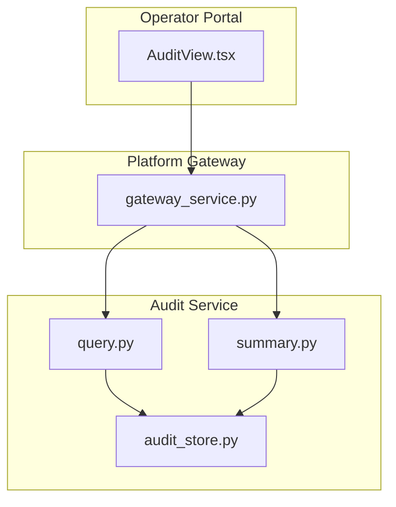
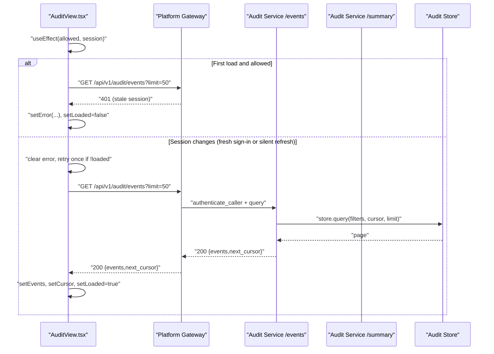
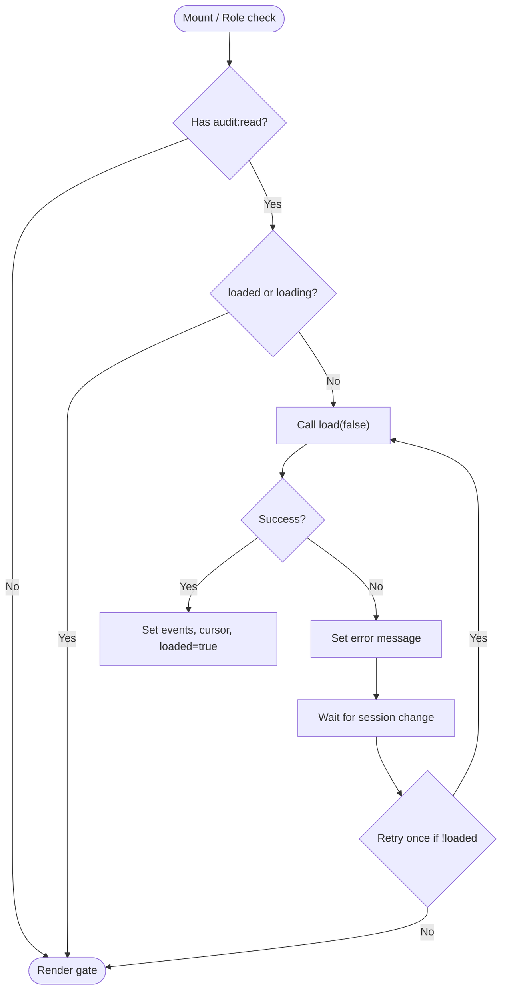
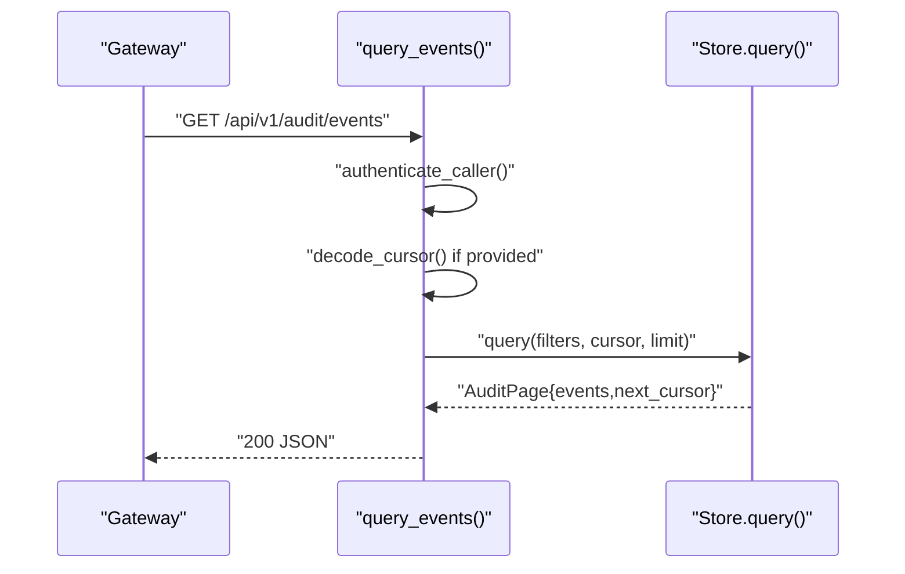
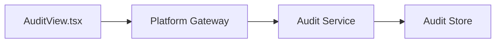

# Release Notes v0.29.3 - Audit Events Initial-Load Recovery

<cite>
**Referenced Files in This Document**
- [2026-09-01-post-live-check-audit-events-initial-load-recovery.md](file://docs/agentic-aiops-platform/release-notes/2026-09-01-post-live-check-audit-events-initial-load-recovery.md)
- [AuditView.tsx](file://products/operator-portal/web-ui/app/src/views/audit/AuditView.tsx)
- [query.py](file://products/audit-service/src/audit_service/api/routes/query.py)
- [summary.py](file://products/audit-service/src/audit_service/api/routes/summary.py)
- [audit_store.py](file://products/audit-service/src/audit_service/services/audit_store.py)
- [gateway_service.py](file://products/platform-gateway/src/platform_gateway/services/gateway_service.py)
</cite>

## Table of Contents
1. [Introduction](#introduction)
2. [Project Structure](#project-structure)
3. [Core Components](#core-components)
4. [Architecture Overview](#architecture-overview)
5. [Detailed Component Analysis](#detailed-component-analysis)
6. [Dependency Analysis](#dependency-analysis)
7. [Performance Considerations](#performance-considerations)
8. [Troubleshooting Guide](#troubleshooting-guide)
9. [Conclusion](#conclusion)

## Introduction
This release addresses an intermittent initial-load issue in the Operator Portal’s Audit Events tab. During a stale-session boot window, the first auto-load could fail with 401 and leave the view stuck on its failure posture until a manual Refresh. The fix adds identity-lifecycle awareness to the initial-load effect so it retries once after a fresh sign-in or silent refresh, without changing any backend APIs, contracts, routes, or policies.

## Project Structure
The change is isolated to the portal’s Audit view component and is backed by existing audit-service endpoints and gateway authorization. The audit service provides:
- A paginated events query endpoint
- A summary aggregation endpoint
- A durable store abstraction (in-memory for dev/test, PostgreSQL for production)

**Diagram sources**
- [AuditView.tsx:134-199](file://products/operator-portal/web-ui/app/src/views/audit/AuditView.tsx#L134-L199)
- [gateway_service.py:201-261](file://products/platform-gateway/src/platform_gateway/services/gateway_service.py#L201-L261)
- [query.py:35-94](file://products/audit-service/src/audit_service/api/routes/query.py#L35-L94)
- [summary.py:34-78](file://products/audit-service/src/audit_service/api/routes/summary.py#L34-L78)
- [audit_store.py:42-63](file://products/audit-service/src/audit_service/services/audit_store.py#L42-L63)

**Section sources**
- [2026-09-01-post-live-check-audit-events-initial-load-recovery.md:1-52](file://docs/agentic-aiops-platform/release-notes/2026-09-01-post-live-check-audit-events-initial-load-recovery.md#L1-L52)

## Core Components
- AuditView (Portal): Owns filter state, loading/error/loaded flags, and the initial-load effect that fetches events and summary data. In v0.29.3, the effect is keyed on both role access and the session object to recover from stale-session failures.
- Audit Service Query Endpoint: Accepts filters and cursor, authenticates the caller via service credentials, validates cursors, queries the store, and returns a page with next_cursor.
- Audit Service Summary Endpoint: Authenticates the caller, builds filters, aggregates envelope columns, and returns deterministic summaries.
- Audit Store Abstraction: Provides query and summarize operations over either an in-memory store (dev/test) or PostgreSQL (production).

**Section sources**
- [AuditView.tsx:101-199](file://products/operator-portal/web-ui/app/src/views/audit/AuditView.tsx#L101-L199)
- [query.py:35-94](file://products/audit-service/src/audit_service/api/routes/query.py#L35-L94)
- [summary.py:34-78](file://products/audit-service/src/audit_service/api/routes/summary.py#L34-L78)
- [audit_store.py:42-63](file://products/audit-service/src/audit_service/services/audit_store.py#L42-L63)

## Architecture Overview
The portal’s Audit view triggers an initial load when the user has the required roles. If the browser boots with a stale expired session, the first request can receive 401 while the shell still appears signed-in due to cached identity fallback. The fix ensures that when the session changes (stale cleared, fresh sign-in, or silent refresh), the effect clears any latched error and retries once if not yet loaded.

**Diagram sources**
- [AuditView.tsx:185-199](file://products/operator-portal/web-ui/app/src/views/audit/AuditView.tsx#L185-L199)
- [query.py:35-94](file://products/audit-service/src/audit_service/api/routes/query.py#L35-L94)
- [audit_store.py:386-415](file://products/audit-service/src/audit_service/services/audit_store.py#L386-L415)

## Detailed Component Analysis

### AuditView Initial-Load Effect (v0.29.3)
- Problem: The initial-load effect was only keyed on role access; a 401 during the stale-session window left the view in a failed posture until a manual Refresh.
- Fix: Key the effect on both role access and the session object. On session transitions, clear any latched error and perform one retry if the view has not yet loaded.
- Impact: No API or policy changes; purely client-side lifecycle handling.

**Diagram sources**
- [AuditView.tsx:185-199](file://products/operator-portal/web-ui/app/src/views/audit/AuditView.tsx#L185-L199)

**Section sources**
- [AuditView.tsx:101-199](file://products/operator-portal/web-ui/app/src/views/audit/AuditView.tsx#L101-L199)
- [2026-09-01-post-live-check-audit-events-initial-load-recovery.md:11-41](file://docs/agentic-aiops-platform/release-notes/2026-09-01-post-live-check-audit-events-initial-load-recovery.md#L11-L41)

### Audit Service Query Endpoint
- Validates cursors and enforces service authentication before querying.
- Returns a page of events newest-first with a next_cursor for pagination.

**Diagram sources**
- [query.py:35-94](file://products/audit-service/src/audit_service/api/routes/query.py#L35-L94)
- [audit_store.py:42-63](file://products/audit-service/src/audit_service/services/audit_store.py#L42-L63)

**Section sources**
- [query.py:35-94](file://products/audit-service/src/audit_service/api/routes/query.py#L35-L94)

### Audit Service Summary Endpoint
- Authenticates the caller and returns deterministic envelope-column aggregates.
- Used by the Summary tab; unaffected by the v0.29.3 fix but part of the same view.

**Section sources**
- [summary.py:34-78](file://products/audit-service/src/audit_service/api/routes/summary.py#L34-L78)

### Audit Store Abstraction
- Provides consistent query and summarize behavior across backends.
- In-memory store for tests/dev; PostgreSQL store for production with keyset pagination and bounded eviction.

**Section sources**
- [audit_store.py:42-63](file://products/audit-service/src/audit_service/services/audit_store.py#L42-L63)
- [audit_store.py:386-415](file://products/audit-service/src/audit_service/services/audit_store.py#L386-L415)

## Dependency Analysis
- The portal’s AuditView depends on:
  - Auth context for roles and session
  - Gateway endpoints for events and summary
- The gateway enforces policy and forwards authenticated requests to the audit service.
- The audit service depends on the configured store backend.

**Diagram sources**
- [AuditView.tsx:134-199](file://products/operator-portal/web-ui/app/src/views/audit/AuditView.tsx#L134-L199)
- [gateway_service.py:201-261](file://products/platform-gateway/src/platform_gateway/services/gateway_service.py#L201-L261)
- [query.py:35-94](file://products/audit-service/src/audit_service/api/routes/query.py#L35-L94)
- [audit_store.py:42-63](file://products/audit-service/src/audit_service/services/audit_store.py#L42-L63)

**Section sources**
- [gateway_service.py:201-261](file://products/platform-gateway/src/platform_gateway/services/gateway_service.py#L201-L261)

## Performance Considerations
- The fix avoids repeated network calls by retrying only once on session transitions and only when the view has not yet loaded.
- The audit service uses keyset pagination and bounded limits to keep responses small and efficient.
- Summaries are computed over envelope columns only, avoiding payload excavation.

[No sources needed since this section provides general guidance]

## Troubleshooting Guide
- Symptom: Audit Events tab shows “No audit events match these filters” on first load, but Summary counts show events.
- Root cause: Initial auto-load fails with 401 during a stale-session window; the effect does not retry automatically.
- Resolution: After signing in again or allowing a silent refresh, the view will automatically retry once and populate the table.
- Verification:
  - Confirm the gateway logs show 401 followed by successful requests after session refresh.
  - Ensure the effect dependency includes the session object so it re-runs on identity lifecycle changes.
  - Confirm no manual Refresh is required post-sign-in.

**Section sources**
- [2026-09-01-post-live-check-audit-events-initial-load-recovery.md:11-41](file://docs/agentic-aiops-platform/release-notes/2026-09-01-post-live-check-audit-events-initial-load-recovery.md#L11-L41)
- [AuditView.tsx:185-199](file://products/operator-portal/web-ui/app/src/views/audit/AuditView.tsx#L185-L199)

## Conclusion
Release v0.29.3 resolves an initial-load recovery issue in the Audit Events tab by making the initial-load effect aware of identity lifecycle changes. The fix is minimal, targeted, and validated with a regression test. It preserves all existing server behaviors and contracts while improving resilience against transient authentication states at startup.