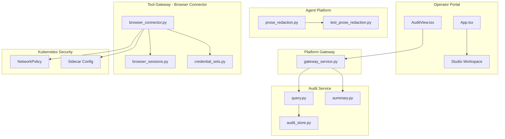
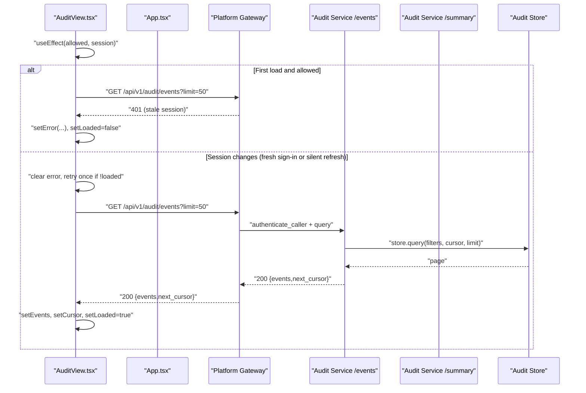
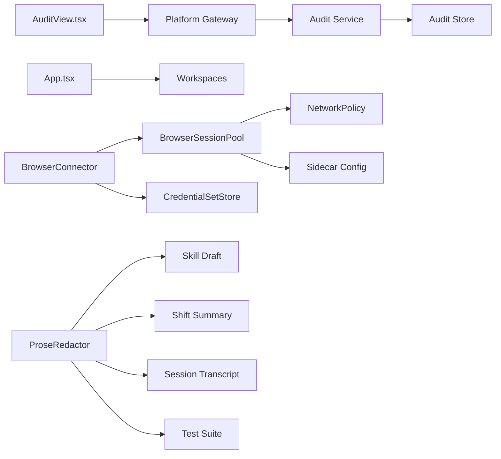

# Release Notes v0.29.3 - Audit Events Initial-Load Recovery

<cite>
**Referenced Files in This Document**
- [2026-09-01-post-live-check-audit-events-initial-load-recovery.md](file://docs/agentic-aiops-platform/release-notes/2026-09-01-post-live-check-audit-events-initial-load-recovery.md)
- [2026-09-11-post-release-doc-review-and-redaction-cache.md](file://docs/agentic-aiops-platform/release-notes/2026-09-11-post-release-doc-review-and-redaction-cache.md)
- [2026-09-11-post-release-code-review-credential-masking-edge-cases.md](file://docs/agentic-aiops-platform/release-notes/2026-09-11-post-release-code-review-credential-masking-edge-cases.md)
- [2026-09-13-post-release-review-studio-panel-refresh.md](file://docs/agentic-aiops-platform/release-notes/2026-09-13-post-release-review-studio-panel-refresh.md)
- [SPEC-056 spec.md](file://docs/specs/SPEC-056-studio-skill-development-workspace/spec.md)
- [SPEC-056 plan.md](file://docs/specs/SPEC-056-studio-skill-development-workspace/plan.md)
- [AuditView.tsx](file://products/operator-portal/web-ui/app/src/views/audit/AuditView.tsx)
- [App.tsx](file://products/operator-portal/web-ui/app/src/App.tsx)
- [App.studio.test.tsx](file://products/operator-portal/web-ui/app/src/__tests__/App.studio.test.tsx)
- [query.py](file://products/audit-service/src/audit_service/api/routes/query.py)
- [summary.py](file://products/audit-service/src/audit_service/api/routes/summary.py)
- [audit_store.py](file://products/audit-service/src/audit_service/services/audit_store.py)
- [gateway_service.py](file://products/platform-gateway/src/platform_gateway/services/gateway_service.py)
- [browser_connector.py](file://products/tool-gateway/src/tool_gateway/tools/browser_connector.py)
- [browser_sessions.py](file://products/tool-gateway/src/tool_gateway/tools/browser_sessions.py)
- [credential_sets.py](file://products/tool-gateway/src/tool_gateway/tools/credential_sets.py)
- [prose_redaction.py](file://products/agent-platform/src/agent_service/services/prose_redaction.py)
- [test_prose_redaction.py](file://products/agent-platform/tests/test_prose_redaction.py)
- [test_browser_connector.py](file://products/tool-gateway/tests/test_browser_connector.py)
- [browser-sidecar-network-policy.yaml](file://shared/platform-ops/gitops/runtime-profiles/browser-dev/browser-sidecar-network-policy.yaml)
- [tool-gateway-browser-sidecar.yaml](file://shared/platform-ops/gitops/runtime-profiles/browser-dev/tool-gateway-browser-sidecar.yaml)
</cite>

## Update Summary
**Changes Made**
- Added comprehensive post-release review documentation for v0.37.1 patch release covering the approvals inbox refresh regression fix and verification of SPEC-056 load-bearing invariants
- Updated project structure to include Studio panel components and approval workflow integration
- Enhanced security hardening documentation with new Studio session management capabilities
- Added comprehensive verification section documenting SPEC-056 invariant validation
- Updated conclusion to include both audit events recovery and Studio panel refresh improvements

## Table of Contents
1. [Introduction](#introduction)
2. [Project Structure](#project-structure)
3. [Core Components](#core-components)
4. [Architecture Overview](#architecture-overview)
5. [Detailed Component Analysis](#detailed-component-analysis)
6. [Security Hardening for Browser Connector (SPEC-049)](#security-hardening-for-browser-connector-spec-049)
7. [Studio Panel Refresh Fix (v0.37.1)](#studio-panel-refresh-fix-v0371)
8. [SPEC-056 Load-Bearing Invariant Verification](#spec-056-load-bearing-invariant-verification)
9. [Credential Masking Performance Optimization (v0.36.3)](#credential-masking-performance-optimization-v0363)
10. [Dependency Analysis](#dependency-analysis)
11. [Performance Considerations](#performance-considerations)
12. [Troubleshooting Guide](#troubleshooting-guide)
13. [Conclusion](#conclusion)

## Introduction
This release addresses multiple critical areas across three versions: an intermittent initial-load issue in the Operator Portal's Audit Events tab, comprehensive security hardening for the SPEC-049 browser connector, significant performance optimizations for credential masking through a hot-path cache implementation, and a crucial Studio panel refresh regression fix from v0.37.1. The audit events fix resolves stale-session failures during initial load by adding identity-lifecycle awareness to retry logic. The browser connector hardening implements defense-in-depth security measures including read-tier origin re-checking, CDP port pinning with NetworkPolicy protection, concurrent access fixes, and information disclosure prevention. The v0.36.3 performance optimization introduces a module-global cache for secret shape pattern resolution, eliminating repeated deferred imports on the streaming hot path while preserving import cycle safety. The v0.37.1 Studio panel refresh fix addresses a regression where approvals inbox decisions failed to refresh development sessions, leaving amber "awaiting approval" tags visible up to 30 seconds longer than intended.

## Project Structure
The changes span multiple components across the platform, including the newly introduced Studio workspace architecture:



**Diagram sources**
- [AuditView.tsx:134-199](file://products/operator-portal/web-ui/app/src/views/audit/AuditView.tsx#L134-L199)
- [App.tsx:105-143](file://products/operator-portal/web-ui/app/src/App.tsx#L105-L143)
- [gateway_service.py:201-261](file://products/platform-gateway/src/platform_gateway/services/gateway_service.py#L201-L261)
- [prose_redaction.py:90-125](file://products/agent-platform/src/agent_service/services/prose_redaction.py#L90-L125)
- [browser_connector.py:1-800](file://products/tool-gateway/src/tool_gateway/tools/browser_connector.py#L1-L800)
- [browser-sidecar-network-policy.yaml:1-30](file://shared/platform-ops/gitops/runtime-profiles/browser-dev/browser-sidecar-network-policy.yaml#L1-L30)

**Section sources**
- [2026-09-01-post-live-check-audit-events-initial-load-recovery.md:1-52](file://docs/agentic-aiops-platform/release-notes/2026-09-01-post-live-check-audit-events-initial-load-recovery.md#L1-L52)
- [2026-09-13-post-release-review-studio-panel-refresh.md:1-192](file://docs/agentic-aiops-platform/release-notes/2026-09-13-post-release-review-studio-panel-refresh.md#L1-L192)

## Core Components
- **AuditView (Portal)**: Owns filter state, loading/error/loaded flags, and the initial-load effect that fetches events and summary data. In v0.29.3, the effect is keyed on both role access and the session object to recover from stale-session failures.
- **App Component**: Manages dual workspace instances for operation and development sessions, with role-based visibility gating for Studio access.
- **BrowserConnector**: Implements bounded web-check tool surface with comprehensive security controls including origin allowlist enforcement, flow binding, deviation guards, and credential masking.
- **BrowserSessionPool**: Manages stateful browser sessions with concurrent access protection, TTL-based expiration, and memory-bounded eviction.
- **CredentialSetStore**: Provides secure named credential management with file-based configuration and automatic reload capabilities.
- **ProseRedactor Cache**: Implements hot-path caching for secret shape pattern resolution to optimize streaming performance.
- **Studio Workspace**: New development-focused workspace instance with separate session scoping and active session key namespaces.

**Section sources**
- [AuditView.tsx:101-199](file://products/operator-portal/web-ui/app/src/views/audit/AuditView.tsx#L101-L199)
- [App.tsx:105-143](file://products/operator-portal/web-ui/app/src/App.tsx#L105-L143)
- [browser_connector.py:159-260](file://products/tool-gateway/src/tool_gateway/tools/browser_connector.py#L159-L260)
- [browser_sessions.py:120-289](file://products/tool-gateway/src/tool_gateway/tools/browser_sessions.py#L120-L289)
- [credential_sets.py:30-103](file://products/tool-gateway/src/tool_gateway/tools/credential_sets.py#L30-L103)
- [prose_redaction.py:90-125](file://products/agent-platform/src/agent_service/services/prose_redaction.py#L90-L125)

## Architecture Overview
The portal's Audit view triggers an initial load when the user has the required roles. If the browser boots with a stale expired session, the first request can receive 401 while the shell still appears signed-in due to cached identity fallback. The fix ensures that when the session changes (stale cleared, fresh sign-in, or silent refresh), the effect clears any latched error and retries once if not yet loaded.



**Diagram sources**
- [AuditView.tsx:185-199](file://products/operator-portal/web-ui/app/src/views/audit/AuditView.tsx#L185-L199)
- [query.py:35-94](file://products/audit-service/src/audit_service/api/routes/query.py#L35-L94)
- [audit_store.py:386-415](file://products/audit-service/src/audit_service/services/audit_store.py#L386-L415)

## Detailed Component Analysis

### AuditView Initial-Load Effect (v0.29.3)
- **Problem**: The initial-load effect was only keyed on role access; a 401 during the stale-session window left the view in a failed posture until a manual Refresh.
- **Fix**: Key the effect on both role access and the session object. On session transitions, clear any latched error and perform one retry if the view has not yet loaded.
- **Impact**: No API or policy changes; purely client-side lifecycle handling.


**Diagram sources**
- [AuditView.tsx:185-199](file://products/operator-portal/web-ui/app/src/views/audit/AuditView.tsx#L185-L199)

**Section sources**
- [AuditView.tsx:101-199](file://products/operator-portal/web-ui/app/src/views/audit/AuditView.tsx#L101-L199)
- [2026-09-01-post-live-check-audit-events-initial-load-recovery.md:11-41](file://docs/agentic-aiops-platform/release-notes/2026-09-01-post-live-check-audit-events-initial-load-recovery.md#L11-L41)

### Browser Connector Security Hardening
The browser connector implements comprehensive security measures:

#### Read-Tier Origin Re-Checking
Every read operation (snapshot, screenshot) re-validates the current page origin against both the allowlist and bound flow origin before capturing content. This prevents post-load client-side redirects from producing unauthorized captures.

#### CDP Port Pinning and NetworkPolicy Protection
The chromium-headless-shell sidecar binds CDP to loopback (127.0.0.1:9222) and a NetworkPolicy denies all ingress except the gateway HTTP port (8080), providing defense-in-depth protection even if the bind address is accidentally relaxed.

#### Concurrent Access Fixes
The session pool uses a create lock to prevent race conditions where concurrent callers for the same session key could each spawn separate browser contexts, which would orphan the first context and waste resources.

#### Information Disclosure Prevention
- Credential values are masked in snapshots (`value=***`) and screenshots
- Screenshot capture includes credential masking JavaScript injection
- Error messages never expose internal implementation details
- Unknown credential sets return structured errors without revealing available sets

**Section sources**
- [browser_connector.py:394-434](file://products/tool-gateway/src/tool_gateway/tools/browser_connector.py#L394-L434)
- [browser_sidecar_network_policy.yaml:1-30](file://shared/platform-ops/gitops/runtime-profiles/browser-dev/browser-sidecar-network-policy.yaml#L1-L30)
- [browser_sessions.py:144-147](file://products/tool-gateway/src/tool_gateway/tools/browser_sessions.py#L144-L147)
- [credential_sets.py:42-50](file://products/tool-gateway/src/tool_gateway/tools/credential_sets.py#L42-L50)

### Studio Panel Refresh Fix (v0.37.1)
The v0.37.1 patch addresses a critical regression introduced by the SPEC-056 Studio split, where approvals inbox decisions failed to refresh development sessions.

#### Problem Analysis
When SPEC-056 split the single workspace into two mode-scoped instances (operation and development), the approvals inbox decision callback was left refreshing only the operation workspace. This meant that when an approver decided on a development session card, the Studio panel's amber "awaiting approval" tag remained visible for up to 30 seconds until the next poll tick.

#### Root Cause Chain
1. The tag derives from the session list's `pending_confirmation` flag
2. A workspace refresh is exactly what clears it — this is not a separate piece of state
3. `APPROVAL_DECIDER_ROLES` is `{approver, platform-admin}`, a subset of `STUDIO_ROLES`
4. Every role that can decide from the inbox can also own a development session
5. Self-approval is permitted at `tier_1`, making the path reachable rather than theoretical

#### Solution Implementation
Both workspace instances now refresh when a decision is applied:

```tsx
// Before (broken):
() => void operationWorkspace.refresh(),

// After (fixed):
() => {
  operationWorkspace.refresh();
  developmentWorkspace.refresh(); // Safe: returns immediately if instance disabled
}
```

The second call cannot manufacture a request a non-authoring role should not make: `refresh()` clears its list and returns before fetching when the instance was never enabled, covering both signed-out state and non-Studio roles.

#### Verification Testing
A regression test in `App.studio.test.tsx` captures the callback and asserts both workspaces refresh exactly once for each decider role:

```typescript
it.each(["approver", "platform-admin"])(
  "refreshes the operation and the development workspace for %s",
  (role) => {
    signIn([role]);
    render(<App />);
    act(() => {
      inboxCallback.current?.();
    });
    expect(operationStub.refresh).toHaveBeenCalledTimes(1);
    expect(developmentStub.refresh).toHaveBeenCalledTimes(1);
  }
);
```

**Section sources**
- [2026-09-13-post-release-review-studio-panel-refresh.md:37-93](file://docs/agentic-aiops-platform/release-notes/2026-09-13-post-release-review-studio-panel-refresh.md#L37-L93)
- [App.studio.test.tsx:239-266](file://products/operator-portal/web-ui/app/src/__tests__/App.studio.test.tsx#L239-L266)
- [App.tsx:105-143](file://products/operator-portal/web-ui/app/src/App.tsx#L105-L143)

## Security Hardening for Browser Connector (SPEC-049)

### Multi-Layered Defense Strategy
The browser connector implements defense-in-depth security through multiple independent layers:

1. **Application-Level Controls**: Origin allowlist validation, flow binding, and deviation guards
2. **Network-Level Controls**: Loopback-only CDP binding and Kubernetes NetworkPolicy
3. **Process-Level Controls**: Sidecar isolation with resource limits and security contexts
4. **Data-Level Controls**: Credential masking and information disclosure prevention

### Origin Allowlist Enforcement
The system enforces strict origin control at multiple points:
- Pre-navigation validation against configured allowlist
- Post-navigation redirect landing verification
- Read-tier capture re-validation before snapshot/screenshot
- Flow origin deviation detection for interactions

### Concurrent Access Protection
The session pool implements robust concurrent access patterns:
- Create locks prevent duplicate context spawning for the same session key
- Double-check patterns ensure thread-safe session creation
- Proper cleanup of orphaned contexts during race conditions
- Memory-bounded session pools with oldest-idle eviction

### Credential Security
Named credential sets provide secure login automation:
- File-based configuration with automatic reload on changes
- Values never appear in logs, results, snapshots, or screenshots
- Masking applied to password fields and filled credential values
- Structured error responses for unknown credential sets

**Section sources**
- [browser_connector.py:10-38](file://products/tool-gateway/src/tool_gateway/tools/browser_connector.py#L10-L38)
- [browser_connector.py:218-222](file://products/tool-gateway/src/tool_gateway/tools/browser_connector.py#L218-L222)
- [browser_sessions.py:144-147](file://products/tool-gateway/src/tool_gateway/tools/browser_sessions.py#L144-L147)
- [credential_sets.py:1-17](file://products/tool-gateway/src/tool_gateway/tools/credential_sets.py#L1-L17)

## SPEC-056 Load-Bearing Invariant Verification
The v0.37.1 post-release review conducted a comprehensive verification of all six load-bearing invariants from SPEC-056, deriving them from the shipped code rather than relying on spec claims.

### Verified Invariants

| Invariant | Where It Is Actually Enforced | Status |
|-----------|-------------------------------|--------|
| `session_type` written once at birth, never mutated | No setter exists on the `SessionStore` protocol; the only `UPDATE … SET session_type` statements are the two OQ-2 backfill lines; touch, title and model updates never name the column; the upsert's re-type is guarded by the expired-reclaim `WHERE` | ✅ Verified |
| List scope is server-side, not client-side | `AND (%(session_type)s::text IS NULL OR COALESCE(session_type,'operation') = %(session_type)s::text)` inside `_LIST_USER_SESSIONS`; the portal sends `?session_type=<mode>` and filters nothing itself | ✅ Verified |
| The create route dual-gates on an existing action | `session:create` always, plus `session:skill_graduate` for `development` — an action that predates the train (SPEC-055). No `policy-default.yaml`, `policy-scenarios.yaml` or bundle content-hash change | ✅ Verified |
| `mode` never reaches the trust path | In `ChatView.tsx` the prop appears only at the create-affordance branch, the `SessionPanel` prop and the header-control split — never in `useChatStream`, the masking renderer or the confirmation path | ✅ Verified |
| The OQ-2 backfill defers its relation reference | The `authoring_trace_target` reference sits *inside* the `EXECUTE $q$…$q$` string, so parse-analysis reaches it only when the `IF to_regclass(…)` branch runs; both `UPDATE`s are `WHERE session_type IS NULL`, hence idempotent | ✅ Verified |
| Development sessions are never shift material | The Documents picker reads the operation-scoped instance, **and** `build_digest` raises `DevelopmentSessionRejected` → 400 after the foreign gate and before any fact is read | ✅ Verified |

### Review Methodology
The review was conducted against the shipped source rather than against the spec or delivery claims, following a negative approach in the good sense: all six invariants were re-derived from code and every one holds. This represents a thorough validation of the implementation against its design requirements.

**Section sources**
- [2026-09-13-post-release-review-studio-panel-refresh.md:21-29](file://docs/agentic-aiops-platform/release-notes/2026-09-13-post-release-review-studio-panel-refresh.md#L21-L29)
- [SPEC-056 spec.md:87-535](file://docs/specs/SPEC-056-studio-skill-development-workspace/spec.md#L87-L535)
- [SPEC-056 plan.md:52-63](file://docs/specs/SPEC-056-studio-skill-development-workspace/plan.md#L52-L63)

## Credential Masking Performance Optimization (v0.36.3)

### Hot-Path Cache Implementation
The v0.36.3 patch introduces a significant performance optimization for credential masking by implementing a module-global cache for secret shape pattern resolution. This addresses a critical bottleneck in the streaming hot path where the deferred import machinery ran on every chunk of every streamed reply.

#### Problem Analysis
The `_secret_shape_patterns()` function reads pinned secret-shape vocabulary through a deferred import to avoid circular dependencies. However, this resolver sits on the streaming hot path, being reached three times per delta through `_shape_hold`, `_match_spans`, and `redact_assistant_text`. Each call triggered the full deferred import process, creating unnecessary overhead.

#### Solution Design
The optimization introduces a module global `_SECRET_SHAPE_PATTERNS` that caches the resolved tuple after the first call. The design preserves the original deferral semantics while eliminating repeated import overhead:

```python
_SECRET_SHAPE_PATTERNS: tuple[re.Pattern[str], ...] | None = None

def _secret_shape_patterns() -> tuple[re.Pattern[str], ...]:
    global _SECRET_SHAPE_PATTERNS
    if _SECRET_SHAPE_PATTERNS is None:
        from agent_service.services.skill_draft import REDACTION_VALUE_PATTERNS
        _SECRET_SHAPE_PATTERNS = REDACTION_VALUE_PATTERNS
    return _SECRET_SHAPE_PATTERNS
```

#### Safety Guarantees
- **Import Cycle Preservation**: The cache is a module global rather than a default argument, ensuring the first call still lands at runtime where the import cycle is inert
- **Immutable Tuple**: The cached tuple remains immutable for the process lifetime, maintaining behavioral consistency
- **Runtime Monkeypatch Protection**: Runtime monkeypatches of `REDACTION_VALUE_PATTERNS` after the first call are no longer seen, which is acceptable since no production code performs such operations

#### Verification and Testing
The optimization is validated by a comprehensive regression test that confirms the cache behavior under adversarial conditions:

```python
def test_secret_shape_patterns_caches_the_deferred_import(monkeypatch):
    """Poisoning the source after the first call fails against the uncached form"""
    first = _secret_shape_patterns()
    assert first is skill_draft.REDACTION_VALUE_PATTERNS
    assert first  # the real vocabulary, not an empty tuple
    monkeypatch.setattr(skill_draft, "REDACTION_VALUE_PATTERNS", ())
    second = _secret_shape_patterns()
    assert second is first  # cached; did not re-read the poisoned source
    assert second  # still the real, non-empty vocabulary
```

### Documentation Corrections and Known Limitations
The v0.36.3 patch also includes important documentation corrections and records known limitations:

#### Module Docstring Alignment
The module docstring's hold limit now accurately names the anchor hold it previously lagged behind, ensuring the summary matches the detailed class description.

#### Tutorial Documentation Corrections
Three tutorial sites were corrected from calling the `#reset-status` success read a `web.snapshot` to `web.extract`, aligning with the actual tool behavior where snapshots enumerate interactive elements only.

#### Generated Repowiki Known Limitation
A documented limitation exists where three IDE-generated articles under the repowiki's Identity Broker reference fabricate a user-management CRUD surface that the broker does not implement. This is recorded rather than patched since the repowiki is a regenerable IDE cache.

### Deployment State Correction
The deployment state reference was corrected to reflect that the cluster rebuild was batched into the v0.36.3 follow-up rather than cut as a standalone image tag. This ensures accurate traceability and avoids confusion about deployment sequencing.

**Section sources**
- [prose_redaction.py:90-125](file://products/agent-platform/src/agent_service/services/prose_redaction.py#L90-L125)
- [test_prose_redaction.py:753-770](file://products/agent-platform/tests/test_prose_redaction.py#L753-L770)
- [2026-09-11-post-release-doc-review-and-redaction-cache.md:35-58](file://docs/agentic-aiops-platform/release-notes/2026-09-11-post-release-doc-review-and-redaction-cache.md#L35-L58)
- [2026-09-11-post-release-doc-review-and-redaction-cache.md:147-157](file://docs/agentic-aiops-platform/release-notes/2026-09-11-post-release-doc-review-and-redaction-cache.md#L147-L157)

## Dependency Analysis
- The portal's AuditView depends on:
  - Auth context for roles and session
  - Gateway endpoints for events and summary
- The App component manages dual workspace instances for operation and development sessions
- The gateway enforces policy and forwards authenticated requests to the audit service
- The audit service depends on the configured store backend
- The browser connector depends on:
  - Playwright library for browser automation
  - Chromium headless shell sidecar via CDP
  - Credential set configuration files
  - Skills hub for flow validation
- The prose redactor depends on:
  - Skill draft module for secret shape patterns
  - Shift summary and session transcript modules
  - Test suite for cache validation



**Diagram sources**
- [AuditView.tsx:134-199](file://products/operator-portal/web-ui/app/src/views/audit/AuditView.tsx#L134-L199)
- [App.tsx:105-143](file://products/operator-portal/web-ui/app/src/App.tsx#L105-L143)
- [gateway_service.py:201-261](file://products/platform-gateway/src/platform_gateway/services/gateway_service.py#L201-L261)
- [prose_redaction.py:90-125](file://products/agent-platform/src/agent_service/services/prose_redaction.py#L90-L125)
- [browser_connector.py:159-260](file://products/tool-gateway/src/tool_gateway/tools/browser_connector.py#L159-L260)
- [browser-sidecar-network-policy.yaml:1-30](file://shared/platform-ops/gitops/runtime-profiles/browser-dev/browser-sidecar-network-policy.yaml#L1-L30)

**Section sources**
- [gateway_service.py:201-261](file://products/platform-gateway/src/platform_gateway/services/gateway_service.py#L201-L261)

## Performance Considerations
- The audit events fix avoids repeated network calls by retrying only once on session transitions and only when the view has not yet loaded.
- The audit service uses keyset pagination and bounded limits to keep responses small and efficient.
- Summaries are computed over envelope columns only, avoiding payload excavation.
- The browser connector implements efficient session pooling with TTL-based expiration and memory-bounded eviction.
- Concurrent access patterns minimize resource contention while preventing race conditions.
- Credential set reloading uses file modification time checks to avoid unnecessary file reads.
- **New**: The v0.36.3 hot-path cache eliminates repeated deferred imports on the streaming hot path, reducing overhead from three import cycles per delta to a single module-level cache lookup.
- **New**: The v0.37.1 Studio panel refresh fix ensures immediate UI updates for approval decisions, eliminating up to 30-second delays in status synchronization.

## Troubleshooting Guide
- **Symptom**: Audit Events tab shows "No audit events match these filters" on first load, but Summary counts show events.
- **Root cause**: Initial auto-load fails with 401 during a stale-session window; the effect does not retry automatically.
- **Resolution**: After signing in again or allowing a silent refresh, the view will automatically retry once and populate the table.
- **Verification**:
  - Confirm the gateway logs show 401 followed by successful requests after session refresh.
  - Ensure the effect dependency includes the session object so it re-runs on identity lifecycle changes.
  - Confirm no manual Refresh is required post-sign-in.

### Studio Panel Troubleshooting
- **Symptom**: Approvals inbox decisions don't clear Studio panel's "awaiting approval" tag immediately.
- **Root cause**: Regression in v0.37.0 where only operation workspace refreshes on decisions.
- **Resolution**: Upgrade to v0.37.1 which fixes the dual workspace refresh.
- **Verification**: Both operation and development workspace refresh methods should be called exactly once per decision.

### Browser Connector Troubleshooting
- **Symptom**: Browser tools unavailable or returning BROWSER_NOT_READY errors.
- **Root cause**: Browser sidecar not reachable or CDP endpoint misconfigured.
- **Resolution**: Verify `GATEWAY_BROWSER_CDP_ENDPOINT` points to reachable loopback:9222 and sidecar container is running.
- **Symptom**: Navigation denied with BROWSER_ORIGIN_NOT_ALLOWED.
- **Root cause**: Target origin not in configured allowlist.
- **Resolution**: Add target origin to `GATEWAY_BROWSER_ALLOW_ORIGINS` configuration.
- **Symptom**: Interactions denied with BROWSER_FLOW_ORIGIN_DEVIATED.
- **Root cause**: Current page origin differs from bound flow origin.
- **Resolution**: Navigate back to the flow's target origin before interacting.

### Credential Masking Performance Troubleshooting
- **Symptom**: Streaming responses showing increased latency or CPU usage.
- **Root cause**: Potential issues with the secret shape pattern cache or import cycle resolution.
- **Resolution**: Verify the cache is functioning correctly by checking that `_SECRET_SHAPE_PATTERNS` is properly initialized and cached after the first call.
- **Verification**: Run the cache regression test to confirm proper caching behavior under normal and adversarial conditions.

**Section sources**
- [2026-09-01-post-live-check-audit-events-initial-load-recovery.md:11-41](file://docs/agentic-aiops-platform/release-notes/2026-09-01-post-live-check-audit-events-initial-load-recovery.md#L11-L41)
- [AuditView.tsx:185-199](file://products/operator-portal/web-ui/app/src/views/audit/AuditView.tsx#L185-L199)
- [App.studio.test.tsx:239-266](file://products/operator-portal/web-ui/app/src/__tests__/App.studio.test.tsx#L239-L266)
- [test_browser_connector.py:440-483](file://products/tool-gateway/tests/test_browser_connector.py#L440-L483)
- [test_prose_redaction.py:753-770](file://products/agent-platform/tests/test_prose_redaction.py#L753-L770)

## Conclusion
This comprehensive update delivers significant improvements across multiple versions: resolution of initial-load recovery issues in the Audit Events tab through identity-lifecycle-aware retry logic, comprehensive security hardening for the SPEC-049 browser connector, substantial performance optimization for credential masking through a hot-path cache implementation, and a crucial Studio panel refresh regression fix from v0.37.1. The audit events fix is minimal, targeted, and validated with regression testing, preserving all existing server behaviors while improving resilience against transient authentication states. The browser connector hardening implements defense-in-depth security through multi-layered origin validation, CDP port pinning with NetworkPolicy protection, concurrent access safeguards, and robust information disclosure prevention. The v0.36.3 performance optimization eliminates repeated deferred imports on the streaming hot path while maintaining import cycle safety and behavioral consistency. The v0.37.1 Studio panel refresh fix addresses a critical usability regression where approval decisions failed to refresh development sessions, ensuring immediate UI synchronization across both operation and development workspaces. Additionally, the comprehensive verification of all six SPEC-056 load-bearing invariants provides confidence in the Studio split's architectural integrity. Together, these changes enhance both user experience, security posture, and performance across the platform, with coordinated deployment approaches ensuring reliable rollout of all improvements.