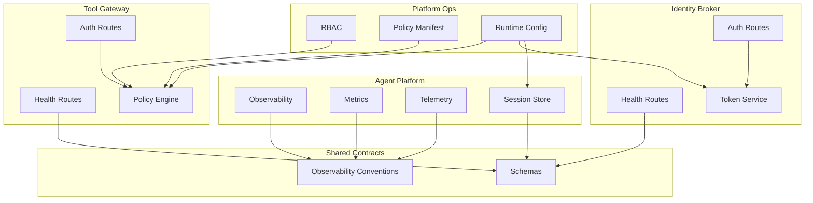
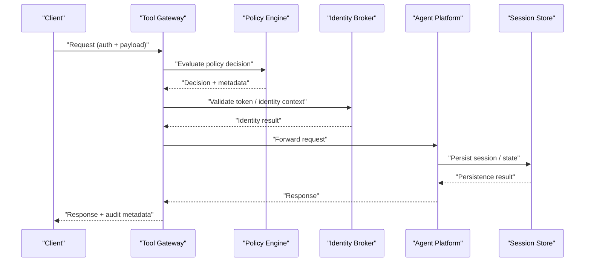
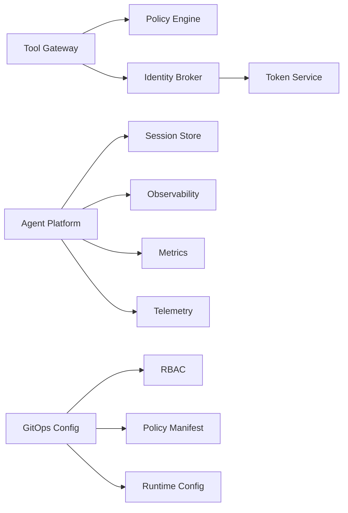

# Compliance and Audit

<cite>
**Referenced Files in This Document**
- [SECURITY.md](file://SECURITY.md)
- [README.md](file://README.md)
- [observability-conventions.md](file://shared/shared-contracts/observability-conventions.md)
- [SPEC-005-observability-baseline/spec.md](file://docs/specs/SPEC-005-observability-baseline/spec.md)
- [SPEC-003-identity-trust-hardening/spec.md](file://docs/specs/SPEC-003-identity-trust-hardening/spec.md)
- [SPEC-004-policy-enforcement/spec.md](file://docs/specs/SPEC-004-policy-enforcement/spec.md)
- [agent-platform/src/agent_service/core/observability.py](file://products/agent-platform/src/agent_service/core/observability.py)
- [agent-platform/src/agent_service/core/metrics.py](file://products/agent-platform/src/agent_service/core/metrics.py)
- [agent-platform/src/agent_service/core/telemetry.py](file://products/agent-platform/src/agent_service/core/telemetry.py)
- [agent-platform/src/agent_service/core/request_context.py](file://products/agent-platform/src/agent_service/core/request_context.py)
- [agent-platform/src/agent_service/api/routes/v2/routes.py](file://products/agent-platform/src/agent_service/api/routes/v2/routes.py)
- [agent-platform/src/agent_service/services/session_store.py](file://products/agent-platform/src/agent_service/services/session_store.py)
- [identity-broker/src/identity_service/api/routes/auth.py](file://products/identity-broker/src/identity_service/api/routes/auth.py)
- [identity-broker/src/identity_service/api/routes/health.py](file://products/identity-broker/src/identity_service/api/routes/health.py)
- [identity-broker/src/identity_service/services/token_service.py](file://products/identity-broker/src/identity_service/services/token_service.py)
- [tool-gateway/src/api_gateway/api/routes/auth.py](file://products/tool-gateway/src/api_gateway/api/routes/auth.py)
- [tool-gateway/src/api_gateway/api/routes/health.py](file://products/tool-gateway/src/api_gateway/api/routes/health.py)
- [tool-gateway/src/api_gateway/services/policy_engine.py](file://products/tool-gateway/src/api_gateway/services/policy_engine.py)
- [tool-gateway/src/api_gateway/policies/policy-default.yaml](file://products/tool-gateway/src/api_gateway/policies/policy-default.yaml)
- [shared/shared-contracts/schemas/identity-token.schema.json](file://shared/shared-contracts/schemas/identity-token.schema.json)
- [shared/shared-contracts/schemas/policy-decision.schema.json](file://shared/shared-contracts/schemas/policy-decision.schema.json)
- [shared/shared-contracts/schemas/agent-health.schema.json](file://shared/shared-contracts/schemas/agent-health.schema.json)
- [shared/shared-contracts/schemas/health-response.schema.json](file://shared/shared-contracts/schemas/health-response.schema.json)
- [shared/shared-contracts/schemas/agent-chat-request.schema.json](file://shared/shared-contracts/schemas/agent-chat-request.schema.json)
- [shared/shared-contracts/schemas/agent-chat-response.schema.json](file://shared/shared-contracts/schemas/agent-chat-response.schema.json)
- [shared/shared-contracts/schemas/stream-event.schema.json](file://shared/shared-contracts/schemas/stream-event.schema.json)
- [shared/shared-contracts/schemas/tool-invocation.schema.json](file://shared/shared-contracts/schemas/tool-invocation.schema.json)
- [shared/shared-contracts/schemas/tool-result.schema.json](file://shared/shared-contracts/schemas/tool-result.schema.json)
- [shared/platform-ops/gitops/dev-k8s/base/tool-gateway/rbac.yaml](file://shared/platform-ops/gitops/dev-k8s/base/tool-gateway/rbac.yaml)
- [shared/platform-ops/gitops/dev-k8s/base/tool-gateway/policy.yaml](file://shared/platform-ops/gitops/dev-k8s/base/tool-gateway/policy.yaml)
- [shared/platform-ops/gitops/dev-k8s/base/agent-platform/runtime-config.env](file://shared/platform-ops/gitops/dev-k8s/base/agent-platform/runtime-config.env)
- [shared/platform-ops/gitops/dev-k8s/base/identity-broker/runtime-config.env](file://shared/platform-ops/gitops/dev-k8s/base/identity-broker/runtime-config.env)
- [shared/platform-ops/gitops/dev-k8s/base/tool-gateway/runtime-config.env](file://shared/platform-ops/gitops/dev-k8s/base/tool-gateway/runtime-config.env)
</cite>

## Table of Contents
1. Introduction
2. Project Structure
3. Core Components
4. Architecture Overview
5. Detailed Component Analysis
6. Dependency Analysis
7. Performance Considerations
8. Troubleshooting Guide
9. Conclusion
10. Appendices

## Introduction
This document provides comprehensive compliance and audit guidance for the Luban AIOps Platform. It consolidates security logging, audit trail generation, and compliance reporting capabilities across the platform’s services. It also outlines data retention policies, privacy controls, and regulatory alignment with GDPR, SOC 2, and industry-specific requirements. Monitoring and alerting for security events, anomaly detection, incident response procedures, security metrics collection, performance monitoring, health checks, continuous compliance strategies, encryption at rest and in transit, key management, and secure deletion are covered to support robust governance and assurance.

## Project Structure
The platform is organized into multiple products and shared contracts:
- Agent Platform: runtime service for agents, including observability, metrics, telemetry, and session storage.
- Identity Broker: authentication, authorization, token issuance, and identity context handling.
- Tool Gateway: API gateway enforcing policies, routing requests, and integrating with Kubernetes tools.
- Shared Contracts: schemas and observability conventions used across services.
- Platform Ops: GitOps manifests defining RBAC, policies, and runtime configuration for deployments.

**Diagram sources**
- [agent-platform/src/agent_service/core/observability.py](file://products/agent-platform/src/agent_service/core/observability.py)
- [agent-platform/src/agent_service/core/metrics.py](file://products/agent-platform/src/agent_service/core/metrics.py)
- [agent-platform/src/agent_service/core/telemetry.py](file://products/agent-platform/src/agent_service/core/telemetry.py)
- [agent-platform/src/agent_service/services/session_store.py](file://products/agent-platform/src/agent_service/services/session_store.py)
- [identity-broker/src/identity_service/api/routes/auth.py](file://products/identity-broker/src/identity_service/api/routes/auth.py)
- [identity-broker/src/identity_service/api/routes/health.py](file://products/identity-broker/src/identity_service/api/routes/health.py)
- [identity-broker/src/identity_service/services/token_service.py](file://products/identity-broker/src/identity_service/services/token_service.py)
- [tool-gateway/src/api_gateway/api/routes/auth.py](file://products/tool-gateway/src/api_gateway/api/routes/auth.py)
- [tool-gateway/src/api_gateway/api/routes/health.py](file://products/tool-gateway/src/api_gateway/api/routes/health.py)
- [tool-gateway/src/api_gateway/services/policy_engine.py](file://products/tool-gateway/src/api_gateway/services/policy_engine.py)
- [shared/shared-contracts/schemas/agent-health.schema.json](file://shared/shared-contracts/schemas/agent-health.schema.json)
- [shared/shared-contracts/schemas/health-response.schema.json](file://shared/shared-contracts/schemas/health-response.schema.json)
- [shared/platform-ops/gitops/dev-k8s/base/tool-gateway/rbac.yaml](file://shared/platform-ops/gitops/dev-k8s/base/tool-gateway/rbac.yaml)
- [shared/platform-ops/gitops/dev-k8s/base/tool-gateway/policy.yaml](file://shared/platform-ops/gitops/dev-k8s/base/tool-gateway/policy.yaml)
- [shared/platform-ops/gitops/dev-k8s/base/agent-platform/runtime-config.env](file://shared/platform-ops/gitops/dev-k8s/base/agent-platform/runtime-config.env)
- [shared/platform-ops/gitops/dev-k8s/base/identity-broker/runtime-config.env](file://shared/platform-ops/gitops/dev-k8s/base/identity-broker/runtime-config.env)
- [shared/platform-ops/gitops/dev-k8s/base/tool-gateway/runtime-config.env](file://shared/platform-ops/gitops/dev-k8s/base/tool-gateway/runtime-config.env)

**Section sources**
- [README.md](file://README.md)
- [SECURITY.md](file://SECURITY.md)

## Core Components
- Observability and Telemetry: Centralized logging, tracing, and metrics collection across services ensure consistent audit trails and compliance reporting.
- Session Storage: Durability and lifecycle controls for sessions support data retention and privacy requirements.
- Authentication and Token Management: Secure issuance and validation of tokens underpin access control and auditability.
- Policy Enforcement: Centralized policy engine enforces rules and generates decisions for auditing.
- Health Endpoints: Standardized health responses enable operational monitoring and compliance verification.

Key implementation references:
- Observability and metrics modules in the agent platform.
- Auth routes and token service in the identity broker.
- Policy engine and auth routes in the tool gateway.
- Shared schemas and observability conventions.

**Section sources**
- [agent-platform/src/agent_service/core/observability.py](file://products/agent-platform/src/agent_service/core/observability.py)
- [agent-platform/src/agent_service/core/metrics.py](file://products/agent-platform/src/agent_service/core/metrics.py)
- [agent-platform/src/agent_service/core/telemetry.py](file://products/agent-platform/src/agent_service/core/telemetry.py)
- [agent-platform/src/agent_service/services/session_store.py](file://products/agent-platform/src/agent_service/services/session_store.py)
- [identity-broker/src/identity_service/api/routes/auth.py](file://products/identity-broker/src/identity_service/api/routes/auth.py)
- [identity-broker/src/identity_service/services/token_service.py](file://products/identity-broker/src/identity_service/services/token_service.py)
- [tool-gateway/src/api_gateway/api/routes/auth.py](file://products/tool-gateway/src/api_gateway/api/routes/auth.py)
- [tool-gateway/src/api_gateway/services/policy_engine.py](file://products/tool-gateway/src/api_gateway/services/policy_engine.py)
- [shared/shared-contracts/observability-conventions.md](file://shared/shared-contracts/observability-conventions.md)

## Architecture Overview
The platform follows a layered architecture with clear separation of concerns:
- API layer exposes standardized endpoints with health checks and schema validation.
- Services implement business logic, enforce policies, manage sessions, and handle identity operations.
- Shared contracts define schemas and observability conventions ensuring consistency.
- Platform ops configure RBAC, policies, and runtime settings via GitOps.

**Diagram sources**
- [tool-gateway/src/api_gateway/api/routes/auth.py](file://products/tool-gateway/src/api_gateway/api/routes/auth.py)
- [tool-gateway/src/api_gateway/services/policy_engine.py](file://products/tool-gateway/src/api_gateway/services/policy_engine.py)
- [identity-broker/src/identity_service/api/routes/auth.py](file://products/identity-broker/src/identity_service/api/routes/auth.py)
- [agent-platform/src/agent_service/api/routes/v2/routes.py](file://products/agent-platform/src/agent_service/api/routes/v2/routes.py)
- [agent-platform/src/agent_service/services/session_store.py](file://products/agent-platform/src/agent_service/services/session_store.py)

## Detailed Component Analysis

### Security Logging and Audit Trails
- Centralized observability captures structured logs, traces, and metrics consistently across services.
- Request context propagation ensures user identity, correlation IDs, and operation details are included in audit trails.
- Schemas standardize event structures for streaming and tool invocations, enabling reliable downstream processing.

Implementation highlights:
- Observability module configures logging and tracing pipelines.
- Metrics module exports counters, histograms, and gauges for security-relevant events.
- Telemetry module integrates distributed tracing and spans for end-to-end visibility.
- Request context enriches logs with identity and session identifiers.

Compliance mapping:
- Supports GDPR auditability by capturing who accessed what and when.
- Aligns with SOC 2 controls for logging and monitoring.
- Facilitates industry-specific reporting through standardized schemas.

**Section sources**
- [agent-platform/src/agent-service/core/observability.py](file://products/agent-platform/src/agent_service/core/observability.py)
- [agent-platform/src/agent_service/core/metrics.py](file://products/agent-platform/src/agent_service/core/metrics.py)
- [agent-platform/src/agent_service/core/telemetry.py](file://products/agent-platform/src/agent_service/core/telemetry.py)
- [agent-platform/src/agent_service/core/request_context.py](file://products/agent-platform/src/agent_service/core/request_context.py)
- [shared/shared-contracts/schemas/stream-event.schema.json](file://shared/shared-contracts/schemas/stream-event.schema.json)
- [shared/shared-contracts/schemas/tool-invocation.schema.json](file://shared/shared-contracts/schemas/tool-invocation.schema.json)
- [shared/shared-contracts/schemas/tool-result.schema.json](file://shared/shared-contracts/schemas/tool-result.schema.json)

### Data Retention Policies and Privacy Controls
- Session store manages persistence and lifecycle, supporting configurable retention windows.
- Runtime configurations define environment variables controlling retention and privacy behaviors.
- Schemas enforce data minimization and structure for compliant storage.

Operational guidance:
- Configure retention periods per regulatory requirement.
- Implement secure deletion routines aligned with data lifecycle policies.
- Ensure PII fields are minimized and protected throughout the pipeline.

**Section sources**
- [agent-platform/src/agent_service/services/session_store.py](file://products/agent-platform/src/agent_service/services/session_store.py)
- [shared/platform-ops/gitops/dev-k8s/base/agent-platform/runtime-config.env](file://shared/platform-ops/gitops/dev-k8s/base/agent-platform/runtime-config.env)
- [shared/shared-contracts/schemas/agent-session.schema.json](file://shared/shared-contracts/schemas/agent-session.schema.json)

### Regulatory Compliance Measures (GDPR, SOC2, Industry-Specific)
- Identity trust hardening specifications outline authentication and authorization controls.
- Policy enforcement specifications define rule evaluation and decision logging.
- Observability baseline specifies metrics and logging standards for compliance reporting.

Compliance actions:
- Enforce least privilege via RBAC and policy decisions.
- Maintain immutable audit logs for access and changes.
- Generate periodic compliance reports from metrics and logs.

**Section sources**
- [SPEC-003-identity-trust-hardening/spec.md](file://docs/specs/SPEC-003-identity-trust-hardening/spec.md)
- [SPEC-004-policy-enforcement/spec.md](file://docs/specs/SPEC-004-policy-enforcement/spec.md)
- [SPEC-005-observability-baseline/spec.md](file://docs/specs/SPEC-005-observability-baseline/spec.md)

### Monitoring and Alerting for Security Events
- Health endpoints provide standardized status responses for operational dashboards.
- Metrics expose security-relevant signals such as failed authentications and policy denials.
- Alerts can be configured on thresholds for anomalous activity patterns.

Alerting strategy:
- Define thresholds for authentication failures, policy violations, and latency spikes.
- Integrate with centralized alerting systems using exported metrics.
- Correlate alerts with trace spans for rapid incident triage.

**Section sources**
- [identity-broker/src/identity_service/api/routes/health.py](file://products/identity-broker/src/identity_service/api/routes/health.py)
- [tool-gateway/src/api_gateway/api/routes/health.py](file://products/tool-gateway/src/api_gateway/api/routes/health.py)
- [shared/shared-contracts/schemas/agent-health.schema.json](file://shared/shared-contracts/schemas/agent-health.schema.json)
- [shared/shared-contracts/schemas/health-response.schema.json](file://shared/shared-contracts/schemas/health-response.schema.json)
- [agent-platform/src/agent_service/core/metrics.py](file://products/agent-platform/src/agent_service/core/metrics.py)

### Anomaly Detection and Incident Response Procedures
- Distributed tracing and structured logs enable detection of anomalies in request flows.
- Policy decisions and token validations provide signals for suspicious behavior.
- Incident response should leverage correlation IDs to reconstruct timelines.

Procedures:
- Detect anomalies via metric thresholds and log pattern analysis.
- Isolate affected components and revoke compromised tokens.
- Conduct post-incident reviews and update policies accordingly.

**Section sources**
- [agent-platform/src/agent_service/core/telemetry.py](file://products/agent-platform/src/agent_service/core/telemetry.py)
- [identity-broker/src/identity_service/services/token_service.py](file://products/identity-broker/src/identity_service/services/token_service.py)
- [tool-gateway/src/api_gateway/services/policy_engine.py](file://products/tool-gateway/src/api_gateway/services/policy_engine.py)

### Security Metrics Collection and Performance Monitoring
- Metrics module exports counters, histograms, and gauges for security and performance.
- Observability conventions standardize naming and tagging for consistent aggregation.
- Health endpoints support readiness and liveness probes for reliability.

Best practices:
- Tag metrics with tenant, user, and operation identifiers for granular analysis.
- Aggregate metrics centrally for dashboards and compliance reports.
- Monitor error rates, latency percentiles, and resource utilization.

**Section sources**
- [agent-platform/src/agent_service/core/metrics.py](file://products/agent-platform/src/agent_service/core/metrics.py)
- [shared/shared-contracts/observability-conventions.md](file://shared/shared-contracts/observability-conventions.md)

### Health Check Implementations
- Health endpoints return standardized responses indicating service status.
- Responses conform to shared schemas for interoperability.
- Operators use these endpoints for automated health verification.

**Section sources**
- [identity-broker/src/identity_service/api/routes/health.py](file://products/identity-broker/src/identity_service/api/routes/health.py)
- [tool-gateway/src/api_gateway/api/routes/health.py](file://products/tool-gateway/src/api_gateway/api/routes/health.py)
- [shared/shared-contracts/schemas/agent-health.schema.json](file://shared/shared-contracts/schemas/agent-health.schema.json)
- [shared/shared-contracts/schemas/health-response.schema.json](file://shared/shared-contracts/schemas/health-response.schema.json)

### Encryption at Rest and In Transit, Key Management, and Secure Deletion
- Encryption in transit is enforced via TLS termination at gateways and service boundaries.
- Encryption at rest depends on underlying storage backends; configure per environment.
- Key management should follow organizational policies and external KMS integration.
- Secure deletion procedures must align with data retention policies and regulatory requirements.

Operational notes:
- Validate certificate chains and cipher suites.
- Rotate keys regularly and maintain audit trails for key usage.
- Implement cryptographic erasure where supported by storage systems.

[No sources needed since this section provides general guidance]

### Compliance Assessment Frameworks and Continuous Compliance Monitoring
- Use observability baselines and policy enforcement specs to assess compliance posture.
- Automate evidence collection from logs, metrics, and policy decisions.
- Schedule periodic assessments and generate compliance reports.

Continuous monitoring:
- Track policy violations and authentication anomalies over time.
- Integrate compliance checks into CI/CD pipelines for infrastructure-as-code.
- Maintain versioned policies and audit their evolution.

**Section sources**
- [SPEC-005-observability-baseline/spec.md](file://docs/specs/SPEC-005-observability-baseline/spec.md)
- [SPEC-004-policy-enforcement/spec.md](file://docs/specs/SPEC-004-policy-enforcement/spec.md)

### Audit Preparation Guidelines
- Ensure all critical operations emit structured logs with required fields.
- Preserve immutable audit trails and prevent tampering.
- Prepare evidence packages including logs, metrics snapshots, and policy versions.

Preparation steps:
- Map audit requirements to specific log and metric fields.
- Validate retention periods meet regulatory minimums.
- Test retrieval and integrity of audit artifacts.

**Section sources**
- [agent-platform/src/agent_service/core/observability.py](file://products/agent-platform/src/agent_service/core/observability.py)
- [shared/shared-contracts/observability-conventions.md](file://shared/shared-contracts/observability-conventions.md)

## Dependency Analysis
Dependencies between components are defined by API contracts, shared schemas, and runtime configurations:
- Tool Gateway depends on Policy Engine and Identity Broker for authorization and identity validation.
- Agent Platform depends on Session Store for state persistence and uses observability modules for logging and metrics.
- Platform Ops defines RBAC and policies that constrain service interactions.

**Diagram sources**
- [tool-gateway/src/api_gateway/services/policy_engine.py](file://products/tool-gateway/src/api_gateway/services/policy_engine.py)
- [identity-broker/src/identity_service/services/token_service.py](file://products/identity-broker/src/identity_service/services/token_service.py)
- [agent-platform/src/agent_service/services/session_store.py](file://products/agent-platform/src/agent_service/services/session_store.py)
- [agent-platform/src/agent_service/core/observability.py](file://products/agent-platform/src/agent_service/core/observability.py)
- [agent-platform/src/agent_service/core/metrics.py](file://products/agent-platform/src/agent_service/core/metrics.py)
- [agent-platform/src/agent_service/core/telemetry.py](file://products/agent-platform/src/agent_service/core/telemetry.py)
- [shared/platform-ops/gitops/dev-k8s/base/tool-gateway/rbac.yaml](file://shared/platform-ops/gitops/dev-k8s/base/tool-gateway/rbac.yaml)
- [shared/platform-ops/gitops/dev-k8s/base/tool-gateway/policy.yaml](file://shared/platform-ops/gitops/dev-k8s/base/tool-gateway/policy.yaml)
- [shared/platform-ops/gitops/dev-k8s/base/agent-platform/runtime-config.env](file://shared/platform-ops/gitops/dev-k8s/base/agent-platform/runtime-config.env)
- [shared/platform-ops/gitops/dev-k8s/base/identity-broker/runtime-config.env](file://shared/platform-ops/gitops/dev-k8s/base/identity-broker/runtime-config.env)
- [shared/platform-ops/gitops/dev-k8s/base/tool-gateway/runtime-config.env](file://shared/platform-ops/gitops/dev-k8s/base/tool-gateway/runtime-config.env)

**Section sources**
- [shared/platform-ops/gitops/dev-k8s/base/tool-gateway/rbac.yaml](file://shared/platform-ops/gitops/dev-k8s/base/tool-gateway/rbac.yaml)
- [shared/platform-ops/gitops/dev-k8s/base/tool-gateway/policy.yaml](file://shared/platform-ops/gitops/dev-k8s/base/tool-gateway/policy.yaml)
- [shared/platform-ops/gitops/dev-k8s/base/agent-platform/runtime-config.env](file://shared/platform-ops/gitops/dev-k8s/base/agent-platform/runtime-config.env)
- [shared/platform-ops/gitops/dev-k8s/base/identity-broker/runtime-config.env](file://shared/platform-ops/gitops/dev-k8s/base/identity-broker/runtime-config.env)
- [shared/platform-ops/gitops/dev-k8s/base/tool-gateway/runtime-config.env](file://shared/platform-ops/gitops/dev-k8s/base/tool-gateway/runtime-config.env)

## Performance Considerations
- Optimize metrics export intervals to balance detail and overhead.
- Use connection pooling and caching where appropriate to reduce latency.
- Monitor resource utilization and scale horizontally based on demand.
- Ensure health checks do not introduce significant load.

[No sources needed since this section provides general guidance]

## Troubleshooting Guide
Common issues and resolutions:
- Authentication failures: Verify token validity and identity context propagation.
- Policy denials: Review policy rules and RBAC configurations.
- Health check failures: Inspect service dependencies and resource availability.
- Audit gaps: Confirm observability configuration and log shipping.

Diagnostic steps:
- Collect trace spans and correlation IDs for affected requests.
- Export relevant metrics and logs for analysis.
- Validate runtime configurations and secrets.

**Section sources**
- [identity-broker/src/identity_service/api/routes/auth.py](file://products/identity-broker/src/identity_service/api/routes/auth.py)
- [tool-gateway/src/api_gateway/api/routes/auth.py](file://products/tool-gateway/src/api_gateway/api/routes/auth.py)
- [tool-gateway/src/api_gateway/services/policy_engine.py](file://products/tool-gateway/src/api_gateway/services/policy_engine.py)
- [agent-platform/src/agent_service/core/observability.py](file://products/agent-platform/src/agent_service/core/observability.py)

## Conclusion
The Luban AIOps Platform implements robust observability, policy enforcement, and identity management to support compliance and audit requirements. By leveraging standardized schemas, centralized logging, and GitOps-driven configurations, the platform enables effective monitoring, alerting, and continuous compliance. Adhering to the guidelines outlined here will strengthen security posture, streamline audits, and ensure alignment with regulatory frameworks.

[No sources needed since this section summarizes without analyzing specific files]

## Appendices

### API and Schema References
- Identity token schema defines claims and structure for tokens.
- Policy decision schema captures outcomes and rationale for auditing.
- Health schemas standardize status reporting across services.
- Chat and stream schemas ensure consistent payloads for compliance tracking.

**Section sources**
- [shared/shared-contracts/schemas/identity-token.schema.json](file://shared/shared-contracts/schemas/identity-token.schema.json)
- [shared/shared-contracts/schemas/policy-decision.schema.json](file://shared/shared-contracts/schemas/policy-decision.schema.json)
- [shared/shared-contracts/schemas/agent-health.schema.json](file://shared/shared-contracts/schemas/agent-health.schema.json)
- [shared/shared-contracts/schemas/health-response.schema.json](file://shared/shared-contracts/schemas/health-response.schema.json)
- [shared/shared-contracts/schemas/agent-chat-request.schema.json](file://shared/shared-contracts/schemas/agent-chat-request.schema.json)
- [shared/shared-contracts/schemas/agent-chat-response.schema.json](file://shared/shared-contracts/schemas/agent-chat-response.schema.json)
- [shared/shared-contracts/schemas/stream-event.schema.json](file://shared/shared-contracts/schemas/stream-event.schema.json)
- [shared/shared-contracts/schemas/tool-invocation.schema.json](file://shared/shared-contracts/schemas/tool-invocation.schema.json)
- [shared/shared-contracts/schemas/tool-result.schema.json](file://shared/shared-contracts/schemas/tool-result.schema.json)

### Runtime Configuration Examples
- Environment variables control observability, retention, and security settings.
- Ensure sensitive values are managed via secrets and injected securely.

**Section sources**
- [shared/platform-ops/gitops/dev-k8s/base/agent-platform/runtime-config.env](file://shared/platform-ops/gitops/dev-k8s/base/agent-platform/runtime-config.env)
- [shared/platform-ops/gitops/dev-k8s/base/identity-broker/runtime-config.env](file://shared/platform-ops/gitops/dev-k8s/base/identity-broker/runtime-config.env)
- [shared/platform-ops/gitops/dev-k8s/base/tool-gateway/runtime-config.env](file://shared/platform-ops/gitops/dev-k8s/base/tool-gateway/runtime-config.env)