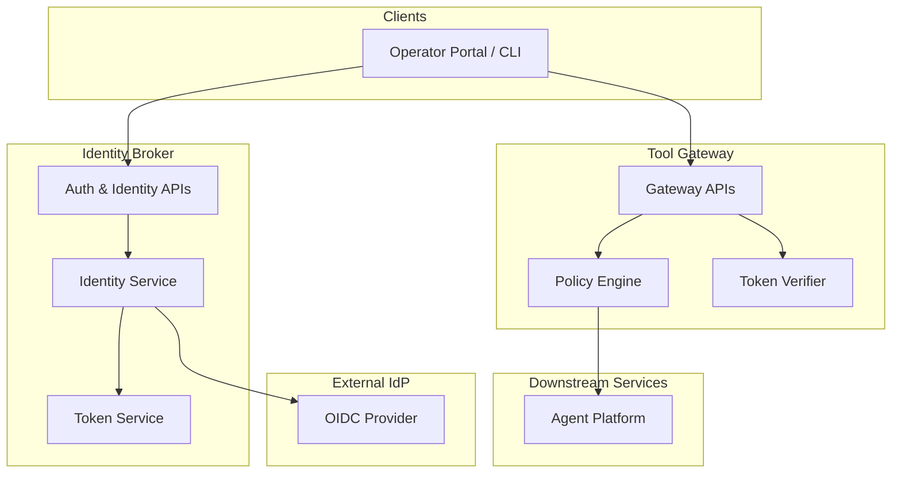
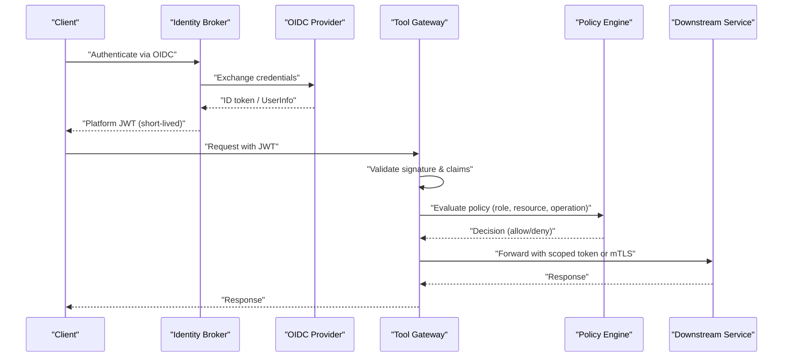
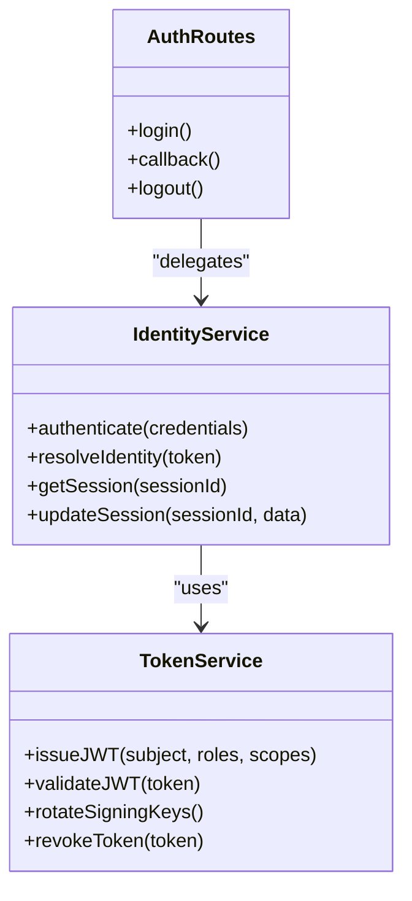
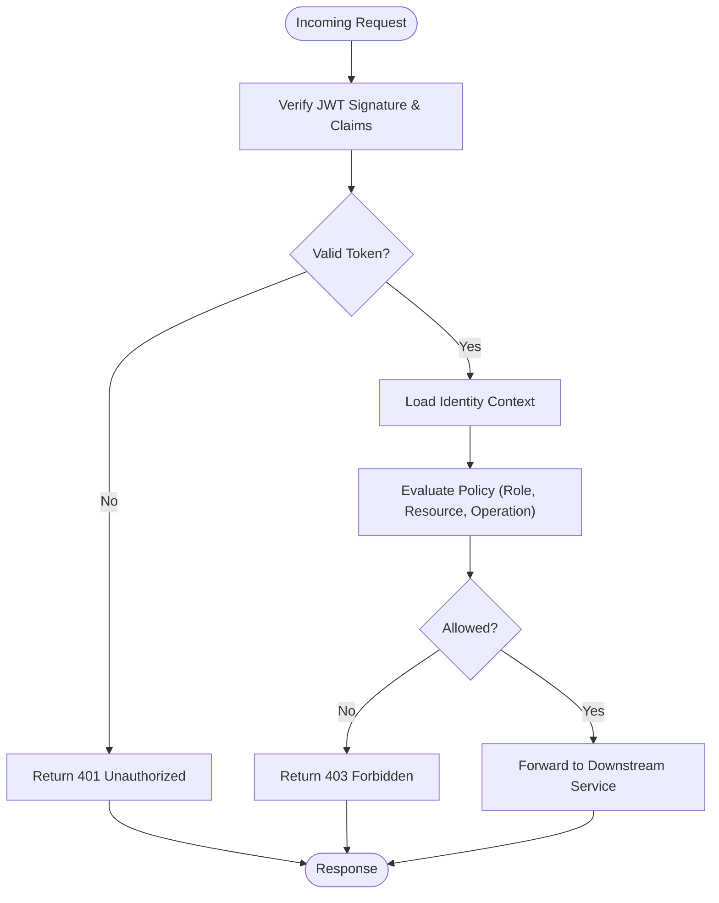
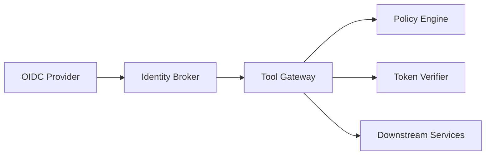

# Identity and Authorization

<cite>
**Referenced Files in This Document**
- [identity-and-authorization-design.md](file://docs/agentic-aiops-platform/identity-and-authorization-design.md)
- [authorization-matrix.md](file://docs/agentic-aiops-platform/authorization-matrix.md)
- [SPEC-003-identity-trust-hardening/spec.md](file://docs/specs/SPEC-003-identity-trust-hardening/spec.md)
- [SPEC-004-policy-enforcement/spec.md](file://docs/specs/SPEC-004-policy-enforcement/spec.md)
- [SPEC-006-session-durability/spec.md](file://docs/specs/SPEC-006-session-durability/spec.md)
- [SPEC-008-service-to-service-identity/spec.md](file://docs/specs/SPEC-008-service-to-service-identity/spec.md)
- [ADR-0004-broker-mediated-token-delegation.md](file://docs/adr/0004-broker-mediated-token-delegation.md)
- [auth.py](file://products/identity-broker/src/identity_service/api/routes/auth.py)
- [identity.py](file://products/identity-broker/src/identity_service/api/routes/identity.py)
- [identity_service.py](file://products/identity-broker/src/identity_service/services/identity_service.py)
- [token_service.py](file://products/identity-broker/src/identity_service/services/token_service.py)
- [config.py](file://products/identity-broker/src/identity_service/core/config.py)
- [auth.py](file://products/tool-gateway/src/api_gateway/api/routes/auth.py)
- [identity.py](file://products/tool-gateway/src/api_gateway/api/routes/identity.py)
- [gateway_service.py](file://products/tool-gateway/src/api_gateway/services/gateway_service.py)
- [policy_engine.py](file://products/tool-gateway/src/api_gateway/services/policy_engine.py)
- [token_verifier.py](file://products/tool-gateway/src/api_gateway/services/token_verifier.py)
- [policy-default.yaml](file://products/tool-gateway/src/api_gateway/policies/policy-default.yaml)
- [rbac.yaml](file://shared/platform-ops/gitops/dev-k8s/base/tool-gateway/rbac.yaml)
- [identity-context.schema.json](file://shared/shared-contracts/schemas/identity-context.schema.json)
- [identity-token.schema.json](file://shared/shared-contracts/schemas/identity-token.schema.json)
</cite>

## Table of Contents
1. [Introduction](#introduction)
2. [Project Structure](#project-structure)
3. [Core Components](#core-components)
4. [Architecture Overview](#architecture-overview)
5. [Detailed Component Analysis](#detailed-component-analysis)
6. [Dependency Analysis](#dependency-analysis)
7. [Performance Considerations](#performance-considerations)
8. [Troubleshooting Guide](#troubleshooting-guide)
9. [Conclusion](#conclusion)
10. [Appendices](#appendices)

## Introduction
This document provides comprehensive documentation for the identity and authorization system in Luban AIOps Platform. It covers OIDC integration architecture, JWT token lifecycle management, role-based access control (RBAC), and the identity broker service design. It also documents the authorization matrix across services, resources, and operations; user provisioning and group management patterns; permission inheritance; practical configuration examples for OIDC providers; custom authorization rules; and security considerations for token storage, transmission, and rotation.

## Project Structure
The identity and authorization system spans multiple products and shared contracts:
- Identity Broker: Centralized authentication, token issuance/validation, and session management.
- Tool Gateway: API gateway enforcing policies and verifying tokens before delegating to downstream services.
- Shared Contracts: JSON schemas defining identity context and token structures used across services.
- Policy Center: Policy definitions and enforcement logic within the gateway.
- Kubernetes manifests: RBAC and runtime configurations for deployment.

[No sources needed since this diagram shows conceptual workflow, not actual code structure]

## Core Components
- Identity Broker:
  - Authentication routes handle OIDC flows and issue platform tokens.
  - Identity service orchestrates user/group resolution and session state.
  - Token service manages JWT creation, signing, validation, and rotation.
- Tool Gateway:
  - Auth and identity routes expose endpoints for clients and internal services.
  - Policy engine evaluates RBAC policies against requests.
  - Token verifier validates incoming tokens and enriches request context.
- Shared Schemas:
  - Identity context and token schemas define consistent payloads across components.

Key implementation references:
- Identity Broker auth routes and services
- Tool Gateway policy engine and token verifier
- Shared identity and token schemas

**Section sources**
- [auth.py](file://products/identity-broker/src/identity_service/api/routes/auth.py)
- [identity.py](file://products/identity-broker/src/identity_service/api/routes/identity.py)
- [identity_service.py](file://products/identity-broker/src/identity_service/services/identity_service.py)
- [token_service.py](file://products/identity-broker/src/identity_service/services/token_service.py)
- [auth.py](file://products/tool-gateway/src/api_gateway/api/routes/auth.py)
- [identity.py](file://products/tool-gateway/src/api_gateway/api/routes/identity.py)
- [policy_engine.py](file://products/tool-gateway/src/api_gateway/services/policy_engine.py)
- [token_verifier.py](file://products/tool-gateway/src/api_gateway/services/token_verifier.py)
- [identity-context.schema.json](file://shared/shared-contracts/schemas/identity-context.schema.json)
- [identity-token.schema.json](file://shared/shared-contracts/schemas/identity-token.schema.json)

## Architecture Overview
The platform uses an OIDC-first approach with a centralized identity broker that issues short-lived JWTs. The tool gateway enforces RBAC policies using these tokens and delegates to downstream services with secure service-to-service identities.

**Diagram sources**
- [auth.py](file://products/identity-broker/src/identity_service/api/routes/auth.py)
- [identity_service.py](file://products/identity-broker/src/identity_service/services/identity_service.py)
- [token_service.py](file://products/identity-broker/src/identity_service/services/token_service.py)
- [auth.py](file://products/tool-gateway/src/api_gateway/api/routes/auth.py)
- [policy_engine.py](file://products/tool-gateway/src/api_gateway/services/policy_engine.py)
- [token_verifier.py](file://products/tool-gateway/src/api_gateway/services/token_verifier.py)

**Section sources**
- [identity-and-authorization-design.md](file://docs/agentic-aiops-platform/identity-and-authorization-design.md)
- [SPEC-003-identity-trust-hardening/spec.md](file://docs/specs/SPEC-003-identity-trust-hardening/spec.md)
- [SPEC-004-policy-enforcement/spec.md](file://docs/specs/SPEC-004-policy-enforcement/spec.md)
- [SPEC-008-service-to-service-identity/spec.md](file://docs/specs/SPEC-008-service-to-service-identity/spec.md)
- [ADR-0004-broker-mediated-token-delegation.md](file://docs/adr/0004-broker-mediated-token-delegation.md)

## Detailed Component Analysis

### Identity Broker Service
Responsibilities:
- Authenticate users via OIDC providers.
- Issue platform JWTs with minimal claims.
- Manage sessions and token lifecycles.
- Provide identity resolution endpoints for clients and services.

Implementation highlights:
- Auth routes orchestrate OIDC login and token exchange.
- Identity service resolves user attributes and groups.
- Token service handles JWT signing, validation, and rotation.

**Diagram sources**
- [identity_service.py](file://products/identity-broker/src/identity_service/services/identity_service.py)
- [token_service.py](file://products/identity-broker/src/identity_service/services/token_service.py)
- [auth.py](file://products/identity-broker/src/identity_service/api/routes/auth.py)

**Section sources**
- [identity_service.py](file://products/identity-broker/src/identity_service/services/identity_service.py)
- [token_service.py](file://products/identity-broker/src/identity_service/services/token_service.py)
- [auth.py](file://products/identity-broker/src/identity_service/api/routes/auth.py)
- [identity.py](file://products/identity-broker/src/identity_service/api/routes/identity.py)
- [config.py](file://products/identity-broker/src/identity_service/core/config.py)

### Tool Gateway Authorization
Responsibilities:
- Verify incoming JWTs and enrich request context.
- Enforce RBAC policies based on roles, resources, and operations.
- Delegate to downstream services with appropriate identity.

Implementation highlights:
- Token verifier validates signatures, expiration, and claims.
- Policy engine loads YAML policies and evaluates decisions.
- Gateway routes integrate verification and policy checks.

**Diagram sources**
- [token_verifier.py](file://products/tool-gateway/src/api_gateway/services/token_verifier.py)
- [policy_engine.py](file://products/tool-gateway/src/api_gateway/services/policy_engine.py)
- [auth.py](file://products/tool-gateway/src/api_gateway/api/routes/auth.py)
- [identity.py](file://products/tool-gateway/src/api_gateway/api/routes/identity.py)

**Section sources**
- [token_verifier.py](file://products/tool-gateway/src/api_gateway/services/token_verifier.py)
- [policy_engine.py](file://products/tool-gateway/src/api_gateway/services/policy_engine.py)
- [auth.py](file://products/tool-gateway/src/api_gateway/api/routes/auth.py)
- [identity.py](file://products/tool-gateway/src/api_gateway/api/routes/identity.py)
- [gateway_service.py](file://products/tool-gateway/src/api_gateway/services/gateway_service.py)

### OIDC Integration Architecture
Key aspects:
- OIDC provider configuration is managed centrally.
- Identity broker performs client registration and secret management.
- Tokens issued by the broker are short-lived and scoped.

Configuration guidance:
- Define OIDC issuer URL, client ID, and secrets in environment variables.
- Map OIDC claims to platform roles and groups.
- Enable PKCE for enhanced security.

**Section sources**
- [config.py](file://products/identity-broker/src/identity_service/core/config.py)
- [identity-and-authorization-design.md](file://docs/agentic-aiops-platform/identity-and-authorization-design.md)
- [SPEC-003-identity-trust-hardening/spec.md](file://docs/specs/SPEC-003-identity-trust-hardening/spec.md)

### JWT Token Lifecycle Management
Lifecycle stages:
- Issuance: Short-lived JWTs signed with rotating keys.
- Validation: Signature, expiration, and claim checks at each hop.
- Rotation: Key rotation without downtime; graceful fallbacks.
- Revocation: Immediate invalidation for compromised tokens.

Best practices:
- Use minimal claims in tokens.
- Store tokens securely in clients (HttpOnly cookies or secure storage).
- Implement refresh flows only when necessary.

**Section sources**
- [token_service.py](file://products/identity-broker/src/identity_service/services/token_service.py)
- [identity-token.schema.json](file://shared/shared-contracts/schemas/identity-token.schema.json)
- [SPEC-003-identity-trust-hardening/spec.md](file://docs/specs/SPEC-003-identity-trust-hardening/spec.md)

### Role-Based Access Control (RBAC)
RBAC model:
- Roles define permissions over resources and operations.
- Users inherit roles from groups and direct assignments.
- Policies enforce least privilege and separation of duties.

Authorization matrix:
- Defines allowed operations per role across services and resources.
- Includes explicit deny rules and exceptions.

**Section sources**
- [authorization-matrix.md](file://docs/agentic-aiops-platform/authorization-matrix.md)
- [policy-default.yaml](file://products/tool-gateway/src/api_gateway/policies/policy-default.yaml)
- [rbac.yaml](file://shared/platform-ops/gitops/dev-k8s/base/tool-gateway/rbac.yaml)
- [SPEC-004-policy-enforcement/spec.md](file://docs/specs/SPEC-004-policy-enforcement/spec.md)

### User Provisioning and Group Management
Provisioning flow:
- Users created via admin APIs or synced from external directories.
- Groups assigned to users with inherited permissions.
- Audit logs track changes to identities and memberships.

Inheritance patterns:
- Direct role assignment overrides group-derived roles.
- Effective permissions computed at request time.

**Section sources**
- [identity.py](file://products/identity-broker/src/identity_service/api/routes/identity.py)
- [identity_service.py](file://products/identity-broker/src/identity_service/services/identity_service.py)
- [identity-context.schema.json](file://shared/shared-contracts/schemas/identity-context.schema.json)

### Session Management
Session durability:
- Sessions stored in durable backends (e.g., Redis).
- TTL-based expiration with renewal options.
- Cross-region replication for high availability.

Security:
- Session IDs rotated on sensitive operations.
- Binding to client fingerprints where applicable.

**Section sources**
- [SPEC-006-session-durability/spec.md](file://docs/specs/SPEC-006-session-durability/spec.md)
- [identity_service.py](file://products/identity-broker/src/identity_service/services/identity_service.py)

### Service-to-Service Identity
Delegation model:
- Broker-mediated token delegation for inter-service calls.
- Scoped tokens with limited lifetime and permissions.
- mTLS as an additional transport security layer.

**Section sources**
- [SPEC-008-service-to-service-identity/spec.md](file://docs/specs/SPEC-008-service-to-service-identity/spec.md)
- [ADR-0004-broker-mediated-token-delegation.md](file://docs/adr/0004-broker-mediated-token-delegation.md)

## Dependency Analysis
Component relationships:
- Identity Broker depends on OIDC providers and key management.
- Tool Gateway depends on token verifier and policy engine.
- Downstream services trust tokens issued by the broker.

**Diagram sources**
- [auth.py](file://products/identity-broker/src/identity_service/api/routes/auth.py)
- [token_verifier.py](file://products/tool-gateway/src/api_gateway/services/token_verifier.py)
- [policy_engine.py](file://products/tool-gateway/src/api_gateway/services/policy_engine.py)

**Section sources**
- [identity-and-authorization-design.md](file://docs/agentic-aiops-platform/identity-and-authorization-design.md)
- [SPEC-003-identity-trust-hardening/spec.md](file://docs/specs/SPEC-003-identity-trust-hardening/spec.md)
- [SPEC-004-policy-enforcement/spec.md](file://docs/specs/SPEC-004-policy-enforcement/spec.md)

## Performance Considerations
- Token verification should be cached where possible (e.g., JWKS cache).
- Policy evaluation must be optimized with compiled rules.
- Avoid heavy identity lookups in hot paths; use precomputed contexts.
- Scale identity broker horizontally with stateless design.

[No sources needed since this section provides general guidance]

## Troubleshooting Guide
Common issues:
- Invalid token signature: Check key rotation and issuer configuration.
- Expired tokens: Ensure refresh flows and clock synchronization.
- Permission denied: Validate role mappings and policy definitions.
- OIDC callback failures: Inspect client secrets and redirect URIs.

Debugging steps:
- Enable verbose logging in identity broker and gateway.
- Validate tokens using public keys from the issuer.
- Review policy decisions with audit logs.

**Section sources**
- [token_verifier.py](file://products/tool-gateway/src/api_gateway/services/token_verifier.py)
- [policy_engine.py](file://products/tool-gateway/src/api_gateway/services/policy_engine.py)
- [auth.py](file://products/identity-broker/src/identity_service/api/routes/auth.py)

## Conclusion
The Luban AIOps Platform implements a robust identity and authorization system centered around OIDC and JWTs. The identity broker ensures secure authentication and token issuance, while the tool gateway enforces RBAC policies consistently. By following best practices for token lifecycle management, session durability, and policy evaluation, the platform achieves strong security and scalability.

[No sources needed since this section summarizes without analyzing specific files]

## Appendices

### Practical Examples

#### Configuring OIDC Providers
- Set issuer URL, client ID, and secrets in environment variables.
- Configure claim-to-role mappings for user attributes.
- Enable PKCE and restrict redirect URIs.

**Section sources**
- [config.py](file://products/identity-broker/src/identity_service/core/config.py)
- [identity-and-authorization-design.md](file://docs/agentic-aiops-platform/identity-and-authorization-design.md)

#### Implementing Custom Authorization Rules
- Extend policy engine with custom evaluators.
- Define new roles and permissions in policy definitions.
- Test rules with unit tests and integration scenarios.

**Section sources**
- [policy_engine.py](file://products/tool-gateway/src/api_gateway/services/policy_engine.py)
- [policy-default.yaml](file://products/tool-gateway/src/api_gateway/policies/policy-default.yaml)

#### Security Considerations
- Token Storage: Use secure storage mechanisms (e.g., HttpOnly cookies, OS keychain).
- Transmission: Enforce TLS everywhere; validate certificates.
- Rotation: Automate key rotation with zero-downtime strategies.

**Section sources**
- [SPEC-003-identity-trust-hardening/spec.md](file://docs/specs/SPEC-003-identity-trust-hardening/spec.md)
- [token_service.py](file://products/identity-broker/src/identity_service/services/token_service.py)