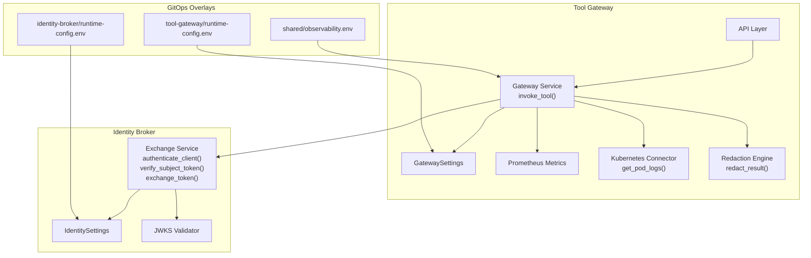
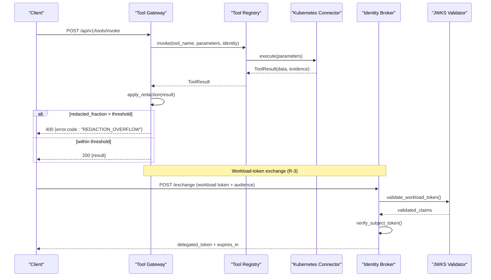
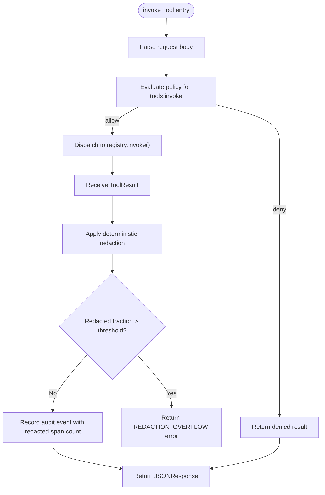
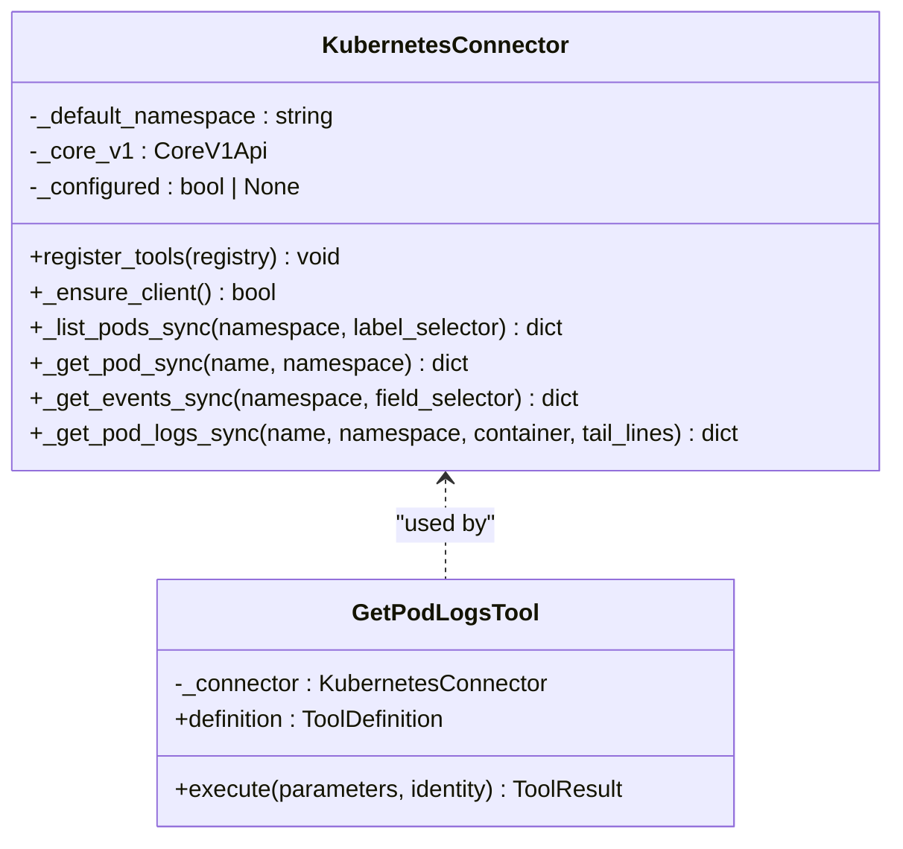
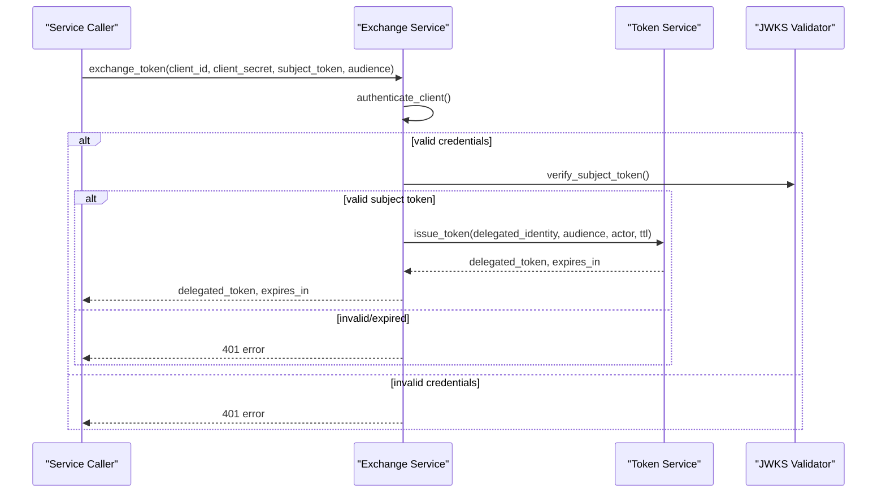
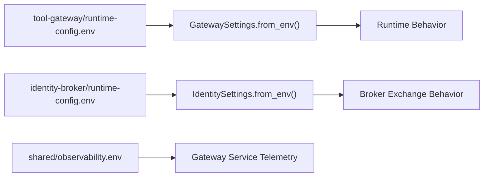
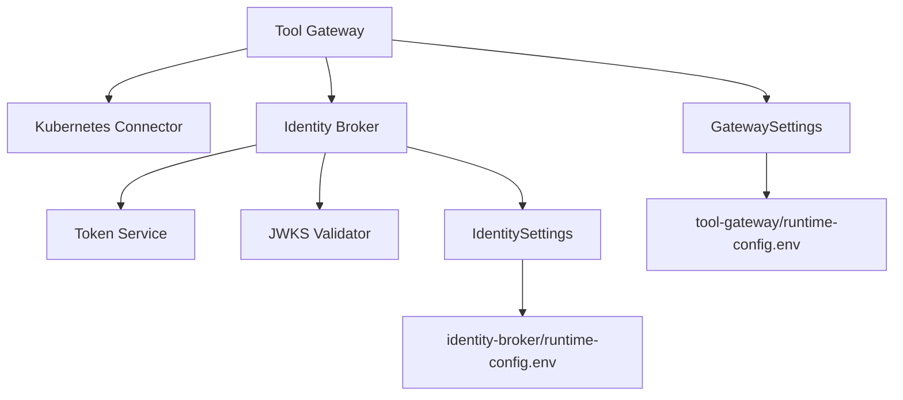

# Pre-Production Hardening Specification (SPEC-009)

<cite>
**Referenced Files in This Document**
- [spec.md](file://docs/specs/SPEC-009-pre-production-hardening/spec.md)
- [plan.md](file://docs/specs/SPEC-009-pre-production-hardening/plan.md)
- [tasks.md](file://docs/specs/SPEC-009-pre-production-hardening/tasks.md)
- [README.md](file://README.md)
- [gateway_service.py](file://products/tool-gateway/src/api_gateway/services/gateway_service.py)
- [config.py](file://products/tool-gateway/src/api_gateway/core/config.py)
- [metrics.py](file://products/tool-gateway/src/api_gateway/core/metrics.py)
- [redaction.py](file://products/tool-gateway/src/api_gateway/tools/redaction.py)
- [exchange_service.py](file://products/identity-broker/src/identity_service/services/exchange_service.py)
- [config.py](file://products/identity-broker/src/identity_service/core/config.py)
- [k8s_connector.py](file://products/tool-gateway/src/api_gateway/tools/k8s_connector.py)
- [base.py](file://products/tool-gateway/src/api_gateway/tools/base.py)
- [runtime-config.env](file://shared/platform-ops/gitops/dev-k8s/base/tool-gateway/runtime-config.env)
- [runtime-config.env](file://shared/platform-ops/gitops/dev-k8s/base/identity-broker/runtime-config.env)
- [observability.env](file://shared/platform-ops/gitops/dev-k8s/base/shared/observability.env)
- [test_redaction.py](file://products/tool-gateway/tests/test_redaction.py)
- [test_exchange_service.py](file://products/identity-broker/tests/test_exchange_service.py)
</cite>

## Update Summary
**Changes Made**
- Updated specification status to reflect formal approval with complete implementation package
- Enhanced requirements documentation with detailed acceptance criteria for R-1 through R-4
- Added comprehensive technical plan separating redaction and workload-identity tracks
- Included structured task breakdown for implementation phases
- Updated architecture diagrams to reflect approved design decisions
- Enhanced troubleshooting guide with specific error scenarios and resolutions
- **Updated** Added comprehensive testing coverage documentation (275 lines for redaction tests, 257 lines for exchange service tests)
- **Updated** Integrated Prometheus metrics implementation details and fail-closed overflow handling
- **Updated** Documented new environment variables: GATEWAY_REDACTION_ENABLED, GATEWAY_REDACTION_OVERFLOW_FRACTION, IDENTITY_WORKLOAD_ISSUER_URL, IDENTITY_WORKLOAD_AUDIENCE, and IDENTITY_WORKLOAD_CLIENTS

## Table of Contents
1. [Introduction](#introduction)
2. [Project Structure](#project-structure)
3. [Core Components](#core-components)
4. [Architecture Overview](#architecture-overview)
5. [Detailed Component Analysis](#detailed-component-analysis)
6. [Dependency Analysis](#dependency-analysis)
7. [Performance Considerations](#performance-considerations)
8. [Troubleshooting Guide](#troubleshooting-guide)
9. [Testing Coverage](#testing-coverage)
10. [Conclusion](#conclusion)
11. [Appendices](#appendices)

## Introduction
This document specifies the pre-production hardening requirements for Release 1 closure, focusing on two critical gaps: deterministic redaction of tool outputs before they reach model providers and replacing static client secrets with Kubernetes workload-identity-bound short-lived tokens at the broker exchange. The specification has been formally approved with complete implementation guidance, separating concerns into distinct technical tracks for redaction enforcement and workload identity validation.

**Updated** The spec now includes detailed acceptance criteria, comprehensive technical planning, and structured task breakdown for coordinated implementation across the tool gateway and identity broker services. Implementation is complete with full testing coverage, Prometheus metrics integration, and fail-closed overflow handling mechanisms.

## Project Structure
The hardening spans three primary areas with clear separation of concerns:
- Tool Gateway: output redaction engine, metrics integration, and service-token acquisition path
- Identity Broker: workload-token validation at the exchange endpoint with JWKS support
- GitOps overlays: runtime configuration enabling hardened defaults and documentation alignment

**Diagram sources**
- [gateway_service.py:296-356](file://products/tool-gateway/src/api_gateway/services/gateway_service.py#L296-L356)
- [config.py:23-84](file://products/tool-gateway/src/api_gateway/core/config.py#L23-L84)
- [metrics.py:1-106](file://products/tool-gateway/src/api_gateway/core/metrics.py#L1-L106)
- [redaction.py:126-151](file://products/tool-gateway/src/api_gateway/tools/redaction.py#L126-L151)
- [exchange_service.py:36-116](file://products/identity-broker/src/identity_service/services/exchange_service.py#L36-L116)
- [config.py:52-105](file://products/identity-broker/src/identity_service/core/config.py#L52-L105)
- [k8s_connector.py:354-414](file://products/tool-gateway/src/api_gateway/tools/k8s_connector.py#L354-L414)
- [runtime-config.env:1-11](file://shared/platform-ops/gitops/dev-k8s/base/tool-gateway/runtime-config.env#L1-L11)
- [runtime-config.env:1-9](file://shared/platform-ops/gitops/dev-k8s/base/identity-broker/runtime-config.env#L1-L9)
- [observability.env:1-5](file://shared/platform-ops/gitops/dev-k8s/base/shared/observability.env#L1-L5)

**Section sources**
- [README.md:1-86](file://README.md#L1-L86)
- [spec.md:1-158](file://docs/specs/SPEC-009-pre-production-hardening/spec.md#L1-L158)
- [plan.md:1-166](file://docs/specs/SPEC-009-pre-production-hardening/plan.md#L1-L166)

## Core Components
The approved specification defines four core requirements with detailed acceptance criteria:

### R-1: Deterministic Output Redaction
Apply a code-owned pattern set to every tool result payload before it leaves the gateway, covering Authorization headers, Bearer/Basic tokens, Kubernetes service-account JWTs, and password/secret/api-key fields in structured output. Replace matched spans with a fixed marker; unchanged payloads pass through byte-identical.

### R-2: Redaction Observability and Failure Policy
Record Prometheus counters per tool name following SPEC-005 conventions; implement fail-closed policy with REDACTION_OVERFLOW when the redacted fraction exceeds configured bound (default 20%); log redacted-span counts in audit entries.

### R-3: Workload-Identity Tokens at Exchange
Accept Kubernetes workload-identity-bound short-lived tokens at the broker exchange; validate against cluster token issuer JWKS/audience; map validated subject to registered service client; issue delegated tokens identical in claims semantics to the static-secret path; maintain backward compatibility with static secret as dev fallback.

### R-4: Overlay and Documentation Alignment
Enable redaction by default in all overlays; document workload-token configuration contract; ensure kustomize renders new configuration entries; mark static secret as dev fallback in gateway runtime-secrets example.

**Section sources**
- [spec.md:39-110](file://docs/specs/SPEC-009-pre-production-hardening/spec.md#L39-L110)
- [plan.md:23-119](file://docs/specs/SPEC-009-pre-production-hardening/plan.md#L23-L119)

## Architecture Overview
The approved architecture introduces two independent hardening tracks that share no code path:

**Diagram sources**
- [gateway_service.py:296-356](file://products/tool-gateway/src/api_gateway/services/gateway_service.py#L296-L356)
- [k8s_connector.py:354-414](file://products/tool-gateway/src/api_gateway/tools/k8s_connector.py#L354-L414)
- [exchange_service.py:75-116](file://products/identity-broker/src/identity_service/services/exchange_service.py#L75-L116)

## Detailed Component Analysis

### Tool Invocation and Redaction Pipeline
The tool invocation orchestrator enforces policy, dispatches to the registry, and logs audit events. Redaction must be applied uniformly to all tool results before returning to the caller.

**Diagram sources**
- [gateway_service.py:296-356](file://products/tool-gateway/src/api_gateway/services/gateway_service.py#L296-L356)
- [base.py:30-95](file://products/tool-gateway/src/api_gateway/tools/base.py#L30-L95)

**Section sources**
- [gateway_service.py:296-356](file://products/tool-gateway/src/api_gateway/services/gateway_service.py#L296-L356)
- [base.py:30-95](file://products/tool-gateway/src/api_gateway/tools/base.py#L30-L95)

### Kubernetes Connector and Sensitive Data Exposure
The Kubernetes connector exposes read-only tools including pod logs, which may contain sensitive credentials. Redaction is essential to prevent leakage to model providers.

**Diagram sources**
- [k8s_connector.py:37-82](file://products/tool-gateway/src/api_gateway/tools/k8s_connector.py#L37-L82)
- [k8s_connector.py:354-414](file://products/tool-gateway/src/api_gateway/tools/k8s_connector.py#L354-L414)

**Section sources**
- [k8s_connector.py:1-200](file://products/tool-gateway/src/api_gateway/tools/k8s_connector.py#L1-L200)
- [k8s_connector.py:332-414](file://products/tool-gateway/src/api_gateway/tools/k8s_connector.py#L332-414)

### Identity Broker Exchange and Workload-Token Validation
The exchange service authenticates clients via static secrets and verifies subject tokens. R-3 extends this to accept workload-identity-bound tokens, validating against cluster issuer and mapping subjects to registered clients.

**Diagram sources**
- [exchange_service.py:36-116](file://products/identity-broker/src/identity_service/services/exchange_service.py#L36-116)

**Section sources**
- [exchange_service.py:1-116](file://products/identity-broker/src/identity_service/services/exchange_service.py#L1-L116)
- [config.py:52-105](file://products/identity-broker/src/identity_service/core/config.py#L52-L105)

### Configuration and Overlay Alignment
Hardened defaults are enforced via environment variables in GitOps overlays. The tool gateway and identity broker configurations must reflect redaction enabled by default and workload-token settings where applicable.

**Diagram sources**
- [runtime-config.env:1-11](file://shared/platform-ops/gitops/dev-k8s/base/tool-gateway/runtime-config.env#L1-L11)
- [runtime-config.env:1-9](file://shared/platform-ops/gitops/dev-k8s/base/identity-broker/runtime-config.env#L1-L9)
- [observability.env:1-5](file://shared/platform-ops/gitops/dev-k8s/base/shared/observability.env#L1-L5)
- [config.py:42-84](file://products/tool-gateway/src/api_gateway/core/config.py#L42-L84)
- [config.py:68-105](file://products/identity-broker/src/identity_service/core/config.py#L68-L105)

**Section sources**
- [config.py:23-84](file://products/tool-gateway/src/api_gateway/core/config.py#L23-L84)
- [config.py:52-105](file://products/identity-broker/src/identity_service/core/config.py#L52-L105)
- [runtime-config.env:1-11](file://shared/platform-ops/gitops/dev-k8s/base/tool-gateway/runtime-config.env#L1-L11)
- [runtime-config.env:1-9](file://shared/platform-ops/gitops/dev-k8s/base/identity-broker/runtime-config.env#L1-L9)
- [observability.env:1-5](file://shared/platform-ops/gitops/dev-k8s/base/shared/observability.env#L1-L5)

## Dependency Analysis
The approved specification defines clear dependencies between components:
- Tool Gateway depends on Kubernetes Connector for data retrieval and on Identity Broker for token exchange
- Identity Broker depends on token service for issuing delegated tokens and JWKS validator for workload-token validation
- GitOps overlays configure runtime behavior for both services

**Diagram sources**
- [gateway_service.py:296-356](file://products/tool-gateway/src/api_gateway/services/gateway_service.py#L296-L356)
- [k8s_connector.py:37-82](file://products/tool-gateway/src/api_gateway/tools/k8s_connector.py#L37-L82)
- [exchange_service.py:75-116](file://products/identity-broker/src/identity_service/services/exchange_service.py#L75-L116)
- [config.py:42-84](file://products/tool-gateway/src/api_gateway/core/config.py#L42-L84)
- [config.py:68-105](file://products/identity-broker/src/identity_service/core/config.py#L68-L105)

**Section sources**
- [spec.md:122-138](file://docs/specs/SPEC-009-pre-production-hardening/spec.md#L122-L138)

## Performance Considerations
- Redaction overhead should be minimal for normal outputs but can become significant for large credential-heavy payloads; the overflow threshold prevents excessive processing
- Kubernetes API calls are executed asynchronously via executors to avoid blocking the event loop
- Token verification is local (no network calls) for bearer tokens; workload-token validation requires JWKS access which should be cached appropriately
- Prometheus metrics collection adds minimal overhead while providing essential observability
- **Updated** Fail-closed overflow handling ensures system stability when redaction thresholds are exceeded

## Troubleshooting Guide
Common issues and resolutions based on the approved specification:

### Redaction Issues
- **REDACTION_OVERFLOW errors**: Indicate excessive sensitive content in tool outputs; review tool implementations and adjust thresholds if necessary
- **False positive redactions**: Use the documented dev-mode opt-out (`GATEWAY_REDACTION_ENABLED=false`) for debugging
- **Missing redaction**: Verify that redaction is applied at the choke point in `invoke_tool` before response generation

### Workload-Token Validation Failures
- **Invalid issuer or audience**: Verify broker configuration matches cluster token projection settings
- **Unregistered subjects**: Ensure workload-subject mapping exists in the service client registry
- **Expired tokens**: Check token TTL settings and renewal mechanisms

### Configuration Issues
- **Static secret fallback logging**: Indicates missing workload-identity configuration in development environments
- **Overlay rendering failures**: Verify kustomize builds include new configuration entries
- **Metrics not appearing**: Confirm Prometheus metrics endpoint is accessible and properly labeled

**Section sources**
- [spec.md:57-95](file://docs/specs/SPEC-009-pre-production-hardening/spec.md#L57-L95)
- [exchange_service.py:36-73](file://products/identity-broker/src/identity_service/services/exchange_service.py#L36-L73)
- [plan.md:135-166](file://docs/specs/SPEC-009-pre-production-hardening/plan.md#L135-L166)

## Testing Coverage
Comprehensive test coverage validates the SPEC-009 implementation across both redaction and workload-identity functionality:

### Redaction Test Suite (275 lines)
The redaction test suite covers value pattern matching, explicit key list handling, passthrough scenarios, and route-level choke point enforcement:
- JWT, PEM private keys, Bearer/Basic tokens, and AWS-style access keys detection
- Sensitive key-value pairs with case-insensitive matching
- Clean output passthrough without modification
- Fail-closed overflow handling at configurable thresholds
- Dev-mode opt-out functionality
- Prometheus metrics recording for redacted spans
- Audit log integration with redacted span counts

### Exchange Service Test Suite (257 lines)
The exchange service tests validate both static secret and workload-identity authentication paths:
- Static secret authentication with proper credential validation
- Workload-token exchange with Kubernetes projected service accounts
- JWKS discovery and validation against cluster OIDC issuer
- Audience validation and role preservation
- Error handling for expired tokens, invalid signatures, and unregistered subjects
- Route-level endpoint testing with proper HTTP status codes

**Section sources**
- [test_redaction.py:1-276](file://products/tool-gateway/tests/test_redaction.py#L1-L276)
- [test_exchange_service.py:1-460](file://products/identity-broker/tests/test_exchange_service.py#L1-L460)

## Conclusion
SPEC-009 closes critical security gaps in Release 1 by implementing deterministic output redaction and workload-identity-bound service tokens. The formally approved specification provides comprehensive guidance for coordinated implementation across the tool gateway, identity broker, and GitOps overlays. These enhancements strengthen the trust model, prevent credential leakage to model providers, and establish a foundation for future hardening efforts.

**Updated** Implementation is complete with comprehensive testing coverage, Prometheus metrics integration, and fail-closed overflow handling mechanisms ensuring robust production readiness.

## Appendices

### Acceptance Criteria Summary
- **R-1**: Deterministic redaction with code-owned patterns and uniform application across all tool results
- **R-2**: Observable redaction with Prometheus counters and fail-closed overflow handling at 20% threshold
- **R-3**: Workload-token exchange supporting Kubernetes projected service accounts with JWKS validation
- **R-4**: Overlay alignment with documented configuration contracts and backward compatibility

### Implementation Phases
The approved plan defines six sequential stages:
1. Redaction engine + fail-closed overflow (R-1/R-2 core)
2. Redaction metrics + audit field + choke-point wiring (R-2 remainder)
3. Broker bearer/workload branch at exchange (R-3 broker half)
4. Gateway projected-token preference + fallback warning (R-3 gateway half)
5. Overlays, READMEs, example files (R-4) + full `make verify`
6. Delivery — advance living-state docs, CHANGELOG, release-notes Known Limitations

### Environment Variables Reference
**Tool Gateway Configuration:**
- `GATEWAY_REDACTION_ENABLED`: Enable/disable redaction (default: true)
- `GATEWAY_REDACTION_OVERFLOW_FRACTION`: Overflow threshold (default: 0.2)
- `GATEWAY_WORKLOAD_TOKEN_PATH`: Path to workload token file
- `GATEWAY_SERVICE_CLIENT_ID`: Service client identifier
- `GATEWAY_SERVICE_CLIENT_SECRET`: Service client secret

**Identity Broker Configuration:**
- `IDENTITY_WORKLOAD_ISSUER_URL`: Cluster OIDC issuer URL
- `IDENTITY_WORKLOAD_AUDIENCE`: Workload token audience (default: identity-broker)
- `IDENTITY_WORKLOAD_CLIENTS`: Comma-separated workload client mappings
- `IDENTITY_SERVICE_CLIENTS`: Comma-separated service client definitions

**Section sources**
- [spec.md:39-110](file://docs/specs/SPEC-009-pre-production-hardening/spec.md#L39-L110)
- [plan.md:120-134](file://docs/specs/SPEC-009-pre-production-hardening/plan.md#L120-L134)
- [tasks.md:1-68](file://docs/specs/SPEC-009-pre-production-hardening/tasks.md#L1-L68)
- [config.py:82-88](file://products/tool-gateway/src/api_gateway/core/config.py#L82-L88)
- [config.py:150-156](file://products/identity-broker/src/identity_service/core/config.py#L150-L156)