# Security Guide

<cite>
**Referenced Files in This Document**
- [README.md](file://README.md)
- [SECURITY.md](file://SECURITY.md)
- [identity-and-authorization-design.md](file://docs/agentic-aiops-platform/identity-and-authorization-design.md)
- [authorization-matrix.md](file://docs/agentic-aiops-platform/authorization-matrix.md)
- [policy-specification.md](file://docs/agentic-aiops-platform/policy-specification.md)
- [SPEC-003-identity-trust-hardening/spec.md](file://docs/specs/SPEC-003-identity-trust-hardening/spec.md)
- [SPEC-004-policy-enforcement/spec.md](file://docs/specs/SPEC-004-policy-enforcement/spec.md)
- [SPEC-005-observability-baseline/spec.md](file://docs/specs/SPEC-005-observability-baseline/spec.md)
- [SPEC-008-service-to-service-identity/spec.md](file://docs/specs/SPEC-008-service-to-service-identity/spec.md)
- [SPEC-009-pre-production-hardening/spec.md](file://docs/specs/SPEC-009-pre-production-hardening/spec.md)
- [SPEC-013-durable-audit-trail/spec.md](file://docs/specs/SPEC-013-durable-audit-trail/spec.md)
- [SPEC-049-browser-web-check-tools/spec.md](file://docs/specs/SPEC-049-browser-web-check-tools/spec.md)
- [SPEC-051-browser-flow-hitl-gate-enforcement/spec.md](file://docs/specs/SPEC-051-browser-flow-hitl-gate-enforcement/spec.md)
- [SPEC-054-action-approval-and-change-request-card/spec.md](file://docs/specs/SPEC-054-action-approval-and-change-request-card/spec.md)
- [SPEC-055-develop-as-you-go-skill-graduation/spec.md](file://docs/specs/SPEC-055-develop-as-you-go-skill-graduation/spec.md)
- [0007-browser-flow-single-hitl-gate.md](file://docs/adr/0007-browser-flow-single-hitl-gate.md)
- [0010-signed-execution-envelopes-declare-authority-provenance.md](file://docs/adr/0010-signed-execution-envelopes-declare-authority-provenance.md)
- [2026-08-27-document-read-audit-integrity.md](file://docs/agentic-aiops-platform/release-notes/2026-08-27-document-read-audit-integrity.md)
- [2026-09-04-browser-flow-hitl-gate-enforcement.md](file://docs/agentic-aiops-platform/release-notes/2026-09-04-browser-flow-hitl-gate-enforcement.md)
- [2026-09-07-action-approval-and-change-request-card.md](file://docs/agentic-aiops-platform/release-notes/2026-09-07-action-approval-and-change-request-card.md)
- [2026-09-11-post-live-test-credential-masking-and-hitl-hardening.md](file://docs/agentic-aiops-platform/release-notes/2026-09-11-post-live-test-credential-masking-and-hitl-hardening.md)
- [routes.py](file://products/agent-platform/src/agent_service/api/v2/routes.py)
- [documents.py](file://products/platform-gateway/src/platform_gateway/api/routes/documents.py)
- [test_documents.py](file://products/agent-platform/tests/test_documents.py)
- [gateway_tools.py](file://products/agent-platform/src/agent_service/tools/gateway_tools.py)
- [test_gateway_tools.py](file://products/agent-platform/tests/test_gateway_tools.py)
- [auth.py](file://products/identity-broker/src/identity_service/api/routes/auth.py)
- [identity.py](file://products/identity-broker/src/identity_service/api/routes/identity.py)
- [token_service.py](file://products/identity-broker/src/identity_service/services/token_service.py)
- [identity_service.py](file://products/identity-broker/src/identity_service/services/identity_service.py)
- [exchange_service.py](file://products/identity-broker/src/identity_service/services/exchange_service.py)
- [config.py](file://products/identity-broker/src/identity_service/core/config.py)
- [auth.py](file://products/tool-gateway/src/api_gateway/api/routes/auth.py)
- [gateway_service.py](file://products/tool-gateway/src/api_gateway/services/gateway_service.py)
- [policy_engine.py](file://products/tool-gateway/src/api_gateway/services/policy_engine.py)
- [token_verifier.py](file://products/tool-gateway/src/api_gateway/services/token_verifier.py)
- [delegation_client.py](file://products/tool-gateway/src/api_gateway/services/delegation_client.py)
- [redaction.py](file://products/tool-gateway/src/api_gateway/tools/redaction.py)
- [browser_connector.py](file://products/tool-gateway/src/tool_gateway/tools/browser_connector.py)
- [policy-default.yaml](file://products/tool-gateway/src/api_gateway/policies/policy-default.yaml)
- [rbac.yaml](file://shared/platform-ops/gitops/dev-k8s/base/tool-gateway/rbac.yaml)
- [runtime-config.env](file://shared/platform-ops/gitops/dev-k8s/base/identity-broker/runtime-config.env)
- [runtime-config.env](file://shared/platform-ops/gitops/dev-k8s/base/tool-gateway/runtime-config.env)
- [runtime-config.env](file://shared/platform-ops/gitops/dev-k8s/base/agent-platform/runtime-config.env)
- [kustomization.yaml](file://shared/platform-ops/gitops/dev-k8s/base/kustomization.yaml)
- [ingest_auth.py](file://products/audit-service/src/audit_service/services/ingest_auth.py)
- [ingest.py](file://products/audit-service/src/audit_service/api/routes/ingest.py)
- [query.py](file://products/audit-service/src/audit_service/api/routes/query.py)
- [audit.py](file://products/platform-gateway/src/platform_gateway/api/routes/audit.py)
- [audit_emitter.py](file://products/tool-gateway/src/tool_gateway/services/audit_emitter.py)
- [audit_emitter.py](file://products/platform-gateway/src/platform_gateway/services/audit_emitter.py)
- [audit_emitter.py](file://products/identity-broker/src/identity_service/services/audit_emitter.py)
- [config.py](file://products/audit-service/src/audit_service/core/config.py)
- [runtime-secrets.example.env](file://shared/platform-ops/gitops/dev-k8s/base/audit-service/runtime-secrets.example.env)
- [flow_approvals.py](file://products/agent-platform/src/agent_service/services/flow_approvals.py)
- [execution_signing.py](file://products/agent-platform/src/agent_service/services/execution_signing.py)
- [secret_params.py](file://products/agent-platform/src/agent_service/services/secret_params.py)
- [session_service.py](file://products/agent-platform/src/agent_service/services/session_service.py)
- [prose_redaction.py](file://products/agent-platform/src/agent_service/services/prose_redaction.py)
- [session_transcript.py](file://products/agent-platform/src/agent_service/services/session_transcript.py)
- [runtime_kernel.py](file://products/agent-platform/src/agent_service/runtime_kernel.py)
- [test_flow_approvals.py](file://products/agent-platform/tests/test_flow_approvals.py)
- [test_execution_signing.py](file://products/agent-platform/tests/test_execution_signing.py)
- [test_secret_params.py](file://products/agent-platform/tests/test_secret_params.py)
- [test_prose_redaction.py](file://products/agent-platform/tests/test_prose_redaction.py)
- [test_session_workspace.py](file://products/agent-platform/tests/test_session_workspace.py)
</cite>

## Update Summary
**Changes Made**
- Updated comprehensive credential masking enhancements for v0.36.1 including prose redaction, evidence frame masking, session title protection, and browser result redaction across all nine emission sites
- Added detailed documentation of the four-layer protection system for chat prose credential masking
- Enhanced evidence frame masking with specialized third masking posture that preserves structural integrity while removing secrets
- Updated session title protection with multi-layered credential leakage prevention integrated into shared masking infrastructure
- Expanded browser result redaction coverage to include all post-navigation browser interactions (click, type, select, upload_file, fill_credential, snapshot, screenshot, hover, evaluate, scroll, switch_frame, press_key)
- Documented the streaming prose redactor with incremental credential masking for live assistant streams
- Added comprehensive testing and verification procedures for credential masking effectiveness

## Table of Contents
1. Introduction
2. Project Structure
3. Core Components
4. Architecture Overview
5. Detailed Component Analysis
6. Dependency Analysis
7. Performance Considerations
8. Troubleshooting Guide
9. Conclusion
10. Appendices

## Introduction
This Security Guide documents the Luban AIOps Platform's enhanced security architecture, threat mitigation strategies, and compliance requirements. The platform now implements a sophisticated security model featuring audience-bound JWTs, delegated token flows, service-to-service identity patterns, deterministic tool output redaction, workload identity service tokens, explicit tool permission allow-listing, flow-based approval enforcement with session-scoped authorities, per-action signed gates for unbound browser interactions, comprehensive secret masking across all tool outputs, evidence protection mechanisms, durable audit trail with secure service-to-service authentication, and **comprehensive credential masking for chat prose**. It covers identity and authorization design (OIDC integration, JWT token security, and role-based access control), the authorization matrix across services and resources, secure configuration and secrets management, network security, vulnerability assessment procedures, scanning and penetration testing guidelines, compliance and audit logging, incident response procedures, and secure development practices with security review processes.

The platform has been significantly hardened with multiple security enhancements including explicit tool permission allow-listing to prevent unauthorized tool execution, deterministic redaction of tool outputs to prevent credential leakage to external model providers, workload identity service tokens that replace static client secrets with short-lived, Kubernetes-projected tokens validated against cluster OIDC issuers, flow-based approval enforcement ensuring exactly one HITL gate per mutating browser flow, session-scoped flow authorities with time-bounded expiration, per-action signed gates for unbound browser interactions replacing hard-denial policies, kernel-side authority clearing as staleness backstop, signed authority provenance via ADR-0010, comprehensive secret masking for change-request cards and tool outputs, evidence protection mechanisms, and a comprehensive audit trail system that provides immutable records of all platform activities with strong authentication and authorization controls. **Updated**: The platform now implements comprehensive credential masking for chat prose as part of SPEC-049 R-5 posture, addressing critical security gaps where passwords and sensitive information typed by operators into chat conversations could be echoed back verbatim by AI models. This includes four layers of protection: pinned secret shape patterns (PEM/JWT/Bearer-Basic/AKIA formats), URL query parameter redaction, key=value pair detection with secret-named parameters, and heuristic layer for credential-looking tokens when text contains references to secrets. Additionally, the platform features enhanced browser interaction security where unbound browser writes park per-action signed gates instead of being hard-denied, with comprehensive staleness backstops including kernel-side authority clearing and signed authority provenance that prevents stale flow authorities from being exploited, along with structured change-request cards providing secret-masked visibility into pending operations. **Enhanced**: v0.36.1 extends credential masking to all nine browser result emission sites, implements a specialized third masking posture for evidence frames, integrates session title protection into shared masking infrastructure, and adds streaming prose redaction for live assistant streams with incremental credential masking.

## Project Structure
The platform is organized into multiple products and shared components with enhanced security boundaries:
- Identity Broker: Centralized identity and token issuance/validation service supporting OIDC flows, audience-bound JWT lifecycle management, delegated token operations, and workload identity token validation.
- Tool Gateway: API gateway enforcing authentication, authorization, policy decisions, secure tool execution orchestration, deterministic output redaction, explicit tool permission allow-listing, flow deviation guard enforcement, per-action approval enforcement for unbound browser interactions, and comprehensive secret masking for all tool outputs.
- Audit Service: Durable audit trail storage with secure service-to-service authentication, role-based query access, and retention policies for compliance requirements.
- Agent Platform: Runtime for agent services with session management, provider integrations, strict audience-scoped permissions, vetted tool auto-approval mechanisms, flow-based approval enforcement with session-scoped authorities, per-action signed gates for unbound interactions, enhanced document repository with envelope-only listings, comprehensive evidence protection mechanisms, and **comprehensive credential masking for chat prose**.
- Operator Portal: Web UI for operators to manage platform resources with enhanced security controls, flow-semantic confirmation cards, structured change-request cards for per-action approvals with secret masking, and audited document access.
- Shared Contracts and Schemas: Common data models and policy specifications used across services with enhanced security schemas including authority provenance fields and structured change-request projections.
- GitOps and Kubernetes overlays: Declarative deployment configurations including RBAC, policies, and runtime environment variables with least-privilege defaults.

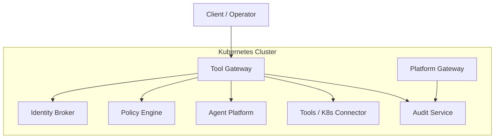

[No sources needed since this diagram shows conceptual workflow, not actual code structure]

## Core Components
- Identity Broker provides OIDC endpoints, issues and validates audience-bound tokens, supports delegated token flows, exposes identity context APIs with service-to-service authentication, and validates workload identity tokens from Kubernetes projected service accounts.
- Tool Gateway performs request authentication, token verification with audience validation, policy evaluation, secure tool execution orchestration, deterministic output redaction, flow deviation guard enforcement, per-action approval enforcement for unbound browser interactions, comprehensive secret masking for all tool outputs, and routes requests to downstream services with proper identity propagation.
- Audit Service provides durable audit trail storage with secure service-to-service authentication using both static credentials and workload identity, role-based query access control, and retention policies for compliance.
- Policy Engine evaluates policies against requests and enforces RBAC and fine-grained permissions with service-to-service identity awareness.
- Agent Platform manages sessions and runtime dependencies for agent workloads with strict audience-scoped permissions, least-privilege execution contexts, explicit tool permission allow-listing, flow-based approval enforcement with session-scoped authorities, per-action signed gates for unbound browser interactions, kernel-side authority clearing for staleness backstops, enhanced document repository with envelope-only listings and centralized fetch auditing, comprehensive evidence protection through reference-only credential entry and structured change-request projections, and **comprehensive credential masking for chat prose**.
- Kubernetes RBAC and policy manifests define least-privilege access and runtime constraints with enhanced service identity management.

Key responsibilities:
- Authentication via OIDC and audience-bound JWT validation at the gateway and broker.
- Authorization via policy engine using RBAC, scopes, and resource-scoped permissions with service identity awareness.
- Secure configuration through environment-driven settings and secrets injection with least-privilege defaults.
- Explicit tool permission allow-listing preventing unauthorized tool execution while maintaining operational efficiency.
- Flow-based approval enforcement ensuring exactly one HITL gate per mutating browser flow with session-scoped authorities.
- **Per-action signed gates for unbound browser interactions** replacing hard-denial policies with operator-approved change requests featuring structured change-request projections.
- **Staleness backstops** including kernel-side authority clearing and signed authority provenance (ADR-0010) preventing exploitation of stale flow authorities.
- **Comprehensive secret masking** across all tool outputs and change-request cards using fail-closed masking postures.
- **Evidence protection mechanisms** through reference-only credential entry and structured parameter projection.
- **Third masking posture for evidence frames** preserving structural integrity while removing secrets from tool-call evidence frames.
- **Multi-layered session title credential protection** preventing credential leakage through session titles displayed to approvers.
- **Comprehensive credential masking for chat prose** preventing password and sensitive information echo-back by AI models through four-layer protection.
- Deterministic tool output redaction preventing credential leakage to external model providers.
- Workload identity service tokens replacing static client secrets with short-lived, auditable credentials.
- Comprehensive audit trail with secure ingestion, storage, and query capabilities with role-based access control.
- **Enhanced document read audit integrity** ensuring cross-owner access to sensitive content is properly recorded through centralized single-document fetch endpoints.
- **Flow authority audit trails** providing complete visibility into browser flow approvals, per-action approvals, and auto-signed executions.
- Observability and audit logging for security events with enhanced service-to-service communication tracking.

**Section sources**
- [identity-and-authorization-design.md](file://docs/agentic-aiops-platform/identity-and-authorization-design.md)
- [authorization-matrix.md](file://docs/agentic-aiops-platform/authorization-matrix.md)
- [policy-specification.md](file://docs/agentic-aiops-platform/policy-specification.md)
- [SPEC-003-identity-trust-hardening/spec.md](file://docs/specs/SPEC-003-identity-trust-hardening/spec.md)
- [SPEC-004-policy-enforcement/spec.md](file://docs/specs/SPEC-004-policy-enforcement/spec.md)
- [SPEC-008-service-to-service-identity/spec.md](file://docs/specs/SPEC-008-service-to-service-identity/spec.md)
- [SPEC-009-pre-production-hardening/spec.md](file://docs/specs/SPEC-009-pre-production-hardening/spec.md)
- [SPEC-013-durable-audit-trail/spec.md](file://docs/specs/SPEC-013-durable-audit-trail/spec.md)
- [SPEC-049-browser-web-check-tools/spec.md](file://docs/specs/SPEC-049-browser-web-check-tools/spec.md)
- [SPEC-051-browser-flow-hitl-gate-enforcement/spec.md](file://docs/specs/SPEC-051-browser-flow-hitl-gate-enforcement/spec.md)
- [SPEC-054-action-approval-and-change-request-card/spec.md](file://docs/specs/SPEC-054-action-approval-and-change-request-card/spec.md)

## Architecture Overview
The enhanced security architecture centers on a trust boundary at the Tool Gateway, which authenticates clients, verifies audience-bound tokens, enforces policies with service identity awareness, delegates tokens securely to internal services, applies deterministic redaction to prevent credential leakage, enforces explicit tool permission allow-listing, maintains flow deviation guards, and implements per-action approval enforcement for unbound browser interactions with comprehensive secret masking. The Identity Broker acts as the single source of truth for user and service identities, issuing OIDC-compliant tokens with audience scoping, validating workload identity tokens from Kubernetes, and providing introspection endpoints. The Audit Service provides durable, tamper-evident audit trails with secure service-to-service authentication and role-based query access. Policies are declarative and evaluated per-request, enabling dynamic authorization based on roles, scopes, resource attributes, and service identity relationships. **Updated**: The flow-based approval system ensures exactly one HITL gate per mutating browser flow, with session-scoped authorities scoped to flow identity (skill_id + origin) and time-bounded by configurable TTL, eliminating cross-flow privilege escalation while maintaining individual execution signing and audit trails for each unlocked write. Additionally, unbound browser interactions now park per-action signed gates instead of being hard-denied, with comprehensive staleness backstops including kernel-side authority clearing and signed authority provenance (ADR-0010) that prevent exploitation of stale flow authorities, and structured change-request cards providing secret-masked visibility into pending operations. The platform now implements comprehensive evidence frame secret masking with a specialized third masking posture that preserves structural integrity while removing secrets from tool-call evidence frames, multi-layered session title credential protection preventing credential leakage through session titles displayed to approvers, and **comprehensive credential masking for chat prose** preventing password and sensitive information echo-back by AI models through four-layer protection. **Enhanced**: v0.36.1 extends credential masking to all nine browser result emission sites, implements streaming prose redaction for live assistant streams, and integrates session title protection into shared masking infrastructure.

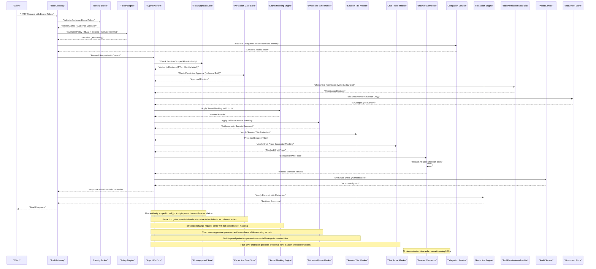

**Diagram sources**
- [auth.py](file://products/tool-gateway/src/api_gateway/api/routes/auth.py)
- [gateway_service.py](file://products/tool-gateway/src/api_gateway/services/gateway_service.py)
- [policy_engine.py](file://products/tool-gateway/src/api_gateway/services/policy_engine.py)
- [token_verifier.py](file://products/tool-gateway/src/api_gateway/services/token_verifier.py)
- [delegation_client.py](file://products/tool-gateway/src/api_gateway/services/delegation_client.py)
- [redaction.py](file://products/tool-gateway/src/api_gateway/tools/redaction.py)
- [gateway_tools.py](file://products/agent-platform/src/agent_service/tools/gateway_tools.py)
- [flow_approvals.py](file://products/agent-platform/src/agent_service/services/flow_approvals.py)
- [execution_signing.py](file://products/agent-platform/src/agent_service/services/execution_signing.py)
- [secret_params.py](file://products/agent-platform/src/agent_service/services/secret_params.py)
- [session_service.py](file://products/agent-platform/src/agent_service/services/session_service.py)
- [prose_redaction.py](file://products/agent-platform/src/agent_service/services/prose_redaction.py)
- [browser_connector.py](file://products/tool-gateway/src/tool_gateway/tools/browser_connector.py)
- [auth.py](file://products/identity-broker/src/identity_service/api/routes/auth.py)
- [identity_service.py](file://products/identity-broker/src/identity_service/services/identity_service.py)
- [exchange_service.py](file://products/identity-broker/src/identity_service/services/exchange_service.py)
- [audit_emitter.py](file://products/tool-gateway/src/tool_gateway/services/audit_emitter.py)
- [ingest.py](file://products/audit-service/src/audit_service/api/routes/ingest.py)
- [routes.py](file://products/agent-platform/src/agent_service/api/v2/routes.py)

**Section sources**
- [SPEC-003-identity-trust-hardening/spec.md](file://docs/specs/SPEC-003-identity-trust-hardening/spec.md)
- [SPEC-004-policy-enforcement/spec.md](file://docs/specs/SPEC-004-policy-enforcement/spec.md)
- [SPEC-008-service-to-service-identity/spec.md](file://docs/specs/SPEC-008-service-to-service-identity/spec.md)
- [SPEC-009-pre-production-hardening/spec.md](file://docs/specs/SPEC-009-pre-production-hardening/spec.md)
- [SPEC-013-durable-audit-trail/spec.md](file://docs/specs/SPEC-013-durable-audit-trail/spec.md)
- [SPEC-049-browser-web-check-tools/spec.md](file://docs/specs/SPEC-049-browser-web-check-tools/spec.md)
- [SPEC-051-browser-flow-hitl-gate-enforcement/spec.md](file://docs/specs/SPEC-051-browser-flow-hitl-gate-enforcement/spec.md)
- [SPEC-054-action-approval-and-change-request-card/spec.md](file://docs/specs/SPEC-054-action-approval-and-change-request-card/spec.md)
- [0010-signed-execution-envelopes-declare-authority-provenance.md](file://docs/adr/0010-signed-execution-envelopes-declare-authority-provenance.md)

## Detailed Component Analysis

### Identity Broker: Enhanced OIDC and Audience-Bound JWT Security with Workload Identity Support
The Identity Broker implements enhanced OIDC endpoints for authentication and audience-bound token issuance with comprehensive workload identity support. It validates client credentials, issues JWTs with appropriate audience scoping, supports delegated token flows, validates Kubernetes projected service account tokens, and provides comprehensive token introspection capabilities. Configuration is driven by environment variables for issuer URLs, signing keys, token lifetimes, and audience restrictions.

Key aspects:
- OIDC discovery and token endpoints exposed via API routes with audience validation.
- JWT signing and verification using configured algorithms and key material with audience binding.
- Token introspection endpoint for downstream services to validate bearer tokens and audience claims.
- Role and scope mapping from upstream providers into platform claims with service identity support.
- Delegated token flow implementation for secure service-to-service communications.
- Workload identity token validation against Kubernetes cluster OIDC issuer JWKS.
- Workload subject mapping to registered service clients with audience allow-list semantics.

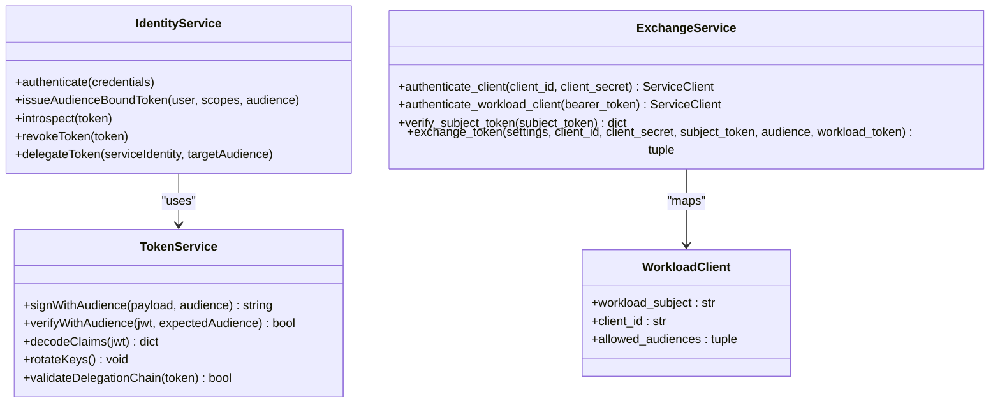

**Diagram sources**
- [identity_service.py](file://products/identity-broker/src/identity_service/services/identity_service.py)
- [token_service.py](file://products/identity-broker/src/identity_service/services/token_service.py)
- [exchange_service.py](file://products/identity-broker/src/identity_service/services/exchange_service.py)
- [config.py](file://products/identity-broker/src/identity_service/core/config.py)

**Section sources**
- [auth.py](file://products/identity-broker/src/identity_service/api/routes/auth.py)
- [identity.py](file://products/identity-broker/src/identity_service/api/routes/identity.py)
- [token_service.py](file://products/identity-broker/src/identity_service/services/token_service.py)
- [identity_service.py](file://products/identity-broker/src/identity_service/services/identity_service.py)
- [exchange_service.py](file://products/identity-broker/src/identity_service/services/exchange_service.py)
- [config.py](file://products/identity-broker/src/identity_service/core/config.py)
- [runtime-config.env](file://shared/platform-ops/gitops/dev-k8s/base/identity-broker/runtime-config.env)

### Tool Gateway: Enhanced Authentication, Authorization, Service Identity Enforcement, and Deterministic Redaction
The Tool Gateway serves as the primary security enforcement point with enhanced audience validation, service identity awareness, and deterministic output redaction. It validates incoming requests, verifies audience-bound JWTs, evaluates policies with service identity context, forwards authorized requests to downstream services with proper identity propagation, and applies deterministic redaction to prevent credential leakage to external model providers. Policies are defined declaratively and support RBAC, fine-grained rules, and service-to-service identity relationships. **Updated**: The gateway now implements per-action approval enforcement for unbound browser interactions, replacing hard-denial policies with operator-approved change requests featuring structured change-request projections, and enforces signed authority provenance (ADR-0010) to prevent exploitation of stale flow authorities, along with comprehensive secret masking for all tool outputs. **Enhanced**: v0.36.1 extends credential masking to all nine browser result emission sites, ensuring consistent protection across all browser interactions including click, type, select, upload_file, fill_credential, snapshot, screenshot, hover, evaluate, scroll, switch_frame, and press_key operations.

Key aspects:
- Audience-bound JWT verification and claim extraction with service identity validation.
- Policy evaluation using a policy engine that reads YAML policies with service identity awareness.
- RBAC enforcement via Kubernetes manifests and runtime checks with least-privilege principles.
- Audit logging of authz decisions, service-to-service communications, and sensitive operations.
- Delegated token flow implementation for secure inter-service communications with workload identity preference.
- Deterministic tool output redaction preventing credential leakage to model providers.
- Flow deviation guard enforcement ensuring origin allowlist, risk class, and step budget bounds.
- Fail-closed overflow protection when too much content appears to contain credentials.
- **Per-action approval enforcement** for unbound browser interactions replacing hard-denial policies with structured change-request cards.
- **Signed authority provenance enforcement** preventing stale flow authority exploitation via BROWSER_FLOW_AUTHORITY_STALE errors.
- **Comprehensive secret masking** applied to all tool outputs and change-request projections using fail-closed masking postures.
- **Enhanced browser result redaction** covering all nine emission sites with consistent credential protection.

**Diagram sources**
- [auth.py](file://products/tool-gateway/src/api_gateway/api/routes/auth.py)
- [gateway_service.py](file://products/tool-gateway/src/api_gateway/services/gateway_service.py)
- [policy_engine.py](file://products/tool-gateway/src/api_gateway/services/policy_engine.py)
- [token_verifier.py](file://products/tool-gateway/src/api_gateway/services/token_verifier.py)
- [delegation_client.py](file://products/tool-gateway/src/api_gateway/services/delegation_client.py)
- [redaction.py](file://products/tool-gateway/src/api_gateway/tools/redaction.py)
- [policy-default.yaml](file://products/tool-gateway/src/api_gateway/policies/policy-default.yaml)

**Section sources**
- [auth.py](file://products/tool-gateway/src/api_gateway/api/routes/auth.py)
- [gateway_service.py](file://products/tool-gateway/src/api_gateway/services/gateway_service.py)
- [policy_engine.py](file://products/tool-gateway/src/api_gateway/services/policy_engine.py)
- [token_verifier.py](file://products/tool-gateway/src/api_gateway/services/token_verifier.py)
- [delegation_client.py](file://products/tool-gateway/src/api_gateway/services/delegation_client.py)
- [redaction.py](file://products/tool-gateway/src/api_gateway/tools/redaction.py)
- [policy-default.yaml](file://products/tool-gateway/src/api_gateway/policies/policy-default.yaml)
- [rbac.yaml](file://shared/platform-ops/gitops/dev-k8s/base/tool-gateway/rbac.yaml)

### Audit Service: Secure Audit Trail with Service-to-Service Authentication
**New** The Audit Service provides a durable, tamper-evident audit trail with robust service-to-service authentication and role-based access control. It accepts authenticated audit events from platform services, stores them with retention policies, and provides secure query capabilities for authorized users through the platform gateway.

Key aspects:
- **Dual Authentication Paths**: Supports both static HTTP Basic credentials and Kubernetes projected workload tokens for service authentication.
- **Secure Ingestion**: Batch event ingestion with validation, authentication, and atomic storage guarantees.
- **Role-Based Query Access**: Enforced through platform gateway with `audit:read` policy action requiring auditor or platform-admin roles.
- **Retention Management**: Configurable retention windows and maximum event counts with background eviction.
- **Fire-and-Forget Emission**: Non-blocking audit event delivery from emitting services with failure handling.
- **Compliance-Focused Design**: Immutable audit records with service attribution and timestamping.

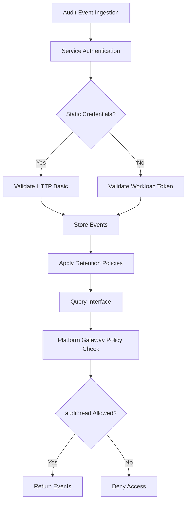

**Diagram sources**
- [ingest_auth.py](file://products/audit-service/src/audit_service/services/ingest_auth.py)
- [ingest.py](file://products/audit-service/src/audit_service/api/routes/ingest.py)
- [query.py](file://products/audit-service/src/audit_service/api/routes/query.py)
- [audit.py](file://products/platform-gateway/src/platform_gateway/api/routes/audit.py)

**Section sources**
- [ingest_auth.py](file://products/audit-service/src/audit_service/services/ingest_auth.py)
- [ingest.py](file://products/audit-service/src/audit_service/api/routes/ingest.py)
- [query.py](file://products/audit-service/src/audit_service/api/routes/query.py)
- [audit.py](file://products/platform-gateway/src/platform_gateway/api/routes/audit.py)
- [config.py](file://products/audit-service/src/audit_service/core/config.py)
- [runtime-secrets.example.env](file://shared/platform-ops/gitops/dev-k8s/base/audit-service/runtime-secrets.example.env)

### Enhanced Document Repository: Envelope-Only Listings and Centralized Fetch Auditing
**Updated** The document repository has been significantly enhanced to ensure audit integrity for document read operations. The system now implements envelope-only listings that strip sensitive content (digest and prose) from list responses, ensuring that cross-owner access to sensitive content is properly recorded through centralized single-document fetch endpoints. This prevents unauthorized content exposure while maintaining comprehensive audit trails.

Key aspects:
- **Envelope-Only Listings**: Both `mine` and `published` document listing endpoints return metadata only, stripping `digest` and `prose` fields to prevent content exposure.
- **Centralized Single-Document Fetch**: Full document content is only available through the single-document fetch endpoint (`GET /documents/{document_id}`), which serves as the audited surface.
- **Cross-Owner Read Auditing**: When a user accesses another user's published document, a `document_read` audit event is emitted with owner attribution, while own-document reads remain unaudited.
- **Foreign Draft Protection**: Foreign drafts are indistinguishable from unknown documents, returning 404 status codes to prevent enumeration attacks.
- **Portal Integration**: The operator portal drawer now retrieves full documents through the audited single fetch endpoint, ensuring every cross-owner read is properly recorded.

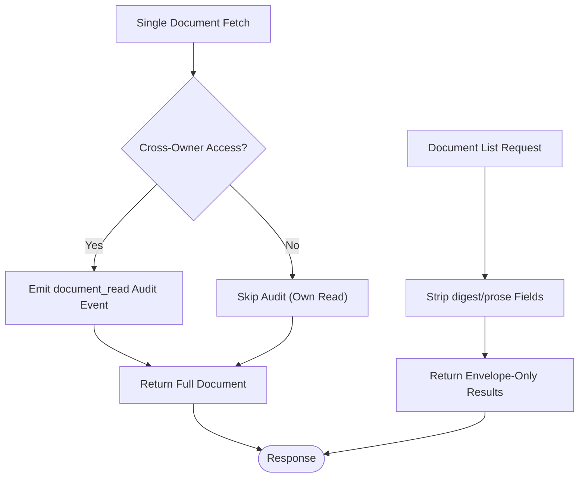

**Diagram sources**
- [routes.py:858-882](file://products/agent-platform/src/agent_service/api/v2/routes.py#L858-L882)
- [routes.py:885-915](file://products/agent-platform/src/agent_service/api/v2/routes.py#L885-L915)
- [test_documents.py:250-266](file://products/agent-platform/tests/test_documents.py#L250-L266)

**Section sources**
- [routes.py:858-915](file://products/agent-platform/src/agent_service/api/v2/routes.py#L858-L915)
- [test_documents.py:250-266](file://products/agent-platform/tests/test_documents.py#L250-L266)
- [2026-08-27-document-read-audit-integrity.md](file://docs/agentic-aiops-platform/release-notes/2026-08-27-document-read-audit-integrity.md)

### Enhanced Browser Interaction Security: Per-Action Signed Gates, Staleness Backstops, and Evidence Protection
**New** The platform now implements enhanced browser interaction security with per-action signed gates replacing hard-denial policies for unbound browser writes, along with comprehensive staleness backstops including kernel-side authority clearing and signed authority provenance (ADR-0010). This addresses critical security gaps where previously unbound browser interactions were simply denied, preventing legitimate ad-hoc browser workflows from being approved. **Enhanced** with comprehensive secret masking across all tool outputs and structured change-request cards providing fail-closed evidence protection. **Updated**: v0.36.1 extends credential masking to all nine browser result emission sites, ensuring consistent protection across all browser interactions.

Key aspects:
- **Per-Action Signed Gates**: Unbound browser writes now park per-action signed gates instead of being hard-denied, allowing operators to approve ad-hoc browser interactions through structured change-request cards with secret masking.
- **Kernel-Side Authority Clearing**: The kernel drops `FLOW_CONTEXTS` and `FLOW_APPROVALS` for a session when it observes flow-killing gateway results, preventing stale flow authorities from outliving their bindings.
- **Signed Authority Provenance (ADR-0010)**: Every execution-request envelope carries `approval_kind ∈ {action, flow}`, stamped inside the HMAC signature by whichever builder signs it, providing a signed fact rather than an unsigned hint.
- **BROWSER_FLOW_AUTHORITY_STALE Enforcement**: The gateway enforces provenance on the browser write path, refusing flow-provenance envelopes presented when no flow is bound with structured error codes.
- **Structured Change-Request Cards**: Per-action approvals present operators with secret-masked change-request cards showing what will be executed, with structured projections containing summary and masked fields.
- **Fail-Closed Evidence Protection**: Reference-only credential entry prevents literal secrets from appearing in tool arguments, with comprehensive masking applied to all change-request projections and tool outputs.
- **Fail-Closed Security**: The relaxation of hard-denial policies ships together with comprehensive staleness backstops that maintain fail-closed security guarantees.
- **Enhanced Browser Result Redaction**: All nine emission sites now consistently redact secret-bearing query values, including post-navigation interactions like snapshots, screenshots, clicks, and other browser operations.

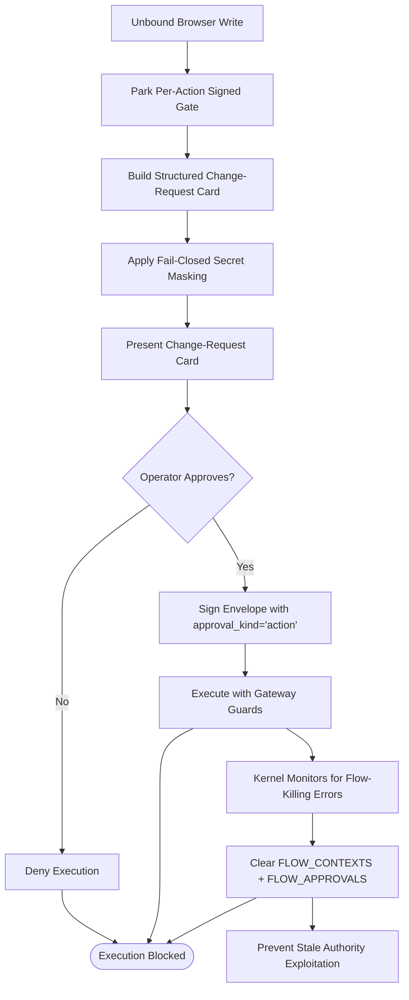

**Diagram sources**
- [flow_approvals.py:56-75](file://products/agent-platform/src/agent_service/services/flow_approvals.py#L56-L75)
- [execution_signing.py:90-105](file://products/agent-platform/src/agent_service/services/execution_signing.py#L90-L105)
- [execution_signing.py:108-149](file://products/agent-platform/src/agent_service/services/execution_signing.py#L108-L149)
- [secret_params.py:172-183](file://products/agent-platform/src/agent_service/services/secret_params.py#L172-L183)
- [runtime_kernel.py:1417-1449](file://products/agent-platform/src/agent_service/runtime_kernel.py#L1417-L1449)

**Section sources**
- [SPEC-054-action-approval-and-change-request-card/spec.md](file://docs/specs/SPEC-054-action-approval-and-change-request-card/spec.md)
- [0010-signed-execution-envelopes-declare-authority-provenance.md](file://docs/adr/0010-signed-execution-envelopes-declare-authority-provenance.md)
- [flow_approvals.py:56-75](file://products/agent-platform/src/agent_service/services/flow_approvals.py#L56-L75)
- [execution_signing.py:90-149](file://products/agent-platform/src/agent_service/services/execution_signing.py#L90-L149)
- [secret_params.py:172-183](file://products/agent-platform/src/agent_service/services/secret_params.py#L172-L183)
- [runtime_kernel.py:1417-1449](file://products/agent-platform/src/agent_service/runtime_kernel.py#L1417-L1449)
- [2026-09-07-action-approval-and-change-request-card.md](file://docs/agentic-aiops-platform/release-notes/2026-09-07-action-approval-and-change-request-card.md)

### Flow-Based Approval Enforcement: Single HITL Gate Per Browser Flow
**Updated** The platform implements flow-based approval enforcement ensuring exactly one HITL gate per mutating browser flow, addressing critical security gaps where previously every write-tier browser interaction required separate operator approval. This enhancement eliminates cross-flow privilege escalation while maintaining individual execution signing and comprehensive audit trails. **Enhanced** with per-action signed gates for unbound interactions, comprehensive staleness backstops, and structured change-request cards providing secret-masked visibility into pending operations. **Updated**: v0.36.1 extends credential masking to all browser result emission sites, ensuring consistent protection throughout the entire browser interaction flow.

Key aspects:
- **Session-Scoped Flow Authorities**: Each approval creates a session-scoped authority keyed on both chat session ID and approved flow identity (skill_id + origin), preventing cross-flow privilege escalation.
- **Time-Bounded Expiration**: Flow authorities are bounded by configurable TTL (`AGENT_BROWSER_FLOW_APPROVAL_TTL`, default 900 seconds) with fail-safe behavior when expired or disabled (ttl=0).
- **Identity Guard Enforcement**: The kernel maintains a session-scoped `FlowContext` reflecting the gateway-owned flow binding; any rebind to a different flow triggers re-parking of the next write.
- **Auto-Signed Executions**: Subsequent write-tier browser interactions in the same flow are auto-signed under the approving card's authority with fresh execution IDs and argument digests.
- **Gateway Deviation Guards**: Every unlocked write remains bounded by origin allowlist, declared risk class, and step budget enforcement at the tool gateway.
- **Flow-Semantic Confirmation Cards**: Operators approve workflow-level actions ("Reset User Password in Admin Portal") rather than bare tool actions, improving operator understanding and security posture.
- **Per-Action Alternative**: Unbound browser interactions now park per-action signed gates instead of being hard-denied, providing flexibility while maintaining security through structured change-request cards with secret masking.
- **Enhanced Browser Result Protection**: All nine emission sites consistently mask secret-bearing URLs, preventing credential leakage through browser interaction results.

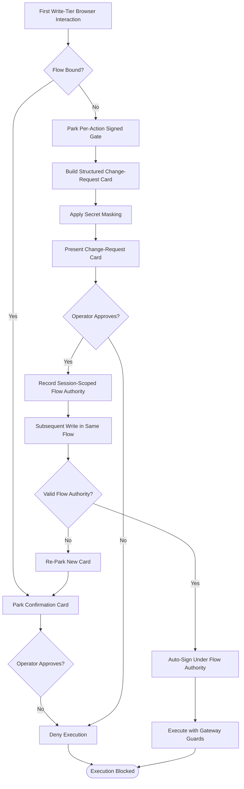

**Diagram sources**
- [flow_approvals.py:138-231](file://products/agent-platform/src/agent_service/services/flow_approvals.py#L138-L231)
- [runtime_kernel.py:1256-1341](file://products/agent-platform/src/agent_service/runtime_kernel.py#L1256-L1341)
- [execution_signing.py:101-134](file://products/agent-platform/src/agent_service/services/execution_signing.py#L101-L134)
- [secret_params.py:172-183](file://products/agent-platform/src/agent_service/services/secret_params.py#L172-L183)

**Section sources**
- [SPEC-051-browser-flow-hitl-gate-enforcement/spec.md](file://docs/specs/SPEC-051-browser-flow-hitl-gate-enforcement/spec.md)
- [0007-browser-flow-single-hitl-gate.md](file://docs/adr/0007-browser-flow-single-hitl-gate.md)
- [flow_approvals.py:1-274](file://products/agent-platform/src/agent_service/services/flow_approvals.py#L1-L274)
- [runtime_kernel.py:1256-1341](file://products/agent-platform/src/agent_service/runtime_kernel.py#L1256-L1341)
- [execution_signing.py:101-134](file://products/agent-platform/src/agent_service/services/execution_signing.py#L101-L134)
- [secret_params.py:172-183](file://products/agent-platform/src/agent_service/services/secret_params.py#L172-L183)
- [2026-09-04-browser-flow-hitl-gate-enforcement.md](file://docs/agentic-aiops-platform/release-notes/2026-09-04-browser-flow-hitl-gate-enforcement.md)
- [2026-09-07-action-approval-and-change-request-card.md](file://docs/agentic-aiops-platform/release-notes/2026-09-07-action-approval-and-change-request-card.md)

### Explicit Tool Permission Allow-List System
**Updated** The tool permission auto-approval system has been significantly hardened to address CWE-862 (Incorrect Authorization) vulnerability. Instead of automatically approving any read-only tool, the system now uses an explicit vetted allow-list controlled by the `AGENT_GATEWAY_TOOL_AUTO_ALLOW` environment variable. This ensures that only pre-approved, security-reviewed tools can bypass the interactive permission confirmation process.

Key aspects:
- Default allow-list contains only vetted read-only tools: `k8s.list_pods`, `k8s.get_pod`, `k8s.get_events`, `k8s.get_pod_logs`.
- Environment variable override allows deployment-specific customization of the allow-list.
- Empty environment variable approves nothing, ensuring fail-safe behavior.
- Non-read-only tools always require interactive confirmation regardless of allow-list status.
- Tools outside the allow-list maintain the default ASK behavior, preventing unauthorized execution.
- Admission and policy enforcement continue at the tool-gateway level for all tool invocations.

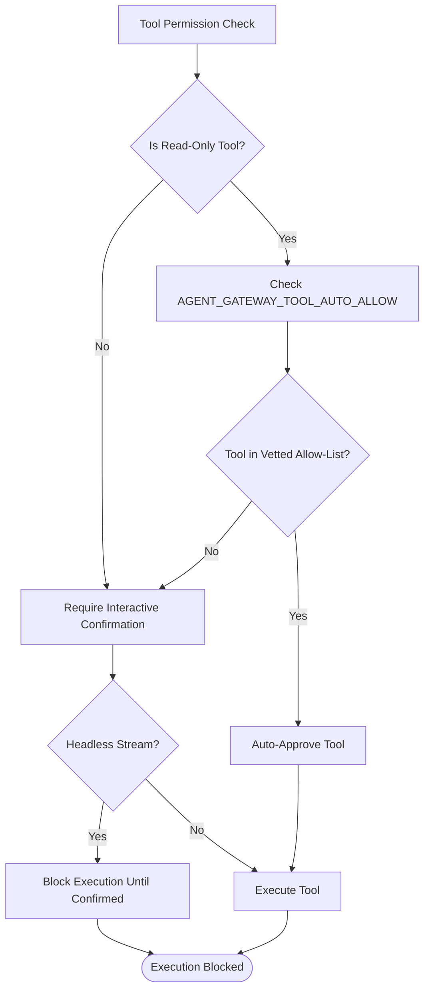

**Diagram sources**
- [gateway_tools.py:35-96](file://products/agent-platform/src/agent_service/tools/gateway_tools.py#L35-L96)
- [test_gateway_tools.py:228-287](file://products/agent-platform/tests/test_gateway_tools.py#L228-L287)

**Section sources**
- [gateway_tools.py:35-96](file://products/agent-platform/src/agent_service/tools/gateway_tools.py#L35-L96)
- [test_gateway_tools.py:228-287](file://products/agent-platform/tests/test_gateway_tools.py#L228-L287)

### Deterministic Tool Output Redaction System
The redaction system implements code-owned, deterministic pattern matching to prevent credential leakage to external model providers. It operates at the single choke point where every tool result becomes an HTTP response, ensuring no path can bypass the redaction process. The system uses two layers of protection: value patterns for shape-based credential detection and explicit key lists for bounded sensitive field matching.

Key aspects:
- Value patterns detect JWTs, Bearer/Basic tokens, PEM private keys, and AWS-style access key IDs.
- Explicit key list matches sensitive fields like password, secret, api_key, token, etc.
- Code-owned pattern set (not operator-editable) ensures consistent security guarantees.
- Fail-closed overflow protection returns structured errors when too much content appears to contain credentials.
- Prometheus metrics track redacted spans per tool result for observability.
- Audit logging includes redaction statistics for security monitoring.

```mermaid
flowchart TD
Input["Tool Result Input"] --> Walk["Walk JSON Structure"]
Walk --> DictNode{"Dict Node?"}
DictNode --> |Yes| CheckSensitive["Check Key Against Sensitive List"]
DictNode --> |No| StringNode{"String Node?"}
CheckSensitive --> |Yes| RedactValue["Replace Value with [REDACTED]"]
CheckSensitive --> |No| Recurse["Recurse into Children"]
StringNode --> |Yes| ApplyPatterns["Apply Value Patterns"]
StringNode --> |No| ReturnNode["Return Node Unchanged"]
ApplyPatterns --> CountSpans["Count Redacted Spans"]
CountSpans --> BuildStats["Build Redaction Stats"]
Recurse --> Walk
RedactValue --> CountSpans
ReturnNode --> Walk
BuildStats --> OverflowCheck{"Overflow Check"}
OverflowCheck --> |Yes| Error["Return REDACTION_OVERFLOW"]
OverflowCheck --> |No| Output["Return Redacted Result"]
```

**Diagram sources**
- [redaction.py](file://products/tool-gateway/src/api_gateway/tools/redaction.py)

**Section sources**
- [redaction.py](file://products/tool-gateway/src/api_gateway/tools/redaction.py)
- [gateway_service.py](file://products/tool-gateway/src/api_gateway/services/gateway_service.py)
- [SPEC-009-pre-production-hardening/spec.md](file://docs/specs/SPEC-009-pre-production-hardening/spec.md)

### Comprehensive Secret Masking and Evidence Protection
**New** The platform now implements comprehensive secret masking across all tool outputs and structured change-request projections, providing fail-closed evidence protection through reference-only credential entry and structured parameter projection. This addresses critical security gaps where secrets could potentially leak through change-request cards, tool outputs, or evidence payloads. **Enhanced** with a specialized third masking posture for evidence frames and multi-layered session title credential protection. **Updated**: v0.36.1 extends credential masking to all nine browser result emission sites and integrates session title protection into shared masking infrastructure.

Key aspects:
- **Fail-Closed Masking Posture**: All parameter values mask unless positively identified as safe through the `KNOWN_SAFE_FIELDS` allow-list, preventing off-vocabulary secrets from projecting as plaintext.
- **Structured Change-Request Projections**: Change-request cards use structured objects with `summary` and `fields[]` arrays, where each field is flagged as `masked` when containing sensitive data.
- **Reference-Only Credential Entry**: `web.fill_credential` provides the only path for unbound credential entry, keeping literal secrets out of tool arguments, change-request cards, and audit trails.
- **Kernel-Side Parameter Redaction**: Raw parameters ride alongside change-request projections but are redacted using the same fail-closed masking posture to prevent secret exposure.
- **Per-Tool Opaque Value Rules**: Specific tool parameters like `web.type.text` and `web.evaluate.expression` are masked wholesale regardless of parameter name due to their potential to contain arbitrary secrets.
- **Name-Based and Opaque-Value Masking**: Combined approach using parameter name substring matching and per-tool opaque-value rules to catch both known-secret patterns and generically-named secrets.
- **Durable Record Protection**: Persisted `pending_calls` retains only what the signed-execution mechanism requires, with secret-bearing values bounded by reference-only floor and never echoed into display surfaces.
- **Third Masking Posture for Evidence Frames**: Specialized masking for tool-call evidence frames that preserves structural integrity while removing secrets, diverging from the fail-closed approach used for change-request cards.
- **Multi-Layered Session Title Protection**: Four-layer protection against credential leakage in session titles, including shape-based patterns, key-value matching, URL query redaction, and heuristic credential detection.
- **Enhanced Browser Result Redaction**: All nine emission sites consistently mask secret-bearing query values, ensuring comprehensive protection across all browser interactions.

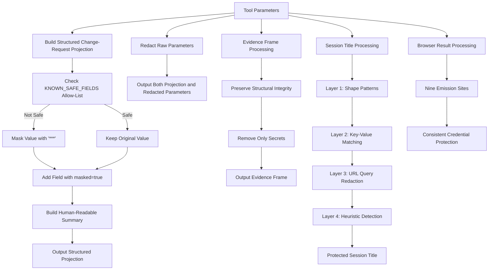

**Diagram sources**
- [secret_params.py:172-183](file://products/agent-platform/src/agent_service/services/secret_params.py#L172-L183)
- [secret_params.py:185-205](file://products/agent-platform/src/agent_service/services/secret_params.py#L185-L205)
- [secret_params.py:275-316](file://products/agent-platform/src/agent_service/services/secret_params.py#L275-L316)
- [session_service.py:111-130](file://products/agent-platform/src/agent_service/services/session_service.py#L111-L130)
- [browser_connector.py:196-262](file://products/tool-gateway/src/tool_gateway/tools/browser_connector.py#L196-L262)
- [SPEC-054-action-approval-and-change-request-card/spec.md:281-332](file://docs/specs/SPEC-054-action-approval-and-change-request-card/spec.md#L281-L332)

**Section sources**
- [secret_params.py:172-183](file://products/agent-platform/src/agent_service/services/secret_params.py#L172-L183)
- [secret_params.py:185-205](file://products/agent-platform/src/agent_service/services/secret_params.py#L185-L205)
- [secret_params.py:275-316](file://products/agent-platform/src/agent_service/services/secret_params.py#L275-L316)
- [session_service.py:111-130](file://products/agent-platform/src/agent_service/services/session_service.py#L111-L130)
- [browser_connector.py:196-262](file://products/tool-gateway/src/tool_gateway/tools/browser_connector.py#L196-L262)
- [SPEC-054-action-approval-and-change-request-card/spec.md:281-332](file://docs/specs/SPEC-054-action-approval-and-change-request-card/spec.md#L281-L332)
- [SPEC-055-develop-as-you-go-skill-graduation/spec.md:299-330](file://docs/specs/SPEC-055-develop-as-you-go-skill-graduation/spec.md#L299-L330)
- [test_secret_params.py:312-394](file://products/agent-platform/tests/test_secret_params.py#L312-L394)

### Comprehensive Chat Prose Credential Masking (SPEC-049 R-5 Posture)
**New** The platform now implements comprehensive credential masking for chat prose as part of SPEC-049 R-5 posture, addressing critical security gaps where passwords and sensitive information typed by operators into chat conversations could be echoed back verbatim by AI models. This four-layer protection system masks both user-authored text and assistant responses to prevent credential leakage throughout the conversation flow. **Updated**: v0.36.1 enhances this system with streaming prose redaction for live assistant streams and integrates session title protection into shared masking infrastructure.

Key aspects:
- **Four-Layer Protection System**: Implements pinned secret shape patterns (PEM/JWT/Bearer-Basic/AKIA formats), URL query parameter redaction, key=value pair detection with secret-named parameters, and heuristic layer for credential-looking tokens when text contains references to secrets.
- **User vs Assistant Text Differentiation**: Applies different masking strategies - user text gets all four layers while assistant text gets only pinned shapes, URL queries, and exact literal matches to avoid false positives in operational responses.
- **Streaming Prose Redaction**: Real-time credential masking during live chat streams with intelligent buffering to handle partial credentials split across message chunks.
- **Transcript Protection**: Durable transcript masking ensures credentials don't persist in stored conversation history, protecting both current and future access to chat records.
- **Literal Harvesting and Cross-Turn Echo Prevention**: Extracts credential literals from user messages and applies exact matching to assistant responses, preventing models from echoing back credentials they've seen in prompts.
- **Integration Across Platform Components**: Seamlessly integrates with session transcripts, live streaming, and all chat-related interfaces to provide comprehensive protection.
- **Shared Masking Infrastructure**: Session title protection now uses the same masking functions as chat prose, ensuring consistency across all user-facing surfaces.

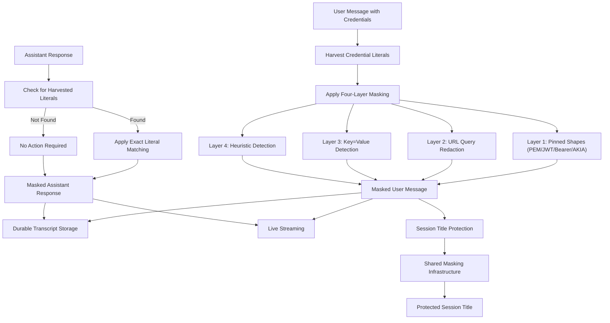

**Diagram sources**
- [prose_redaction.py:197-218](file://products/agent-platform/src/agent_service/services/prose_redaction.py#L197-L218)
- [prose_redaction.py:314-333](file://products/agent-platform/src/agent_service/services/prose_redaction.py#L314-L333)
- [prose_redaction.py:358-389](file://products/agent-platform/src/agent_service/services/prose_redaction.py#L358-389)
- [runtime_kernel.py:1015-1020](file://products/agent-platform/src/agent_service/runtime_kernel.py#L1015-L1020)
- [session_service.py:129-148](file://products/agent-platform/src/agent_service/services/session_service.py#L129-L148)

**Section sources**
- [prose_redaction.py:1-510](file://products/agent-platform/src/agent_service/services/prose_redaction.py#L1-L510)
- [test_prose_redaction.py:1-200](file://products/agent-platform/tests/test_prose_redaction.py#L1-L200)
- [SPEC-049-browser-web-check-tools/spec.md:185-208](file://docs/specs/SPEC-049-browser-web-check-tools/spec.md#L185-L208)
- [runtime_kernel.py:1015-1020](file://products/agent-platform/src/agent_service/runtime_kernel.py#L1015-L1020)
- [session_service.py:129-148](file://products/agent-platform/src/agent_service/services/session_service.py#L129-L148)
- [2026-09-11-post-live-test-credential-masking-and-hitl-hardening.md:103-142](file://docs/agentic-aiops-platform/release-notes/2026-09-11-post-live-test-credential-masking-and-hitl-hardening.md#L103-L142)

### Enhanced Browser Result Redaction (v0.36.1)
**New** The v0.36.1 release extends credential masking to all nine browser result emission sites, ensuring consistent protection across all browser interactions. Previously, only the initial `web.navigate` result was protected, leaving subsequent interactions like snapshots, screenshots, clicks, and other browser operations vulnerable to credential leakage.

Key aspects:
- **Nine Emission Sites Coverage**: All browser tool results now consistently redact secret-bearing query values, including `_step_result` (shared by web.click, web.type, web.select, web.upload_file, web.fill_credential), web.snapshot, web.screenshot, web.hover, web.evaluate, web.scroll, web.switch_frame, web.press_key, and snapshot URL headers.
- **Entry-Based URL Redaction**: Uses `_evidence_url` helper function to centralize URL masking logic for all browser results, ensuring consistent protection across all emission points.
- **Post-Navigation Protection**: Extends credential masking beyond the initial navigation to cover all subsequent browser interactions that may expose secret-bearing URLs in their results.
- **Evidence Frame Protection**: Ensures that browser interaction evidence frames also receive consistent credential masking, preventing secret leakage in audit trails and evidence stores.
- **Selective Value Masking**: Only masks the secret values while preserving URL structure and non-secret parameters, maintaining diagnostic utility while preventing credential exposure.

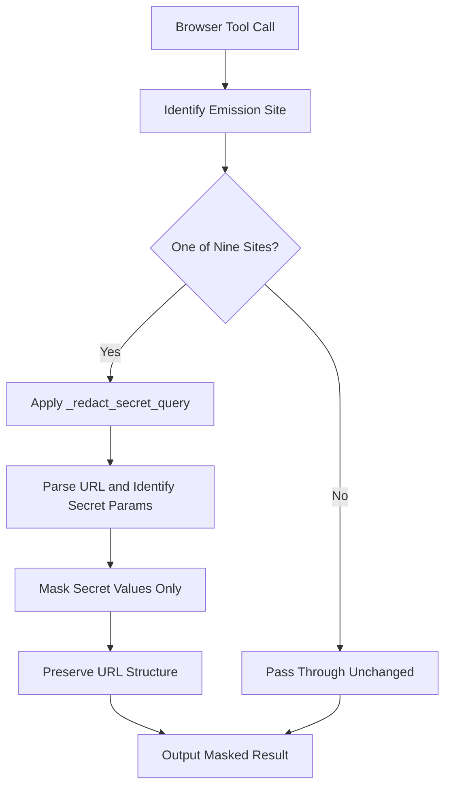

**Diagram sources**
- [browser_connector.py:196-262](file://products/tool-gateway/src/tool_gateway/tools/browser_connector.py#L196-L262)
- [test_browser_connector.py:701-714](file://products/tool-gateway/tests/test_browser_connector.py#L701-L714)

**Section sources**
- [browser_connector.py:196-262](file://products/tool-gateway/src/tool_gateway/tools/browser_connector.py#L196-L262)
- [test_browser_connector.py:701-714](file://products/tool-gateway/tests/test_browser_connector.py#L701-L714)
- [2026-09-11-post-live-test-credential-masking-and-hitl-hardening.md:77-90](file://docs/agentic-aiops-platform/release-notes/2026-09-11-post-live-test-credential-masking-and-hitl-hardening.md#L77-L90)

### Workload Identity Service Tokens
The workload identity system replaces static client secrets with Kubernetes projected service account tokens, providing short-lived, auditable credentials validated against the cluster OIDC issuer. The system prefers workload tokens over static credentials while maintaining backward compatibility for development environments.

Key aspects:
- Kubernetes projected service account tokens validated against cluster OIDC issuer JWKS.
- Workload subject mapping to registered service clients with audience allow-list semantics.
- Gateway prefers workload token file over static client secret with graceful fallback.
- Identical claims semantics between workload identity and static secret paths.
- Automatic token rotation via kubelet projected file updates.
- Comprehensive error handling for invalid, expired, or unregistered workload tokens.

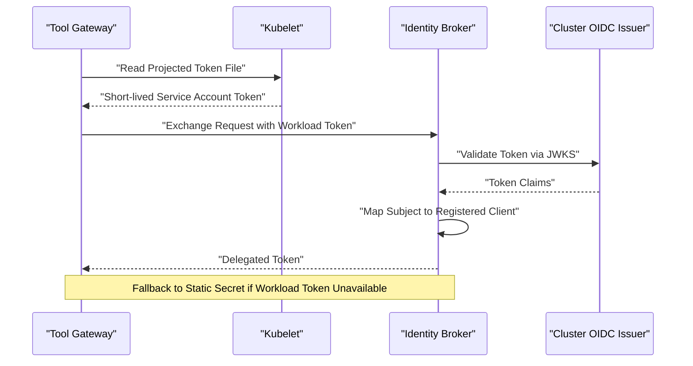

**Diagram sources**
- [delegation_client.py](file://products/tool-gateway/src/api_gateway/services/delegation_client.py)
- [exchange_service.py](file://products/identity-broker/src/identity_service/services/exchange_service.py)
- [config.py](file://products/identity-broker/src/identity_service/core/config.py)

**Section sources**
- [delegation_client.py](file://products/tool-gateway/src/api_gateway/services/delegation_client.py)
- [exchange_service.py](file://products/identity-broker/src/identity_service/services/exchange_service.py)
- [config.py](file://products/identity-broker/src/identity_service/core/config.py)
- [SPEC-009-pre-production-hardening/spec.md](file://docs/specs/SPEC-009-pre-production-hardening/spec.md)

### Agent Platform: Enhanced Session and Runtime Security with Least-Privilege
**Updated** The Agent Platform manages sessions and runtime dependencies for agent workloads with enhanced security controls including explicit tool permission allow-listing, flow-based approval enforcement with session-scoped authorities, per-action signed gates for unbound browser interactions, kernel-side authority clearing for staleness backstops, enhanced document repository with envelope-only listings, comprehensive secret masking for all tool outputs, evidence protection through reference-only credential entry, specialized evidence frame masking, multi-layered session title credential protection, and **comprehensive credential masking for chat prose**. **Enhanced**: v0.36.1 integrates session title protection into shared masking infrastructure and extends credential masking to all browser result emission sites.

Key aspects:
- Session creation and persistence with secure identifiers and audience validation.
- Provider-specific integrations with secure credential handling and least-privilege access.
- Telemetry and observability for security-relevant events with service identity tracking.
- Runtime policy enforcement with audience-scoped permissions and service identity validation.
- Explicit tool permission allow-listing preventing unauthorized tool execution.
- **Flow-based approval enforcement** ensuring exactly one HITL gate per mutating browser flow with session-scoped authorities.
- **Per-action signed gates** for unbound browser interactions replacing hard-denial policies with structured change-request cards.
- **Kernel-side authority clearing** preventing stale flow authority exploitation.
- **Enhanced document repository** with envelope-only listings and centralized fetch auditing.
- **Comprehensive secret masking** applied to all tool outputs and change-request projections using fail-closed masking postures.
- **Evidence protection mechanisms** through reference-only credential entry and structured parameter projection.
- **Specialized evidence frame masking** preserving structural integrity while removing secrets from tool-call evidence frames.
- **Multi-layered session title credential protection** preventing credential leakage through session titles displayed to approvers.
- **Comprehensive credential masking for chat prose** preventing password and sensitive information echo-back by AI models through four-layer protection.
- **Enhanced browser result redaction** covering all nine emission sites with consistent credential protection.
- Integration with AgentScope permission system for headless stream compatibility.

**Section sources**
- [runtime-config.env](file://shared/platform-ops/gitops/dev-k8s/base/agent-platform/runtime-config.env)
- [SPEC-005-observability-baseline/spec.md](file://docs/specs/SPEC-005-observability-baseline/spec.md)
- [SPEC-049-browser-web-check-tools/spec.md](file://docs/specs/SPEC-049-browser-web-check-tools/spec.md)
- [SPEC-051-browser-flow-hitl-gate-enforcement/spec.md](file://docs/specs/SPEC-051-browser-flow-hitl-gate-enforcement/spec.md)
- [SPEC-054-action-approval-and-change-request-card/spec.md](file://docs/specs/SPEC-054-action-approval-and-change-request-card/spec.md)
- [secret_params.py:275-316](file://products/agent-platform/src/agent_service/services/secret_params.py#L275-L316)
- [session_service.py:111-130](file://products/agent-platform/src/agent_service/services/session_service.py#L111-L130)
- [prose_redaction.py:197-218](file://products/agent-platform/src/agent_service/services/prose_redaction.py#L197-L218)

### Kubernetes RBAC and Policy Manifests: Enhanced Least-Privilege Access
RBAC and policy manifests enforce least-privilege access at the cluster level with enhanced service identity management. They define roles, bindings, and policy files consumed by the gateway and other services with audience-scoped permissions.

Key aspects:
- Namespace-scoped RBAC for tool-gateway and agent-platform with service identity support.
- Policy files referenced by the gateway for runtime enforcement with audience validation.
- Environment configuration injected via ConfigMaps and Secrets with least-privilege defaults.
- Service account management with audience-scoped permissions and delegated token support.

**Section sources**
- [rbac.yaml](file://shared/platform-ops/gitops/dev-k8s/base/tool-gateway/rbac.yaml)
- [policy-default.yaml](file://products/tool-gateway/src/api_gateway/policies/policy-default.yaml)
- [kustomization.yaml](file://shared/platform-ops/gitops/dev-k8s/base/kustomization.yaml)

## Dependency Analysis
Security-critical dependencies include:
- OIDC provider integration for identity federation with audience validation.
- JWT libraries for audience-bound token signing and verification.
- Policy engine for evaluating RBAC, custom rules, and service identity relationships.
- Kubernetes RBAC for cluster-level access control with service identity support.
- Delegation client for secure service-to-service token exchange with workload identity preference.
- Pattern matching libraries for deterministic credential detection and redaction.
- AgentScope permission system for tool permission management with explicit allow-listing.
- Audit service client for secure audit event emission with authentication.
- **Flow approval store** for session-scoped browser flow authorities with TTL-based expiration.
- **Per-action gate store** for unbound browser interaction approvals with structured change-request cards.
- **Document store with envelope-only listing capability** for secure document content access.
- **Authority provenance validation** for signed execution envelopes (ADR-0010).
- **Secret masking engine** for comprehensive parameter redaction and evidence protection.
- **Structured change-request projection system** for fail-closed secret masking across all tool outputs.
- **Evidence frame masking engine** for specialized third masking posture preserving structural integrity.
- **Session title protection system** for multi-layered credential leakage prevention.
- **Chat prose credential masking engine** for comprehensive four-layer protection against credential echo-back in conversations.
- **Enhanced browser result redaction system** for consistent protection across all nine emission sites.

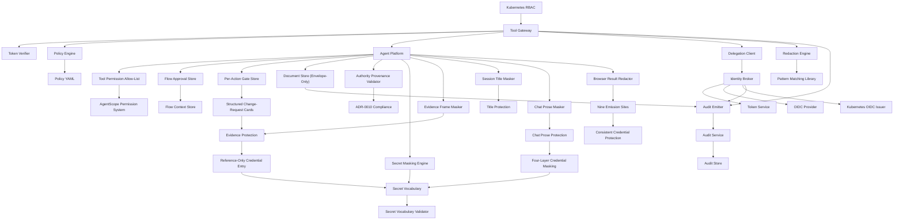

**Diagram sources**
- [token_verifier.py](file://products/tool-gateway/src/api_gateway/services/token_verifier.py)
- [policy_engine.py](file://products/tool-gateway/src/api_gateway/services/policy_engine.py)
- [delegation_client.py](file://products/tool-gateway/src/api_gateway/services/delegation_client.py)
- [redaction.py](file://products/tool-gateway/src/api_gateway/tools/redaction.py)
- [token_service.py](file://products/identity-broker/src/identity_service/services/token_service.py)
- [exchange_service.py](file://products/identity-broker/src/identity_service/services/exchange_service.py)
- [rbac.yaml](file://shared/platform-ops/gitops/dev-k8s/base/tool-gateway/rbac.yaml)
- [gateway_tools.py](file://products/agent-platform/src/agent_service/tools/gateway_tools.py)
- [flow_approvals.py](file://products/agent-platform/src/agent_service/services/flow_approvals.py)
- [execution_signing.py](file://products/agent-platform/src/agent_service/services/execution_signing.py)
- [secret_params.py](file://products/agent-platform/src/agent_service/services/secret_params.py)
- [session_service.py](file://products/agent-platform/src/agent_service/services/session_service.py)
- [prose_redaction.py](file://products/agent-platform/src/agent_service/services/prose_redaction.py)
- [browser_connector.py](file://products/tool-gateway/src/tool_gateway/tools/browser_connector.py)
- [audit_emitter.py](file://products/tool-gateway/src/tool_gateway/services/audit_emitter.py)
- [ingest_auth.py](file://products/audit-service/src/audit_service/services/ingest_auth.py)
- [routes.py](file://products/agent-platform/src/agent_service/api/v2/routes.py)

**Section sources**
- [SPEC-003-identity-trust-hardening/spec.md](file://docs/specs/SPEC-003-identity-trust-hardening/spec.md)
- [SPEC-004-policy-enforcement/spec.md](file://docs/specs/SPEC-004-policy-enforcement/spec.md)
- [SPEC-008-service-to-service-identity/spec.md](file://docs/specs/SPEC-008-service-to-service-identity/spec.md)
- [SPEC-009-pre-production-hardening/spec.md](file://docs/specs/SPEC-009-pre-production-hardening/spec.md)
- [SPEC-013-durable-audit-trail/spec.md](file://docs/specs/SPEC-013-durable-audit-trail/spec.md)
- [SPEC-049-browser-web-check-tools/spec.md](file://docs/specs/SPEC-049-browser-web-check-tools/spec.md)
- [SPEC-051-browser-flow-hitl-gate-enforcement/spec.md](file://docs/specs/SPEC-051-browser-flow-hitl-gate-enforcement/spec.md)
- [SPEC-054-action-approval-and-change-request-card/spec.md](file://docs/specs/SPEC-054-action-approval-and-change-request-card/spec.md)
- [0010-signed-execution-envelopes-declare-authority-provenance.md](file://docs/adr/0010-signed-execution-envelopes-declare-authority-provenance.md)

## Performance Considerations
- Token caching: Cache validated audience-bound tokens and claims to reduce broker calls while maintaining security.
- Policy evaluation optimization: Preload and cache policy rules; use efficient matching algorithms with service identity awareness.
- Connection pooling: Maintain pooled connections to downstream services and Redis for sessions with proper identity propagation.
- Rate limiting: Implement rate limits at the gateway to mitigate abuse and DoS attacks.
- Asynchronous processing: Offload heavy operations like policy evaluation and token delegation to background workers where feasible.
- Audience validation caching: Cache audience validation results to improve performance without compromising security.
- Redaction performance: Efficient pattern matching with early termination and bounded processing to prevent performance degradation.
- Workload token caching: Cache workload token validation results to reduce cluster OIDC issuer calls.
- Tool permission checking: Minimal overhead for allow-list lookups using frozenset for O(1) membership testing.
- Audit emission: Fire-and-forget audit delivery with non-blocking threads and timeout protection to prevent request path degradation.
- **Flow authority checking**: Minimal overhead for session-scoped flow authority lookups using in-memory dictionaries.
- **Per-action gate checking**: Minimal overhead for unbound interaction approval lookups with structured change-request card generation.
- **Authority provenance validation**: Lightweight HMAC verification for approval_kind field with minimal performance impact.
- **Document listing performance**: Envelope-only listings reduce payload size and improve response times while maintaining security.
- **Cross-owner read auditing**: Audit event emission is optimized to minimize impact on document fetch performance.
- **Kernel-side authority clearing**: Efficient store clearing operations triggered by flow-killing errors with minimal overhead.
- **Secret masking performance**: Fail-closed masking uses efficient allow-list lookups and structured projection building with minimal overhead.
- **Evidence frame masking performance**: Specialized third masking posture preserves structural integrity while removing secrets with minimal overhead.
- **Session title protection performance**: Multi-layered protection runs efficiently on session creation with minimal performance impact.
- **Chat prose masking performance**: Four-layer protection system uses efficient regex patterns and streaming processing with minimal latency impact.
- **Enhanced browser result redaction performance**: All nine emission sites use centralized `_evidence_url` helper for consistent, efficient credential masking.
- **Evidence protection overhead**: Reference-only credential entry and structured parameter projection add negligible performance impact.
- **Streaming prose redactor performance**: Incremental credential masking with intelligent buffering handles partial credentials without significant latency.

## Troubleshooting Guide
Common issues and resolutions:
- Invalid or expired audience-bound tokens: Verify issuer configuration, signing keys, token lifetimes, and audience restrictions.
- Policy denials with service identity: Inspect policy rules and claims; ensure RBAC bindings match expected roles and service identities.
- OIDC connectivity failures: Check network policies, DNS resolution, and provider health endpoints.
- Audit log gaps: Confirm logging configuration and output destinations for security events including service-to-service communications.
- Token delegation failures: Verify delegation chain validity and service identity permissions.
- Redaction overflow errors: Investigate tool outputs for excessive credential content; adjust parameters to reduce sensitive data exposure.
- Workload token authentication failures: Verify Kubernetes projected token configuration, cluster OIDC issuer settings, and workload subject mappings.
- **Tool permission blocking**: Check AGENT_GATEWAY_TOOL_AUTO_ALLOW environment variable configuration and verify tool names in the allow-list.
- **Headless stream stalls**: Ensure tools are properly configured as read-only and included in the vetted allow-list for automatic approval.
- **Audit service connection failures**: Verify AUDIT_SERVICE_URL configuration and audit client credentials in emitter services.
- **Audit query access denied**: Confirm user has auditor or platform-admin role and audit:read policy action is granted.
- **Document content exposure**: Verify that document listings return envelope-only data and full content is only accessible through single-document fetch endpoints.
- **Missing cross-owner read audits**: Check that document fetch endpoints properly emit `document_read` audit events for cross-owner access.
- **Flow approval issues**: Verify browser flow approval TTL configuration and check that flow authorities are properly scoped to session and flow identity.
- **Cross-flow privilege escalation**: Ensure flow context rebinding is detected and writes re-park when flow identity changes.
- **Flow authority expiration**: Check AGENT_BROWSER_FLOW_APPROVAL_TTL setting and verify approval timestamps for TTL-based expiration.
- **BROWSER_FLOW_AUTHORITY_STALE errors**: Indicates stale flow authority exploitation attempt; verify flow binding state and authority provenance validation.
- **Per-action gate approval delays**: Check change-request card rendering and operator approval workflow for unbound browser interactions.
- **Kernel-side authority clearing failures**: Monitor flow-killing error handling and verify FLOW_CONTEXTS/FLOW_APPROVALS store cleanup.
- **Secret masking issues**: Verify KNOWN_SAFE_FIELDS allow-list configuration and check that fail-closed masking is properly applied to all tool outputs and change-request projections.
- **Evidence protection failures**: Ensure reference-only credential entry is enforced and literal secrets are not appearing in tool arguments or change-request cards.
- **Evidence frame masking problems**: Verify that specialized third masking posture is properly applied to tool-call evidence frames while preserving structural integrity.
- **Session title credential leakage**: Check that multi-layered session title protection is properly applied to prevent credential leakage through session titles displayed to approvers.
- **Chat prose credential masking issues**: Verify that four-layer protection system is properly applied to both user and assistant messages, and check that streaming redactor handles partial credentials correctly.
- **Structured change-request card rendering problems**: Check that change-request projections are properly built with summary and masked fields, and verify portal rendering of structured projections.
- **Enhanced browser result redaction issues**: Verify that all nine emission sites consistently mask secret-bearing URLs and check that `_evidence_url` helper is properly applied.
- **Streaming prose redactor problems**: Ensure proper flushing of held-back tails and verify paragraph break handling in live streams.

Recommended diagnostics:
- Enable verbose logging for auth and policy decisions with service identity context.
- Use introspection endpoints to validate audience-bound token contents and delegation chains.
- Review Kubernetes RBAC bindings and policy YAML for correctness with service identity support.
- Monitor audience validation logs for security anomalies.
- Track redaction metrics and overflow events for credential leakage prevention.
- Validate workload token configuration and cluster OIDC issuer connectivity.
- **Inspect tool permission logs** to identify blocked tools and their permission decisions.
- **Monitor audit service health and ingestion metrics** to ensure audit trail completeness.
- **Verify document listing responses** to ensure they contain only envelope data without sensitive content.
- **Audit document fetch events** to confirm cross-owner access is properly recorded.
- **Monitor flow approval stores** to verify session-scoped authorities are properly created and expired.
- **Check flow context rebinding** to ensure cross-flow privilege escalation is prevented.
- **Monitor per-action gate stores** to verify unbound interaction approvals are properly managed.
- **Validate authority provenance enforcement** to ensure BROWSER_FLOW_AUTHORITY_STALE errors are properly handled.
- **Review kernel-side authority clearing** to verify flow-killing errors trigger proper store cleanup.
- **Monitor secret masking effectiveness** to ensure fail-closed masking is properly applied across all tool outputs and change-request projections.
- **Verify evidence protection mechanisms** to ensure reference-only credential entry is enforced and literal secrets are excluded from tool arguments.
- **Test evidence frame masking** to ensure specialized third masking posture preserves structural integrity while removing secrets.
- **Validate session title protection** to ensure multi-layered credential leakage prevention is working correctly.
- **Test chat prose credential masking** to ensure four-layer protection system effectively masks credentials in both user and assistant messages.
- **Test structured change-request card rendering** to ensure operators receive adequate visibility into pending operations with proper secret masking.
- **Verify enhanced browser result redaction** to ensure all nine emission sites consistently mask secret-bearing URLs.
- **Test streaming prose redactor** to ensure proper handling of partial credentials and paragraph breaks in live streams.

**Section sources**
- [SPEC-005-observability-baseline/spec.md](file://docs/specs/SPEC-005-observability-baseline/spec.md)
- [rbac.yaml](file://shared/platform-ops/gitops/dev-k8s/base/tool-gateway/rbac.yaml)
- [policy-default.yaml](file://products/tool-gateway/src/api_gateway/policies/policy-default.yaml)
- [SPEC-009-pre-production-hardening/spec.md](file://docs/specs/SPEC-009-pre-production-hardening/spec.md)
- [SPEC-013-durable-audit-trail/spec.md](file://docs/specs/SPEC-013-durable-audit-trail/spec.md)
- [SPEC-049-browser-web-check-tools/spec.md](file://docs/specs/SPEC-049-browser-web-check-tools/spec.md)
- [SPEC-051-browser-flow-hitl-gate-enforcement/spec.md](file://docs/specs/SPEC-051-browser-flow-hitl-gate-enforcement/spec.md)
- [SPEC-054-action-approval-and-change-request-card/spec.md](file://docs/specs/SPEC-054-action-approval-and-change-request-card/spec.md)
- [0010-signed-execution-envelopes-declare-authority-provenance.md](file://docs/adr/0010-signed-execution-envelopes-declare-authority-provenance.md)

## Conclusion
The Luban AIOps Platform implements an enhanced robust security architecture centered on OIDC-based authentication, audience-bound JWT token security, policy-driven authorization with service identity awareness, explicit tool permission allow-listing, flow-based approval enforcement with session-scoped authorities, per-action signed gates for unbound browser interactions, kernel-side authority clearing and signed authority provenance (ADR-0010) as staleness backstops, deterministic tool output redaction, workload identity service tokens, comprehensive secret masking across all tool outputs, evidence protection mechanisms, and a comprehensive audit trail system with secure service-to-service authentication. By enforcing least-privilege access through RBAC, audience-scoped permissions, declarative policies, and explicit tool permission controls, integrating comprehensive observability and audit logging for service-to-service communications, implementing fail-closed credential protection, and providing durable audit trails with role-based access control, the platform provides strong protection against common threats. The addition of delegated token flows, service-to-service identity patterns, explicit tool permission allow-listing, deterministic redaction, workload identity tokens, secure audit trail capabilities, flow-based approval enforcement with single HITL gates per browser flow, per-action signed gates replacing hard-denial policies for unbound interactions, kernel-side authority clearing preventing stale flow authority exploitation, signed authority provenance via ADR-0010, comprehensive secret masking for all tool outputs and change-request cards, evidence protection through reference-only credential entry, specialized evidence frame masking preserving structural integrity, multi-layered session title credential protection, **comprehensive credential masking for chat prose preventing password and sensitive information echo-back by AI models**, and **enhanced document read audit integrity with envelope-only listings** further strengthens the security posture while maintaining operational efficiency. **Enhanced**: v0.36.1 extends credential masking to all nine browser result emission sites, implements streaming prose redaction for live assistant streams, and integrates session title protection into shared masking infrastructure, providing comprehensive protection across all user-facing surfaces. Continuous security scanning, penetration testing, and adherence to compliance standards further enhance the platform's security framework.

## Appendices

### Compliance Requirements
- Align with industry standards for identity management and access control with audience-scoped permissions.
- Ensure audit logs capture authentication, authorization, service-to-service communications, administrative actions, redaction events, flow approval decisions, and per-action approval decisions.
- Maintain encryption for data in transit and at rest where applicable with proper key management.
- Regularly review and update policies to reflect organizational changes and least-privilege principles.
- Implement comprehensive service identity management with audience validation and delegation controls.
- Validate workload identity configurations and cluster OIDC issuer settings regularly.
- Monitor redaction metrics and overflow events for compliance with credential protection policies.
- **Review and approve tool permission allow-list changes** through formal change management processes.
- **Ensure audit trail retention meets regulatory requirements** with configurable retention policies.
- **Implement audit query access controls** to restrict sensitive audit data to authorized personnel only.
- **Verify document read audit integrity** to ensure cross-owner access to sensitive content is properly recorded and documented.
- **Monitor flow approval authorities** to ensure session-scoped authorities expire appropriately and prevent privilege escalation.
- **Validate flow identity scoping** to prevent cross-flow privilege escalation through flow context rebinding.
- **Monitor per-action approval workflows** to ensure change-request cards provide adequate transparency for unbound browser interactions.
- **Validate authority provenance enforcement** to ensure BROWSER_FLOW_AUTHORITY_STALE errors prevent stale flow authority exploitation.
- **Review kernel-side authority clearing** to ensure flow-killing errors properly clean up stale authorities.
- **Verify comprehensive secret masking** is properly applied across all tool outputs and change-request projections using fail-closed masking postures.
- **Validate evidence protection mechanisms** to ensure reference-only credential entry prevents literal secrets from appearing in tool arguments and audit trails.
- **Test evidence frame masking** to ensure specialized third masking posture preserves structural integrity while removing secrets from tool-call evidence frames.
- **Validate session title protection** to ensure multi-layered credential leakage prevention is effective across all display surfaces.
- **Test comprehensive chat prose credential masking** to ensure four-layer protection system effectively prevents password and sensitive information echo-back by AI models.
- **Monitor structured change-request card rendering** to ensure operators receive adequate visibility into pending operations with proper secret masking.
- **Verify enhanced browser result redaction** to ensure all nine emission sites consistently mask secret-bearing URLs.
- **Test streaming prose redactor** to ensure proper handling of partial credentials and paragraph breaks in live streams.

**Section sources**
- [SECURITY.md](file://SECURITY.md)
- [SPEC-005-observability-baseline/spec.md](file://docs/specs/SPEC-005-observability-baseline/spec.md)
- [SPEC-009-pre-production-hardening/spec.md](file://docs/specs/SPEC-009-pre-production-hardening/spec.md)
- [SPEC-013-durable-audit-trail/spec.md](file://docs/specs/SPEC-013-durable-audit-trail/spec.md)
- [SPEC-049-browser-web-check-tools/spec.md](file://docs/specs/SPEC-049-browser-web-check-tools/spec.md)
- [SPEC-051-browser-flow-hitl-gate-enforcement/spec.md](file://docs/specs/SPEC-051-browser-flow-hitl-gate-enforcement/spec.md)
- [SPEC-054-action-approval-and-change-request-card/spec.md](file://docs/specs/SPEC-054-action-approval-and-change-request-card/spec.md)
- [0010-signed-execution-envelopes-declare-authority-provenance.md](file://docs/adr/0010-signed-execution-envelopes-declare-authority-provenance.md)

### Vulnerability Assessment and Penetration Testing
- Conduct regular automated scans for dependencies and container images with security-focused analysis.
- Perform manual penetration tests focusing on authentication, authorization, audience validation, API endpoints, and redaction effectiveness.
- Test service-to-service identity flows and delegated token mechanisms for security vulnerabilities.
- Validate workload identity token validation and cluster OIDC issuer integration.
- Assess redaction pattern coverage and overflow protection mechanisms.
- **Test tool permission allow-list effectiveness** to ensure unauthorized tools cannot bypass permission controls.
- **Verify CWE-862 remediation** by attempting to execute non-vetted tools without proper authorization.
- **Test audit service authentication** to ensure unauthorized services cannot ingest or query audit events.
- **Validate audit trail integrity** by attempting to modify or delete stored audit records.
- **Test document read audit integrity** by verifying that cross-owner access to sensitive content is properly recorded through centralized fetch endpoints.
- **Verify envelope-only listings** to ensure document content cannot be accessed through list endpoints.
- **Test flow-based approval enforcement** by attempting to escalate privileges across different browser flows.
- **Validate flow authority expiration** by testing TTL-based expiration and disabled flow-unlock scenarios.
- **Test cross-flow privilege escalation** by attempting to reuse flow authorities after flow context rebinding.
- **Test per-action approval enforcement** by attempting to execute unbound browser interactions without proper change-request approval.
- **Validate authority provenance enforcement** by attempting to forge approval_kind fields in execution envelopes.
- **Test kernel-side authority clearing** by simulating flow-killing errors and verifying proper cleanup of FLOW_CONTEXTS and FLOW_APPROVALS stores.
- **Test BROWSER_FLOW_AUTHORITY_STALE handling** by attempting to exploit stale flow authorities.
- **Verify comprehensive secret masking** by attempting to extract secrets from tool outputs and change-request cards through various attack vectors.
- **Test evidence protection mechanisms** by attempting to inject literal secrets into tool arguments and verify they are properly excluded from change-request cards and audit trails.
- **Test evidence frame masking** by attempting to extract secrets from tool-call evidence frames while verifying structural integrity preservation.
- **Test session title protection** by attempting to inject credentials into session titles and verify multi-layered protection is effective.
- **Test comprehensive chat prose credential masking** by attempting to inject credentials into chat conversations and verify four-layer protection system prevents echo-back by AI models.
- **Validate structured change-request card rendering** by testing operator visibility into pending operations with proper secret masking.
- **Test fail-closed masking posture** by attempting to project off-vocabulary secrets as plaintext in change-request cards.
- **Test enhanced browser result redaction** by attempting to extract secrets from all nine emission sites and verify consistent protection.
- **Test streaming prose redactor** by attempting to split credentials across message chunks and verify proper handling of partial credentials.
- Document findings and remediation steps; track vulnerabilities to closure with security impact assessment.
- Integrate security checks into CI/CD pipelines for continuous assurance with audience-bound token validation and redaction testing.

**Section sources**
- [SECURITY.md](file://SECURITY.md)
- [README.md](file://README.md)
- [SPEC-009-pre-production-hardening/spec.md](file://docs/specs/SPEC-009-pre-production-hardening/spec.md)
- [SPEC-013-durable-audit-trail/spec.md](file://docs/specs/SPEC-013-durable-audit-trail/spec.md)
- [SPEC-049-browser-web-check-tools/spec.md](file://docs/specs/SPEC-049-browser-web-check-tools/spec.md)
- [SPEC-051-browser-flow-hitl-gate-enforcement/spec.md](file://docs/specs/SPEC-051-browser-flow-hitl-gate-enforcement/spec.md)
- [SPEC-054-action-approval-and-change-request-card/spec.md](file://docs/specs/SPEC-054-action-approval-and-change-request-card/spec.md)
- [0010-signed-execution-envelopes-declare-authority-provenance.md](file://docs/adr/0010-signed-execution-envelopes-declare-authority-provenance.md)

### Secure Development Practices
- Enforce least privilege in code and configuration with audience-scoped permissions and service identity awareness.
- Use secret managers and avoid hardcoding credentials with proper audience validation.
- Apply input validation and output encoding consistently with service identity sanitization.
- Review security-related changes via dedicated security reviews with focus on audience binding, delegation flows, and redaction patterns.
- Implement comprehensive audit logging for all security-sensitive operations and service-to-service communications.
- Validate workload identity configurations and test both workload token and static secret fallback paths.
- Ensure redaction patterns remain effective against evolving credential formats and attack vectors.
- **Follow formal approval process for tool permission allow-list changes** to prevent unauthorized tool execution.
- **Implement security testing for tool permission controls** in CI/CD pipelines to catch permission bypass attempts.
- **Test audit service authentication** to ensure only authorized services can emit or query audit events.
- **Validate audit trail immutability** to ensure stored audit records cannot be tampered with.
- **Ensure document repository security** by implementing envelope-only listings and centralized fetch auditing.
- **Test cross-owner read auditing** to verify that sensitive document access is properly recorded.
- **Implement flow-based approval security testing** to validate single HITL gate enforcement and flow authority scoping.
- **Test flow context rebinding** to ensure cross-flow privilege escalation is prevented.
- **Validate flow authority TTL expiration** to ensure time-bounded authorities expire correctly.
- **Test per-action approval workflows** to ensure change-request cards provide adequate operator transparency.
- **Validate authority provenance enforcement** to ensure approval_kind fields cannot be forged or manipulated.
- **Test kernel-side authority clearing** to ensure flow-killing errors properly trigger store cleanup operations.
- **Implement comprehensive testing for BROWSER_FLOW_AUTHORITY_STALE handling** to prevent stale flow authority exploitation.
- **Test comprehensive secret masking** to ensure fail-closed masking is properly applied across all tool outputs and change-request projections.
- **Validate evidence protection mechanisms** to ensure reference-only credential entry prevents literal secrets from appearing in tool arguments and audit trails.
- **Test evidence frame masking** to ensure specialized third masking posture preserves structural integrity while removing secrets.
- **Validate session title protection** to ensure multi-layered credential leakage prevention is effective across all display surfaces.
- **Test comprehensive chat prose credential masking** to ensure four-layer protection system effectively prevents credential echo-back in conversations.
- **Test structured change-request card rendering** to ensure operators receive adequate visibility into pending operations with proper secret masking.
- **Implement security testing for fail-closed masking posture** to ensure off-vocabulary secrets cannot project as plaintext in change-request cards.
- **Test enhanced browser result redaction** to ensure all nine emission sites consistently mask secret-bearing URLs.
- **Test streaming prose redactor** to ensure proper handling of partial credentials and paragraph breaks in live streams.

**Section sources**
- [SPEC-003-identity-trust-hardening/spec.md](file://docs/specs/SPEC-003-identity-trust-hardening/spec.md)
- [SPEC-004-policy-enforcement/spec.md](file://docs/specs/SPEC-004-policy-enforcement/spec.md)
- [SPEC-008-service-to-service-identity/spec.md](file://docs/specs/SPEC-008-service-to-service-identity/spec.md)
- [SPEC-009-pre-production-hardening/spec.md](file://docs/specs/SPEC-009-pre-production-hardening/spec.md)
- [SPEC-013-durable-audit-trail/spec.md](file://docs/specs/SPEC-013-durable-audit-trail/spec.md)
- [SPEC-049-browser-web-check-tools/spec.md](file://docs/specs/SPEC-049-browser-web-check-tools/spec.md)
- [SPEC-051-browser-flow-hitl-gate-enforcement/spec.md](file://docs/specs/SPEC-051-browser-flow-hitl-gate-enforcement/spec.md)
- [SPEC-054-action-approval-and-change-request-card/spec.md](file://docs/specs/SPEC-054-action-approval-and-change-request-card/spec.md)
- [0010-signed-execution-envelopes-declare-authority-provenance.md](file://docs/adr/0010-signed-execution-envelopes-declare-authority-provenance.md)

### Threat Modeling Updates
**Updated** The security hardening features address several critical attack vectors, with particular emphasis on tool permission vulnerabilities, flow-based approval enforcement, per-action signed gates for unbound interactions, kernel-side authority clearing, signed authority provenance, audit trail integrity, document content exposure prevention, comprehensive secret masking, evidence protection mechanisms, specialized evidence frame masking, multi-layered session title credential protection, and **comprehensive credential masking for chat prose**. **Enhanced**: v0.36.1 extends credential masking to all nine browser result emission sites and integrates session title protection into shared masking infrastructure.

**Credential Leakage Prevention:**
- Deterministic redaction prevents service-account JWTs, bearer tokens, and basic credentials from reaching external model providers.
- Fail-closed overflow protection ensures pathological outputs don't compromise security.
- Code-owned pattern sets eliminate operator-editable regex vulnerabilities.
- **Comprehensive secret masking** prevents secrets from appearing in tool outputs, change-request cards, and audit trails through fail-closed masking postures.
- **Specialized evidence frame masking** preserves structural integrity while removing secrets from tool-call evidence frames, addressing the unique requirements of evidence display versus change-request projections.
- **Multi-layered session title protection** prevents credential leakage through session titles displayed to approvers, addressing the unique challenge of protecting credentials in UI labels that appear before tool-side redaction.
- **Comprehensive chat prose credential masking** prevents password and sensitive information echo-back by AI models through four-layer protection system, addressing the critical gap where operators type credentials into chat conversations that could be echoed back verbatim by AI models.
- **Enhanced browser result redaction** ensures consistent credential protection across all nine browser interaction emission sites, preventing secret leakage through snapshots, screenshots, clicks, and other browser operations.

**Service Identity Hardening:**
- Workload identity tokens replace extractable static client secrets with short-lived, auditable credentials.
- Kubernetes projected tokens provide automatic rotation and cluster-scoped validation.
- Graceful fallback maintains backward compatibility while encouraging adoption of more secure methods.

**Tool Permission Security (CWE-862 Remediation):**
- **Explicit allow-list approach eliminates blanket read-only tool approval** that could lead to unauthorized tool execution.
- **Environment-controlled allow-list** enables deployment-specific security tuning while maintaining centralized control.
- **Fail-safe defaults** ensure that unknown tools require explicit confirmation rather than automatic approval.
- **Integration with existing policy framework** ensures tool permissions complement broader authorization controls.

**Enhanced Browser Interaction Security:**
- **Per-action signed gates replace hard-denial policies** for unbound browser interactions, providing flexibility while maintaining security through structured change-request cards with secret masking.
- **Kernel-side authority clearing** prevents stale flow authorities from outliving their bindings, eliminating a critical attack vector.
- **Signed authority provenance (ADR-0010)** provides tamper-proof discrimination between action and flow authorities, preventing exploitation of stale flow contexts.
- **BROWSER_FLOW_AUTHORITY_STALE enforcement** refuses flow-provenance envelopes when no flow is bound, closing the implicit backstop gap.
- **Structured change-request cards** provide operators with transparent, secret-masked views of what will be executed during per-action approvals.
- **Enhanced browser result protection** ensures all nine emission sites consistently mask secret-bearing URLs, preventing credential leakage through browser interaction results.

**Flow-Based Approval Security:**
- **Single HITL gate per browser flow eliminates repeated approval fatigue** while maintaining security through session-scoped authorities.
- **Flow identity scoping (skill_id + origin) prevents cross-flow privilege escalation** through flow context rebinding.
- **Time-bounded authorities with configurable TTL** ensure approvals don't persist indefinitely.
- **Auto-signed executions maintain individual execution signing** preserving audit trail integrity for each unlocked write.
- **Gateway deviation guards remain enforcement boundary** ensuring origin allowlist, risk class, and step budget bounds apply to all unlocked writes.

**Document Content Exposure Prevention:**
- **Envelope-only listings prevent unauthorized content access** through document listing endpoints.
- **Centralized single-document fetch ensures audited access** to sensitive document content.
- **Cross-owner read auditing provides comprehensive audit trails** for document access patterns.
- **Foreign draft protection prevents enumeration attacks** by treating foreign drafts as unknown documents.

**Evidence Protection and Secret Masking:**
- **Reference-only credential entry** prevents literal secrets from appearing in tool arguments, change-request cards, and audit trails.
- **Fail-closed masking posture** ensures off-vocabulary secrets cannot project as plaintext in change-request cards.
- **Structured change-request projections** provide decision-relevant information while masking sensitive values.
- **Per-tool opaque value rules** cover secrets in generically-named fields that name-based masking cannot catch.
- **Kernel-side parameter redaction** protects raw parameters that ride alongside change-request projections.
- **Specialized evidence frame masking** preserves structural integrity while removing secrets from tool-call evidence frames, addressing the unique requirement that evidence must show what was actually invoked.
- **Multi-layered session title protection** provides four layers of defense against credential leakage in session titles, including shape-based patterns, key-value matching, URL query redaction, and heuristic credential detection.
- **Comprehensive chat prose credential masking** provides four-layer protection against credential echo-back in conversations, including pinned secret shapes, URL query redaction, key=value detection, and heuristic credential detection.
- **Enhanced browser result redaction** ensures consistent credential protection across all nine emission sites, preventing secret leakage through browser interaction results.

**Audit Trail Security:**
- **Dual authentication paths** provide flexibility while maintaining security through static credentials or workload identity.
- **Role-based query access** ensures only authorized users can view audit trails through platform gateway policy enforcement.
- **Immutable storage design** prevents modification or deletion of audit records once stored.
- **Service attribution** ensures all audit events are traceable to their originating service.
- **Flow approval audit trails** provide complete visibility into browser flow approvals, per-action approvals, and auto-signed executions.

**Attack Surface Reduction:**
- Single choke point for redaction eliminates bypass opportunities.
- Audience validation prevents token misuse across services.
- Workload subject registration ensures only authorized service accounts can obtain delegated tokens.
- **Explicit tool permission controls prevent unauthorized tool execution** even for read-only operations.
- **Flow-based approval enforcement prevents privilege escalation** across different browser flows.
- **Per-action approval enforcement provides secure alternative to hard-denial** for unbound browser interactions.
- **Kernel-side authority clearing prevents stale authority exploitation** through race conditions.
- **Signed authority provenance prevents forgery of approval_kind fields** through HMAC protection.
- **Audit service authentication prevents unauthorized audit event ingestion** from untrusted services.
- **Document repository security prevents content exposure** through unauthorized listing endpoints.
- **Comprehensive secret masking prevents credential leakage** through tool outputs and change-request cards.
- **Evidence protection mechanisms prevent literal secrets** from appearing in tool arguments and audit trails.
- **Specialized evidence frame masking prevents credential leakage** while preserving evidence structural integrity.
- **Multi-layered session title protection prevents credential leakage** through UI labels displayed to approvers.
- **Comprehensive chat prose credential masking prevents credential echo-back** through AI model responses in conversations.
- **Enhanced browser result redaction prevents credential leakage** through browser interaction results across all nine emission sites.

**Section sources**
- [SPEC-009-pre-production-hardening/spec.md](file://docs/specs/SPEC-009-pre-production-hardening/spec.md)
- [SPEC-009-pre-production-hardening/plan.md](file://docs/specs/SPEC-009-pre-production-hardening/plan.md)
- [SPEC-013-durable-audit-trail/spec.md](file://docs/specs/SPEC-013-durable-audit-trail/spec.md)
- [SPEC-049-browser-web-check-tools/spec.md](file://docs/specs/SPEC-049-browser-web-check-tools/spec.md)
- [SPEC-051-browser-flow-hitl-gate-enforcement/spec.md](file://docs/specs/SPEC-051-browser-flow-hitl-gate-enforcement/spec.md)
- [SPEC-054-action-approval-and-change-request-card/spec.md](file://docs/specs/SPEC-054-action-approval-and-change-request-card/spec.md)
- [0010-signed-execution-envelopes-declare-authority-provenance.md](file://docs/adr/0010-signed-execution-envelopes-declare-authority-provenance.md)
- [SECURITY.md](file://SECURITY.md)
- [0007-browser-flow-single-hitl-gate.md](file://docs/adr/0007-browser-flow-single-hitl-gate.md)
- [flow_approvals.py:56-75](file://products/agent-platform/src/agent_service/services/flow_approvals.py#L56-L75)
- [execution_signing.py:90-149](file://products/agent-platform/src/agent_service/services/execution_signing.py#L90-L149)
- [secret_params.py:172-183](file://products/agent-platform/src/agent_service/services/secret_params.py#L172-L183)
- [secret_params.py:275-316](file://products/agent-platform/src/agent_service/services/secret_params.py#L275-L316)
- [session_service.py:111-130](file://products/agent-platform/src/agent_service/services/session_service.py#L111-L130)
- [prose_redaction.py:197-218](file://products/agent-platform/src/agent_service/services/prose_redaction.py#L197-L218)
- [browser_connector.py:196-262](file://products/tool-gateway/src/tool_gateway/tools/browser_connector.py#L196-L262)
- [runtime_kernel.py:1417-1449](file://products/agent-platform/src/agent_service/runtime_kernel.py#L1417-L1449)
- [routes.py:858-915](file://products/agent-platform/src/agent_service/api/v2/routes.py#L858-L915)
- [2026-09-11-post-live-test-credential-masking-and-hitl-hardening.md:77-90](file://docs/agentic-aiops-platform/release-notes/2026-09-11-post-live-test-credential-masking-and-hitl-hardening.md#L77-L90)

### Security Configuration Reference
**Updated** The following environment variables control critical security behaviors:

**Tool Permission Controls:**
- `AGENT_GATEWAY_TOOL_AUTO_ALLOW`: Comma-separated list of vetted tools that bypass interactive permission confirmation. Default includes safe read-only tools. Empty string approves nothing.

**Flow-Based Approval Controls:**
- `AGENT_BROWSER_FLOW_APPROVAL_TTL`: Time-to-live for flow-based approval authorities in seconds (default 900). Setting to 0 disables flow-unlock entirely, restoring per-action gating.
- Flow authorities are automatically scoped to session ID and approved flow identity (skill_id + origin) to prevent cross-flow privilege escalation.

**Per-Action Approval Controls:**
- **Unbound browser interactions** now park per-action signed gates instead of being hard-denied, with structured change-request cards providing operator transparency and secret masking.
- **Structured change-request cards** display secret-masked information about what will be executed, improving operator understanding and security posture.

**Identity and Authentication:**
- Standard OIDC configuration variables for issuer URLs, signing keys, and token lifetimes.
- Workload identity configuration for Kubernetes service account token validation.

**Operational Security:**
- Redaction configuration for credential detection patterns.
- Audit logging configuration for security event tracking.
- Rate limiting and timeout configurations for denial-of-service protection.

**Audit Service Configuration:**
- `AUDIT_STORE_BACKEND`: Storage backend selection (memory/postgres).
- `AUDIT_DB_URL`: PostgreSQL connection string for persistent audit storage.
- `AUDIT_INGEST_CLIENTS`: Registry of allowed service clients with static credentials.
- `AUDIT_WORKLOAD_ISSUER_URL`: Kubernetes OIDC issuer URL for workload token validation.
- `AUDIT_WORKLOAD_AUDIENCE`: Expected audience for workload tokens.
- `AUDIT_WORKLOAD_CLIENTS`: Mapping of workload subjects to client IDs.
- `AUDIT_RETENTION_DAYS`: Number of days to retain audit events.
- `AUDIT_MAX_EVENTS`: Maximum number of events to store before eviction.

**Emitter Configuration:**
- `<PREFIX>_AUDIT_SERVICE_URL`: URL of the audit service for each emitting service.
- `<PREFIX>_AUDIT_CLIENT_ID`: Client ID for audit service authentication.
- `<PREFIX>_AUDIT_CLIENT_SECRET`: Client secret for audit service authentication.

**Document Repository Configuration:**
- **Envelope-only listings are enforced by default** to prevent content exposure through listing endpoints.
- **Cross-owner read auditing is automatically enabled** for all document fetch operations.
- **Foreign draft protection prevents enumeration attacks** by returning 404 for unauthorized draft access.

**Authority Provenance Configuration:**
- **ADR-0010 compliance** ensures all execution envelopes carry signed approval_kind fields.
- **BROWSER_FLOW_AUTHORITY_STALE enforcement** prevents exploitation of stale flow authorities.
- **Kernel-side authority clearing** ensures FLOW_CONTEXTS and FLOW_APPROVALS stores are properly cleaned up on flow-killing errors.

**Secret Masking and Evidence Protection Configuration:**
- **Fail-closed masking posture** ensures all parameter values mask unless positively identified as safe through the KNOWN_SAFE_FIELDS allow-list.
- **Reference-only credential entry** enforced through web.fill_credential tool to prevent literal secrets in tool arguments.
- **Structured change-request projections** provide decision-relevant information while masking sensitive values.
- **Per-tool opaque value rules** cover secrets in generically-named fields that name-based masking cannot catch.
- **Kernel-side parameter redaction** protects raw parameters that ride alongside change-request projections.
- **Specialized evidence frame masking** preserves structural integrity while removing secrets from tool-call evidence frames.
- **Multi-layered session title protection** provides four layers of defense against credential leakage in session titles.
- **Comprehensive chat prose credential masking** implements four-layer protection system with pinned secret shapes, URL query redaction, key=value detection, and heuristic credential detection.
- **Enhanced browser result redaction** ensures all nine emission sites consistently mask secret-bearing URLs through centralized `_evidence_url` helper.

**Section sources**
- [gateway_tools.py:46-61](file://products/agent-platform/src/agent_service/tools/gateway_tools.py#L46-L61)
- [runtime-config.env](file://shared/platform-ops/gitops/dev-k8s/base/agent-platform/runtime-config.env)
- [runtime-config.env](file://shared/platform-ops/gitops/dev-k8s/base/identity-broker/runtime-config.env)
- [runtime-config.env](file://shared/platform-ops/gitops/dev-k8s/base/tool-gateway/runtime-config.env)
- [config.py](file://products/audit-service/src/audit_service/core/config.py)
- [runtime-secrets.example.env](file://shared/platform-ops/gitops/dev-k8s/base/audit-service/runtime-secrets.example.env)
- [routes.py:858-915](file://products/agent-platform/src/agent_service/api/v2/routes.py#L858-L915)
- [SPEC-049-browser-web-check-tools/spec.md:185-208](file://docs/specs/SPEC-049-browser-web-check-tools/spec.md#L185-L208)
- [SPEC-051-browser-flow-hitl-gate-enforcement/spec.md:117-125](file://docs/specs/SPEC-051-browser-flow-hitl-gate-enforcement/spec.md#L117-L125)
- [SPEC-054-action-approval-and-change-request-card/spec.md](file://docs/specs/SPEC-054-action-approval-and-change-request-card/spec.md)
- [0010-signed-execution-envelopes-declare-authority-provenance.md](file://docs/adr/0010-signed-execution-envelopes-declare-authority-provenance.md)
- [secret_params.py:172-183](file://products/agent-platform/src/agent_service/services/secret_params.py#L172-L183)
- [secret_params.py:275-316](file://products/agent-platform/src/agent_service/services/secret_params.py#L275-L316)
- [session_service.py:111-130](file://products/agent-platform/src/agent_service/services/session_service.py#L111-L130)
- [prose_redaction.py:197-218](file://products/agent-platform/src/agent_service/services/prose_redaction.py#L197-L218)
- [browser_connector.py:196-262](file://products/tool-gateway/src/tool_gateway/tools/browser_connector.py#L196-L262)