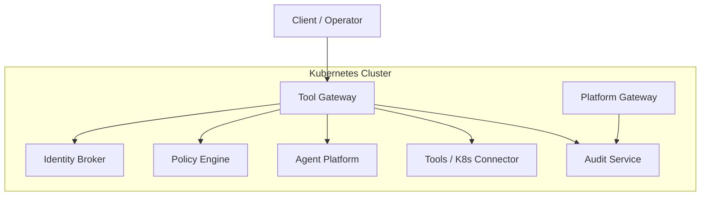
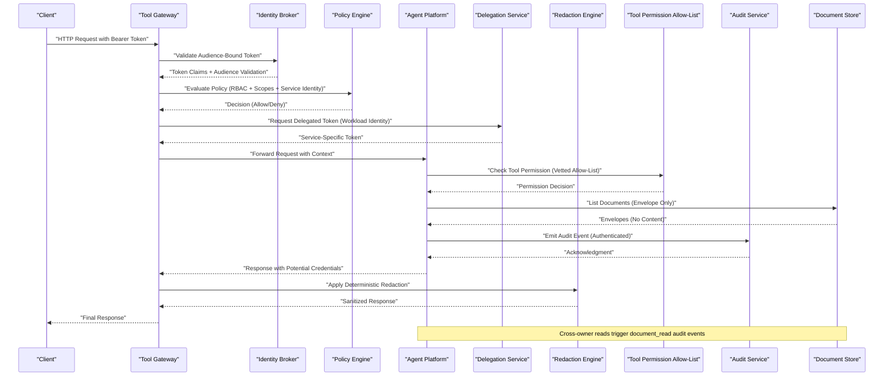
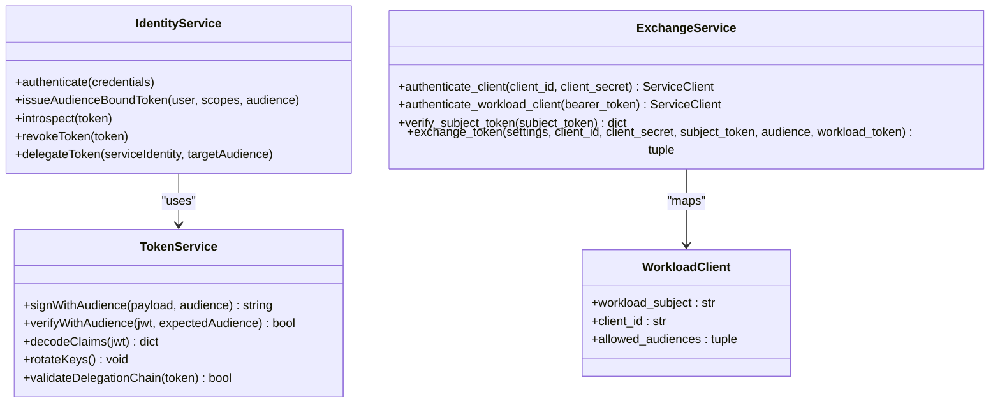
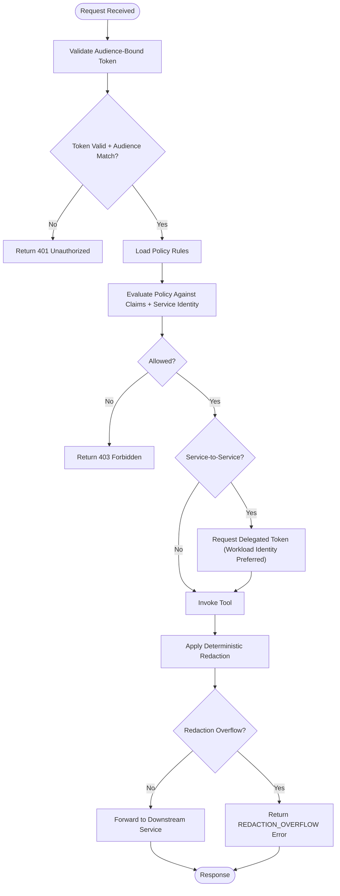
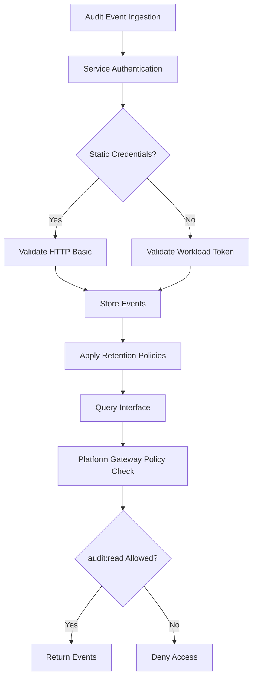
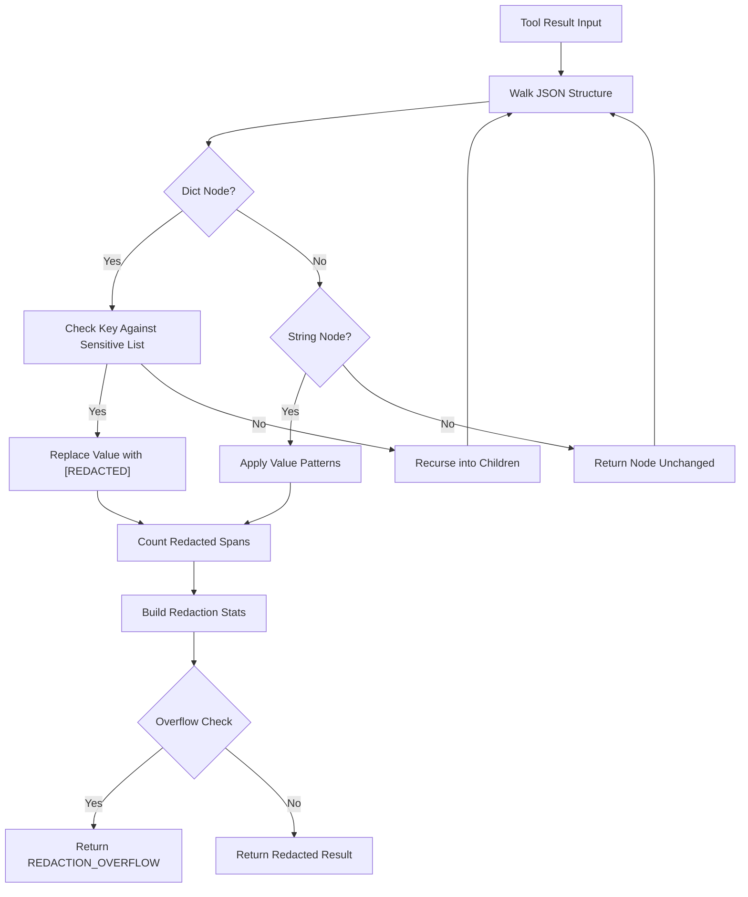
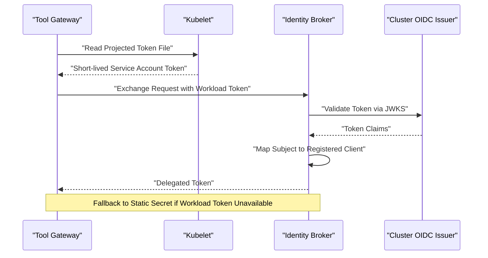
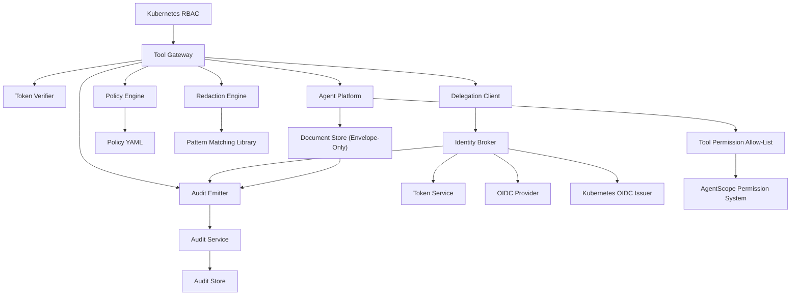

# Security Guide

<cite>
**Referenced Files in This Document**
- [README.md](file://README.md)
- [SECURITY.md](file://SECURITY.md)
- [identity-and-authorization-design.md](file://docs/agentic-aiops-platform/identity-and-authorization-design.md)
- [authorization-matrix.md](file://docs/agentic-aiops-platform/authorization-matrix.md)
- [policy-specification.md](file://docs/agentic-aiops-platform/policy-specification.md)
- [SPEC-003-identity-trust-hardening/spec.md](file://docs/specs/SPEC-003-identity-trust-hardening/spec.md)
- [SPEC-004-policy-enforcement/spec.md](file://docs/specs/SPEC-004-policy-enforcement/spec.md)
- [SPEC-005-observability-baseline/spec.md](file://docs/specs/SPEC-005-observability-baseline/spec.md)
- [SPEC-008-service-to-service-identity/spec.md](file://docs/specs/SPEC-008-service-to-service-identity/spec.md)
- [SPEC-009-pre-production-hardening/spec.md](file://docs/specs/SPEC-009-pre-production-hardening/spec.md)
- [SPEC-013-durable-audit-trail/spec.md](file://docs/specs/SPEC-013-durable-audit-trail/spec.md)
- [2026-08-27-document-read-audit-integrity.md](file://docs/agentic-aiops-platform/release-notes/2026-08-27-document-read-audit-integrity.md)
- [routes.py](file://products/agent-platform/src/agent_service/api/v2/routes.py)
- [documents.py](file://products/platform-gateway/src/platform_gateway/api/routes/documents.py)
- [test_documents.py](file://products/agent-platform/tests/test_documents.py)
- [gateway_tools.py](file://products/agent-platform/src/agent_service/tools/gateway_tools.py)
- [test_gateway_tools.py](file://products/agent-platform/tests/test_gateway_tools.py)
- [auth.py](file://products/identity-broker/src/identity_service/api/routes/auth.py)
- [identity.py](file://products/identity-broker/src/identity_service/api/routes/identity.py)
- [token_service.py](file://products/identity-broker/src/identity_service/services/token_service.py)
- [identity_service.py](file://products/identity-broker/src/identity_service/services/identity_service.py)
- [exchange_service.py](file://products/identity-broker/src/identity_service/services/exchange_service.py)
- [config.py](file://products/identity-broker/src/identity_service/core/config.py)
- [auth.py](file://products/tool-gateway/src/api_gateway/api/routes/auth.py)
- [gateway_service.py](file://products/tool-gateway/src/api_gateway/services/gateway_service.py)
- [policy_engine.py](file://products/tool-gateway/src/api_gateway/services/policy_engine.py)
- [token_verifier.py](file://products/tool-gateway/src/api_gateway/services/token_verifier.py)
- [delegation_client.py](file://products/tool-gateway/src/api_gateway/services/delegation_client.py)
- [redaction.py](file://products/tool-gateway/src/api_gateway/tools/redaction.py)
- [policy-default.yaml](file://products/tool-gateway/src/api_gateway/policies/policy-default.yaml)
- [rbac.yaml](file://shared/platform-ops/gitops/dev-k8s/base/tool-gateway/rbac.yaml)
- [runtime-config.env](file://shared/platform-ops/gitops/dev-k8s/base/identity-broker/runtime-config.env)
- [runtime-config.env](file://shared/platform-ops/gitops/dev-k8s/base/tool-gateway/runtime-config.env)
- [runtime-config.env](file://shared/platform-ops/gitops/dev-k8s/base/agent-platform/runtime-config.env)
- [kustomization.yaml](file://shared/platform-ops/gitops/dev-k8s/base/kustomization.yaml)
- [ingest_auth.py](file://products/audit-service/src/audit_service/services/ingest_auth.py)
- [ingest.py](file://products/audit-service/src/audit_service/api/routes/ingest.py)
- [query.py](file://products/audit-service/src/audit_service/api/routes/query.py)
- [audit.py](file://products/platform-gateway/src/platform_gateway/api/routes/audit.py)
- [audit_emitter.py](file://products/tool-gateway/src/tool_gateway/services/audit_emitter.py)
- [audit_emitter.py](file://products/platform-gateway/src/platform_gateway/services/audit_emitter.py)
- [audit_emitter.py](file://products/identity-broker/src/identity_service/services/audit_emitter.py)
- [config.py](file://products/audit-service/src/audit_service/core/config.py)
- [runtime-secrets.example.env](file://shared/platform-ops/gitops/dev-k8s/base/audit-service/runtime-secrets.example.env)
</cite>

## Update Summary
**Changes Made**
- Enhanced documentation for document read audit integrity with envelope-only listings
- Updated security architecture section to include centralized single-document fetch endpoints
- Added detailed explanation of cross-owner access auditing mechanisms
- Updated threat modeling to address document content exposure prevention
- Enhanced compliance requirements with document audit trail specifications
- Updated troubleshooting guide with document read audit verification procedures

## Table of Contents
1. Introduction
2. Project Structure
3. Core Components
4. Architecture Overview
5. Detailed Component Analysis
6. Dependency Analysis
7. Performance Considerations
8. Troubleshooting Guide
9. Conclusion
10. Appendices

## Introduction
This Security Guide documents the Luban AIOps Platform's enhanced security architecture, threat mitigation strategies, and compliance requirements. The platform now implements a sophisticated security model featuring audience-bound JWTs, delegated token flows, service-to-service identity patterns, deterministic tool output redaction, workload identity service tokens, explicit tool permission allow-listing, and a durable audit trail with secure service-to-service authentication. It covers identity and authorization design (OIDC integration, JWT token security, and role-based access control), the authorization matrix across services and resources, secure configuration and secrets management, network security, vulnerability assessment procedures, scanning and penetration testing guidelines, compliance and audit logging, incident response procedures, and secure development practices with security review processes.

The platform has been significantly hardened with multiple security enhancements including explicit tool permission allow-listing to prevent unauthorized tool execution, deterministic redaction of tool outputs to prevent credential leakage to external model providers, workload identity service tokens that replace static client secrets with short-lived, Kubernetes-projected tokens validated against cluster OIDC issuers, and a comprehensive audit trail system that provides immutable records of all platform activities with strong authentication and authorization controls. **Updated**: The platform now implements enhanced audit integrity for document read operations, ensuring cross-owner access to sensitive content is properly recorded through centralized single-document fetch endpoints rather than list endpoints, preventing unauthorized content exposure while maintaining comprehensive audit trails.

## Project Structure
The platform is organized into multiple products and shared components with enhanced security boundaries:
- Identity Broker: Centralized identity and token issuance/validation service supporting OIDC flows, audience-bound JWT lifecycle management, delegated token operations, and workload identity token validation.
- Tool Gateway: API gateway enforcing authentication, authorization, policy decisions, secure tool execution orchestration, deterministic output redaction, and explicit tool permission allow-listing with service-to-service identity validation.
- Audit Service: Durable audit trail storage with secure service-to-service authentication, role-based query access, and retention policies for compliance requirements.
- Agent Platform: Runtime for agent services with session management, provider integrations, strict audience-scoped permissions, vetted tool auto-approval mechanisms, and enhanced document repository with envelope-only listings.
- Operator Portal: Web UI for operators to manage platform resources with enhanced security controls and audited document access.
- Shared Contracts and Schemas: Common data models and policy specifications used across services with enhanced security schemas.
- GitOps and Kubernetes overlays: Declarative deployment configurations including RBAC, policies, and runtime environment variables with least-privilege defaults.

[No sources needed since this diagram shows conceptual workflow, not actual code structure]

## Core Components
- Identity Broker provides OIDC endpoints, issues and validates audience-bound tokens, supports delegated token flows, exposes identity context APIs with service-to-service authentication, and validates workload identity tokens from Kubernetes projected service accounts.
- Tool Gateway performs request authentication, token verification with audience validation, policy evaluation, secure tool execution orchestration, deterministic output redaction, and routes requests to downstream services with proper identity propagation.
- Audit Service provides durable audit trail storage with secure service-to-service authentication using both static credentials and workload identity, role-based query access control, and retention policies for compliance.
- Policy Engine evaluates policies against requests and enforces RBAC and fine-grained permissions with service-to-service identity awareness.
- Agent Platform manages sessions and runtime dependencies for agent workloads with strict audience-scoped permissions, least-privilege execution contexts, explicit tool permission allow-listing, and enhanced document repository with envelope-only listings and centralized fetch auditing.
- Kubernetes RBAC and policy manifests define least-privilege access and runtime constraints with enhanced service identity management.

Key responsibilities:
- Authentication via OIDC and audience-bound JWT validation at the gateway and broker.
- Authorization via policy engine using RBAC, scopes, and resource-scoped permissions with service identity awareness.
- Secure configuration through environment-driven settings and secrets injection with least-privilege defaults.
- Explicit tool permission allow-listing preventing unauthorized tool execution while maintaining operational efficiency.
- Deterministic tool output redaction preventing credential leakage to external model providers.
- Workload identity service tokens replacing static client secrets with short-lived, auditable credentials.
- Comprehensive audit trail with secure ingestion, storage, and query capabilities with role-based access control.
- **Enhanced document read audit integrity** ensuring cross-owner access to sensitive content is properly recorded through centralized single-document fetch endpoints.
- Observability and audit logging for security events with enhanced service-to-service communication tracking.

**Section sources**
- [identity-and-authorization-design.md](file://docs/agentic-aiops-platform/identity-and-authorization-design.md)
- [authorization-matrix.md](file://docs/agentic-aiops-platform/authorization-matrix.md)
- [policy-specification.md](file://docs/agentic-aiops-platform/policy-specification.md)
- [SPEC-003-identity-trust-hardening/spec.md](file://docs/specs/SPEC-003-identity-trust-hardening/spec.md)
- [SPEC-004-policy-enforcement/spec.md](file://docs/specs/SPEC-004-policy-enforcement/spec.md)
- [SPEC-008-service-to-service-identity/spec.md](file://docs/specs/SPEC-008-service-to-service-identity/spec.md)
- [SPEC-009-pre-production-hardening/spec.md](file://docs/specs/SPEC-009-pre-production-hardening/spec.md)
- [SPEC-013-durable-audit-trail/spec.md](file://docs/specs/SPEC-013-durable-audit-trail/spec.md)

## Architecture Overview
The enhanced security architecture centers on a trust boundary at the Tool Gateway, which authenticates clients, verifies audience-bound tokens, enforces policies with service identity awareness, delegates tokens securely to internal services, applies deterministic redaction to prevent credential leakage, and enforces explicit tool permission allow-listing. The Identity Broker acts as the single source of truth for user and service identities, issuing OIDC-compliant tokens with audience scoping, validating workload identity tokens from Kubernetes, and providing introspection endpoints. The Audit Service provides durable, tamper-evident audit trails with secure service-to-service authentication and role-based query access. Policies are declarative and evaluated per-request, enabling dynamic authorization based on roles, scopes, resource attributes, and service identity relationships. **Updated**: The document repository architecture now ensures that sensitive document content is only accessible through centralized single-document fetch endpoints, with envelope-only listings preventing unauthorized content exposure while maintaining comprehensive audit trails for cross-owner access.

**Diagram sources**
- [auth.py](file://products/tool-gateway/src/api_gateway/api/routes/auth.py)
- [gateway_service.py](file://products/tool-gateway/src/api_gateway/services/gateway_service.py)
- [policy_engine.py](file://products/tool-gateway/src/api_gateway/services/policy_engine.py)
- [token_verifier.py](file://products/tool-gateway/src/api_gateway/services/token_verifier.py)
- [delegation_client.py](file://products/tool-gateway/src/api_gateway/services/delegation_client.py)
- [redaction.py](file://products/tool-gateway/src/api_gateway/tools/redaction.py)
- [gateway_tools.py](file://products/agent-platform/src/agent_service/tools/gateway_tools.py)
- [auth.py](file://products/identity-broker/src/identity_service/api/routes/auth.py)
- [identity_service.py](file://products/identity-broker/src/identity_service/services/identity_service.py)
- [exchange_service.py](file://products/identity-broker/src/identity_service/services/exchange_service.py)
- [audit_emitter.py](file://products/tool-gateway/src/tool_gateway/services/audit_emitter.py)
- [ingest.py](file://products/audit-service/src/audit_service/api/routes/ingest.py)
- [routes.py](file://products/agent-platform/src/agent_service/api/v2/routes.py)

**Section sources**
- [SPEC-003-identity-trust-hardening/spec.md](file://docs/specs/SPEC-003-identity-trust-hardening/spec.md)
- [SPEC-004-policy-enforcement/spec.md](file://docs/specs/SPEC-004-policy-enforcement/spec.md)
- [SPEC-008-service-to-service-identity/spec.md](file://docs/specs/SPEC-008-service-to-service-identity/spec.md)
- [SPEC-009-pre-production-hardening/spec.md](file://docs/specs/SPEC-009-pre-production-hardening/spec.md)
- [SPEC-013-durable-audit-trail/spec.md](file://docs/specs/SPEC-013-durable-audit-trail/spec.md)

## Detailed Component Analysis

### Identity Broker: Enhanced OIDC and Audience-Bound JWT Security with Workload Identity Support
The Identity Broker implements enhanced OIDC endpoints for authentication and audience-bound token issuance with comprehensive workload identity support. It validates client credentials, issues JWTs with appropriate audience scoping, supports delegated token flows, validates Kubernetes projected service account tokens, and provides comprehensive token introspection capabilities. Configuration is driven by environment variables for issuer URLs, signing keys, token lifetimes, and audience restrictions.

Key aspects:
- OIDC discovery and token endpoints exposed via API routes with audience validation.
- JWT signing and verification using configured algorithms and key material with audience binding.
- Token introspection endpoint for downstream services to validate bearer tokens and audience claims.
- Role and scope mapping from upstream providers into platform claims with service identity support.
- Delegated token flow implementation for secure service-to-service communications.
- Workload identity token validation against Kubernetes cluster OIDC issuer JWKS.
- Workload subject mapping to registered service clients with audience allow-list semantics.

**Diagram sources**
- [identity_service.py](file://products/identity-broker/src/identity_service/services/identity_service.py)
- [token_service.py](file://products/identity-broker/src/identity_service/services/token_service.py)
- [exchange_service.py](file://products/identity-broker/src/identity_service/services/exchange_service.py)
- [config.py](file://products/identity-broker/src/identity_service/core/config.py)

**Section sources**
- [auth.py](file://products/identity-broker/src/identity_service/api/routes/auth.py)
- [identity.py](file://products/identity-broker/src/identity_service/api/routes/identity.py)
- [token_service.py](file://products/identity-broker/src/identity_service/services/token_service.py)
- [identity_service.py](file://products/identity-broker/src/identity_service/services/identity_service.py)
- [exchange_service.py](file://products/identity-broker/src/identity_service/services/exchange_service.py)
- [config.py](file://products/identity-broker/src/identity_service/core/config.py)
- [runtime-config.env](file://shared/platform-ops/gitops/dev-k8s/base/identity-broker/runtime-config.env)

### Tool Gateway: Enhanced Authentication, Authorization, Service Identity Enforcement, and Deterministic Redaction
The Tool Gateway serves as the primary security enforcement point with enhanced audience validation, service identity awareness, and deterministic output redaction. It validates incoming requests, verifies audience-bound JWTs, evaluates policies with service identity context, forwards authorized requests to downstream services with proper identity propagation, and applies deterministic redaction to prevent credential leakage to external model providers. Policies are defined declaratively and support RBAC, fine-grained rules, and service-to-service identity relationships.

Key aspects:
- Audience-bound JWT verification and claim extraction with service identity validation.
- Policy evaluation using a policy engine that reads YAML policies with service identity awareness.
- RBAC enforcement via Kubernetes manifests and runtime checks with least-privilege principles.
- Audit logging of authz decisions, service-to-service communications, and sensitive operations.
- Delegated token flow implementation for secure inter-service communications with workload identity preference.
- Deterministic tool output redaction preventing credential leakage to model providers.
- Fail-closed overflow protection when too much content appears to contain credentials.

**Diagram sources**
- [auth.py](file://products/tool-gateway/src/api_gateway/api/routes/auth.py)
- [gateway_service.py](file://products/tool-gateway/src/api_gateway/services/gateway_service.py)
- [policy_engine.py](file://products/tool-gateway/src/api_gateway/services/policy_engine.py)
- [token_verifier.py](file://products/tool-gateway/src/api_gateway/services/token_verifier.py)
- [delegation_client.py](file://products/tool-gateway/src/api_gateway/services/delegation_client.py)
- [redaction.py](file://products/tool-gateway/src/api_gateway/tools/redaction.py)
- [policy-default.yaml](file://products/tool-gateway/src/api_gateway/policies/policy-default.yaml)

**Section sources**
- [auth.py](file://products/tool-gateway/src/api_gateway/api/routes/auth.py)
- [gateway_service.py](file://products/tool-gateway/src/api_gateway/services/gateway_service.py)
- [policy_engine.py](file://products/tool-gateway/src/api_gateway/services/policy_engine.py)
- [token_verifier.py](file://products/tool-gateway/src/api_gateway/services/token_verifier.py)
- [delegation_client.py](file://products/tool-gateway/src/api_gateway/services/delegation_client.py)
- [redaction.py](file://products/tool-gateway/src/api_gateway/tools/redaction.py)
- [policy-default.yaml](file://products/tool-gateway/src/api_gateway/policies/policy-default.yaml)
- [rbac.yaml](file://shared/platform-ops/gitops/dev-k8s/base/tool-gateway/rbac.yaml)

### Audit Service: Secure Audit Trail with Service-to-Service Authentication
**New** The Audit Service provides a durable, tamper-evident audit trail with robust service-to-service authentication and role-based access control. It accepts authenticated audit events from platform services, stores them with retention policies, and provides secure query capabilities for authorized users through the platform gateway.

Key aspects:
- **Dual Authentication Paths**: Supports both static HTTP Basic credentials and Kubernetes projected workload tokens for service authentication.
- **Secure Ingestion**: Batch event ingestion with validation, authentication, and atomic storage guarantees.
- **Role-Based Query Access**: Enforced through platform gateway with `audit:read` policy action requiring auditor or platform-admin roles.
- **Retention Management**: Configurable retention windows and maximum event counts with background eviction.
- **Fire-and-Forget Emission**: Non-blocking audit event delivery from emitting services with failure handling.
- **Compliance-Focused Design**: Immutable audit records with service attribution and timestamping.

**Diagram sources**
- [ingest_auth.py](file://products/audit-service/src/audit_service/services/ingest_auth.py)
- [ingest.py](file://products/audit-service/src/audit_service/api/routes/ingest.py)
- [query.py](file://products/audit-service/src/audit_service/api/routes/query.py)
- [audit.py](file://products/platform-gateway/src/platform_gateway/api/routes/audit.py)

**Section sources**
- [ingest_auth.py](file://products/audit-service/src/audit_service/services/ingest_auth.py)
- [ingest.py](file://products/audit-service/src/audit_service/api/routes/ingest.py)
- [query.py](file://products/audit-service/src/audit_service/api/routes/query.py)
- [audit.py](file://products/platform-gateway/src/platform_gateway/api/routes/audit.py)
- [config.py](file://products/audit-service/src/audit_service/core/config.py)
- [runtime-secrets.example.env](file://shared/platform-ops/gitops/dev-k8s/base/audit-service/runtime-secrets.example.env)

### Enhanced Document Repository: Envelope-Only Listings and Centralized Fetch Auditing
**Updated** The document repository has been significantly enhanced to ensure audit integrity for document read operations. The system now implements envelope-only listings that strip sensitive content (digest and prose) from list responses, ensuring that cross-owner access to sensitive content is properly recorded through centralized single-document fetch endpoints. This prevents unauthorized content exposure while maintaining comprehensive audit trails.

Key aspects:
- **Envelope-Only Listings**: Both `mine` and `published` document listing endpoints return metadata only, stripping `digest` and `prose` fields to prevent content exposure.
- **Centralized Single-Document Fetch**: Full document content is only available through the single-document fetch endpoint (`GET /documents/{document_id}`), which serves as the audited surface.
- **Cross-Owner Read Auditing**: When a user accesses another user's published document, a `document_read` audit event is emitted with owner attribution, while own-document reads remain unaudited.
- **Foreign Draft Protection**: Foreign drafts are indistinguishable from unknown documents, returning 404 status codes to prevent enumeration attacks.
- **Portal Integration**: The operator portal drawer now retrieves full documents through the audited single fetch endpoint, ensuring every cross-owner read is properly recorded.

**Diagram sources**
- [routes.py:858-882](file://products/agent-platform/src/agent_service/api/v2/routes.py#L858-L882)
- [routes.py:885-915](file://products/agent-platform/src/agent_service/api/v2/routes.py#L885-L915)
- [test_documents.py:250-266](file://products/agent-platform/tests/test_documents.py#L250-L266)

**Section sources**
- [routes.py:858-915](file://products/agent-platform/src/agent_service/api/v2/routes.py#L858-L915)
- [test_documents.py:250-266](file://products/agent-platform/tests/test_documents.py#L250-L266)
- [2026-08-27-document-read-audit-integrity.md](file://docs/agentic-aiops-platform/release-notes/2026-08-27-document-read-audit-integrity.md)

### Explicit Tool Permission Allow-List System
**Updated** The tool permission auto-approval system has been significantly hardened to address CWE-862 (Incorrect Authorization) vulnerability. Instead of automatically approving any read-only tool, the system now uses an explicit vetted allow-list controlled by the `AGENT_GATEWAY_TOOL_AUTO_ALLOW` environment variable. This ensures that only pre-approved, security-reviewed tools can bypass the interactive permission confirmation process.

Key aspects:
- Default allow-list contains only vetted read-only tools: `k8s.list_pods`, `k8s.get_pod`, `k8s.get_events`, `k8s.get_pod_logs`.
- Environment variable override allows deployment-specific customization of the allow-list.
- Empty environment variable approves nothing, ensuring fail-safe behavior.
- Non-read-only tools always require interactive confirmation regardless of allow-list status.
- Tools outside the allow-list maintain the default ASK behavior, preventing unauthorized execution.
- Admission and policy enforcement continue at the tool-gateway level for all tool invocations.

**Diagram sources**
- [gateway_tools.py:35-96](file://products/agent-platform/src/agent_service/tools/gateway_tools.py#L35-L96)
- [test_gateway_tools.py:228-287](file://products/agent-platform/tests/test_gateway_tools.py#L228-L287)

**Section sources**
- [gateway_tools.py:35-96](file://products/agent-platform/src/agent_service/tools/gateway_tools.py#L35-L96)
- [test_gateway_tools.py:228-287](file://products/agent-platform/tests/test_gateway_tools.py#L228-L287)

### Deterministic Tool Output Redaction System
The redaction system implements code-owned, deterministic pattern matching to prevent credential leakage to external model providers. It operates at the single choke point where every tool result becomes an HTTP response, ensuring no path can bypass the redaction process. The system uses two layers of protection: value patterns for shape-based credential detection and explicit key lists for bounded sensitive field matching.

Key aspects:
- Value patterns detect JWTs, Bearer/Basic tokens, PEM private keys, and AWS-style access key IDs.
- Explicit key list matches sensitive fields like password, secret, api_key, token, etc.
- Code-owned pattern set (not operator-editable) ensures consistent security guarantees.
- Fail-closed overflow protection returns structured errors when too much content appears to contain credentials.
- Prometheus metrics track redacted spans per tool result for observability.
- Audit logging includes redaction statistics for security monitoring.

**Diagram sources**
- [redaction.py](file://products/tool-gateway/src/api_gateway/tools/redaction.py)

**Section sources**
- [redaction.py](file://products/tool-gateway/src/api_gateway/tools/redaction.py)
- [gateway_service.py](file://products/tool-gateway/src/api_gateway/services/gateway_service.py)
- [SPEC-009-pre-production-hardening/spec.md](file://docs/specs/SPEC-009-pre-production-hardening/spec.md)

### Workload Identity Service Tokens
The workload identity system replaces static client secrets with Kubernetes projected service account tokens, providing short-lived, auditable credentials validated against the cluster OIDC issuer. The system prefers workload tokens over static credentials while maintaining backward compatibility for development environments.

Key aspects:
- Kubernetes projected service account tokens validated against cluster OIDC issuer JWKS.
- Workload subject mapping to registered service clients with audience allow-list semantics.
- Gateway prefers workload token file over static client secret with graceful fallback.
- Identical claims semantics between workload identity and static secret paths.
- Automatic token rotation via kubelet projected file updates.
- Comprehensive error handling for invalid, expired, or unregistered workload tokens.

**Diagram sources**
- [delegation_client.py](file://products/tool-gateway/src/api_gateway/services/delegation_client.py)
- [exchange_service.py](file://products/identity-broker/src/identity_service/services/exchange_service.py)
- [config.py](file://products/identity-broker/src/identity_service/core/config.py)

**Section sources**
- [delegation_client.py](file://products/tool-gateway/src/api_gateway/services/delegation_client.py)
- [exchange_service.py](file://products/identity-broker/src/identity_service/services/exchange_service.py)
- [config.py](file://products/identity-broker/src/identity_service/core/config.py)
- [SPEC-009-pre-production-hardening/spec.md](file://docs/specs/SPEC-009-pre-production-hardening/spec.md)

### Agent Platform: Enhanced Session and Runtime Security with Least-Privilege
**Updated** The Agent Platform manages sessions and runtime dependencies for agent workloads with enhanced security controls including explicit tool permission allow-listing and enhanced document repository with envelope-only listings. It integrates with the identity system to ensure authenticated sessions with audience-scoped permissions and enforces runtime policies with least-privilege execution contexts.

Key aspects:
- Session creation and persistence with secure identifiers and audience validation.
- Provider-specific integrations with secure credential handling and least-privilege access.
- Telemetry and observability for security-relevant events with service identity tracking.
- Runtime policy enforcement with audience-scoped permissions and service identity validation.
- Explicit tool permission allow-listing preventing unauthorized tool execution.
- **Enhanced document repository** with envelope-only listings and centralized fetch auditing.
- Integration with AgentScope permission system for headless stream compatibility.

**Section sources**
- [runtime-config.env](file://shared/platform-ops/gitops/dev-k8s/base/agent-platform/runtime-config.env)
- [SPEC-005-observability-baseline/spec.md](file://docs/specs/SPEC-005-observability-baseline/spec.md)

### Kubernetes RBAC and Policy Manifests: Enhanced Least-Privilege Access
RBAC and policy manifests enforce least-privilege access at the cluster level with enhanced service identity management. They define roles, bindings, and policy files consumed by the gateway and other services with audience-scoped permissions.

Key aspects:
- Namespace-scoped RBAC for tool-gateway and agent-platform with service identity support.
- Policy files referenced by the gateway for runtime enforcement with audience validation.
- Environment configuration injected via ConfigMaps and Secrets with least-privilege defaults.
- Service account management with audience-scoped permissions and delegated token support.

**Section sources**
- [rbac.yaml](file://shared/platform-ops/gitops/dev-k8s/base/tool-gateway/rbac.yaml)
- [policy-default.yaml](file://products/tool-gateway/src/api_gateway/policies/policy-default.yaml)
- [kustomization.yaml](file://shared/platform-ops/gitops/dev-k8s/base/kustomization.yaml)

## Dependency Analysis
Security-critical dependencies include:
- OIDC provider integration for identity federation with audience validation.
- JWT libraries for audience-bound token signing and verification.
- Policy engine for evaluating RBAC, custom rules, and service identity relationships.
- Kubernetes RBAC for cluster-level access control with service identity support.
- Delegation client for secure service-to-service token exchange with workload identity preference.
- Pattern matching libraries for deterministic credential detection and redaction.
- AgentScope permission system for tool permission management with explicit allow-listing.
- Audit service client for secure audit event emission with authentication.
- **Document store with envelope-only listing capability** for secure document content access.

**Diagram sources**
- [token_verifier.py](file://products/tool-gateway/src/api_gateway/services/token_verifier.py)
- [policy_engine.py](file://products/tool-gateway/src/api_gateway/services/policy_engine.py)
- [delegation_client.py](file://products/tool-gateway/src/api_gateway/services/delegation_client.py)
- [redaction.py](file://products/tool-gateway/src/api_gateway/tools/redaction.py)
- [token_service.py](file://products/identity-broker/src/identity_service/services/token_service.py)
- [exchange_service.py](file://products/identity-broker/src/identity_service/services/exchange_service.py)
- [rbac.yaml](file://shared/platform-ops/gitops/dev-k8s/base/tool-gateway/rbac.yaml)
- [gateway_tools.py](file://products/agent-platform/src/agent_service/tools/gateway_tools.py)
- [audit_emitter.py](file://products/tool-gateway/src/tool_gateway/services/audit_emitter.py)
- [ingest_auth.py](file://products/audit-service/src/audit_service/services/ingest_auth.py)
- [routes.py](file://products/agent-platform/src/agent_service/api/v2/routes.py)

**Section sources**
- [SPEC-003-identity-trust-hardening/spec.md](file://docs/specs/SPEC-003-identity-trust-hardening/spec.md)
- [SPEC-004-policy-enforcement/spec.md](file://docs/specs/SPEC-004-policy-enforcement/spec.md)
- [SPEC-008-service-to-service-identity/spec.md](file://docs/specs/SPEC-008-service-to-service-identity/spec.md)
- [SPEC-009-pre-production-hardening/spec.md](file://docs/specs/SPEC-009-pre-production-hardening/spec.md)
- [SPEC-013-durable-audit-trail/spec.md](file://docs/specs/SPEC-013-durable-audit-trail/spec.md)

## Performance Considerations
- Token caching: Cache validated audience-bound tokens and claims to reduce broker calls while maintaining security.
- Policy evaluation optimization: Preload and cache policy rules; use efficient matching algorithms with service identity awareness.
- Connection pooling: Maintain pooled connections to downstream services and Redis for sessions with proper identity propagation.
- Rate limiting: Implement rate limits at the gateway to mitigate abuse and DoS attacks.
- Asynchronous processing: Offload heavy operations like policy evaluation and token delegation to background workers where feasible.
- Audience validation caching: Cache audience validation results to improve performance without compromising security.
- Redaction performance: Efficient pattern matching with early termination and bounded processing to prevent performance degradation.
- Workload token caching: Cache workload token validation results to reduce cluster OIDC issuer calls.
- Tool permission checking: Minimal overhead for allow-list lookups using frozenset for O(1) membership testing.
- Audit emission: Fire-and-forget audit delivery with non-blocking threads and timeout protection to prevent request path degradation.
- **Document listing performance**: Envelope-only listings reduce payload size and improve response times while maintaining security.
- **Cross-owner read auditing**: Audit event emission is optimized to minimize impact on document fetch performance.

## Troubleshooting Guide
Common issues and resolutions:
- Invalid or expired audience-bound tokens: Verify issuer configuration, signing keys, token lifetimes, and audience restrictions.
- Policy denials with service identity: Inspect policy rules and claims; ensure RBAC bindings match expected roles and service identities.
- OIDC connectivity failures: Check network policies, DNS resolution, and provider health endpoints.
- Audit log gaps: Confirm logging configuration and output destinations for security events including service-to-service communications.
- Token delegation failures: Verify delegation chain validity and service identity permissions.
- Redaction overflow errors: Investigate tool outputs for excessive credential content; adjust parameters to reduce sensitive data exposure.
- Workload token authentication failures: Verify Kubernetes projected token configuration, cluster OIDC issuer settings, and workload subject mappings.
- **Tool permission blocking**: Check AGENT_GATEWAY_TOOL_AUTO_ALLOW environment variable configuration and verify tool names in the allow-list.
- **Headless stream stalls**: Ensure tools are properly configured as read-only and included in the vetted allow-list for automatic approval.
- **Audit service connection failures**: Verify AUDIT_SERVICE_URL configuration and audit client credentials in emitter services.
- **Audit query access denied**: Confirm user has auditor or platform-admin role and audit:read policy action is granted.
- **Document content exposure**: Verify that document listings return envelope-only data and full content is only accessible through single-document fetch endpoints.
- **Missing cross-owner read audits**: Check that document fetch endpoints properly emit `document_read` audit events for cross-owner access.

Recommended diagnostics:
- Enable verbose logging for auth and policy decisions with service identity context.
- Use introspection endpoints to validate audience-bound token contents and delegation chains.
- Review Kubernetes RBAC bindings and policy YAML for correctness with service identity support.
- Monitor audience validation logs for security anomalies.
- Track redaction metrics and overflow events for credential leakage prevention.
- Validate workload token configuration and cluster OIDC issuer connectivity.
- **Inspect tool permission logs** to identify blocked tools and their permission decisions.
- **Monitor audit service health and ingestion metrics** to ensure audit trail completeness.
- **Verify document listing responses** to ensure they contain only envelope data without sensitive content.
- **Audit document fetch events** to confirm cross-owner access is properly recorded.

**Section sources**
- [SPEC-005-observability-baseline/spec.md](file://docs/specs/SPEC-005-observability-baseline/spec.md)
- [rbac.yaml](file://shared/platform-ops/gitops/dev-k8s/base/tool-gateway/rbac.yaml)
- [policy-default.yaml](file://products/tool-gateway/src/api_gateway/policies/policy-default.yaml)
- [SPEC-009-pre-production-hardening/spec.md](file://docs/specs/SPEC-009-pre-production-hardening/spec.md)
- [SPEC-013-durable-audit-trail/spec.md](file://docs/specs/SPEC-013-durable-audit-trail/spec.md)

## Conclusion
The Luban AIOps Platform implements an enhanced robust security architecture centered on OIDC-based authentication, audience-bound JWT token security, policy-driven authorization with service identity awareness, explicit tool permission allow-listing, deterministic tool output redaction, workload identity service tokens, and a comprehensive audit trail system with secure service-to-service authentication. By enforcing least-privilege access through RBAC, audience-scoped permissions, declarative policies, and explicit tool permission controls, integrating comprehensive observability and audit logging for service-to-service communications, implementing fail-closed credential protection, and providing durable audit trails with role-based access control, the platform provides strong protection against common threats. The addition of delegated token flows, service-to-service identity patterns, explicit tool permission allow-listing, deterministic redaction, workload identity tokens, secure audit trail capabilities, and **enhanced document read audit integrity with envelope-only listings** further strengthens the security posture while maintaining operational efficiency. Continuous security scanning, penetration testing, and adherence to compliance standards further enhance the platform's security framework.

## Appendices

### Compliance Requirements
- Align with industry standards for identity management and access control with audience-scoped permissions.
- Ensure audit logs capture authentication, authorization, service-to-service communications, administrative actions, and redaction events.
- Maintain encryption for data in transit and at rest where applicable with proper key management.
- Regularly review and update policies to reflect organizational changes and least-privilege principles.
- Implement comprehensive service identity management with audience validation and delegation controls.
- Validate workload identity configurations and cluster OIDC issuer settings regularly.
- Monitor redaction metrics and overflow events for compliance with credential protection policies.
- **Review and approve tool permission allow-list changes** through formal change management processes.
- **Ensure audit trail retention meets regulatory requirements** with configurable retention policies.
- **Implement audit query access controls** to restrict sensitive audit data to authorized personnel only.
- **Verify document read audit integrity** to ensure cross-owner access to sensitive content is properly recorded and documented.

**Section sources**
- [SECURITY.md](file://SECURITY.md)
- [SPEC-005-observability-baseline/spec.md](file://docs/specs/SPEC-005-observability-baseline/spec.md)
- [SPEC-009-pre-production-hardening/spec.md](file://docs/specs/SPEC-009-pre-production-hardening/spec.md)
- [SPEC-013-durable-audit-trail/spec.md](file://docs/specs/SPEC-013-durable-audit-trail/spec.md)

### Vulnerability Assessment and Penetration Testing
- Conduct regular automated scans for dependencies and container images with security-focused analysis.
- Perform manual penetration tests focusing on authentication, authorization, audience validation, API endpoints, and redaction effectiveness.
- Test service-to-service identity flows and delegated token mechanisms for security vulnerabilities.
- Validate workload identity token validation and cluster OIDC issuer integration.
- Assess redaction pattern coverage and overflow protection mechanisms.
- **Test tool permission allow-list effectiveness** to ensure unauthorized tools cannot bypass permission controls.
- **Verify CWE-862 remediation** by attempting to execute non-vetted tools without proper authorization.
- **Test audit service authentication** to ensure unauthorized services cannot ingest or query audit events.
- **Validate audit trail integrity** by attempting to modify or delete stored audit records.
- **Test document read audit integrity** by verifying that cross-owner access to sensitive content is properly recorded through centralized fetch endpoints.
- **Verify envelope-only listings** to ensure document content cannot be accessed through list endpoints.
- Document findings and remediation steps; track vulnerabilities to closure with security impact assessment.
- Integrate security checks into CI/CD pipelines for continuous assurance with audience-bound token validation and redaction testing.

**Section sources**
- [SECURITY.md](file://SECURITY.md)
- [README.md](file://README.md)
- [SPEC-009-pre-production-hardening/spec.md](file://docs/specs/SPEC-009-pre-production-hardening/spec.md)
- [SPEC-013-durable-audit-trail/spec.md](file://docs/specs/SPEC-013-durable-audit-trail/spec.md)

### Secure Development Practices
- Enforce least privilege in code and configuration with audience-scoped permissions and service identity awareness.
- Use secret managers and avoid hardcoding credentials with proper audience validation.
- Apply input validation and output encoding consistently with service identity sanitization.
- Review security-related changes via dedicated security reviews with focus on audience binding, delegation flows, and redaction patterns.
- Implement comprehensive audit logging for all security-sensitive operations and service-to-service communications.
- Validate workload identity configurations and test both workload token and static secret fallback paths.
- Ensure redaction patterns remain effective against evolving credential formats and attack vectors.
- **Follow formal approval process for tool permission allow-list changes** to prevent unauthorized tool execution.
- **Implement security testing for tool permission controls** in CI/CD pipelines to catch permission bypass attempts.
- **Test audit service authentication** to ensure only authorized services can emit or query audit events.
- **Validate audit trail immutability** to ensure stored audit records cannot be tampered with.
- **Ensure document repository security** by implementing envelope-only listings and centralized fetch auditing.
- **Test cross-owner read auditing** to verify that sensitive document access is properly recorded.

**Section sources**
- [SPEC-003-identity-trust-hardening/spec.md](file://docs/specs/SPEC-003-identity-trust-hardening/spec.md)
- [SPEC-004-policy-enforcement/spec.md](file://docs/specs/SPEC-004-policy-enforcement/spec.md)
- [SPEC-008-service-to-service-identity/spec.md](file://docs/specs/SPEC-008-service-to-service-identity/spec.md)
- [SPEC-009-pre-production-hardening/spec.md](file://docs/specs/SPEC-009-pre-production-hardening/spec.md)
- [SPEC-013-durable-audit-trail/spec.md](file://docs/specs/SPEC-013-durable-audit-trail/spec.md)

### Threat Modeling Updates
**Updated** The security hardening features address several critical attack vectors, with particular emphasis on tool permission vulnerabilities, audit trail integrity, and document content exposure prevention:

**Credential Leakage Prevention:**
- Deterministic redaction prevents service-account JWTs, bearer tokens, and basic credentials from reaching external model providers.
- Fail-closed overflow protection ensures pathological outputs don't compromise security.
- Code-owned pattern sets eliminate operator-editable regex vulnerabilities.

**Service Identity Hardening:**
- Workload identity tokens replace extractable static client secrets with short-lived, auditable credentials.
- Kubernetes projected tokens provide automatic rotation and cluster-scoped validation.
- Graceful fallback maintains backward compatibility while encouraging adoption of more secure methods.

**Tool Permission Security (CWE-862 Remediation):**
- **Explicit allow-list approach eliminates blanket read-only tool approval** that could lead to unauthorized tool execution.
- **Environment-controlled allow-list** enables deployment-specific security tuning while maintaining centralized control.
- **Fail-safe defaults** ensure that unknown tools require explicit confirmation rather than automatic approval.
- **Integration with existing policy framework** ensures tool permissions complement broader authorization controls.

**Document Content Exposure Prevention:**
- **Envelope-only listings prevent unauthorized content access** through document listing endpoints.
- **Centralized single-document fetch ensures audited access** to sensitive document content.
- **Cross-owner read auditing provides comprehensive audit trails** for document access patterns.
- **Foreign draft protection prevents enumeration attacks** by treating foreign drafts as unknown documents.

**Audit Trail Security:**
- **Dual authentication paths** provide flexibility while maintaining security through static credentials or workload identity.
- **Role-based query access** ensures only authorized users can view audit trails through platform gateway policy enforcement.
- **Immutable storage design** prevents modification or deletion of audit records once stored.
- **Service attribution** ensures all audit events are traceable to their originating service.

**Attack Surface Reduction:**
- Single choke point for redaction eliminates bypass opportunities.
- Audience validation prevents token misuse across services.
- Workload subject registration ensures only authorized service accounts can obtain delegated tokens.
- **Explicit tool permission controls prevent unauthorized tool execution** even for read-only operations.
- **Audit service authentication prevents unauthorized audit event ingestion** from untrusted services.
- **Document repository security prevents content exposure** through unauthorized listing endpoints.

**Section sources**
- [SPEC-009-pre-production-hardening/spec.md](file://docs/specs/SPEC-009-pre-production-hardening/spec.md)
- [SPEC-009-pre-production-hardening/plan.md](file://docs/specs/SPEC-009-pre-production-hardening/plan.md)
- [SPEC-013-durable-audit-trail/spec.md](file://docs/specs/SPEC-013-durable-audit-trail/spec.md)
- [SECURITY.md](file://SECURITY.md)
- [gateway_tools.py:35-96](file://products/agent-platform/src/agent_service/tools/gateway_tools.py#L35-L96)
- [routes.py:858-915](file://products/agent-platform/src/agent_service/api/v2/routes.py#L858-L915)

### Security Configuration Reference
**Updated** The following environment variables control critical security behaviors:

**Tool Permission Controls:**
- `AGENT_GATEWAY_TOOL_AUTO_ALLOW`: Comma-separated list of vetted tools that bypass interactive permission confirmation. Default includes safe read-only tools. Empty string approves nothing.

**Identity and Authentication:**
- Standard OIDC configuration variables for issuer URLs, signing keys, and token lifetimes.
- Workload identity configuration for Kubernetes service account token validation.

**Operational Security:**
- Redaction configuration for credential detection patterns.
- Audit logging configuration for security event tracking.
- Rate limiting and timeout configurations for denial-of-service protection.

**Audit Service Configuration:**
- `AUDIT_STORE_BACKEND`: Storage backend selection (memory/postgres).
- `AUDIT_DB_URL`: PostgreSQL connection string for persistent audit storage.
- `AUDIT_INGEST_CLIENTS`: Registry of allowed service clients with static credentials.
- `AUDIT_WORKLOAD_ISSUER_URL`: Kubernetes OIDC issuer URL for workload token validation.
- `AUDIT_WORKLOAD_AUDIENCE`: Expected audience for workload tokens.
- `AUDIT_WORKLOAD_CLIENTS`: Mapping of workload subjects to client IDs.
- `AUDIT_RETENTION_DAYS`: Number of days to retain audit events.
- `AUDIT_MAX_EVENTS`: Maximum number of events to store before eviction.

**Emitter Configuration:**
- `<PREFIX>_AUDIT_SERVICE_URL`: URL of the audit service for each emitting service.
- `<PREFIX>_AUDIT_CLIENT_ID`: Client ID for audit service authentication.
- `<PREFIX>_AUDIT_CLIENT_SECRET`: Client secret for audit service authentication.

**Document Repository Configuration:**
- **Envelope-only listings are enforced by default** to prevent content exposure through listing endpoints.
- **Cross-owner read auditing is automatically enabled** for all document fetch operations.
- **Foreign draft protection prevents enumeration attacks** by returning 404 for unauthorized draft access.

**Section sources**
- [gateway_tools.py:46-61](file://products/agent-platform/src/agent_service/tools/gateway_tools.py#L46-L61)
- [runtime-config.env](file://shared/platform-ops/gitops/dev-k8s/base/agent-platform/runtime-config.env)
- [runtime-config.env](file://shared/platform-ops/gitops/dev-k8s/base/identity-broker/runtime-config.env)
- [runtime-config.env](file://shared/platform-ops/gitops/dev-k8s/base/tool-gateway/runtime-config.env)
- [config.py](file://products/audit-service/src/audit_service/core/config.py)
- [runtime-secrets.example.env](file://shared/platform-ops/gitops/dev-k8s/base/audit-service/runtime-secrets.example.env)
- [routes.py:858-915](file://products/agent-platform/src/agent_service/api/v2/routes.py#L858-L915)