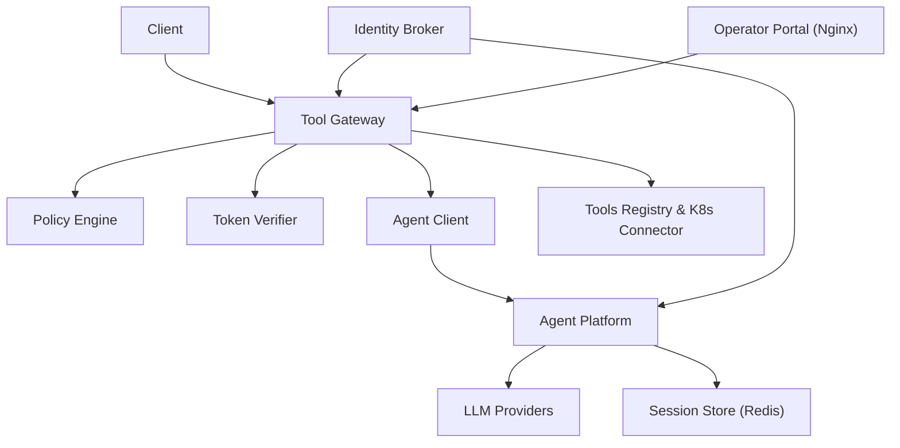
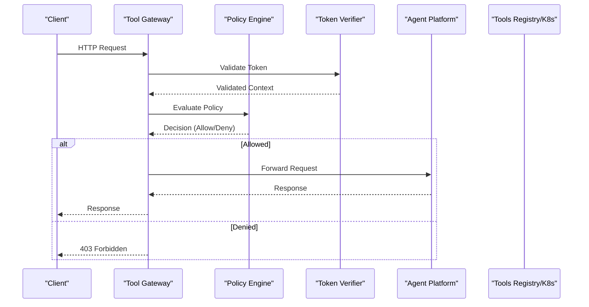
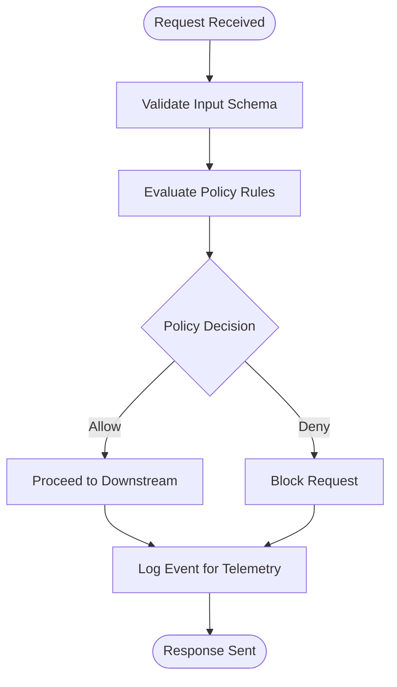
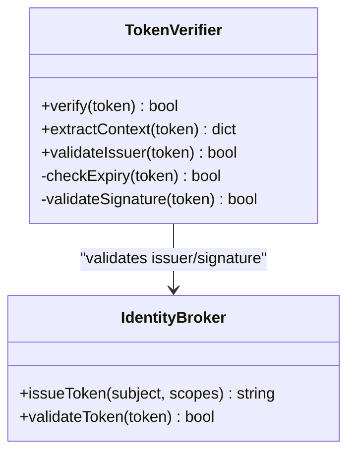
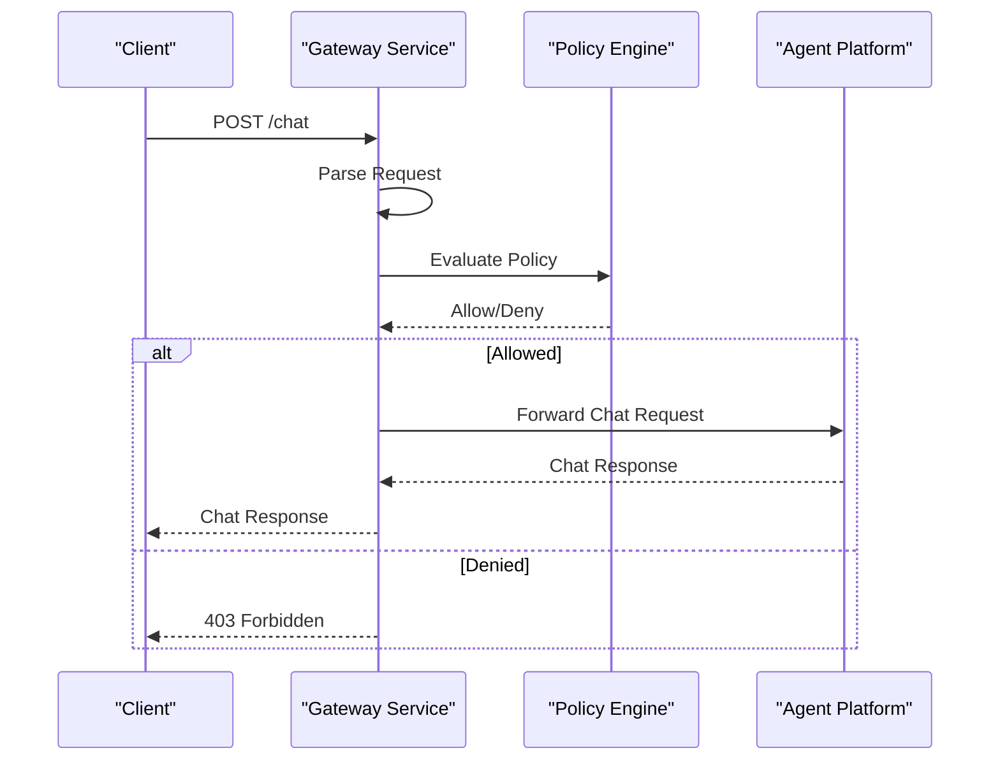
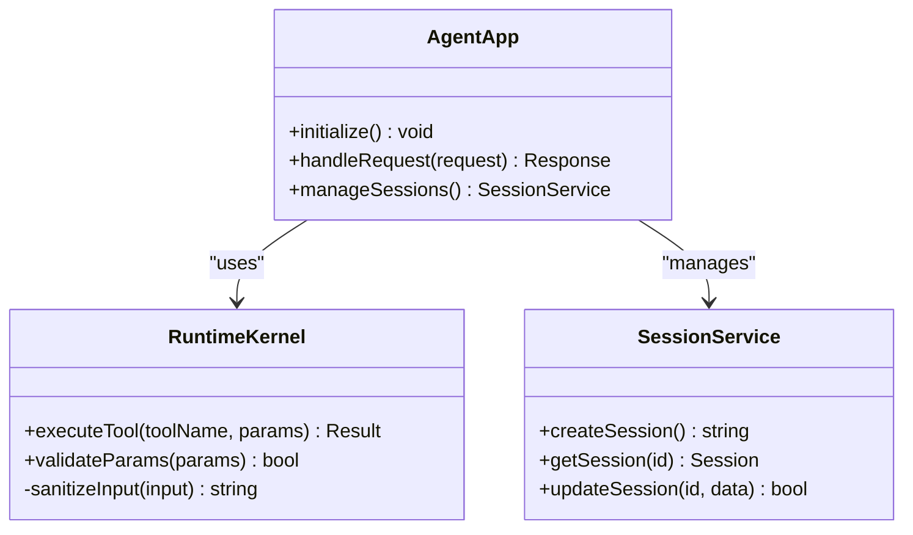
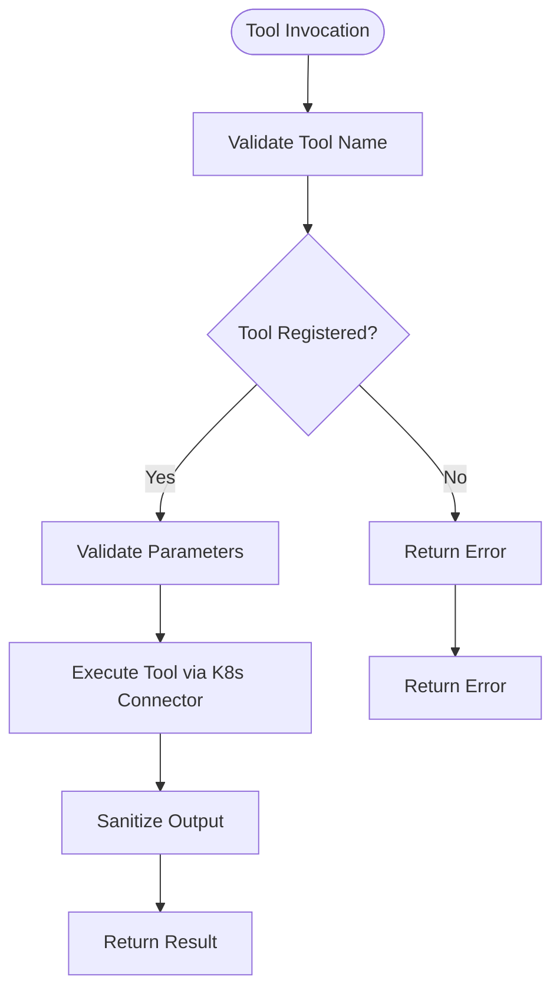
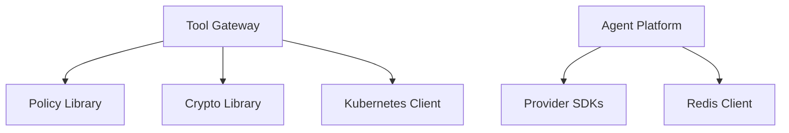

# Threat Modeling and Mitigation

<cite>
**Referenced Files in This Document**
- [README.md](file://README.md)
- [SECURITY.md](file://SECURITY.md)
- [policy-default.yaml](file://products/tool-gateway/src/api_gateway/policies/policy-default.yaml)
- [policy-engine.py](file://products/tool-gateway/src/api_gateway/services/policy_engine.py)
- [token_verifier.py](file://products/tool-gateway/src/api_gateway/services/token_verifier.py)
- [gateway_service.py](file://products/tool-gateway/src/api_gateway/services/gateway_service.py)
- [auth.py](file://products/tool-gateway/src/api_gateway/api/routes/auth.py)
- [chat.py](file://products/tool-gateway/src/api_gateway/api/routes/chat.py)
- [identity.py](file://products/tool-gateway/src/api_gateway/api/routes/identity.py)
- [runtime.py](file://products/tool-gateway/src/api_gateway/api/routes/runtime.py)
- [sessions.py](file://products/tool-gateway/src/api_gateway/api/routes/sessions.py)
- [tools.py](file://products/tool-gateway/src/api_gateway/api/routes/tools.py)
- [agent_client.py](file://products/tool-gateway/src/api_gateway/services/agent_client.py)
- [k8s_connector.py](file://products/tool-gateway/src/api_gateway/tools/k8s_connector.py)
- [registry.py](file://products/tool-gateway/src/api_gateway/tools/registry.py)
- [base.py](file://products/tool-gateway/src/api_gateway/tools/base.py)
- [config.py](file://products/tool-gateway/src/api_gateway/core/config.py)
- [observability.py](file://products/tool-gateway/src/api_gateway/core/observability.py)
- [metrics.py](file://products/tool-gateway/src/api_gateway/core/metrics.py)
- [telemetry.py](file://products/tool-gateway/src/api_gateway/core/telemetry.py)
- [request_context.py](file://products/tool-gateway/src/api_gateway/core/request_context.py)
- [app.py](file://products/tool-gateway/src/api_gateway/app.py)
- [main.py](file://products/tool-gateway/src/api_gateway/main.py)
- [api.py](file://products/tool-gateway/src/api_gateway/schemas/api.py)
- [test_policy_engine.py](file://products/tool-gateway/tests/test_policy_engine.py)
- [test_gateway_auth.py](file://products/tool-gateway/tests/test_gateway_auth.py)
- [test_policy_enforcement.py](file://products/tool-gateway/tests/test_policy_enforcement.py)
- [test_contracts.py](file://products/tool-gateway/tests/test_contracts.py)
- [test_tool_invoke.py](file://products/tool-gateway/tests/test_tool_invoke.py)
- [test_k8s_connector.py](file://products/tool-gateway/tests/test_k8s_connector.py)
- [test_observability.py](file://products/tool-gateway/tests/test_observability.py)
- [Dockerfile](file://products/tool-gateway/Dockerfile)
- [pyproject.toml](file://products/tool-gateway/pyproject.toml)
- [uv.lock](file://products/tool-gateway/uv.lock)
- [agent-service-deployment.yaml](file://shared/platform-ops/gitops/dev-k8s/base/agent-platform/agent-service-deployment.yaml)
- [api-gateway-deployment.yaml](file://shared/platform-ops/gitops/dev-k8s/base/tool-gateway/api-gateway-deployment.yaml)
- [rbac.yaml](file://shared/platform-ops/gitops/dev-k8s/base/tool-gateway/rbac.yaml)
- [policy.yaml](file://shared/platform-ops/gitops/dev-k8s/base/tool-gateway/policy.yaml)
- [runtime-config.env](file://shared/platform-ops/gitops/dev-k8s/base/tool-gateway/runtime-config.env)
- [identity-broker-deployment.yaml](file://shared/platform-ops/gitops/dev-k8s/base/identity-broker/identity-service-deployment.yaml)
- [redis-deployment.yaml](file://shared/platform-ops/gitops/dev-k8s/base/infra/redis-deployment.yaml)
- [web-ui-deployment.yaml](file://shared/platform-ops/gitops/dev-k8s/base/operator-portal/web-ui-deployment.yaml)
- [nginx.conf](file://products/operator-portal/nginx.conf)
- [Dockerfile](file://products/operator-portal/Dockerfile)
- [agent-app.py](file://products/agent-platform/src/agent_service/agent_app.py)
- [app.py](file://products/agent-platform/src/agent_service/app.py)
- [main.py](file://products/agent-platform/src/agent_service/main.py)
- [runtime_kernel.py](file://products/agent-platform/src/agent_service/runtime_kernel.py)
- [session_service.py](file://products/agent-platform/src/agent_service/services/session_service.py)
- [session_store.py](file://products/agent-platform/src/agent_service/services/session_store.py)
- [runtime_service.py](file://products/agent-platform/src/agent_service/services/runtime_service.py)
- [runtime_dependencies.py](file://products/agent-platform/src/agent_service/services/runtime_dependencies.py)
- [providers/openai.py](file://products/agent-platform/src/agent_service/providers/openai.py)
- [providers/dashscope.py](file://products/agent-platform/src/agent_service/providers/dashscope.py)
- [providers/deepseek.py](file://products/agent-platform/src/agent_service/providers/deepseek.py)
- [registry.py](file://products/agent-platform/src/agent_service/providers/registry.py)
- [gateway_tools.py](file://products/agent-platform/src/agent_service/tools/gateway_tools.py)
- [config.py](file://products/agent-platform/src/agent_service/core/config.py)
- [observability.py](file://products/agent-platform/src/agent_service/core/observability.py)
- [metrics.py](file://products/agent-platform/src/agent_service/core/metrics.py)
- [telemetry.py](file://products/agent-platform/src/agent_service/core/telemetry.py)
- [request_context.py](file://products/agent-platform/src/agent_service/core/request_context.py)
- [Dockerfile](file://products/agent-platform/Dockerfile)
- [pyproject.toml](file://products/agent-platform/pyproject.toml)
- [uv.lock](file://products/agent-platform/uv.lock)
- [identity_service.py](file://products/identity-broker/src/identity_service/services/identity_service.py)
- [token_service.py](file://products/identity-broker/src/identity_service/services/token_service.py)
- [auth.py](file://products/identity-broker/src/identity_service/api/routes/auth.py)
- [identity.py](file://products/identity-broker/src/identity_service/api/routes/identity.py)
- [app.py](file://products/identity-broker/src/identity_service/app.py)
- [main.py](file://products/identity-broker/src/identity_service/main.py)
- [config.py](file://products/identity-broker/src/identity_service/core/config.py)
- [observability.py](file://products/identity-broker/src/identity_service/core/observability.py)
- [metrics.py](file://products/identity-broker/src/identity_service/core/metrics.py)
- [telemetry.py](file://products/identity-broker/src/identity_service/core/telemetry.py)
- [Dockerfile](file://products/identity-broker/Dockerfile)
- [pyproject.toml](file://products/identity-broker/pyproject.toml)
- [uv.lock](file://products/identity-broker/uv.lock)
- [SPEC-003-identity-trust-hardening/spec.md](file://docs/specs/SPEC-003-identity-trust-hardening/spec.md)
- [SPEC-004-policy-enforcement/spec.md](file://docs/specs/SPEC-004-policy-enforcement/spec.md)
- [SPEC-005-observability-baseline/spec.md](file://docs/specs/SPEC-005-observability-baseline/spec.md)
- [SPEC-007-tool-execution-framework/spec.md](file://docs/specs/SPEC-007-tool-execution-framework/spec.md)
- [SPEC-008-service-to-service-identity/spec.md](file://docs/specs/SPEC-008-service-to-service-identity/spec.md)
- [authorization-matrix.md](file://docs/agentic-aiops-platform/authorization-matrix.md)
- [identity-and-authorization-design.md](file://docs/agentic-aiops-platform/identity-and-authorization-design.md)
- [policy-specification.md](file://docs/agentic-aiops-platform/policy-specification.md)
</cite>

## Table of Contents
1. [Introduction](#introduction)
2. [Project Structure](#project-structure)
3. [Core Components](#core-components)
4. [Architecture Overview](#architecture-overview)
5. [Detailed Component Analysis](#detailed-component-analysis)
6. [Dependency Analysis](#dependency-analysis)
7. [Performance Considerations](#performance-considerations)
8. [Troubleshooting Guide](#troubleshooting-guide)
9. [Conclusion](#conclusion)
10. [Appendices](#appendices)

## Introduction
This document provides a comprehensive threat modeling and mitigation guide for the Luban AIOps Platform. It focuses on identifying and mitigating threats such as API abuse, injection attacks, privilege escalation, and data exfiltration. It explains how the policy engine contributes to threat prevention and real-time attack detection, and it outlines secure configuration practices, input validation, output encoding, error handling, vulnerability scanning, penetration testing, supply chain security, dependency management, and container security best practices.

## Project Structure
The platform is composed of multiple services:
- Tool Gateway: API gateway with policy enforcement, token verification, tool invocation, and observability.
- Agent Platform: Runtime kernel, session management, provider integrations, and tool execution.
- Identity Broker: Authentication, authorization, and token issuance/validation.
- Operator Portal: Web UI served via Nginx.
- Shared contracts and policies define schemas and default policy rules.
- GitOps overlays deploy Kubernetes resources and runtime configurations.

**Diagram sources**
- [app.py](file://products/tool-gateway/src/api_gateway/app.py)
- [policy-engine.py](file://products/tool-gateway/src/api_gateway/services/policy_engine.py)
- [token_verifier.py](file://products/tool-gateway/src/api_gateway/services/token_verifier.py)
- [agent_client.py](file://products/tool-gateway/src/api_gateway/services/agent_client.py)
- [app.py](file://products/agent-platform/src/agent_service/app.py)
- [providers/openai.py](file://products/agent-platform/src/agent_service/providers/openai.py)
- [session_store.py](file://products/agent-platform/src/agent_service/services/session_store.py)
- [k8s_connector.py](file://products/tool-gateway/src/api_gateway/tools/k8s_connector.py)
- [auth.py](file://products/identity-broker/src/identity_service/api/routes/auth.py)

**Section sources**
- [README.md](file://README.md)
- [SECURITY.md](file://SECURITY.md)

## Core Components
Key components relevant to security and threat mitigation include:
- Policy Engine: Evaluates access control and runtime policies for requests and tool invocations.
- Token Verifier: Validates tokens from the Identity Broker and enforces trust boundaries.
- Gateway Service: Orchestrates request routing, policy checks, and downstream calls.
- Agent Client: Proxies requests to the Agent Platform with identity context propagation.
- Tools Registry and K8s Connector: Manage tool availability and execute privileged operations safely.
- Observability and Metrics: Provide telemetry for detecting anomalies and incidents.

**Section sources**
- [policy-engine.py](file://products/tool-gateway/src/api_gateway/services/policy_engine.py)
- [token_verifier.py](file://products/tool-gateway/src/api_gateway/services/token_verifier.py)
- [gateway_service.py](file://products/tool-gateway/src/api_gateway/services/gateway_service.py)
- [agent_client.py](file://products/tool-gateway/src/api_gateway/services/agent_client.py)
- [registry.py](file://products/tool-gateway/src/api_gateway/tools/registry.py)
- [k8s_connector.py](file://products/tool-gateway/src/api_gateway/tools/k8s_connector.py)
- [observability.py](file://products/tool-gateway/src/api_gateway/core/observability.py)
- [metrics.py](file://products/tool-gateway/src/api_gateway/core/metrics.py)

## Architecture Overview
The architecture emphasizes least privilege, centralized policy enforcement, and robust identity management. Requests flow through the Tool Gateway where they are authenticated, authorized, and evaluated against policies before being forwarded to the Agent Platform or tools. The Identity Broker issues and validates tokens, while the Operator Portal provides administrative capabilities.

**Diagram sources**
- [auth.py](file://products/tool-gateway/src/api_gateway/api/routes/auth.py)
- [policy-engine.py](file://products/tool-gateway/src/api_gateway/services/policy_engine.py)
- [token_verifier.py](file://products/tool-gateway/src/api_gateway/services/token_verifier.py)
- [agent_client.py](file://products/tool-gateway/src/api_gateway/services/agent_client.py)

## Detailed Component Analysis

### Policy Engine
The policy engine evaluates requests and tool invocations against defined policies to prevent unauthorized actions and enforce runtime constraints. It integrates with observability to support real-time detection.

**Diagram sources**
- [policy-engine.py](file://products/tool-gateway/src/api_gateway/services/policy_engine.py)
- [policy-default.yaml](file://products/tool-gateway/src/api_gateway/policies/policy-default.yaml)

**Section sources**
- [policy-engine.py](file://products/tool-gateway/src/api_gateway/services/policy_engine.py)
- [policy-default.yaml](file://products/tool-gateway/src/api_gateway/policies/policy-default.yaml)
- [test_policy_engine.py](file://products/tool-gateway/tests/test_policy_engine.py)
- [test_policy_enforcement.py](file://products/tool-gateway/tests/test_policy_enforcement.py)

### Token Verifier
The token verifier ensures that all incoming requests carry valid tokens issued by the Identity Broker. It enforces trust boundaries and propagates identity context.

**Diagram sources**
- [token_verifier.py](file://products/tool-gateway/src/api_gateway/services/token_verifier.py)
- [auth.py](file://products/identity-broker/src/identity_service/api/routes/auth.py)

**Section sources**
- [token_verifier.py](file://products/tool-gateway/src/api_gateway/services/token_verifier.py)
- [test_gateway_auth.py](file://products/tool-gateway/tests/test_gateway_auth.py)

### Gateway Service
The gateway service orchestrates authentication, policy evaluation, and forwarding to downstream services. It centralizes error handling and observability.

**Diagram sources**
- [gateway_service.py](file://products/tool-gateway/src/api_gateway/services/gateway_service.py)
- [chat.py](file://products/tool-gateway/src/api_gateway/api/routes/chat.py)

**Section sources**
- [gateway_service.py](file://products/tool-gateway/src/api_gateway/services/gateway_service.py)
- [chat.py](file://products/tool-gateway/src/api_gateway/api/routes/chat.py)

### Agent Platform
The agent platform manages runtime execution, sessions, and provider integrations. It executes tools and interacts with external LLM providers securely.

**Diagram sources**
- [agent-app.py](file://products/agent-platform/src/agent_service/agent_app.py)
- [runtime_kernel.py](file://products/agent-platform/src/agent_service/runtime_kernel.py)
- [session_service.py](file://products/agent-platform/src/agent_service/services/session_service.py)

**Section sources**
- [agent-app.py](file://products/agent-platform/src/agent_service/agent_app.py)
- [runtime_kernel.py](file://products/agent-platform/src/agent_service/runtime_kernel.py)
- [session_service.py](file://products/agent-platform/src/agent_service/services/session_service.py)

### Tools Registry and K8s Connector
The tools registry manages available tools, while the K8s connector executes privileged operations within Kubernetes clusters. Both require strict input validation and least privilege.

**Diagram sources**
- [registry.py](file://products/tool-gateway/src/api_gateway/tools/registry.py)
- [k8s_connector.py](file://products/tool-gateway/src/api_gateway/tools/k8s_connector.py)

**Section sources**
- [registry.py](file://products/tool-gateway/src/api_gateway/tools/registry.py)
- [k8s_connector.py](file://products/tool-gateway/src/api_gateway/tools/k8s_connector.py)
- [test_tool_invoke.py](file://products/tool-gateway/tests/test_tool_invoke.py)
- [test_k8s_connector.py](file://products/tool-gateway/tests/test_k8s_connector.py)

## Dependency Analysis
Security-critical dependencies include token libraries, policy engines, and Kubernetes clients. Ensure these are updated and scanned regularly.

**Diagram sources**
- [pyproject.toml](file://products/tool-gateway/pyproject.toml)
- [uv.lock](file://products/tool-gateway/uv.lock)
- [pyproject.toml](file://products/agent-platform/pyproject.toml)
- [uv.lock](file://products/agent-platform/uv.lock)

**Section sources**
- [pyproject.toml](file://products/tool-gateway/pyproject.toml)
- [uv.lock](file://products/tool-gateway/uv.lock)
- [pyproject.toml](file://products/agent-platform/pyproject.toml)
- [uv.lock](file://products/agent-platform/uv.lock)

## Performance Considerations
- Use caching for policy decisions when appropriate to reduce latency.
- Implement rate limiting at the gateway to prevent abuse.
- Optimize token verification with short-lived tokens and refresh mechanisms.
- Monitor resource usage and set alerts for anomalies.

[No sources needed since this section provides general guidance]

## Troubleshooting Guide
Common issues include invalid tokens, policy denials, and tool execution failures. Use observability and metrics to diagnose problems.

- Verify token validity and issuer configuration.
- Review policy rules for overly restrictive settings.
- Check tool permissions and Kubernetes RBAC configurations.
- Analyze logs and traces for error patterns.

**Section sources**
- [observability.py](file://products/tool-gateway/src/api_gateway/core/observability.py)
- [metrics.py](file://products/tool-gateway/src/api_gateway/core/metrics.py)
- [test_observability.py](file://products/tool-gateway/tests/test_observability.py)

## Conclusion
The Luban AIOps Platform implements robust security controls through centralized policy enforcement, token verification, and least privilege principles. Continuous monitoring, secure configuration, and regular security assessments are essential to maintain a strong security posture.

[No sources needed since this section summarizes without analyzing specific files]

## Appendices

### Threat Assessment Procedures
- Identify assets and data flows.
- Map potential threats using STRIDE methodology.
- Assess risk levels and prioritize mitigations.
- Validate controls through testing and audits.

[No sources needed since this section provides general guidance]

### Vulnerability Scanning Guidelines
- Scan dependencies regularly using automated tools.
- Integrate scanning into CI/CD pipelines.
- Address critical and high vulnerabilities promptly.
- Maintain an inventory of known vulnerabilities.

[No sources needed since this section provides general guidance]

### Penetration Testing Methodologies
- Conduct regular penetration tests focusing on APIs and authentication.
- Simulate common attack vectors like injection and privilege escalation.
- Test container security and Kubernetes configurations.
- Document findings and remediate issues.

[No sources needed since this section provides general guidance]

### Supply Chain Security
- Pin dependencies to specific versions.
- Use signed containers and verify signatures.
- Monitor for new vulnerabilities in dependencies.
- Implement SBOM generation and analysis.

[No sources needed since this section provides general guidance]

### Container Security Best Practices
- Use minimal base images.
- Run containers as non-root users.
- Scan images for vulnerabilities.
- Limit container privileges and capabilities.

[No sources needed since this section provides general guidance]