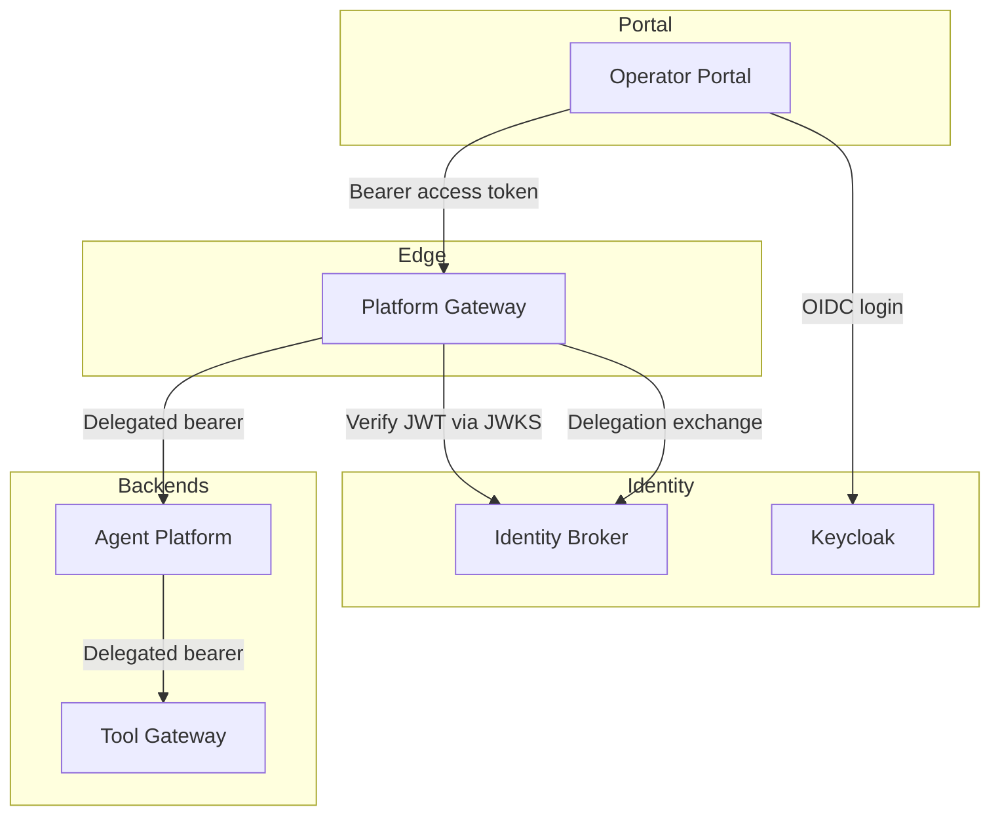
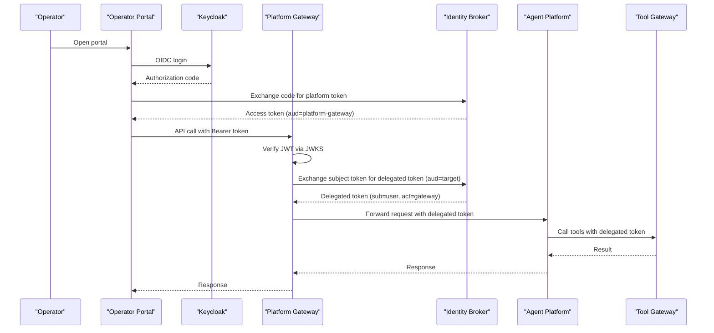
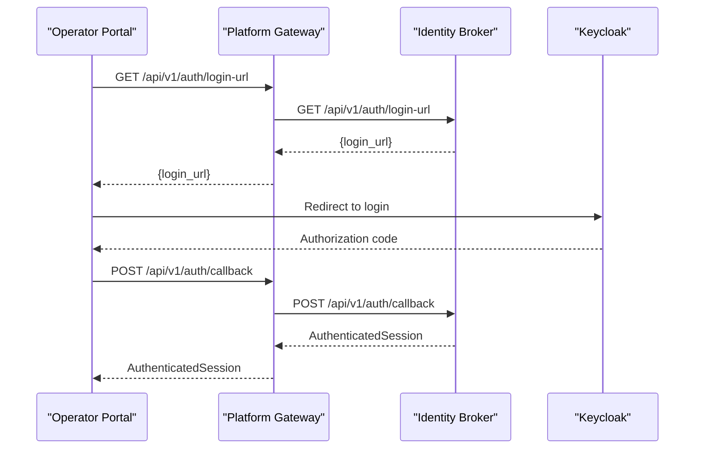
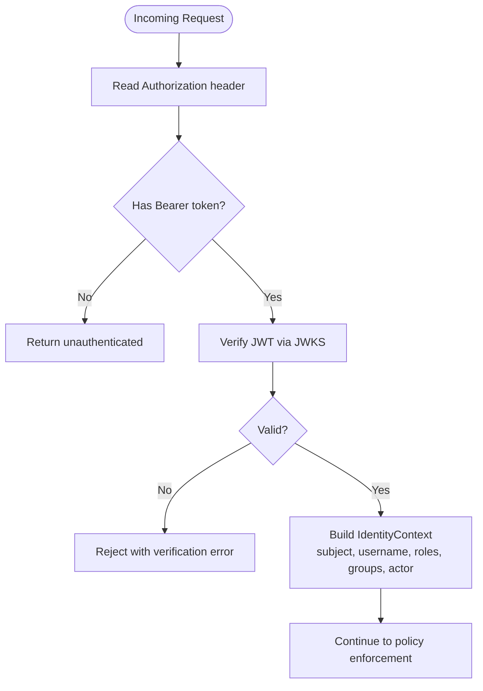
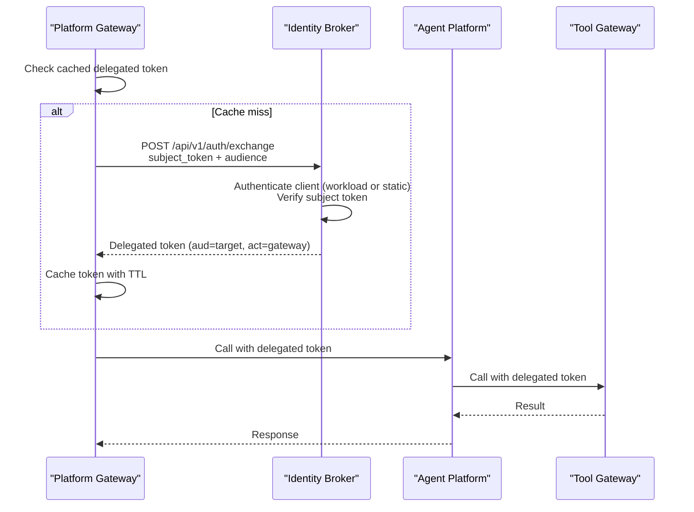
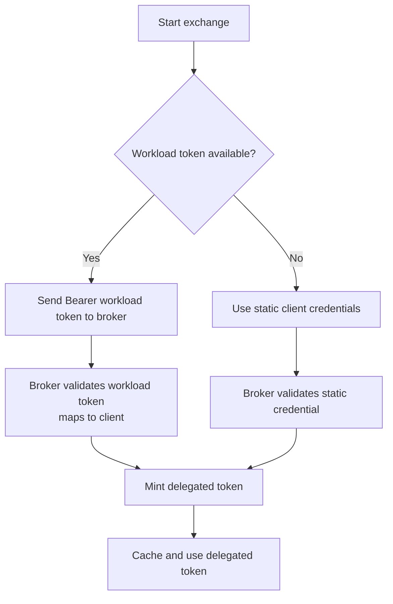
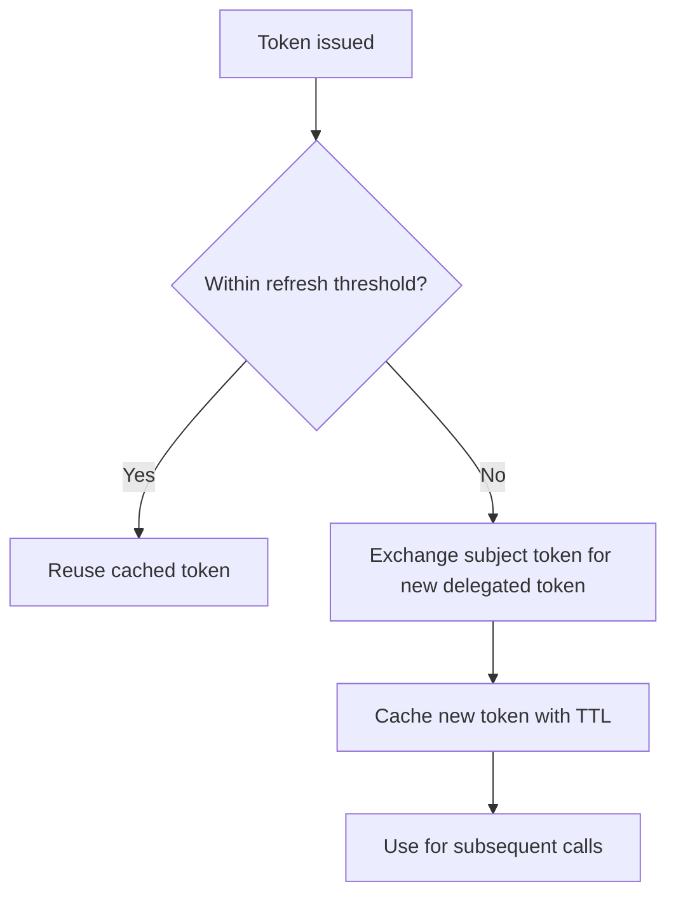
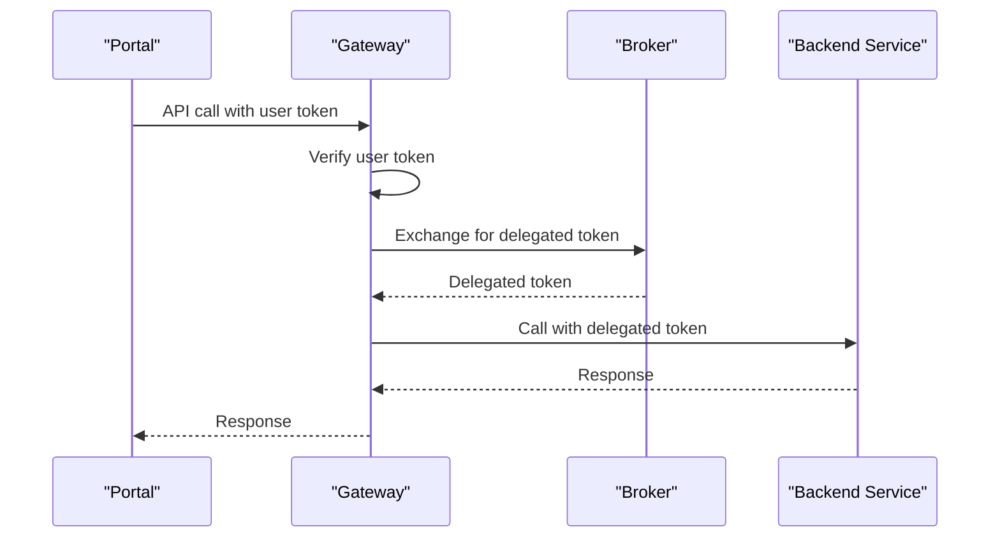
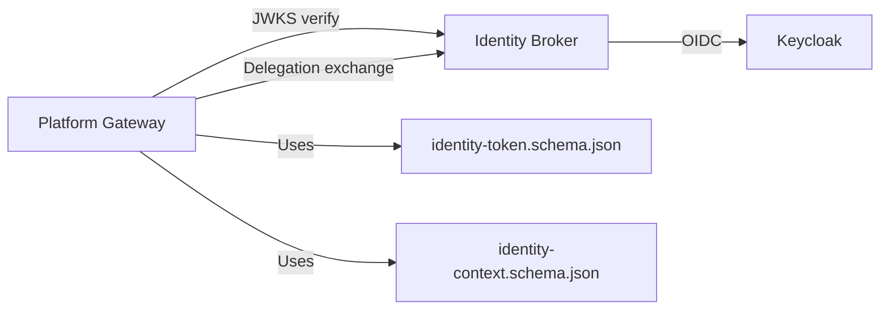

# Authentication Flows

<cite>
**Referenced Files in This Document**
- [identity-and-authorization-design.md](file://docs/agentic-aiops-platform/identity-and-authorization-design.md)
- [0004-broker-mediated-token-delegation.md](file://docs/adr/0004-broker-mediated-token-delegation.md)
- [identity-token.schema.json](file://shared/shared-contracts/schemas/identity-token.schema.json)
- [identity-context.schema.json](file://shared/shared-contracts/schemas/identity-context.schema.json)
- [auth.py (identity broker)](file://products/identity-broker/src/identity_service/api/routes/auth.py)
- [exchange_service.py](file://products/identity-broker/src/identity_service/services/exchange_service.py)
- [token_service.py](file://products/identity-broker/src/identity_service/services/token_service.py)
- [config.py (identity broker)](file://products/identity-broker/src/identity_service/core/config.py)
- [auth.py (platform gateway)](file://products/platform-gateway/src/platform_gateway/api/routes/auth.py)
- [delegation_client.py](file://products/platform-gateway/src/platform_gateway/services/delegation_client.py)
- [token_verifier.py](file://products/platform-gateway/src/platform_gateway/services/token_verifier.py)
- [config.py (platform gateway)](file://products/platform-gateway/src/platform_gateway/core/config.py)
</cite>

## Table of Contents
1. Introduction
2. Project Structure
3. Core Components
4. Architecture Overview
5. Detailed Component Analysis
6. Dependency Analysis
7. Performance Considerations
8. Troubleshooting Guide
9. Conclusion
10. Appendices

## Introduction
This document explains the Luban AIOPS authentication flows, focusing on Keycloak OIDC integration for operator portal login, broker-mediated token delegation for service-to-service calls, and workload identity propagation. It covers how the identity broker handles SSO, issues short-lived audience-bound tokens, and maintains session context across the platform. The multi-leg flow from the operator portal through the platform gateway to backend services is detailed, along with configuration guidance, token lifecycle management, refresh strategies, error handling, and extension points for custom authentication providers.

## Project Structure
The authentication surface spans three primary components:
- Operator portal: initiates Keycloak OIDC login and holds a user session.
- Platform gateway: validates user tokens locally via JWKS, enforces authorization, and obtains delegated tokens for downstream tool execution.
- Identity broker: issues platform JWTs, exposes JWKS, and performs broker-mediated token exchange for service-to-service delegation.

**Diagram sources**
- [auth.py (platform gateway):21-57](file://products/platform-gateway/src/platform_gateway/api/routes/auth.py#L21-L57)
- [auth.py (identity broker):34-111](file://products/identity-broker/src/identity_service/api/routes/auth.py#L34-L111)
- [delegation_client.py:78-101](file://products/platform-gateway/src/platform_gateway/services/delegation_client.py#L78-L101)
- [token_verifier.py:52-89](file://products/platform-gateway/src/platform_gateway/services/token_verifier.py#L52-L89)

**Section sources**
- [identity-and-authorization-design.md:60-133](file://docs/agentic-aiops-platform/identity-and-authorization-design.md#L60-L133)
- [auth.py (platform gateway):21-57](file://products/platform-gateway/src/platform_gateway/api/routes/auth.py#L21-L57)
- [auth.py (identity broker):34-111](file://products/identity-broker/src/identity_service/api/routes/auth.py#L34-L111)

## Core Components
- Identity broker:
  - Issues platform JWTs bound to an audience and supports RFC 8693 actor claim on delegated tokens.
  - Exposes JWKS for local verification by the gateway.
  - Provides an exchange endpoint that authenticates callers via static credentials or projected workload tokens and mints short-lived delegated tokens.
- Platform gateway:
  - Verifies incoming user tokens locally using JWKS.
  - Caches per-user delegated tokens and exchanges them when needed for tool invocation.
  - Normalizes identity into a structured context including optional actor attribution.
- Shared contracts:
  - Define the shape of identity tokens and identity contexts consumed across services.

**Section sources**
- [token_service.py:83-126](file://products/identity-broker/src/identity_service/services/token_service.py#L83-L126)
- [exchange_service.py:148-195](file://products/identity-broker/src/identity_service/services/exchange_service.py#L148-L195)
- [token_verifier.py:52-89](file://products/platform-gateway/src/platform_gateway/services/token_verifier.py#L52-L89)
- [identity-token.schema.json:1-56](file://shared/shared-contracts/schemas/identity-token.schema.json#L1-L56)
- [identity-context.schema.json:1-37](file://shared/shared-contracts/schemas/identity-context.schema.json#L1-L37)

## Architecture Overview
The platform uses Keycloak as the enterprise identity provider and the identity broker as the issuer of platform-scoped JWTs. The gateway validates tokens locally and delegates authority for service-to-service calls through short-lived, audience-bound tokens.

**Diagram sources**
- [auth.py (identity broker):34-111](file://products/identity-broker/src/identity_service/api/routes/auth.py#L34-L111)
- [auth.py (platform gateway):21-57](file://products/platform-gateway/src/platform_gateway/api/routes/auth.py#L21-L57)
- [delegation_client.py:78-101](file://products/platform-gateway/src/platform_gateway/services/delegation_client.py#L78-L101)
- [exchange_service.py:148-195](file://products/identity-broker/src/identity_service/services/exchange_service.py#L148-L195)
- [token_verifier.py:52-89](file://products/platform-gateway/src/platform_gateway/services/token_verifier.py#L52-L89)

## Detailed Component Analysis

### Keycloak OIDC Login Flow (Operator Portal)
- The portal requests a login URL or starts login via the gateway’s auth endpoints.
- The gateway proxies to the identity broker, which builds the Keycloak authorization URL.
- After Keycloak authentication, the portal exchanges the authorization code at the broker to obtain a platform access token.
- The portal stores the token and includes it in subsequent API calls to the gateway.

**Diagram sources**
- [auth.py (platform gateway):21-57](file://products/platform-gateway/src/platform_gateway/api/routes/auth.py#L21-L57)
- [auth.py (identity broker):34-71](file://products/identity-broker/src/identity_service/api/routes/auth.py#L34-L71)

**Section sources**
- [identity-and-authorization-design.md:123-133](file://docs/agentic-aiops-platform/identity-and-authorization-design.md#L123-L133)
- [auth.py (platform gateway):21-57](file://products/platform-gateway/src/platform_gateway/api/routes/auth.py#L21-L57)
- [auth.py (identity broker):34-71](file://products/identity-broker/src/identity_service/api/routes/auth.py#L34-L71)

### Token Verification at the Platform Gateway
- The gateway verifies incoming bearer tokens locally using the broker’s JWKS.
- It requires issuer, audience, and expiration claims and extracts normalized identity fields, including optional actor attribution from delegated tokens.

**Diagram sources**
- [token_verifier.py:52-89](file://products/platform-gateway/src/platform_gateway/services/token_verifier.py#L52-L89)
- [identity-context.schema.json:1-37](file://shared/shared-contracts/schemas/identity-context.schema.json#L1-L37)

**Section sources**
- [token_verifier.py:52-89](file://products/platform-gateway/src/platform_gateway/services/token_verifier.py#L52-L89)
- [identity-context.schema.json:1-37](file://shared/shared-contracts/schemas/identity-context.schema.json#L1-L37)

### Broker-Mediated Token Delegation (Service-to-Service)
- Before calling agent-platform/tool-gateway, the gateway exchanges the verified user token for a short-lived delegated token at the identity broker.
- The delegated token binds the audience to the target service and carries an actor claim identifying the acting service.
- The gateway caches delegated tokens per user subject to reduce broker calls.

**Diagram sources**
- [delegation_client.py:78-101](file://products/platform-gateway/src/platform_gateway/services/delegation_client.py#L78-L101)
- [auth.py (identity broker):114-183](file://products/identity-broker/src/identity_service/api/routes/auth.py#L114-L183)
- [exchange_service.py:148-195](file://products/identity-broker/src/identity_service/services/exchange_service.py#L148-L195)

**Section sources**
- [0004-broker-mediated-token-delegation.md:24-45](file://docs/adr/0004-broker-mediated-token-delegation.md#L24-L45)
- [delegation_client.py:78-101](file://products/platform-gateway/src/platform_gateway/services/delegation_client.py#L78-L101)
- [auth.py (identity broker):114-183](file://products/identity-broker/src/identity_service/api/routes/auth.py#L114-L183)
- [exchange_service.py:148-195](file://products/identity-broker/src/identity_service/services/exchange_service.py#L148-L195)

### Workload Identity Propagation
- The gateway can authenticate to the broker using a Kubernetes projected service-account token instead of static credentials.
- The broker validates the workload token against the cluster OIDC issuer and maps the subject to a registered client with allowed audiences.
- If the projected token is unavailable, the gateway falls back to static credentials with a one-time warning.

**Diagram sources**
- [delegation_client.py:103-126](file://products/platform-gateway/src/platform_gateway/services/delegation_client.py#L103-L126)
- [exchange_service.py:83-120](file://products/identity-broker/src/identity_service/services/exchange_service.py#L83-L120)

**Section sources**
- [delegation_client.py:103-126](file://products/platform-gateway/src/platform_gateway/services/delegation_client.py#L103-L126)
- [exchange_service.py:83-120](file://products/identity-broker/src/identity_service/services/exchange_service.py#L83-L120)

### Token Lifecycle and Refresh Strategy
- Platform tokens are issued with a configurable TTL and audience binding.
- Delegated tokens have a shorter TTL and include an actor claim for audit attribution.
- The gateway caches delegated tokens per user and refreshes before expiry based on a configured fraction of TTL.
- The portal can refresh tokens via the broker’s refresh endpoint.

**Diagram sources**
- [delegation_client.py:37-76](file://products/platform-gateway/src/platform_gateway/services/delegation_client.py#L37-L76)
- [token_service.py:83-126](file://products/identity-broker/src/identity_service/services/token_service.py#L83-L126)
- [auth.py (identity broker):214-231](file://products/identity-broker/src/identity_service/api/routes/auth.py#L214-L231)

**Section sources**
- [delegation_client.py:37-76](file://products/platform-gateway/src/platform_gateway/services/delegation_client.py#L37-L76)
- [token_service.py:83-126](file://products/identity-broker/src/identity_service/services/token_service.py#L83-L126)
- [auth.py (identity broker):214-231](file://products/identity-broker/src/identity_service/api/routes/auth.py#L214-L231)

### Multi-Leg Authentication Summary
- Leg 1: Operator portal authenticates via Keycloak OIDC and obtains a platform access token.
- Leg 2: Platform gateway validates the user token locally using JWKS.
- Leg 3: Gateway exchanges the user token for a short-lived delegated token bound to the target service.
- Leg 4: Backend services receive the delegated token and enforce audience and role checks.

**Diagram sources**
- [auth.py (platform gateway):21-57](file://products/platform-gateway/src/platform_gateway/api/routes/auth.py#L21-L57)
- [token_verifier.py:52-89](file://products/platform-gateway/src/platform_gateway/services/token_verifier.py#L52-L89)
- [delegation_client.py:78-101](file://products/platform-gateway/src/platform_gateway/services/delegation_client.py#L78-L101)
- [auth.py (identity broker):114-183](file://products/identity-broker/src/identity_service/api/routes/auth.py#L114-L183)

**Section sources**
- [identity-and-authorization-design.md:123-133](file://docs/agentic-aiops-platform/identity-and-authorization-design.md#L123-L133)
- [auth.py (platform gateway):21-57](file://products/platform-gateway/src/platform_gateway/api/routes/auth.py#L21-L57)
- [token_verifier.py:52-89](file://products/platform-gateway/src/platform_gateway/services/token_verifier.py#L52-L89)
- [delegation_client.py:78-101](file://products/platform-gateway/src/platform_gateway/services/delegation_client.py#L78-L101)
- [auth.py (identity broker):114-183](file://products/identity-broker/src/identity_service/api/routes/auth.py#L114-L183)

## Dependency Analysis
- The platform gateway depends on the identity broker for JWKS and token exchange.
- The identity broker depends on Keycloak for OIDC flows and optionally on external directories via Keycloak federation.
- Shared schemas define token and identity context contracts used across components.

**Diagram sources**
- [token_verifier.py:25-34](file://products/platform-gateway/src/platform_gateway/services/token_verifier.py#L25-L34)
- [delegation_client.py:78-101](file://products/platform-gateway/src/platform_gateway/services/delegation_client.py#L78-L101)
- [auth.py (identity broker):34-111](file://products/identity-broker/src/identity_service/api/routes/auth.py#L34-L111)
- [identity-token.schema.json:1-56](file://shared/shared-contracts/schemas/identity-token.schema.json#L1-L56)
- [identity-context.schema.json:1-37](file://shared/shared-contracts/schemas/identity-context.schema.json#L1-L37)

**Section sources**
- [token_verifier.py:25-34](file://products/platform-gateway/src/platform_gateway/services/token_verifier.py#L25-L34)
- [delegation_client.py:78-101](file://products/platform-gateway/src/platform_gateway/services/delegation_client.py#L78-L101)
- [auth.py (identity broker):34-111](file://products/identity-broker/src/identity_service/api/routes/auth.py#L34-L111)
- [identity-token.schema.json:1-56](file://shared/shared-contracts/schemas/identity-token.schema.json#L1-L56)
- [identity-context.schema.json:1-37](file://shared/shared-contracts/schemas/identity-context.schema.json#L1-L37)

## Performance Considerations
- Local JWT verification via JWKS avoids per-request introspection and reduces latency.
- Delegated token caching per user minimizes broker calls; refresh occurs before expiry based on a configured fraction.
- Workload identity reduces credential management overhead and improves security posture.

[No sources needed since this section provides general guidance]

## Troubleshooting Guide
Common authentication failures and their likely causes:
- Invalid issuer or audience: Ensure the token issuer matches the configured identity token issuer and the audience matches the expected value for the component.
- Expired token: Refresh the token or re-exchange for a new delegated token.
- Unauthorized audience for client: Confirm the requested audience is permitted for the authenticated client or workload subject.
- Missing or invalid service credentials: Provide either a valid projected workload token or correct static client credentials.

Error surfaces:
- Gateway token verification errors raise a specific exception type indicating the failure reason.
- Broker exchange errors return HTTP status codes with details for credential or subject verification failures.

**Section sources**
- [token_verifier.py:44-89](file://products/platform-gateway/src/platform_gateway/services/token_verifier.py#L44-L89)
- [exchange_service.py:33-57](file://products/identity-broker/src/identity_service/services/exchange_service.py#L33-L57)
- [auth.py (identity broker):114-183](file://products/identity-broker/src/identity_service/api/routes/auth.py#L114-L183)

## Conclusion
The Luban AIOPS platform secures operator access through Keycloak OIDC and enforces strict boundaries at the platform gateway using local JWT verification. Broker-mediated token delegation ensures that service-to-service calls carry minimal, audience-bound authority with clear actor attribution. Workload identity further strengthens security by replacing static credentials where possible. Together, these mechanisms provide a robust, auditable, and scalable authentication model for the platform.

[No sources needed since this section summarizes without analyzing specific files]

## Appendices

### Configuration Examples
- Keycloak realm and clients:
  - Configure a realm for the platform and register clients for the portal and internal services.
  - Set redirect URIs to match the portal callback and any internal OAuth flows.
- Identity broker settings:
  - Set the Keycloak base URL, realm, OIDC client ID, scopes, and redirect URIs.
  - Configure JWT issuer, audience, TTL, and delegated token TTL.
  - Register service clients with allowed audiences or map workload subjects to clients.
- Platform gateway settings:
  - Configure JWKS URL, token issuer, audience, and whether authentication is required.
  - Provide service client credentials or a workload token path for delegation.
  - Optionally configure timeouts and proxy URLs for downstream services.

**Section sources**
- [config.py (identity broker):100-169](file://products/identity-broker/src/identity_service/core/config.py#L100-L169)
- [config.py (platform gateway):23-131](file://products/platform-gateway/src/platform_gateway/core/config.py#L23-L131)

### Extending the Identity Broker
- Add new identity sources by integrating additional OIDC providers into Keycloak and mapping claims to platform roles.
- Extend service client registration to support new audiences or workload subjects.
- Implement custom claim transformations in the broker to normalize upstream group memberships into platform roles.

**Section sources**
- [identity-and-authorization-design.md:60-112](file://docs/agentic-aiops-platform/identity-and-authorization-design.md#L60-L112)
- [config.py (identity broker):21-97](file://products/identity-broker/src/identity_service/core/config.py#L21-L97)