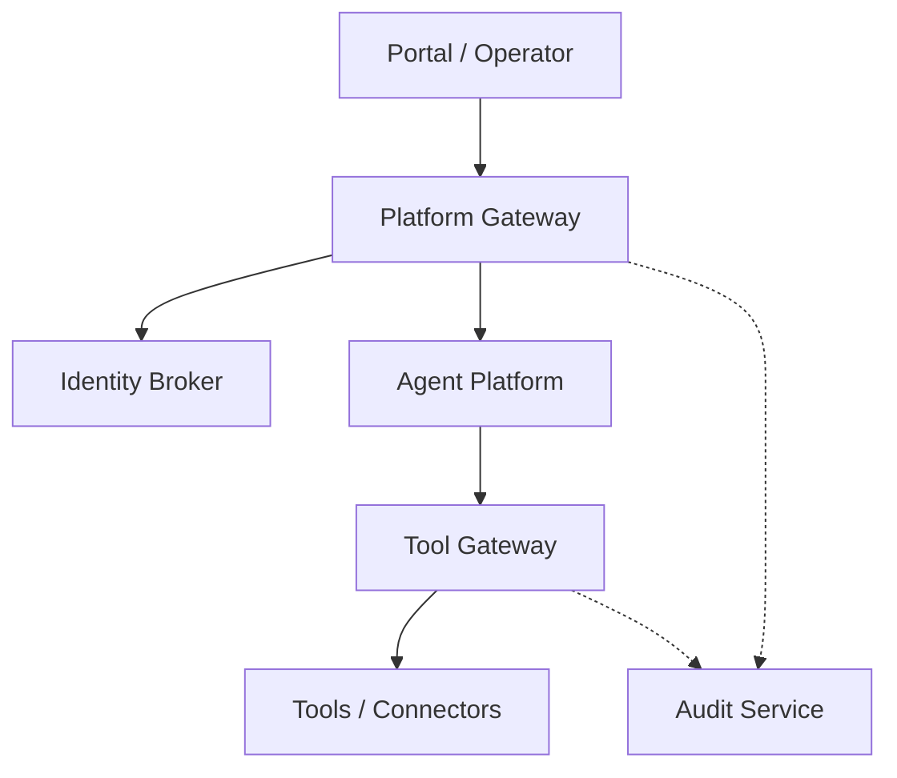
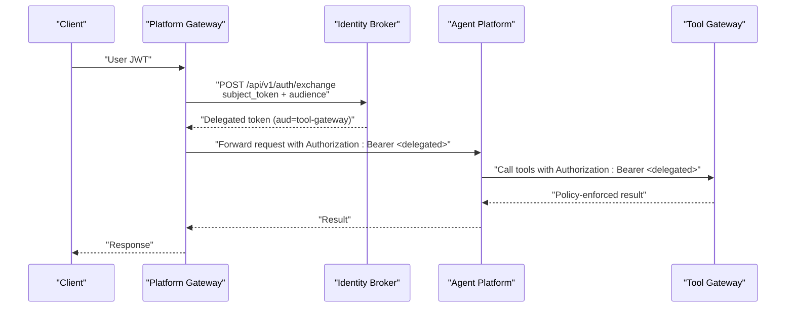
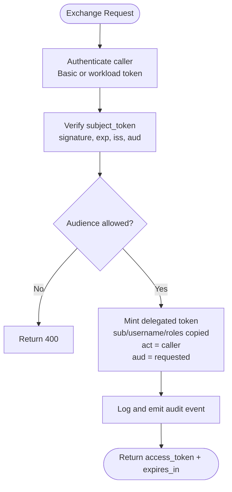
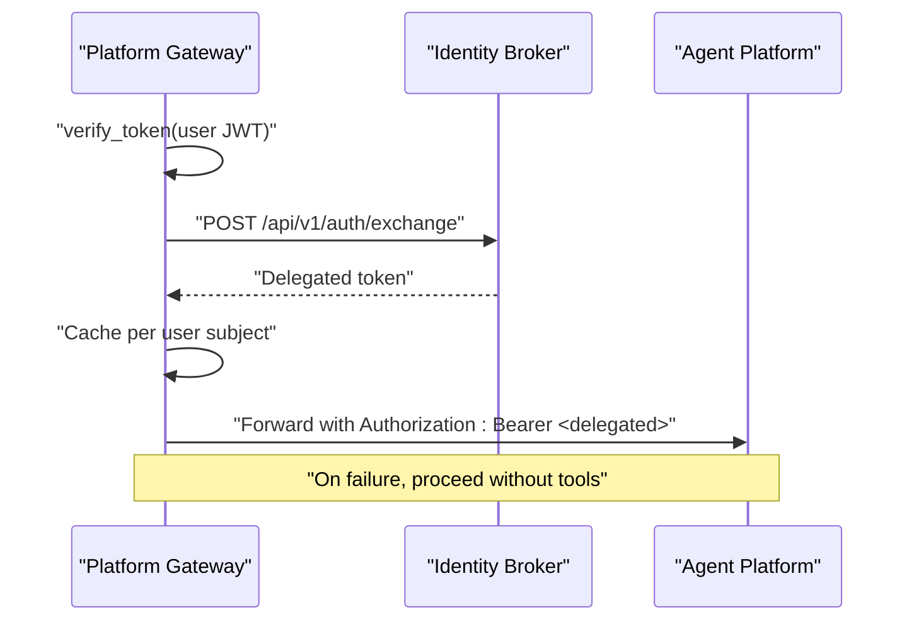
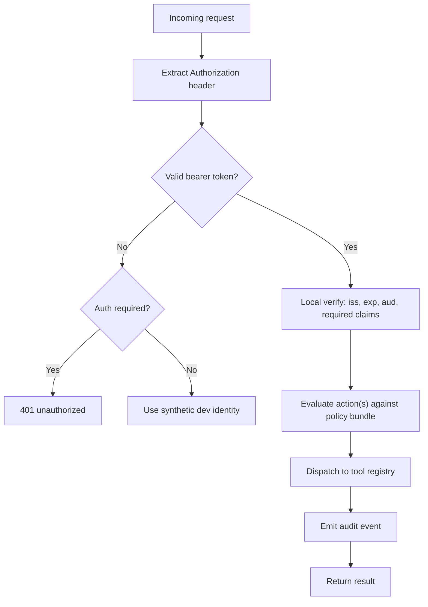
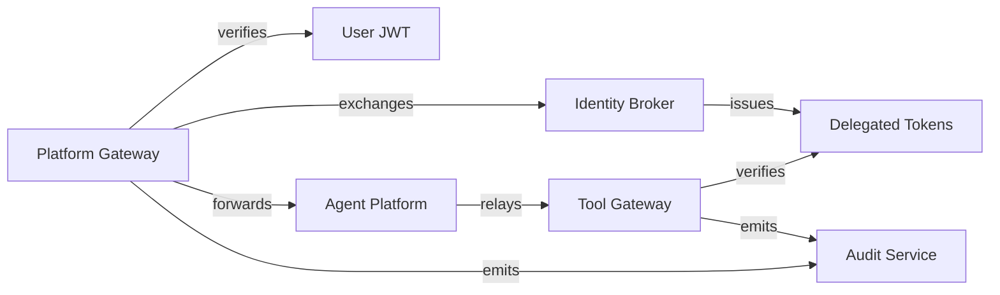

# Service-to-Service Authentication

<cite>
**Referenced Files in This Document**
- [ADR-0004](file://docs/adr/0004-broker-mediated-token-delegation.md)
- [SPEC-008 spec](file://docs/specs/SPEC-008-service-to-service-identity/spec.md)
- [SPEC-008 plan](file://docs/specs/SPEC-008-service-to-service-identity/plan.md)
- [Identity token schema](file://shared/shared-contracts/schemas/identity-token.schema.json)
- [Exchange service](file://products/identity-broker/src/identity_service/services/exchange_service.py)
- [Auth route (exchange)](file://products/identity-broker/src/identity_service/api/routes/auth.py)
- [Delegation client](file://products/platform-gateway/src/platform_gateway/services/delegation_client.py)
- [Gateway token verifier](file://products/platform-gateway/src/platform_gateway/services/token_verifier.py)
- [Platform gateway tools route](file://products/platform-gateway/src/platform_gateway/api/routes/tools.py)
- [Tool gateway identity resolution](file://products/tool-gateway/src/tool_gateway/services/gateway_service.py)
- [Tool gateway request context](file://products/tool-gateway/src/tool_gateway/core/request_context.py)
- [Execution worker handoff client](file://products/agent-platform/src/agent_service/services/execution_worker_client.py)
- [Platform gateway README](file://products/platform-gateway/README.md)
- [Platform gateway metrics](file://products/platform-gateway/src/platform_gateway/core/metrics.py)
- [Audit ingest route](file://products/audit-service/src/audit_service/api/routes/ingest.py)
</cite>

## Table of Contents
1. Introduction
2. Project Structure
3. Core Components
4. Architecture Overview
5. Detailed Component Analysis
6. Dependency Analysis
7. Performance Considerations
8. Troubleshooting Guide
9. Conclusion
10. Appendices

## Introduction
This document explains how Luban AIOPS performs service-to-service authentication using broker-mediated token delegation. The identity broker issues short-lived, audience-bound delegated tokens that propagate a user’s identity into downstream services with least privilege. The platform gateway exchanges a verified user token for a delegated token and forwards it to agent-platform; agent-platform relays it when calling tool-gateway. Tool-gateway verifies the delegated token locally and enforces policy based on roles carried by the token. The design ensures that no broad user credential is exposed to less-trusted processes and that every hop is auditable.

## Project Structure
The implementation spans several products:
- Identity broker: exposes an exchange endpoint and mints delegated tokens.
- Platform gateway: validates user tokens, obtains delegated tokens from the broker, caches them per user, and forwards them to agent-platform.
- Agent platform: relays delegated tokens when invoking tools through tool-gateway.
- Tool gateway: verifies delegated tokens locally, enforces policies, and executes tools.
- Audit service: ingests audit events emitted by platform services.

**Diagram sources**
- [Delegation client](file://products/platform-gateway/src/platform_gateway/services/delegation_client.py)
- [Exchange service](file://products/identity-broker/src/identity_service/services/exchange_service.py)
- [Tool gateway identity resolution](file://products/tool-gateway/src/tool_gateway/services/gateway_service.py)
- [Audit ingest route](file://products/audit-service/src/audit_service/api/routes/ingest.py)

**Section sources**
- [Platform gateway README](file://products/platform-gateway/README.md)

## Core Components
- Identity broker exchange service authenticates callers via static Basic credentials or projected workload tokens, verifies the subject token against the broker’s signing key, checks audience allow-lists, and mints a short-lived delegated token carrying the user’s sub, username, roles, and an actor claim identifying the acting service.
- Platform gateway delegation client obtains delegated tokens from the broker, caches them per user subject with near-expiry refresh, and injects Authorization headers when proxying to agent-platform. It also supports a synthetic dev identity path for development.
- Tool gateway resolves identity from bearer tokens, enforces audience, evaluates policy actions, and emits audit events.
- Agent platform execution worker client demonstrates how delegated tokens are passed along internal handoff boundaries without logging secrets.

**Section sources**
- [Exchange service](file://products/identity-broker/src/identity_service/services/exchange_service.py)
- [Delegation client](file://products/platform-gateway/src/platform_gateway/services/delegation_client.py)
- [Tool gateway identity resolution](file://products/tool-gateway/src/tool_gateway/services/gateway_service.py)
- [Execution worker handoff client](file://products/agent-platform/src/agent_service/services/execution_worker_client.py)

## Architecture Overview
The multi-leg authentication flow:
1. Portal presents a verified user JWT to the platform gateway.
2. Platform gateway exchanges the user JWT at the identity broker for a delegated token scoped to tool-gateway with a short TTL.
3. Platform gateway forwards the delegated token to agent-platform as Authorization: Bearer.
4. Agent-platform relays the delegated token when calling tool-gateway.
5. Tool-gateway verifies the delegated token locally, enforces policy, and executes tools.

**Diagram sources**
- [Delegation client](file://products/platform-gateway/src/platform_gateway/services/delegation_client.py)
- [Exchange service](file://products/identity-broker/src/identity_service/services/exchange_service.py)
- [Tool gateway identity resolution](file://products/tool-gateway/src/tool_gateway/services/gateway_service.py)

**Section sources**
- [ADR-0004](file://docs/adr/0004-broker-mediated-token-delegation.md)
- [SPEC-008 spec](file://docs/specs/SPEC-008-service-to-service-identity/spec.md)

## Detailed Component Analysis

### Identity Broker: Token Exchange
- Accepts POST /api/v1/auth/exchange with subject_token and audience.
- Authenticates caller via static Basic or projected workload token mapped to a registered client with allowed audiences.
- Verifies subject_token against broker’s signing key and audience.
- Mints a delegated token with copied sub, username, roles, and actor set to the calling service; audience equals requested audience; short TTL.
- Emits audit events and logs exchange outcomes.

**Diagram sources**
- [Exchange service](file://products/identity-broker/src/identity_service/services/exchange_service.py)
- [Auth route (exchange)](file://products/identity-broker/src/identity_service/api/routes/auth.py)

**Section sources**
- [Exchange service](file://products/identity-broker/src/identity_service/services/exchange_service.py)
- [Auth route (exchange)](file://products/identity-broker/src/identity_service/api/routes/auth.py)
- [SPEC-008 spec](file://docs/specs/SPEC-008-service-to-service-identity/spec.md)

### Platform Gateway: Delegation and Forwarding
- Validates incoming user JWT with audience enforcement.
- Obtains a delegated token from the broker using either a projected workload token or static Basic credentials.
- Caches delegated tokens per user subject with near-expiry refresh to minimize broker calls.
- Forwards the delegated token to agent-platform as Authorization: Bearer while preserving correlation headers.
- On exchange failure, proceeds without tools (non-fatal).

**Diagram sources**
- [Delegation client](file://products/platform-gateway/src/platform_gateway/services/delegation_client.py)
- [Gateway token verifier](file://products/platform-gateway/src/platform_gateway/services/token_verifier.py)

**Section sources**
- [Delegation client](file://products/platform-gateway/src/platform_gateway/services/delegation_client.py)
- [Gateway token verifier](file://products/platform-gateway/src/platform_gateway/services/token_verifier.py)
- [Platform gateway tools route](file://products/platform-gateway/src/platform_gateway/api/routes/tools.py)
- [Platform gateway README](file://products/platform-gateway/README.md)

### Tool Gateway: Local Verification and Policy Enforcement
- Resolves identity from bearer token only; ignores body-based identity fields.
- Enforces audience and required claims; returns 401 on invalid or missing tokens when auth is required.
- Evaluates policy actions (e.g., tools:list, tools:invoke) and risk-tier gating for mutating tools.
- Emits audit events including human subject and acting service.

**Diagram sources**
- [Tool gateway identity resolution](file://products/tool-gateway/src/tool_gateway/services/gateway_service.py)
- [Tool gateway request context](file://products/tool-gateway/src/tool_gateway/core/request_context.py)

**Section sources**
- [Tool gateway identity resolution](file://products/tool-gateway/src/tool_gateway/services/gateway_service.py)
- [Tool gateway request context](file://products/tool-gateway/src/tool_gateway/core/request_context.py)
- [SPEC-008 spec](file://docs/specs/SPEC-008-service-to-service-identity/spec.md)

### Agent Platform: Delegated Token Relay
- Relays delegated tokens as Authorization: Bearer when invoking tools through tool-gateway.
- Ensures one user’s delegated token is bound to their session closure so cross-user leakage cannot occur.
- Demonstrates secure propagation patterns in execution handoff where delegated tokens are passed without logging.

**Section sources**
- [Execution worker handoff client](file://products/agent-platform/src/agent_service/services/execution_worker_client.py)
- [SPEC-008 spec](file://docs/specs/SPEC-008-service-to-service-identity/spec.md)

## Dependency Analysis
- Identity broker depends on its own signing key and JWKS verification for subject tokens; supports both static and workload identity for caller authentication.
- Platform gateway depends on identity broker for delegation and on local JWKS verification for user tokens; includes a per-replica cache keyed by user subject.
- Tool gateway depends on local JWT verification and policy bundles; does not call external services for identity.
- Audit service accepts authenticated batches from platform services using consistent service-identity patterns.

**Diagram sources**
- [Exchange service](file://products/identity-broker/src/identity_service/services/exchange_service.py)
- [Delegation client](file://products/platform-gateway/src/platform_gateway/services/delegation_client.py)
- [Tool gateway identity resolution](file://products/tool-gateway/src/tool_gateway/services/gateway_service.py)
- [Audit ingest route](file://products/audit-service/src/audit_service/api/routes/ingest.py)

**Section sources**
- [Platform gateway metrics](file://products/platform-gateway/src/platform_gateway/core/metrics.py)
- [Audit ingest route](file://products/audit-service/src/audit_service/api/routes/ingest.py)

## Performance Considerations
- Per-user delegated token cache reduces broker calls to once per user per TTL window per replica; refresh occurs before expiry to avoid gaps.
- Short delegated token TTL minimizes blast radius while keeping active users’ tool capability continuous.
- Local verification in tool gateway avoids network latency for identity checks.
- Metrics track delegation exchanges, cache hits/misses, token verifications, and audit emissions for observability.

[No sources needed since this section provides general guidance]

## Troubleshooting Guide
Common issues and diagnostics:
- Missing or invalid service credential at exchange: expect 401; check configured clients and workload issuer mapping.
- Invalid or expired subject token: expect 401; ensure user JWT is fresh and issued by the expected issuer.
- Disallowed audience: expect 400; confirm the requesting service’s allowed audiences include the target.
- Delegation failure in gateway: non-fatal; chat proceeds without tools; inspect logs and metrics for failures.
- Tool gateway 401: verify Authorization header format and audience; ensure token audience includes tool-gateway.
- Audit ingestion 401: validate service-identity credentials used to post events.

**Section sources**
- [Exchange service](file://products/identity-broker/src/identity_service/services/exchange_service.py)
- [Delegation client](file://products/platform-gateway/src/platform_gateway/services/delegation_client.py)
- [Tool gateway identity resolution](file://products/tool-gateway/src/tool_gateway/services/gateway_service.py)
- [Audit ingest route](file://products/audit-service/src/audit_service/api/routes/ingest.py)

## Conclusion
Luban AIOPS uses broker-mediated token delegation to propagate user identity across services with least privilege. The identity broker issues short-lived, audience-bound delegated tokens that carry the user’s roles and an actor claim identifying the acting service. The platform gateway obtains and caches these tokens and forwards them to agent-platform, which relays them to tool-gateway. Tool-gateway verifies tokens locally and enforces policy, emitting comprehensive audit events. This pattern secures inter-service communication while maintaining performance and observability.

[No sources needed since this section summarizes without analyzing specific files]

## Appendices

### Token Claims and Contracts
- Identity tokens include issuer, subject, username, audience, actor (on delegated tokens), and timestamps.
- Audience binding prevents replay across services; each verifying component checks its configured audience.

**Section sources**
- [Identity token schema](file://shared/shared-contracts/schemas/identity-token.schema.json)
- [SPEC-008 spec](file://docs/specs/SPEC-008-service-to-service-identity/spec.md)

### Implementation Examples for New Integrations
To integrate a new backend service requiring authenticated communication:
- Configure the service to accept and verify delegated tokens locally using RS256 and required claims.
- Ensure the service enforces audience matching against its configured audience.
- Add policy rules for the service’s actions and emit audit events for invocations.
- If the service needs to call other platform services, obtain delegated tokens via the same broker exchange pattern or relay existing delegated tokens securely.
- Use the same service-identity credential vocabulary for any ingestion endpoints (e.g., audit service).

**Section sources**
- [Tool gateway identity resolution](file://products/tool-gateway/src/tool_gateway/services/gateway_service.py)
- [Audit ingest route](file://products/audit-service/src/audit_service/api/routes/ingest.py)
- [SPEC-008 plan](file://docs/specs/SPEC-008-service-to-service-identity/plan.md)