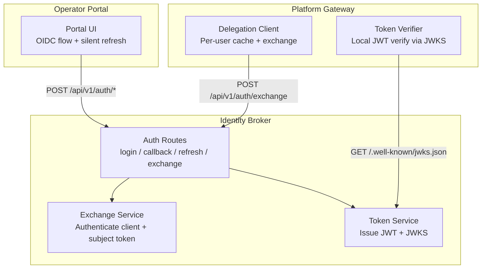
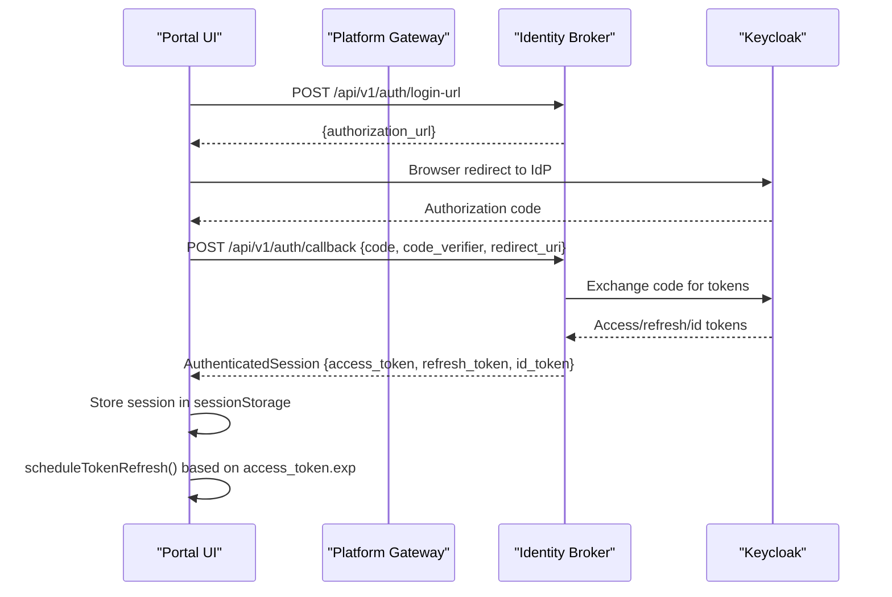
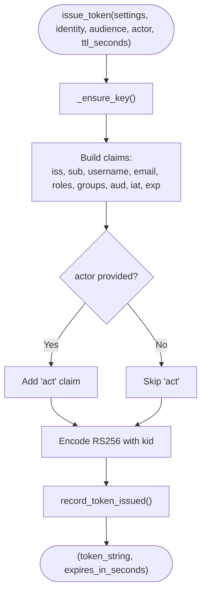
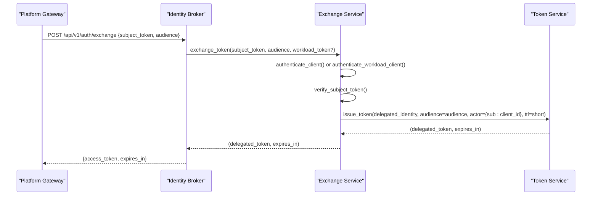
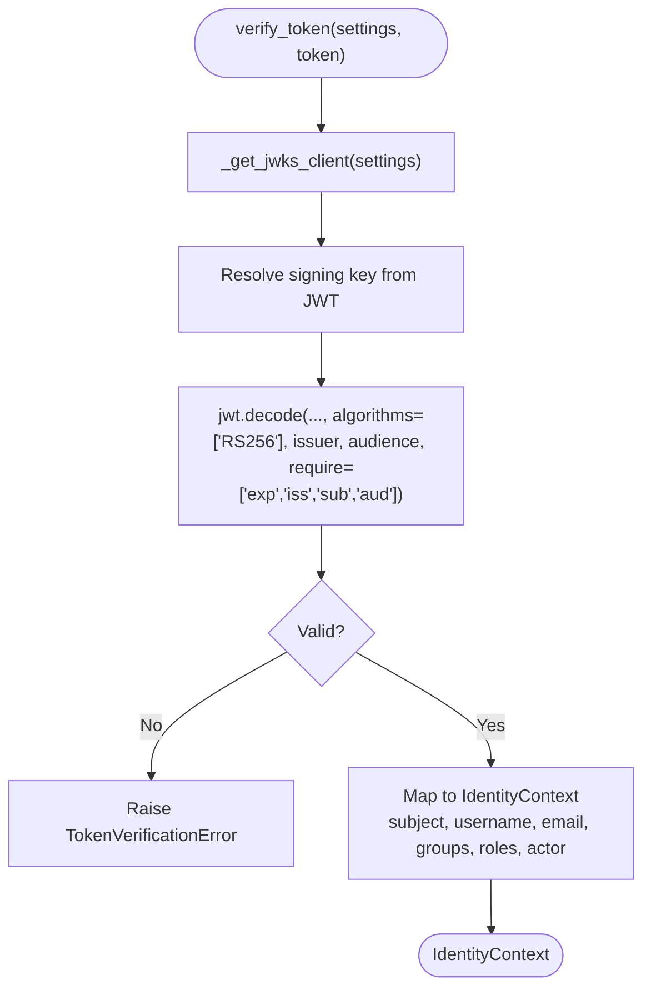
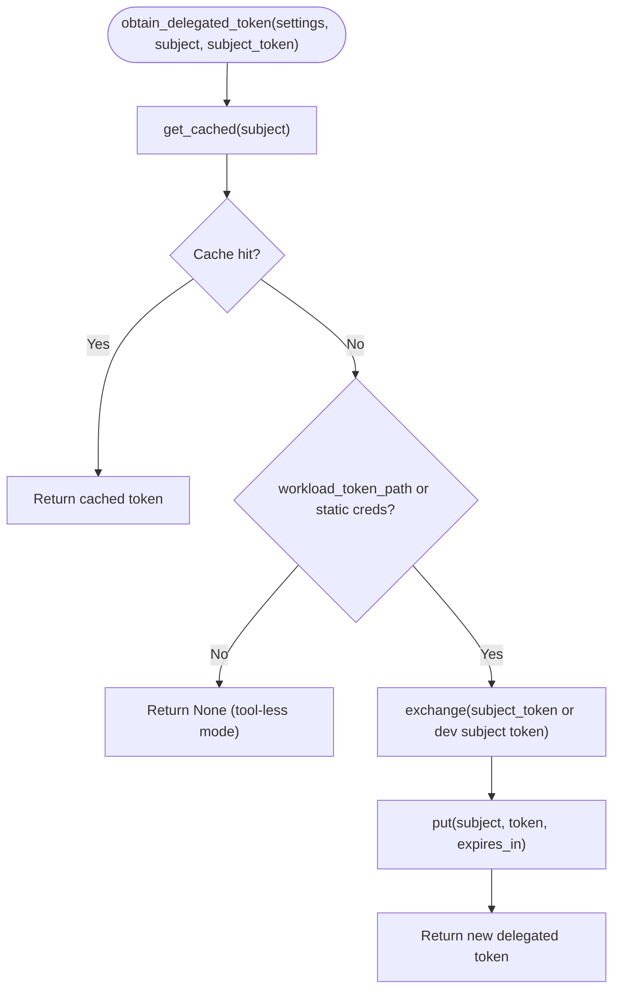
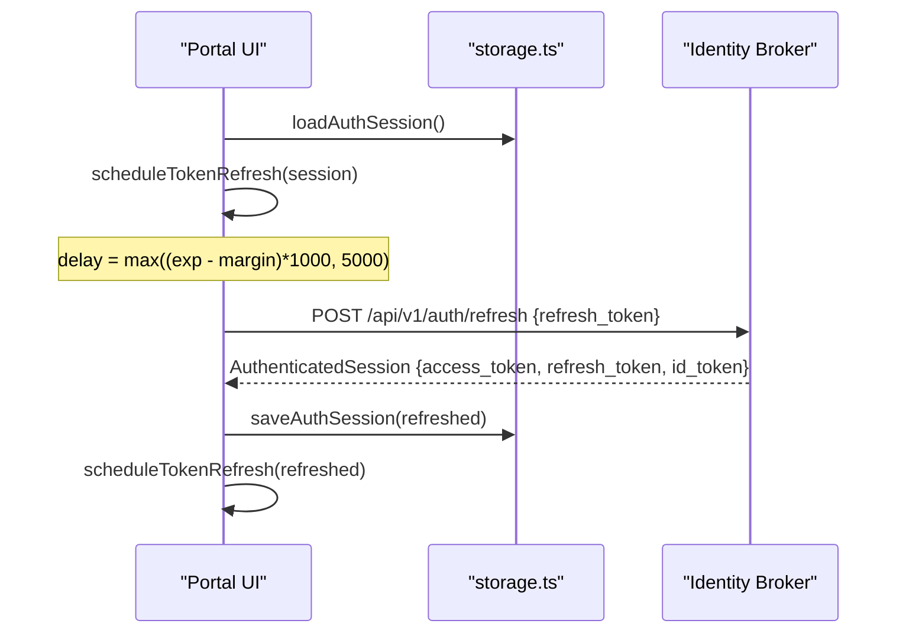
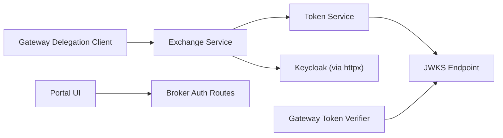

# Token Management

<cite>
**Referenced Files in This Document**
- [identity-token.schema.json](file://shared/shared-contracts/schemas/identity-token.schema.json)
- [token_service.py](file://products/identity-broker/src/identity_service/services/token_service.py)
- [exchange_service.py](file://products/identity-broker/src/identity_service/services/exchange_service.py)
- [auth.py](file://products/identity-broker/src/identity_service/api/routes/auth.py)
- [delegation_client.py](file://products/platform-gateway/src/platform_gateway/services/delegation_client.py)
- [token_verifier.py](file://products/platform-gateway/src/platform_gateway/services/token_verifier.py)
- [oidc.ts](file://products/operator-portal/web-ui/app/src/auth/oidc.ts)
- [storage.ts](file://products/operator-portal/web-ui/app/src/auth/storage.ts)
</cite>

## Table of Contents
1. [Introduction](#introduction)
2. [Project Structure](#project-structure)
3. [Core Components](#core-components)
4. [Architecture Overview](#architecture-overview)
5. [Detailed Component Analysis](#detailed-component-analysis)
6. [Dependency Analysis](#dependency-analysis)
7. [Performance Considerations](#performance-considerations)
8. [Troubleshooting Guide](#troubleshooting-guide)
9. [Conclusion](#conclusion)
10. [Appendices](#appendices)

## Introduction
This document explains the end-to-end token lifecycle across the Luban AIOPS platform, focusing on how the identity broker issues, validates, and revokes tokens; how the platform gateway verifies tokens and delegates authority to downstream services; and how the operator portal manages user sessions with automatic refresh. It covers:
- Token types: user session tokens (portal), delegated service tokens (service-to-service), and workload identity tokens (Kubernetes projected service-account tokens).
- Schema structure, claims mapping, and validation rules enforced by each component.
- Refresh strategies for long-running operations, caching mechanisms, and secure storage practices.
- Expiration handling, automatic refresh workflows, and graceful degradation when tokens become invalid.
- Troubleshooting guidance for common token-related issues.
- Examples of proper token handling in frontend and backend implementations.

## Project Structure
Token management spans three primary components:
- Identity Broker: Issues and exchanges tokens, exposes JWKS, handles OIDC flows, and supports workload identity authentication.
- Platform Gateway: Verifies tokens locally via JWKS, caches delegated tokens per user, and obtains short-lived delegated tokens from the broker for tool execution.
- Operator Portal (Frontend): Manages user login, stores sessions securely in memory, and proactively refreshes tokens before expiry.

**Diagram sources**
- [auth.py:34-111](file://products/identity-broker/src/identity_service/api/routes/auth.py#L34-L111)
- [auth.py:114-183](file://products/identity-broker/src/identity_service/api/routes/auth.py#L114-L183)
- [token_service.py:83-126](file://products/identity-broker/src/identity_service/services/token_service.py#L83-L126)
- [exchange_service.py:148-194](file://products/identity-broker/src/identity_service/services/exchange_service.py#L148-L194)
- [token_verifier.py:52-89](file://products/platform-gateway/src/platform_gateway/services/token_verifier.py#L52-L89)
- [delegation_client.py:78-101](file://products/platform-gateway/src/platform_gateway/services/delegation_client.py#L78-L101)

**Section sources**
- [auth.py:34-111](file://products/identity-broker/src/identity_service/api/routes/auth.py#L34-L111)
- [auth.py:114-183](file://products/identity-broker/src/identity_service/api/routes/auth.py#L114-L183)
- [token_service.py:83-126](file://products/identity-broker/src/identity_service/services/token_service.py#L83-L126)
- [exchange_service.py:148-194](file://products/identity-broker/src/identity_service/services/exchange_service.py#L148-L194)
- [token_verifier.py:52-89](file://products/platform-gateway/src/platform_gateway/services/token_verifier.py#L52-L89)
- [delegation_client.py:78-101](file://products/platform-gateway/src/platform_gateway/services/delegation_client.py#L78-L101)

## Core Components
- Identity Broker Token Service: Signs platform JWTs using an RSA key, emits standard claims, and serves JWKS for local verification by consumers. Supports audience binding and optional actor claim for delegated tokens.
- Identity Broker Exchange Service: Authenticates callers via static client credentials or Kubernetes projected workload tokens, verifies the presented subject token against the broker’s signing key, enforces audience allow-lists, and mints short-lived delegated tokens with an RFC 8693 actor claim.
- Platform Gateway Token Verifier: Performs local JWT verification using a cached JWKS client, enforcing issuer, audience, and required claims. Extracts identity context including optional actor information.
- Platform Gateway Delegation Client: Caches per-user delegated tokens with early refresh at 80% of TTL, exchanges subject tokens for audience-bound delegated tokens, and falls back gracefully if delegation is unavailable.
- Operator Portal Frontend: Implements OIDC auth-code flow with PKCE, stores sessions in per-tab memory storage, and schedules proactive token refresh before expiry.

**Section sources**
- [token_service.py:83-126](file://products/identity-broker/src/identity_service/services/token_service.py#L83-L126)
- [exchange_service.py:123-194](file://products/identity-broker/src/identity_service/services/exchange_service.py#L123-L194)
- [token_verifier.py:52-98](file://products/platform-gateway/src/platform_gateway/services/token_verifier.py#L52-L98)
- [delegation_client.py:44-101](file://products/platform-gateway/src/platform_gateway/services/delegation_client.py#L44-L101)
- [oidc.ts:1-73](file://products/operator-portal/web-ui/app/src/auth/oidc.ts#L1-L73)
- [storage.ts:1-63](file://products/operator-portal/web-ui/app/src/auth/storage.ts#L1-L63)

## Architecture Overview
The platform uses a broker-mediated trust model:
- User sessions are issued by the identity broker after OIDC login and refreshed via Keycloak refresh tokens.
- The platform gateway verifies user tokens locally using the broker’s JWKS and optionally obtains delegated tokens for tool execution.
- Delegated tokens are short-lived, audience-scoped, and carry an actor claim identifying the acting service.
- Workload identity allows services to authenticate to the broker using Kubernetes projected tokens instead of static secrets.

**Diagram sources**
- [auth.py:34-68](file://products/identity-broker/src/identity_service/api/routes/auth.py#L34-L68)
- [oidc.ts:75-155](file://products/operator-portal/web-ui/app/src/auth/oidc.ts#L75-L155)

## Detailed Component Analysis

### Identity Broker: Token Issuance and JWKS
- Issues platform JWTs with standard claims (iss, sub, username, email, roles, groups, aud, iat, exp) and optional act for delegated tokens.
- Uses an RSA key loaded from disk or generated in-memory for dev/test; exposes public keys via JWKS endpoint.
- Audience defaults to the configured gateway audience unless overridden for delegated tokens.

**Diagram sources**
- [token_service.py:83-126](file://products/identity-broker/src/identity_service/services/token_service.py#L83-L126)

**Section sources**
- [token_service.py:29-73](file://products/identity-broker/src/identity_service/services/token_service.py#L29-L73)
- [token_service.py:83-126](file://products/identity-broker/src/identity_service/services/token_service.py#L83-L126)
- [auth.py:107-111](file://products/identity-broker/src/identity_service/api/routes/auth.py#L107-L111)

### Identity Broker: Subject Token Verification and Delegation
- Validates subject tokens against the broker’s own signing key, enforcing issuer, audience, and required claims.
- Authenticates callers via static client credentials or Kubernetes projected workload tokens.
- Enforces audience allow-lists per client and mints delegated tokens with actor claim and short TTL.

**Diagram sources**
- [auth.py:114-183](file://products/identity-broker/src/identity_service/api/routes/auth.py#L114-L183)
- [exchange_service.py:148-194](file://products/identity-broker/src/identity_service/services/exchange_service.py#L148-L194)
- [token_service.py:83-126](file://products/identity-broker/src/identity_service/services/token_service.py#L83-L126)

**Section sources**
- [exchange_service.py:46-120](file://products/identity-broker/src/identity_service/services/exchange_service.py#L46-L120)
- [exchange_service.py:123-194](file://products/identity-broker/src/identity_service/services/exchange_service.py#L123-L194)
- [auth.py:114-183](file://products/identity-broker/src/identity_service/api/routes/auth.py#L114-L183)

### Platform Gateway: Local JWT Verification
- Resolves signing keys from the broker’s JWKS endpoint with caching.
- Decodes and validates tokens, enforcing issuer, audience, and required claims.
- Extracts identity context including optional actor information from the act claim.

**Diagram sources**
- [token_verifier.py:25-34](file://products/platform-gateway/src/platform_gateway/services/token_verifier.py#L25-L34)
- [token_verifier.py:52-98](file://products/platform-gateway/src/platform_gateway/services/token_verifier.py#L52-L98)

**Section sources**
- [token_verifier.py:25-34](file://products/platform-gateway/src/platform_gateway/services/token_verifier.py#L25-L34)
- [token_verifier.py:52-98](file://products/platform-gateway/src/platform_gateway/services/token_verifier.py#L52-L98)

### Platform Gateway: Delegation Client and Caching
- Maintains a per-replica, per-user cache of delegated tokens with early refresh at 80% of TTL.
- Exchanges subject tokens for audience-bound delegated tokens, preferring projected workload tokens when available and falling back to static credentials.
- Gracefully degrades: if delegation fails or is not configured, returns None so chat proceeds without tools.

**Diagram sources**
- [delegation_client.py:58-76](file://products/platform-gateway/src/platform_gateway/services/delegation_client.py#L58-L76)
- [delegation_client.py:78-101](file://products/platform-gateway/src/platform_gateway/services/delegation_client.py#L78-L101)
- [delegation_client.py:190-228](file://products/platform-gateway/src/platform_gateway/services/delegation_client.py#L190-L228)

**Section sources**
- [delegation_client.py:44-101](file://products/platform-gateway/src/platform_gateway/services/delegation_client.py#L44-L101)
- [delegation_client.py:103-174](file://products/platform-gateway/src/platform_gateway/services/delegation_client.py#L103-L174)
- [delegation_client.py:190-228](file://products/platform-gateway/src/platform_gateway/services/delegation_client.py#L190-L228)

### Operator Portal: Session Storage and Silent Refresh
- Stores sessions in per-tab sessionStorage to match per-tab active-session posture.
- Schedules proactive refresh before access token expiry using a margin.
- On refresh failure, clears session and notifies caller to re-authenticate.

**Diagram sources**
- [oidc.ts:38-73](file://products/operator-portal/web-ui/app/src/auth/oidc.ts#L38-L73)
- [storage.ts:39-49](file://products/operator-portal/web-ui/app/src/auth/storage.ts#L39-L49)
- [auth.py:214-230](file://products/identity-broker/src/identity_service/api/routes/auth.py#L214-L230)

**Section sources**
- [oidc.ts:1-73](file://products/operator-portal/web-ui/app/src/auth/oidc.ts#L1-L73)
- [storage.ts:1-63](file://products/operator-portal/web-ui/app/src/auth/storage.ts#L1-L63)
- [auth.py:214-230](file://products/identity-broker/src/identity_service/api/routes/auth.py#L214-L230)

## Dependency Analysis
- Identity Broker depends on cryptography and PyJWT for signing and decoding JWTs, and httpx for OIDC token exchange with Keycloak.
- Platform Gateway depends on jwt.PyJWKClient for local verification and httpx for exchanging delegated tokens.
- Operator Portal depends on browser APIs for sessionStorage and fetch-like request helpers to call broker endpoints.

**Diagram sources**
- [token_service.py:129-154](file://products/identity-broker/src/identity_service/services/token_service.py#L129-L154)
- [auth.py:107-111](file://products/identity-broker/src/identity_service/api/routes/auth.py#L107-L111)
- [exchange_service.py:65-75](file://products/identity-broker/src/identity_service/services/exchange_service.py#L65-L75)
- [token_verifier.py:25-34](file://products/platform-gateway/src/platform_gateway/services/token_verifier.py#L25-L34)
- [delegation_client.py:78-101](file://products/platform-gateway/src/platform_gateway/services/delegation_client.py#L78-L101)

**Section sources**
- [token_service.py:129-154](file://products/identity-broker/src/identity_service/services/token_service.py#L129-L154)
- [exchange_service.py:65-75](file://products/identity-broker/src/identity_service/services/exchange_service.py#L65-L75)
- [token_verifier.py:25-34](file://products/platform-gateway/src/platform_gateway/services/token_verifier.py#L25-L34)
- [delegation_client.py:78-101](file://products/platform-gateway/src/platform_gateway/services/delegation_client.py#L78-L101)

## Performance Considerations
- JWKS caching: The gateway caches signing keys with a configurable lifespan to avoid per-request network calls.
- Delegated token caching: Per-user cache with early refresh reduces broker exchange overhead during high-frequency tool usage.
- Workload identity: Using projected service-account tokens avoids static secret rotation concerns and improves security posture.
- Frontend refresh scheduling: Proactive refresh prevents mid-operation token expiry and reduces error rates.

[No sources needed since this section provides general guidance]

## Troubleshooting Guide
Common token-related issues and resolutions:
- Expired session:
  - Symptom: Frontend cannot call protected endpoints; refresh fails.
  - Action: Ensure refresh_token is present; if missing, clear session and re-login. Verify /api/v1/auth/refresh succeeds.
  - Sources: [oidc.ts:52-73](file://products/operator-portal/web-ui/app/src/auth/oidc.ts#L52-L73), [auth.py:214-230](file://products/identity-broker/src/identity_service/api/routes/auth.py#L214-L230)
- Permission denials:
  - Symptom: 401/403 errors on delegated token exchange or downstream calls.
  - Action: Validate audience allow-lists for the calling client; ensure subject token audience matches gateway audience; confirm roles/groups are correctly mapped.
  - Sources: [exchange_service.py:167-171](file://products/identity-broker/src/identity_service/services/exchange_service.py#L167-L171), [token_verifier.py:64-80](file://products/platform-gateway/src/platform_gateway/services/token_verifier.py#L64-L80)
- Cross-service token compatibility:
  - Symptom: Tool-gateway or agent-platform rejects tokens from other services.
  - Action: Confirm issuer and audience configuration; ensure act claim presence only on delegated tokens; verify RS256 algorithm and required claims.
  - Sources: [identity-token.schema.json:1-55](file://shared/shared-contracts/schemas/identity-token.schema.json#L1-L55), [token_verifier.py:64-80](file://products/platform-gateway/src/platform_gateway/services/token_verifier.py#L64-L80)
- Workload identity unavailable:
  - Symptom: Delegation falls back to static credentials or fails entirely.
  - Action: Verify projected token path exists and is readable; check workload issuer and audience configuration; review logs for fallback warnings.
  - Sources: [delegation_client.py:103-126](file://products/platform-gateway/src/platform_gateway/services/delegation_client.py#L103-L126), [exchange_service.py:94-120](file://products/identity-broker/src/identity_service/services/exchange_service.py#L94-L120)

**Section sources**
- [oidc.ts:52-73](file://products/operator-portal/web-ui/app/src/auth/oidc.ts#L52-L73)
- [auth.py:214-230](file://products/identity-broker/src/identity_service/api/routes/auth.py#L214-L230)
- [exchange_service.py:167-171](file://products/identity-broker/src/identity_service/services/exchange_service.py#L167-L171)
- [token_verifier.py:64-80](file://products/platform-gateway/src/platform_gateway/services/token_verifier.py#L64-L80)
- [identity-token.schema.json:1-55](file://shared/shared-contracts/schemas/identity-token.schema.json#L1-L55)
- [delegation_client.py:103-126](file://products/platform-gateway/src/platform_gateway/services/delegation_client.py#L103-L126)
- [exchange_service.py:94-120](file://products/identity-broker/src/identity_service/services/exchange_service.py#L94-L120)

## Conclusion
The Luban AIOPS platform implements a robust, layered token system:
- The identity broker centrally issues and validates tokens, supports both static and workload-based service authentication, and enforces strict audience scoping.
- The platform gateway performs efficient local verification and minimizes broker calls through caching and early refresh strategies.
- The operator portal ensures seamless user experiences by storing sessions securely in memory and proactively refreshing tokens.
Together, these components provide secure, scalable, and resilient token management across user sessions, service delegations, and workload identities.

[No sources needed since this section summarizes without analyzing specific files]

## Appendices

### Token Schema Reference
- Required claims: iss, sub, username, aud, iat, exp.
- Optional claims: email, roles, groups, act.
- Audience semantics: Portal tokens bound to gateway; delegated tokens bound to requested service audience.
- Actor claim: Present only on delegated tokens to identify acting service.

**Section sources**
- [identity-token.schema.json:1-55](file://shared/shared-contracts/schemas/identity-token.schema.json#L1-L55)

### Example Flows

#### Frontend: Proper Token Handling
- Initiate login via /api/v1/auth/login-url and handle callback to obtain session.
- Store session in sessionStorage and schedule refresh before expiry.
- On refresh failure, clear session and prompt re-login.

**Section sources**
- [oidc.ts:75-155](file://products/operator-portal/web-ui/app/src/auth/oidc.ts#L75-L155)
- [storage.ts:39-49](file://products/operator-portal/web-ui/app/src/auth/storage.ts#L39-L49)

#### Backend: Proper Token Handling
- Verify incoming tokens locally using JWKS; enforce issuer, audience, and required claims.
- For tool execution, obtain delegated tokens via /api/v1/auth/exchange with audience scoping.
- Handle failures gracefully by proceeding without tools when delegation is unavailable.

**Section sources**
- [token_verifier.py:52-98](file://products/platform-gateway/src/platform_gateway/services/token_verifier.py#L52-L98)
- [delegation_client.py:190-228](file://products/platform-gateway/src/platform_gateway/services/delegation_client.py#L190-L228)