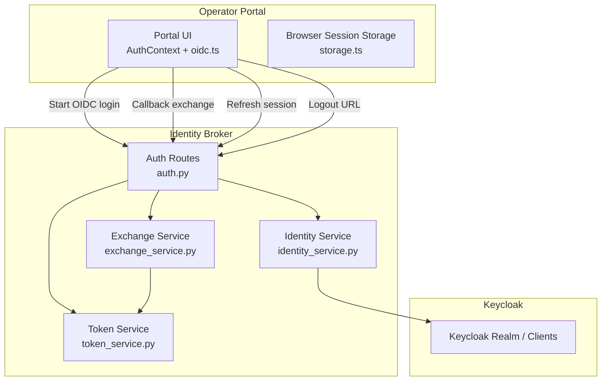
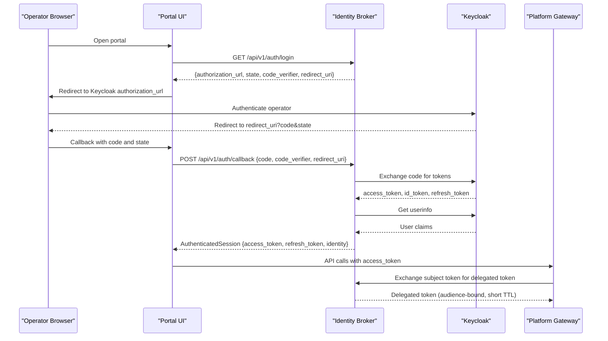
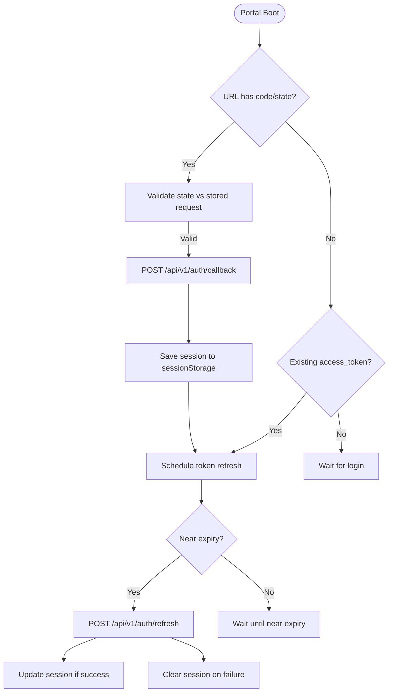
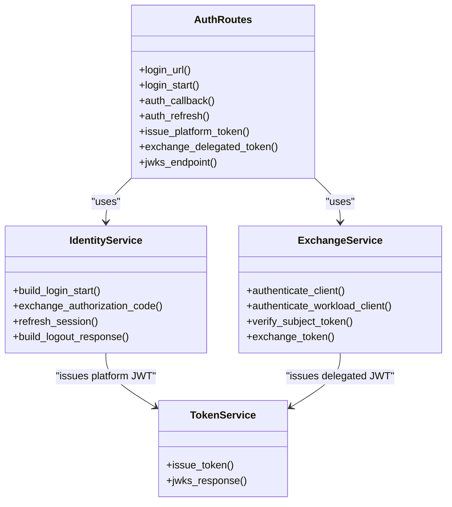
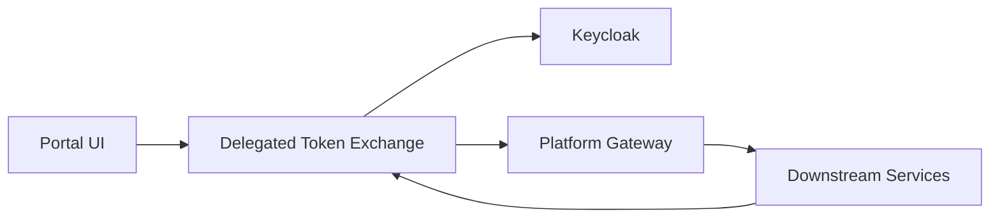

# User Authentication

<cite>
**Referenced Files in This Document**
- [identity-and-authorization-design.md](file://docs/agentic-aiops-platform/identity-and-authorization-design.md)
- [auth.py](file://products/identity-broker/src/identity_service/api/routes/auth.py)
- [identity_service.py](file://products/identity-broker/src/identity_service/services/identity_service.py)
- [exchange_service.py](file://products/identity-broker/src/identity_service/services/exchange_service.py)
- [token_service.py](file://products/identity-broker/src/identity_service/services/token_service.py)
- [AuthContext.tsx](file://products/operator-portal/web-ui/app/src/auth/AuthContext.tsx)
- [oidc.ts](file://products/operator-portal/web-ui/app/src/auth/oidc.ts)
- [storage.ts](file://products/operator-portal/web-ui/app/src/auth/storage.ts)
</cite>

## Table of Contents
1. Introduction
2. Project Structure
3. Core Components
4. Architecture Overview
5. Detailed Component Analysis
6. Dependency Analysis
7. Performance Considerations
8. Troubleshooting Guide
9. Conclusion
10. Appendices

## Introduction
This document explains how operators authenticate to the Luban AIOPS platform through a Keycloak OpenID Connect (OIDC) integration and how the identity broker maintains secure, short-lived sessions across the application lifecycle. It covers the browser-based SSO flow, redirect handling, state management, token storage, identity validation, token refresh, logout, and service-to-service delegation. It also provides configuration guidance for Keycloak realm setup and client registration, and describes how to extend the identity broker with additional identity sources or custom authentication providers.

The design emphasizes:
- Separation of authentication from authorization
- End-to-end identity propagation into policy, approvals, execution, and audit
- Short-lived, audience-bound tokens issued by the identity broker
- Secure PKCE-based OIDC flows for the operator portal
- Broker-mediated token delegation for internal services

**Section sources**
- [identity-and-authorization-design.md:1-120](file://docs/agentic-aiops-platform/identity-and-authorization-design.md#L1-L120)
- [identity-and-authorization-design.md:121-167](file://docs/agentic-aiops-platform/identity-and-authorization-design.md#L121-L167)

## Project Structure
Authentication spans two main areas:
- Operator portal web UI that drives the OIDC login flow and manages session state in the browser
- Identity broker backend that integrates with Keycloak, validates tokens, issues platform JWTs, and supports service-to-service token exchange

**Diagram sources**
- [AuthContext.tsx:31-100](file://products/operator-portal/web-ui/app/src/auth/AuthContext.tsx#L31-L100)
- [oidc.ts:75-156](file://products/operator-portal/web-ui/app/src/auth/oidc.ts#L75-L156)
- [storage.ts:1-64](file://products/operator-portal/web-ui/app/src/auth/storage.ts#L1-L64)
- [auth.py:34-111](file://products/identity-broker/src/identity_service/api/routes/auth.py#L34-L111)
- [identity_service.py:88-192](file://products/identity-broker/src/identity_service/services/identity_service.py#L88-L192)
- [exchange_service.py:148-195](file://products/identity-broker/src/identity_service/services/exchange_service.py#L148-L195)
- [token_service.py:83-127](file://products/identity-broker/src/identity_service/services/token_service.py#L83-L127)

**Section sources**
- [identity-and-authorization-design.md:60-101](file://docs/agentic-aiops-platform/identity-and-authorization-design.md#L60-L101)

## Core Components
- Operator portal authentication context and OIDC helpers manage login initiation, callback processing, silent refresh, and logout. They store the session in browser session storage and schedule token refresh based on access token expiry.
- Identity broker exposes OIDC-aware endpoints:
  - Login start returns an authorization URL with PKCE parameters
  - Callback exchanges the authorization code for tokens and issues a platform JWT
  - Refresh exchanges a refresh token for a new platform session
  - Logout URL builds a Keycloak logout redirect
  - Token exchange endpoint issues short-lived delegated tokens for services
  - JWKS endpoint publishes the broker’s public key for verification
- Exchange service authenticates callers via static credentials or projected workload tokens, verifies subject tokens against the broker’s signing key, and mints audience-bound delegated tokens with an actor claim.
- Token service manages RSA key lifecycle, signs platform JWTs, and serves JWKS.

**Section sources**
- [AuthContext.tsx:31-100](file://products/operator-portal/web-ui/app/src/auth/AuthContext.tsx#L31-L100)
- [oidc.ts:19-73](file://products/operator-portal/web-ui/app/src/auth/oidc.ts#L19-L73)
- [auth.py:34-111](file://products/identity-broker/src/identity_service/api/routes/auth.py#L34-L111)
- [identity_service.py:88-192](file://products/identity-broker/src/identity_service/services/identity_service.py#L88-L192)
- [exchange_service.py:46-121](file://products/identity-broker/src/identity_service/services/exchange_service.py#L46-L121)
- [token_service.py:42-127](file://products/identity-broker/src/identity_service/services/token_service.py#L42-L127)

## Architecture Overview
The operator portal uses a standard OIDC Authorization Code Flow with PKCE. The browser is redirected to Keycloak; after successful authentication, Keycloak redirects back to the portal with an authorization code. The portal sends the code and PKCE verifier to the identity broker, which exchanges it with Keycloak, retrieves user info, normalizes identity, and issues a platform JWT. Subsequent API calls use this platform JWT. For service-to-service calls, the gateway or other services exchange the verified subject token at the broker’s exchange endpoint to obtain a short-lived, audience-bound delegated token.

**Diagram sources**
- [oidc.ts:75-156](file://products/operator-portal/web-ui/app/src/auth/oidc.ts#L75-L156)
- [auth.py:34-111](file://products/identity-broker/src/identity_service/api/routes/auth.py#L34-L111)
- [identity_service.py:88-192](file://products/identity-broker/src/identity_service/services/identity_service.py#L88-L192)
- [exchange_service.py:148-195](file://products/identity-broker/src/identity_service/services/exchange_service.py#L148-L195)

## Detailed Component Analysis

### Operator Portal OIDC Flow
- Login initiation:
  - The portal requests a login start from the broker, receives an authorization URL with PKCE parameters, stores state and code_verifier in session storage, and redirects the browser to Keycloak.
- Callback handling:
  - On return, the portal validates state against stored pending request, posts the authorization code and code_verifier to the broker’s callback endpoint, and stores the resulting session.
- Silent refresh:
  - The portal schedules a refresh before the access token expires by calling the broker’s refresh endpoint with the refresh token. If refresh fails, the session is cleared.
- Logout:
  - The portal clears local session and requests a logout URL from the broker, then redirects the browser to Keycloak’s logout endpoint.

**Diagram sources**
- [oidc.ts:19-73](file://products/operator-portal/web-ui/app/src/auth/oidc.ts#L19-L73)
- [oidc.ts:75-156](file://products/operator-portal/web-ui/app/src/auth/oidc.ts#L75-L156)
- [storage.ts:1-64](file://products/operator-portal/web-ui/app/src/auth/storage.ts#L1-L64)

**Section sources**
- [oidc.ts:75-156](file://products/operator-portal/web-ui/app/src/auth/oidc.ts#L75-L156)
- [oidc.ts:158-181](file://products/operator-portal/web-ui/app/src/auth/oidc.ts#L158-L181)
- [AuthContext.tsx:31-100](file://products/operator-portal/web-ui/app/src/auth/AuthContext.tsx#L31-L100)
- [storage.ts:1-64](file://products/operator-portal/web-ui/app/src/auth/storage.ts#L1-L64)

### Identity Broker Authentication Endpoints
- Login URL and login start:
  - Generate PKCE challenge and state, build Keycloak authorization URL, and return it to the portal.
- Callback:
  - Exchange authorization code with Keycloak, fetch userinfo, normalize identity, issue platform JWT, and return authenticated session.
- Refresh:
  - Exchange refresh token with Keycloak, fetch userinfo, issue new platform JWT, and return updated session.
- Logout URL:
  - Build Keycloak logout URL with post-logout redirect and optional id_token_hint.
- Token exchange:
  - Authenticate caller via static credentials or projected workload token, verify subject token against broker’s signing key, check audience allow-list, and mint a short-lived delegated token with actor claim.
- JWKS:
  - Serve public keys for verifying broker-signed tokens.

**Diagram sources**
- [auth.py:34-111](file://products/identity-broker/src/identity_service/api/routes/auth.py#L34-L111)
- [identity_service.py:88-192](file://products/identity-broker/src/identity_service/services/identity_service.py#L88-L192)
- [exchange_service.py:46-121](file://products/identity-broker/src/identity_service/services/exchange_service.py#L46-L121)
- [token_service.py:83-127](file://products/identity-broker/src/identity_service/services/token_service.py#L83-L127)

**Section sources**
- [auth.py:34-111](file://products/identity-broker/src/identity_service/api/routes/auth.py#L34-L111)
- [auth.py:114-183](file://products/identity-broker/src/identity_service/api/routes/auth.py#L114-L183)
- [auth.py:214-231](file://products/identity-broker/src/identity_service/api/routes/auth.py#L214-L231)
- [identity_service.py:88-192](file://products/identity-broker/src/identity_service/services/identity_service.py#L88-L192)
- [identity_service.py:214-278](file://products/identity-broker/src/identity_service/services/identity_service.py#L214-L278)
- [exchange_service.py:148-195](file://products/identity-broker/src/identity_service/services/exchange_service.py#L148-L195)
- [token_service.py:83-127](file://products/identity-broker/src/identity_service/services/token_service.py#L83-L127)

### Token Storage and State Management
- The portal stores the authentication session in browser session storage keyed by a constant, including access_token, refresh_token, id_token, and normalized identity.
- Pending OIDC request data (state, code_verifier, redirect_uri) is stored separately to validate callbacks and prevent CSRF/state mismatch attacks.
- On boot, the portal checks for a callback, validates state, exchanges the code, and schedules token refresh. If no callback exists but an access token is present, it attempts to refresh identity and continues using cached session until refresh succeeds.

**Section sources**
- [storage.ts:1-64](file://products/operator-portal/web-ui/app/src/auth/storage.ts#L1-L64)
- [oidc.ts:75-156](file://products/operator-portal/web-ui/app/src/auth/oidc.ts#L75-L156)
- [AuthContext.tsx:31-100](file://products/operator-portal/web-ui/app/src/auth/AuthContext.tsx#L31-L100)

### Identity Normalization and Role Mapping
- The broker normalizes Keycloak userinfo into a consistent identity context, mapping upstream groups to platform roles using a role mapping table.
- Roles are included in platform JWTs and propagated downstream for authorization decisions.

**Section sources**
- [identity_service.py:24-38](file://products/identity-broker/src/identity_service/services/identity_service.py#L24-L38)
- [identity_service.py:114-139](file://products/identity-broker/src/identity_service/services/identity_service.py#L114-L139)
- [identity_service.py:173-192](file://products/identity-broker/src/identity_service/services/identity_service.py#L173-L192)

### Service-to-Service Delegation
- Services authenticate to the broker either via static HTTP Basic credentials or a projected Kubernetes workload token validated against the cluster OIDC issuer.
- The broker verifies the subject token against its own signing key, checks audience allow-lists, and issues a short-lived, audience-bound delegated token with an actor claim identifying the acting service.

**Section sources**
- [exchange_service.py:46-121](file://products/identity-broker/src/identity_service/services/exchange_service.py#L46-L121)
- [exchange_service.py:123-145](file://products/identity-broker/src/identity_service/services/exchange_service.py#L123-L145)
- [exchange_service.py:148-195](file://products/identity-broker/src/identity_service/services/exchange_service.py#L148-L195)
- [token_service.py:83-127](file://products/identity-broker/src/identity_service/services/token_service.py#L83-L127)

## Dependency Analysis
The authentication flow depends on:
- Keycloak for user authentication and OIDC token issuance
- The identity broker for PKCE flow orchestration, token exchange, identity normalization, and platform JWT issuance
- The operator portal for initiating OIDC flows, managing browser session state, and scheduling refreshes
- Platform services validating broker-signed tokens via JWKS and enforcing audience binding

**Diagram sources**
- [oidc.ts:75-156](file://products/operator-portal/web-ui/app/src/auth/oidc.ts#L75-L156)
- [auth.py:34-111](file://products/identity-broker/src/identity_service/api/routes/auth.py#L34-L111)
- [identity_service.py:88-192](file://products/identity-broker/src/identity_service/services/identity_service.py#L88-L192)
- [exchange_service.py:148-195](file://products/identity-broker/src/identity_service/services/exchange_service.py#L148-L195)

**Section sources**
- [identity-and-authorization-design.md:60-101](file://docs/agentic-aiops-platform/identity-and-authorization-design.md#L60-L101)

## Performance Considerations
- Token refresh timing:
  - The portal calculates remaining token lifetime and schedules a refresh margin before expiry to avoid mid-request failures.
- Network timeouts:
  - Broker uses bounded timeouts when calling Keycloak endpoints to prevent long hangs during network issues.
- JWKS caching:
  - Workload JWKS clients are cached per issuer to reduce discovery overhead during delegated token exchanges.
- Audience binding:
  - Platform JWTs are audience-bound to minimize cross-service replay risk and reduce unnecessary validation work downstream.

[No sources needed since this section provides general guidance]

## Troubleshooting Guide
Common authentication issues and their indicators:
- State mismatch on callback:
  - Occurs when the returned state does not match the stored pending request. The portal clears session and pending request and throws an error.
- OIDC errors from Keycloak:
  - Error parameters in the callback URL cause the portal to clear session and display the error description.
- Token refresh failures:
  - If refresh endpoint returns an error or the refresh token is missing, the portal clears the session and requires re-login.
- Invalid or expired subject tokens:
  - The broker rejects invalid or expired subject tokens during exchange with appropriate status codes and audit events.
- Unauthorized audience:
  - Delegated token exchange fails if the requested audience is not permitted for the caller’s client.

Operational steps:
- Verify redirect URIs in Keycloak client configuration match the portal’s expected values.
- Ensure PKCE code_verifier matches the challenge sent in the login start response.
- Confirm the broker’s JWKS endpoint is reachable for token verification.
- Check audit logs for token exchange denials and reasons.

**Section sources**
- [oidc.ts:116-156](file://products/operator-portal/web-ui/app/src/auth/oidc.ts#L116-L156)
- [oidc.ts:52-73](file://products/operator-portal/web-ui/app/src/auth/oidc.ts#L52-L73)
- [auth.py:54-71](file://products/identity-broker/src/identity_service/api/routes/auth.py#L54-L71)
- [auth.py:214-231](file://products/identity-broker/src/identity_service/api/routes/auth.py#L214-L231)
- [exchange_service.py:123-145](file://products/identity-broker/src/identity_service/services/exchange_service.py#L123-L145)
- [exchange_service.py:148-195](file://products/identity-broker/src/identity_service/services/exchange_service.py#L148-L195)

## Conclusion
The Luban AIOPS platform implements a robust, enterprise-grade authentication model centered on Keycloak OIDC and a broker-managed identity layer. Operators authenticate via a secure PKCE flow, receive short-lived platform JWTs, and benefit from automatic refresh and clean logout. Internal services use broker-mediated token delegation to obtain audience-bound tokens with strict audience controls and actor attribution. This design preserves human attribution, enforces authorization boundaries, and supports extensibility for additional identity sources and custom authentication providers.

[No sources needed since this section summarizes without analyzing specific files]

## Appendices

### Keycloak Realm and Client Configuration Guidance
- Create a Keycloak realm for the platform and configure federation to your directory source (e.g., Active Directory).
- Register a client for the operator portal:
  - Set the redirect URI to the portal’s callback path.
  - Enable PKCE and set the appropriate scopes.
  - Configure post-logout redirect URI to the portal root.
- Register clients for internal services:
  - Define allowed audiences per client to restrict delegated token usage.
  - For workload identity, map projected service-account subjects to registered clients.

Configuration references:
- OIDC endpoints used by the broker include authorization, token, userinfo, and logout endpoints derived from Keycloak base URL and realm.
- The broker constructs login URLs with PKCE parameters and state.

**Section sources**
- [identity_service.py:45-70](file://products/identity-broker/src/identity_service/services/identity_service.py#L45-L70)
- [identity_service.py:88-111](file://products/identity-broker/src/identity_service/services/identity_service.py#L88-L111)
- [identity-and-authorization-design.md:436-467](file://docs/agentic-aiops-platform/identity-and-authorization-design.md#L436-L467)

### Extending the Identity Broker
To add additional identity sources or custom authentication providers:
- Implement a new provider interface analogous to existing identity normalization functions.
- Integrate provider-specific token validation and user info retrieval within the identity service.
- Extend role mapping logic to incorporate claims from new identity sources.
- Update service client registry to support new audiences and credentials.
- Ensure audit events capture provider-specific details for traceability.

**Section sources**
- [identity_service.py:114-139](file://products/identity-broker/src/identity_service/services/identity_service.py#L114-L139)
- [identity_service.py:24-38](file://products/identity-broker/src/identity_service/services/identity_service.py#L24-L38)
- [exchange_service.py:46-121](file://products/identity-broker/src/identity_service/services/exchange_service.py#L46-L121)