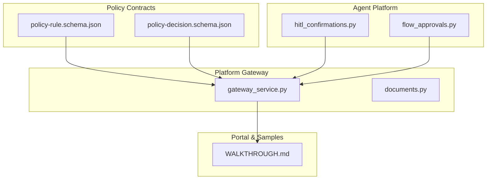
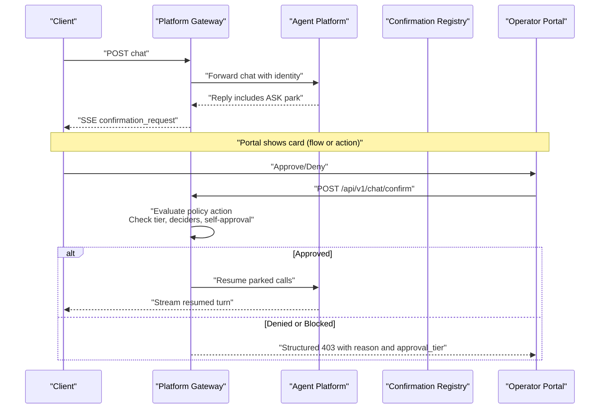
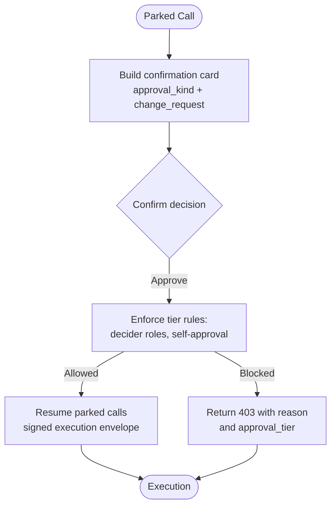
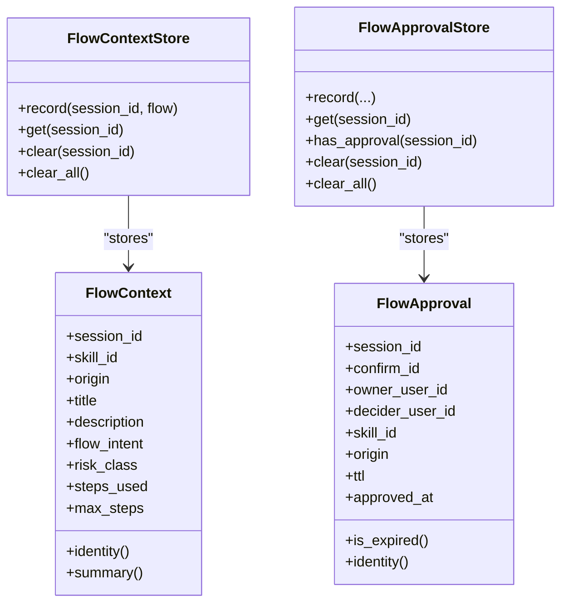
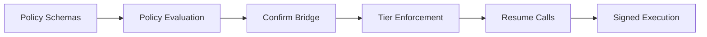

# Approval Workflows

<cite>
**Referenced Files in This Document**
- [policy-specification.md](file://docs/agentic-aiops-platform/policy-specification.md)
- [SPEC-030 spec.md](file://docs/specs/SPEC-030-require-approval-policy-semantics/spec.md)
- [SPEC-054 spec.md](file://docs/specs/SPEC-054-action-approval-and-change-request-card/spec.md)
- [flow_approvals.py](file://products/agent-platform/src/agent_service/services/flow_approvals.py)
- [hitl_confirmations.py](file://products/agent-platform/src/agent_service/services/hitl_confirmations.py)
- [gateway_service.py](file://products/platform-gateway/src/platform_gateway/services/gateway_service.py)
- [documents.py](file://products/platform-gateway/src/platform_gateway/api/routes/documents.py)
- [policy-rule.schema.json](file://shared/shared-contracts/schemas/policy-rule.schema.json)
- [policy-decision.schema.json](file://shared/shared-contracts/schemas/policy-decision.schema.json)
- [test_policy_engine.py](file://products/platform-gateway/tests/test_policy_engine.py)
- [WALKTHROUGH.md (adhoc-password-reset)](file://samples/web-checks/adhoc-password-reset/WALKTHROUGH.md)
</cite>

## Table of Contents
1. Introduction
2. Project Structure
3. Core Components
4. Architecture Overview
5. Detailed Component Analysis
6. Dependency Analysis
7. Performance Considerations
8. Troubleshooting Guide
9. Conclusion

## Introduction
This document explains the approval workflow system that gates sensitive operations requiring human review. It covers the four-tier model, how requirements are triggered by risk tier, environment, and action type, and the end-to-end lifecycle from request to execution gating. It also documents self-approval restrictions, approver eligibility, multi-person approval patterns, integration with the policy engine, approval context fields such as ticket and incident references and change windows, common scenarios, and troubleshooting steps.

The platform currently implements tier_1 and tier_2 enforcement on the confirmation path, while tier_0 is read-only and tier_3 remains deny-by-default for this slice. Future slices may introduce a dedicated approval queue and condition-bearing approvals.

## Project Structure
Approval workflows span several components:
- Policy contracts define outcomes and tiers.
- The agent platform parks and resumes HITL confirmations and tracks flow-scoped browser approvals.
- The platform gateway enforces tiered approval rules during confirmation decisions.
- The portal surfaces cards and an approver inbox.
- Samples demonstrate real-world flows.

**Diagram sources**
- [policy-rule.schema.json:1-105](file://shared/shared-contracts/schemas/policy-rule.schema.json#L1-L105)
- [policy-decision.schema.json:1-60](file://shared/shared-contracts/schemas/policy-decision.schema.json#L1-L60)
- [hitl_confirmations.py:1-595](file://products/agent-platform/src/agent_service/services/hitl_confirmations.py#L1-L595)
- [flow_approvals.py:1-274](file://products/agent-platform/src/agent_service/services/flow_approvals.py#L1-L274)
- [gateway_service.py:1146-1183](file://products/platform-gateway/src/platform_gateway/services/gateway_service.py#L1146-L1183)
- [documents.py:39-62](file://products/platform-gateway/src/platform_gateway/api/routes/documents.py#L39-L62)
- [WALKTHROUGH.md (adhoc-password-reset):177-201](file://samples/web-checks/adhoc-password-reset/WALKTHROUGH.md#L177-L201)

**Section sources**
- [policy-specification.md:275-295](file://docs/agentic-aiops-platform/policy-specification.md#L275-L295)
- [SPEC-030 spec.md:16-31](file://docs/specs/SPEC-030-require-approval-policy-semantics/spec.md#L16-L31)
- [SPEC-054 spec.md:32-105](file://docs/specs/SPEC-054-action-approval-and-change-request-card/spec.md#L32-L105)

## Core Components
- Policy schemas define allow/deny/require_approval outcomes and approval tiers. require_approval requires an approval block with tier and decider roles; tier_1 allows self-approval by default, tier_2 forbids it by default.
- Agent platform parking and resumption:
  - hitl_confirmations.py maintains pending confirmations, builds per-call payloads, computes highest policy action, and supports change-request projections for action cards.
  - flow_approvals.py tracks flow contexts and flow approvals for browser write flows, including TTL and identity scoping.
- Platform gateway enforcement:
  - On POST /api/v1/chat/confirm, the gateway evaluates the parked batch’s action against the bundle, enforces tier_1/tier_2 rules, checks designated approvers, and blocks self-approval when required.
  - Documents route demonstrates cross-service policy evaluation for approvals list coverage.

Key behaviors:
- Self-approval restrictions: tier_2 denies self-approval even for designated approvers if they own the session.
- Approver eligibility: only holders of declared decided_by_roles may approve; denials include structured reasons and approval_tier.
- Multi-person approvals: policies can declare multiple decider roles; any one eligible role suffices unless future conditions add additional constraints.

**Section sources**
- [policy-rule.schema.json:47-100](file://shared/shared-contracts/schemas/policy-rule.schema.json#L47-L100)
- [policy-decision.schema.json:8-56](file://shared/shared-contracts/schemas/policy-decision.schema.json#L8-L56)
- [hitl_confirmations.py:47-180](file://products/agent-platform/src/agent_service/services/hitl_confirmations.py#L47-L180)
- [flow_approvals.py:78-203](file://products/agent-platform/src/agent_service/services/flow_approvals.py#L78-L203)
- [gateway_service.py:1146-1183](file://products/platform-gateway/src/platform_gateway/services/gateway_service.py#L1146-L1183)
- [documents.py:39-62](file://products/platform-gateway/src/platform_gateway/api/routes/documents.py#L39-L62)

## Architecture Overview
The approval workflow integrates policy evaluation with HITL confirmation bridging:

**Diagram sources**
- [hitl_confirmations.py:47-180](file://products/agent-platform/src/agent_service/services/hitl_confirmations.py#L47-L180)
- [gateway_service.py:1146-1183](file://products/platform-gateway/src/platform_gateway/services/gateway_service.py#L1146-L1183)
- [SPEC-030 spec.md:123-157](file://docs/specs/SPEC-030-require-approval-policy-semantics/spec.md#L123-L157)

## Detailed Component Analysis

### Tier Model and Triggering Rules
- Tier definitions:
  - tier_0: read-only, no approval.
  - tier_1: low-risk non-production actions; self-approval allowed by default.
  - tier_2: low-risk production actions; requires designated approver; self-approval forbidden by default.
  - tier_3: high-risk production actions; deny-by-default in this slice.
- Triggering:
  - Risk tier snapshots are attached to parked tool calls; the highest action among them determines the policy action evaluated at confirm time.
  - require_approval rules match on roles, actions, environments, and risk tiers; matched rules carry approval blocks specifying tier and decider roles.

Common examples:
- Read-only status check in prod -> allow (tier_0).
- Restart service in prod -> require_approval (tier_2), needs designated approver, no self-approval.
- Destructive action -> deny by default unless explicitly allowed later.

**Section sources**
- [policy-specification.md:275-295](file://docs/agentic-aiops-platform/policy-specification.md#L275-L295)
- [policy-specification.md:476-482](file://docs/agentic-aiops-platform/policy-specification.md#L476-L482)
- [hitl_confirmations.py:147-163](file://products/agent-platform/src/agent_service/services/hitl_confirmations.py#L147-L163)

### Confirmation Lifecycle and Execution Gating
- Parking: When a tool call requires confirmation, the agent platform registers a PendingConfirmation with tool calls, risk levels, gateway names, and optional browser flow metadata.
- Card rendering: The confirmation_request frame carries approval_kind (flow vs action), optional change_request projection, and risk-level indicators.
- Decision path: The gateway validates the confirmer’s role against decided_by_roles, enforces self-approval rules, and either resumes the parked calls or returns a structured denial.
- Execution gating: After approval, signed execution envelopes carry provenance (action or flow) and are verified before invocation; receipts are recorded.

**Diagram sources**
- [hitl_confirmations.py:98-180](file://products/agent-platform/src/agent_service/services/hitl_confirmations.py#L98-L180)
- [gateway_service.py:1146-1183](file://products/platform-gateway/src/platform_gateway/services/gateway_service.py#L1146-L1183)
- [SPEC-054 spec.md:142-179](file://docs/specs/SPEC-054-action-approval-and-change-request-card/spec.md#L142-L179)

**Section sources**
- [hitl_confirmations.py:47-180](file://products/agent-platform/src/agent_service/services/hitl_confirmations.py#L47-L180)
- [SPEC-054 spec.md:142-179](file://docs/specs/SPEC-054-action-approval-and-change-request-card/spec.md#L142-L179)

### Flow-Aware Browser Approvals
- Flow context: For bound browser flows, the kernel records a FlowContext reflecting skill_id, origin, title, description, risk_class, and step budget.
- Flow approval: A first approved mutating write arms a TTL-bounded authority scoped to the flow identity; subsequent writes in the same flow auto-sign under that authority until TTL expiry or flow-killing errors clear both stores.
- Staleness backstop: Kernel clears flow context and approvals on gateway refusal codes indicating stale or invalid bindings; signed execution envelopes carry approval_kind to prevent misuse across boundaries.

**Diagram sources**
- [flow_approvals.py:78-203](file://products/agent-platform/src/agent_service/services/flow_approvals.py#L78-L203)
- [flow_approvals.py:205-274](file://products/agent-platform/src/agent_service/services/flow_approvals.py#L205-L274)

**Section sources**
- [flow_approvals.py:1-76](file://products/agent-platform/src/agent_service/services/flow_approvals.py#L1-L76)
- [flow_approvals.py:78-203](file://products/agent-platform/src/agent_service/services/flow_approvals.py#L78-L203)
- [SPEC-054 spec.md:180-273](file://docs/specs/SPEC-054-action-approval-and-change-request-card/spec.md#L180-L273)

### Change-Request Cards for Action Approvals
- Action cards surface decision-relevant parameters as a secret-masked change request with a summary sentence and optional fields.
- Curated formatters exist for critical tools; generic fallback ensures all tools render readable summaries.
- Raw parameters remain unchanged for signing; masking applies only to the display projection.

**Section sources**
- [hitl_confirmations.py:195-359](file://products/agent-platform/src/agent_service/services/hitl_confirmations.py#L195-L359)
- [SPEC-054 spec.md:274-332](file://docs/specs/SPEC-054-action-approval-and-change-request-card/spec.md#L274-L332)

### Integration Between Policy Engine and Approval Workflow
- Policy evaluation returns require_approval with approval_tier and approval block when matched.
- The confirm bridge evaluates the parked batch’s action and enforces tier rules before resuming.
- Default bundle posture makes critical destructive actions require a designated approver distinct from the requester.

**Section sources**
- [policy-decision.schema.json:8-56](file://shared/shared-contracts/schemas/policy-decision.schema.json#L8-L56)
- [SPEC-030 spec.md:92-121](file://docs/specs/SPEC-030-require-approval-policy-semantics/spec.md#L92-L121)
- [SPEC-030 spec.md:159-184](file://docs/specs/SPEC-030-require-approval-policy-semantics/spec.md#L159-L184)

### Approval Context: Ticket References, Incident References, Change Windows
- Policy specification defines conditions such as must_have_ticket_reference and may include environment scopes and change windows in future condition-bearing approvals.
- Current enforcement rides the confirmation substrate; dedicated approval queues and condition enforcement are planned for future slices.

**Section sources**
- [policy-specification.md:223-254](file://docs/agentic-aiops-platform/policy-specification.md#L223-L254)
- [policy-specification.md:406-435](file://docs/agentic-aiops-platform/policy-specification.md#L406-L435)

### Common Approval Scenarios
- Operator reads status in prod -> allow (tier_0).
- Operator restarts service in prod -> require_approval (tier_2); operator cannot self-approve; designated approver decides.
- Approver approves tier_2 restart with ticket reference -> execution proceeds after signed envelope verification.
- Destructive action -> deny by default unless explicitly allowed later.

**Section sources**
- [policy-specification.md:476-482](file://docs/agentic-aiops-platform/policy-specification.md#L476-L482)
- [WALKTHROUGH.md (adhoc-password-reset):177-201](file://samples/web-checks/adhoc-password-reset/WALKTHROUGH.md#L177-L201)

## Dependency Analysis
- Policy schemas constrain rule shapes and decision objects consumed by both gateways.
- Agent platform depends on policy outcomes to decide whether to park and what action to evaluate at confirm time.
- Platform gateway enforces tier rules using the same policy bundle and returns structured denials with reasons and approval_tier.
- Samples validate behavior through end-to-end walkthroughs.

**Diagram sources**
- [policy-rule.schema.json:47-100](file://shared/shared-contracts/schemas/policy-rule.schema.json#L47-L100)
- [policy-decision.schema.json:8-56](file://shared/shared-contracts/schemas/policy-decision.schema.json#L8-L56)
- [gateway_service.py:1146-1183](file://products/platform-gateway/src/platform_gateway/services/gateway_service.py#L1146-L1183)

**Section sources**
- [test_policy_engine.py:511-567](file://products/platform-gateway/tests/test_policy_engine.py#L511-L567)

## Performance Considerations
- In-memory registries: ConfirmationRegistry and flow stores are per-process and do not survive restarts; this keeps latency low but means durability relies on durable records for auditability rather than runtime state.
- Single-flight guards: claim and take_for_expiry ensure one decision per parked batch, avoiding double-resume races.
- Polling and reseed: Owner transcript polls bounded intervals to reflect decisions without excessive load; arrival highlights reduce perceived latency.

[No sources needed since this section provides general guidance]

## Troubleshooting Guide
Common issues and resolutions:
- Not a designated approver:
  - Symptom: 403 with reason not_a_designated_approver and approval_tier.
  - Cause: Confirmer lacks any role listed in decided_by_roles.
  - Resolution: Use an account with a matching role or adjust policy rules.
- Self-approval blocked:
  - Symptom: 403 with reason self_approval and approval_tier.
  - Cause: Requester owns the session and tier_2 forbids self-approval by default.
  - Resolution: Have a different designated approver decide.
- Unknown tier or malformed approval block:
  - Symptom: Policy load error during bundle validation.
  - Cause: Invalid tier value or missing required fields in approval block.
  - Resolution: Correct the rule to use supported tiers and required fields.
- Unbound browser write denied:
  - Symptom: BROWSER_FLOW_NOT_BOUND or similar refusal.
  - Cause: Interaction outside a bound flow on non-allowlisted origin or misconfiguration.
  - Resolution: Ensure origin allowlist and risk_class; for read-tier ref-addressed interactions like credential filling, rely on reference-only parameters.

**Section sources**
- [gateway_service.py:1146-1183](file://products/platform-gateway/src/platform_gateway/services/gateway_service.py#L1146-L1183)
- [test_policy_engine.py:511-567](file://products/platform-gateway/tests/test_policy_engine.py#L511-L567)
- [SPEC-054 spec.md:180-273](file://docs/specs/SPEC-054-action-approval-and-change-request-card/spec.md#L180-L273)

## Conclusion
The approval workflow combines policy-driven tiered requirements with a robust HITL confirmation substrate. Tier_1 enables efficient self-confirmation for routine actions, while tier_2 enforces separation of duties for critical changes. Flow-aware approvals streamline interactive browser tasks, and action-level change-request cards improve transparency. Future slices will expand to dedicated approval queues and condition-bearing approvals, further aligning with the full tier model and governance goals.