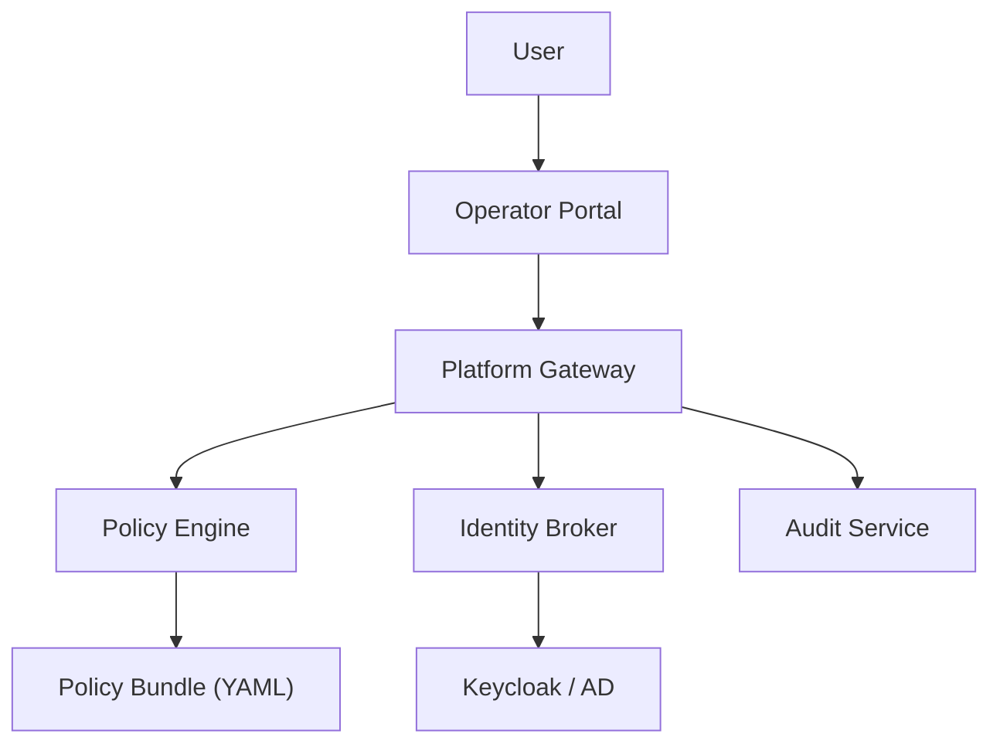
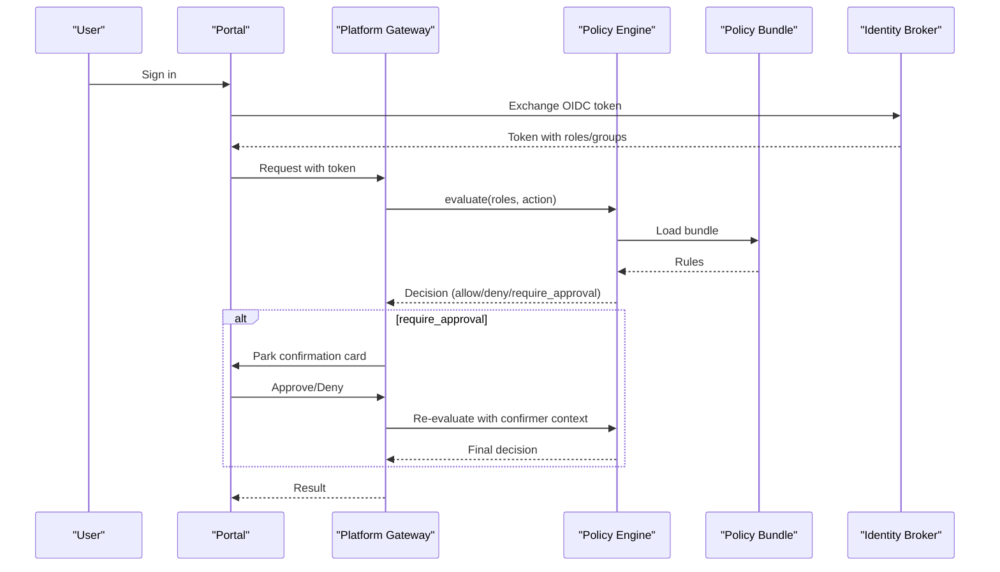
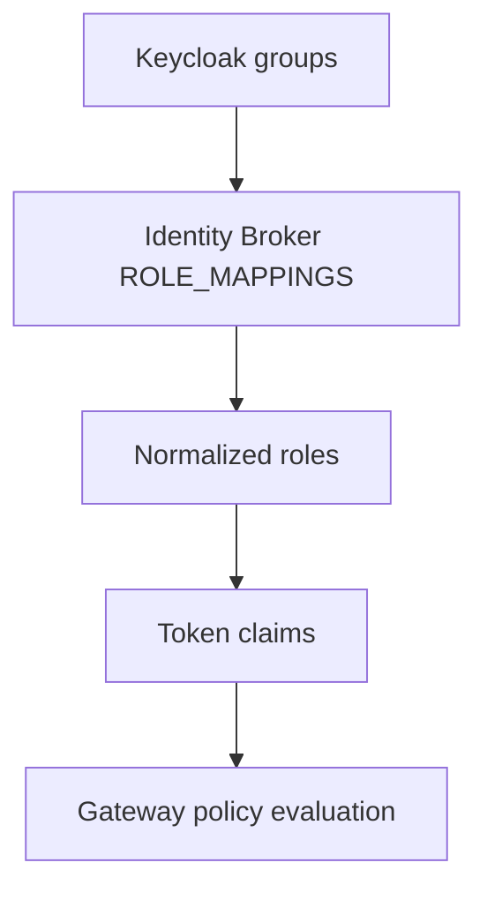
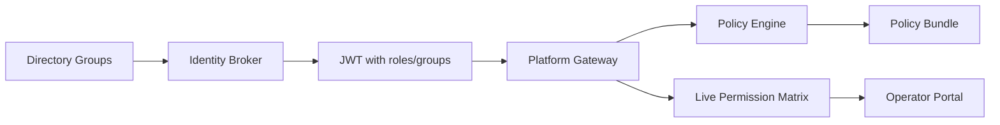

# Authorization Matrix

<cite>
**Referenced Files in This Document**
- [authorization-matrix.md](file://docs/agentic-aiops-platform/authorization-matrix.md)
- [identity-and-authorization-design.md](file://docs/agentic-aiops-platform/identity-and-authorization-design.md)
- [policy-default.yaml](file://shared/shared-contracts/policies/policy-default.yaml)
- [policy-matrix.schema.json](file://shared/shared-contracts/schemas/policy-matrix.schema.json)
- [policy_engine.py](file://products/platform-gateway/src/platform_gateway/services/policy_engine.py)
- [policy_matrix.py](file://products/platform-gateway/src/platform_gateway/services/policy_matrix.py)
- [api.py](file://products/platform-gateway/src/platform_gateway/schemas/api.py)
- [identity_service.py](file://products/identity-broker/src/identity_service/services/identity_service.py)
- [token_service.py](file://products/identity-broker/src/identity_service/services/token_service.py)
- [user-and-role-administration.md](file://docs/guides/user-and-role-administration.md)
- [PermissionsView.tsx](file://products/operator-portal/web-ui/app/src/views/control/PermissionsView.tsx)
- [test_policy_matrix.py](file://products/platform-gateway/tests/test_policy_matrix.py)
</cite>

## Table of Contents
1. [Introduction](#introduction)
2. [Project Structure](#project-structure)
3. [Core Components](#core-components)
4. [Architecture Overview](#architecture-overview)
5. [Detailed Component Analysis](#detailed-component-analysis)
6. [Dependency Analysis](#dependency-analysis)
7. [Performance Considerations](#performance-considerations)
8. [Troubleshooting Guide](#troubleshooting-guide)
9. [Conclusion](#conclusion)
10. [Appendices](#appendices)

## Introduction
This document defines the platform’s authorization matrix: the role hierarchy, environment scoping, feature and action permissions, approval model, and how the policy engine enforces decisions. It consolidates design intent from the authorization matrix document with the implemented policy bundle, gateway enforcement, identity mapping, and portal transparency surfaces.

The platform uses a deny-by-default model. Roles are normalized from directory groups into a fixed vocabulary. Actions are granted by explicit rules in a versioned policy bundle. Risk tiers gate approvals, and production actions require stronger controls than development or test environments.

**Section sources**
- [authorization-matrix.md:1-60](file://docs/agentic-aiops-platform/authorization-matrix.md#L1-L60)
- [identity-and-authorization-design.md:1-60](file://docs/agentic-aiops-platform/identity-and-authorization-design.md#L1-L60)

## Project Structure
Authorization spans several components:
- Identity broker maps directory groups to platform roles and issues tokens carrying roles and groups.
- Platform gateway enforces policies on protected actions and exposes a live permission matrix.
- Policy bundle defines role-to-action grants and approval requirements.
- Operator portal renders the effective permissions for the current user.
- Audit service records decisions and execution events.

**Diagram sources**
- [policy_engine.py:390-444](file://products/platform-gateway/src/platform_gateway/services/policy_engine.py#L390-L444)
- [identity_service.py:24-38](file://products/identity-broker/src/identity_service/services/identity_service.py#L24-L38)
- [policy-default.yaml:1-52](file://shared/shared-contracts/policies/policy-default.yaml#L1-L52)
- [PermissionsView.tsx:96-127](file://products/operator-portal/web-ui/app/src/views/control/PermissionsView.tsx#L96-L127)

**Section sources**
- [identity-service.py:24-38](file://products/identity-broker/src/identity_service/services/identity_service.py#L24-L38)
- [policy_engine.py:30-127](file://products/platform-gateway/src/platform_gateway/services/policy_engine.py#L30-L127)
- [policy-default.yaml:53-326](file://shared/shared-contracts/policies/policy-default.yaml#L53-L326)
- [api.py:209-226](file://products/platform-gateway/src/platform_gateway/schemas/api.py#L209-L226)

## Core Components
- Roles: read-only-observer, operator, developer, approver, auditor, platform-admin.
- Environments: dev, test, staging, prod.
- Action categories and risk tiers: tier 0 (read-only), tier 1 (low-risk non-production), tier 2 (low-risk production), tier 3 (high-risk production).
- Outcomes: allow, deny, request-only, approve-only, request-and-approve.
- Enforcement: deny-by-default; explicit deny wins; require_approval overrides allow; higher priority wins within an outcome class; disabled rules ignored.

Role definitions and default permissions are documented in the authorization matrix. The policy bundle implements the concrete grants for today’s surface.

**Section sources**
- [authorization-matrix.md:18-60](file://docs/agentic-aiops-platform/authorization-matrix.md#L18-L60)
- [authorization-matrix.md:61-154](file://docs/agentic-aiops-platform/authorization-matrix.md#L61-L154)
- [policy_engine.py:119-127](file://products/platform-gateway/src/platform_gateway/services/policy_engine.py#L119-L127)

## Architecture Overview
The authorization flow evaluates identity, roles, environment scope, requested action, and risk tier against the loaded policy bundle. For mutating tool execution, a tier_2 approval is required before execution proceeds under the confirmer’s delegated token.

**Diagram sources**
- [policy_engine.py:390-444](file://products/platform-gateway/src/platform_gateway/services/policy_engine.py#L390-L444)
- [policy-default.yaml:129-152](file://shared/shared-contracts/policies/policy-default.yaml#L129-L152)
- [identity_service.py:24-38](file://products/identity-broker/src/identity_service/services/identity_service.py#L24-L38)

## Detailed Component Analysis

### Role Hierarchy and Mapping
- Fixed role vocabulary: read-only-observer, operator, developer, approver, auditor, platform-admin.
- Group-to-role mapping occurs in the identity broker. If no mapping matches, the user receives read-only-observer by default.
- Tokens carry roles and groups; downstream services rely on normalized roles for policy evaluation.

**Diagram sources**
- [identity_service.py:24-38](file://products/identity-broker/src/identity_service/services/identity_service.py#L24-L38)
- [token_service.py:110-126](file://products/identity-broker/src/identity_service/services/token_service.py#L110-L126)
- [policy_engine.py:390-444](file://products/platform-gateway/src/platform_gateway/services/policy_engine.py#L390-L444)

**Section sources**
- [identity_service.py:24-38](file://products/identity-broker/src/identity_service/services/identity_service.py#L24-L38)
- [token_service.py:110-126](file://products/identity-broker/src/identity_service/services/token_service.py#L110-L126)
- [user-and-role-administration.md:7-39](file://docs/guides/user-and-role-administration.md#L7-L39)

### Feature Access Matrix
Feature access is governed by both UI visibility and backend action grants. The following summarizes defaults derived from the authorization matrix and the policy bundle:
- Portal login and chat/service query: allowed for all operational roles including read-only-observer.
- Incident view: allowed for operational roles and observers.
- Approval queue view: allowed for approver, platform-admin, and auditor; limited for operator per policy.
- Audit history view: allowed for auditor and platform-admin; limited elsewhere.
- Skill management UI: allowed for platform-admin; limited for operator/approver where explicitly granted.
- Policy admin UI: allowed for platform-admin only.
- Identity mapping admin UI: allowed for platform-admin only.

These are enforced by route-level checks and action grants such as policy:read, skills:read, documents:create/read, session actions, and approvals:list.

**Section sources**
- [authorization-matrix.md:155-168](file://docs/agentic-aiops-platform/authorization-matrix.md#L155-L168)
- [policy-default.yaml:53-127](file://shared/shared-contracts/policies/policy-default.yaml#L53-L127)
- [policy-default.yaml:153-175](file://shared/shared-contracts/policies/policy-default.yaml#L153-L175)
- [policy-default.yaml:214-256](file://shared/shared-contracts/policies/policy-default.yaml#L214-L256)

### Environment Scoping
Environment eligibility affects what actions can be requested or approved:
- dev/test: broader self-approval for low-risk actions if policy allows.
- staging: tighter; operators request, approvers approve.
- prod: strongest controls; high-risk actions require designated approvers and separation of duties.

The authorization matrix documents default environment eligibility and environment-specific action matrices. Actual access still depends on mapped entitlements from identity providers.

**Section sources**
- [authorization-matrix.md:170-241](file://docs/agentic-aiops-platform/authorization-matrix.md#L170-L241)

### Relationship Between Roles, Features, Actions, and Risk Tiers
- Roles define who may act.
- Features define UI surfaces and capabilities.
- Actions define enforceable operations (e.g., tools:invoke, tools:mutate, session:create, incident:triage).
- Risk tiers determine approval requirements:
  - tier 0: read-only, no approval.
  - tier 1: low-risk non-production; may allow self-approval when policy permits.
  - tier 2: production low-risk; requires designated approver distinct from requester.
  - tier 3: high-risk production; strong controls, often two-person approval recommended.

Mutating tool execution is bridged through chat:confirm and requires tier_2 approval by approver or platform-admin.

**Section sources**
- [authorization-matrix.md:34-60](file://docs/agentic-aiops-platform/authorization-matrix.md#L34-L60)
- [policy-default.yaml:129-152](file://shared/shared-contracts/policies/policy-default.yaml#L129-L152)
- [policy_engine.py:119-127](file://products/platform-gateway/src/platform_gateway/services/policy_engine.py#L119-L127)

### Complete Permission Matrix
The authoritative, enforced matrix is exposed by the platform gateway and rendered in the portal Permissions view. It includes:
- version, source, sha256 fingerprint of the loaded bundle.
- scope: full for platform-admin; own for other users.
- roles and actions catalog.
- matrix: boolean cells indicating immediate allowance.
- approval_requirements: additive third cell state for require_approval outcomes, including tier and decider roles.

Tests assert many grant postures for actions like approvals:list, documents:create/read, session:update, session:skill_draft, and incident:skill_draft.

**Section sources**
- [api.py:209-226](file://products/platform-gateway/src/platform_gateway/schemas/api.py#L209-L226)
- [policy-matrix.schema.json:1-85](file://shared/shared-contracts/schemas/policy-matrix.schema.json#L1-L85)
- [test_policy_matrix.py:152-194](file://products/platform-gateway/tests/test_policy_matrix.py#L152-L194)
- [PermissionsView.tsx:96-127](file://products/operator-portal/web-ui/app/src/views/control/PermissionsView.tsx#L96-L127)

### Sessions Management
Session actions include create, read, list, delete, update, and skill-related operations:
- session:create, session:read, session:list, session:delete, session:update are granted to operational roles and observers.
- session:skill_draft and session:skill_graduate are granted to platform-admin, approver, and operator.
- Development sessions additionally require session:skill_graduate at creation time.

Ownership scoping is enforced server-side to prevent enumeration of foreign sessions.

**Section sources**
- [policy-default.yaml:53-74](file://shared/shared-concontracts/policies/policy-default.yaml#L53-L74)
- [policy-default.yaml:275-326](file://shared/shared-contracts/policies/policy-default.yaml#L275-L326)
- [authorization-matrix.md:368-415](file://docs/agentic-aiops-platform/authorization-matrix.md#L368-L415)

### Tool Invocation
- tools:list: allowed for operational roles and observers.
- tools:invoke: allowed for operational roles and observers; read-risk tools only.
- tools:mutate: allowed for platform-admin, approver, and operator; requires tier_2 approval via chat:confirm.

Browser write tools are bounded and subject to HITL confirmation and approval gates.

**Section sources**
- [policy-default.yaml:90-127](file://shared/shared-contracts/policies/policy-default.yaml#L90-L127)
- [policy-default.yaml:129-152](file://shared/shared-contracts/policies/policy-default.yaml#L129-L152)
- [authorization-matrix.md:360-397](file://docs/agentic-aiops-platform/authorization-matrix.md#L360-L397)

### Incident Operations
- incident:read: allowed for operational roles and observers.
- incident:create: allowed for operational roles and platform-admin/approver.
- incident:triage: allowed for operational roles and platform-admin/approver.
- incident:skill_draft: dual-gated with incident:read; granted to operational authoring roles.

**Section sources**
- [policy-default.yaml:177-212](file://shared/shared-contracts/policies/policy-default.yaml#L177-L212)
- [policy-default.yaml:292-307](file://shared/shared-contracts/policies/policy-default.yaml#L292-L307)
- [authorization-matrix.md:416-454](file://docs/agentic-aiops-platform/authorization-matrix.md#L416-L454)

### Administrative Functions
- policy:read: allowed for all roles to view effective permissions.
- documents:create, documents:read: allowed for platform-admin, approver, and operator.
- approvals:list: allowed for approver and platform-admin.
- audit:read: allowed for auditor and platform-admin.

**Section sources**
- [policy-default.yaml:214-256](file://shared/shared-contracts/policies/policy-default.yaml#L214-L256)
- [policy-default.yaml:164-175](file://shared/shared-contracts/policies/policy-default.yaml#L164-L175)

### Audit Access
- audit:read: allowed for auditor and platform-admin.
- Audit surfaces include summary and CSV export, riding existing audit:read grants.

**Section sources**
- [policy-default.yaml:164-175](file://shared/shared-contracts/policies/policy-default.yaml#L164-L175)
- [authorization-matrix.md:455-463](file://docs/agentic-aiops-platform/authorization-matrix.md#L455-L463)

### Approval Model and Separation of Duties
- Tier 1: self-approval allowed by default for session operators when policy permits.
- Tier 2: designated approver distinct from requester; self-approval blocked.
- Production high-risk actions require stronger controls; destructive actions denied by default.

**Section sources**
- [policy_engine.py:119-127](file://products/platform-gateway/src/platform_gateway/services/policy_engine.py#L119-L127)
- [policy-default.yaml:129-152](file://shared/shared-contracts/policies/policy-default.yaml#L129-L152)
- [authorization-matrix.md:266-281](file://docs/agentic-aiops-platform/authorization-matrix.md#L266-L281)

## Dependency Analysis
Roles flow from directory groups through the identity broker into tokens. The platform gateway loads the policy bundle and evaluates each protected action. The portal renders the effective matrix for transparency.

**Diagram sources**
- [identity_service.py:24-38](file://products/identity-broker/src/identity_service/services/identity_service.py#L24-L38)
- [token_service.py:110-126](file://products/identity-broker/src/identity_service/services/token_service.py#L110-L126)
- [policy_engine.py:334-387](file://products/platform-gateway/src/platform_gateway/services/policy_engine.py#L334-L387)
- [policy_matrix.py:1-35](file://products/platform-gateway/src/platform_gateway/services/policy_matrix.py#L1-L35)
- [PermissionsView.tsx:96-127](file://products/operator-portal/web-ui/app/src/views/control/PermissionsView.tsx#L96-L127)

**Section sources**
- [identity_service.py:24-38](file://products/identity-broker/src/identity_service/services/identity_service.py#L24-L38)
- [policy_engine.py:334-387](file://products/platform-gateway/src/platform_gateway/services/policy_engine.py#L334-L387)
- [policy_matrix.py:1-35](file://products/platform-gateway/src/platform_gateway/services/policy_matrix.py#L1-L35)

## Performance Considerations
- Policy bundle loading is cached per configured path; evaluation is fast and deterministic.
- Live matrix derivation reuses the same evaluate() path, ensuring consistency without extra logic.
- Avoid frequent bundle reloads; changes take effect on next load cycle.

[No sources needed since this section provides general guidance]

## Troubleshooting Guide
Common issues and resolutions:
- User signs in but has only observer access: verify group membership and that the realm’s groups client scope is attached.
- Role change not taking effect: old token still live; revoke sessions or wait for refresh.
- Login fails outright: check OIDC flow configuration and network connectivity.
- Permissions mismatch: confirm the deployed bundle version and source via the portal Permissions view; compare SHA-256 fingerprint with canonical file.

**Section sources**
- [user-and-role-administration.md:118-137](file://docs/guides/user-and-role-administration.md#L118-L137)
- [policy_engine.py:374-387](file://products/platform-gateway/src/platform_gateway/services/policy_engine.py#L374-L387)
- [PermissionsView.tsx:96-127](file://products/operator-portal/web-ui/app/src/views/control/PermissionsView.tsx#L96-L127)

## Conclusion
The platform’s authorization model combines a fixed role vocabulary, environment-scoped permissions, and a versioned policy bundle evaluated by a deny-by-default engine. Mutating actions are tightly controlled through HITL and tiered approvals. Transparency is provided via a live permission matrix rendered in the portal, enabling operators to verify effective permissions at runtime.

[No sources needed since this section summarizes without analyzing specific files]

## Appendices

### Policy Matrix Schema
The schema defines the structure of the live permission matrix response, including version, source, fingerprint, scope, roles, actions, boolean matrix, and approval_requirements for require_approval outcomes.

**Section sources**
- [policy-matrix.schema.json:1-85](file://shared/shared-contracts/schemas/policy-matrix.schema.json#L1-L85)
- [api.py:209-226](file://products/platform-gateway/src/platform_gateway/schemas/api.py#L209-L226)

### Role Assignment and Custom Roles
- Assign roles by adding users to appropriate Keycloak groups; the identity broker maps them to platform roles.
- To change what a role may do, edit the policy bundle and deploy it; verify via the portal Permissions view.
- Adding a new role requires code changes to role mappings, bundle rules, and a spec due to trust model impact. Prefer adjusting actions on existing roles for different permission mixes.

**Section sources**
- [user-and-role-administration.md:74-102](file://docs/guides/user-and-role-administration.md#L74-L102)
- [identity_service.py:24-38](file://products/identity-broker/src/identity_service/services/identity_service.py#L24-L38)

### Integration With Broader Policy Engine
- The platform gateway’s policy engine implements the action_authz slice of the Tier-1 policy specification.
- It supports deny, allow, and require_approval outcomes with explicit tiers and decider roles.
- Bridged actions (currently tools:mutate) are enforced through the chat:confirm flow with tier_2 approval.

**Section sources**
- [policy_engine.py:1-127](file://products/platform-gateway/src/platform_gateway/services/policy_engine.py#L1-L127)
- [policy-default.yaml:129-152](file://shared/shared-contracts/policies/policy-default.yaml#L129-L152)