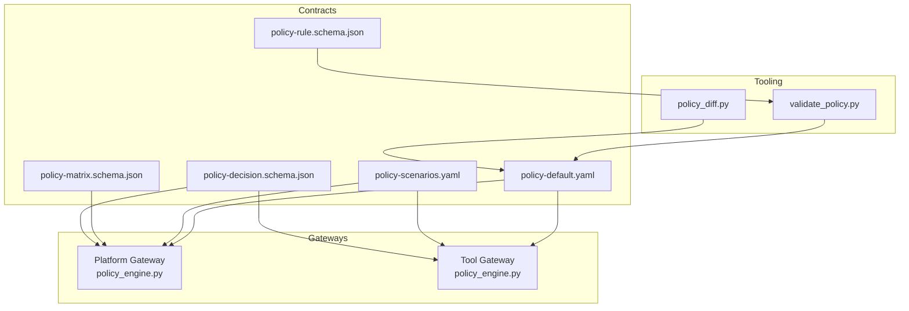
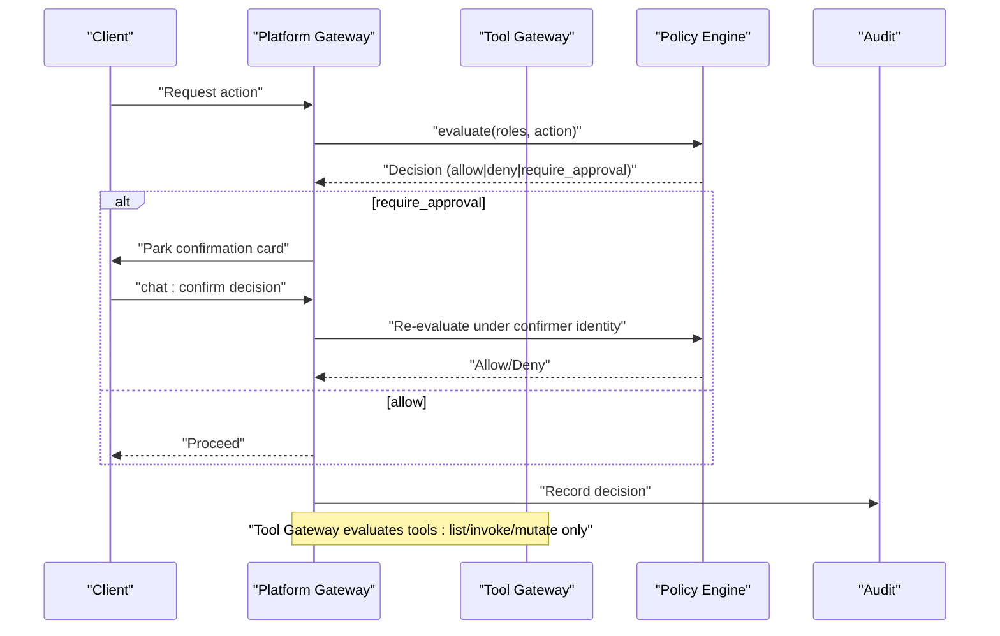
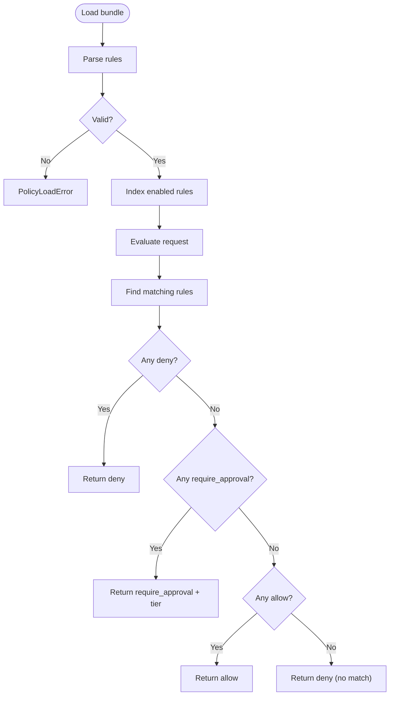
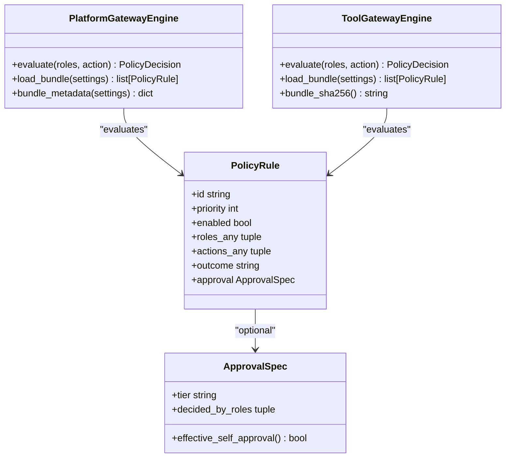
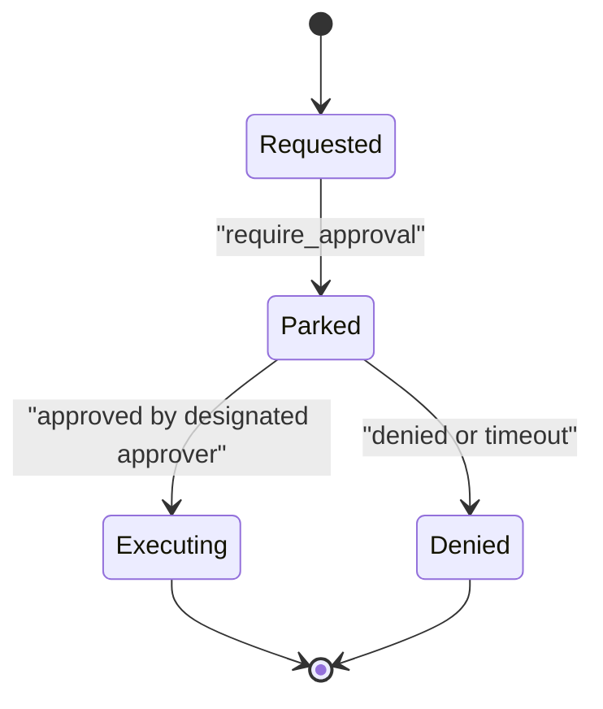
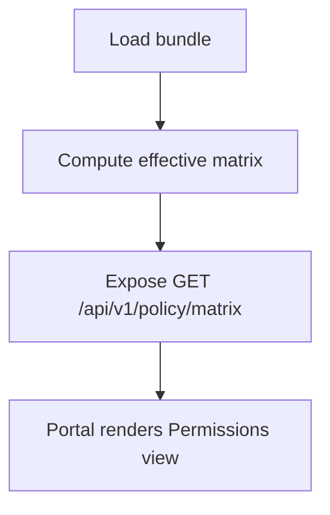
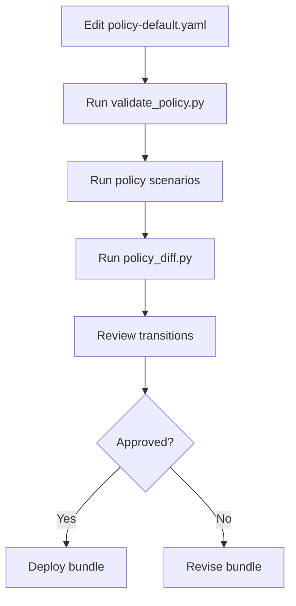
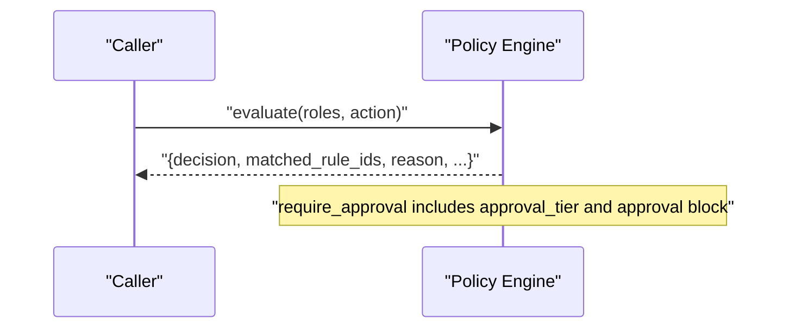
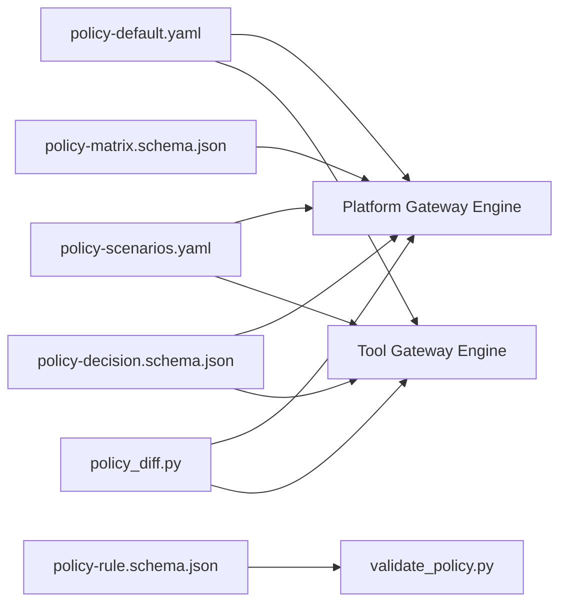

# Authorization Policies

<cite>
**Referenced Files in This Document**
- [policy-default.yaml](file://shared/shared-contracts/policies/policy-default.yaml)
- [policy-scenarios.yaml](file://shared/shared-contracts/policies/policy-scenarios.yaml)
- [authorization-matrix.md](file://docs/agentic-aiops-platform/authorization-matrix.md)
- [policy-specification.md](file://docs/agentic-aiops-platform/policy-specification.md)
- [identity-and-authorization-design.md](file://docs/agentic-aiops-platform/identity-and-authorization-design.md)
- [policy-rule.schema.json](file://shared/shared-contracts/schemas/policy-rule.schema.json)
- [policy-matrix.schema.json](file://shared/shared-contracts/schemas/policy-matrix.schema.json)
- [policy-decision.schema.json](file://shared/shared-contracts/schemas/policy-decision.schema.json)
- [platform-gateway policy_engine.py](file://products/platform-gateway/src/platform_gateway/services/policy_engine.py)
- [tool-gateway policy_engine.py](file://products/tool-gateway/src/tool_gateway/services/policy_engine.py)
- [validate_policy.py](file://shared/shared-contracts/scripts/validate_policy.py)
- [policy_diff.py](file://shared/shared-contracts/scripts/policy_diff.py)
</cite>

## Table of Contents
1. Introduction
2. Project Structure
3. Core Components
4. Architecture Overview
5. Detailed Component Analysis
6. Dependency Analysis
7. Performance Considerations
8. Troubleshooting Guide
9. Conclusion
10. Appendices

## Introduction
This document explains the Luban AIOPS platform authorization policy system end-to-end: how policies are authored, validated, evaluated at runtime, and enforced across the platform’s control plane and tool execution paths. It covers the policy-as-code model, rule schema, evaluation engine behavior, enforcement points, risk-tier classification, approval workflows, scenario testing, policy diffing for change management, inheritance and override semantics, debugging decisions, and guidance for authoring and maintaining policies across environments.

## Project Structure
The authorization system is centered around a canonical policy bundle, shared schemas, two gateway engines (API surface and tool invocation), and developer tooling for validation and change review.

**Diagram sources**
- [policy-default.yaml:1-326](file://shared/shared-contracts/policies/policy-default.yaml#L1-L326)
- [policy-scenarios.yaml:1-238](file://shared/shared-contracts/policies/policy-scenarios.yaml#L1-L238)
- [policy-rule.schema.json:1-105](file://shared/shared-contracts/schemas/policy-rule.schema.json#L1-L105)
- [policy-matrix.schema.json:1-85](file://shared/shared-contracts/schemas/policy-matrix.schema.json#L1-L85)
- [policy-decision.schema.json:1-60](file://shared/shared-contracts/schemas/policy-decision.schema.json#L1-L60)
- [platform-gateway policy_engine.py:1-444](file://products/platform-gateway/src/platform_gateway/services/policy_engine.py#L1-L444)
- [tool-gateway policy_engine.py:1-355](file://products/tool-gateway/src/tool_gateway/services/policy_engine.py#L1-L355)
- [validate_policy.py:1-91](file://shared/shared-contracts/scripts/validate_policy.py#L1-L91)
- [policy_diff.py:1-188](file://shared/shared-contracts/scripts/policy_diff.py#L1-L188)

**Section sources**
- [policy-default.yaml:1-326](file://shared/shared-contracts/policies/policy-default.yaml#L1-L326)
- [policy-specification.md:1-567](file://docs/agentic-aiops-platform/policy-specification.md#L1-L567)
- [authorization-matrix.md:1-528](file://docs/agentic-aiops-platform/authorization-matrix.md#L1-L528)

## Core Components
- Policy bundle: versioned YAML defining rules with match criteria and outcomes.
- Rule schema: JSON Schema enforcing rule structure and approval blocks.
- Decision schema: standardized response shape from policy evaluation.
- Matrix schema: transparency output derived from the loaded bundle.
- Engines: deny-by-default evaluators in platform-gateway and tool-gateway with different enforcement scopes.
- Tooling: validator and diff tool to ensure correctness and review impact.

Key responsibilities:
- Platform gateway enforces API actions including chat, sessions, incidents, audit, skills, approvals, documents, models, and HITL confirmations.
- Tool gateway enforces tool invocation actions (list, invoke, mutate).
- Both engines share the same rule format but differ in which actions they bridge to approval flows.

**Section sources**
- [policy-rule.schema.json:1-105](file://shared/shared-contracts/schemas/policy-rule.schema.json#L1-L105)
- [policy-decision.schema.json:1-60](file://shared/shared-contracts/schemas/policy-decision.schema.json#L1-L60)
- [policy-matrix.schema.json:1-85](file://shared/shared-contracts/schemas/policy-matrix.schema.json#L1-L85)
- [platform-gateway policy_engine.py:30-127](file://products/platform-gateway/src/platform_gateway/services/policy_engine.py#L30-L127)
- [tool-gateway policy_engine.py:32-52](file://products/tool-gateway/src/tool_gateway/services/policy_engine.py#L32-L52)

## Architecture Overview
The platform uses a policy-as-code approach where a single canonical bundle defines all action permissions. Gateways load the bundle once per process, compute a content fingerprint, and evaluate requests against it using deny-by-default semantics. Approval-required actions are bridged through the platform gateway’s confirmation flow; the tool gateway performs admission-only allow/deny checks.

**Diagram sources**
- [platform-gateway policy_engine.py:390-444](file://products/platform-gateway/src/platform_gateway/services/policy_engine.py#L390-L444)
- [tool-gateway policy_engine.py:299-355](file://products/tool-gateway/src/tool_gateway/services/policy_engine.py#L299-L355)
- [policy-default.yaml:130-152](file://shared/shared-contracts/policies/policy-default.yaml#L130-L152)

## Detailed Component Analysis

### Policy Bundle and Rule Model
- The canonical bundle declares role-action grants, denials, and approval requirements.
- Rules include id, domain, description, priority, enabled flag, match (roles_any, actions_any), and decision (outcome and optional approval block).
- Precedence: explicit deny > require_approval > allow; within an outcome class, higher priority wins. Disabled rules are ignored.
- Approval tiers:
  - tier_1: session operator may self-confirm routine destructive-but-routine actions.
  - tier_2: designated approver distinct from requester must decide; self-approval forbidden by default.

**Diagram sources**
- [platform-gateway policy_engine.py:269-331](file://products/platform-gateway/src/platform_gateway/services/policy_engine.py#L269-L331)
- [platform-gateway policy_engine.py:390-444](file://products/platform-gateway/src/platform_gateway/services/policy_engine.py#L390-L444)
- [policy-rule.schema.json:47-100](file://shared/shared-contracts/schemas/policy-rule.schema.json#L47-L100)

**Section sources**
- [policy-default.yaml:1-52](file://shared/shared-contracts/policies/policy-default.yaml#L1-L52)
- [policy-default.yaml:53-326](file://shared/shared-contracts/policies/policy-default.yaml#L53-L326)
- [policy-rule.schema.json:1-105](file://shared/shared-contracts/schemas/policy-rule.schema.json#L1-L105)

### Enforcement Points
- Platform gateway protects API actions such as chat, sessions, incidents, audit, skills, approvals, documents, models, and HITL confirmations.
- Tool gateway protects tool actions: list, invoke, mutate.
- Only platform gateway bridges require_approval to the chat:confirm flow; tool gateway skips require_approval rules at load and performs allow/deny admission only.

**Diagram sources**
- [platform-gateway policy_engine.py:142-210](file://products/platform-gateway/src/platform_gateway/services/policy_engine.py#L142-L210)
- [tool-gateway policy_engine.py:66-133](file://products/tool-gateway/src/tool_gateway/services/policy_engine.py#L66-L133)

**Section sources**
- [platform-gateway policy_engine.py:30-127](file://products/platform-gateway/src/platform_gateway/services/policy_engine.py#L30-L127)
- [tool-gateway policy_engine.py:32-52](file://products/tool-gateway/src/tool_gateway/services/policy_engine.py#L32-L52)

### Risk-Tier Classification and Approval Workflows
- Risk tiers define severity and typical conditions:
  - tier_0: read-only, no approval.
  - tier_1: low-risk non-production; may allow self-approval in non-production.
  - tier_2: production low-risk; requires approver, no self-approval.
  - tier_3: high-risk production; strong controls, possibly two-person approval.
- In the shipped bundle, mutating tool execution is placed under tier_2 approval decided by approver and platform-admin roles.

**Diagram sources**
- [policy-default.yaml:130-152](file://shared/shared-contracts/policies/policy-default.yaml#L130-L152)
- [policy-specification.md:275-296](file://docs/agentic-aiops-platform/policy-specification.md#L275-L296)

**Section sources**
- [authorization-matrix.md:315-327](file://docs/agentic-aiops-platform/authorization-matrix.md#L315-L327)
- [policy-specification.md:275-296](file://docs/agentic-aiops-platform/policy-specification.md#L275-L296)

### Policy Matrix and Transparency
- The live matrix is derived from the loaded bundle and exposes:
  - version, source, sha256, scope, roles, actions, matrix cells (boolean immediate allowance), and approval_requirements (additive third cell state for require_approval matches).
- Scope: platform-admin sees full matrix; other identities see only their granted roles.

**Diagram sources**
- [policy-matrix.schema.json:1-85](file://shared/shared-contracts/schemas/policy-matrix.schema.json#L1-L85)
- [authorization-matrix.md:349-356](file://docs/agentic-aiops-platform/authorization-matrix.md#L349-L356)

**Section sources**
- [policy-matrix.schema.json:1-85](file://shared/shared-contracts/schemas/policy-matrix.schema.json#L1-L85)
- [authorization-matrix.md:349-356](file://docs/agentic-aiops-platform/authorization-matrix.md#L349-L356)

### Scenario Testing and Change Management
- Scenarios pin expected outcomes for every grant and named denial across both engines, ensuring new grants cannot merge without recorded expectations.
- Validation script enforces schema compliance and version discipline.
- Diff tool reports per-(role, action) transitions between canonical and candidate bundles, honoring engine non-parity.

**Diagram sources**
- [policy-scenarios.yaml:1-238](file://shared/shared-contracts/policies/policy-scenarios.yaml#L1-L238)
- [validate_policy.py:1-91](file://shared/shared-contracts/scripts/validate_policy.py#L1-L91)
- [policy_diff.py:1-188](file://shared/shared-contracts/scripts/policy_diff.py#L1-L188)

**Section sources**
- [policy-scenarios.yaml:1-238](file://shared/shared-contracts/policies/policy-scenarios.yaml#L1-L238)
- [policy-specification.md:459-474](file://docs/agentic-aiops-platform/policy-specification.md#L459-L474)

### Custom Policy Rules and Examples
- Example patterns:
  - Allow operational roles to use chat and manage sessions.
  - Require tier_2 approval for mutating tool execution, decided by approver and platform-admin.
  - Restrict audit:read to auditors and platform-admin.
  - Grant incident read/create/triage to operational roles.
  - Permit policy:read and skills:read for all operational roles.
  - Limit approvals:list to tier_2 deciders.
  - Gate operations documents and skill drafting/graduation to operational roles.

These examples are defined in the canonical bundle and exercised by the scenario file.

**Section sources**
- [policy-default.yaml:53-326](file://shared/shared-contracts/policies/policy-default.yaml#L53-L326)
- [policy-scenarios.yaml:21-198](file://shared/shared-contracts/policies/policy-scenarios.yaml#L21-L198)

### Policy Inheritance and Overrides
- There is no hierarchical inheritance; rules are flat and evaluated by:
  - Role and action match.
  - Enabled flag.
  - Outcome precedence: deny > require_approval > allow.
  - Within an outcome class, highest priority wins.
- Overriding behavior is achieved by adding higher-priority rules or explicit deny rules.

**Section sources**
- [policy-default.yaml:14-19](file://shared/shared-contracts/policies/policy-default.yaml#L14-L19)
- [platform-gateway policy_engine.py:390-444](file://products/platform-gateway/src/platform_gateway/services/policy_engine.py#L390-L444)

### Debugging Policy Decisions
- Each decision includes matched_rule_ids and reason.
- For require_approval, the decision carries approval_tier and the winning rule’s approval block so callers do not re-read the bundle.
- Bundle metadata exposes version, source, and sha256 provenance for live verification.

**Diagram sources**
- [platform-gateway policy_engine.py:181-210](file://products/platform-gateway/src/platform_gateway/services/policy_engine.py#L181-L210)
- [policy-decision.schema.json:1-60](file://shared/shared-contracts/schemas/policy-decision.schema.json#L1-L60)

**Section sources**
- [policy-decision.schema.json:1-60](file://shared/shared-contracts/schemas/policy-decision.schema.json#L1-L60)
- [platform-gateway policy_engine.py:374-387](file://products/platform-gateway/src/platform_gateway/services/policy_engine.py#L374-L387)

## Dependency Analysis
- Bundles are consumed by both engines; engines implement identical evaluation logic with different protected action sets and approval bridging.
- Tooling depends on engines to produce accurate diffs and validations.
- Schemas constrain bundle and decision shapes.

**Diagram sources**
- [platform-gateway policy_engine.py:1-444](file://products/platform-gateway/src/platform_gateway/services/policy_engine.py#L1-L444)
- [tool-gateway policy_engine.py:1-355](file://products/tool-gateway/src/tool_gateway/services/policy_engine.py#L1-L355)
- [validate_policy.py:1-91](file://shared/shared-contracts/scripts/validate_policy.py#L1-L91)
- [policy_diff.py:1-188](file://shared/shared-contracts/scripts/policy_diff.py#L1-L188)

**Section sources**
- [platform-gateway policy_engine.py:30-127](file://products/platform-gateway/src/platform_gateway/services/policy_engine.py#L30-L127)
- [tool-gateway policy_engine.py:32-52](file://products/tool-gateway/src/tool_gateway/services/policy_engine.py#L32-L52)

## Performance Considerations
- Bundles are loaded once per process and cached; evaluation scans enabled rules matching the requested action and intersecting roles.
- Complexity per evaluation is proportional to the number of enabled rules that match the action; priorities and precedence are applied after matching.
- Use minimal, precise actions_any and roles_any to reduce matching work.
- Avoid excessive rule proliferation; prefer grouping related actions and roles.

[No sources needed since this section provides general guidance]

## Troubleshooting Guide
Common issues and remedies:
- Invalid YAML or malformed rule: loader raises PolicyLoadError; fix syntax and required fields.
- Unknown outcome or missing approval block on require_approval: loader rejects; correct outcome or add required approval block.
- require_approval on unbridged actions in tool gateway: skipped at load with warning; move approval enforcement to platform gateway or remove requirement from tool path.
- Tier_2 allowing self-approval explicitly: rejected at load; remove allow_self_approval or switch to tier_1 if appropriate.
- No matching rule results in deny by default: add explicit allow or adjust roles/actions.

Use tooling:
- validate_policy.py to catch schema and version errors before deployment.
- policy_diff.py to review per-(role, action) changes and ensure intended transitions.
- Check bundle metadata sha256 to verify deployed bundle matches canonical.

**Section sources**
- [platform-gateway policy_engine.py:229-331](file://products/platform-gateway/src/platform_gateway/services/policy_engine.py#L229-L331)
- [tool-gateway policy_engine.py:152-251](file://products/tool-gateway/src/tool_gateway/services/policy_engine.py#L152-L251)
- [validate_policy.py:32-86](file://shared/shared-contracts/scripts/validate_policy.py#L32-L86)
- [policy_diff.py:117-183](file://shared/shared-contracts/scripts/policy_diff.py#L117-L183)

## Conclusion
The Luban AIOPS platform implements a robust, testable, and auditable authorization system grounded in a single canonical policy bundle. Deny-by-default semantics, clear precedence, tiered approvals, and transparent matrices provide strong security posture while remaining flexible. Developer tooling ensures safe evolution of policies across environments with verifiable change reviews.

[No sources needed since this section summarizes without analyzing specific files]

## Appendices

### Roles and Capabilities Summary
- Read-only observer: broad read access to chat, sessions, incidents, skills, models; denied mutating, governance, and authoring surfaces.
- Operator: operational investigation, session management, incident triage, read tools, limited authoring depending on action.
- Developer: read-mostly technical identity; can chat, query services, list tools, confirm low-risk tier_1 cards; denied mutating, governance, and authoring surfaces.
- Approver: approve bounded actions within environment scope; listed in inbox and graduation-related authoring surfaces as applicable.
- Auditor: read-only audit trail; no request or execution rights.
- Platform-admin: platform configuration and policy settings; does not automatically bypass operational approvals.

**Section sources**
- [authorization-matrix.md:61-154](file://docs/agentic-aiops-platform/authorization-matrix.md#L61-L154)
- [policy-default.yaml:53-326](file://shared/shared-contracts/policies/policy-default.yaml#L53-L326)

### Runtime Evaluation Flow
- Normalize identity and request context.
- Load bundle and compute provenance hash.
- Match enabled rules by roles and actions.
- Apply precedence: deny > require_approval > allow; highest priority within outcome class.
- Return decision with matched rules and reasons; include approval details when required.

**Section sources**
- [policy-specification.md:256-273](file://docs/agentic-aiops-platform/policy-specification.md#L256-L273)
- [platform-gateway policy_engine.py:390-444](file://products/platform-gateway/src/platform_gateway/services/policy_engine.py#L390-L444)

### Authoring New Policies
- Add a rule with unique id, clear description, appropriate priority, and precise match criteria.
- For risky actions, prefer require_approval with explicit tier and decider roles.
- Update policy-scenarios.yaml to record expected outcomes for all affected (role, action) pairs.
- Run validate_policy.py and policy_diff.py; review transitions before merging.

**Section sources**
- [policy-rule.schema.json:1-105](file://shared/shared-contracts/schemas/policy-rule.schema.json#L1-L105)
- [policy-scenarios.yaml:1-238](file://shared/shared-contracts/policies/policy-scenarios.yaml#L1-L238)
- [policy_diff.py:1-188](file://shared/shared-contracts/scripts/policy_diff.py#L1-L188)

### Maintaining Compliance Across Environments
- Keep one canonical bundle under version control; bump version on every change.
- Promote bundles via deployment pipelines; verify sha256 fingerprints at each environment.
- Use make verify and make policy-diff gates to enforce tests and reviewability.

**Section sources**
- [policy-default.yaml:1-12](file://shared/shared-contracts/policies/policy-default.yaml#L1-L12)
- [policy-specification.md:436-457](file://docs/agentic-aiops-platform/policy-specification.md#L436-L457)