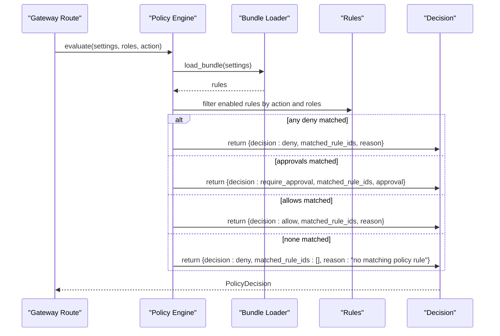
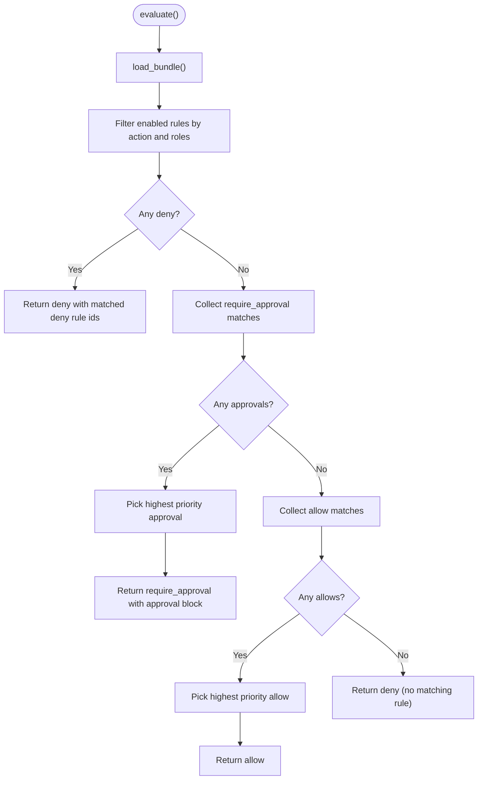
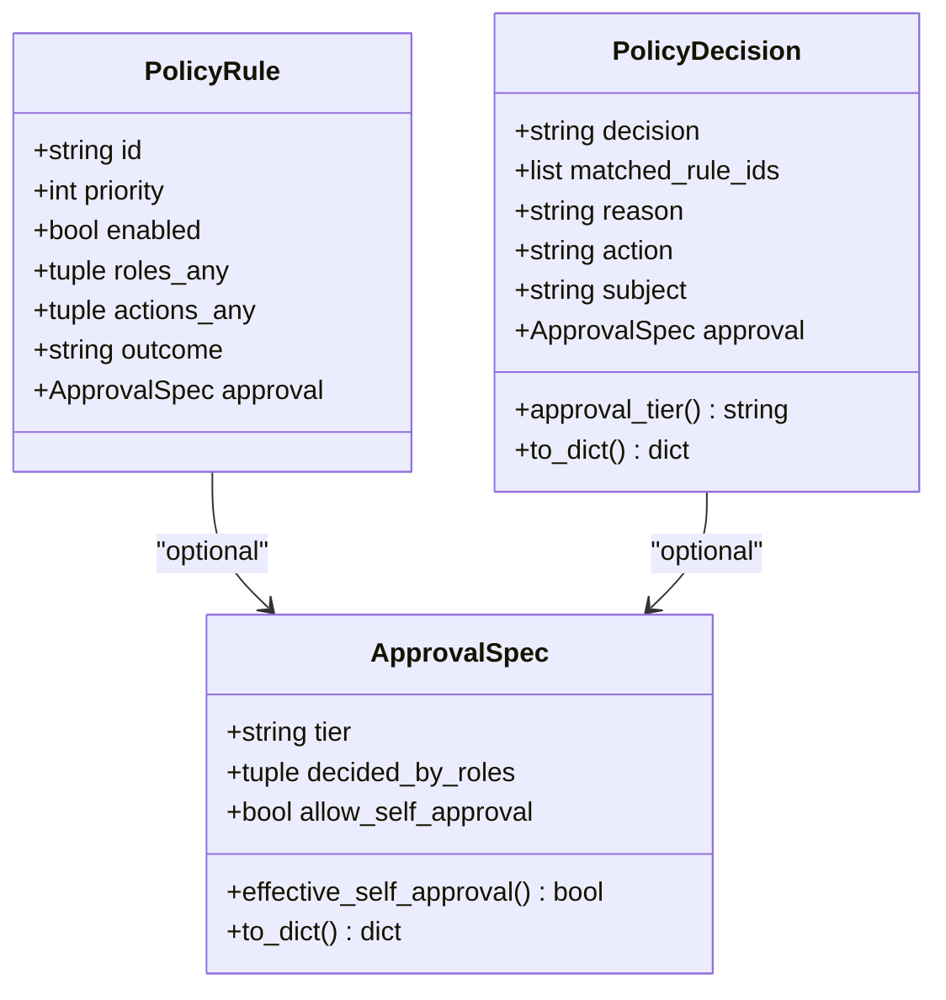
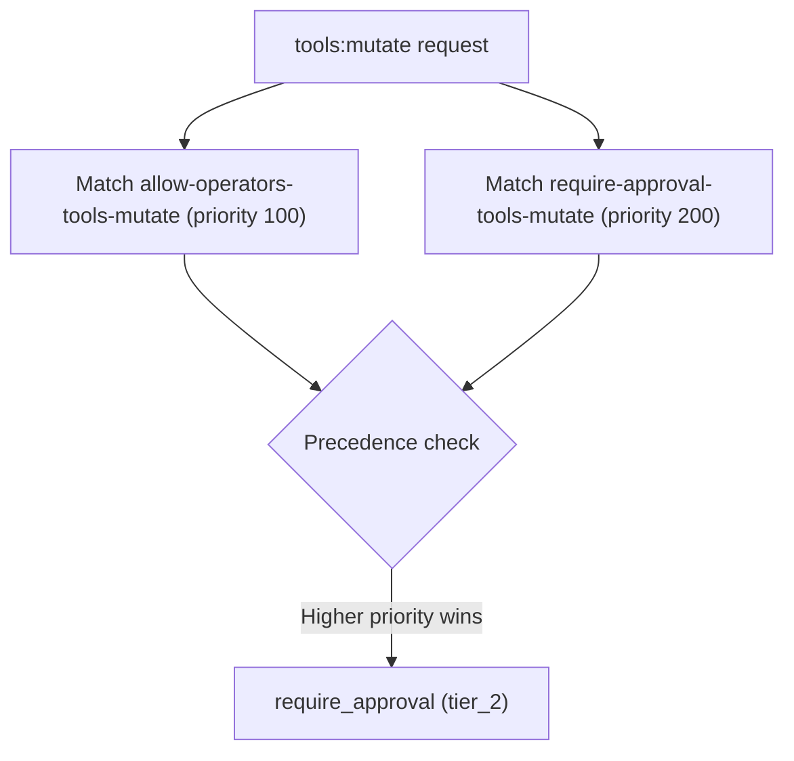

# Policy Evaluation Engine

<cite>
**Referenced Files in This Document**
- [policy_engine.py](file://products/platform-gateway/src/platform_gateway/services/policy_engine.py)
- [policy_engine.py](file://products/tool-gateway/src/tool_gateway/services/policy_engine.py)
- [policy-default.yaml](file://products/platform-gateway/src/platform_gateway/policies/policy-default.yaml)
- [policy-default.yaml](file://products/tool-gateway/src/tool_gateway/policies/policy-default.yaml)
- [policy-specification.md](file://docs/agentic-aiops-platform/policy-specification.md)
- [policy-decision.schema.json](file://shared/shared-contracts/schemas/policy-decision.schema.json)
- [policy-scenarios.yaml](file://shared/shared-contracts/policies/policy-scenarios.yaml)
</cite>

## Table of Contents
1. Introduction
2. Project Structure
3. Core Components
4. Architecture Overview
5. Detailed Component Analysis
6. Dependency Analysis
7. Performance Considerations
8. Troubleshooting Guide
9. Conclusion
10. Appendices

## Introduction
This document explains the policy evaluation engine implemented in the platform gateway and tool gateway services. It covers how a request is normalized, evaluated across four policy domains, and resolved to a final decision. It documents the four-domain order (feature_access, action_authz, approval, execution_gate), precedence rules (deny-by-default, explicit deny overrides, specificity-based matching, priority-based resolution), required inputs, outcomes, examples, error handling, logging, and debugging techniques.

The engines implement the action_authz slice with allow/deny/require_approval outcomes. The platform gateway bridges require_approval through a confirmation flow; the tool gateway enforces allow/deny at admission and defers approval enforcement to the platform gateway.

**Section sources**
- [policy-specification.md:223-295](file://docs/agentic-aiops-platform/policy-specification.md#L223-L295)
- [policy-engine.py (platform):1-12](file://products/platform-gateway/src/platform_gateway/services/policy_engine.py#L1-L12)
- [policy-engine.py (tool):1-14](file://products/tool-gateway/src/tool_gateway/services/policy_engine.py#L1-L14)

## Project Structure
At a high level:
- Each gateway ships a small, dependency-free policy engine module that loads a YAML bundle of rules and evaluates an action against roles.
- Default bundles define role-to-action grants and the tiered approval requirement for mutating actions.
- A shared JSON schema defines the decision object returned by both engines.
- Scenario files pin expected outcomes per (role, action) pairs for both gateways.

```mermaid
graph TB
subgraph "Platform Gateway"
PPE["Policy Engine<br/>services/policy_engine.py"]
PB["Default Bundle<br/>policies/policy-default.yaml"]
end
subgraph "Tool Gateway"
TPE["Policy Engine<br/>services/policy_engine.py"]
TB["Default Bundle<br/>policies/policy-default.yaml"]
end
DEC["Decision Schema<br/>shared/shared-contracts/schemas/policy-decision.schema.json"]
SCEN["Scenario Expectations<br/>shared/shared-contracts/policies/policy-scenarios.yaml"]
PPE --> PB
TPE --> TB
PPE --> DEC
TPE --> DEC
PPE --> SCEN
TPE --> SCEN
```

**Diagram sources**
- [policy_engine.py (platform):1-444](file://products/platform-gateway/src/platform_gateway/services/policy_engine.py#L1-L444)
- [policy_engine.py (tool):1-355](file://products/tool-gateway/src/tool_gateway/services/policy_engine.py#L1-L355)
- [policy-default.yaml (platform):1-326](file://products/platform-gateway/src/platform_gateway/policies/policy-default.yaml#L1-L326)
- [policy-default.yaml (tool):1-326](file://products/tool-gateway/src/tool_gateway/policies/policy-default.yaml#L1-L326)
- [policy-decision.schema.json:1-60](file://shared/shared-contracts/schemas/policy-decision.schema.json#L1-L60)
- [policy-scenarios.yaml:1-238](file://shared/shared-contracts/policies/policy-scenarios.yaml#L1-L238)

**Section sources**
- [policy_engine.py (platform):1-444](file://products/platform-gateway/src/platform_gateway/services/policy_engine.py#L1-L444)
- [policy_engine.py (tool):1-355](file://products/tool-gateway/src/tool_gateway/services/policy_engine.py#L1-L355)
- [policy-default.yaml (platform):1-326](file://products/platform-gateway/src/platform_gateway/policies/policy-default.yaml#L1-L326)
- [policy-default.yaml (tool):1-326](file://products/tool-gateway/src/tool_gateway/policies/policy-default.yaml#L1-L326)
- [policy-decision.schema.json:1-60](file://shared/shared-contracts/schemas/policy-decision.schema.json#L1-L60)
- [policy-scenarios.yaml:1-238](file://shared/shared-contracts/policies/policy-scenarios.yaml#L1-L238)

## Core Components
- PolicyRule: immutable rule with id, priority, enabled flag, match sets (roles_any, actions_any), outcome, and optional approval block.
- ApprovalSpec: captures tier, decided_by_roles, and optional self-approval override used when outcome is require_approval.
- PolicyDecision: final output containing decision, matched_rule_ids, reason, plus optional action, subject, approval_tier, and approval mirror.
- Bundles: versioned YAML files defining rules for each gateway surface.
- Engines: load_bundle(), evaluate(), and metadata helpers; tool gateway skips require_approval rules at load time.

Key behaviors:
- Deny-by-default: if no rule matches, return deny.
- Precedence: explicit deny > require_approval > allow; within same outcome class, higher priority wins.
- Disabled rules are ignored.
- Platform gateway supports require_approval; tool gateway skips require_approval rules at load and only returns allow/deny.

**Section sources**
- [policy_engine.py (platform):142-210](file://products/platform-gateway/src/platform_gateway/services/policy_engine.py#L142-L210)
- [policy_engine.py (tool):66-134](file://products/tool-gateway/src/tool_gateway/services/policy_engine.py#L66-L134)
- [policy_engine.py (platform):390-444](file://products/platform-gateway/src/platform_gateway/services/policy_engine.py#L390-L444)
- [policy_engine.py (tool):299-355](file://products/tool-gateway/src/tool_gateway/services/policy_engine.py#L299-L355)

## Architecture Overview
The evaluation pipeline follows the specification’s recommended flow: validate input shape, verify normalized identity context, then evaluate feature_access, action_authz, approval, and execution_gate in order. In this implementation, the engines focus on action_authz and integrate with approval where supported.



**Diagram sources**
- [policy_engine.py (platform):390-444](file://products/platform-gateway/src/platform_gateway/services/policy_engine.py#L390-L444)
- [policy_engine.py (tool):299-355](file://products/tool-gateway/src/tool_gateway/services/policy_engine.py#L299-L355)

**Section sources**
- [policy-specification.md:256-273](file://docs/agentic-aiops-platform/policy-specification.md#L256-L273)
- [policy_engine.py (platform):390-444](file://products/platform-gateway/src/platform_gateway/services/policy_engine.py#L390-L444)
- [policy_engine.py (tool):299-355](file://products/tool-gateway/src/tool_gateway/services/policy_engine.py#L299-L355)

## Detailed Component Analysis

### Platform Gateway Policy Engine
Responsibilities:
- Load and cache a versioned YAML bundle from a configured path or packaged default.
- Validate and parse rules, including strict validation of require_approval blocks.
- Evaluate action against roles with deny-by-default semantics and precedence rules.
- Return a decision object conforming to the shared schema.

Key implementation details:
- Action vocabulary includes chat, session:* , audit:read, incident:* , policy:read, tools:list, skills:read, chat:confirm, tools:mutate, models:list, approvals:list, documents:* , session:update, session:skill_draft, incident:skill_draft, session:skill_graduate.
- require_approval is valid only on bridged actions; currently tools:mutate is bridged.
- ApprovalSpec carries tier_1 or tier_2, decided_by_roles, and optional allow_self_approval.
- Module-level caching keyed by configured path; SHA-256 fingerprint recorded for provenance.



**Diagram sources**
- [policy_engine.py (platform):390-444](file://products/platform-gateway/src/platform_gateway/services/policy_engine.py#L390-L444)

**Section sources**
- [policy_engine.py (platform):30-127](file://products/platform-gateway/src/platform_gateway/services/policy_engine.py#L30-L127)
- [policy_engine.py (platform):229-331](file://products/platform-gateway/src/platform_gateway/services/policy_engine.py#L229-L331)
- [policy_engine.py (platform):334-387](file://products/platform-gateway/src/platform_gateway/services/policy_engine.py#L334-L387)
- [policy_engine.py (platform):390-444](file://products/platform-gateway/src/platform_gateway/services/policy_engine.py#L390-L444)

### Tool Gateway Policy Engine
Responsibilities:
- Same core evaluation model as platform gateway but with a different action vocabulary and approval behavior.
- Skips require_approval rules at load time because this gateway has no pre-approval substrate; logs a warning for unbridged actions and never enforces them here.
- Enforces allow/deny at admission; approval enforcement remains on the platform gateway confirm path.

Key differences:
- Action vocabulary limited to tools:list, tools:invoke, tools:mutate.
- APPROVAL_BRIDGED_ACTIONS is empty; require_approval rules are validated but skipped during parsing.
- evaluate() still returns allow/deny; require_approval branch exists but will not be reached due to load-time skipping.



**Diagram sources**
- [policy_engine.py (tool):66-134](file://products/tool-gateway/src/tool_gateway/services/policy_engine.py#L66-L134)

**Section sources**
- [policy_engine.py (tool):32-52](file://products/tool-gateway/src/tool_gateway/services/policy_engine.py#L32-L52)
- [policy_engine.py (tool):192-251](file://products/tool-gateway/src/tool_gateway/services/policy_engine.py#L192-L251)
- [policy_engine.py (tool):254-297](file://products/tool-gateway/src/tool_gateway/services/policy_engine.py#L254-L297)
- [policy_engine.py (tool):299-355](file://products/tool-gateway/src/tool_gateway/services/policy_engine.py#L299-L355)

### Default Bundles and Rule Semantics
Both gateways ship a default bundle that:
- Grants read-only surfaces broadly (chat, session:read/list/update/delete, models:list, tools:list, skills:read, policy:read).
- Grants operational authoring surfaces to platform-admin, approver, operator.
- Requires tier_2 approval for tools:mutate via a higher-priority require_approval rule that overrides lower-priority allow rules.
- Exposes approvals:list to approver and platform-admin.
- Documents governance and visibility constraints in comments.



**Diagram sources**
- [policy-default.yaml (platform):119-151](file://products/platform-gateway/src/platform_gateway/policies/policy-default.yaml#L119-L151)
- [policy-default.yaml (tool):119-151](file://products/tool-gateway/src/tool_gateway/policies/policy-default.yaml#L119-L151)

**Section sources**
- [policy-default.yaml (platform):53-326](file://products/platform-gateway/src/platform_gateway/policies/policy-default.yaml#L53-L326)
- [policy-default.yaml (tool):53-326](file://products/tool-gateway/src/tool_gateway/policies/policy-default.yaml#L53-L326)

### Decision Object Contract
The decision object must include decision, matched_rule_ids, and reason. Optional fields include action, subject, approval_tier, and approval. When decision is require_approval, approval_tier and approval mirror the winning rule’s approval block.

**Section sources**
- [policy-decision.schema.json:1-60](file://shared/shared-contracts/schemas/policy-decision.schema.json#L1-L60)

### Scenario Expectations
Scenario files pin expected outcomes for every grant and named denial across both gateways. They also document the engine non-parity: platform gateway evaluates require_approval; tool gateway skips require_approval rules at load.

**Section sources**
- [policy-scenarios.yaml:1-238](file://shared/shared-contracts/policies/policy-scenarios.yaml#L1-L238)

## Dependency Analysis
- Both engines depend on:
  - YAML parser for bundle loading.
  - Settings provider for policy file path configuration.
  - Shared decision schema for serialization.
- Platform gateway additionally depends on its own config type and exposes bundle metadata (version, source, sha256).
- Tool gateway exposes bundle_sha256() for readiness checks.

```mermaid
graph LR
CFG["Settings"] --> PPE["Platform Policy Engine"]
CFG --> TPE["Tool Policy Engine"]
YML["YAML Bundle"] --> PPE
YML --> TPE
SCHEMA["Decision Schema"] <- --> PPE
SCHEMA <- --> TPE
```

**Diagram sources**
- [policy_engine.py (platform):24-28](file://products/platform-gateway/src/platform_gateway/services/policy_engine.py#L24-L28)
- [policy_engine.py (tool):26-30](file://products/tool-gateway/src/tool_gateway/services/policy_engine.py#L26-L30)
- [policy-decision.schema.json:1-60](file://shared/shared-contracts/schemas/policy-decision.schema.json#L1-L60)

**Section sources**
- [policy_engine.py (platform):334-387](file://products/platform-gateway/src/platform_gateway/services/policy_engine.py#L334-L387)
- [policy_engine.py (tool):254-297](file://products/tool-gateway/src/tool_gateway/services/policy_engine.py#L254-L297)

## Performance Considerations
- Bundle caching: engines cache parsed rules per configured path to avoid repeated I/O and parsing.
- Fast filtering: evaluation filters enabled rules by exact action membership and role intersection, which is O(n) over rules per call.
- SHA-256 provenance: computed once at load time for auditability without runtime overhead.
- No external dependencies beyond YAML and standard library; minimal memory footprint.

[No sources needed since this section provides general guidance]

## Troubleshooting Guide
Common issues and remedies:
- PolicyLoadError on bundle load:
  - Missing file path: ensure the configured policy path exists and points to a valid YAML file.
  - Invalid YAML or schema: fix malformed rules, unknown outcomes, or invalid approval blocks.
  - require_approval on unbridged actions (platform gateway): restrict require_approval to bridged actions (currently tools:mutate).
- Unexpected deny:
  - Check whether the action is in the protected set for the gateway.
  - Verify roles intersect with rule.match.roles_any.
  - Confirm the rule is enabled and has correct priority relative to other rules.
- require_approval not enforced (tool gateway):
  - Expected behavior: tool gateway skips require_approval rules at load; enforcement occurs on the platform gateway confirm path.
- Provenance and drift detection:
  - Use bundle metadata (version, source, sha256) to confirm the enforced bundle matches intended deployment.

Logging and debugging:
- Bundle load logs include policy_path, rule_count, and bundle_sha256.
- Tool gateway logs warnings when skipping require_approval rules due to unbridged actions.
- For local testing, reset_policy_state() clears module-level caches to reload bundles.

**Section sources**
- [policy_engine.py (platform):229-331](file://products/platform-gateway/src/platform_gateway/services/policy_engine.py#L229-L331)
- [policy_engine.py (platform):334-387](file://products/platform-gateway/src/platform_gateway/services/policy_engine.py#L334-L387)
- [policy_engine.py (tool):192-251](file://products/tool-gateway/src/tool_gateway/services/policy_engine.py#L192-L251)
- [policy_engine.py (tool):254-297](file://products/tool-gateway/src/tool_gateway/services/policy_engine.py#L254-L297)

## Conclusion
The platform and tool gateway policy engines implement a consistent, deny-by-default authorization model focused on the action_authz domain. The platform gateway bridges require_approval into a tiered confirmation flow, while the tool gateway enforces allow/deny at admission and defers approval enforcement upstream. Bundles are versioned, auditable, and validated at load time, with clear precedence rules ensuring explicit denies win and higher-priority rules resolve conflicts. Scenarios provide regression guarantees across both engines.

[No sources needed since this section summarizes without analyzing specific files]

## Appendices

### Four-Domain Evaluation Order and Scope
- feature_access: controls portal/admin screens and UI surfaces.
- action_authz: controls whether a user may request an action and environment targeting.
- approval: determines whether approval is required, tier, deciders, and self-approval rules.
- execution_gate: gates actual execution after decision, validating conditions and signatures.

In this implementation, the engines cover action_authz and integrate with approval where supported.

**Section sources**
- [policy-specification.md:121-157](file://docs/agentic-aiops-platform/policy-specification.md#L121-L157)

### Required and Optional Inputs
Required inputs include request identifiers, normalized principal attributes (user_id, platform_roles, source_groups, environment_scopes, approval_scopes), request dimensions (feature, action, target_type, target_id, environment, risk_tier, ticket_reference, incident_reference, change_window, is_self_approval). Optional inputs include tenant/team identifiers, service criticality, tool/connector names, and execution mode.

**Section sources**
- [policy-specification.md:88-120](file://docs/agentic-aiops-platform/policy-specification.md#L88-L120)

### Decision Outcomes and Meanings
- allow: proceed immediately.
- deny: do not proceed.
- require_approval: proceed only after successful approval workflow; includes tier and decider roles.
- allow_with_conditions: proceed if all conditions are satisfied (reserved for future use in current engines).

**Section sources**
- [policy-specification.md:61-87](file://docs/agentic-aiops-platform/policy-specification.md#L61-L87)
- [policy-decision.schema.json:1-60](file://shared/shared-contracts/schemas/policy-decision.schema.json#L1-L60)

### Examples of Evaluation Scenarios
- Operator requests chat: allowed by operator chat/session grant.
- Developer invokes read-only tool: allowed by tools:invoke grant.
- Operator executes mutating tool: requires tier_2 approval (higher-priority require_approval rule overrides allow).
- Auditor attempts chat: denied by default (no matching rule).
- Observer attempts chat:confirm: denied by default (not granted).

These expectations are pinned in scenario files and enforced by tests.

**Section sources**
- [policy-scenarios.yaml:21-198](file://shared/shared-contracts/policies/policy-scenarios.yaml#L21-L198)
- [policy-scenarios.yaml:199-238](file://shared/shared-contracts/policies/policy-scenarios.yaml#L199-L238)