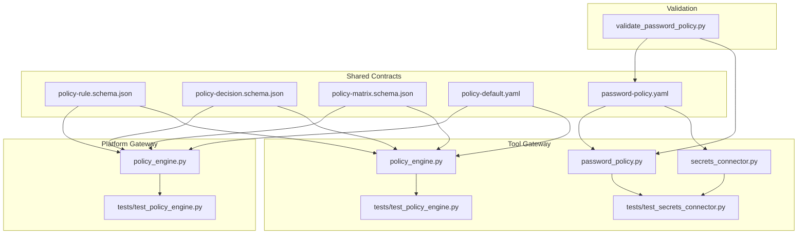
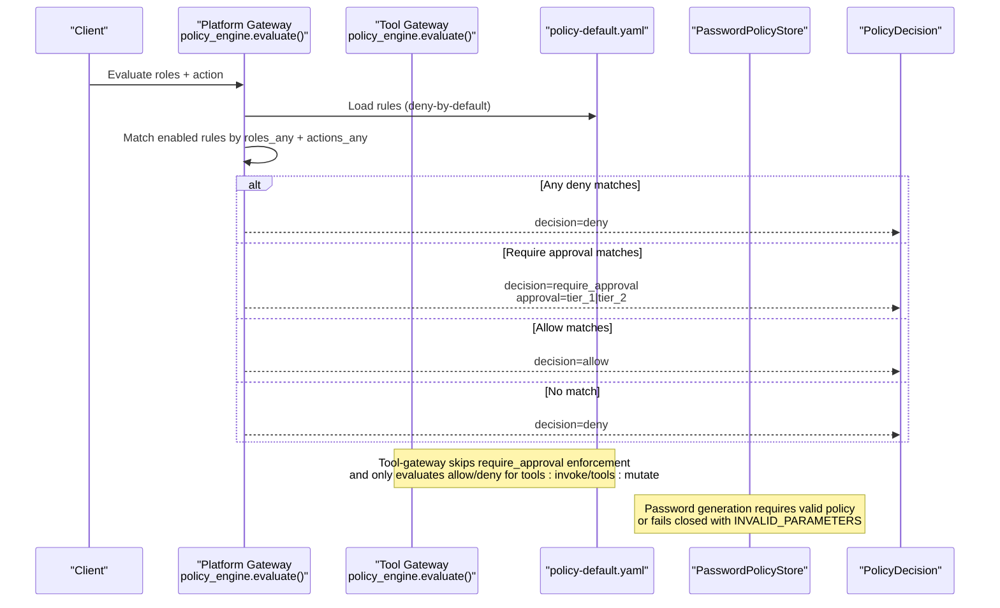
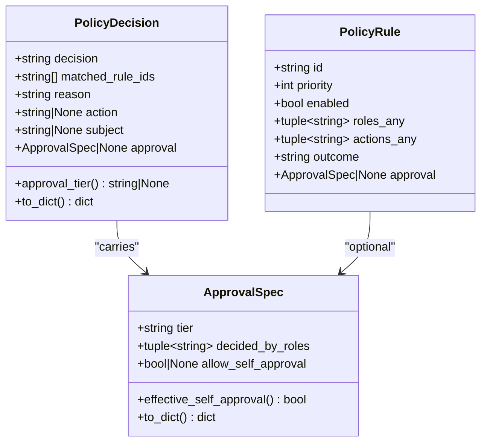
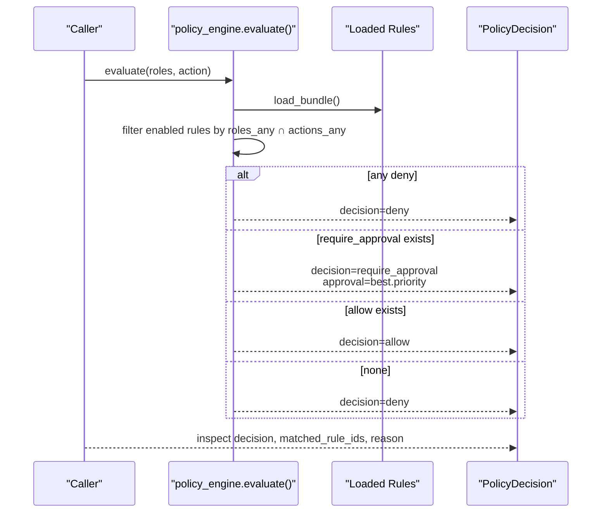
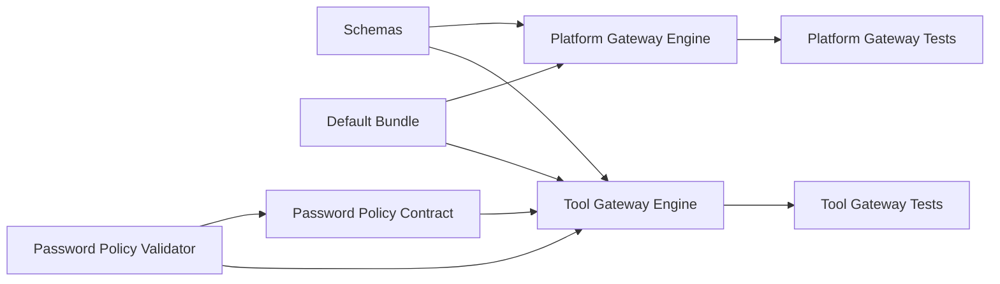

# Policy Rules and Schema

<cite>
**Referenced Files in This Document**
- [policy-rule.schema.json](file://shared/shared-contracts/schemas/policy-rule.schema.json)
- [policy-decision.schema.json](file://shared/shared-contracts/schemas/policy-decision.schema.json)
- [policy-matrix.schema.json](file://shared/shared-contracts/schemas/policy-matrix.schema.json)
- [policy-default.yaml](file://shared/shared-contracts/policies/policy-default.yaml)
- [password-policy.yaml](file://shared/shared-contracts/policies/password-policy.yaml)
- [password_policy.py (tool-gateway)](file://products/tool-gateway/src/tool_gateway/tools/password_policy.py)
- [secrets_connector.py (tool-gateway)](file://products/tool-gateway/src/tool_gateway/tools/secrets_connector.py)
- [validate_password_policy.py](file://shared/shared-contracts/scripts/validate_password_policy.py)
- [policy_engine.py (platform-gateway)](file://products/platform-gateway/src/platform_gateway/services/policy_engine.py)
- [policy_engine.py (tool-gateway)](file://products/tool-gateway/src/tool_gateway/services/policy_engine.py)
- [test_policy_engine.py (platform-gateway)](file://products/platform-gateway/tests/test_policy_engine.py)
- [test_policy_engine.py (tool-gateway)](file://products/tool-gateway/tests/test_policy_engine.py)
- [test_secrets_connector.py (tool-gateway)](file://products/tool-gateway/tests/test_secrets_connector.py)
- [policy_diff.py](file://shared/shared-contracts/scripts/policy_diff.py)
- [policy-specification.md](file://docs/agentic-aiops-platform/policy-specification.md)
- [authorization-matrix.md](file://docs/agentic-aiops-platform/authorization-matrix.md)
</cite>

## Update Summary
**Changes Made**
- Added comprehensive documentation for the new password policy engine with fail-closed enforcement
- Documented minimum length requirements, entropy thresholds, and character class validation
- Added password policy schema and enforcement mechanisms
- Updated security posture section to include password generation policies
- Enhanced troubleshooting guide with password policy validation issues

## Table of Contents
1. Introduction
2. Project Structure
3. Core Components
4. Architecture Overview
5. Detailed Component Analysis
6. Password Policy Engine
7. Dependency Analysis
8. Performance Considerations
9. Troubleshooting Guide
10. Conclusion
11. Appendices

## Introduction
This document explains the policy rule schema and structure used by the Luban AIOPS platform to authorize actions, gate approvals, and control execution. It covers the complete rule object shape, match fields, decision outcomes, approval tiers, and metadata. It also documents the four policy domains defined by the specification and clarifies which are enforced today versus those reserved for future expansion. Concrete YAML examples illustrate read-only access, production restart approvals, destructive action denials, and approver permissions. Guidance on rule ordering, priority conflicts, and best practices is included to help author maintainable policies.

**Updated** The platform now includes a comprehensive password policy engine that enforces fail-closed security policies for generated passwords, including minimum length requirements, entropy thresholds, and character class validation.

## Project Structure
Policy artifacts are split between shared contracts (schemas and default bundle) and gateway implementations that enforce them:
- Shared contracts define the canonical shapes for rules, decisions, and the live matrix.
- The default policy bundle defines concrete authorization behavior for the current surface.
- Platform-gateway enforces action authorization and bridges tiered approvals for mutating tool calls.
- Tool-gateway enforces admission for tool invocation and intentionally skips require_approval enforcement because it has no approval substrate.
- **New**: Password policy contract provides centralized enforcement for generated password strength.

**Diagram sources**
- [policy-rule.schema.json:1-105](file://shared/shared-contracts/schemas/policy-rule.schema.json#L1-L105)
- [policy-decision.schema.json:1-60](file://shared/shared-contracts/schemas/policy-decision.schema.json#L1-L60)
- [policy-matrix.schema.json:1-85](file://shared/shared-contracts/schemas/policy-matrix.schema.json#L1-L85)
- [policy-default.yaml:1-326](file://shared/shared-contracts/policies/policy-default.yaml#L1-L326)
- [password-policy.yaml:1-48](file://shared/shared-contracts/policies/password-policy.yaml#L1-L48)
- [password_policy.py:1-346](file://products/tool-gateway/src/tool_gateway/tools/password_policy.py#L1-L346)
- [secrets_connector.py:1-654](file://products/tool-gateway/src/tool_gateway/tools/secrets_connector.py#L1-L654)
- [validate_password_policy.py:1-261](file://shared/shared-contracts/scripts/validate_password_policy.py#L1-L261)

**Section sources**
- [policy-rule.schema.json:1-105](file://shared/shared-contracts/schemas/policy-rule.schema.json#L1-L105)
- [policy-default.yaml:1-326](file://shared/shared-contracts/policies/policy-default.yaml#L1-L326)
- [password-policy.yaml:1-48](file://shared/shared-contracts/policies/password-policy.yaml#L1-L48)
- [policy_engine.py (platform-gateway):1-444](file://products/platform-gateway/src/platform_gateway/services/policy_engine.py#L1-L444)
- [policy_engine.py (tool-gateway):1-355](file://products/tool-gateway/src/tool_gateway/services/policy_engine.py#L1-L355)

## Core Components
- Rule schema: Defines id, domain, description, priority, enabled, match, and decision with required and conditional fields.
- Decision schema: Defines the engine's output including decision, matched_rule_ids, reason, optional subject/action, and approval details when applicable.
- Matrix schema: Exposes a read-only view of effective role × action permissions and approval requirements derived from the loaded bundle.
- Default bundle: Concrete rules implementing deny-by-default semantics, explicit allow/deny grants, and tiered approval for mutating tool execution.
- **New**: Password policy contract: Centralized enforcement for generated password strength with fail-closed guarantees.

Key behaviors enforced by the engines:
- Deny by default when no rule matches.
- Explicit deny overrides require_approval and allow.
- require_approval overrides allow within matching rules.
- Higher priority wins among rules of the same outcome class.
- Disabled rules are ignored.
- **New**: Password generation fails closed when policy is unavailable or invalid.

**Section sources**
- [policy-rule.schema.json:1-105](file://shared/shared-contracts/schemas/policy-rule.schema.json#L1-L105)
- [policy-decision.schema.json:1-60](file://shared/shared-contracts/schemas/policy-decision.schema.json#L1-L60)
- [policy-matrix.schema.json:1-85](file://shared/shared-contracts/schemas/policy-matrix.schema.json#L1-L85)
- [policy-default.yaml:1-326](file://shared/shared-contracts/policies/policy-default.yaml#L1-L326)
- [password-policy.yaml:1-48](file://shared/shared-contracts/policies/password-policy.yaml#L1-L48)
- [policy_engine.py (platform-gateway):390-444](file://products/platform-gateway/src/platform_gateway/services/policy_engine.py#L390-L444)
- [policy_engine.py (tool-gateway):299-355](file://products/tool-gateway/src/tool_gateway/services/policy_engine.py#L299-L355)

## Architecture Overview
The platform uses a layered policy model across four domains. Today, the implementation enforces action_authz with allow/deny/require_approval outcomes; feature_access, approval, and execution_gate are specified for broader governance and future use.

**Diagram sources**
- [policy_engine.py (platform-gateway):390-444](file://products/platform-gateway/src/platform_gateway/services/policy_engine.py#L390-L444)
- [policy_engine.py (tool-gateway):299-355](file://products/tool-gateway/src/tool_gateway/services/policy_engine.py#L299-L355)
- [password_policy.py:238-346](file://products/tool-gateway/src/tool_gateway/tools/password_policy.py#L238-L346)
- [policy-default.yaml:1-326](file://shared/shared-contracts/policies/policy-default.yaml#L1-L326)

**Section sources**
- [policy-specification.md:121-157](file://docs/agentic-aiops-platform/policy-specification.md#L121-L157)
- [policy_engine.py (platform-gateway):1-127](file://products/platform-gateway/src/platform_gateway/services/policy_engine.py#L1-L127)
- [policy_engine.py (tool-gateway):1-52](file://products/tool-gateway/src/tool_gateway/services/policy_engine.py#L1-L52)

## Detailed Component Analysis

### Rule Object Schema
A policy rule contains:
- id: Unique identifier.
- domain: One of feature_access, action_authz, approval, execution_gate.
- description: Human-readable explanation.
- priority: Numeric precedence.
- enabled: Whether the rule participates.
- match: Criteria that determine applicability.
- decision: Outcome and optional approval block.
- conditions: Additional constraints (reserved for future use).
- metadata: Ownership, audit tags, rollout info (reserved for future use).

Current enforcement scope:
- The shipped engine implements action_authz with allowed outcomes allow, deny, require_approval.
- require_approval requires an approval block with tier and decided_by_roles.
- allow_with_conditions and conditions/metadata are reserved for future revisions.

Match fields:
- roles_any: Principal must hold at least one listed role.
- roles_all: All listed roles must be held (recommended field; not currently enforced in the minimal engine).
- environments_any: Target environment filter (recommended; not enforced in MVP).
- features_any: Feature flag or UI feature filter (recommended; not enforced in MVP).
- actions_any: Requested action must be in this list (required in current engine).
- target_types_any: Resource type filter (recommended; not enforced in MVP).
- risk_tiers_any: Risk tier filter (recommended; not enforced in MVP).
- approval_tiers_any: Approval tier filter (recommended; not enforced in MVP).
- service_criticality_any: Service criticality filter (recommended; not enforced in MVP).

Examples of combining match fields:
- Read-only access: roles_any includes observers/operators; actions_any lists read actions; environments_any spans all environments; risk_tiers_any targets tier_0.
- Production restart approval: roles_any includes operators/approvers; actions_any includes restart-service; environments_any restricts to prod; risk_tiers_any targets tier_2; decision requires tier_2 approval.
- Destructive denial: actions_any includes delete-or-destructive; environments_any spans all; decision denies explicitly.
- Approver permissions: roles_any includes approver; approval_tiers_any targets tier_2; environments_any restricts to prod; decision may allow_with_conditions requiring non-self-approval and environment scope.

**Section sources**
- [policy-rule.schema.json:1-105](file://shared/shared-contracts/schemas/policy-rule.schema.json#L1-L105)
- [policy-specification.md:158-210](file://docs/agentic-aiops-platform/policy-specification.md#L158-L210)
- [policy-default.yaml:53-152](file://shared/shared-contracts/policies/policy-default.yaml#L53-L152)

### Decision Outcomes and Approval Tiers
Outcomes:
- allow: Proceed immediately.
- deny: Do not proceed.
- require_approval: Proceed only after successful tiered confirmation.

Approval tiers:
- tier_1: Session operator self-confirmation allowed by default; suitable for routine destructive-but-low-risk actions.
- tier_2: Requires a designated approver distinct from requester; self-approval forbidden by default.

Decision payload:
- decision, matched_rule_ids, reason are always present.
- action and subject are optional context.
- approval_tier and approval are present when decision is require_approval.

**Section sources**
- [policy-decision.schema.json:1-60](file://shared/shared-contracts/schemas/policy-decision.schema.json#L1-L60)
- [policy_engine.py (platform-gateway):142-194](file://products/platform-gateway/src/platform_gateway/services/policy_engine.py#L142-L194)
- [policy_engine.py (platform-gateway):408-426](file://products/platform-gateway/src/platform_gateway/services/policy_engine.py#L408-L426)

### Four Policy Domains
- feature_access: Controls portal screens, admin screens, approval queue visibility, and audit UI access. Not enforced by the current engine; used for UI gating and future policy surfaces.
- action_authz: Controls whether a user may request an action and whether it is denied outright. Enforced today with allow/deny/require_approval.
- approval: Controls whether approval is required, its tier, who may approve, and self-approval rules. Enforced via require_approval bridging on the platform-gateway confirm path.
- execution_gate: Controls whether execution may proceed after decision, condition satisfaction, and signed/scoped execution requests. Lightweight execution gate is part of the MVP profile; full enforcement is gated by additional workflow steps.

**Section sources**
- [policy-specification.md:121-157](file://docs/agentic-aiops-platform/policy-specification.md#L121-L157)
- [policy_engine.py (platform-gateway):119-127](file://products/platform-gateway/src/platform_gateway/services/policy_engine.py#L119-L127)

### Concrete YAML Examples
Below are conceptual examples aligned with the specification and default bundle patterns. Refer to the cited files for exact structures and current enforcement.

- Read-only access rule:
  - Domain: action_authz
  - Match: roles_any includes observer/operator/developer/approver/auditor/platform-admin; actions_any includes read-status/read-logs/read-metrics; environments_any spans dev/test/staging/prod; risk_tiers_any targets tier_0
  - Decision: allow
  - See example pattern in specification sample rules.

- Production restart approval:
  - Domain: approval
  - Match: roles_any includes operator/approver/platform-admin; actions_any includes restart-service; environments_any targets prod; risk_tiers_any targets tier_2
  - Decision: require_approval with tier_2
  - Conditions: must_have_ticket_reference, must_not_be_self_approval
  - See example pattern in specification sample rules.

- Destructive action denial:
  - Domain: action_authz
  - Match: actions_any includes delete-or-destructive; environments_any spans all
  - Decision: deny
  - See example pattern in specification sample rules.

- Approver permissions:
  - Domain: approval
  - Match: roles_any includes approver; approval_tiers_any targets tier_2; environments_any targets prod
  - Decision: allow_with_conditions
  - Conditions: must_have_environment_scope, must_not_be_self_approval
  - See example pattern in specification sample rules.

For reference to the shipped defaults:
- Mutating tool execution requires tier_2 approval by approver or platform-admin distinct from requester.
- Read-only tool invocation is allowed for operational roles and observers.
- Audit read is restricted to auditor and platform-admin.

**Section sources**
- [policy-specification.md:297-407](file://docs/agentic-aiops-platform/policy-specification.md#L297-L407)
- [policy-default.yaml:90-152](file://shared/shared-contracts/policies/policy-default.yaml#L90-L152)

### Evaluation Flow and Precedence
Evaluation order and precedence:
1. Validate request shape and identity context.
2. Evaluate feature_access policies (UI gating).
3. Evaluate action_authz policies (enforced).
4. Evaluate approval policies (bridged on confirm path).
5. Evaluate execution_gate policies if execution is requested.
6. Return final decision with matched rules and conditions.

Precedence:
- Explicit deny overrides require_approval and allow.
- More specific rules override broader rules.
- Higher priority wins when specificity is equal.
- If no rule matches, return deny.

Within the engine:
- Match enabled rules by roles_any and actions_any.
- If any deny matches, return deny.
- Else if require_approval matches, pick highest priority and return require_approval with approval block.
- Else if allow matches, pick highest priority and return allow.
- Else return deny with "no matching policy rule".

**Section sources**
- [policy-specification.md:256-273](file://docs/agentic-aiops-platform/policy-specification.md#L256-L273)
- [policy_engine.py (platform-gateway):390-444](file://products/platform-gateway/src/platform_gateway/services/policy_engine.py#L390-L444)
- [policy_engine.py (tool-gateway):299-355](file://products/tool-gateway/src/tool_gateway/services/policy_engine.py#L299-L355)

### Class Model of Engine Types

**Diagram sources**
- [policy_engine.py (platform-gateway):142-194](file://products/platform-gateway/src/platform_gateway/services/policy_engine.py#L142-L194)
- [policy_engine.py (tool-gateway):66-133](file://products/tool-gateway/src/tool_gateway/services/policy_engine.py#L66-L133)

### API Workflow: Action Authorization

**Diagram sources**
- [policy_engine.py (platform-gateway):390-444](file://products/platform-gateway/src/platform_gateway/services/policy_engine.py#L390-L444)
- [policy_engine.py (tool-gateway):299-355](file://products/tool-gateway/src/tool_gateway/services/policy_engine.py#L299-L355)

## Password Policy Engine

**New Section** The Luban AIOPS platform includes a comprehensive password policy engine that enforces fail-closed security policies for generated passwords. This system ensures that all generated passwords meet minimum security standards through centralized policy enforcement.

### Password Policy Contract
The password policy contract (`password-policy.yaml`) serves as the single source of truth for generated password strength. It defines:

- **min_length**: The minimum length a generated password must have (default: 16 characters)
- **hard_floor**: Absolute minimum length that cannot be bypassed (default: 12 characters)  
- **required_classes**: Character classes that must be present (upper, lower, digit, symbol)
- **entropy_floor_bits**: Minimum entropy requirement (default: 64 bits)
- **exclude_ambiguous**: Option to exclude visually ambiguous characters (I/l/1/O/0)

### Fail-Closed Enforcement
The password policy engine implements fail-closed security:

- **Unavailable policy**: Generation refuses with `INVALID_PARAMETERS` error
- **Invalid policy**: Generation refuses without falling back to defaults
- **Weak policy**: Environment overrides can only tighten, never weaken the contract
- **Missing contract**: System refuses generation rather than using built-in defaults

### Policy Store Implementation
The `PasswordPolicyStore` provides lazy-loading with automatic refresh:

- **Mtime-based reloading**: Detects policy file changes without restart
- **Fail-closed loading**: Invalid or unreadable policies clear active state
- **No content logging**: Policy contents are never logged for security
- **Packaged fallback**: Uses embedded policy when no custom path is configured

### Password Generation Algorithm
The generation algorithm ensures cryptographic security:

- **CSPRNG source**: Uses Python's `secrets` module for cryptographically secure randomness
- **Class seeding**: Guarantees at least one character from each required class
- **Entropy validation**: Verifies generated passwords meet entropy floor requirements
- **Fisher-Yates shuffle**: Ensures unbiased character distribution

### Configuration and Overrides
Environment variables provide controlled tightening:

- **GATEWAY_PASSWORD_MIN_LENGTH**: Raises minimum length (cannot weaken below contract)
- **GATEWAY_PASSWORD_REQUIRED_CLASSES**: Adds required character classes (must include contract classes)
- **GATEWAY_PASSWORD_EXCLUDE_AMBIGUOUS**: Enables ambiguous character exclusion

### Validation and Testing
Comprehensive validation ensures policy integrity:

- **Contract validation**: Verifies YAML structure and field types
- **Connector pinning**: Ensures hardcoded values match contract specifications
- **Integration testing**: Tests fail-closed behavior and policy enforcement
- **Security mutation checks**: Validates no plaintext leakage in projections

**Section sources**
- [password-policy.yaml:1-48](file://shared/shared-contracts/policies/password-policy.yaml#L1-L48)
- [password_policy.py:1-346](file://products/tool-gateway/src/tool_gateway/tools/password_policy.py#L1-L346)
- [secrets_connector.py:1-654](file://products/tool-gateway/src/tool_gateway/tools/secrets_connector.py#L1-L654)
- [validate_password_policy.py:1-261](file://shared/shared-contracts/scripts/validate_password_policy.py#L1-L261)
- [test_secrets_connector.py:135-213](file://products/tool-gateway/tests/test_secrets_connector.py#L135-L213)

## Dependency Analysis
- Schemas define the contract consumed by both gateways.
- Default bundle provides the authoritative policy set.
- Platform-gateway enforces action_authz and bridges require_approval for tools:mutate.
- Tool-gateway enforces allow/deny for tools:invoke and tools:mutate; require_approval rules are skipped at load because there is no approval substrate.
- **New**: Password policy contract provides centralized enforcement for generated password strength.
- Tests validate deny-by-default, higher-priority wins, and role/action matching.

**Diagram sources**
- [policy-rule.schema.json:1-105](file://shared/shared-contracts/schemas/policy-rule.schema.json#L1-L105)
- [policy-default.yaml:1-326](file://shared/shared-contracts/policies/policy-default.yaml#L1-L326)
- [password-policy.yaml:1-48](file://shared/shared-contracts/policies/password-policy.yaml#L1-L48)
- [password_policy.py:1-346](file://products/tool-gateway/src/tool_gateway/tools/password_policy.py#L1-L346)
- [validate_password_policy.py:1-261](file://shared/shared-contracts/scripts/validate_password_policy.py#L1-L261)
- [policy_engine.py (platform-gateway):1-444](file://products/platform-gateway/src/platform_gateway/services/policy_engine.py#L1-L444)
- [policy_engine.py (tool-gateway):1-355](file://products/tool-gateway/src/tool_gateway/services/policy_engine.py#L1-L355)
- [test_policy_engine.py (platform-gateway):39-66](file://products/platform-gateway/tests/test_policy_engine.py#L39-L66)
- [test_policy_engine.py (tool-gateway):127-152](file://products/tool-gateway/tests/test_policy_engine.py#L127-L152)

**Section sources**
- [policy_engine.py (platform-gateway):1-127](file://products/platform-gateway/src/platform_gateway/services/policy_engine.py#L1-L127)
- [policy_engine.py (tool-gateway):1-52](file://products/tool-gateway/src/tool_gateway/services/policy_engine.py#L1-L52)
- [test_policy_engine.py (platform-gateway):39-66](file://products/platform-gateway/tests/test_policy_engine.py#L39-L66)
- [test_policy_engine.py (tool-gateway):127-152](file://products/tool-gateway/tests/test_policy_engine.py#L127-L152)

## Performance Considerations
- Rule evaluation is O(n) over enabled rules per request; keep bundles concise and well-scoped.
- Use precise actions_any and roles_any to minimize matches.
- Prefer explicit deny rules for high-risk actions to short-circuit further checks.
- Avoid overly broad roles_any unless necessary; combine with actions_any and other recommended match fields when supported.
- Leverage priority to resolve conflicts deterministically without duplicating logic.
- **New**: Password policy store uses lazy loading with mtime-based refresh to avoid unnecessary reloads.
- **New**: Password generation uses efficient CSPRNG operations with bounded alphabet sizes.

## Troubleshooting Guide
Common issues and how to diagnose them:
- Unexpected deny:
  - Verify the action is protected and present in the bundle's vocabulary.
  - Confirm the caller's roles intersect with roles_any in a matching rule.
  - Check for explicit deny rules that override allow or require_approval.
  - See tests asserting deny-by-default for unknown actions or ungranted roles.

- Approval not triggered:
  - Ensure the action is in the bridged set for the gateway (tools:mutate on platform-gateway).
  - Confirm the rule outcome is require_approval and includes a valid approval block.
  - Validate tier and decided_by_roles; ensure self-approval settings align with tier defaults.

- Priority conflicts:
  - When multiple rules match, the highest priority within the same outcome class wins.
  - Use clear priorities and narrow scopes to avoid ambiguity.

- Bundle loading errors:
  - Invalid YAML or malformed rule structure raises load errors.
  - require_approval on non-bridged actions is rejected at load time in platform-gateway.
  - Tool-gateway logs warnings and skips require_approval rules due to lack of enforcement substrate.

- **New**: Password policy issues:
  - **Policy unavailable**: Check that password-policy.yaml is readable and properly formatted
  - **Generation failures**: Verify policy meets minimum requirements (length ≥ 16, entropy ≥ 64 bits)
  - **Override conflicts**: Ensure environment variables don't weaken the base policy
  - **Validation errors**: Run `make validate-password-policy` to check contract consistency

Useful references:
- Default bundle comments explain precedence, tiers, and authoring conventions.
- Tests demonstrate expected behaviors for deny-by-default and priority resolution.
- Policy diff script can compute outcomes across role/action pairs and report bundle SHA-256.
- **New**: Password policy validator ensures contract and connector consistency.

**Section sources**
- [policy_default.yaml:1-39](file://shared/shared-contracts/policies/policy-default.yaml#L1-L39)
- [policy_engine.py (platform-gateway):229-331](file://products/platform-gateway/src/platform_gateway/services/policy_engine.py#L229-L331)
- [policy_engine.py (tool-gateway):152-251](file://products/tool-gateway/src/tool_gateway/services/policy_engine.py#L152-L251)
- [test_policy_engine.py (platform-gateway):55-66](file://products/platform-gateway/tests/test_policy_engine.py#L55-L66)
- [policy_diff.py:68-84](file://shared/shared-contracts/scripts/policy_diff.py#L68-L84)
- [validate_password_policy.py:223-261](file://shared/shared-contracts/scripts/validate_password_policy.py#L223-L261)

## Conclusion
The Luban AIOPS platform enforces a deny-by-default policy model with explicit allow/deny and tiered approval for risky actions. The current implementation focuses on action_authz with allow/deny/require_approval outcomes, while feature_access, approval, and execution_gate remain part of the broader specification for future expansion. By using precise match fields, clear priorities, and structured approval blocks, teams can author maintainable policies that scale safely across environments and roles.

**Updated** The platform now includes a comprehensive password policy engine that enforces fail-closed security policies for generated passwords, ensuring cryptographic strength through minimum length requirements, entropy thresholds, and character class validation. This addition strengthens the platform's security posture by centralizing password generation policies and providing robust validation against policy drift.

## Appendices

### Best Practices for Authoring Policies
- Be explicit: prefer narrow roles_any and actions_any combinations.
- Use priority to express intent clearly; document rationale in description.
- For destructive or production actions, prefer require_approval with tier_2 and exclude self-approval.
- Keep rules focused on one concern; split complex logic into multiple rules.
- Validate bundles before deployment; use policy-diff to review changes.
- Audit and review changes through Git; version bumps signal policy drift.
- **New**: For password policies, ensure generated passwords meet organizational security requirements through appropriate min_length and entropy settings.
- **New**: Test password policy changes thoroughly using the validation suite before deployment.

### Password Policy Security Guidelines
- **Minimum Length**: Set min_length to at least 16 characters for strong security
- **Character Classes**: Require all four classes (upper, lower, digit, symbol) for maximum entropy
- **Entropy Thresholds**: Ensure entropy_floor_bits meets organizational requirements (64+ bits recommended)
- **Ambiguous Characters**: Consider enabling exclude_ambiguous for manual entry scenarios
- **Environment Overrides**: Use environment variables to tighten policies without weakening the base contract
- **Policy Validation**: Regularly run validation checks to ensure policy consistency across deployments

[No sources needed since this section provides general guidance]