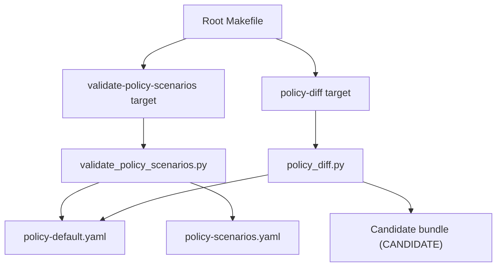
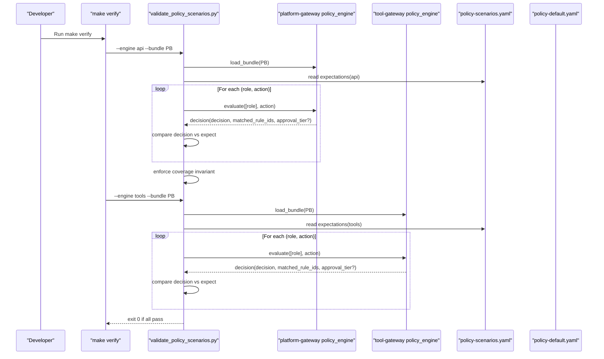
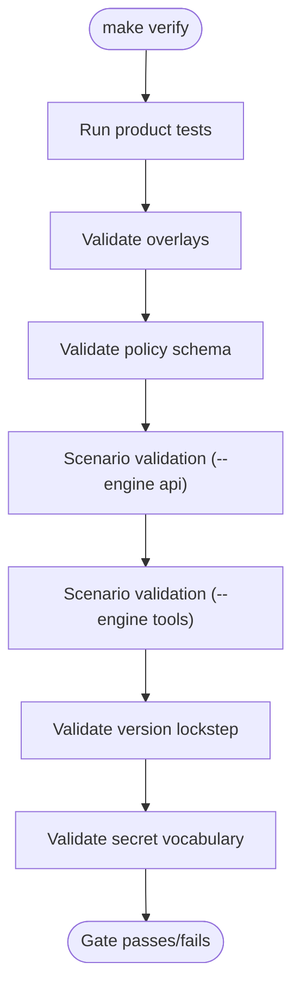
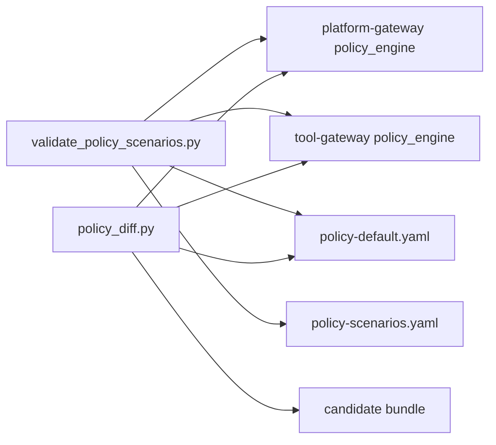

# Policy Testing and Scenarios

<cite>
**Referenced Files in This Document**
- [policy-scenarios.yaml](file://shared/shared-contracts/policies/policy-scenarios.yaml)
- [policy-default.yaml](file://shared/shared-contracts/policies/policy-default.yaml)
- [validate_policy_scenarios.py](file://shared/shared-contracts/scripts/validate_policy_scenarios.py)
- [policy_diff.py](file://shared/shared-contracts/scripts/policy_diff.py)
- [Makefile](file://Makefile)
- [test_policy_scenarios.py (platform-gateway)](file://products/platform-gateway/tests/test_policy_scenarios.py)
- [test_policy_scenarios.py (tool-gateway)](file://products/tool-gateway/tests/test_policy_scenarios.py)
- [test_policy_engine.py (platform-gateway)](file://products/platform-gateway/tests/test_policy_engine.py)
- [test_policy_engine.py (tool-gateway)](file://products/tool-gateway/tests/test_policy_engine.py)
- [policy_engine.py (platform-gateway)](file://products/platform-gateway/src/platform_gateway/services/policy_engine.py)
- [SPEC-048 spec.md](file://docs/specs/SPEC-048-policy-testing-rollout-controls/spec.md)
</cite>

## Table of Contents
1. Introduction
2. Project Structure
3. Core Components
4. Architecture Overview
5. Detailed Component Analysis
6. Dependency Analysis
7. Performance Considerations
8. Troubleshooting Guide
9. Conclusion
10. Appendices

## Introduction
This document explains how the Luban AIOPS platform tests policies and validates scenario outcomes across its two policy engines: the API engine (platform-gateway) and the tools engine (tool-gateway). It covers the scenario file format, the four required test types (unit rule matching, precedence for conflicting rules, regression approval paths, deny-by-default), the automated verification pipeline, writing new scenarios, validating changes with the policy diff tool, and debugging failing tests while maintaining coverage as policies evolve.

## Project Structure
Policy testing is centered around a shared canonical bundle and a curated scenario table that both engines validate against their own semantics. The root Makefile orchestrates validation targets that run under each product’s environment to ensure engine parity and correct evaluation.

**Diagram sources**
- [Makefile:144-159](file://Makefile#L144-L159)
- [validate_policy_scenarios.py:100-127](file://shared/shared-contracts/scripts/validate_policy_scenarios.py#L100-L127)
- [policy_diff.py:117-154](file://shared/shared-contracts/scripts/policy_diff.py#L117-L154)

**Section sources**
- [Makefile:144-159](file://Makefile#L144-L159)
- [policy-scenarios.yaml:1-238](file://shared/shared-contracts/policies/policy-scenarios.yaml#L1-L238)
- [policy-default.yaml:1-326](file://shared/shared-contracts/policies/policy-default.yaml#L1-L326)

## Core Components
- Scenario expectations table: Declares expected outcomes per role-action pair for both engines, including named denials and deny-by-default floor.
- Scenario harness: Loads the canonical bundle into the real engine, evaluates every expectation, enforces completeness (every granted pair must be covered), and fails on mismatches or missing tiers.
- Policy diff tool: Compares canonical vs candidate bundles and reports per-(role, action) outcome transitions without modifying any files.
- Engine enforcement: Deny-by-default, explicit deny wins over require_approval and allow, higher priority within an outcome class, disabled rules ignored.

Key behaviors enforced by the engine:
- Default deny when no rule matches.
- Explicit deny overrides require_approval and allow.
- require_approval overrides allow.
- Higher priority wins within an outcome class.
- Disabled rules are ignored.

**Section sources**
- [policy-default.yaml:14-24](file://shared/shared-contracts/policies/policy-default.yaml#L14-L24)
- [policy_engine.py:408-443](file://products/platform-gateway/src/platform_gateway/services/policy_engine.py#L408-L443)
- [validate_policy_scenarios.py:50-97](file://shared/shared-contracts/scripts/validate_policy_scenarios.py#L50-L97)
- [policy_diff.py:68-84](file://shared/shared-contracts/scripts/policy_diff.py#L68-L84)

## Architecture Overview
The testing architecture reuses the actual policy engines as the contract, avoiding duplicated logic. The scenario harness and diff tool import the engine modules from each product context, ensuring identical behavior to runtime.

**Diagram sources**
- [Makefile:148-151](file://Makefile#L148-L151)
- [validate_policy_scenarios.py:100-160](file://shared/shared-contracts/scripts/validate_policy_scenarios.py#L100-L160)
- [policy-scenarios.yaml:21-238](file://shared/shared-contracts/policies/policy-scenarios.yaml#L21-L238)

## Detailed Component Analysis

### Scenario File Format and Expected Outcomes
- Sections: Two top-level sections mirror engine vocabularies:
  - api: Platform-gateway 21-action vocabulary; require_approval rules evaluate to require_approval.
  - tools: Tool-gateway invocation vocabulary; require_approval rules are skipped at load, so outcomes are allow/deny.
- Entry fields:
  - role or roles (list)
  - action or actions (list — cross product)
  - expect: one of allow, deny, require_approval
  - approval_tier: optional, only valid on require_approval expectations
- Coverage invariant: Every granted (role, action) pair produced by enabled rules must appear in at least one expectation; otherwise the harness fails.

Example categories present in the scenarios:
- Read operations allowed for operational and observer roles.
- Approval workflows requiring tier_2 for mutating tool execution.
- Named denials for auditor, observer, developer, operator where appropriate.
- Deny-by-default floor for ungranted roles/actions.

**Section sources**
- [policy-scenarios.yaml:1-238](file://shared/shared-contracts/policies/policy-scenarios.yaml#L1-L238)
- [validate_policy_scenarios.py:50-75](file://shared/shared-contracts/scripts/validate_policy_scenarios.py#L50-L75)

### Automated Testing Pipeline
- make verify runs:
  - Product tests
  - Overlay checks
  - Schema validation
  - Scenario validation for both engines
  - Version lockstep and secret vocabulary checks
- Scenario validation:
  - Runs once under products/platform-gateway with --engine api
  - Runs once under products/tool-gateway with --engine tools
- Policy diff:
  - Requires CANDIDATE=<path>
  - Reports per-(role, action) transitions between canonical and candidate for both engines

**Diagram sources**
- [Makefile:178-179](file://Makefile#L178-L179)
- [Makefile:148-151](file://Makefile#L148-L151)

**Section sources**
- [Makefile:144-159](file://Makefile#L144-L159)
- [Makefile:178-179](file://Makefile#L178-L179)

### Four Required Test Types
- Unit tests for rule matching:
  - Verify that specific rules match expected roles/actions and produce the intended outcome.
  - Covered by engine unit tests that assert allow/deny decisions for concrete inputs.
- Precedence tests for conflicting rules:
  - Assert explicit deny wins over require_approval and allow.
  - Assert higher priority wins within an outcome class.
  - Assert disabled rules are ignored.
- Regression tests for known approval paths:
  - Ensure require_approval outcomes include correct approval tier and decider roles.
  - Validate serialization and schema compliance of decisions.
- Deny-by-default tests:
  - Confirm that ungranted roles or empty roles result in deny.

Evidence in tests:
- Platform-gateway tests assert deny-by-default, precedence, disabled rules, and require_approval semantics.
- Tool-gateway tests assert deny-by-default and precedence behavior consistent with its engine semantics.

**Section sources**
- [test_policy_engine.py (platform-gateway):68-167](file://products/platform-gateway/tests/test_policy_engine.py#L68-L167)
- [test_policy_engine.py (platform-gateway):352-479](file://products/platform-gateway/tests/test_policy_engine.py#L352-L479)
- [test_policy_engine.py (tool-gateway):71-98](file://products/tool-gateway/tests/test_policy_engine.py#L71-L98)

### Writing New Policy Scenarios
Steps:
1. Identify the role(s) and action(s) affected by your policy change.
2. Add entries under the appropriate section (api or tools) in the scenario file.
3. Use cross-product lists for roles and actions to cover combinations.
4. Set expect to allow, deny, or require_approval; include approval_tier only for require_approval.
5. Ensure every newly granted (role, action) pair has at least one scenario entry; the harness enforces this.
6. Run make verify to confirm scenarios pass under both engines.

Guidance:
- Honor engine non-parity: the tools engine skips require_approval rules at load, so outcomes differ from the API engine for those cases.
- Keep scenarios concise but complete on grants; named denials should explicitly call out intentional restrictions.

**Section sources**
- [policy-scenarios.yaml:17-19](file://shared/shared-contracts/policies/policy-scenarios.yaml#L17-L19)
- [validate_policy_scenarios.py:50-75](file://shared/shared-contracts/scripts/validate_policy_scenarios.py#L50-L75)
- [validate_policy_scenarios.py:131-149](file://shared/shared-contracts/scripts/validate_policy_scenarios.py#L131-L149)

### Validating Policy Changes with the Policy Diff Tool
Use the diff tool to review impact before merging:
- Run make policy-diff with CANDIDATE set to your modified bundle path.
- The tool loads both canonical and candidate bundles via the real engines and compares outcomes across all (role, action) pairs.
- Output includes:
  - Canonical and candidate SHA-256 fingerprints
  - Number of pairs evaluated
  - List of transitions (e.g., allow→deny, allow→require_approval, tier changes)
  - Count of unchanged pairs

Best practices:
- Review every transition line carefully; even small changes can alter approvals or denials.
- If there are no transitions, the output confirms no outcome changes.
- Missing or invalid candidate bundles cause a hard error, mirroring startup posture.

**Section sources**
- [Makefile:153-159](file://Makefile#L153-L159)
- [policy_diff.py:117-183](file://shared/shared-contracts/scripts/policy_diff.py#L117-L183)

### Ensuring Backward Compatibility
- Maintain deny-by-default posture: avoid unintentional grants to roles not previously authorized.
- Preserve named denials: do not remove explicit denial entries unless intentionally changing access.
- Keep approval tiers stable for sensitive actions unless explicitly reviewed; tier changes are visible in diff output.
- Update scenarios alongside policy changes to keep the coverage invariant intact.

**Section sources**
- [policy-default.yaml:14-24](file://shared/shared-contracts/policies/policy-default.yaml#L14-L24)
- [policy-scenarios.yaml:132-197](file://shared/shared-contracts/policies/policy-scenarios.yaml#L132-L197)
- [policy_diff.py:137-147](file://shared/shared-contracts/scripts/policy_diff.py#L137-L147)

### Examples of Common Test Scenarios
- Read operations:
  - Operational and observer roles allowed to chat and list/read sessions/models.
  - Tools:list allowed for broad roles.
- Approval workflows:
  - Mutating tool execution requires tier_2 approval for specified roles.
  - Chat confirmation allowed for operational and developer roles.
- Denial cases:
  - Auditor holds audit:read and nothing else; denied on most surfaces.
  - Observer denied mutating, authoring, governance surfaces.
  - Developer excluded from audit, approvals, documents, skill drafting.
  - Operator denied governance surfaces.
  - Ungranted roles/actions denied by default.

These examples are defined in the scenario table and validated by the harness.

**Section sources**
- [policy-scenarios.yaml:21-197](file://shared/shared-contracts/policies/policy-scenarios.yaml#L21-L197)
- [policy-scenarios.yaml:199-238](file://shared/shared-contracts/policies/policy-scenarios.yaml#L199-L238)

## Dependency Analysis
The scenario harness and diff tool depend on the real policy engines to guarantee semantic parity. Each product’s uv environment provides the correct engine module for evaluation.

**Diagram sources**
- [validate_policy_scenarios.py:37-47](file://shared/shared-contracts/scripts/validate_policy_scenarios.py#L37-L47)
- [policy_diff.py:48-58](file://shared/shared-contracts/scripts/policy_diff.py#L48-L58)
- [policy_diff.py:68-84](file://shared/shared-contracts/scripts/policy_diff.py#L68-L84)

**Section sources**
- [validate_policy_scenarios.py:37-47](file://shared/shared-contracts/scripts/validate_policy_scenarios.py#L37-L47)
- [policy_diff.py:48-58](file://shared/shared-contracts/scripts/policy_diff.py#L48-L58)

## Performance Considerations
- Scenario validation evaluates each (role, action) pair once per engine; complexity scales with the number of scenarios and the size of PROTECTED_ACTIONS.
- Policy diff computes outcomes for the union of roles and actions declared by both bundles plus PROTECTED_ACTIONS; large role/action spaces increase runtime.
- Both tools reuse the engine’s loaded bundle state; resetting state between evaluations ensures correctness.

[No sources needed since this section provides general guidance]

## Troubleshooting Guide
Common failures and remedies:
- Scenario mismatch:
  - Symptom: Harness reports expected vs got decision with matched rule IDs.
  - Action: Check which rule matched and adjust either the policy or the scenario expectation accordingly.
- Missing approval tier:
  - Symptom: require_approval expectation with approval_tier mismatch.
  - Action: Align the policy’s approval tier with the scenario or update the scenario to reflect the new tier.
- Coverage gap:
  - Symptom: “granted by the bundle but has no scenario”.
  - Action: Add a scenario entry covering the newly granted (role, action) pair.
- Bundle load errors:
  - Symptom: PolicyLoadError during load.
  - Action: Fix malformed YAML or invalid rule structure; consult schema validation results.
- Diff tool errors:
  - Symptom: Hard error on missing/unparseable candidate.
  - Action: Provide a valid candidate path and ensure it parses correctly.

Self-tests:
- Each product’s scenario self-tests verify that the harness passes on the canonical bundle and fails on a deliberately flipped grant, ensuring the guard remains effective.

**Section sources**
- [validate_policy_scenarios.py:129-160](file://shared/shared-contracts/scripts/validate_policy_scenarios.py#L129-L160)
- [test_policy_scenarios.py (platform-gateway):31-59](file://products/platform-gateway/tests/test_policy_scenarios.py#L31-L59)
- [test_policy_scenarios.py (tool-gateway):32-55](file://products/tool-gateway/tests/test_policy_scenarios.py#L32-L55)

## Conclusion
The Luban AIOPS platform enforces policy safety through a combination of a curated scenario table, engine-backed validation, and a review-time diff tool. By following the documented workflow—edit policy, sync copies, run make verify, review policy-diff output, commit, deploy, and confirm provenance—you can confidently evolve policies while preserving deny-by-default guarantees, approval workflows, and backward compatibility.

[No sources needed since this section summarizes without analyzing specific files]

## Appendices

### Appendix A: Running Commands Locally
- Validate scenarios for both engines:
  - make validate-policy-scenarios
- Generate a diff report for a candidate bundle:
  - make policy-diff CANDIDATE=<path-to-candidate-bundle>
- Full verification gate:
  - make verify

**Section sources**
- [Makefile:148-159](file://Makefile#L148-L159)
- [Makefile:178-179](file://Makefile#L178-L179)

### Appendix B: Specification References
- SPEC-048 defines the rollout controls, scenario harness, diff tool, and provenance exposure.

**Section sources**
- [SPEC-048 spec.md:19-111](file://docs/specs/SPEC-048-policy-testing-rollout-controls/spec.md#L19-L111)