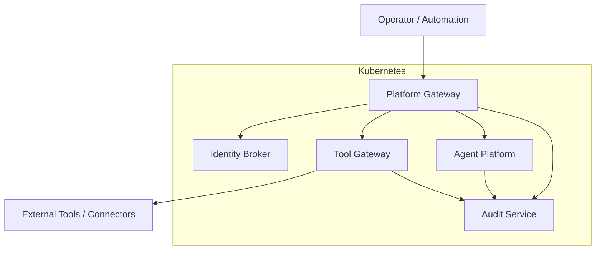
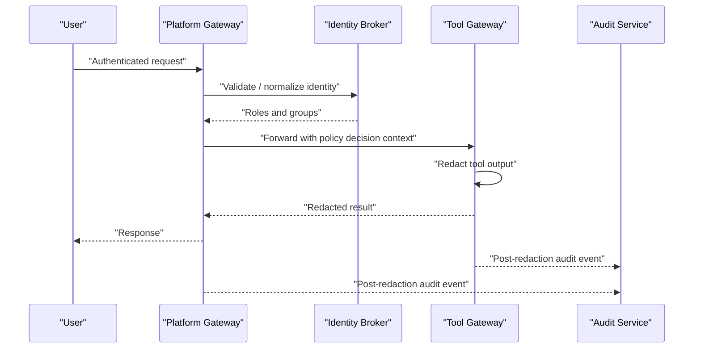
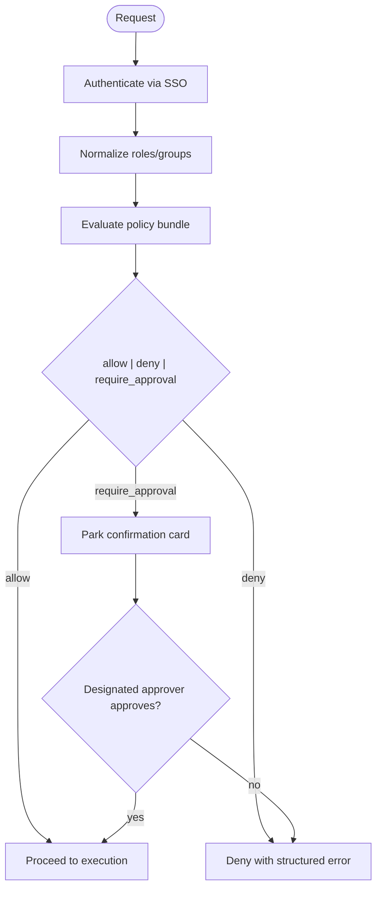
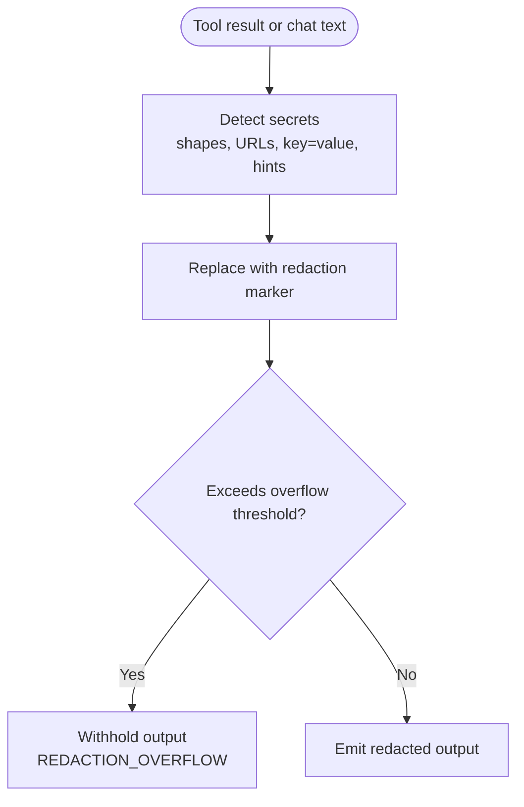
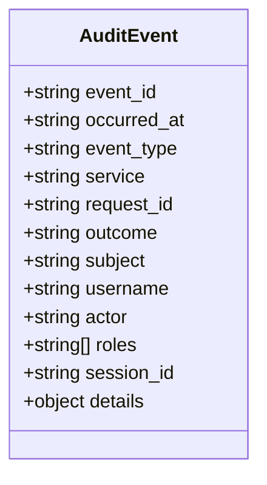
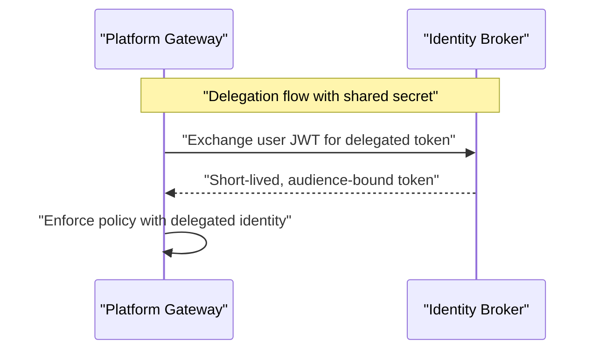
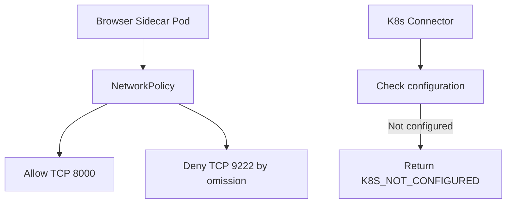
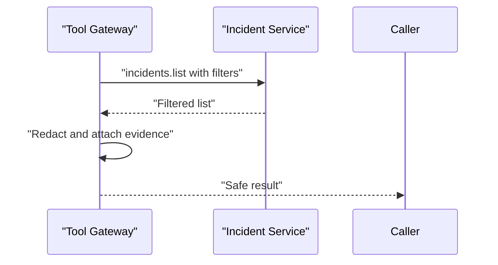
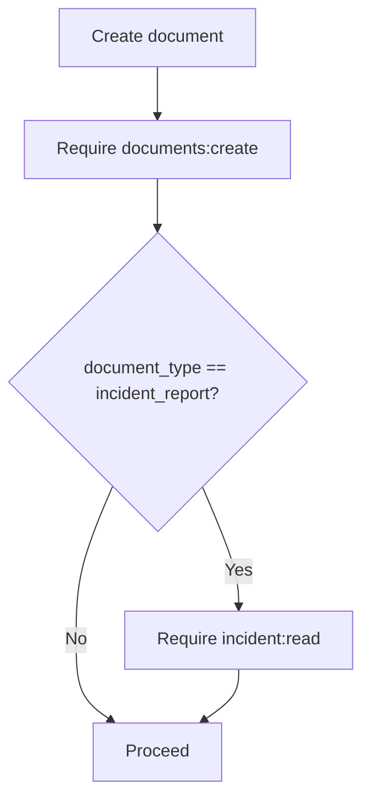
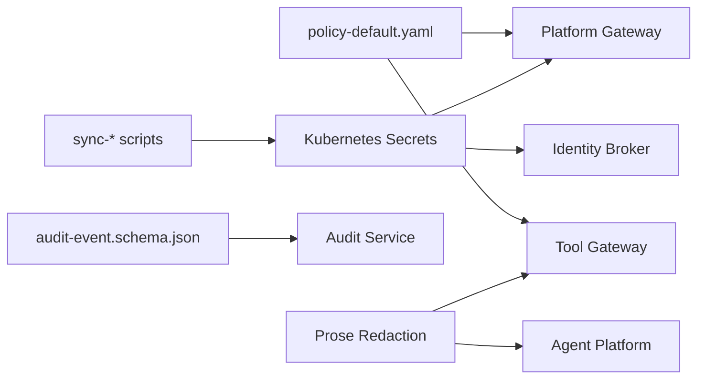

# Security Best Practices

<cite>
**Referenced Files in This Document**
- [SECURITY.md](file://SECURITY.md)
- [policy-default.yaml](file://shared/shared-contracts/policies/policy-default.yaml)
- [authorization-matrix.md](file://docs/agentic-aiops-platform/authorization-matrix.md)
- [tool-configuration.md](file://docs/guides/tool-configuration.md)
- [audit-event.schema.json](file://shared/shared-contracts/schemas/audit-event.schema.json)
- [prose_redaction.py](file://products/agent-platform/src/agent_service/services/prose_redaction.py)
- [test_redaction.py](file://products/tool-gateway/tests/test_redaction.py)
- [gateway_service.py](file://products/tool-gateway/src/tool_gateway/services/gateway_service.py)
- [request_context.py](file://products/tool-gateway/src/tool_gateway/core/request_context.py)
- [k8s_connector.py](file://products/tool-gateway/src/tool_gateway/tools/k8s_connector.py)
- [browser-sidecar-network-policy.yaml](file://shared/platform-ops/gitops/runtime-profiles/browser-dev/browser-sidecar-network-policy.yaml)
- [sync-delegation-secrets.sh](file://shared/platform-ops/gitops/sync-delegation-secrets.sh)
- [sync-incident-secrets.sh](file://shared/platform-ops/gitops/sync-incident-secrets.sh)
- [dev-k8s README.md](file://shared/platform-ops/gitops/dev-k8s/README.md)
- [documents.py](file://products/platform-gateway/src/platform_gateway/api/routes/documents.py)
- [policy_matrix.py](file://products/platform-gateway/src/platform_gateway/services/policy_matrix.py)
- [architecture-overview.md](file://docs/guides/architecture-overview.md)
</cite>

## Table of Contents
1. Introduction
2. Project Structure
3. Core Components
4. Architecture Overview
5. Detailed Component Analysis
6. Dependency Analysis
7. Performance Considerations
8. Troubleshooting Guide
9. Conclusion
10. Appendices

## Introduction
This document provides production security best practices for operating the Luban AIOPS platform. It covers Kubernetes deployment hardening, network policies, secret management, data redaction across logs and transcripts, audit trail integrity, retention and compliance considerations, operational security (monitoring, incident response, vulnerability management), securing external integrations, firewalls, zero-trust principles, common pitfalls, hardening checklists, and security assessment procedures. The guidance is grounded in the repository’s policy engine, redaction modules, audit schema, and GitOps overlays.

## Project Structure
Luban is a multi-product platform with clear boundaries:
- Platform gateway enforces identity, authorization, and policy decisions at the edge.
- Tool gateway executes tools with strict output redaction and policy checks.
- Agent platform orchestrates sessions, chat, HITL approvals, and prose redaction.
- Audit service stores durable, post-redaction audit events.
- Identity broker mediates tokens and delegation.
- Incident service supports triage and reporting surfaces.
- Operator portal exposes governance UIs backed by policy matrix endpoints.
- Shared contracts define schemas and default policy bundles.
- GitOps overlays manage secrets and runtime profiles for Kubernetes deployments.

**Diagram sources**
- [architecture-overview.md:301-327](file://docs/guides/architecture-overview.md#L301-L327)
- [policy-default.yaml:1-52](file://shared/shared-contracts/policies/policy-default.yaml#L1-L52)

**Section sources**
- [architecture-overview.md:301-327](file://docs/guides/architecture-overview.md#L301-L327)
- [policy-default.yaml:1-52](file://shared/shared-contracts/policies/policy-default.yaml#L1-L52)

## Core Components
- Policy enforcement and authorization matrix:
  - Default policy bundle defines deny-by-default semantics, approval tiers, and role-based grants.
  - Authorization matrix documents roles, environments, action tiers, and separation-of-duties rules.
- Redaction and data minimization:
  - Tool outputs are redacted before return or logging; overflow triggers fail-closed behavior.
  - Chat prose is masked for both user and assistant text to prevent credential leakage in transcripts and streams.
- Audit trail:
  - Canonical audit event schema defines required fields and closed vocabulary of event types.
  - Emitters forward post-redaction events to the audit service.
- Secret management:
  - GitOps scripts provision Kubernetes Secrets for runtime configuration and inter-service delegation.
  - Dev overlay documentation describes required secrets for OIDC and token delegation.
- Network isolation:
  - NetworkPolicy restricts sidecar ingress to HTTP only, denying sensitive CDP ports from other pods.

**Section sources**
- [policy-default.yaml:13-52](file://shared/shared-contracts/policies/policy-default.yaml#L13-L52)
- [authorization-matrix.md:16-60](file://docs/agentic-aiops-platform/authorization-matrix.md#L16-L60)
- [tool-configuration.md:305-331](file://docs/guides/tool-configuration.md#L305-L331)
- [audit-event.schema.json:1-94](file://shared/shared-contracts/schemas/audit-event.schema.json#L1-L94)
- [sync-delegation-secrets.sh:1-41](file://shared/platform-ops/gitops/sync-delegation-secrets.sh#L1-L41)
- [dev-k8s README.md:253-270](file://shared/platform-ops/gitops/dev-k8s/README.md#L253-L270)
- [browser-sidecar-network-policy.yaml:1-30](file://shared/platform-ops/gitops/runtime-profiles/browser-dev/browser-sidecar-network-policy.yaml#L1-L30)

## Architecture Overview
The platform applies defense-in-depth:
- Authentication via SSO and identity broker.
- Authorization enforced at gateways using a versioned policy bundle.
- Execution gated by risk tier and approval workflows.
- Data redaction applied at tool outputs and chat prose projections.
- Durable audit trails capture post-redaction events with correlation IDs.
- Network policies limit lateral movement and expose only necessary ports.

**Diagram sources**
- [gateway_service.py:105-130](file://products/tool-gateway/src/tool_gateway/services/gateway_service.py#L105-L130)
- [tool-configuration.md:305-331](file://docs/guides/tool-configuration.md#L305-L331)
- [audit-event.schema.json:1-94](file://shared/shared-contracts/schemas/audit-event.schema.json#L1-L94)

## Detailed Component Analysis

### Policy Enforcement and Authorization Matrix
- Deny-by-default with explicit allow and require_approval outcomes.
- Approval tiers separate self-approval (tier_1) from designated approver (tier_2).
- Roles include operator, approver, developer, auditor, read-only-observer, platform-admin.
- Environment scoping and action tiers guide least privilege.
- Live matrix endpoint exposes effective permissions per caller scope.

**Diagram sources**
- [policy-default.yaml:13-52](file://shared/shared-contracts/policies/policy-default.yaml#L13-L52)
- [authorization-matrix.md:16-60](file://docs/agentic-aiops-platform/authorization-matrix.md#L16-L60)
- [policy_matrix.py:1-35](file://products/platform-gateway/src/platform_gateway/services/policy_matrix.py#L1-L35)

**Section sources**
- [policy-default.yaml:13-52](file://shared/shared-contracts/policies/policy-default.yaml#L13-L52)
- [authorization-matrix.md:16-60](file://docs/agentic-aiops-platform/authorization-matrix.md#L16-L60)
- [policy_matrix.py:1-35](file://products/platform-gateway/src/platform_gateway/services/policy_matrix.py#L1-L35)

### Output Redaction and Prose Masking
- Tool outputs pass through a redaction engine that replaces credential-shaped content with a marker and fails closed when too much of the payload is secret-like.
- Chat prose masking protects both user-authored messages and assistant responses:
  - User text uses four layers: pinned shapes, URL query redaction, key=value pairs, and heuristic token masking when a secret name hint is present.
  - Assistant text uses pinned shapes, URL query redaction, and exact matches against harvested literals from user text.
  - Streaming redactor holds back partial tokens to avoid splitting credentials across deltas.

**Diagram sources**
- [tool-configuration.md:305-331](file://docs/guides/tool-configuration.md#L305-L331)
- [prose_redaction.py:249-456](file://products/agent-platform/src/agent_service/services/prose_redaction.py#L249-L456)
- [test_redaction.py:74-130](file://products/tool-gateway/tests/test_redaction.py#L74-L130)

**Section sources**
- [tool-configuration.md:305-331](file://docs/guides/tool-configuration.md#L305-L331)
- [prose_redaction.py:249-456](file://products/agent-platform/src/agent_service/services/prose_redaction.py#L249-L456)
- [test_redaction.py:74-130](file://products/tool-gateway/tests/test_redaction.py#L74-L130)

### Audit Trail Integrity and Retention
- Canonical audit envelope requires event_id, occurred_at, event_type, service, request_id, outcome, plus optional subject/username/actor/roles/session_id/details.
- Event types cover tool invocations, policy decisions, token exchanges, session lifecycle, confirmations, incidents, skills, executions, and documents.
- Emitters forward post-redaction events; audit service stores envelopes verbatim.
- Correlation keys resolve from inbound headers, OpenTelemetry trace ID, or generated UUID.

**Diagram sources**
- [audit-event.schema.json:1-94](file://shared/shared-contracts/schemas/audit-event.schema.json#L1-L94)
- [request_context.py:8-19](file://products/tool-gateway/src/tool_gateway/core/request_context.py#L8-L19)

**Section sources**
- [audit-event.schema.json:1-94](file://shared/shared-contracts/schemas/audit-event.schema.json#L1-L94)
- [request_context.py:8-19](file://products/tool-gateway/src/tool_gateway/core/request_context.py#L8-L19)

### Secret Management and Zero-Trust Inter-Service Communication
- Delegation secrets provision shared client secrets between platform-gateway and identity-broker for short-lived, audience-bound tokens.
- Runtime secrets include OIDC client secrets and service-client registries.
- Scripts generate or reuse secrets, write env files, sync Kubernetes Secrets, and restart affected deployments.
- Zero-trust posture: authenticate every call, validate tokens, enforce least privilege via policy, and minimize trust boundaries with NetworkPolicy.

**Diagram sources**
- [sync-delegation-secrets.sh:1-41](file://shared/platform-ops/gitops/sync-delegation-secrets.sh#L1-L41)
- [dev-k8s README.md:253-270](file://shared/platform-ops/gitops/dev-k8s/README.md#L253-L270)

**Section sources**
- [sync-delegation-secrets.sh:1-41](file://shared/platform-ops/gitops/sync-delegation-secrets.sh#L1-L41)
- [dev-k8s README.md:253-270](file://shared/platform-ops/gitops/dev-k8s/README.md#L253-L270)

### Kubernetes Hardening and Network Policies
- Browser sidecar NetworkPolicy allows only HTTP ingress on port 8000; CDP port is denied by omission to prevent cross-pod access even if bind address relaxes.
- Kubernetes connectors fail closed when not configured, returning specific errors rather than leaking information.
- Use minimal privileges for service accounts and mount only required ConfigMaps/Secrets.

**Diagram sources**
- [browser-sidecar-network-policy.yaml:1-30](file://shared/platform-ops/gitops/runtime-profiles/browser-dev/browser-sidecar-network-policy.yaml#L1-L30)
- [k8s_connector.py:54-81](file://products/tool-gateway/src/tool_gateway/tools/k8s_connector.py#L54-L81)
- [test_k8s_connector.py:37-64](file://products/tool-gateway/tests/test_k8s_connector.py#L37-L64)

**Section sources**
- [browser-sidecar-network-policy.yaml:1-30](file://shared/platform-ops/gitops/runtime-profiles/browser-dev/browser-sidecar-network-policy.yaml#L1-L30)
- [k8s_connector.py:54-81](file://products/tool-gateway/src/tool_gateway/tools/k8s_connector.py#L54-L81)
- [test_k8s_connector.py:37-64](file://products/tool-gateway/tests/test_k8s_connector.py#L37-L64)

### Securing External Integrations and Firewalls
- External tool calls are mediated by tool-gateway with policy evaluation and redaction.
- Incidents connector lists and retrieves incidents with bounded parameters and transport error handling.
- Platform gateway proxies to incident service with timeouts and structured error mapping.
- Firewalls should restrict egress to known endpoints and allow only necessary ports; use mTLS where possible.

**Diagram sources**
- [incidents_connector.py:158-277](file://products/tool-gateway/src/tool_gateway/tools/incidents_connector.py#L158-L277)
- [incident_client.py:65-107](file://products/platform-gateway/src/platform_gateway/services/incident_client.py#L65-L107)

**Section sources**
- [incidents_connector.py:158-277](file://products/tool-gateway/src/tool_gateway/tools/incidents_connector.py#L158-L277)
- [incident_client.py:65-107](file://products/platform-gateway/src/platform_gateway/services/incident_client.py#L65-L107)

### Dual-Action Gates and Cross-Domain Access Control
- Creating an incident_report document requires both documents:create and incident:read; denials report the first failing action.
- Foreign-session coverage is derived from approvals:list and enforced server-side to prevent unauthorized cross-session reads.

**Diagram sources**
- [documents.py:39-62](file://products/platform-gateway/src/platform_gateway/api/routes/documents.py#L39-L62)

**Section sources**
- [documents.py:39-62](file://products/platform-gateway/src/platform_gateway/api/routes/documents.py#L39-L62)

## Dependency Analysis
- Policy bundle drives all authorization decisions across gateways.
- Redaction modules depend on shared secret shape patterns validated by build-time checks.
- Audit emitters depend on canonical schema and correlation ID resolution.
- GitOps scripts coordinate secrets and runtime profiles across services.

**Diagram sources**
- [policy-default.yaml:1-52](file://shared/shared-contracts/policies/policy-default.yaml#L1-L52)
- [prose_redaction.py:102-125](file://products/agent-platform/src/agent_service/services/prose_redaction.py#L102-L125)
- [audit-event.schema.json:1-94](file://shared/shared-contracts/schemas/audit-event.schema.json#L1-L94)
- [sync-delegation-secrets.sh:1-41](file://shared/platform-ops/gitops/sync-delegation-secrets.sh#L1-L41)

**Section sources**
- [policy-default.yaml:1-52](file://shared/shared-contracts/policies/policy-default.yaml#L1-L52)
- [prose_redaction.py:102-125](file://products/agent-platform/src/agent_service/services/prose_redaction.py#L102-L125)
- [audit-event.schema.json:1-94](file://shared/shared-contracts/schemas/audit-event.schema.json#L1-L94)
- [sync-delegation-secrets.sh:1-41](file://shared/platform-ops/gitops/sync-delegation-secrets.sh#L1-L41)

## Performance Considerations
- Redaction overhead is bounded; streaming redactor holds limited tails to avoid splitting credentials.
- Policy bundle loading caches rules and computes SHA-256 fingerprints for readiness checks.
- Audit events are forwarded fire-and-forget to avoid blocking hot paths.
- NetworkPolicy reduces unnecessary traffic and limits blast radius.

[No sources needed since this section provides general guidance]

## Troubleshooting Guide
- Redaction overflow:
  - Symptom: Tool returns REDACTION_OVERFLOW error.
  - Cause: Too much of the payload is secret-like after redaction.
  - Action: Review tool output; adjust tool behavior to avoid returning secrets; verify GATEWAY_REDACTION_ENABLED and thresholds.
- K8s connector not configured:
  - Symptom: Errors like K8S_NOT_CONFIGURED.
  - Cause: Missing in-cluster or kubeconfig configuration.
  - Action: Provide proper Kubernetes configuration; ensure RBAC permissions for read operations.
- Policy load failures:
  - Symptom: PolicyLoadError indicating missing or invalid bundle path.
  - Cause: Misconfigured GATEWAY_POLICY_PATH or invalid YAML.
  - Action: Validate bundle path and contents; ensure version bump on changes.
- Audit ingestion issues:
  - Symptom: Missing audit events.
  - Cause: No audit-service URL configured; emitter falls back to log-only.
  - Action: Configure audit-service URL; verify network connectivity and authentication.

**Section sources**
- [tool-configuration.md:305-331](file://docs/guides/tool-configuration.md#L305-L331)
- [test_redaction.py:133-175](file://products/tool-gateway/tests/test_redaction.py#L133-L175)
- [k8s_connector.py:54-81](file://products/tool-gateway/src/tool_gateway/tools/k8s_connector.py#L54-L81)
- [gateway_service.py:254-296](file://products/tool-gateway/src/tool_gateway/services/gateway_service.py#L254-L296)

## Conclusion
Securing Luban in production requires layered controls: strong identity and authorization via policy-driven gateways, comprehensive redaction of outputs and chat transcripts, durable and verifiable audit trails, careful secret management through GitOps, and strict network isolation. Operational processes should monitor security events, respond to incidents promptly, and continuously assess vulnerabilities. Adhering to these practices ensures safe, auditable, and compliant operation of the platform.

[No sources needed since this section summarizes without analyzing specific files]

## Appendices

### Production Deployment Checklist
- Enforce SSO and validate tokens at gateways.
- Deploy versioned policy bundle; verify SHA-256 fingerprint on readiness surfaces.
- Enable output redaction; do not disable in non-dev environments.
- Provision Kubernetes Secrets for OIDC and delegation; rotate regularly.
- Apply NetworkPolicy to restrict sidecar and service ports.
- Configure audit-service URL; verify event ingestion.
- Restrict egress to known endpoints; use mTLS where available.
- Limit service account permissions to least privilege.
- Monitor policy matrix and audit trails for anomalies.
- Conduct periodic security assessments and penetration tests.

[No sources needed since this section provides general guidance]

### Compliance Considerations
- Maintain deny-by-default posture with explicit, reviewed grants.
- Separate duties: approvers distinct from requesters for high-risk actions.
- Preserve audit integrity: post-redaction events, immutable storage, and retention policies aligned with regulatory requirements.
- Ensure transparency: live policy matrix and permission views for operators.
- Document and test incident response procedures tied to audit evidence.

[No sources needed since this section provides general guidance]