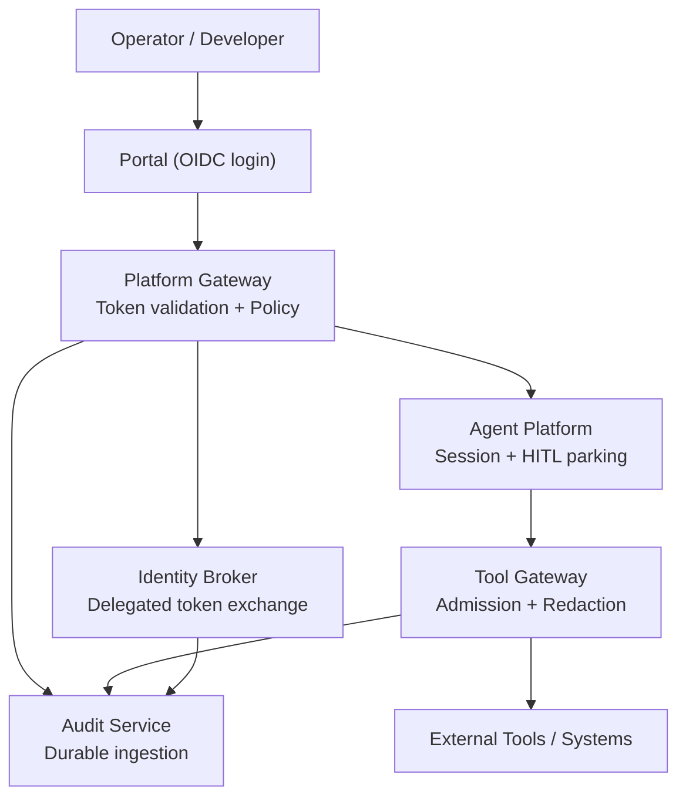
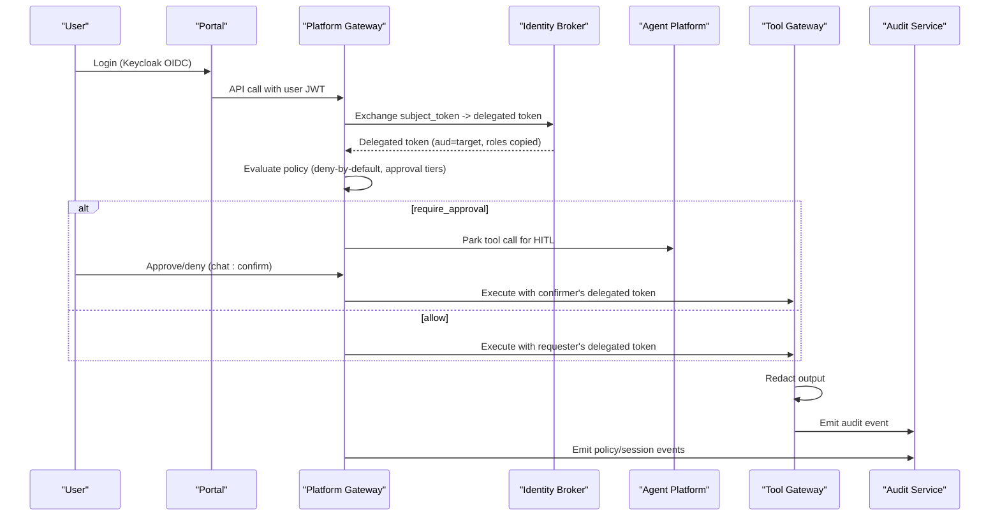
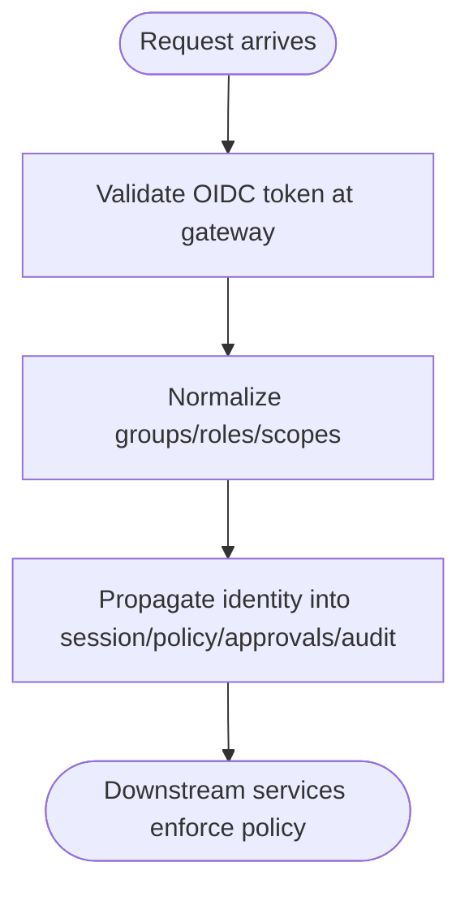
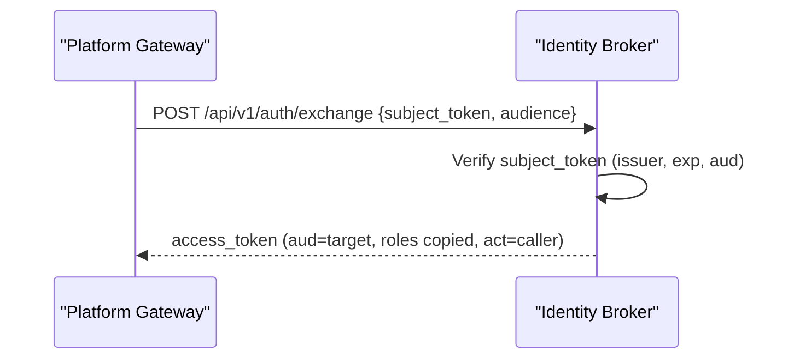
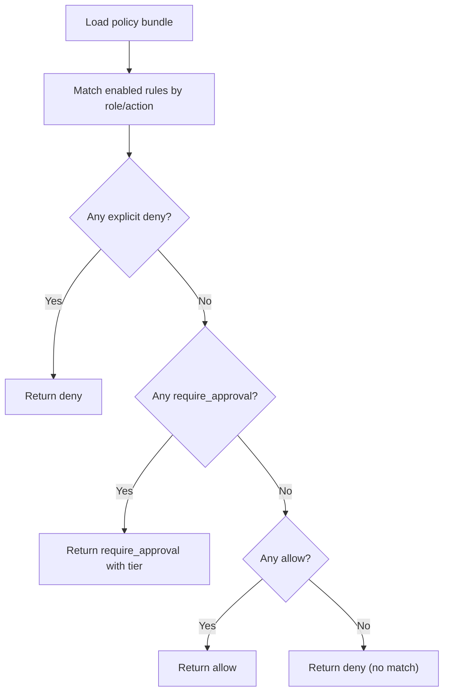
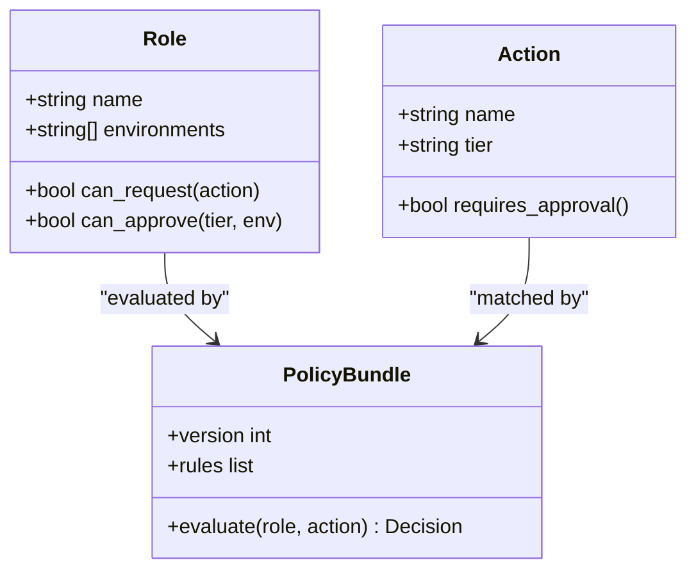
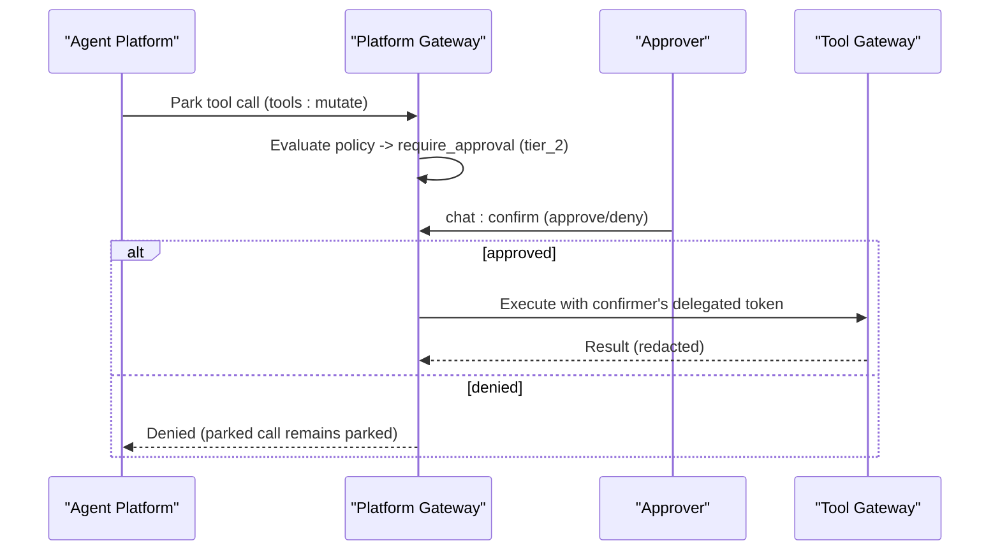
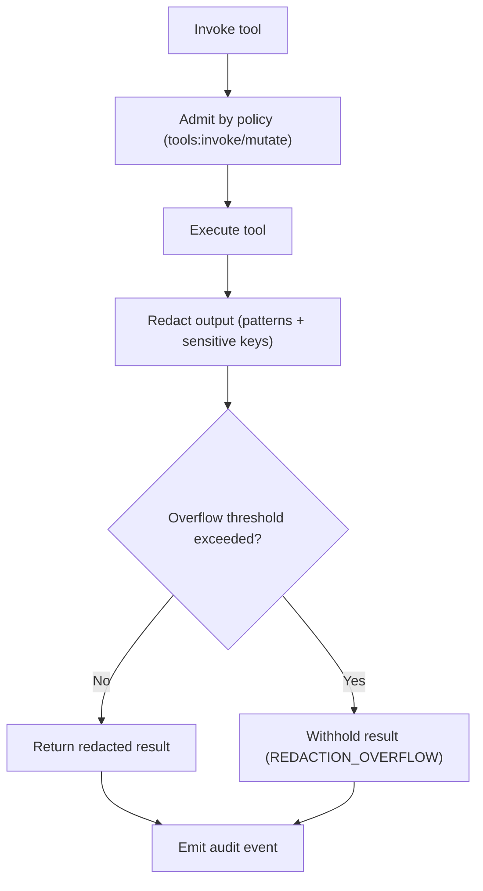
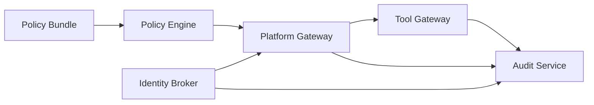

# Security and Authorization

<cite>
**Referenced Files in This Document**
- [identity-and-authorization-design.md](file://docs/agentic-aiops-platform/identity-and-authorization-design.md)
- [authorization-matrix.md](file://docs/agentic-aiops-platform/authorization-matrix.md)
- [policy-specification.md](file://docs/agentic-aiops-platform/policy-specification.md)
- [exchange_service.py](file://products/identity-broker/src/identity_service/services/exchange_service.py)
- [delegation_client.py](file://products/platform-gateway/src/platform_gateway/services/delegation_client.py)
- [policy_engine.py](file://products/platform-gateway/src/platform_gateway/services/policy_engine.py)
- [policy_matrix.py](file://products/platform-gateway/src/platform_gateway/services/policy_matrix.py)
- [policy-default.yaml](file://shared/shared-contracts/policies/policy-default.yaml)
- [request_context.py](file://products/tool-gateway/src/tool_gateway/core/request_context.py)
- [gateway_service.py](file://products/tool-gateway/src/tool_gateway/services/gateway_service.py)
- [redaction.py](file://products/tool-gateway/src/tool_gateway/tools/redaction.py)
- [SPEC-013-durable-audit-trail/spec.md](file://docs/specs/SPEC-013-durable-audit-trail/spec.md)
- [runtime_kernel.py](file://products/agent-platform/src/agent_platform/runtime_kernel.py)
- [approval-and-hitl.md](file://docs/guides/approval-and-hitl.md)
</cite>

## Table of Contents
1. [Introduction](#introduction)
2. [Project Structure](#project-structure)
3. [Core Components](#core-components)
4. [Architecture Overview](#architecture-overview)
5. [Detailed Component Analysis](#detailed-component-analysis)
6. [Dependency Analysis](#dependency-analysis)
7. [Performance Considerations](#performance-considerations)
8. [Troubleshooting Guide](#troubleshooting-guide)
9. [Conclusion](#conclusion)
10. [Appendices](#appendices)

## Introduction
This document explains the Luban AIOPS platform’s multi-layered security model: authentication via Keycloak OIDC, authorization through policy-as-code evaluation, and workload identity propagation between services. It documents the authorization matrix across roles and capabilities, the policy engine architecture and rule evaluation process, approval workflows for sensitive operations, token delegation mechanisms, service-to-service authentication, least-privilege enforcement, and security considerations for tool execution, data redaction, and audit trail integrity. It also provides guidance on configuring security settings, defining custom policies, and implementing additional authorization controls.

## Project Structure
Security is enforced at multiple boundaries:
- Identity broker authenticates users and issues short-lived delegated tokens for service-to-service calls.
- Platform gateway validates tokens, normalizes identity, evaluates policy-as-code, and bridges HITL approvals.
- Tool gateway executes tools under strict admission control, applies deterministic redaction, and emits durable audit events.
- Agent platform orchestrates sessions, parks risky tool calls for human confirmation, and propagates identity into execution context.
- Audit service persists tamper-evident-enough audit trails with retention and bounded growth.



**Diagram sources**
- [exchange_service.py:148-195](file://products/identity-broker/src/identity_service/services/exchange_service.py#L148-L195)
- [delegation_client.py:81-104](file://products/platform-gateway/src/platform_gateway/services/delegation_client.py#L81-L104)
- [policy_engine.py:390-444](file://products/platform-gateway/src/platform_gateway/services/policy_engine.py#L390-L444)
- [gateway_service.py:307-334](file://products/tool-gateway/src/tool_gateway/services/gateway_service.py#L307-L334)
- [SPEC-013-durable-audit-trail/spec.md:52-73](file://docs/specs/SPEC-013-durable-audit-trail/spec.md#L52-L73)

**Section sources**
- [identity-and-authorization-design.md:60-166](file://docs/agentic-aiops-platform/identity-and-authorization-design.md#L60-L166)
- [policy-specification.md:22-59](file://docs/agentic-aiops-platform/policy-specification.md#L22-L59)

## Core Components
- Authentication and identity federation via Keycloak OIDC, with normalized roles and environment scopes passed downstream.
- Policy-as-code engine that evaluates action authorization with deny-by-default semantics and explicit approval tiers.
- Token delegation through a broker-mediated exchange to propagate user identity to downstream services without elevating roles.
- HITL approval workflow that parks mutating tool calls until a designated approver confirms or denies them.
- Deterministic output redaction at the tool gateway choke point to prevent credential leakage.
- Durable, permission-scoped audit trail with retention and bounded growth.

**Section sources**
- [identity-and-authorization-design.md:121-166](file://docs/agentic-aiops-platform/identity-and-authorization-design.md#L121-L166)
- [policy-engine.py:390-444](file://products/platform-gateway/src/platform_gateway/services/policy_engine.py#L390-L444)
- [exchange_service.py:148-195](file://products/identity-broker/src/identity_service/services/exchange_service.py#L148-L195)
- [gateway_service.py:307-334](file://products/tool-gateway/src/tool_gateway/services/gateway_service.py#L307-L334)
- [SPEC-013-durable-audit-trail/spec.md:30-73](file://docs/specs/SPEC-013-durable-audit-trail/spec.md#L30-L73)

## Architecture Overview
The platform enforces least privilege end-to-end:
- The portal authenticates via Keycloak OIDC; the gateway validates tokens and forwards trusted identity.
- The policy engine evaluates actions against a versioned bundle with deny-by-default and approval outcomes.
- Mutating tool calls are parked and require tiered approval before execution.
- Service-to-service calls use broker-mediated delegated tokens bound to target audiences; roles are never elevated.
- Tool outputs are deterministically redacted before response and audit emission.
- All sensitive events are ingested into a durable audit service with retention and query APIs gated by policy.



**Diagram sources**
- [delegation_client.py:81-104](file://products/platform-gateway/src/platform_gateway/services/delegation_client.py#L81-L104)
- [exchange_service.py:148-195](file://products/identity-broker/src/identity_service/services/exchange_service.py#L148-L195)
- [policy_engine.py:390-444](file://products/platform-gateway/src/platform_gateway/services/policy_engine.py#L390-L444)
- [gateway_service.py:307-334](file://products/tool-gateway/src/tool_gateway/services/gateway_service.py#L307-L334)
- [SPEC-013-durable-audit-trail/spec.md:52-73](file://docs/specs/SPEC-013-durable-audit-trail/spec.md#L52-L73)

## Detailed Component Analysis

### Authentication and Identity Propagation
- Keycloak OIDC is used for portal login and API access. Tokens are validated at the gateway, which forwards normalized identity context downstream.
- Identity flows into session state, policy checks, approvals, execution requests, and audit events. Human attribution is preserved even when workers execute on behalf of services.
- Group claims from AD/Keycloak are normalized into platform roles and environment scopes before policy evaluation.



**Diagram sources**
- [identity-and-authorization-design.md:121-166](file://docs/agentic-aiops-platform/identity-and-authorization-design.md#L121-L166)
- [identity-and-authorization-design.md:278-331](file://docs/agentic-aiops-platform/identity-and-authorization-design.md#L278-L331)

**Section sources**
- [identity-and-authorization-design.md:60-166](file://docs/agentic-aiops-platform/identity-and-authorization-design.md#L60-L166)
- [identity-and-authorization-design.md:278-331](file://docs/agentic-aiops-platform/identity-and-authorization-design.md#L278-L331)

### Token Delegation and Service-to-Service Authentication
- The identity broker exposes an exchange endpoint that accepts a verified subject token and mints a short-lived, audience-bound delegated token. Roles are copied verbatim; no elevation occurs.
- The platform gateway obtains delegated tokens using either projected workload tokens or static client credentials.
- Delegated tokens carry actor information so audit logs record both the human subject and acting service.



**Diagram sources**
- [exchange_service.py:148-195](file://products/identity-broker/src/identity_service/services/exchange_service.py#L148-L195)
- [delegation_client.py:81-104](file://products/platform-gateway/src/platform_gateway/services/delegation_client.py#L81-L104)

**Section sources**
- [exchange_service.py:1-43](file://products/identity-broker/src/identity_service/services/exchange_service.py#L1-L43)
- [exchange_service.py:148-195](file://products/identity-broker/src/identity_service/services/exchange_service.py#L148-L195)
- [delegation_client.py:81-104](file://products/platform-gateway/src/platform_gateway/services/delegation_client.py#L81-L104)

### Policy Engine and Rule Evaluation
- The policy engine loads a versioned YAML bundle and evaluates actions with deny-by-default semantics. Outcomes include allow, deny, and require_approval with explicit tiers.
- Precedence: explicit deny wins; require_approval overrides allow; higher priority wins within an outcome class; disabled rules are ignored.
- The live permission matrix is derived from the same evaluate path, ensuring transparency matches enforcement.



**Diagram sources**
- [policy_engine.py:390-444](file://products/platform-gateway/src/platform_gateway/services/policy_engine.py#L390-L444)
- [policy_matrix.py:1-35](file://products/platform-gateway/src/platform_gateway/services/policy_matrix.py#L1-L35)

**Section sources**
- [policy-specification.md:61-87](file://docs/agentic-aiops-platform/policy-specification.md#L61-L87)
- [policy-engine.py:390-444](file://products/platform-gateway/src/platform_gateway/services/policy_engine.py#L390-L444)
- [policy_matrix.py:1-35](file://products/platform-gateway/src/platform_gateway/services/policy_matrix.py#L1-L35)

### Authorization Matrix and Role Permissions
- Roles include read-only-observer, operator, developer, approver, auditor, and platform-admin. Environment scopes include dev, test, staging, prod. Action tiers range from tier 0 (read-only) to tier 3 (high-risk production).
- Feature access, environment eligibility, and action permissions are defined per role and environment. Approval matrices define who may request and approve at each tier.
- The shipped default bundle encodes these permissions as rules, including mutation gating and approval requirements.



**Diagram sources**
- [authorization-matrix.md:155-265](file://docs/agentic-aiops-platform/authorization-matrix.md#L155-L265)
- [policy-default.yaml:53-152](file://shared/shared-contracts/policies/policy-default.yaml#L53-L152)

**Section sources**
- [authorization-matrix.md:16-60](file://docs/agentic-aiops-platform/authorization-matrix.md#L16-L60)
- [authorization-matrix.md:155-265](file://docs/agentic-aiops-platform/authorization-matrix.md#L155-L265)
- [policy-default.yaml:53-152](file://shared/shared-contracts/policies/policy-default.yaml#L53-L152)

### Approval Workflows and HITL
- Risky tool calls are parked and require human confirmation. Tier 1 allows self-confirmation for low-risk non-production actions; Tier 2 requires a designated approver distinct from the requester.
- The confirm flow bridges policy decisions to execution: only after approval does the tool run under the confirmer’s delegated token.
- Blocked approvals are recorded as durable audit events with structured reasons.



**Diagram sources**
- [runtime_kernel.py:1232-1258](file://products/agent-platform/src/agent_platform/runtime_kernel.py#L1232-L1258)
- [approval-and-hitl.md:190-215](file://docs/guides/approval-and-hitl.md#L190-L215)
- [policy-default.yaml:130-152](file://shared/shared-contracts/policies/policy-default.yaml#L130-L152)

**Section sources**
- [approval-and-hitl.md:190-215](file://docs/guides/approval-and-hitl.md#L190-L215)
- [policy-default.yaml:130-152](file://shared/shared-contracts/policies/policy-default.yaml#L130-L152)
- [runtime_kernel.py:1232-1258](file://products/agent-platform/src/agent_platform/runtime_kernel.py#L1232-L1258)

### Tool Execution Security and Data Redaction
- Tool invocation is admitted based on policy actions (tools:invoke for read-risk, tools:mutate for write/admin risk).
- Output redaction runs at a single choke point before both the HTTP response and audit log. If too much content appears to contain credentials, the result is withheld with a REDACTION_OVERFLOW error.
- Redaction targets known patterns (JWTs, bearer/basic credentials, PEM private keys, AWS-style keys) and explicit sensitive key names.



**Diagram sources**
- [gateway_service.py:307-334](file://products/tool-gateway/src/tool_gateway/services/gateway_service.py#L307-L334)
- [redaction.py:92-127](file://products/tool-gateway/src/tool_gateway/tools/redaction.py#L92-L127)

**Section sources**
- [gateway_service.py:307-334](file://products/tool-gateway/src/tool_gateway/services/gateway_service.py#L307-L334)
- [redaction.py:92-127](file://products/tool-gateway/src/tool_gateway/tools/redaction.py#L92-L127)

### Durable Audit Trail Integrity
- Audit events are emitted by platform-gateway, tool-gateway, and identity-broker to a dedicated audit service. Ingestion is authenticated via service identity and must not block originating requests.
- The audit store supports retention and bounded growth, with query APIs gated by policy (audit:read). Results preserve redaction applied upstream.
- Retention and eviction do not block ingest; health/metrics expose retention window and approximate size.

```mermaid
sequenceDiagram
participant E as "Emitter (Gateway/Tool/Broker)"
participant AS as "Audit Service"
E->>AS : POST /api/v1/audit/events (batch)
AS->>AS : Store with retention/bounded growth
AS-->>E : Acknowledge (non-blocking)
Note over E,AS : Unauthorized ingest returns 401; malformed events return 400
```

**Diagram sources**
- [SPEC-013-durable-audit-trail/spec.md:52-73](file://docs/specs/SPEC-013-durable-audit-trail/spec.md#L52-L73)
- [SPEC-013-durable-audit-trail/spec.md:86-104](file://docs/specs/SPEC-013-durable-audit-trail/spec.md#L86-L104)

**Section sources**
- [SPEC-013-durable-audit-trail/spec.md:30-73](file://docs/specs/SPEC-013-durable-audit-trail/spec.md#L30-L73)
- [SPEC-013-durable-audit-trail/spec.md:86-104](file://docs/specs/SPEC-013-durable-audit-trail/spec.md#L86-L104)

## Dependency Analysis
- Platform gateway depends on the policy engine and policy bundle to enforce action authorization and approval requirements.
- Identity broker provides delegated tokens to platform gateway; roles are copied, never elevated.
- Tool gateway depends on policy actions for admission and applies deterministic redaction before emitting audit events.
- Audit service depends on emitters to forward events and provides a policy-gated query API.



**Diagram sources**
- [policy_engine.py:390-444](file://products/platform-gateway/src/platform_gateway/services/policy_engine.py#L390-L444)
- [exchange_service.py:148-195](file://products/identity-broker/src/identity_service/services/exchange_service.py#L148-L195)
- [gateway_service.py:307-334](file://products/tool-gateway/src/tool_gateway/services/gateway_service.py#L307-L334)
- [SPEC-013-durable-audit-trail/spec.md:52-73](file://docs/specs/SPEC-013-durable-audit-trail/spec.md#L52-L73)

**Section sources**
- [policy_engine.py:390-444](file://products/platform-gateway/src/platform_gateway/services/policy_engine.py#L390-L444)
- [exchange_service.py:148-195](file://products/identity-broker/src/identity_service/services/exchange_service.py#L148-L195)
- [gateway_service.py:307-334](file://products/tool-gateway/src/tool_gateway/services/gateway_service.py#L307-L334)
- [SPEC-013-durable-audit-trail/spec.md:52-73](file://docs/specs/SPEC-013-durable-audit-trail/spec.md#L52-L73)

## Performance Considerations
- Policy evaluation is lightweight and operates on an in-memory bundle; ensure bundles remain concise and prioritized to minimize matching overhead.
- Redaction walks serialized results; keep tool outputs bounded to avoid excessive traversal and potential overflow rejections.
- Audit ingestion is fire-and-forget with timeouts; configure appropriate backends and retention to avoid storage pressure.

[No sources needed since this section provides general guidance]

## Troubleshooting Guide
- Token exchange failures: verify service credentials, subject token validity, and audience allow-lists. Check metrics and logs for exchange errors.
- Policy denials: inspect matched rule IDs and reasons returned by the policy engine; confirm roles and actions align with the bundle.
- Approval blocks: ensure the caller holds the required decider roles and that self-approval is permitted per tier; review blocked confirmation events.
- Redaction overflow: if tool output is withheld due to high credential density, tighten parameters or scope inputs to reduce sensitive content.
- Audit ingestion issues: confirm emitter URLs and service identities; check audit service health and retention configuration.

**Section sources**
- [exchange_service.py:148-195](file://products/identity-broker/src/identity_service/services/exchange_service.py#L148-L195)
- [policy_engine.py:390-444](file://products/platform-gateway/src/platform_gateway/services/policy_engine.py#L390-L444)
- [gateway_service.py:307-334](file://products/tool-gateway/src/tool_gateway/services/gateway_service.py#L307-L334)
- [SPEC-013-durable-audit-trail/spec.md:52-73](file://docs/specs/SPEC-013-durable-audit-trail/spec.md#L52-L73)

## Conclusion
Luban AIOPS enforces least privilege through a layered model: OIDC-based authentication, policy-as-code authorization with explicit approval tiers, broker-mediated token delegation preserving human attribution, deterministic redaction of tool outputs, and a durable audit trail with retention. The authorization matrix defines clear permissions per role and environment, while the policy engine ensures consistent enforcement. Operators can configure security settings, extend policies, and add controls while maintaining separation of duties and auditability.

[No sources needed since this section summarizes without analyzing specific files]

## Appendices

### Configuring Security Settings
- Configure Keycloak realm, clients, and federation to your directory source; set OIDC client IDs and redirect URIs for the portal and APIs.
- Set identity broker settings for token TTLs, issuer, audience, and service client registry; enable workload identity if using projected service-account tokens.
- Configure platform gateway policy path and audience for delegated tokens; ensure the policy bundle is versioned and synced.
- Enable tool gateway redaction and tune thresholds; configure audit service URL for durable ingestion.

**Section sources**
- [identity-and-authorization-design.md:121-166](file://docs/agentic-aiops-platform/identity-and-authorization-design.md#L121-L166)
- [exchange_service.py:148-195](file://products/identity-broker/src/identity_service/services/exchange_service.py#L148-L195)
- [delegation_client.py:81-104](file://products/platform-gateway/src/platform_gateway/services/delegation_client.py#L81-L104)
- [gateway_service.py:307-334](file://products/tool-gateway/src/tool_gateway/services/gateway_service.py#L307-L334)
- [SPEC-013-durable-audit-trail/spec.md:52-73](file://docs/specs/SPEC-013-durable-audit-trail/spec.md#L52-L73)

### Defining Custom Policies
- Add or modify rules in the policy bundle with clear id, domain, priority, match criteria, decision, and conditions.
- Use require_approval with explicit tiers for sensitive actions; ensure decided_by_roles excludes synthetic identities where appropriate.
- Test precedence and deny-by-default behavior; use policy diff and scenario tests before rollout.

**Section sources**
- [policy-specification.md:158-255](file://docs/agentic-aiops-platform/policy-specification.md#L158-L255)
- [policy-default.yaml:53-152](file://shared/shared-contracts/policies/policy-default.yaml#L53-L152)
- [policy_engine.py:390-444](file://products/platform-gateway/src/platform_gateway/services/policy_engine.py#L390-L444)

### Implementing Additional Authorization Controls
- Introduce new actions (e.g., resource-specific verbs) and map them to roles and environments in the bundle.
- Enforce separation of duties by restricting self-approval for high-risk tiers and requiring designated approvers.
- Extend HITL parking to new mutating tool categories and ensure confirm paths are bridged in the gateway.

**Section sources**
- [authorization-matrix.md:183-265](file://docs/agentic-aiops-platform/authorization-matrix.md#L183-L265)
- [approval-and-hitl.md:190-215](file://docs/guides/approval-and-hitl.md#L190-L215)
- [policy-default.yaml:130-152](file://shared/shared-contracts/policies/policy-default.yaml#L130-L152)