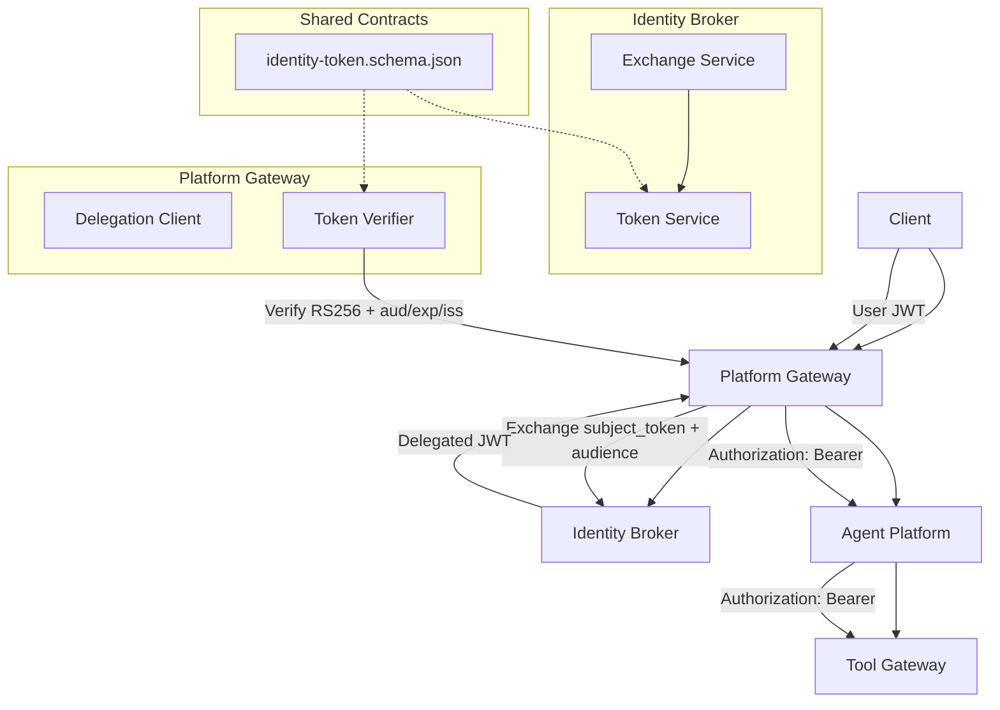
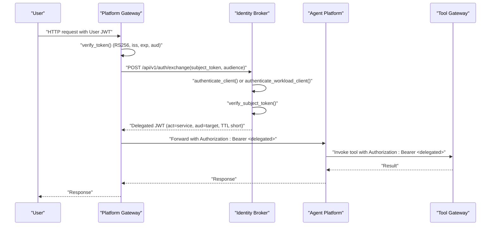
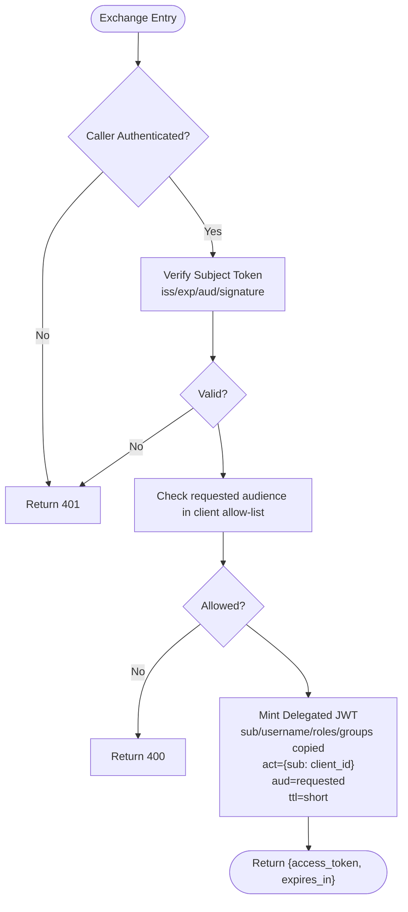
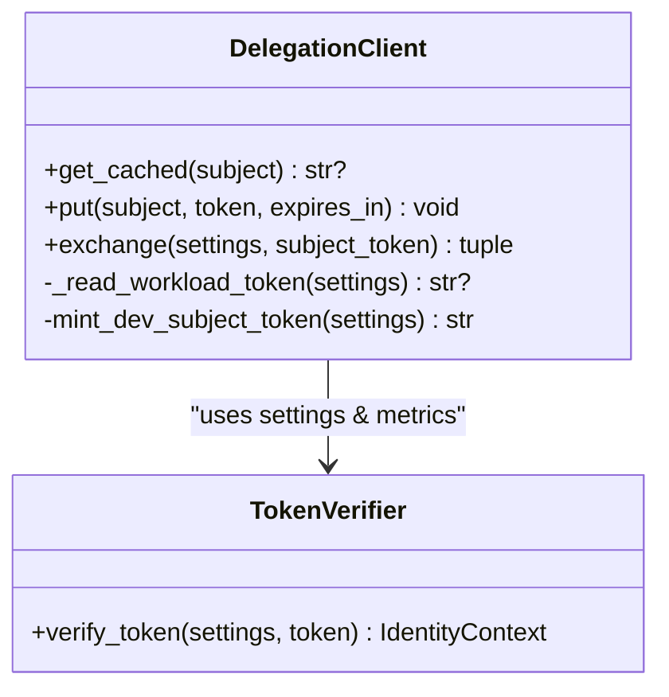
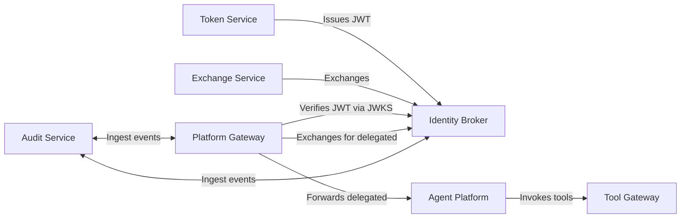

# Token Management

<cite>
**Referenced Files in This Document**
- [0004-broker-mediated-token-delegation.md](file://docs/adr/0004-broker-mediated-token-delegation.md)
- [SPEC-008-service-to-service-identity/spec.md](file://docs/specs/SPEC-008-service-to-service-identity/spec.md)
- [SPEC-008-service-to-service-identity/plan.md](file://docs/specs/SPEC-008-service-to-service-identity/plan.md)
- [identity-token.schema.json](file://shared/shared-contracts/schemas/identity-token.schema.json)
- [token_service.py](file://products/identity-broker/src/identity_service/services/token_service.py)
- [exchange_service.py](file://products/identity-broker/src/identity_service/services/exchange_service.py)
- [config.py (identity-broker)](file://products/identity-broker/src/identity_service/core/config.py)
- [delegation_client.py](file://products/platform-gateway/src/platform_gateway/services/delegation_client.py)
- [token_verifier.py (platform-gateway)](file://products/platform-gateway/src/platform_gateway/services/token_verifier.py)
- [config.py (platform-gateway)](file://products/platform-gateway/src/platform_gateway/core/config.py)
- [metrics.py (platform-gateway)](file://products/platform-gateway/src/platform_gateway/core/metrics.py)
- [test_exchange_service.py](file://products/identity-broker/tests/test_exchange_service.py)
- [test_contracts.py](file://products/identity-broker/tests/test_contracts.py)
- [test_gateway_auth.py](file://products/platform-gateway/tests/test_gateway_auth.py)
- [2026-08-12-durable-audit-trail.md](file://docs/agentic-aiops-platform/release-notes/2026-08-12-durable-audit-trail.md)
</cite>

## Table of Contents
1. Introduction
2. Project Structure
3. Core Components
4. Architecture Overview
5. Detailed Component Analysis
6. Dependency Analysis
7. Performance Considerations
8. Troubleshooting Guide
9. Conclusion
10. Appendices

## Introduction
This document describes the Luban AIOPS token management system with a focus on broker-mediated token delegation that enables services to act on behalf of users while enforcing least-privilege access. It explains token types, lifetimes, scopes, verification at service boundaries, signature validation, expiration handling, storage and transmission strategies, cleanup procedures, issuance and delegation flows, audit logging, security considerations, and guidance for extending validators and token types.

## Project Structure
Token management spans several components:
- Identity broker issues and verifies platform JWTs and mints delegated tokens via an exchange endpoint.
- Platform gateway validates user tokens, exchanges them for short-lived delegated tokens, caches them per user, and forwards them downstream.
- Tool gateway enforces audience-bound verification for tool routes.
- Shared contracts define the identity token schema used across issuer and verifiers.
- Observability and audit systems record token events durably.

**Diagram sources**
- [0004-broker-mediated-token-delegation.md:12-47](file://docs/adr/0004-broker-mediated-token-delegation.md#L12-L47)
- [SPEC-008-service-to-service-identity/spec.md:11-128](file://docs/specs/SPEC-008-service-to-service-identity/spec.md#L11-L128)
- [identity-token.schema.json:1-56](file://shared/shared-contracts/schemas/identity-token.schema.json#L1-L56)
- [token_service.py:83-126](file://products/identity-broker/src/identity_service/services/token_service.py#L83-L126)
- [exchange_service.py:148-194](file://products/identity-broker/src/identity_service/services/exchange_service.py#L148-L194)
- [delegation_client.py:78-101](file://products/platform-gateway/src/platform_gateway/services/delegation_client.py#L78-L101)
- [token_verifier.py (platform-gateway):52-80](file://products/platform-gateway/src/platform_gateway/services/token_verifier.py#L52-L80)

**Section sources**
- [0004-broker-mediated-token-delegation.md:12-47](file://docs/adr/0004-broker-mediated-token-delegation.md#L12-L47)
- [SPEC-008-service-to-service-identity/spec.md:11-128](file://docs/specs/SPEC-008-service-to-service-identity/spec.md#L11-L128)
- [identity-token.schema.json:1-56](file://shared/shared-contracts/schemas/identity-token.schema.json#L1-L56)

## Core Components
- Identity Broker
  - Issues platform JWTs with audience binding and optional actor claim for delegated tokens.
  - Exposes an exchange endpoint to mint short-lived delegated tokens from verified subject tokens.
  - Supports static client credentials and projected workload tokens for service authentication.
- Platform Gateway
  - Verifies incoming user tokens locally using JWKS and enforces issuer, audience, expiry, and required claims.
  - Caches delegated tokens per user subject with near-expiry refresh; exchanges only when needed.
  - Forwards delegated tokens as Authorization: Bearer to agent-platform.
- Tool Gateway
  - Enforces audience-bound verification for tool endpoints and derives identity solely from verified tokens.
- Shared Contract
  - Defines the identity token schema including required claims and optional actor claim for delegated tokens.

Key behaviors enforced by design:
- Audience binding prevents cross-service replay of tokens.
- Delegated tokens are short-lived and carry the original user’s roles without elevation.
- The acting service is recorded via the RFC 8693 actor claim for audit attribution.

**Section sources**
- [token_service.py:83-126](file://products/identity-broker/src/identity_service/services/token_service.py#L83-L126)
- [exchange_service.py:123-194](file://products/identity-broker/src/identity_service/services/exchange_service.py#L123-L194)
- [config.py (identity-broker):8-19, 100-169:8-19](file://products/identity-broker/src/identity_service/core/config.py#L8-L19)
- [config.py (identity-broker):100-169](file://products/identity-broker/src/identity_service/core/config.py#L100-L169)
- [delegation_client.py:44-101](file://products/platform-gateway/src/platform_gateway/services/delegation_client.py#L44-L101)
- [token_verifier.py (platform-gateway):52-80](file://products/platform-gateway/src/platform_gateway/services/token_verifier.py#L52-L80)
- [identity-token.schema.json:1-56](file://shared/shared-contracts/schemas/identity-token.schema.json#L1-L56)

## Architecture Overview
The architecture implements broker-mediated delegation:
- The platform gateway validates the user token and obtains a delegated token from the identity broker.
- The delegated token is audience-bound to the target service and carries the acting service identity.
- Agent platform relays the delegated token to tool gateway for tool invocation.
- All steps are observable via metrics and durable audit logs.

**Diagram sources**
- [SPEC-008-service-to-service-identity/spec.md:64-99](file://docs/specs/SPEC-008-service-to-service-identity/spec.md#L64-L99)
- [delegation_client.py:78-101](file://products/platform-gateway/src/platform_gateway/services/delegation_client.py#L78-L101)
- [exchange_service.py:148-194](file://products/identity-broker/src/identity_service/services/exchange_service.py#L148-L194)
- [token_verifier.py (platform-gateway):52-80](file://products/platform-gateway/src/platform_gateway/services/token_verifier.py#L52-L80)

## Detailed Component Analysis

### Identity Broker: Token Issuance and Exchange
- Token issuance signs JWTs with RS256, binds audience, includes required claims, and optionally attaches the actor claim for delegated tokens.
- Exchange flow authenticates the caller via static client credentials or projected workload tokens, verifies the subject token against the broker’s key, checks audience allow-list, and mints a short-lived delegated token copying roles without elevation.

**Diagram sources**
- [exchange_service.py:148-194](file://products/identity-broker/src/identity_service/services/exchange_service.py#L148-L194)
- [token_service.py:83-126](file://products/identity-broker/src/identity_service/services/token_service.py#L83-L126)
- [config.py (identity-broker):8-19](file://products/identity-broker/src/identity_service/core/config.py#L8-L19)

**Section sources**
- [token_service.py:83-126](file://products/identity-broker/src/identity_service/services/token_service.py#L83-L126)
- [exchange_service.py:123-194](file://products/identity-broker/src/identity_service/services/exchange_service.py#L123-L194)
- [config.py (identity-broker):100-169](file://products/identity-broker/src/identity_service/core/config.py#L100-L169)
- [test_exchange_service.py:77-133](file://products/identity-broker/tests/test_exchange_service.py#L77-L133)
- [test_contracts.py:58-91](file://products/identity-broker/tests/test_contracts.py#L58-L91)

### Platform Gateway: Delegation Client and Token Verification
- Token verification resolves the signing key via JWKS, decodes RS256 tokens, and enforces issuer, audience, expiry, and required claims.
- Delegation client maintains a per-user cache keyed by subject, re-exchanges near expiry, prefers projected workload tokens, and falls back to static credentials in dev.
- On exchange failure, chat proceeds without tools (non-fatal degradation).

**Diagram sources**
- [delegation_client.py:44-101](file://products/platform-gateway/src/platform_gateway/services/delegation_client.py#L44-L101)
- [token_verifier.py (platform-gateway):52-80](file://products/platform-gateway/src/platform_gateway/services/token_verifier.py#L52-L80)

**Section sources**
- [delegation_client.py:44-229](file://products/platform-gateway/src/platform_gateway/services/delegation_client.py#L44-L229)
- [token_verifier.py (platform-gateway):52-80](file://products/platform-gateway/src/platform_gateway/services/token_verifier.py#L52-L80)
- [config.py (platform-gateway):23-53](file://products/platform-gateway/src/platform_gateway/core/config.py#L23-L53)
- [config.py (platform-gateway):54-131](file://products/platform-gateway/src/platform_gateway/core/config.py#L54-L131)
- [test_gateway_auth.py:209-252](file://products/platform-gateway/tests/test_gateway_auth.py#L209-L252)

### Tool Gateway: Audience-Bound Verification
- Tool routes derive identity solely from verified bearer tokens and enforce audience matching before policy evaluation.
- Missing or invalid tokens result in 401 responses; policy decisions are logged and counted.

**Section sources**
- [SPEC-008-service-to-service-identity/spec.md:88-99](file://docs/specs/SPEC-008-service-to-service-identity/spec.md#L88-L99)
- [metrics.py (platform-gateway):98-116](file://products/platform-gateway/src/platform_gateway/core/metrics.py#L98-L116)

### Shared Contract: Identity Token Schema
- Required claims include issuer, subject, username, audience, issued-at, and expiry.
- Optional actor claim identifies the acting service on delegated tokens.
- Audience values differ between portal tokens and delegated tokens, enabling strict recipient binding.

**Section sources**
- [identity-token.schema.json:1-56](file://shared/shared-contracts/schemas/identity-token.schema.json#L1-L56)
- [test_contracts.py:58-91](file://products/identity-broker/tests/test_contracts.py#L58-L91)

## Dependency Analysis
- Identity broker depends on its own RSA key lifecycle and emits JWKS for verifier consumption.
- Platform gateway depends on JWKS discovery and local verification; it also depends on identity broker exchange endpoint for delegation.
- Tool gateway depends on platform gateway’s audience enforcement and policy engine for authorization.
- Audit system ingests events from multiple services using configured credentials and provides durable storage.

**Diagram sources**
- [token_service.py:83-126](file://products/identity-broker/src/identity_service/services/token_service.py#L83-L126)
- [exchange_service.py:148-194](file://products/identity-broker/src/identity_service/services/exchange_service.py#L148-L194)
- [delegation_client.py:78-101](file://products/platform-gateway/src/platform_gateway/services/delegation_client.py#L78-L101)
- [2026-08-12-durable-audit-trail.md:70-94](file://docs/agentic-aiops-platform/release-notes/2026-08-12-durable-audit-trail.md#L70-L94)

**Section sources**
- [token_service.py:83-126](file://products/identity-broker/src/identity_service/services/token_service.py#L83-L126)
- [exchange_service.py:148-194](file://products/identity-broker/src/identity_service/services/exchange_service.py#L148-L194)
- [delegation_client.py:78-101](file://products/platform-gateway/src/platform_gateway/services/delegation_client.py#L78-L101)
- [2026-08-12-durable-audit-trail.md:70-94](file://docs/agentic-aiops-platform/release-notes/2026-08-12-durable-audit-trail.md#L70-L94)

## Performance Considerations
- Per-user delegated token caching reduces broker calls to once per user per TTL window per replica.
- Near-expiry refresh threshold avoids mid-request token expiration.
- Non-fatal delegation failures degrade gracefully to tool-less operation, preserving chat availability.
- Metrics track verification outcomes, delegation exchanges, and cache hits/misses for capacity planning.

[No sources needed since this section provides general guidance]

## Troubleshooting Guide
Common issues and diagnostics:
- Invalid or expired subject token during exchange results in 401; verify issuer, audience, and expiry.
- Disallowed audience for a client yields 400; ensure the requested audience is in the client’s allow-list.
- Wrong or missing audience in verification leads to 401; confirm the token’s aud matches the expected audience.
- Missing service credential for exchange returns 401; configure static client or workload token path.
- Audit ingestion failures degrade to log-only; check audit service URL and credentials.

Operational checks:
- Inspect metrics counters for token verification and delegation exchange outcomes.
- Review durable audit trail for token exchange events and policy decisions.

**Section sources**
- [exchange_service.py:148-194](file://products/identity-broker/src/identity_service/services/exchange_service.py#L148-L194)
- [test_exchange_service.py:95-133](file://products/identity-broker/tests/test_exchange_service.py#L95-L133)
- [test_gateway_auth.py:226-252](file://products/platform-gateway/tests/test_gateway_auth.py#L226-L252)
- [metrics.py (platform-gateway):98-116](file://products/platform-gateway/src/platform_gateway/core/metrics.py#L98-L116)
- [2026-08-12-durable-audit-trail.md:70-94](file://docs/agentic-aiops-platform/release-notes/2026-08-12-durable-audit-trail.md#L70-L94)

## Conclusion
The Luban AIOPS token management system uses broker-mediated delegation to provide least-privilege, short-lived, audience-bound tokens for service-to-service interactions. It enforces strict verification at each boundary, records both human and service attribution, and supports durable audit trails. The design balances security with operational resilience through caching, graceful degradation, and comprehensive observability.

[No sources needed since this section summarizes without analyzing specific files]

## Appendices

### Token Types, Lifetimes, and Scopes
- User tokens (portal tokens)
  - Issued at login/refresh, audience-bound to the platform gateway, no actor claim.
  - Default TTL configured via identity broker settings.
- Delegated tokens
  - Minted by the exchange endpoint for service-to-service calls.
  - Carry actor claim identifying the acting service, audience bound to the target service, and short TTL.
  - Roles copied verbatim from the subject token; never elevated.
- Service tokens
  - Service credentials (static or projected workload tokens) authenticate to the exchange endpoint but confer no user authority on their own.

**Section sources**
- [identity-token.schema.json:1-56](file://shared/shared-contracts/schemas/identity-token.schema.json#L1-L56)
- [exchange_service.py:148-194](file://products/identity-broker/src/identity_service/services/exchange_service.py#L148-L194)
- [config.py (identity-broker):100-169](file://products/identity-broker/src/identity_service/core/config.py#L100-L169)

### Token Storage and Secure Transmission
- Storage
  - Platform gateway caches delegated tokens in memory per user subject with near-expiry refresh.
  - Identity broker persists RSA private key if configured; otherwise uses ephemeral keys in tests/dev.
- Transmission
  - Tokens transmitted over TLS as Authorization: Bearer headers.
  - Workload tokens read from projected files when available; fallback to static credentials in dev.

**Section sources**
- [delegation_client.py:44-101](file://products/platform-gateway/src/platform_gateway/services/delegation_client.py#L44-L101)
- [token_service.py:42-65](file://products/identity-broker/src/identity_service/services/token_service.py#L42-L65)

### Cleanup Procedures
- Delegated token cache entries expire based on near-expiry thresholds; stale entries are removed on subsequent lookups.
- Module-level state reset functions exist for tests to clear keys and caches.

**Section sources**
- [delegation_client.py:58-76](file://products/platform-gateway/src/platform_gateway/services/delegation_client.py#L58-L76)
- [token_service.py:76-80](file://products/identity-broker/src/identity_service/services/token_service.py#L76-L80)

### Examples: Issuance, Delegation Chains, and Audit Logging
- Issuance
  - Identity broker issues portal tokens with audience bound to the platform gateway.
- Delegation chain
  - Platform gateway exchanges user token for delegated token targeting tool gateway; agent platform relays it to tool gateway.
- Audit logging
  - Token exchange events are emitted and stored durably when audit service is configured.

**Section sources**
- [SPEC-008-service-to-service-identity/spec.md:64-99](file://docs/specs/SPEC-008-service-to-service-identity/spec.md#L64-L99)
- [2026-08-12-durable-audit-trail.md:70-94](file://docs/agentic-aiops-platform/release-notes/2026-08-12-durable-audit-trail.md#L70-L94)

### Security Considerations
- Theft prevention
  - Audience binding prevents replay across services.
  - Short-lived delegated tokens minimize exposure window.
  - Actor claim separates human requester from acting service for audit.
- Revocation
  - No explicit revocation lists; rely on short TTL and per-user re-exchange.
- Monitoring suspicious patterns
  - Use metrics for token verification failures, delegation exchange errors, and cache misses.
  - Query durable audit trail for unusual exchange patterns or denied invocations.

**Section sources**
- [0004-broker-mediated-token-delegation.md:24-47](file://docs/adr/0004-broker-mediated-token-delegation.md#L24-L47)
- [metrics.py (platform-gateway):98-116](file://products/platform-gateway/src/platform_gateway/core/metrics.py#L98-L116)
- [2026-08-12-durable-audit-trail.md:70-94](file://docs/agentic-aiops-platform/release-notes/2026-08-12-durable-audit-trail.md#L70-L94)

### Extending Validators and Token Types
- Custom validators
  - Implement additional claim checks in gateway token verification while preserving required claims and audience enforcement.
- Extending token types
  - Add new audiences to service client allow-lists and update configuration to permit requested audiences.
  - Ensure new token shapes validate against the shared identity token schema.

**Section sources**
- [config.py (identity-broker):8-19](file://products/identity-broker/src/identity_service/core/config.py#L8-L19)
- [identity-token.schema.json:1-56](file://shared/shared-contracts/schemas/identity-token.schema.json#L1-L56)
- [SPEC-008-service-to-service-identity/plan.md:11-30](file://docs/specs/SPEC-008-service-to-service-identity/plan.md#L11-L30)