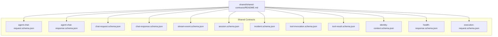
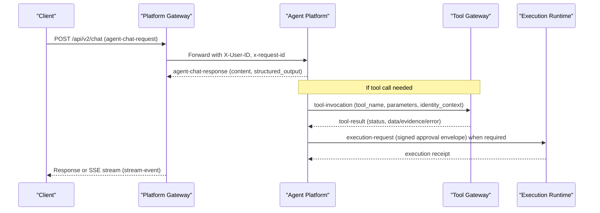
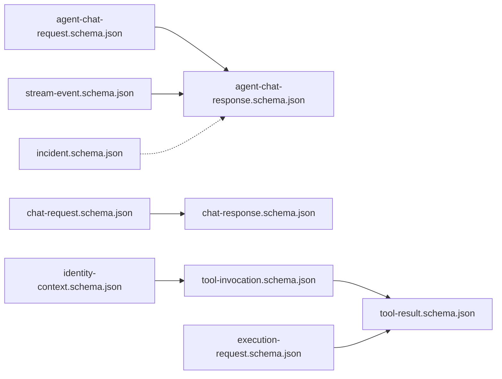

# API Schemas

<cite>
**Referenced Files in This Document**
- [shared/shared-contracts/README.md](file://shared/shared-contracts/README.md)
- [shared/shared-contracts/schemas/agent-chat-request.schema.json](file://shared/shared-contracts/schemas/agent-chat-request.schema.json)
- [shared/shared-contracts/schemas/agent-chat-response.schema.json](file://shared/shared-contracts/schemas/agent-chat-response.schema.json)
- [shared/shared-contracts/schemas/chat-request.schema.json](file://shared/shared-contracts/schemas/chat-request.schema.json)
- [shared/shared-contracts/schemas/chat-response.schema.json](file://shared/shared-contracts/schemas/chat-response.schema.json)
- [shared/shared-contracts/schemas/stream-event.schema.json](file://shared/shared-contracts/schemas/stream-event.schema.json)
- [shared/shared-contracts/schemas/session.schema.json](file://shared/shared-contracts/schemas/session.schema.json)
- [shared/shared-contracts/schemas/incident.schema.json](file://shared/shared-contracts/schemas/incident.schema.json)
- [shared/shared-contracts/schemas/tool-invocation.schema.json](file://shared/shared-contracts/schemas/tool-invocation.schema.json)
- [shared/shared-contracts/schemas/tool-result.schema.json](file://shared/shared-contracts/schemas/tool-result.schema.json)
- [shared/shared-contracts/schemas/identity-context.schema.json](file://shared/shared-contracts/schemas/identity-context.schema.json)
- [shared/shared-contracts/schemas/health-response.schema.json](file://shared/shared-contracts/schemas/health-response.schema.json)
- [shared/shared-contracts/schemas/execution-request.schema.json](file://shared/shared-contracts/schemas/execution-request.schema.json)
</cite>

## Table of Contents
1. Introduction
2. Project Structure
3. Core Components
4. Architecture Overview
5. Detailed Component Analysis
6. Dependency Analysis
7. Performance Considerations
8. Troubleshooting Guide
9. Conclusion

## Introduction
This document describes the shared JSON Schema contracts that standardize communication between platform services. It covers agent chat request/response schemas (v1 and v2), session management, incident data models, tool invocation and result formats, identity context, execution envelopes, streaming events, and health responses. For each schema, it explains structure, required fields, validation rules, data types, example payloads, error response formats, versioning strategy, and guidance for extending schemas while preserving backward compatibility.

## Project Structure
The canonical contracts are centralized under shared/shared-contracts/schemas. Each file is a self-contained JSON Schema draft 2020-12 definition with an $id for discovery and versioning. The shared README documents conventions such as header-based identity transport, stream event field naming differences across versions, policy contract semantics, and tool execution envelope behavior.

**Diagram sources**
- [shared/shared-contracts/README.md:1-127](file://shared/shared-contracts/README.md#L1-L127)

**Section sources**
- [shared/shared-contracts/README.md:1-127](file://shared/shared-contracts/README.md#L1-L127)

## Core Components
- Agent chat v2: Request and response envelopes used by the platform-owned agent-service boundary. Identity travels in headers; content replaces the legacy response field.
- Agent chat v1: Legacy portal/gateway contract with message, user_id, request_id, and response field.
- Streaming events: v1 uses event type; v2 uses type to avoid SSE collisions.
- Sessions: Canonical session object with lifecycle status.
- Incidents: Canonical incident envelope with lifecycle states and provenance fields.
- Tool execution: Invocation envelope and result envelope with evidence and error handling.
- Identity context: Subject, username, roles, groups, email, and optional actor attribution.
- Health: Standardized service health response.
- Execution requests: Signed approval envelopes for parked tool calls with integrity checks.

**Section sources**
- [shared/shared-contracts/schemas/agent-chat-request.schema.json:1-35](file://shared/shared-contracts/schemas/agent-chat-request.schema.json#L1-L35)
- [shared/shared-contracts/schemas/agent-chat-response.schema.json:1-35](file://shared/shared-contracts/schemas/agent-chat-response.schema.json#L1-L35)
- [shared/shared-contracts/schemas/chat-request.schema.json:1-38](file://shared/shared-contracts/schemas/chat-request.schema.json#L1-L38)
- [shared/shared-contracts/schemas/chat-response.schema.json:1-26](file://shared/shared-contracts/schemas/chat-response.schema.json#L1-L26)
- [shared/shared-contracts/schemas/stream-event.schema.json:1-27](file://shared/shared-contracts/schemas/stream-event.schema.json#L1-L27)
- [shared/shared-contracts/schemas/session.schema.json:1-26](file://shared/shared-contracts/schemas/session.schema.json#L1-L26)
- [shared/shared-contracts/schemas/incident.schema.json:1-95](file://shared/shared-contracts/schemas/incident.schema.json#L1-L95)
- [shared/shared-contracts/schemas/tool-invocation.schema.json:1-35](file://shared/shared-contracts/schemas/tool-invocation.schema.json#L1-L35)
- [shared/shared-contracts/schemas/tool-result.schema.json:1-69](file://shared/shared-contracts/schemas/tool-result.schema.json#L1-L69)
- [shared/shared-contracts/schemas/identity-context.schema.json:1-37](file://shared/shared-contracts/schemas/identity-context.schema.json#L1-L37)
- [shared/shared-contracts/schemas/health-response.schema.json:1-21](file://shared/shared-contracts/schemas/health-response.schema.json#L1-L21)
- [shared/shared-contracts/schemas/execution-request.schema.json:1-71](file://shared/shared-contracts/schemas/execution-request.schema.json#L1-L71)

## Architecture Overview
The shared schemas define the wire format across services:
- Portal/Gateway -> Agent Platform: Chat v1/v2 requests and responses, streaming events.
- Agent Platform -> Tool Gateway: Tool invocation and result envelopes.
- Identity Broker -> All Services: Identity context and token claims.
- Incident Service: Incident model consumed by UI and other services.
- Health endpoints: Standard health response for readiness/liveness.

**Diagram sources**
- [shared/shared-contracts/schemas/agent-chat-request.schema.json:1-35](file://shared/shared-contracts/schemas/agent-chat-request.schema.json#L1-L35)
- [shared/shared-contracts/schemas/agent-chat-response.schema.json:1-35](file://shared/shared-contracts/schemas/agent-chat-response.schema.json#L1-L35)
- [shared/shared-contracts/schemas/tool-invocation.schema.json:1-35](file://shared/shared-contracts/schemas/tool-invocation.schema.json#L1-L35)
- [shared/shared-contracts/schemas/tool-result.schema.json:1-69](file://shared/shared-contracts/schemas/tool-result.schema.json#L1-L69)
- [shared/shared-contracts/schemas/execution-request.schema.json:1-71](file://shared/shared-contracts/schemas/execution-request.schema.json#L1-L71)
- [shared/shared-contracts/schemas/stream-event.schema.json:1-27](file://shared/shared-contracts/schemas/stream-event.schema.json#L1-L27)

## Detailed Component Analysis

### Agent Chat v2 (Request and Response)
- Purpose: Platform-owned agent-service boundary between tool-gateway and agent-platform.
- Identity: Transported via headers (X-User-ID, x-request-id), not in body.
- Request fields:
  - message: string, required, minLength 1.
  - session_id: optional string to continue a conversation.
  - input_modality: enum ["text","voice"], default "text". Metadata only; does not affect policy or HITL outcomes.
  - response_schema: optional object passed through to kernel for structured output validation.
  - model: optional string or null; resolved against available models; unknown id refused with 4xx.
- Response fields:
  - session_id, request_id, content: required strings.
  - status: enum ["ok","partial","error"], default "ok".
  - structured_output: optional object or null when response_schema was provided.
  - model: optional string or null indicating resolved model.

Example valid request payload:
{
  "message": "List pods in namespace kube-system",
  "input_modality": "text",
  "response_schema": {"type":"object","properties":{"pods":{"type":"array"}}},
  "model": "gpt-4o"
}

Example valid response payload:
{
  "session_id": "sess-abc123",
  "request_id": "req-xyz",
  "content": "Found 3 pods.",
  "status": "ok",
  "structured_output": {"pods":["pod-a","pod-b","pod-c"]},
  "model": "gpt-4o"
}

Validation notes:
- additionalProperties: false enforces strict schema adherence.
- Enum constraints on status and input_modality.
- Model resolution failure returns client error (4xx).

**Section sources**
- [shared/shared-contracts/schemas/agent-chat-request.schema.json:1-35](file://shared/shared-contracts/schemas/agent-chat-request.schema.json#L1-L35)
- [shared/shared-contracts/schemas/agent-chat-response.schema.json:1-35](file://shared/shared-contracts/schemas/agent-chat-response.schema.json#L1-L35)
- [shared/shared-contracts/README.md:52-67](file://shared/shared-contracts/README.md#L52-L67)

### Agent Chat v1 (Request and Response)
- Purpose: Legacy portal/gateway contract.
- Request fields:
  - message: required string, minLength 1.
  - session_id: optional string.
  - user_id: normalized user identifier propagated from identity layer.
  - request_id: correlation identifier.
  - input_modality: enum ["text","voice"], default "text".
  - model: optional string or null; metadata only.
- Response fields:
  - session_id, request_id, response: required strings.
  - status: enum ["ok","partial","error"], default "ok".

Example valid request payload:
{
  "message": "Show recent alerts",
  "user_id": "user-123",
  "request_id": "req-1",
  "input_modality": "text"
}

Example valid response payload:
{
  "session_id": "sess-abc123",
  "request_id": "req-1",
  "response": "Alerts: 3 critical, 5 warning.",
  "status": "ok"
}

**Section sources**
- [shared/shared-contracts/schemas/chat-request.schema.json:1-38](file://shared/shared-contracts/schemas/chat-request.schema.json#L1-L38)
- [shared/shared-contracts/schemas/chat-response.schema.json:1-26](file://shared/shared-contracts/schemas/chat-response.schema.json#L1-L26)

### Streaming Events
- v1 uses event field with values ["message_start","message_delta","message_end","error"].
- v2 uses type instead of event to avoid collision with SSE event: line.
- Common fields: request_id, session_id; delta/message vary by event type.

Example v1 event payload:
{
  "event": "message_delta",
  "request_id": "req-1",
  "session_id": "sess-abc123",
  "delta": "..."
}

**Section sources**
- [shared/shared-contracts/schemas/stream-event.schema.json:1-27](file://shared/shared-contracts/schemas/stream-event.schema.json#L1-L27)
- [shared/shared-contracts/README.md:52-67](file://shared/shared-contracts/README.md#L52-L67)

### Session Management
- Canonical session object with:
  - session_id: string, required.
  - created_at: date-time, required.
  - status: enum ["active","closed"], default "active".
  - user_id: optional string.

Example valid session payload:
{
  "session_id": "sess-abc123",
  "user_id": "user-123",
  "created_at": "2026-01-01T00:00:00Z",
  "status": "active"
}

**Section sources**
- [shared/shared-contracts/schemas/session.schema.json:1-26](file://shared/shared-contracts/schemas/session.schema.json#L1-L26)

### Incident Data Model
- Canonical incident envelope with lifecycle: new -> triaging -> triaged | triage_failed; resolved is terminal.
- Required fields: incident_id, fingerprint, source, severity, status, title, summary, labels, created_at, updated_at.
- Optional fields: reported_by, session_id, triage_raw, resolved_at.
- Constraints:
  - incident_id pattern: inc-[a-z0-9-]+.
  - severity: enum ["critical","warning","info"].
  - status: enum ["new","triaging","triaged","triage_failed","resolved"].
  - label map values are strings.
  - Length limits on title, summary, session_id, reported_by, triage_raw.

Example valid incident payload:
{
  "incident_id": "inc-alert-001",
  "fingerprint": "grp-abc123",
  "source": "alertmanager",
  "severity": "critical",
  "status": "triaging",
  "title": "High CPU usage on node-1",
  "summary": "Node CPU exceeded threshold.",
  "labels": {"cluster":"prod-us-east","node":"node-1"},
  "created_at": "2026-01-01T00:00:00Z",
  "updated_at": "2026-01-01T00:01:00Z"
}

**Section sources**
- [shared/shared-contracts/schemas/incident.schema.json:1-95](file://shared/shared-contracts/schemas/incident.schema.json#L1-L95)

### Tool Invocation and Result Formats
- Tool invocation envelope:
  - Required: tool_name, request_id.
  - parameters: object with tool-specific shape defined by parameters_schema.
  - identity_context: object with sub, username, roles; additional properties allowed.
  - Naming convention: <system>.<verb>_<noun>.
- Tool result envelope:
  - Required: tool_name, status, evidence.
  - status: enum ["success","error","denied"].
  - data: present on success.
  - evidence: required object with executed_at, duration_ms, risk_level, source_system.
  - error: present on error/denied with code and message.

Example valid invocation payload:
{
  "tool_name": "k8s.list_pods",
  "parameters": {"namespace":"kube-system"},
  "identity_context": {"sub":"user-123","username":"alice","roles":["viewer"]},
  "request_id": "req-tool-1"
}

Example valid success result payload:
{
  "tool_name": "k8s.list_pods",
  "status": "success",
  "data": {"items":["pod-a","pod-b"]},
  "evidence": {
    "executed_at": "2026-01-01T00:00:00Z",
    "duration_ms": 120,
    "risk_level": "read",
    "source_system": "kubernetes"
  }
}

Example denied result payload:
{
  "tool_name": "k8s.delete_pod",
  "status": "denied",
  "evidence": {
    "executed_at": "2026-01-01T00:00:00Z",
    "duration_ms": 5,
    "risk_level": "write",
    "source_system": "kubernetes"
  },
  "error": {"code":"POLICY_DENIED","message":"Action denied by policy"}
}

**Section sources**
- [shared/shared-contracts/schemas/tool-invocation.schema.json:1-35](file://shared/shared-contracts/schemas/tool-invocation.schema.json#L1-L35)
- [shared/shared-contracts/schemas/tool-result.schema.json:1-69](file://shared/shared-contracts/schemas/tool-result.schema.json#L1-L69)
- [shared/shared-contracts/README.md:98-113](file://shared/shared-contracts/README.md#L98-L113)

### Identity Context Schemas
- Identity context object:
  - Required: subject, username, roles.
  - Optional: email (email format), groups (string array), actor (string|null) for delegated tokens.
- Used to propagate authenticated identity attributes downstream.

Example valid identity context payload:
{
  "subject": "user-123",
  "username": "alice",
  "email": "alice@example.com",
  "groups": ["ops","platform"],
  "roles": ["viewer","editor"],
  "actor": "agent-platform"
}

**Section sources**
- [shared/shared-contracts/schemas/identity-context.schema.json:1-37](file://shared/shared-contracts/schemas/identity-context.schema.json#L1-L37)
- [shared/shared-contracts/README.md:68-78](file://shared/shared-contracts/README.md#L68-L78)

### Health Check Responses
- Health response:
  - Required: status, service.
  - status: enum ["ok","degraded"].
  - Optional: version.

Example valid health response payload:
{
  "status": "ok",
  "service": "agent-platform",
  "version": "1.2.3"
}

**Section sources**
- [shared/shared-contracts/schemas/health-response.schema.json:1-21](file://shared/shared-contracts/schemas/health-response.schema.json#L1-L21)

### Execution Requests (Signed Approval Envelopes)
- Purpose: Constructed when a parked confirmation resumes with approval; one envelope per approved parked tool call.
- Required fields: execution_id, confirm_id, call_id, session_id, owner_user_id, decider_user_id, tool_name, args_digest, requested_at, signature.
- Optional: approval_kind (enum ["action","flow"]) stamped before signing to declare authority provenance.
- Integrity:
  - args_digest: SHA-256 hex of canonical JSON of parked arguments; recomputed at invocation boundary to prevent tampering.
  - signature: HMAC-SHA256 hex over canonical JSON of all fields except signature itself.
- Validation: Mismatched args_digest or invalid signature blocks execution.

Example valid execution request payload:
{
  "execution_id": "exec-uuid-1",
  "confirm_id": "conf-abc",
  "call_id": "call-xyz",
  "session_id": "sess-abc123",
  "owner_user_id": "user-owner",
  "decider_user_id": "user-decider",
  "tool_name": "web.click",
  "args_digest": "abcdef0123456789abcdef0123456789abcdef0123456789abcdef0123456789",
  "requested_at": "2026-01-01T00:00:00Z",
  "approval_kind": "action",
  "signature": "fedcba9876543210fedcba9876543210fedcba9876543210fedcba9876543210"
}

**Section sources**
- [shared/shared-contracts/schemas/execution-request.schema.json:1-71](file://shared/shared-contracts/schemas/execution-request.schema.json#L1-L71)

## Dependency Analysis
Schema relationships and cross-cutting concerns:
- Identity travel: Headers carry identity for v2 chat; identity_context embedded in tool invocation.
- Versioning: v1 vs v2 distinctions documented in shared README; v2 uses content/type to align with streaming semantics.
- Policy enforcement: Tool results include denied status with POLICY_DENIED; policy decisions and rules are defined elsewhere but influence tool execution outcomes.
- Evidence and audit: Tool results and execution envelopes carry provenance fields for auditability.

**Diagram sources**
- [shared/shared-contracts/schemas/agent-chat-request.schema.json:1-35](file://shared/shared-contracts/schemas/agent-chat-request.schema.json#L1-L35)
- [shared/shared-contracts/schemas/agent-chat-response.schema.json:1-35](file://shared/shared-contracts/schemas/agent-chat-response.schema.json#L1-L35)
- [shared/shared-contracts/schemas/chat-request.schema.json:1-38](file://shared/shared-contracts/schemas/chat-request.schema.json#L1-L38)
- [shared/shared-contracts/schemas/chat-response.schema.json:1-26](file://shared/shared-contracts/schemas/chat-response.schema.json#L1-L26)
- [shared/shared-contracts/schemas/stream-event.schema.json:1-27](file://shared/shared-contracts/schemas/stream-event.schema.json#L1-L27)
- [shared/shared-contracts/schemas/identity-context.schema.json:1-37](file://shared/shared-contracts/schemas/identity-context.schema.json#L1-L37)
- [shared/shared-contracts/schemas/tool-invocation.schema.json:1-35](file://shared/shared-contracts/schemas/tool-invocation.schema.json#L1-L35)
- [shared/shared-contracts/schemas/tool-result.schema.json:1-69](file://shared/shared-contracts/schemas/tool-result.schema.json#L1-L69)
- [shared/shared-contracts/schemas/execution-request.schema.json:1-71](file://shared/shared-contracts/schemas/execution-request.schema.json#L1-L71)
- [shared/shared-contracts/schemas/incident.schema.json:1-95](file://shared/shared-contracts/schemas/incident.schema.json#L1-L95)

**Section sources**
- [shared/shared-contracts/README.md:52-113](file://shared/shared-contracts/README.md#L52-L113)

## Performance Considerations
- Strict schemas with additionalProperties: false reduce parsing overhead and catch errors early.
- Minimal bodies: v2 moves identity to headers to avoid redundant serialization.
- Stream events use lightweight deltas to minimize bandwidth.
- Evidence fields are compact and numeric where possible (duration_ms).
- Model selection is metadata-only and resolved once per turn to avoid repeated lookups.

[No sources needed since this section provides general guidance]

## Troubleshooting Guide
Common validation failures and resolutions:
- Missing required fields: Ensure message (v1/v2), session_id/request_id/content (v2 response), tool_name/request_id (invocation), and evidence fields are present.
- Invalid enums: Verify status, input_modality, severity, and risk_level values match allowed sets.
- Unknown model: v2 chat refuses unknown model ids with 4xx; check available models endpoint.
- Policy denial: Tool result status denied indicates policy rejection; inspect error.code POLICY_DENIED and adjust permissions or tool usage.
- Signature mismatch: Execution request rejected if signature or args_digest do not match; rebuild envelope using canonical JSON and correct keys.
- Identity context issues: Ensure subject, username, roles are present; verify email format if included.

Error response examples:
- Tool result denied:
{
  "tool_name": "web.evaluate",
  "status": "denied",
  "evidence": {
    "executed_at": "2026-01-01T00:00:00Z",
    "duration_ms": 2,
    "risk_level": "write",
    "source_system": "browser"
  },
  "error": {"code":"POLICY_DENIED","message":"Write action requires approval"}
}

- Health degraded:
{
  "status": "degraded",
  "service": "agent-platform",
  "version": "1.2.3"
}

**Section sources**
- [shared/shared-contracts/schemas/tool-result.schema.json:1-69](file://shared/shared-contracts/schemas/tool-result.schema.json#L1-L69)
- [shared/shared-contracts/schemas/health-response.schema.json:1-21](file://shared/shared-contracts/schemas/health-response.schema.json#L1-L21)
- [shared/shared-contracts/schemas/execution-request.schema.json:1-71](file://shared/shared-contracts/schemas/execution-request.schema.json#L1-L71)

## Conclusion
These shared JSON Schema contracts provide a consistent, versioned interface across platform services. They enforce strict validation, support streaming and structured outputs, carry identity and provenance information, and enable secure execution via signed approval envelopes. Extending schemas should follow backward-compatible practices: add optional fields, preserve existing required fields, and update consumers incrementally. Use the shared README conventions for header-based identity, stream event naming, and policy/tool execution semantics to maintain interoperability.

[No sources needed since this section summarizes without analyzing specific files]