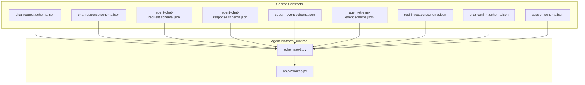
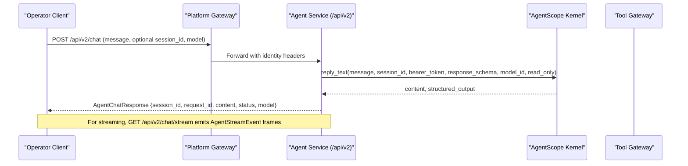
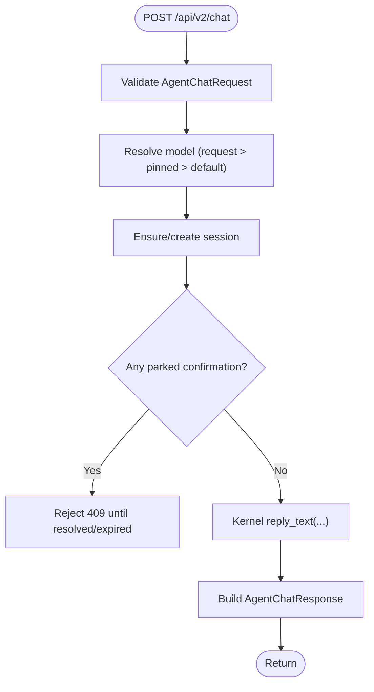
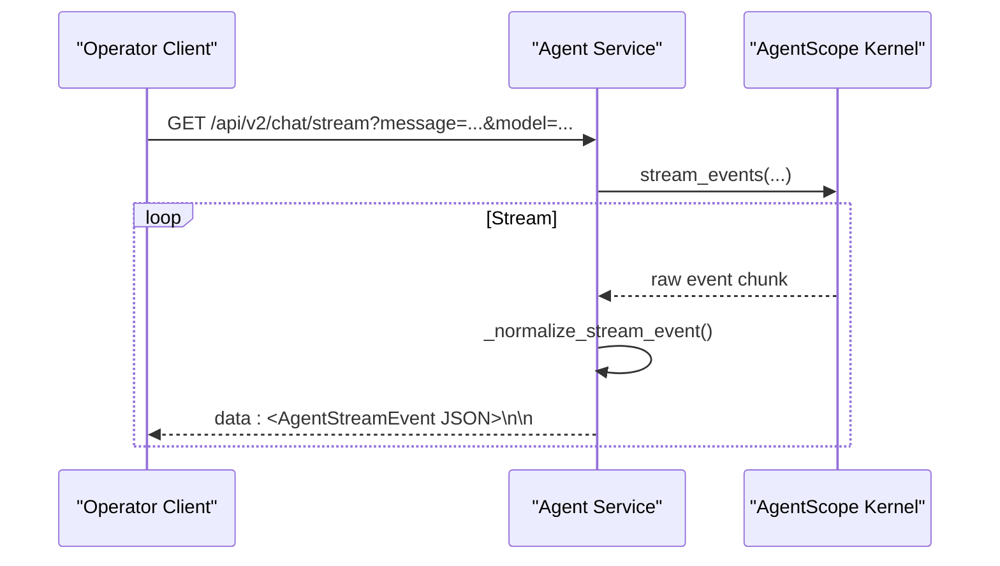
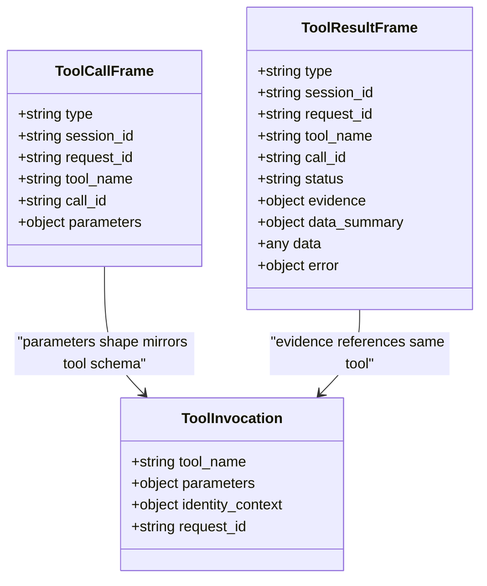
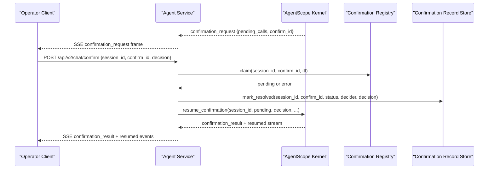
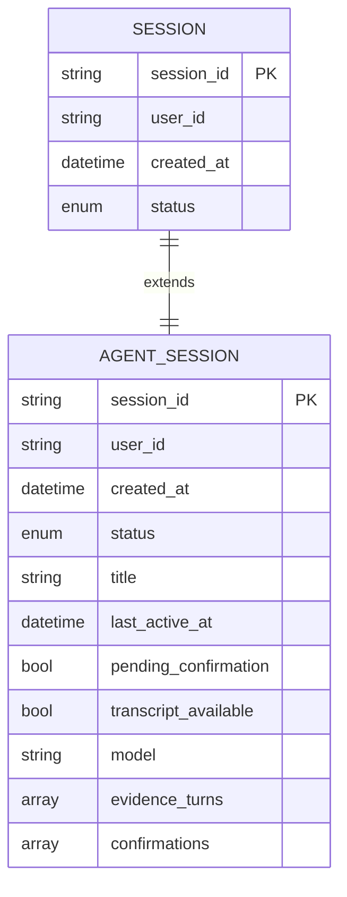
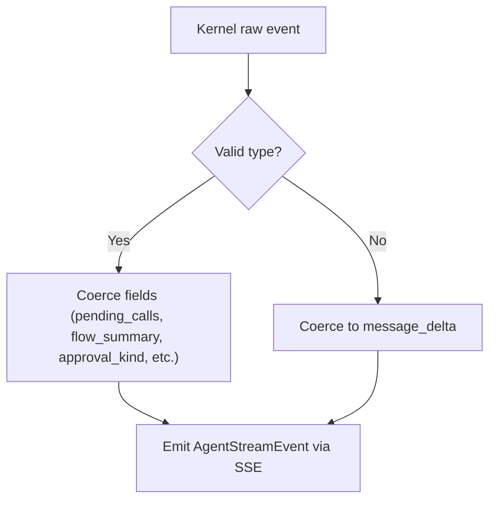
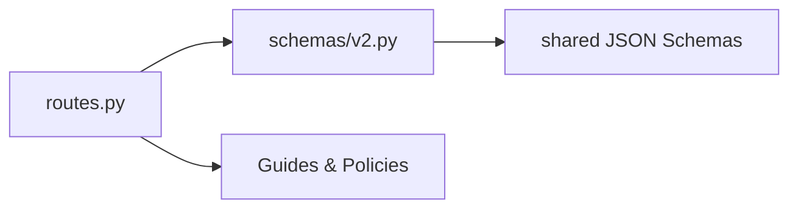

# Agent Communication Schemas

<cite>
**Referenced Files in This Document**
- [chat-request.schema.json](file://shared/shared-contracts/schemas/chat-request.schema.json)
- [chat-response.schema.json](file://shared/shared-contracts/schemas/chat-response.schema.json)
- [agent-chat-request.schema.json](file://shared/shared-contracts/schemas/agent-chat-request.schema.json)
- [agent-chat-response.schema.json](file://shared/shared-contracts/schemas/agent-chat-response.schema.json)
- [stream-event.schema.json](file://shared/shared-contracts/schemas/stream-event.schema.json)
- [agent-stream-event.schema.json](file://shared/shared-contracts/schemas/agent-stream-event.schema.json)
- [tool-invocation.schema.json](file://shared/shared-contracts/schemas/tool-invocation.schema.json)
- [chat-confirm.schema.json](file://shared/shared-contracts/schemas/chat-confirm.schema.json)
- [session.schema.json](file://shared/shared-contracts/schemas/session.schema.json)
- [v2.py](file://products/agent-platform/src/agent_service/schemas/v2.py)
- [routes.py](file://products/agent-platform/src/agent_service/api/v2/routes.py)
- [approval-and-hitl.md](file://docs/guides/approval-and-hitl.md)
</cite>

## Table of Contents
1. [Introduction](#introduction)
2. [Project Structure](#project-structure)
3. [Core Components](#core-components)
4. [Architecture Overview](#architecture-overview)
5. [Detailed Component Analysis](#detailed-component-analysis)
6. [Dependency Analysis](#dependency-analysis)
7. [Performance Considerations](#performance-considerations)
8. [Troubleshooting Guide](#troubleshooting-guide)
9. [Conclusion](#conclusion)
10. [Appendices](#appendices)

## Introduction
This document defines the agent communication schemas that govern the contract between operators and the agent platform. It covers:
- Chat request/response schemas for both legacy and v2 surfaces
- Streaming event structures for real-time updates
- Tool invocation parameters and results
- Human-in-the-loop (HITL) confirmation workflows
- Agent-specific schemas for internal agent-to-agent communication, session state, and streaming
- Schema evolution strategy and backward compatibility considerations

The goal is to provide a clear, versioned reference for clients integrating with the agent platform’s chat, streaming, tooling, and approval flows.

## Project Structure
The schema surface is split into two layers:
- Shared JSON Schema contracts under shared/shared-contracts/schemas/ define the stable wire formats used across services.
- Pydantic models under products/agent-platform/src/agent_service/schemas/v2.py implement runtime validation and normalization for the /api/v2 endpoints.
- The routes layer in products/agent-platform/src/agent_service/api/v2/routes.py wires HTTP boundaries to the kernel and enforces policy/HITL semantics.

**Diagram sources**
- [chat-request.schema.json:1-38](file://shared/shared-contracts/schemas/chat-request.schema.json#L1-L38)
- [chat-response.schema.json:1-26](file://shared/shared-contracts/schemas/chat-response.schema.json#L1-L26)
- [agent-chat-request.schema.json:1-35](file://shared/shared-contracts/schemas/agent-chat-request.schema.json#L1-L35)
- [agent-chat-response.schema.json:1-35](file://shared/shared-contracts/schemas/agent-chat-response.schema.json#L1-L35)
- [stream-event.schema.json:1-27](file://shared/shared-contracts/schemas/stream-event.schema.json#L1-L27)
- [agent-stream-event.schema.json:1-160](file://shared/shared-contracts/schemas/agent-stream-event.schema.json#L1-L160)
- [tool-invocation.schema.json:1-35](file://shared/shared-contracts/schemas/tool-invocation.schema.json#L1-L35)
- [chat-confirm.schema.json:1-27](file://shared/shared-contracts/schemas/chat-confirm.schema.json#L1-L27)
- [session.schema.json:1-26](file://shared/shared-contracts/schemas/session.schema.json#L1-L26)
- [v2.py:1-576](file://products/agent-platform/src/agent_service/schemas/v2.py#L1-L576)
- [routes.py:1-800](file://products/agent-platform/src/agent_service/api/v2/routes.py#L1-L800)

**Section sources**
- [v2.py:1-576](file://products/agent-platform/src/agent_service/schemas/v2.py#L1-L576)
- [routes.py:1-800](file://products/agent-platform/src/agent_service/api/v2/routes.py#L1-L800)

## Core Components
- Chat Request/Response (legacy): Defines operator prompts and simple responses with status markers.
- Chat Request/Response (v2): Adds structured output support, model selection, and normalized content field.
- Streaming Events: Two schemas exist; agent-stream-event.schema.json is the authoritative SSE frame format for v2.
- Tool Invocation: Standard envelope for invoking tools through the gateway with identity context.
- Confirmation Workflow: POST /api/v2/chat/confirm answers parked confirmations with an all-or-nothing decision.
- Session State: Minimal session metadata used by list/detail surfaces.

Key behaviors enforced at runtime:
- Identity is conveyed via headers on v2 endpoints, not bodies.
- Model selection follows request > pinned > default resolution and unknown ids fail closed.
- Voice modality is metadata only and never influences policy or HITL outcomes.
- Parked confirmations block new turns until resolved or expired.

**Section sources**
- [chat-request.schema.json:1-38](file://shared/shared-contracts/schemas/chat-request.schema.json#L1-L38)
- [chat-response.schema.json:1-26](file://shared/shared-contracts/schemas/chat-response.schema.json#L1-L26)
- [agent-chat-request.schema.json:1-35](file://shared/shared-contracts/schemas/agent-chat-request.schema.json#L1-L35)
- [agent-chat-response.schema.json:1-35](file://shared/shared-contracts/schemas/agent-chat-response.schema.json#L1-L35)
- [agent-stream-event.schema.json:1-160](file://shared/shared-contracts/schemas/agent-stream-event.schema.json#L1-L160)
- [tool-invocation.schema.json:1-35](file://shared/shared-contracts/schemas/tool-invocation.schema.json#L1-L35)
- [chat-confirm.schema.json:1-27](file://shared/shared-contracts/schemas/chat-confirm.schema.json#L1-L27)
- [session.schema.json:1-26](file://shared/shared-contracts/schemas/session.schema.json#L1-L26)
- [routes.py:276-365](file://products/agent-platform/src/agent_service/api/v2/routes.py#L276-L365)
- [routes.py:368-464](file://products/agent-platform/src/agent_service/api/v2/routes.py#L368-L464)

## Architecture Overview
The v2 chat flow uses SSE for streaming and supports tool calls, evidence frames, and HITL confirmation bridging.

**Diagram sources**
- [routes.py:276-317](file://products/agent-platform/src/agent_service/api/v2/routes.py#L276-L317)
- [routes.py:320-365](file://products/agent-platform/src/agent_service/api/v2/routes.py#L320-L365)
- [agent-chat-request.schema.json:1-35](file://shared/shared-contracts/schemas/agent-chat-request.schema.json#L1-L35)
- [agent-chat-response.schema.json:1-35](file://shared/shared-contracts/schemas/agent-chat-response.schema.json#L1-L35)

## Detailed Component Analysis

### Chat Request/Response (Legacy vs v2)
- Legacy chat request includes message, optional session_id, user_id, request_id, input_modality, and model.
- Legacy chat response includes session_id, request_id, response text, and status.
- v2 chat request removes body identity fields (identity via headers), adds response_schema for structured output, and keeps input_modality and model as metadata-only.
- v2 chat response replaces response with content and adds structured_output and model.

**Diagram sources**
- [routes.py:276-317](file://products/agent-platform/src/agent_service/api/v2/routes.py#L276-L317)
- [routes.py:202-243](file://products/agent-platform/src/agent_service/api/v2/routes.py#L202-L243)
- [routes.py:246-270](file://products/agent-platform/src/agent_service/api/v2/routes.py#L246-L270)

**Section sources**
- [chat-request.schema.json:1-38](file://shared/shared-contracts/schemas/chat-request.schema.json#L1-L38)
- [chat-response.schema.json:1-26](file://shared/shared-contracts/schemas/chat-response.schema.json#L1-L26)
- [agent-chat-request.schema.json:1-35](file://shared/shared-contracts/schemas/agent-chat-request.schema.json#L1-L35)
- [agent-chat-response.schema.json:1-35](file://shared/shared-contracts/schemas/agent-chat-response.schema.json#L1-L35)
- [routes.py:276-317](file://products/agent-platform/src/agent_service/api/v2/routes.py#L276-L317)

### Streaming Events (SSE)
- The agent-stream-event.schema.json defines the authoritative SSE frame payload for v2, including message_start/delta/end, error, tool_call, tool_result, confirmation_request, and confirmation_result.
- Fields include delta, message, model, confirm_id, pending_calls (with risk_level, action, display_hint, change_request), approval_kind, flow_summary, tool_name, call_id, parameters, status, evidence, data_summary, data, and error.
- The routes layer normalizes kernel events into this schema, coercing optional fields and enforcing allowed enums.

**Diagram sources**
- [agent-stream-event.schema.json:1-160](file://shared/shared-contracts/schemas/agent-stream-event.schema.json#L1-L160)
- [routes.py:320-365](file://products/agent-platform/src/agent_service/api/v2/routes.py#L320-L365)
- [routes.py:598-653](file://products/agent-platform/src/agent_service/api/v2/routes.py#L598-L653)

**Section sources**
- [agent-stream-event.schema.json:1-160](file://shared/shared-contracts/schemas/agent-stream-event.schema.json#L1-L160)
- [routes.py:598-727](file://products/agent-platform/src/agent_service/api/v2/routes.py#L598-L727)

### Tool Invocation Parameters and Results
- Tool invocation requests carry tool_name, parameters, identity_context, and request_id.
- Streaming tool_call frames emit tool_name, call_id, and parameters.
- Streaming tool_result frames emit status (success/error/denied/approved/expired/interrupted), evidence (executed_at, duration_ms, risk_level, source_system), data_summary, and optionally data when within size caps.

**Diagram sources**
- [tool-invocation.schema.json:1-35](file://shared/shared-contracts/schemas/tool-invocation.schema.json#L1-L35)
- [agent-stream-event.schema.json:10-148](file://shared/shared-contracts/schemas/agent-stream-event.schema.json#L10-L148)

**Section sources**
- [tool-invocation.schema.json:1-35](file://shared/shared-contracts/schemas/tool-invocation.schema.json#L1-L35)
- [agent-stream-event.schema.json:10-148](file://shared/shared-contracts/schemas/agent-stream-event.schema.json#L10-L148)

### Human-in-the-Loop Confirmation Workflow
- A non-auto-approved tool call parks a confirmation and emits a confirmation_request frame with pending_calls, risk_level, action, display_hint, and optional flow_summary/approval_kind.
- Operators answer via POST /api/v2/chat/confirm with session_id, confirm_id, and decision (approve or deny).
- The route claims the confirmation, persists outcome at claim time, and resumes the turn, emitting confirmation_result frames and subsequent tool execution frames.

**Diagram sources**
- [routes.py:368-464](file://products/agent-platform/src/agent_service/api/v2/routes.py#L368-L464)
- [routes.py:516-556](file://products/agent-platform/src/agent_service/api/v2/routes.py#L516-L556)
- [chat-confirm.schema.json:1-27](file://shared/shared-contracts/schemas/chat-confirm.schema.json#L1-L27)
- [agent-stream-event.schema.json:32-127](file://shared/shared-contracts/schemas/agent-stream-event.schema.json#L32-L127)

**Section sources**
- [routes.py:368-464](file://products/agent-platform/src/agent_service/api/v2/routes.py#L368-L464)
- [routes.py:516-556](file://products/agent-platform/src/agent_service/api/v2/routes.py#L516-L556)
- [chat-confirm.schema.json:1-27](file://shared/shared-contracts/schemas/chat-confirm.schema.json#L1-L27)
- [agent-stream-event.schema.json:32-127](file://shared/shared-contracts/schemas/agent-stream-event.schema.json#L32-L127)

### Session State Management
- Sessions carry session_id, user_id, created_at, and status.
- Agent sessions extend this with title, last_active_at, pending_confirmation flag, transcript availability, model pin, evidence_turns, and confirmations.
- Creation supports named sessions and development-mode targets; types are operation or development.

**Diagram sources**
- [session.schema.json:1-26](file://shared/shared-contracts/schemas/session.schema.json#L1-L26)
- [v2.py:283-312](file://products/agent-platform/src/agent_service/schemas/v2.py#L283-L312)

**Section sources**
- [session.schema.json:1-26](file://shared/shared-contracts/schemas/session.schema.json#L1-L26)
- [v2.py:283-312](file://products/agent-platform/src/agent_service/schemas/v2.py#L283-L312)

### Real-Time Event Streaming Details
- The legacy stream-event.schema.json defines a minimal event envelope with event, request_id, session_id, delta, and message.
- The agent-stream-event.schema.json supersedes it for v2, adding tool_call, tool_result, confirmation_request, confirmation_result, and richer metadata.
- The routes layer coerces incoming kernel events into the v2 schema, ensuring additionalProperties:false compliance and safe defaults.

**Diagram sources**
- [stream-event.schema.json:1-27](file://shared/shared-contracts/schemas/stream-event.schema.json#L1-L27)
- [agent-stream-event.schema.json:1-160](file://shared/shared-contracts/schemas/agent-stream-event.schema.json#L1-L160)
- [routes.py:598-727](file://products/agent-platform/src/agent_service/api/v2/routes.py#L598-L727)

**Section sources**
- [stream-event.schema.json:1-27](file://shared/shared-contracts/schemas/stream-event.schema.json#L1-L27)
- [agent-stream-event.schema.json:1-160](file://shared/shared-contracts/schemas/agent-stream-event.schema.json#L1-L160)
- [routes.py:598-727](file://products/agent-platform/src/agent_service/api/v2/routes.py#L598-L727)

## Dependency Analysis
- Routes depend on schemas/v2.py for request/response validation and normalization.
- Schemas enforce constraints aligned with shared JSON Schema files.
- Approval and HITL behavior depends on configuration and policy enforcement documented in the guide.

**Diagram sources**
- [routes.py:1-800](file://products/agent-platform/src/agent_service/api/v2/routes.py#L1-L800)
- [v2.py:1-576](file://products/agent-platform/src/agent_service/schemas/v2.py#L1-L576)
- [approval-and-hitl.md:1-469](file://docs/guides/approval-and-hitl.md#L1-L469)

**Section sources**
- [routes.py:1-800](file://products/agent-platform/src/agent_service/api/v2/routes.py#L1-L800)
- [v2.py:1-576](file://products/agent-platform/src/agent_service/schemas/v2.py#L1-L576)
- [approval-and-hitl.md:1-469](file://docs/guides/approval-and-hitl.md#L1-L469)

## Performance Considerations
- Streaming payloads cap tool result data to stay within stream size limits; oversized payloads are omitted in favor of data_summary.
- Normalization functions coerce optional fields to safe defaults to avoid validation failures and reduce client parsing complexity.
- Model resolution happens once per turn and is cached via session pins to minimize repeated catalog lookups.

[No sources needed since this section provides general guidance]

## Troubleshooting Guide
Common issues and their schema-related causes:
- Unknown model id: 422 from model resolution; ensure model id exists in the catalog endpoint.
- Parked confirmation blocks new turns: 409 until the confirmation is answered or expires; use /api/v2/chat/pending-confirmation to inspect.
- Expired confirmation: 410 when attempting to confirm after TTL; re-open the session or retry later.
- Already resolved confirmation: 409 with outcome details when racing approvers attempt to decide the same confirm_id.
- Invalid stream event type: coerced to message_delta; verify kernel event emission matches supported types.

**Section sources**
- [routes.py:202-243](file://products/agent-platform/src/agent_service/api/v2/routes.py#L202-L243)
- [routes.py:368-464](file://products/agent-platform/src/agent_service/api/v2/routes.py#L368-L464)
- [routes.py:598-653](file://products/agent-platform/src/agent_service/api/v2/routes.py#L598-L653)

## Conclusion
The agent communication schemas define a robust, versioned contract for chat, streaming, tooling, and approvals. The v2 surface emphasizes header-based identity, structured outputs, explicit model selection, and rich streaming events that support evidence panels and human-in-the-loop workflows. Backward compatibility is maintained through additive fields and coercion logic, while strict validation ensures safety and auditability.

[No sources needed since this section summarizes without analyzing specific files]

## Appendices

### Example Messages and Workflows

- Valid chat request (v2):
  - message: "List pods in namespace default"
  - session_id: optional
  - model: optional (must be a known id)
  - input_modality: "text" or "voice"
  - response_schema: optional JSON schema dict for structured output

- Valid chat response (v2):
  - session_id, request_id, content, status ("ok", "partial", "error"), model, structured_output (when applicable)

- Tool call frame:
  - type: "tool_call"
  - tool_name: e.g., "k8s.list_pods"
  - call_id: unique per call
  - parameters: tool-specific object

- Tool result frame:
  - type: "tool_result"
  - status: "success", "error", "denied", "approved", "expired", "interrupted"
  - evidence: executed_at, duration_ms, risk_level, source_system
  - data_summary: bounded preview
  - data: full payload if within size cap

- Confirmation request frame:
  - type: "confirmation_request"
  - confirm_id: correlates with confirm endpoint
  - pending_calls: array of parked calls with tool_name, parameters, risk_level, action, display_hint, change_request
  - approval_kind: "flow" or "action"
  - flow_summary: skill_id, origin, title, description, flow_intent, risk_class

- Confirm request:
  - session_id, confirm_id, decision ("approve" or "deny")

- Confirmation result frame:
  - type: "confirmation_result"
  - status: "approved", "denied", "expired", "interrupted"
  - echoes pending_calls for replay

**Section sources**
- [agent-chat-request.schema.json:1-35](file://shared/shared-contracts/schemas/agent-chat-request.schema.json#L1-L35)
- [agent-chat-response.schema.json:1-35](file://shared/shared-contracts/schemas/agent-chat-response.schema.json#L1-L35)
- [agent-stream-event.schema.json:1-160](file://shared/shared-contracts/schemas/agent-stream-event.schema.json#L1-L160)
- [chat-confirm.schema.json:1-27](file://shared/shared-contracts/schemas/chat-confirm.schema.json#L1-L27)

### Schema Evolution Strategy and Backward Compatibility
- Additive changes: New optional fields are added to schemas (e.g., flow_summary, approval_kind, change_request) without breaking existing clients.
- Coercion and defaults: The routes layer coerces unknown or malformed fields to safe defaults, preserving older clients’ ability to render basic cards.
- Enum expansion: New event types and statuses are introduced incrementally; unrecognized types degrade gracefully to message_delta.
- Versioning: The agent-stream-event schema tracks versions in its title/description; consumers should handle unknown fields and rely on required fields for core behavior.
- Policy and risk tiers: Optional fields like risk_level and action enable progressive enhancement for UI badges and tier checks without altering core shapes.

**Section sources**
- [agent-stream-event.schema.json:1-160](file://shared/shared-contracts/schemas/agent-stream-event.schema.json#L1-L160)
- [routes.py:598-727](file://products/agent-platform/src/agent_service/api/v2/routes.py#L598-L727)