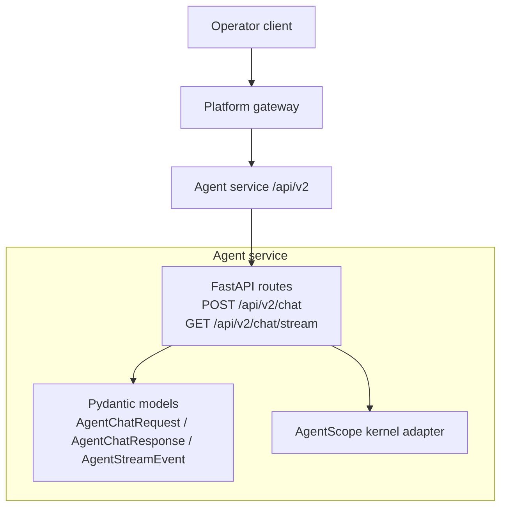
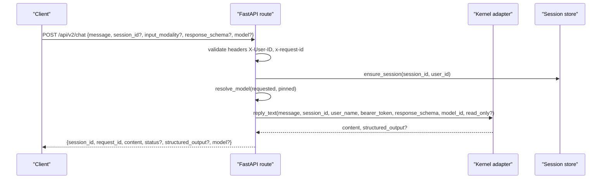
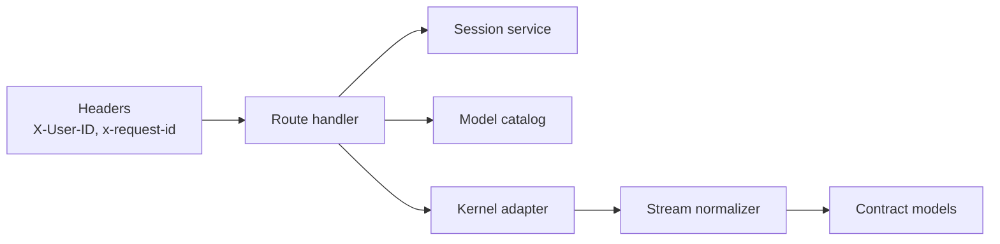

# Chat Request and Response Schemas

<cite>
**Referenced Files in This Document**
- [agent-chat-request.schema.json](file://shared/shared-contracts/schemas/agent-chat-request.schema.json)
- [agent-chat-response.schema.json](file://shared/shared-contracts/schemas/agent-chat-response.schema.json)
- [chat-request.schema.json](file://shared/shared-contracts/schemas/chat-request.schema.json)
- [chat-response.schema.json](file://shared/shared-contracts/schemas/chat-response.schema.json)
- [agent-stream-event.schema.json](file://shared/shared-contracts/schemas/agent-stream-event.schema.json)
- [v2.py](file://products/agent-platform/src/agent_service/schemas/v2.py)
- [routes.py](file://products/agent-platform/src/agent_service/api/v2/routes.py)
- [api.py](file://products/agent-platform/src/agent_service/schemas/api.py)
- [spec.md](file://docs/specs/SPEC-002-agent-service-contract/spec.md)
</cite>

## Table of Contents
1. Introduction
2. Project Structure
3. Core Components
4. Architecture Overview
5. Detailed Component Analysis
6. Dependency Analysis
7. Performance Considerations
8. Troubleshooting Guide
9. Conclusion

## Introduction
This document defines the operator-to-agent communication contract for chat interactions, focusing on the v2 schemas that power POST /api/v2/chat and GET /api/v2/chat/stream. It explains request fields (message, session_id, input_modality, response_schema, model), response envelopes (content, structured_output, status, model), streaming events (tool calls, results, confirmations, errors), and authentication headers (X-User-ID, x-request-id). It also clarifies how v2 relates to the legacy v1 chat schemas and provides guidance for building clients that support both synchronous and streaming flows.

## Project Structure
The chat contract is defined as JSON Schema files under shared/shared-contracts/schemas and implemented by Pydantic models and FastAPI routes in agent-platform. The gateway forwards identity via headers and delegates to this contract.

**Diagram sources**
- [routes.py:276-365](file://products/agent-platform/src/agent_service/api/v2/routes.py#L276-L365)
- [v2.py:37-186](file://products/agent-platform/src/agent_service/schemas/v2.py#L37-L186)

**Section sources**
- [spec.md:27-47](file://docs/specs/SPEC-002-agent-service-contract/spec.md#L27-L47)
- [routes.py:1-9](file://products/agent-platform/src/agent_service/api/v2/routes.py#L1-L9)

## Core Components
- Agent chat request (v2): message, optional session_id, input_modality, optional response_schema, optional model. Identity comes from headers.
- Agent chat response (v2): session_id, request_id, content, optional status, optional structured_output, optional model.
- Streaming events (v11): typed frames carrying deltas, tool invocations, confirmation requests/results, errors, and per-frame metadata such as model and evidence.

Key behaviors:
- Session management via session_id; omit to start a new session.
- Input modality is metadata only and never changes policy or HITL outcomes.
- Model selection follows request > session-pinned > deploy-time default; unknown ids are refused with 4xx.
- Structured output validation is requested via response_schema and returned when present.

**Section sources**
- [agent-chat-request.schema.json:1-35](file://shared/shared-contracts/schemas/agent-chat-request.schema.json#L1-L35)
- [agent-chat-response.schema.json:1-35](file://shared/shared-contracts/schemas/agent-chat-response.schema.json#L1-L35)
- [agent-stream-event.schema.json:1-160](file://shared/shared-contracts/schemas/agent-stream-event.schema.json#L1-L160)
- [v2.py:37-186](file://products/agent-platform/src/agent_service/schemas/v2.py#L37-L186)
- [routes.py:246-270](file://products/agent-platform/src/agent_service/api/v2/routes.py#L246-L270)

## Architecture Overview
The v2 chat surface is the single platform-owned boundary. Clients send a chat request or open a stream; the route validates inputs, resolves identity from headers, manages sessions, resolves the model, and either returns a final response or streams SSE frames.

**Diagram sources**
- [routes.py:276-317](file://products/agent-platform/src/agent_service/api/v2/routes.py#L276-L317)
- [routes.py:246-270](file://products/agent-platform/src/agent_service/api/v2/routes.py#L246-L270)
- [v2.py:37-94](file://products/agent-platform/src/agent_service/schemas/v2.py#L37-L94)

## Detailed Component Analysis

### Agent Chat Request (v2)
- message: required non-empty string prompt.
- session_id: optional string to continue an existing conversation; omitted to start a new session.
- input_modality: enum text|voice, default text; metadata only, no effect on policy or HITL.
- response_schema: optional JSON schema dict passed through to the kernel for structured output validation.
- model: optional model id from GET /api/v2/models; resolution order is request model > session-pinned model > deploy-time default; unknown ids are refused with 4xx.

Implementation notes:
- Pydantic model enforces types and constraints.
- Route extracts identity from X-User-ID and correlation id from x-request-id.
- Model resolution is centralized and fail-closed.

**Section sources**
- [agent-chat-request.schema.json:1-35](file://shared/shared-contracts/schemas/agent-chat-request.schema.json#L1-L35)
- [v2.py:37-73](file://products/agent-platform/src/agent_service/schemas/v2.py#L37-L73)
- [routes.py:276-317](file://products/agent-platform/src/agent_service/api/v2/routes.py#L276-L317)
- [routes.py:246-270](file://products/agent-platform/src/agent_service/api/v2/routes.py#L246-L270)

### Agent Chat Response (v2)
- session_id: echoed session identifier.
- request_id: correlation id from the request header or fallback.
- content: agent reply text replacing the legacy v1 response field.
- status: ok|partial|error, default ok.
- structured_output: validated object when response_schema was provided; null otherwise.
- model: resolved model id for the turn; null when none configured.

**Section sources**
- [agent-chat-response.schema.json:1-35](file://shared/shared-contracts/schemas/agent-chat-response.schema.json#L1-L35)
- [v2.py:76-94](file://products/agent-platform/src/agent_service/schemas/v2.py#L76-L94)
- [routes.py:276-317](file://products/agent-platform/src/agent_service/api/v2/routes.py#L276-L317)

### Streaming Events (v11)
Streaming uses Server-Sent Events with typed frames:
- message_start/message_delta/message_end: incremental text delivery and terminal metadata.
- tool_call/tool_result: evidence panel frames with call_id, tool_name, parameters, status, evidence, data_summary, and optional full data within size caps.
- confirmation_request/confirmation_result: HITL parking and resolution frames with confirm_id, pending_calls, approval_kind, flow_summary, and status.
- error: error details with code and message.
- model: present on message_end frames to attribute the serving model.

Normalization ensures only allowed fields pass through and unknown values degrade safely.

**Section sources**
- [agent-stream-event.schema.json:1-160](file://shared/shared-contracts/schemas/agent-stream-event.schema.json#L1-L160)
- [v2.py:112-186](file://products/agent-platform/src/agent_service/schemas/v2.py#L112-L186)
- [routes.py:320-365](file://products/agent-platform/src/agent_service/api/v2/routes.py#L320-L365)
- [routes.py:598-727](file://products/agent-platform/src/agent_service/api/v2/routes.py#L598-L727)

### Authentication and Headers
- X-User-ID: required header conveying operator identity; missing yields 401.
- x-request-id: optional correlation header; defaults to untracked if absent.
- Authorization: Bearer token forwarded opaquely to the kernel for tool calls; not inspected by the platform layer.

These conventions are enforced at the route layer and documented alongside the schemas.

**Section sources**
- [routes.py:144-157](file://products/agent-platform/src/agent_service/api/v2/routes.py#L144-L157)
- [routes.py:276-317](file://products/agent-platform/src/agent_service/api/v2/routes.py#L276-L317)
- [routes.py:320-365](file://products/agent-platform/src/agent_service/api/v2/routes.py#L320-L365)
- [spec.md:27-47](file://docs/specs/SPEC-002-agent-service-contract/spec.md#L27-L47)

### Relationship Between v1 and v2 Schemas
- v1 chat schemas use a response envelope with a response field and carry user_id/request_id in the body.
- v2 simplifies the response envelope to content and moves identity into headers (X-User-ID, x-request-id).
- v2 introduces structured output via response_schema and richer streaming events for tool execution and HITL bridging.
- The platform-owned contract lives under /api/v2 and is the stable boundary; v1 is transitional and being retired.

**Section sources**
- [chat-request.schema.json:1-38](file://shared/shared-contracts/schemas/chat-request.schema.json#L1-L38)
- [chat-response.schema.json:1-26](file://shared/shared-contracts/schemas/chat-response.schema.json#L1-L26)
- [agent-chat-request.schema.json:1-35](file://shared/shared-contracts/schemas/agent-chat-request.schema.json#L1-L35)
- [agent-chat-response.schema.json:1-35](file://shared/shared-contracts/schemas/agent-chat-response.schema.json#L1-L35)
- [api.py:36-47](file://products/agent-platform/src/agent_service/schemas/api.py#L36-L47)
- [spec.md:27-47](file://docs/specs/SPEC-002-agent-service-contract/spec.md#L27-L47)

### Example Requests and Responses
Below are example payloads conforming to the schemas. Replace placeholders with real values.

- Synchronous chat request (v2)
  - URL: POST /api/v2/chat
  - Headers: X-User-ID: "<operator-id>", x-request-id: "<correlation-id>"
  - Body:
    - message: "Restart pod app-1 in namespace default."
    - session_id: "<optional-session-id>"
    - input_modality: "text"
    - response_schema: {"type":"object","properties":{"action":{"type":"string"}},"required":["action"]}
    - model: "<model-id-from-/api/v2/models>"

- Synchronous chat response (v2)
  - Status: 200
  - Body:
    - session_id: "<session-id>"
    - request_id: "<correlation-id>"
    - content: "Pod restarted successfully."
    - status: "ok"
    - structured_output: {"action":"restart"}
    - model: "<resolved-model-id>"

- Streaming chat request (v2)
  - URL: GET /api/v2/chat/stream?message=...&session_id=...&input_modality=text&model=<id>
  - Headers: X-User-ID: "<operator-id>", x-request-id: "<correlation-id>"
  - Events: message_start, message_delta..., message_end, optional tool_call/tool_result, optional confirmation_request/confirmation_result, optional error.

- Confirmation request event (stream)
  - type: "confirmation_request"
  - confirm_id: "<confirm-id>"
  - pending_calls: [{"call_id":"...","tool_name":"...","parameters":{...},"risk_level":"write","action":"tools:mutate"}]
  - approval_kind: "flow" or "action"
  - flow_summary: {"skill_id":"...","origin":"...","title":"...","description":"...","flow_intent":"...","risk_class":"..."}

- Confirmation result event (stream)
  - type: "confirmation_result"
  - confirm_id: "<confirm-id>"
  - status: "approved" | "denied" | "expired" | "interrupted"

[No sources needed since these examples illustrate schema usage without quoting source lines]

### Implementing Clients: Synchronous and Streaming
- Synchronous clients:
  - Send POST /api/v2/chat with required headers and a valid message.
  - Handle structured_output when response_schema was provided.
  - Respect status and model fields for downstream telemetry.

- Streaming clients:
  - Open GET /api/v2/chat/stream with query parameters mirroring the request body fields.
  - Process message_delta frames to render incremental text.
  - Render tool_call/tool_result frames for evidence panels.
  - Present confirmation_request frames to operators and submit decisions via the confirm endpoint.
  - Treat error frames as terminal failures for the current turn.

- Error handling:
  - 401 when X-User-ID is missing.
  - 409 when a parked confirmation blocks a new turn until resolved.
  - 410 when a confirmation has expired.
  - 422 for unknown model ids or invalid request shapes.

**Section sources**
- [routes.py:276-317](file://products/agent-platform/src/agent_service/api/v2/routes.py#L276-L317)
- [routes.py:320-365](file://products/agent-platform/src/agent_service/api/v2/routes.py#L320-L365)
- [routes.py:368-464](file://products/agent-platform/src/agent_service/api/v2/routes.py#L368-L464)
- [routes.py:202-243](file://products/agent-platform/src/agent_service/api/v2/routes.py#L202-L243)
- [routes.py:246-270](file://products/agent-platform/src/agent_service/api/v2/routes.py#L246-L270)

## Dependency Analysis
The v2 chat endpoints depend on:
- Header extraction for identity and correlation.
- Session service for ensuring and pinning sessions and models.
- Model catalog for resolving model ids.
- Kernel adapter for executing turns and streaming events.
- Event normalization to enforce the stream schema.

**Diagram sources**
- [routes.py:144-157](file://products/agent-platform/src/agent_service/api/v2/routes.py#L144-L157)
- [routes.py:276-365](file://products/agent-platform/src/agent_service/api/v2/routes.py#L276-L365)
- [routes.py:598-727](file://products/agent-platform/src/agent_service/api/v2/routes.py#L598-L727)
- [v2.py:37-186](file://products/agent-platform/src/agent_service/schemas/v2.py#L37-L186)

**Section sources**
- [routes.py:276-365](file://products/agent-platform/src/agent_service/api/v2/routes.py#L276-L365)
- [routes.py:598-727](file://products/agent-platform/src/agent_service/api/v2/routes.py#L598-L727)
- [v2.py:37-186](file://products/agent-platform/src/agent_service/schemas/v2.py#L37-L186)

## Performance Considerations
- Streaming reduces time-to-first-byte by delivering deltas incrementally.
- Tool result data is size-capped in the stream to avoid oversized frames.
- Model resolution happens once per turn and is cached in session pins to minimize repeated lookups.
- Unknown model ids fail early to prevent unnecessary work.

[No sources needed since this section provides general guidance]

## Troubleshooting Guide
Common issues and resolutions:
- Missing X-User-ID: ensure the header is set; the route returns 401 without it.
- Parked confirmation blocking new turns: answer or expire the parked confirmation before sending another message; expect 409 until resolved.
- Expired confirmation: re-initiate the interaction; expect 410 for expired confirmations.
- Unknown model id: verify the model exists in GET /api/v2/models; unknown ids return 422.
- Streaming anomalies: check event type and normalize unknown events to message_delta; inspect error frames for codes and messages.

**Section sources**
- [routes.py:144-157](file://products/agent-platform/src/agent_service/api/v2/routes.py#L144-L157)
- [routes.py:202-243](file://products/agent-platform/src/agent_service/api/v2/routes.py#L202-L243)
- [routes.py:368-464](file://products/agent-platform/src/agent_service/api/v2/routes.py#L368-L464)
- [routes.py:246-270](file://products/agent-platform/src/agent_service/api/v2/routes.py#L246-L270)
- [routes.py:598-653](file://products/agent-platform/src/agent_service/api/v2/routes.py#L598-L653)

## Conclusion
The v2 chat contract provides a clear, versioned boundary for operator-to-agent communication. It standardizes request/response envelopes, supports structured outputs, and exposes rich streaming events for tool execution and human-in-the-loop approvals. Clients should implement both synchronous and streaming paths, honor header-based identity, and handle parked confirmations and model resolution according to the documented rules.

[No sources needed since this section summarizes without analyzing specific files]