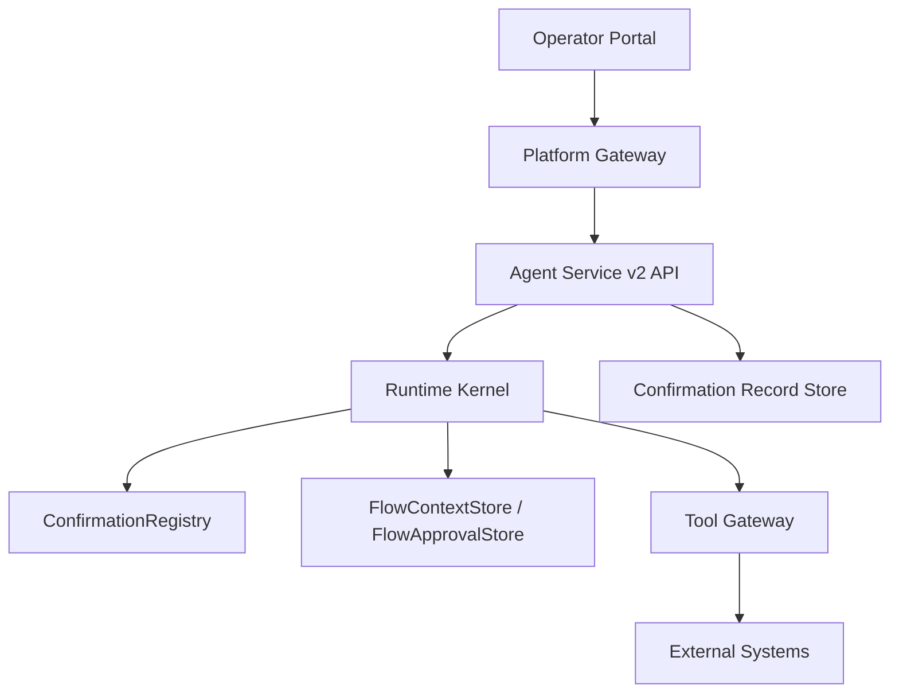
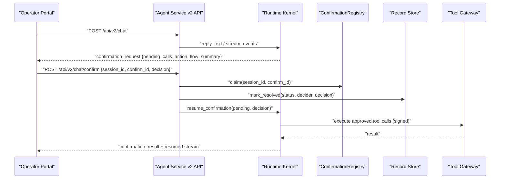
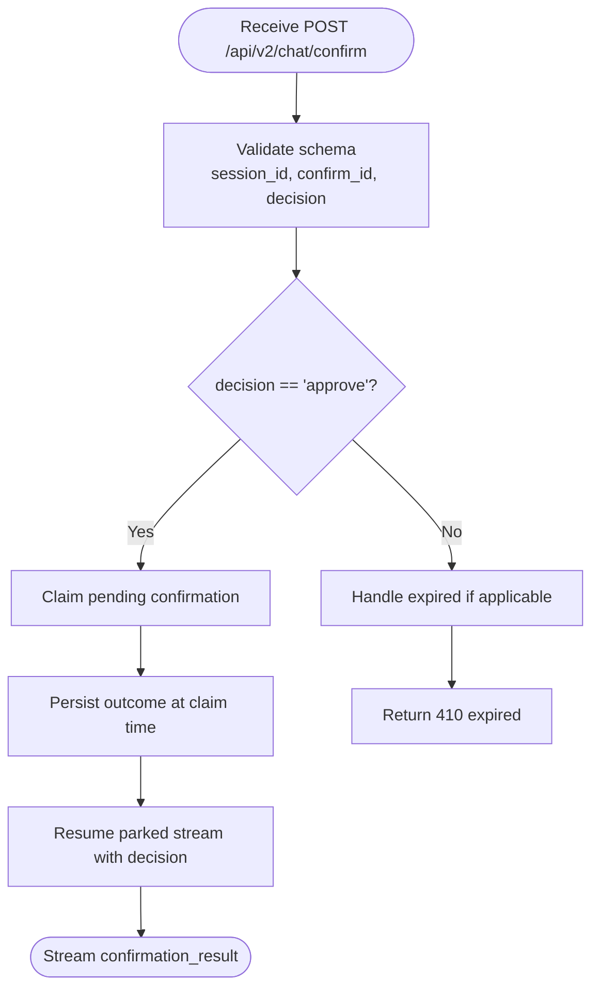
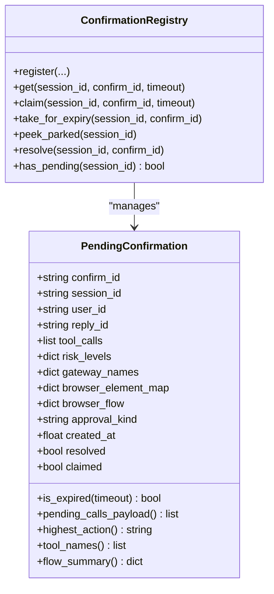
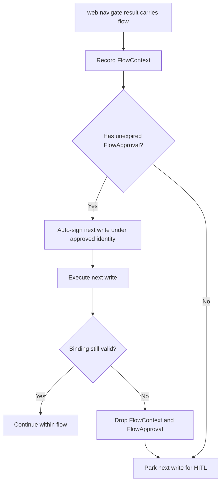
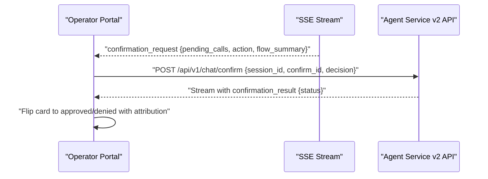
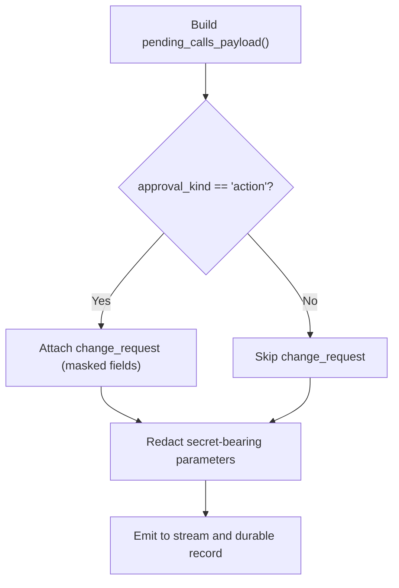
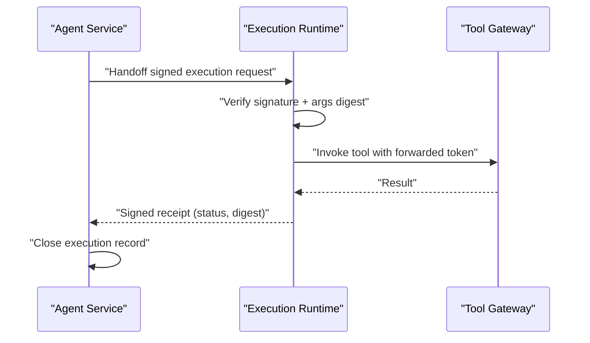
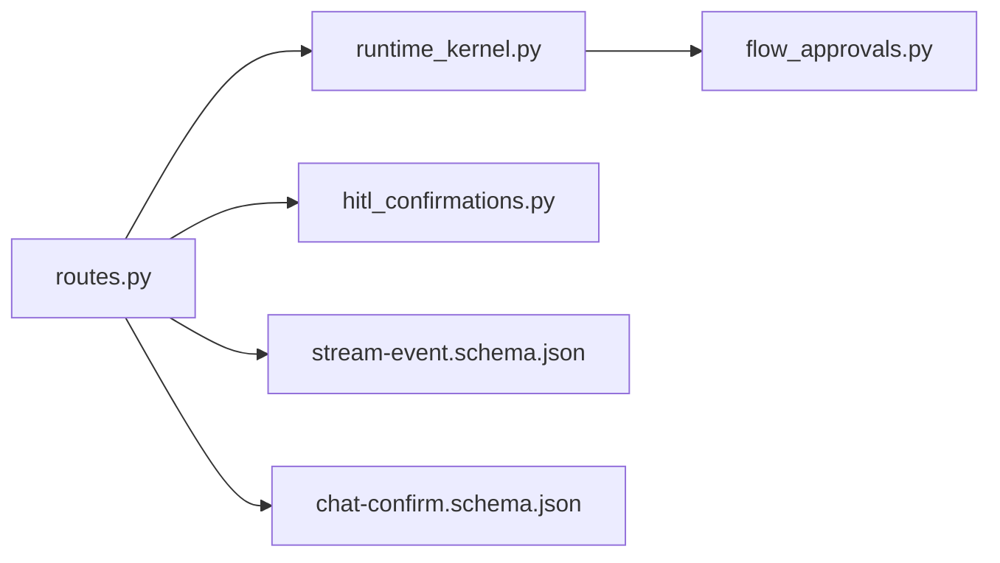

# Confirmation Workflow Schemas

<cite>
**Referenced Files in This Document**
- [chat-confirm.schema.json](file://shared/shared-contracts/schemas/chat-confirm.schema.json)
- [hitl_confirmations.py](file://products/agent-platform/src/agent_service/services/hitl_confirmations.py)
- [flow_approvals.py](file://products/agent-platform/src/agent_service/services/flow_approvals.py)
- [routes.py](file://products/agent-platform/src/agent_service/api/v2/routes.py)
- [runtime_kernel.py](file://products/agent-platform/src/agent_service/runtime_kernel.py)
- [stream-event.schema.json](file://shared/shared-contracts/schemas/stream-event.schema.json)
- [approval-and-hitl.md](file://docs/guides/approval-and-hitl.md)
- [ApprovalsView.tsx](file://products/operator-portal/web-ui/app/src/views/control/ApprovalsView.tsx)
- [useChatStream.ts](file://products/operator-portal/web-ui/app/src/stream/useChatStream.ts)
- [ConfirmationCard.test.tsx](file://products/operator-portal/web-ui/app/src/chat/__tests__/ConfirmationCard.test.tsx)
- [test_contract_adapter.py](file://products/agent-platform/tests/test_contract_adapter.py)
- [test_confirmation_records.py](file://products/agent-platform/tests/test_confirmation_records.py)
</cite>

## Table of Contents
1. Introduction
2. Project Structure
3. Core Components
4. Architecture Overview
5. Detailed Component Analysis
6. Dependency Analysis
7. Performance Considerations
8. Troubleshooting Guide
9. Conclusion
10. Appendices

## Introduction
This document describes the confirmation workflow schemas and human-in-the-loop approval processes used to gate mutating or sensitive tool invocations. It focuses on the chat-confirm schema, how confirmations are triggered by tool invocations, the structure of confirmation cards shown to operators, the decision lifecycle from creation through execution or rejection, and examples such as browser automation actions and mutating operations. It also provides implementation guidance for timeouts, race handling, and maintaining consistency between confirmation state and actual execution outcomes.

## Project Structure
The confirmation workflow spans several components:
- Shared JSON schemas define the contract for confirmation requests and stream events.
- The agent platform kernel parks tool calls when a permission decision requires user confirmation and emits a confirmation_request frame.
- The operator portal surfaces confirmation cards and sends decisions back via POST /api/v2/chat/confirm.
- A per-process registry tracks pending confirmations with single-flight claim semantics and TTL expiry.
- Browser flow context and approvals enable bounded multi-step browser automation under a single approval.
- Durable records persist parked and resolved confirmations for auditability and inbox rendering.

**Diagram sources**
- [routes.py:368-464](file://products/agent-platform/src/agent_service/api/v2/routes.py#L368-L464)
- [runtime_kernel.py:1098-1279](file://products/agent-platform/src/agent_service/runtime_kernel.py#L1098-L1279)
- [hitl_confirmations.py:452-595](file://products/agent-platform/src/agent_service/services/hitl_confirmations.py#L452-L595)
- [flow_approvals.py:124-274](file://products/agent-platform/src/agent_service/services/flow_approvals.py#L124-L274)

**Section sources**
- [approval-and-hitl.md:1-469](file://docs/guides/approval-and-hitl.md#L1-L469)

## Core Components
- Chat-confirm request schema: defines session_id, confirm_id, and decision (approve/deny). Identity is conveyed via headers, never in the body.
- PendingConfirmation: holds parked tool calls, risk levels, gateway names, browser element hints, flow summary, approval kind, timestamps, and single-flight flags.
- ConfirmationRegistry: per-process map keyed by session_id with claim, get, resolve, and expiry helpers; enforces exactly-once resolution and TTL behavior.
- FlowContextStore and FlowApprovalStore: track browser flow binding and short-lived authority to auto-sign subsequent writes within the same flow identity and TTL window.
- Stream event normalization: ensures confirmation_request frames carry pending_calls, flow_summary, approval_kind, and other fields conforming to the stream schema.

**Section sources**
- [chat-confirm.schema.json:1-27](file://shared/shared-contracts/schemas/chat-confirm.schema.json#L1-L27)
- [hitl_confirmations.py:47-181](file://products/agent-platform/src/agent_service/services/hitl_confirmations.py#L47-L181)
- [hitl_confirmations.py:452-595](file://products/agent-platform/src/agent_service/services/hitl_confirmations.py#L452-L595)
- [flow_approvals.py:78-165](file://products/agent-platform/src/agent_service/services/flow_approvals.py#L78-L165)
- [flow_approvals.py:167-274](file://products/agent-platform/src/agent_service/services/flow_approvals.py#L167-L274)
- [routes.py:598-728](file://products/agent-platform/src/agent_service/api/v2/routes.py#L598-L728)

## Architecture Overview
The confirmation workflow follows a clear sequence:
1. A tool invocation triggers a permission decision that requires user confirmation.
2. The runtime kernel parks the reply and emits a confirmation_request frame with pending calls, risk/action metadata, and optional flow headline.
3. The operator portal renders a confirmation card and waits for an approve/deny decision.
4. The operator submits a POST /api/v2/chat/confirm with session_id, confirm_id, and decision.
5. The agent service claims the pending confirmation, persists the outcome at claim time, and resumes the parked stream with the decision.
6. For approved mutating calls, signed execution envelopes are constructed and executed in isolation; receipts close the durable record.

**Diagram sources**
- [runtime_kernel.py:1098-1279](file://products/agent-platform/src/agent_service/runtime_kernel.py#L1098-L1279)
- [routes.py:368-464](file://products/agent-platform/src/agent_service/api/v2/routes.py#L368-L464)
- [hitl_confirmations.py:452-595](file://products/agent-platform/src/agent_service/services/hitl_confirmations.py#L452-L595)

**Section sources**
- [approval-and-hitl.md:1-469](file://docs/guides/approval-and-hitl.md#L1-L469)

## Detailed Component Analysis

### Chat-confirm Request Schema
- Required fields: session_id, confirm_id, decision.
- Decision values: approve, deny.
- Identity is provided via headers; no user identity in the body.
- Validated by tests against the shared schema.

**Diagram sources**
- [chat-confirm.schema.json:1-27](file://shared/shared-contracts/schemas/chat-confirm.schema.json#L1-L27)
- [routes.py:368-464](file://products/agent-platform/src/agent_service/api/v2/routes.py#L368-L464)

**Section sources**
- [chat-confirm.schema.json:1-27](file://shared/shared-contracts/schemas/chat-confirm.schema.json#L1-L27)
- [test_contract_adapter.py:649-664](file://products/agent-platform/tests/test_contract_adapter.py#L649-L664)

### Pending Confirmation and Registry
- PendingConfirmation stores parked tool calls, sanitized tool names, risk levels, gateway canonical names, browser element maps, flow summaries, approval kind, timestamps, and single-flight flags.
- ConfirmationRegistry enforces:
  - One pending confirmation per session.
  - Single-flight claim to prevent double-resume.
  - TTL-based expiration with explicit closure via expire_confirmation.
  - Resolution removes the entry after completion.

**Diagram sources**
- [hitl_confirmations.py:47-181](file://products/agent-platform/src/agent_service/services/hitl_confirmations.py#L47-L181)
- [hitl_confirmations.py:452-595](file://products/agent-platform/src/agent_service/services/hitl_confirmations.py#L452-L595)

**Section sources**
- [hitl_confirmations.py:47-181](file://products/agent-platform/src/agent_service/services/hitl_confirmations.py#L47-L181)
- [hitl_confirmations.py:452-595](file://products/agent-platform/src/agent_service/services/hitl_confirmations.py#L452-L595)

### Browser Flow Context and Approvals
- FlowContextStore reflects the gateway-owned browser flow binding per session, capturing skill_id, origin, title, description, flow_intent, risk_class, and step budget.
- FlowApprovalStore records a short-lived authority to auto-sign subsequent browser write calls within the same flow identity until TTL expires or the binding is invalidated.
- BROWSER_WRITE_TOOLS includes web.click, web.type, web.select, web.press_key, web.upload_file, and web.evaluate.
- FLOW_KILLING_ERROR_CODES end the bound flow and drop both stores to prevent stale authority.

**Diagram sources**
- [flow_approvals.py:41-76](file://products/agent-platform/src/agent_service/services/flow_approvals.py#L41-L76)
- [flow_approvals.py:78-165](file://products/agent-platform/src/agent_service/services/flow_approvals.py#L78-L165)
- [flow_approvals.py:167-274](file://products/agent-platform/src/agent_service/services/flow_approvals.py#L167-L274)

**Section sources**
- [flow_approvals.py:41-76](file://products/agent-platform/src/agent_service/services/flow_approvals.py#L41-L76)
- [flow_approvals.py:78-165](file://products/agent-platform/src/agent_service/services/flow_approvals.py#L78-L165)
- [flow_approvals.py:167-274](file://products/agent-platform/src/agent_service/services/flow_approvals.py#L167-L274)

### Confirmation Cards and Operator UI
- The operator portal streams confirmation_request frames and renders cards with pending calls, risk/action badges, and optional flow headline.
- Decisions are sent via POST /api/v1/chat/confirm (proxied) or directly to the agent service v2 endpoint depending on integration; the response stream yields confirmation_result to update the card.
- Tests assert tier-based badges and read-only rendering for non-deciders.

**Diagram sources**
- [routes.py:598-728](file://products/agent-platform/src/agent_service/api/v2/routes.py#L598-L728)
- [ApprovalsView.tsx:156-192](file://products/operator-portal/web-ui/app/src/views/control/ApprovalsView.tsx#L156-L192)
- [useChatStream.ts:24-51](file://products/operator-portal/web-ui/app/src/stream/useChatStream.ts#L24-L51)

**Section sources**
- [ConfirmationCard.test.tsx:55-78](file://products/operator-portal/web-ui/app/src/chat/__tests__/ConfirmationCard.test.tsx#L55-L78)
- [ApprovalsView.tsx:156-192](file://products/operator-portal/web-ui/app/src/views/control/ApprovalsView.tsx#L156-L192)
- [useChatStream.ts:24-51](file://products/operator-portal/web-ui/app/src/stream/useChatStream.ts#L24-L51)

### Change Requests and Parameter Masking
- For action-type cards, each parked call can include a change_request projection showing a human-readable effect sentence and masked fields.
- Curated formatters exist for k8s.delete_pod and web.* tools; generic fallback uses label->value rows with masking.
- Secret-bearing parameters are redacted in the payload that feeds both the live frame and durable record while preserving the signed args_digest path.

**Diagram sources**
- [hitl_confirmations.py:98-145](file://products/agent-platform/src/agent_service/services/hitl_confirmations.py#L98-L145)
- [hitl_confirmations.py:195-359](file://products/agent-platform/src/agent_service/services/hitl_confirmations.py#L195-L359)
- [hitl_confirmations.py:379-409](file://products/agent-platform/src/agent_service/services/hitl_confirmations.py#L379-L409)

**Section sources**
- [hitl_confirmations.py:98-145](file://products/agent-platform/src/agent_service/services/hitl_confirmations.py#L98-L145)
- [hitl_confirmations.py:195-359](file://products/agent-platform/src/agent_service/services/hitl_confirmations.py#L195-L359)
- [hitl_confirmations.py:379-409](file://products/agent-platform/src/agent_service/services/hitl_confirmations.py#L379-L409)

### Execution Envelopes and Receipts
- Approved mutating calls construct signed execution requests before invocation; missing signing keys fail closed.
- The isolated execution worker re-verifies signatures and arguments digest, executes the tool-gateway call, and returns results.
- Signed receipts close execution records; audit events correlate confirmation_decided → execution_requested → tool_invoked → execution_completed.

**Diagram sources**
- [approval-and-hitl.md:290-379](file://docs/guides/approval-and-hitl.md#L290-L379)

**Section sources**
- [approval-and-hitl.md:290-379](file://docs/guides/approval-and-hitl.md#L290-L379)

## Dependency Analysis
Key dependencies and relationships:
- routes.py depends on runtime_kernel.py for streaming and resuming confirmations, and on hitl_confirmations.py for registry access and redaction.
- runtime_kernel.py builds confirmation frames using PendingConfirmation and FlowContext/FlowApproval stores.
- flow_approvals.py maintains per-session flow state and approvals, gated by BROWSER_WRITE_TOOLS and FLOW_KILLING_ERROR_CODES.
- Stream event normalization ensures schema compliance for confirmation_request frames.

**Diagram sources**
- [routes.py:368-464](file://products/agent-platform/src/agent_service/api/v2/routes.py#L368-L464)
- [runtime_kernel.py:1098-1279](file://products/agent-platform/src/agent_service/runtime_kernel.py#L1098-L1279)
- [flow_approvals.py:41-76](file://products/agent-platform/src/agent_service/services/flow_approvals.py#L41-L76)
- [stream-event.schema.json:1-27](file://shared/shared-contracts/schemas/stream-event.schema.json#L1-L27)
- [chat-confirm.schema.json:1-27](file://shared/shared-contracts/schemas/chat-confirm.schema.json#L1-L27)

**Section sources**
- [routes.py:368-464](file://products/agent-platform/src/agent_service/api/v2/routes.py#L368-L464)
- [runtime_kernel.py:1098-1279](file://products/agent-platform/src/agent_service/runtime_kernel.py#L1098-L1279)
- [flow_approvals.py:41-76](file://products/agent-platform/src/agent_service/services/flow_approvals.py#L41-L76)

## Performance Considerations
- In-memory registries and stores are per-process; they do not survive restarts, ensuring safe failure modes where parked states are lost and must be re-parked.
- Single-flight claim prevents duplicate resume work and reduces contention during concurrent approvals.
- Redaction runs once on the payload feeding both stream and durable record paths to avoid redundant processing.
- Flow approvals are TTL-bounded to limit the window of auto-signed writes and reduce long-lived state.

[No sources needed since this section provides general guidance]

## Troubleshooting Guide
Common issues and resolutions:
- Already resolved confirmation: racing approvers receive a structured 409 with winner’s outcome; the portal flips the loser’s card accordingly.
- Expired confirmation: attempts return 410; the kernel closes the parked reply via expire_confirmation so the session can proceed.
- Unknown confirm id: returns 404 to preserve anti-enumeration posture.
- Missing signing key or worker unavailable: approved mutating resumes fail closed with audited rejections; no unsigned execution occurs.
- Flow binding invalidation: gateway refusal codes drop flow context and approval, forcing re-park for the next write.

**Section sources**
- [routes.py:368-464](file://products/agent-platform/src/agent_service/api/v2/routes.py#L368-L464)
- [test_confirmation_records.py:629-712](file://products/agent-platform/tests/test_confirmation_records.py#L629-L712)
- [approval-and-hitl.md:282-379](file://docs/guides/approval-and-hitl.md#L282-L379)

## Conclusion
The confirmation workflow enforces a robust, auditable human-in-the-loop gate for sensitive operations. It combines schema-driven contracts, per-process registries with single-flight semantics, browser flow scoping, signed execution envelopes, and durable records to ensure consistent, traceable outcomes. Operators see clear cards with masked details and contextual headlines, while the system guarantees exactly-once resolution, safe timeouts, and strict separation between decision and execution.

[No sources needed since this section summarizes without analyzing specific files]

## Appendices

### Common Confirmation Scenarios
- Browser automation actions: clicks, typing, selecting, pressing keys, uploading files, evaluating JavaScript, and filling credentials. These may park for approval unless part of an approved flow within TTL.
- Mutating operations: Kubernetes pod deletion and similar write/admin-risk tools require approval and are subject to policy-tier enforcement and signed execution.

**Section sources**
- [hitl_confirmations.py:98-145](file://products/agent-platform/src/agent_service/services/hitl_confirmations.py#L98-L145)
- [flow_approvals.py:41-76](file://products/agent-platform/src/agent_service/services/flow_approvals.py#L41-L76)
- [approval-and-hitl.md:1-469](file://docs/guides/approval-and-hitl.md#L1-L469)

### Implementation Guidance
- Triggering confirmations: rely on the kernel’s ASK permission decision to park replies and emit confirmation_request frames; do not bypass this path.
- Card structure: use pending_calls with tool_name, parameters, risk_level, action, display_hint, and change_request where applicable; include flow_summary for browser flows.
- Decision lifecycle: claim at the start of confirm to enforce single-flight; persist outcome immediately; resume the parked stream with the decision; handle 409 already_resolved for races.
- Timeouts: honor AGENT_HITL_CONFIRM_TIMEOUT; expired confirmations are closed via expire_confirmation; new turns on parked sessions are rejected until resolved.
- Consistency: signed execution envelopes and argument digests ensure executed calls match what was approved; receipts close records and correlate audit events.

**Section sources**
- [routes.py:368-464](file://products/agent-platform/src/agent_service/api/v2/routes.py#L368-L464)
- [runtime_kernel.py:1098-1279](file://products/agent-platform/src/agent_service/runtime_kernel.py#L1098-L1279)
- [hitl_confirmations.py:98-145](file://products/agent-platform/src/agent_service/services/hitl_confirmations.py#L98-L145)
- [approval-and-hitl.md:282-379](file://docs/guides/approval-and-hitl.md#L282-L379)