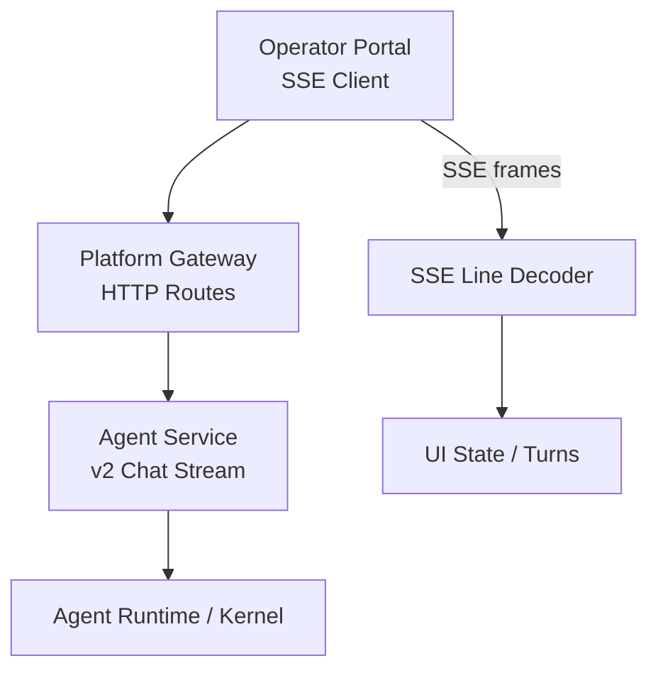
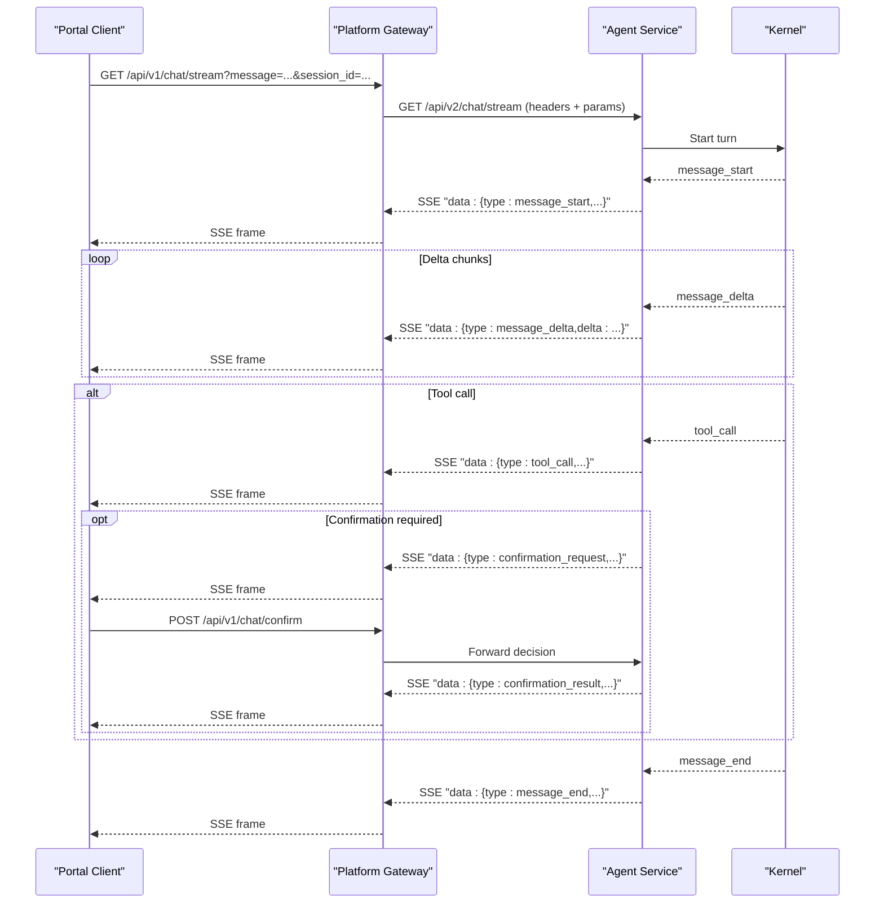
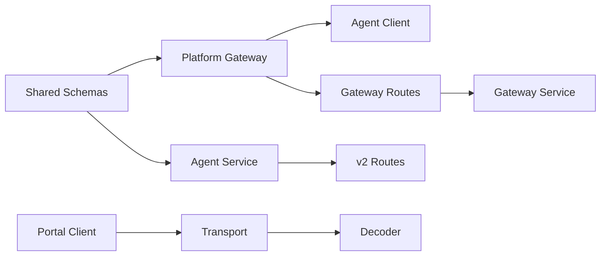

# Streaming Event Schemas

<cite>
**Referenced Files in This Document**
- [stream-event.schema.json](file://shared/shared-contracts/schemas/stream-event.schema.json)
- [agent-stream-event.schema.json](file://shared/shared-contracts/schemas/agent-stream-event.schema.json)
- [chat.py](file://products/platform-gateway/src/platform_gateway/api/routes/chat.py)
- [gateway_service.py](file://products/platform-gateway/src/platform_gateway/services/gateway_service.py)
- [agent_client.py](file://products/platform-gateway/src/platform_gateway/services/agent_client.py)
- [routes.py](file://products/agent-platform/src/agent_service/api/v2/routes.py)
- [transport.ts](file://products/operator-portal/web-ui/app/src/stream/transport.ts)
- [decoder.ts](file://products/operator-portal/web-ui/app/src/stream/decoder.ts)
- [useChatStream.ts](file://products/operator-portal/web-ui/app/src/stream/useChatStream.ts)
- [test_chat_stream_modality.py](file://products/platform-gateway/tests/test_chat_stream_modality.py)
- [transport.test.ts](file://products/operator-portal/web-ui/app/src/stream/__tests__/transport.test.ts)
- [useChatStream.test.ts](file://products/operator-portal/web-ui/app/src/stream/__tests__/useChatStream.test.ts)
</cite>

## Table of Contents
1. [Introduction](#introduction)
2. [Project Structure](#project-structure)
3. [Core Components](#core-components)
4. [Architecture Overview](#architecture-overview)
5. [Detailed Component Analysis](#detailed-component-analysis)
6. [Dependency Analysis](#dependency-analysis)
7. [Performance Considerations](#performance-considerations)
8. [Troubleshooting Guide](#troubleshooting-guide)
9. [Conclusion](#conclusion)
10. [Appendices](#appendices)

## Introduction
This document specifies the streaming event schemas and their runtime behavior for real-time communication between agents and operators. It covers:
- The stream-event schema used for generic chat streaming frames.
- The agent-stream-event schema used by the platform’s SSE surface for operator-facing chat streams, including tool calls, confirmations, evidence, and error frames.
- How the platform gateway relays SSE from the agent service to clients.
- How the operator portal consumes SSE, handles incremental updates, errors, reconnection, and ordering.
- Examples of streaming sequences and guidance on implementing robust SSE clients.

## Project Structure
Streaming is implemented across three layers:
- Shared JSON schemas define the wire format for events.
- The platform gateway exposes HTTP endpoints that proxy SSE from the agent service.
- The operator portal implements an SSE client with a decoder and connection management.

**Diagram sources**
- [chat.py:96-155](file://products/platform-gateway/src/platform_gateway/api/routes/chat.py#L96-L155)
- [agent_client.py:173-222](file://products/platform-gateway/src/platform_gateway/services/agent_client.py#L173-L222)
- [routes.py:1-100](file://products/agent-platform/src/agent_service/api/v2/routes.py#L1-L100)
- [transport.ts:108-164](file://products/operator-portal/web-ui/app/src/stream/transport.ts#L108-L164)
- [decoder.ts:204-250](file://products/operator-portal/web-ui/app/src/stream/decoder.ts#L204-L250)

**Section sources**
- [chat.py:96-155](file://products/platform-gateway/src/platform_gateway/api/routes/chat.py#L96-L155)
- [agent_client.py:173-222](file://products/platform-gateway/src/platform_gateway/services/agent_client.py#L173-L222)
- [routes.py:1-100](file://products/agent-platform/src/agent_service/api/v2/routes.py#L1-L100)
- [transport.ts:108-164](file://products/operator-portal/web-ui/app/src/stream/transport.ts#L108-L164)
- [decoder.ts:204-250](file://products/operator-portal/web-ui/app/src/stream/decoder.ts#L204-L250)

## Core Components
- Stream-event schema: a minimal frame shape for generic streaming messages.
- Agent-stream-event schema: the full operator-facing SSE frame set, including message deltas, tool calls/results, confirmation requests/results, model metadata, and errors.
- Platform gateway routes and services: expose GET /api/v1/chat/stream and POST /api/v1/chat/confirm, propagate identity and policy decisions, and relay SSE lines from the agent service.
- Operator portal SSE client: opens fetch-based SSE connections, decodes frames, and manages turn state, retries, and session recovery.

**Section sources**
- [stream-event.schema.json:1-27](file://shared/shared-contracts/schemas/stream-event.schema.json#L1-L27)
- [agent-stream-event.schema.json:1-160](file://shared/shared-contracts/schemas/agent-stream-event.schema.json#L1-L160)
- [chat.py:96-199](file://products/platform-gateway/src/platform_gateway/api/routes/chat.py#L96-L199)
- [gateway_service.py:1-200](file://products/platform-gateway/src/platform_gateway/services/gateway_service.py#L1-L200)
- [transport.ts:108-164](file://products/operator-portal/web-ui/app/src/stream/transport.ts#L108-L164)
- [decoder.ts:1-251](file://products/operator-portal/web-ui/app/src/stream/decoder.ts#L1-L251)

## Architecture Overview
The streaming path for a user message:
1. The operator portal opens GET /api/v1/chat/stream with query parameters (message, optional session_id, input_modality, model).
2. The platform gateway authenticates, enforces policy, obtains a delegated token, and proxies the request to the agent service’s v2 chat stream.
3. The agent service emits SSE frames per the agent-stream-event schema.
4. The gateway forwards data lines to the client as-is.
5. The portal decoder parses frames into typed events and updates UI state incrementally.

**Diagram sources**
- [chat.py:96-199](file://products/platform-gateway/src/platform_gateway/api/routes/chat.py#L96-L199)
- [agent_client.py:173-222](file://products/platform-gateway/src/platform_gateway/services/agent_client.py#L173-L222)
- [routes.py:1-100](file://products/agent-platform/src/agent_service/api/v2/routes.py#L1-L100)
- [transport.ts:108-164](file://products/operator-portal/web-ui/app/src/stream/transport.ts#L108-L164)
- [decoder.ts:95-202](file://products/operator-portal/web-ui/app/src/stream/decoder.ts#L95-L202)

## Detailed Component Analysis

### Stream-event Schema
- Purpose: Minimal event envelope for generic streaming payloads.
- Required fields: event, request_id, session_id.
- Optional fields: delta, message.
- Event types: message_start, message_delta, message_end, error.

Use this schema when you need a lightweight, versioned envelope for simple streaming scenarios.

**Section sources**
- [stream-event.schema.json:1-27](file://shared/shared-contracts/schemas/stream-event.schema.json#L1-L27)

### Agent-stream-event Schema
- Purpose: Full operator-facing SSE frame payload for GET /api/v1/chat/stream.
- Required fields: type, session_id, request_id.
- Event types: message_start, message_delta, message_end, error, tool_call, tool_result, confirmation_request, confirmation_result.
- Key fields:
  - delta: incremental text chunk on message_delta.
  - message: terminal metadata on message_end and error; also carries kernel permission message on confirmation_request.
  - model: resolved model id on message_end.
  - confirm_id: correlates confirmation_request with confirmation_result and the confirm endpoint call.
  - pending_calls: batch of parked tool calls awaiting confirmation; includes call_id, tool_name, parameters, risk_level, action, display_hint, and change_request projection.
  - approval_kind: declares whether the parked batch is a flow or action.
  - flow_summary: card-level browser-flow headline on confirmation_request frames.
  - tool_name, call_id, parameters: tool invocation context.
  - status: outcome marker on tool_result and confirmation_result.
  - evidence: execution provenance on tool_result.
  - data_summary, data: bounded or full tool result payload depending on size cap.
  - error: structured error details.

This schema drives the operator portal’s live cards, evidence panels, and approval flows.

**Section sources**
- [agent-stream-event.schema.json:1-160](file://shared/shared-contracts/schemas/agent-stream-event.schema.json#L1-L160)

### Platform Gateway Streaming Endpoints
- GET /api/v1/chat/stream:
  - Validates identity and policy.
  - Proxies to agent service GET /api/v2/chat/stream with query parameters for message, session_id, input_modality, and model.
  - Returns a StreamingResponse that relays SSE lines from the agent service.
- POST /api/v1/chat/confirm:
  - Answers a parked kernel confirmation.
  - Returns a StreamingResponse that resumes the SSE stream after the decision is applied.

Error posture:
- Upstream 4xx/5xx are raised before committing the response so clients receive proper HTTP status codes rather than empty SSE streams.

**Section sources**
- [chat.py:96-199](file://products/platform-gateway/src/platform_gateway/api/routes/chat.py#L96-L199)
- [agent_client.py:173-222](file://products/platform-gateway/src/platform_gateway/services/agent_client.py#L173-L222)
- [test_chat_stream_modality.py:201-223](file://products/platform-gateway/tests/test_chat_stream_modality.py#L201-L223)

### Agent Service v2 Streaming Contract
- Exposes v2 routes that adapt HTTP boundaries to the AgentScope kernel without leaking internal types.
- Identity is conveyed via headers (X-User-ID, x-request-id); delegated tokens are forwarded opaquely.
- Streaming responses emit frames consistent with the agent-stream-event schema.

**Section sources**
- [routes.py:1-100](file://products/agent-platform/src/agent_service/api/v2/routes.py#L1-L100)

### Operator Portal SSE Client
- Connection opening:
  - Uses fetch with auth headers and an x-request-id.
  - Throws StreamOpenError on non-OK responses or missing body; preserves parsed detail envelopes for structured errors.
- Decoding:
  - SseLineDecoder buffers raw bytes, splits on “\n\n”, and parses “data: ...” blocks into typed frames.
  - Handles unknown or malformed frames gracefully by skipping them.
- Turn lifecycle:
  - message_start begins a new turn.
  - message_delta appends incremental text.
  - message_end marks completion unless a confirmation is pending.
  - confirmation_request parks tool calls and displays approval cards.
  - confirmation_result applies outcomes and resumes the stream.
- Reconnection and recovery:
  - On 404 during open, the client drops the stale session pointer and retries once with server-side auto-creation.
  - Abort errors (e.g., session switch) settle partial turns without surfacing errors.

**Section sources**
- [transport.ts:108-164](file://products/operator-portal/web-ui/app/src/stream/transport.ts#L108-L164)
- [decoder.ts:1-251](file://products/operator-portal/web-ui/app/src/stream/decoder.ts#L1-L251)
- [useChatStream.ts:276-312](file://products/operator-portal/web-ui/app/src/stream/useChatStream.ts#L276-L312)
- [transport.test.ts:90-130](file://products/operator-portal/web-ui/app/src/stream/__tests__/transport.test.ts#L90-L130)
- [useChatStream.test.ts:640-693](file://products/operator-portal/web-ui/app/src/stream/__tests__/useChatStream.test.ts#L640-L693)

### Streaming Event Sequences

#### Chat-only sequence
- message_start → one or more message_delta → message_end.
- message_end may include model metadata.

#### Tool call sequence
- message_start → tool_call → (optional confirmation_request → confirmation_result) → tool_result → message_end.
- tool_result includes evidence and optionally data_summary or data.

#### Error sequence
- message_start → error (with structured error object).

These sequences are decoded by the portal decoder and mapped to UI state transitions.

**Section sources**
- [decoder.ts:95-202](file://products/operator-portal/web-ui/app/src/stream/decoder.ts#L95-L202)
- [agent-stream-event.schema.json:1-160](file://shared/shared-contracts/schemas/agent-stream-event.schema.json#L1-L160)

### Relationship Between Chat Streaming and Background Event Processing
- Chat streaming surfaces interactive, user-visible events in real time (text deltas, tool calls, confirmations).
- Background processing (e.g., audit emission, evidence persistence, session state updates) occurs alongside streaming but does not block or reorder the SSE frames.
- The gateway logs and emits audit events around stream start and completion without altering the SSE payload.

**Section sources**
- [chat.py:119-145](file://products/platform-gateway/src/platform_gateway/api/routes/chat.py#L119-L145)
- [routes.py:1-100](file://products/agent-platform/src/agent_service/api/v2/routes.py#L1-L100)

### Connection Management and Reconnection Strategies
- Open failures:
  - Non-OK responses throw StreamOpenError with status and optional detail.
  - Missing response body throws StreamOpenError.
- Stale session handling:
  - 404 triggers automatic retry without session_id to allow server-side auto-creation.
- Abort handling:
  - Abort errors (e.g., due to session switch) settle the current turn without error.
- Frame integrity:
  - Decoder skips malformed frames to keep the stream resilient.

**Section sources**
- [transport.ts:108-164](file://products/operator-portal/web-ui/app/src/stream/transport.ts#L108-L164)
- [useChatStream.ts:276-312](file://products/operator-portal/web-ui/app/src/stream/useChatStream.ts#L276-L312)
- [decoder.ts:204-250](file://products/operator-portal/web-ui/app/src/stream/decoder.ts#L204-L250)
- [transport.test.ts:90-130](file://products/operator-portal/web-ui/app/src/stream/__tests__/transport.test.ts#L90-L130)
- [useChatStream.test.ts:640-693](file://products/operator-portal/web-ui/app/src/stream/__tests__/useChatStream.test.ts#L640-L693)

### Event Ordering Guarantees
- Frames are delivered in order over a single SSE connection.
- The decoder emits events only when complete “\n\n”-delimited blocks arrive, preserving line-based framing semantics.
- For background polling (e.g., pending decisions), monotonic refresh sequences prevent stale responses from overwriting newer state.

**Section sources**
- [decoder.ts:227-250](file://products/operator-portal/web-ui/app/src/stream/decoder.ts#L227-L250)
- [useSessionWorkspace.ts:89-123](file://products/operator-portal/web-ui/app/src/sessions/useSessionWorkspace.ts#L89-L123)

## Dependency Analysis

**Diagram sources**
- [stream-event.schema.json:1-27](file://shared/shared-contracts/schemas/stream-event.schema.json#L1-L27)
- [agent-stream-event.schema.json:1-160](file://shared/shared-contracts/schemas/agent-stream-event.schema.json#L1-L160)
- [chat.py:96-199](file://products/platform-gateway/src/platform_gateway/api/routes/chat.py#L96-L199)
- [gateway_service.py:1-200](file://products/platform-gateway/src/platform_gateway/services/gateway_service.py#L1-L200)
- [agent_client.py:173-222](file://products/platform-gateway/src/platform_gateway/services/agent_client.py#L173-L222)
- [routes.py:1-100](file://products/agent-platform/src/agent_service/api/v2/routes.py#L1-L100)
- [transport.ts:108-164](file://products/operator-portal/web-ui/app/src/stream/transport.ts#L108-L164)
- [decoder.ts:1-251](file://products/operator-portal/web-ui/app/src/stream/decoder.ts#L1-L251)

**Section sources**
- [chat.py:96-199](file://products/platform-gateway/src/platform_gateway/api/routes/chat.py#L96-L199)
- [gateway_service.py:1-200](file://products/platform-gateway/src/platform_gateway/services/gateway_service.py#L1-L200)
- [agent_client.py:173-222](file://products/platform-gateway/src/platform_gateway/services/agent_client.py#L173-L222)
- [routes.py:1-100](file://products/agent-platform/src/agent_service/api/v2/routes.py#L1-L100)
- [transport.ts:108-164](file://products/operator-portal/web-ui/app/src/stream/transport.ts#L108-L164)
- [decoder.ts:1-251](file://products/operator-portal/web-ui/app/src/stream/decoder.ts#L1-L251)

## Performance Considerations
- SSE framing uses line-delimited “data: ...” blocks separated by “\n\n”. Clients should buffer and split on these boundaries to avoid unnecessary allocations.
- Tool results may include large payloads; the schema supports both a bounded data_summary and an optional full data field subject to a stream size cap.
- Policy enforcement and audit emissions occur around streaming but do not block frame delivery.

[No sources needed since this section provides general guidance]

## Troubleshooting Guide
Common issues and resolutions:
- Authentication failures:
  - 401 on stream open indicates missing or invalid credentials; prompt sign-in.
- Stale sessions:
  - 404 on stream open triggers automatic retry without session_id to allow server-side creation.
- Already resolved confirmations:
  - 409 with structured detail can indicate a race where another decision was applied; use the detail to update UI accordingly.
- Malformed frames:
  - Decoder skips malformed JSON or non-data blocks to keep the stream alive.
- Upstream errors:
  - Gateway raises HTTP errors for upstream failures instead of returning empty SSE streams.

**Section sources**
- [transport.ts:108-164](file://products/operator-portal/web-ui/app/src/stream/transport.ts#L108-L164)
- [useChatStream.ts:276-312](file://products/operator-portal/web-ui/app/src/stream/useChatStream.ts#L276-L312)
- [transport.test.ts:90-130](file://products/operator-portal/web-ui/app/src/stream/__tests__/transport.test.ts#L90-L130)
- [test_chat_stream_modality.py:201-223](file://products/platform-gateway/tests/test_chat_stream_modality.py#L201-L223)

## Conclusion
The streaming architecture combines strict JSON schemas with a robust SSE transport layer to deliver real-time, incremental updates to operators. The agent-stream-event schema defines a comprehensive frame set covering text deltas, tool executions, approvals, and errors. The platform gateway ensures secure, policy-enforced relaying of frames, while the operator portal implements resilient decoding, incremental rendering, and recovery strategies for connection and session issues. Together, these components provide reliable, ordered, and observable streaming communication between agents and operators.

## Appendices

### SSE Client Implementation Checklist
- Open with auth headers and x-request-id.
- Handle non-OK responses and missing bodies by throwing a typed error.
- Decode frames using a line-based SSE decoder that respects “\n\n” boundaries.
- Update turn state on message_start, append deltas on message_delta, mark completion on message_end unless confirmation_pending.
- Render confirmation_request cards and handle confirmation_result outcomes.
- Retry once on 404 by dropping session_id to enable server-side auto-creation.
- Gracefully handle aborts and malformed frames.

**Section sources**
- [transport.ts:108-164](file://products/operator-portal/web-ui/app/src/stream/transport.ts#L108-L164)
- [decoder.ts:1-251](file://products/operator-portal/web-ui/app/src/stream/decoder.ts#L1-L251)
- [useChatStream.ts:276-312](file://products/operator-portal/web-ui/app/src/stream/useChatStream.ts#L276-L312)