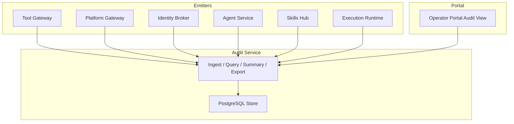
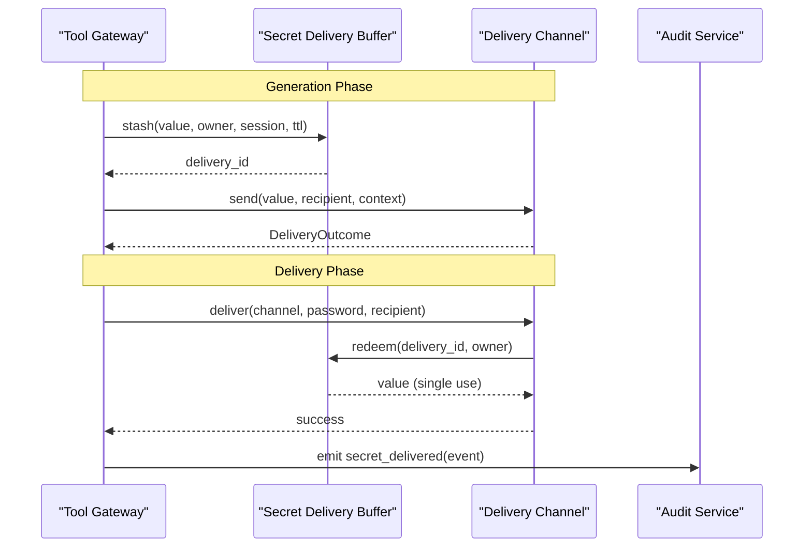
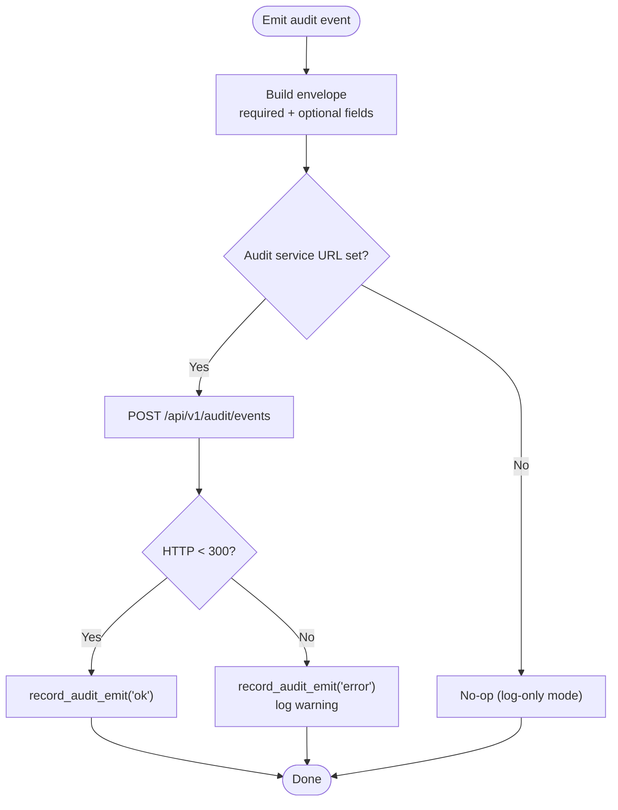
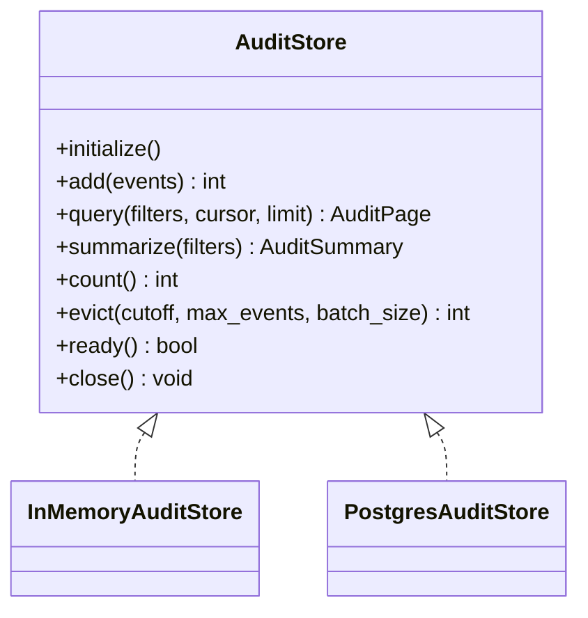
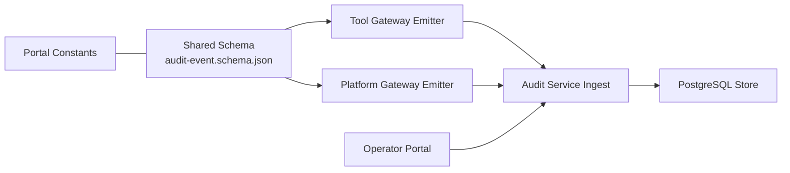

# Audit Event Schema

<cite>
**Referenced Files in This Document**
- [audit-event.schema.json](file://shared/shared-contracts/schemas/audit-event.schema.json)
- [agent-stream-event.schema.json](file://shared/shared-contracts/schemas/agent-stream-event.schema.json)
- [audit-summary.schema.json](file://shared/shared-contracts/schemas/audit-summary.schema.json)
- [SPEC-013-durable-audit-trail/spec.md](file://docs/specs/SPEC-013-durable-audit-trail/spec.md)
- [SPEC-046-audit-reporting-and-export/spec.md](file://docs/specs/SPEC-046-audit-reporting-and-export/spec.md)
- [SPEC-062-secure-password-generation-and-delivery/spec.md](file://docs/specs/SPEC-062-secure-password-generation-and-delivery/spec.md)
- [0012-one-time-secret-delivery-handoff.md](file://docs/adr/0012-one-time-secret-delivery-handoff.md)
- [audit_store.py](file://products/audit-service/src/audit_service/services/audit_store.py)
- [audit_emitter.py (tool-gateway)](file://products/tool-gateway/src/tool_gateway/services/audit_emitter.py)
- [audit_emitter.py (agent-platform)](file://products/agent-platform/src/agent_service/services/audit_emitter.py)
- [gateway_service.py](file://products/platform-gateway/src/platform_gateway/services/gateway_service.py)
- [chat.py](file://products/platform-gateway/src/platform_gateway/api/routes/chat.py)
- [skills.py](file://products/skills-hub/src/skills_hub/api/routes/skills.py)
- [secret_delivery.py](file://products/tool-gateway/src/tool_gateway/tools/secret_delivery.py)
- [secrets_connector.py](file://products/tool-gateway/src/tool_gateway/tools/secrets_connector.py)
- [decoder.ts](file://products/operator-portal/web-ui/app/src/stream/decoder.ts)
- [constants.test.ts](file://products/operator-portal/web-ui/app/src/views/audit/__tests__/constants.test.ts)
- [AuditView.tsx](file://products/operator-portal/web-ui/app/src/views/audit/AuditView.tsx)
</cite>

## Update Summary
**Changes Made**
- Added `secret_delivered` to the audit event taxonomy with full field semantics and provenance requirements
- Documented secret delivery stream frame (v12) integration with audit events
- Enhanced examples to include secret generation and delivery workflows
- Updated privacy considerations to address generated secret handling
- Added new section on secret delivery audit trail covering buffer, channels, and redemption tracking

## Table of Contents
1. Introduction
2. Project Structure
3. Core Components
4. Architecture Overview
5. Detailed Component Analysis
6. Dependency Analysis
7. Performance Considerations
8. Troubleshooting Guide
9. Conclusion
10. Appendices

## Introduction
This document defines the audit event schema and its ecosystem for capturing platform activities, user actions, and system events with full provenance. It specifies required and optional fields, enumerates the event taxonomy, explains the provenance chain across services, and provides examples for chat interactions, approval workflows, skill executions, incident triage activities, and secure secret delivery operations. It also covers data retention policies, privacy considerations for sensitive information including generated secrets, and export capabilities for compliance reporting.

## Project Structure
The audit trail spans multiple products:
- Emitter services (tool-gateway, platform-gateway, identity-broker, agent-service, skills-hub, execution-runtime) produce audit events using a shared contract.
- The audit-service ingests, stores, queries, summarizes, and exports events.
- The operator portal exposes read-only views and CSV export under an existing audit:read policy.



**Diagram sources**
- [audit_store.py:222-324](file://products/audit-service/src/audit_service/services/audit_store.py#L222-L324)
- [audit_emitter.py (tool-gateway):1-98](file://products/tool-gateway/src/tool_gateway/services/audit_emitter.py#L1-L98)
- [audit_emitter.py (agent-platform):1-99](file://products/agent-platform/src/agent_service/services/audit_emitter.py#L1-L99)
- [gateway_service.py:1200-1363](file://products/platform-gateway/src/platform_gateway/services/gateway_service.py#L1200-L1363)
- [chat.py:37-76](file://products/platform-gateway/src/platform_gateway/api/routes/chat.py#L37-L76)
- [skills.py:99-146](file://products/skills-hub/src/skills_hub/api/routes/skills.py#L99-L146)
- [AuditView.tsx:1-69](file://products/operator-portal/web-ui/app/src/views/audit/AuditView.tsx#L1-L69)

**Section sources**
- [SPEC-013-durable-audit-trail/spec.md:1-134](file://docs/specs/SPEC-013-durable-audit-trail/spec.md#L1-L134)
- [SPEC-046-audit-reporting-and-export/spec.md:1-303](file://docs/specs/SPEC-046-audit-reporting-and-export/spec.md#L1-L303)

## Core Components
- Audit event envelope: canonical schema defining required and optional fields, closed vocabulary of event types, and per-event details payload.
- Emitters: fire-and-forget HTTP clients that build envelopes and post them to the audit service without blocking the caller path.
- Audit store: strategy-backed storage (in-memory for dev/test; PostgreSQL for production) with pagination, filtering, summarization, and bounded eviction.
- Reporting: deterministic summary aggregates over envelope columns only and bounded CSV export for compliance.

Key field semantics:
- Required: event_id, occurred_at, event_type, service, request_id, outcome.
- Optional identity/provenance: subject, username, actor, roles, session_id.
- Per-event payload: details (additionalProperties allowed), typed by event type.

Event taxonomy (closed enum):
- tool_invoked, policy_decision, token_exchange
- session_created, session_deleted
- chat_started, chat_completed
- confirmation_decided
- incident_triaged
- skill_searched, skill_retrieved, skills_synced
- execution_requested, execution_completed, execution_rejected
- document_created, document_published, document_read
- skill_draft_generated, incident_skill_draft_generated, skill_graduated
- **secret_delivered** (new)

Outcomes: allow, deny, success, error.

**Section sources**
- [audit-event.schema.json:1-94](file://shared/shared-contracts/schemas/audit-event.schema.json#L1-L94)
- [audit-store summary spec:52-87](file://docs/specs/SPEC-046-audit-reporting-and-export/spec.md#L52-L87)

## Architecture Overview
End-to-end flow from emitter to durable storage and reporting:

```mermaid
sequenceDiagram
participant Client as "Caller"
participant Emitter as "Emitter Service"
participant AuditAPI as "Audit Service Ingest"
participant Store as "Audit Store"
participant Portal as "Operator Portal"
Client->>Emitter : "Action or request"
Emitter->>Emitter : "build_audit_event(...)"
Emitter-->>Client : "Response (non-blocking emit)"
Emitter->>AuditAPI : "POST /api/v1/audit/events {events : [...]}"
AuditAPI->>Store : "add(events)"
Store-->>AuditAPI : "ack"
Note over Emitter,AuditAPI : "Fire-and-forget; failures logged/metric'd"
Portal->>AuditAPI : "GET /api/v1/audit/events?filters"
AuditAPI->>Store : "query(filters, cursor, limit)"
Store-->>AuditAPI : "page + next_cursor"
AuditAPI-->>Portal : "Events"
Portal->>AuditAPI : "GET /api/v1/audit/summary?filters"
AuditAPI->>Store : "summarize(filters)"
Store-->>AuditAPI : "Summary"
AuditAPI-->>Portal : "Summary"
Portal->>AuditAPI : "GET /api/v1/audit/export?filters"
AuditAPI->>Store : "stream pages"
Store-->>AuditAPI : "rows"
AuditAPI-->>Portal : "CSV (bounded)"
```

**Diagram sources**
- [audit_emitter.py (tool-gateway):29-98](file://products/tool-gateway/src/tool_gateway/services/audit_emitter.py#L29-L98)
- [audit_emitter.py (agent-platform):30-99](file://products/agent-platform/src/agent_service/services/audit_emitter.py#L30-L99)
- [audit_store.py:357-415](file://products/audit-service/src/audit_service/services/audit_store.py#L357-L415)
- [audit_store.py:417-489](file://products/audit-service/src/audit_service/services/audit_store.py#L417-L489)
- [SPEC-046-audit-reporting-and-export/spec.md:88-134](file://docs/specs/SPEC-046-audit-reporting-and-export/spec.md#L88-L134)

## Detailed Component Analysis

### Audit Event Envelope and Provenance
- event_id: UUID minted by emitter; correlates stored record with structured log line.
- occurred_at: UTC RFC 3339 timestamp at emission time.
- event_type: Closed vocabulary enumerated in the schema.
- service: Emitting service name (e.g., tool-gateway, platform-gateway).
- request_id: Correlation ID for the originating request.
- subject: Token subject (sub) attributed to the user when applicable.
- username: Human-readable username when applicable.
- actor: Delegation actor (act.sub) — the service acting on behalf of the user.
- roles: Roles of the attributed identity at event time.
- session_id: Agent session identifier when applicable.
- outcome: Result of the audited action.
- details: Per-event-type payload; additional properties allowed.

Provenance chain highlights:
- Request origin: request_id ties events back to the initiating call.
- Delegation chain: actor captures service-level delegation; combined with subject/username/roles for attribution.
- Execution context: session_id links events to a session; confirmation_decided → execution_requested → execution_completed/rejected forms the decision-to-execution lineage.

**Updated** Added `secret_delivered` event type with specific provenance requirements for secret delivery operations.

**Section sources**
- [audit-event.schema.json:15-90](file://shared/shared-contracts/schemas/audit-event.schema.json#L15-L90)
- [SPEC-013-durable-audit-trail/spec.md:30-73](file://docs/specs/SPEC-013-durable-audit-trail/spec.md#L30-L73)

### Secret Delivery Audit Events
The `secret_delivered` event tracks when generated secrets reach humans through secure delivery channels. This event is emitted by the tool-gateway when:

- A portal-copy handle is successfully redeemed (one-time authentication)
- An email delivery is accepted by SMTP (external channel)

Event structure:
- `delivery_id`: Opaque handle for the one-time secret redemption
- `channel`: Delivery method (`portal_copy` or `email`)
- `recipient`: Recipient identifier (session owner for portal_copy, email address for external channels)
- Never carries the actual secret value

Security posture:
- Generated values never ride any human-readable projection (transcript, stream, cards, evidence)
- Redemption-on-click ensures structural no-projection guarantee
- Single-use handles prevent replay attacks
- Owner-scoped access prevents cross-user redemption



**Diagram sources**
- [secret_delivery.py:126-158](file://products/tool-gateway/src/tool_gateway/tools/secret_delivery.py#L126-L158)
- [secrets_connector.py:452-521](file://products/tool-gateway/src/tool_gateway/tools/secrets_connector.py#L452-L521)
- [secrets_connector.py:630-654](file://products/tool-gateway/src/tool_gateway/tools/secrets_connector.py#L630-L654)

**Section sources**
- [audit-event.schema.json:89-90](file://shared/shared-contracts/schemas/audit-event.schema.json#L89-L90)
- [SPEC-062-secure-password-generation-and-delivery/spec.md:203-224](file://docs/specs/SPEC-062-secure-password-generation-and-delivery/spec.md#L203-L224)
- [0012-one-time-secret-delivery-handoff.md:58-66](file://docs/adr/0012-one-time-secret-delivery-handoff.md#L58-L66)

### Stream Integration for Secret Delivery
The agent stream event schema v12 includes a dedicated `secret_delivery` frame type for rendering Copy-password controls in the portal:

Frame structure:
- `type`: "secret_delivery"
- `delivery_id`: UUID handle for one-time redemption
- `channel`: Always "portal_copy" for stream frames
- `expires_at`: ISO 8601 timestamp for TTL display
- `recipient`: Optional for external channels

Stream processing:
- Frames are validated strictly (UUID format, valid timestamps, correct channel)
- Invalid frames are silently dropped
- Portal renders interactive Copy button bound to delivery_id
- Click triggers authenticated redemption endpoint

**Section sources**
- [agent-stream-event.schema.json:5-176](file://shared/shared-contracts/schemas/agent-stream-event.schema.json#L5-L176)
- [decoder.ts:100-114](file://products/operator-portal/web-ui/app/src/stream/decoder.ts#L100-L114)

### Emission Pattern (Fire-and-Forget)
- Emitters construct envelopes via a helper that sets required fields and conditionally includes optional identity fields.
- Delivery is non-blocking: a background thread posts to the audit service with a short timeout; failures are recorded in metrics and logs but never propagate to callers.
- When no audit service URL is configured, emission becomes a no-op, preserving historical log-only behavior.



**Diagram sources**
- [audit_emitter.py (tool-gateway):29-98](file://products/tool-gateway/src/tool_gateway/services/audit_emitter.py#L29-L98)
- [audit_emitter.py (agent-platform):30-99](file://products/agent-platform/src/agent_service/services/audit_emitter.py#L30-L99)

**Section sources**
- [audit_emitter.py (tool-gateway):1-98](file://products/tool-gateway/src/tool_gateway/services/audit_emitter.py#L1-L98)
- [audit_emitter.py (agent-platform):1-99](file://products/agent-platform/src/agent_service/services/audit_emitter.py#L1-L99)

### Storage, Filtering, and Summarization
- In-memory store: simple list with deduplication by event_id; supports query filters and summarize.
- PostgreSQL store: WAL-durable table with indexes; parameterized filters; batched eviction by cutoff and hard cap.
- Filters: username, session_id, request_id, event_type, service, outcome, since/until; newest-first ordering with cursor pagination.
- Summarization: deterministic aggregation over envelope columns only (event_type, outcome, service, username); top actors limited; decision_chain projection counts confirmation_decided, execution_requested, execution_completed, execution_rejected.



**Diagram sources**
- [audit_store.py:42-63](file://products/audit-service/src/audit_service/services/audit_store.py#L42-L63)
- [audit_store.py:93-156](file://products/audit-service/src/audit_service/services/audit_store.py#L93-L156)
- [audit_store.py:324-546](file://products/audit-service/src/audit_service/services/audit_store.py#L324-L546)

**Section sources**
- [audit_store.py:159-219](file://products/audit-service/src/audit_service/services/audit_store.py#L159-L219)
- [audit_store.py:224-324](file://products/audit-service/src/audit_service/services/audit_store.py#L224-L324)
- [audit_store.py:386-489](file://products/audit-service/src/audit_service/services/audit_store.py#L386-L489)

### Event Taxonomy and Examples
- Authentication events: token_exchange (granted/rejected) emitted by identity-broker.
- Authorization decisions: policy_decision emitted by policy enforcement points.
- Tool invocations: tool_invoked emitted at tool-gateway choke point; includes tool_name, status, duration_ms, redacted_spans in details.
- Session activities: session_created/session_deleted, chat_started/chat_completed emitted by platform-gateway; include input_modality and model in details where applicable.
- Approval workflows: confirmation_decided emitted when a pending confirmation is resolved; includes confirm_id, tool_names, and approval_rule_id/tier when require_approval matched.
- Skill usage: skill_searched/skill_retrieved/skills_synced emitted by skills-hub; include query, limits, result_count, skill_ids, source/tag filters.
- Execution chain: execution_requested/completed/rejected emitted by execution-runtime; include confirm_id, execution_id, call_id, tool_name, args_digest, decider/owner user ids, status, duration_ms, request_id.
- Documents: document_created/published/read with document_id, document_type, ownership counts, prose_status.
- Incident triage: incident_triaged with incident envelope, severity_assessment, report_summary, next_steps titles, skills_cited.
- Skill authoring and graduation: skill_draft_generated/incident_skill_draft_generated/skill_graduated with validation, mode, step_count, web_target, declaration.
- **Secret delivery**: secret_delivered with delivery_id, channel, recipient - fires when generated secrets reach humans securely.

Examples mapped to code:
- Chat completed: platform-gateway emits chat_completed with input_modality and model after streaming completes.
- Confirmation decided: platform-gateway emits confirmation_decided with decision, tool_names, and optional approval context.
- Skill search: skills-hub emits skill_searched with query, limit, result_count, skill_ids, and optional source/tag.
- **Secret delivered**: tool-gateway emits secret_delivered on successful redemption or SMTP acceptance, carrying channel and recipient metadata only.

**Section sources**
- [audit-event.schema.json:25-89](file://shared/shared-contracts/schemas/audit-event.schema.json#L25-L89)
- [gateway_service.py:1200-1363](file://products/platform-gateway/src/platform_gateway/services/gateway_service.py#L1200-L1363)
- [chat.py:37-76](file://products/platform-gateway/src/platform_gateway/api/routes/chat.py#L37-L76)
- [skills.py:99-146](file://products/skills-hub/src/skills_hub/api/routes/skills.py#L99-L146)
- [SPEC-046-audit-reporting-and-export/spec.md:20-48](file://docs/specs/SPEC-046-audit-reporting-and-export/spec.md#L20-L48)

### Data Retention Policies
- Bounded retention window: AUDIT_RETENTION_DAYS (default 30) evicts oldest events first on a periodic schedule.
- Hard cap: AUDIT_MAX_EVENTS protects the store even within the retention window.
- Eviction runs asynchronously and never blocks ingest.
- Health/metrics expose retention window and approximate store size.

**Section sources**
- [SPEC-013-durable-audit-trail/spec.md:86-95](file://docs/specs/SPEC-013-durable-audit-trail/spec.md#L86-L95)
- [audit_store.py:498-533](file://products/audit-service/src/audit_service/services/audit_store.py#L498-L533)

### Privacy Considerations
- Sensitive information handling: emitters perform redaction before ingestion; the audit service stores post-redaction payloads verbatim.
- Identity fields: subject, username, actor, roles are optional and included only when available; they enable attribution while avoiding unnecessary PII.
- Details payload: per-event-type sensitive values are expected to be redacted by emitters prior to emission.
- **Generated secrets**: The `secret_delivered` event never carries the actual secret value; only metadata about the delivery channel and recipient. Generated values ride no human-readable projection due to redemption-on-click design.

**Section sources**
- [audit-event.schema.json:60-90](file://shared/shared-contracts/schemas/audit-event.schema.json#L60-L90)
- [SPEC-013-durable-audit-trail/spec.md:30-73](file://docs/specs/SPEC-013-durable-audit-trail/spec.md#L30-L73)
- [SPEC-062-secure-password-generation-and-delivery/spec.md:203-224](file://docs/specs/SPEC-062-secure-password-generation-and-delivery/spec.md#L203-L224)

### Export Capabilities for Compliance
- Summary endpoint: GET /api/v1/audit/summary returns deterministic aggregates over envelope columns only; no details excavation.
- CSV export: GET /api/v1/audit/export streams rows newest-first with fixed columns; bounded by AUDIT_EXPORT_MAX_ROWS (default 10000); truncation indicated via response headers.
- Access control: both routes proxied through platform-gateway under existing audit:read action; auditor role remains read-only.

**Section sources**
- [SPEC-046-audit-reporting-and-export/spec.md:52-134](file://docs/specs/SPEC-046-audit-reporting-and-export/spec.md#L52-L134)
- [audit-summary.schema.json:1-109](file://shared/shared-contracts/schemas/audit-summary.schema.json#L1-L109)

## Dependency Analysis
- Emitters depend on shared audit-event schema and emit via HTTP to audit-service.
- Audit-service depends on a backend store abstraction; PostgreSQL implementation uses parameterized queries and indexes for performance.
- Portal depends on audit-service APIs and enforces audit:read via platform-gateway.
- Drift guard: portal constants mirror the shared schema enum to prevent stale filter lists.



**Diagram sources**
- [audit-event.schema.json:1-94](file://shared/shared-contracts/schemas/audit-event.schema.json#L1-L94)
- [audit_emitter.py (tool-gateway):1-98](file://products/tool-gateway/src/tool_gateway/services/audit_emitter.py#L1-L98)
- [audit_emitter.py (agent-platform):1-99](file://products/agent-platform/src/agent_service/services/audit_emitter.py#L1-L99)
- [audit_store.py:222-324](file://products/audit-service/src/audit_service/services/audit_store.py#L222-L324)
- [constants.test.ts:35-69](file://products/operator-portal/web-ui/app/src/views/audit/__tests__/constants.test.ts#L35-L69)

**Section sources**
- [constants.test.ts:35-69](file://products/operator-portal/web-ui/app/src/views/audit/__tests__/constants.test.ts#L35-L69)

## Performance Considerations
- Fire-and-forget emission ensures audit does not block user-facing paths; timeouts and metrics capture delivery health.
- PostgreSQL store uses targeted indexes on occurred_at, username, session_id, request_id, event_type for efficient filtering and pagination.
- Summarization avoids JSONB excavation; grouped SQL over envelope columns keeps aggregate queries fast and deterministic.
- Export streams in pages to bound memory; row cap prevents large responses.

## Troubleshooting Guide
Common issues and mitigations:
- Emission failures: check emitter-side metrics and logs; audit-service unreachability degrades gracefully without affecting caller requests.
- Ingest rejections: malformed events return 400; verify envelope against the shared schema.
- Query/filter mismatches: ensure filters match envelope columns; outcome dimension is supported for filtering.
- Store readiness: use /health to verify backend connectivity; eviction runs independently and should not block ingest.
- **Secret delivery issues**: Verify buffer backend connectivity (memory/Redis), check handle expiration, validate owner scope matching, confirm audit service availability for secret_delivered events.

**Section sources**
- [audit_emitter.py (tool-gateway):76-98](file://products/tool-gateway/src/tool_gateway/services/audit_emitter.py#L76-L98)
- [audit_emitter.py (agent-platform):77-99](file://products/agent-platform/src/agent_service/services/audit_emitter.py#L77-L99)
- [audit_store.py:535-546](file://products/audit-service/src/audit_service/services/audit_store.py#L535-L546)

## Conclusion
The audit event schema provides a stable, extensible contract for capturing platform-wide activities with strong provenance. Emitters produce standardized envelopes, the audit-service persists them durably with bounded growth, and reporting surfaces deliver deterministic summaries and bounded exports for compliance. The design preserves privacy by storing post-redaction data and restricts access via audit:read, ensuring auditors can review trails without write privileges. The addition of `secret_delivered` events enhances security auditing for generated secret operations while maintaining the no-projection guarantee for sensitive values.

## Appendices

### Field Reference Summary
- Required: event_id, occurred_at, event_type, service, request_id, outcome.
- Optional: subject, username, actor, roles, session_id.
- Details: per-event-type payload; see schema for permitted keys per event type.

**Section sources**
- [audit-event.schema.json:7-90](file://shared/shared-contracts/schemas/audit-event.schema.json#L7-L90)

### Example Scenarios Mapped to Code
- Chat interaction: chat_started/chat_completed emitted by platform-gateway with input_modality and model.
- Approval workflow: confirmation_decided emitted with decision, tool_names, and optional approval context.
- Skill execution: skill_searched emitted by skills-hub with query, limit, result_count, skill_ids, and optional source/tag.
- Incident triage: incident_triaged emitted with incident envelope, severity assessment, report summary, next steps, and cited skills.
- **Secret delivery**: secret_delivered emitted by tool-gateway with delivery_id, channel, and recipient when generated secrets reach humans securely.

**Section sources**
- [chat.py:37-76](file://products/platform-gateway/src/platform_gateway/api/routes/chat.py#L37-L76)
- [gateway_service.py:1200-1363](file://products/platform-gateway/src/platform_gateway/services/gateway_service.py#L1200-L1363)
- [skills.py:99-146](file://products/skills-hub/src/skills_hub/api/routes/skills.py#L99-L146)
- [audit-event.schema.json:25-89](file://shared/shared-contracts/schemas/audit-event.schema.json#L25-L89)

### Secret Delivery Implementation Details
The secret delivery system implements a secure handoff mechanism for generated passwords:

**Buffer System:**
- Single-use, owner-scoped, TTL-bounded storage
- Supports in-memory (dev/CI) and Redis (production) backends
- Atomic redemption prevents replay attacks
- Automatic cleanup of expired entries

**Delivery Channels:**
- Portal copy: One-time redemption via authenticated endpoint
- Email: External delivery with HITL approval and recipient allowlisting
- Extensible interface for future channels (Teams, Slack, etc.)

**Security Guarantees:**
- Generated values never appear in transcripts, streams, cards, or evidence
- Redemption-on-click ensures structural no-projection guarantee
- Owner-scoped access prevents cross-user redemption
- Single-use handles eliminate replay attack surface

**Section sources**
- [secret_delivery.py:1-323](file://products/tool-gateway/src/tool_gateway/tools/secret_delivery.py#L1-L323)
- [secrets_connector.py:393-521](file://products/tool-gateway/src/tool_gateway/tools/secrets_connector.py#L393-L521)
- [secrets_connector.py:524-654](file://products/tool-gateway/src/tool_gateway/tools/secrets_connector.py#L524-L654)
- [SPEC-062-secure-password-generation-and-delivery/spec.md:172-224](file://docs/specs/SPEC-062-secure-password-generation-and-delivery/spec.md#L172-L224)