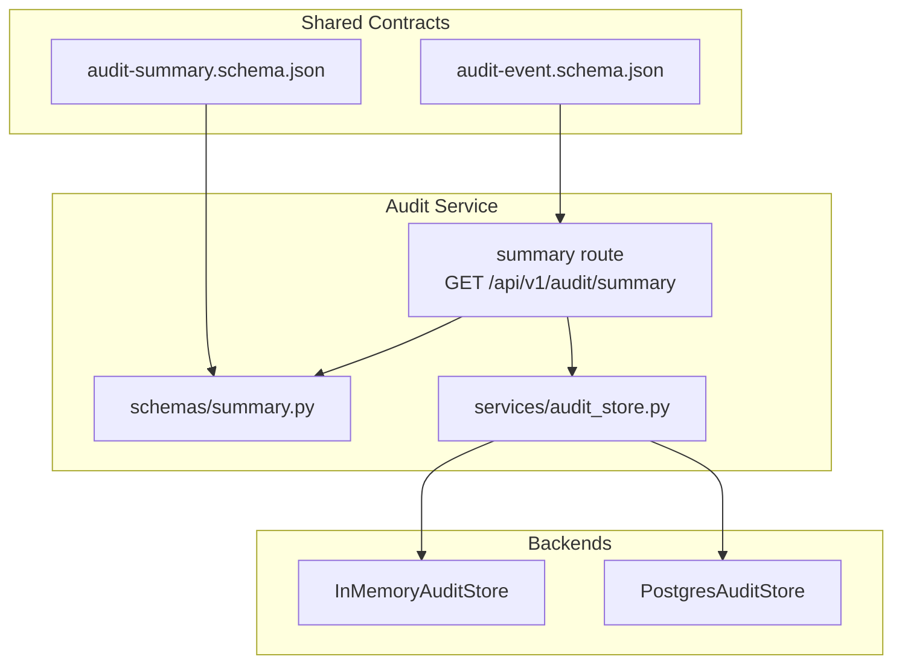
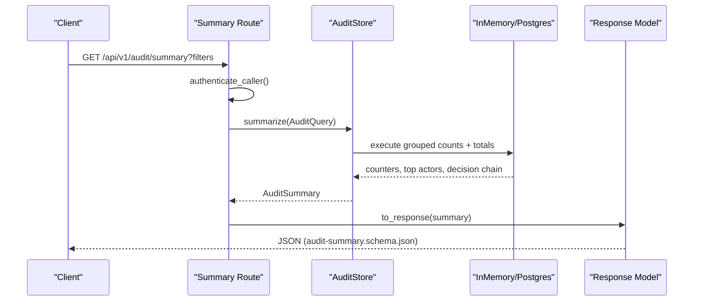
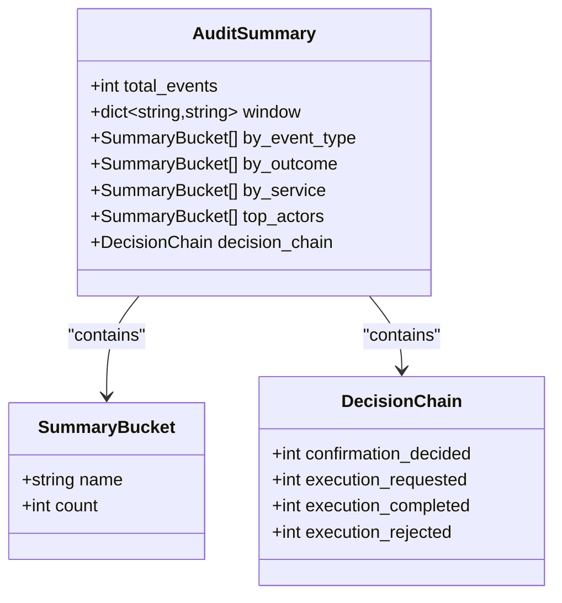
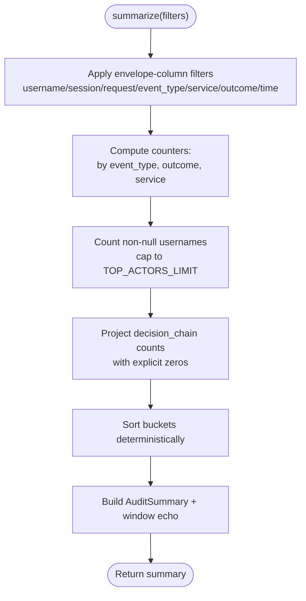
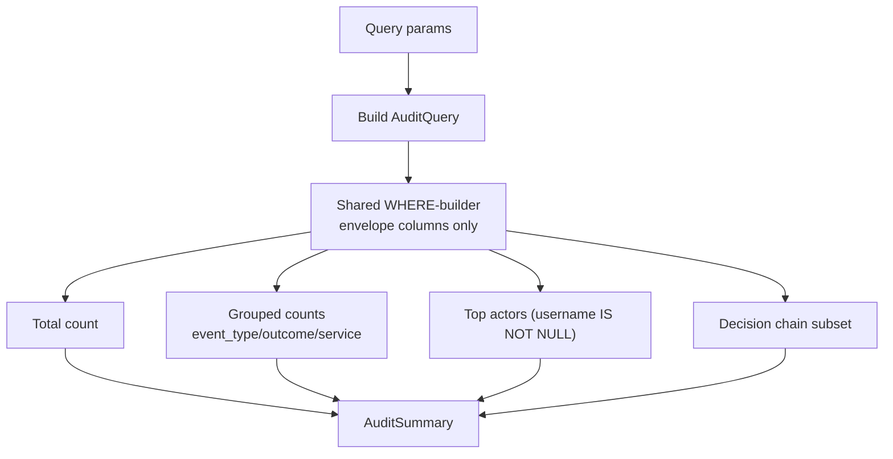
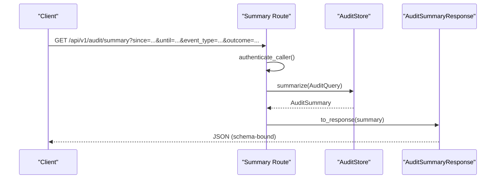
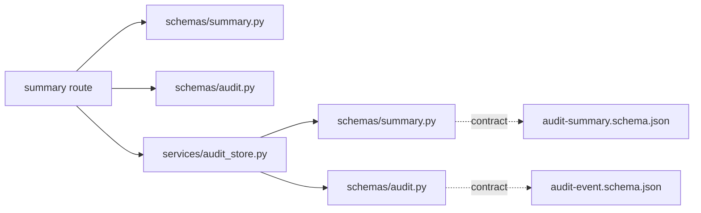

# Audit Summary Schema

<cite>
**Referenced Files in This Document**
- [audit-summary.schema.json](file://shared/shared-contracts/schemas/audit-summary.schema.json)
- [audit-event.schema.json](file://shared/shared-contracts/schemas/audit-event.schema.json)
- [summary.py](file://products/audit-service/src/audit_service/schemas/summary.py)
- [audit.py](file://products/audit-service/src/audit_service/schemas/audit.py)
- [audit_store.py](file://products/audit-service/src/audit_service/services/audit_store.py)
- [summary route](file://products/audit-service/src/audit_service/api/routes/summary.py)
- [export route](file://products/audit-service/src/audit_service/api/routes/export.py)
- [SPEC-047 spec](file://docs/specs/SPEC-047-audit-summary-drilldown/spec.md)
- [test_reporting.py](file://products/audit-service/tests/test_reporting.py)
- [test_audit_store.py](file://products/audit-service/tests/test_audit_store.py)
</cite>

## Table of Contents
1. Introduction
2. Project Structure
3. Core Components
4. Architecture Overview
5. Detailed Component Analysis
6. Dependency Analysis
7. Performance Considerations
8. Troubleshooting Guide
9. Conclusion
10. Appendices

## Introduction
This document describes the audit summary schema and how it is generated from raw audit events to provide aggregated metrics and reporting capabilities. It explains the summary structure, time-based filtering, action-type distributions, actor activity summaries, resource access patterns, and the aggregation algorithms used for counting and trend-ready projections. It also provides operational examples (daily activity reports, security audits, compliance documentation), performance considerations for large-scale processing, and storage optimization strategies.

## Project Structure
The audit summary feature spans shared schemas, service routes, store implementations, and tests:
- Shared JSON schemas define the canonical contract for audit events and summaries.
- The audit service exposes a summary endpoint that accepts filters and returns deterministic aggregates.
- The store implements both in-memory and PostgreSQL backends with consistent aggregation logic.
- Tests validate filter propagation, empty-window behavior, and outcome filtering across query and summary paths.

**Diagram sources**
- [audit-event.schema.json:1-94](file://shared/shared-contracts/schemas/audit-event.schema.json#L1-L94)
- [audit-summary.schema.json:1-109](file://shared/shared-contracts/schemas/audit-summary.schema.json#L1-L109)
- [summary route:34-78](file://products/audit-service/src/audit_service/api/routes/summary.py#L34-L78)
- [summary.py:1-138](file://products/audit-service/src/audit_service/schemas/summary.py#L1-L138)
- [audit_store.py:188-219](file://products/audit-service/src/audit_service/services/audit_store.py#L188-L219)
- [audit_store.py:324-489](file://products/audit-service/src/audit_service/services/audit_store.py#L324-L489)

**Section sources**
- [audit-event.schema.json:1-94](file://shared/shared-contracts/schemas/audit-event.schema.json#L1-L94)
- [audit-summary.schema.json:1-109](file://shared/shared-contracts/schemas/audit-summary.schema.json#L1-L109)
- [summary route:34-78](file://products/audit-service/src/audit_service/api/routes/summary.py#L34-L78)
- [summary.py:1-138](file://products/audit-service/src/audit_service/schemas/summary.py#L1-L138)
- [audit_store.py:188-219](file://products/audit-service/src/audit_service/services/audit_store.py#L188-L219)
- [audit_store.py:324-489](file://products/audit-service/src/audit_service/services/audit_store.py#L324-L489)

## Core Components
- Audit event envelope: Canonical fields include identifiers, timestamps, event type, emitting service, correlation IDs, subject/username/actor, roles, session context, outcome, and per-event details.
- Audit query filters: Supports username, session_id, request_id, event_type, service, outcome, since/until time range.
- Summary response: Deterministic aggregates over envelope columns only (no payload excavation), including total_events, window echo, buckets by event_type/outcome/service, top actors (capped), and decision_chain projection.

Key behaviors:
- All list sections sort by count descending, then name ascending for determinism.
- Decision chain projects SPEC-037 lineage with explicit zeros when absent.
- Outcome filter is additive and applies uniformly across all grouped sections and totals.

**Section sources**
- [audit-event.schema.json:1-94](file://shared/shared-contracts/schemas/audit-event.schema.json#L1-L94)
- [audit.py:67-83](file://products/audit-service/src/audit_service/schemas/audit.py#L67-L83)
- [audit-summary.schema.json:1-109](file://shared/shared-contracts/schemas/audit-summary.schema.json#L1-L109)
- [summary.py:18-57](file://products/audit-service/src/audit_service/schemas/summary.py#L18-L57)

## Architecture Overview
The summary pipeline is read-only and deterministic:
- Clients call GET /api/v1/audit/summary with optional filters.
- The route authenticates the caller, builds an AuditQuery, and delegates to the store.
- The store computes aggregates using either in-memory or PostgreSQL backends, applying shared filter logic and returning an AuditSummary.
- The response model serializes to the shared JSON schema.

**Diagram sources**
- [summary route:34-78](file://products/audit-service/src/audit_service/api/routes/summary.py#L34-L78)
- [audit_store.py:188-219](file://products/audit-service/src/audit_service/services/audit_store.py#L188-L219)
- [audit_store.py:417-489](file://products/audit-service/src/audit_service/services/audit_store.py#L417-L489)
- [summary.py:98-138](file://products/audit-service/src/audit_service/schemas/summary.py#L98-L138)

## Detailed Component Analysis

### Summary Schema Definition
- Root object requires total_events, window, by_event_type, by_outcome, by_service, top_actors, decision_chain.
- Each bucket is a name/count pair; lists are sorted deterministically.
- decision_chain enumerates confirmation_decided, execution_requested, execution_completed, execution_rejected with zero defaults.
- window echoes applied filters (unset fields omitted).

**Diagram sources**
- [audit-summary.schema.json:7-87](file://shared/shared-contracts/schemas/audit-summary.schema.json#L7-L87)
- [summary.py:33-57](file://products/audit-service/src/audit_service/schemas/summary.py#L33-L57)

**Section sources**
- [audit-summary.schema.json:1-109](file://shared/shared-contracts/schemas/audit-summary.schema.json#L1-L109)
- [summary.py:33-57](file://products/audit-service/src/audit_service/schemas/summary.py#L33-L57)

### Aggregation Algorithms
- Counting: Uses envelope columns only (event_type, outcome, service, username). No details payload excavation.
- Sorting: Buckets sorted by count descending, then name ascending for determinism.
- Top actors: Non-null usernames counted and capped to a fixed limit.
- Decision chain: Counts specific event types forming the approval-to-execution lineage; absent types yield zero.
- Time-based aggregation: Summaries are computed over filtered windows defined by since/until; no built-in time-bucketed trends in this version.

**Diagram sources**
- [audit_store.py:188-219](file://products/audit-service/src/audit_service/services/audit_store.py#L188-L219)
- [audit_store.py:417-489](file://products/audit-service/src/audit_service/services/audit_store.py#L417-L489)
- [summary.py:60-79](file://products/audit-service/src/audit_service/schemas/summary.py#L60-L79)

**Section sources**
- [audit_store.py:188-219](file://products/audit-service/src/audit_service/services/audit_store.py#L188-L219)
- [audit_store.py:417-489](file://products/audit-service/src/audit_service/services/audit_store.py#L417-L489)
- [summary.py:60-79](file://products/audit-service/src/audit_service/schemas/summary.py#L60-L79)

### Filtering and Drill-Down
- Filters supported: username, session_id, request_id, event_type, service, outcome, since, until.
- Outcome filter is additive and rides every SQL statement (total, grouped sections, top actors, decision chain).
- Window echo includes all applied filters for traceability.
- Drill-down: UI can navigate from aggregate buckets to the Events tab with matching filters.

**Diagram sources**
- [audit_store.py:288-321](file://products/audit-service/src/audit_service/services/audit_store.py#L288-L321)
- [audit_store.py:417-489](file://products/audit-service/src/audit_service/services/audit_store.py#L417-L489)
- [summary route:54-63](file://products/audit-service/src/audit_service/api/routes/summary.py#L54-L63)

**Section sources**
- [audit.py:67-83](file://products/audit-service/src/audit_service/schemas/audit.py#L67-L83)
- [audit_store.py:288-321](file://products/audit-service/src/audit_service/services/audit_store.py#L288-L321)
- [SPEC-047 spec:51-58](file://docs/specs/SPEC-047-audit-summary-drilldown/spec.md#L51-L58)

### API Surface and Response Contract
- Endpoint: GET /api/v1/audit/summary with optional query parameters.
- Authentication enforced before aggregation.
- Response serialized via pydantic model bound to the shared JSON schema.

**Diagram sources**
- [summary route:34-78](file://products/audit-service/src/audit_service/api/routes/summary.py#L34-L78)
- [summary.py:98-138](file://products/audit-service/src/audit_service/schemas/summary.py#L98-L138)

**Section sources**
- [summary route:34-78](file://products/audit-service/src/audit_service/api/routes/summary.py#L34-L78)
- [summary.py:98-138](file://products/audit-service/src/audit_service/schemas/summary.py#L98-L138)

### Example Reports
- Daily activity report: Call the summary endpoint with since/until covering one day; use by_event_type and by_service buckets to see workload distribution and top actors.
- Security audit: Add outcome=deny or outcome=error to focus on failures; drill down into event_type buckets like policy_decision or execution_rejected.
- Compliance documentation: Use window echo to capture exact filters; export related events via the CSV export endpoint for evidence retention.

[No sources needed since this section provides conceptual usage scenarios]

## Dependency Analysis
- Routes depend on schemas (AuditQuery, response models) and services (store).
- Store depends on schemas (AuditEvent, summary dataclasses) and backend-specific SQL/logic.
- Shared JSON schemas enforce contract boundaries between producers and consumers.

**Diagram sources**
- [summary route:34-78](file://products/audit-service/src/audit_service/api/routes/summary.py#L34-L78)
- [summary.py:1-138](file://products/audit-service/src/audit_service/schemas/summary.py#L1-L138)
- [audit.py:1-83](file://products/audit-service/src/audit_service/schemas/audit.py#L1-L83)
- [audit_store.py:188-219](file://products/audit-service/src/audit_service/services/audit_store.py#L188-L219)
- [audit-store.py:417-489](file://products/audit-service/src/audit_service/services/audit_store.py#L417-L489)
- [audit-summary.schema.json:1-109](file://shared/shared-contracts/schemas/audit-summary.schema.json#L1-L109)
- [audit-event.schema.json:1-94](file://shared/shared-contracts/schemas/audit-event.schema.json#L1-L94)

**Section sources**
- [summary route:34-78](file://products/audit-service/src/audit_service/api/routes/summary.py#L34-L78)
- [summary.py:1-138](file://products/audit-service/src/audit_service/schemas/summary.py#L1-L138)
- [audit.py:1-83](file://products/audit-service/src/audit_service/schemas/audit.py#L1-L83)
- [audit_store.py:188-219](file://products/audit-service/src/audit_service/services/audit_store.py#L188-L219)
- [audit_store.py:417-489](file://products/audit-service/src/audit_service/services/audit_store.py#L417-L489)
- [audit-summary.schema.json:1-109](file://shared/shared-contracts/schemas/audit-summary.schema.json#L1-L109)
- [audit-event.schema.json:1-94](file://shared/shared-contracts/schemas/audit-event.schema.json#L1-L94)

## Performance Considerations
- Envelope-only aggregation: Avoids scanning or parsing the details payload, reducing CPU and memory pressure.
- Deterministic sorting: In-process sort ensures identical results across backends without expensive ordering at scale.
- PostgreSQL grouping: Grouped SQL queries compute counts server-side; top actors limited to a fixed cap to control result size.
- Cursor pagination for exports: Export streams bounded rows page-by-page to avoid unbounded memory growth.
- Retention and eviction: Batched deletion prevents long-running transactions during cleanup.

Recommendations:
- Prefer narrow time windows (since/until) and targeted filters (event_type, service, outcome) to reduce scan scope.
- Use outcome filters to isolate failure modes quickly.
- Monitor export truncation headers to detect high-volume periods.

[No sources needed since this section provides general guidance]

## Troubleshooting Guide
Common issues and checks:
- Empty results: Verify filters (especially since/until and outcome); empty windows return zeros and empty buckets.
- Unexpected counts: Confirm that filters apply uniformly; outcome is additive and affects totals and all groups.
- Auth errors: Ensure caller authentication succeeds before querying summary or export endpoints.
- Export truncation: If X-Audit-Export-Truncated is true, increase time bounds or refine filters.

Validation references:
- Empty window answers zeros and correct bucket shapes.
- Outcome filter propagates through query and summary paths.
- Window echo accurately reflects applied filters.

**Section sources**
- [test_audit_store.py:336-366](file://products/audit-service/tests/test_audit_store.py#L336-L366)
- [test_audit_store.py:687-705](file://products/audit-service/tests/test_audit_store.py#L687-L705)
- [test_reporting.py:124-157](file://products/audit-service/tests/test_reporting.py#L124-L157)
- [export route:87-163](file://products/audit-service/src/audit_service/api/routes/export.py#L87-L163)

## Conclusion
The audit summary schema provides a stable, deterministic view of audit activity across multiple dimensions. By aggregating only envelope columns and supporting rich filtering (including outcome), it enables efficient daily reporting, security investigations, and compliance documentation. Backends ensure consistent results, while retention and export features support operational needs at scale.

[No sources needed since this section summarizes without analyzing specific files]

## Appendices

### Appendix A: Filter Reference
- username: string
- session_id: string
- request_id: string
- event_type: string (closed vocabulary)
- service: string
- outcome: allow | deny | success | error
- since: RFC 3339 datetime
- until: RFC 3339 datetime

**Section sources**
- [audit.py:67-83](file://products/audit-service/src/audit_service/schemas/audit.py#L67-L83)
- [audit-event.schema.json:25-84](file://shared/shared-contracts/schemas/audit-event.schema.json#L25-L84)

### Appendix B: Decision Chain Projection
- confirmation_decided
- execution_requested
- execution_completed
- execution_rejected

Absent types render as zero to preserve governance reconciliation.

**Section sources**
- [summary.py:18-26](file://products/audit-service/src/audit_service/schemas/summary.py#L18-L26)
- [summary.py:41-47](file://products/audit-service/src/audit_service/schemas/summary.py#L41-L47)
- [audit_store.py:205-210](file://products/audit-service/src/audit_service/services/audit_store.py#L205-L210)
- [audit_store.py:467-480](file://products/audit-service/src/audit_service/services/audit_store.py#L467-L480)

### Appendix C: Operational Examples
- Daily activity report: Set since/until to a single day; review by_event_type and by_service buckets; note top_actors for busiest users.
- Security audit: Add outcome=deny or outcome=error; inspect by_event_type for policy decisions and rejections; drill down to events.
- Compliance documentation: Capture window echo values; export events via CSV for archival; verify truncation header.

[No sources needed since this section provides conceptual usage scenarios]