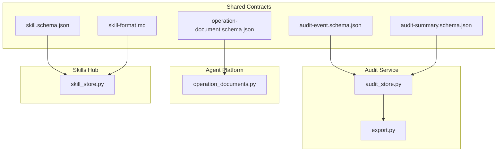
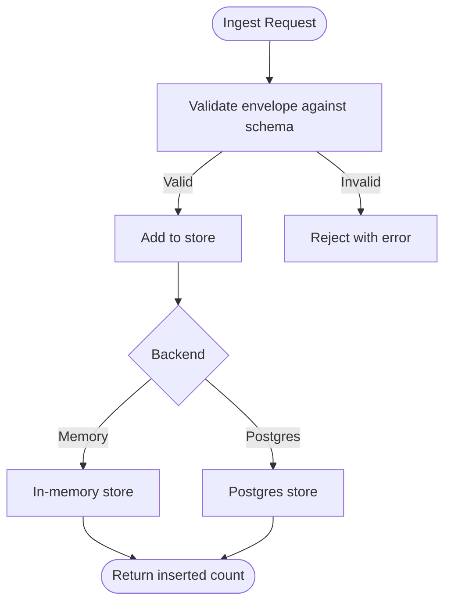
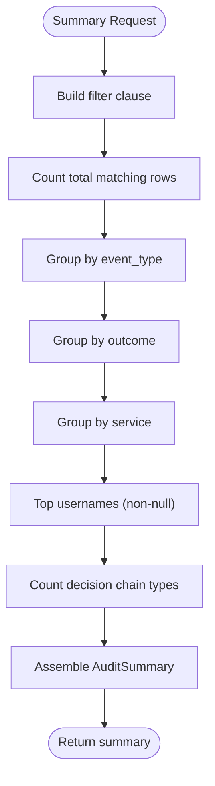
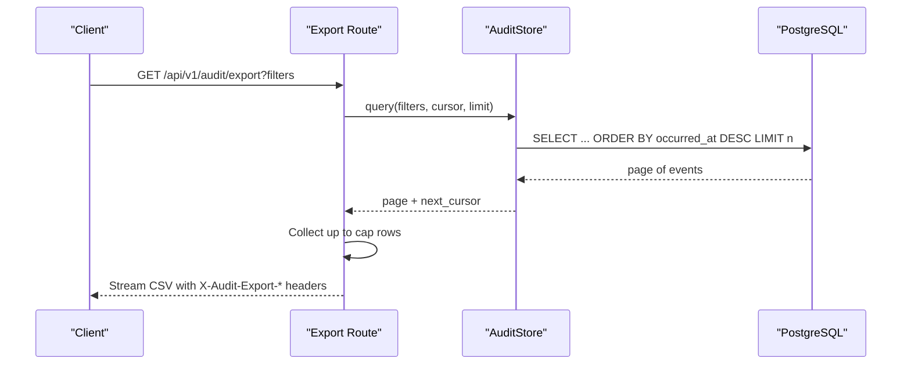
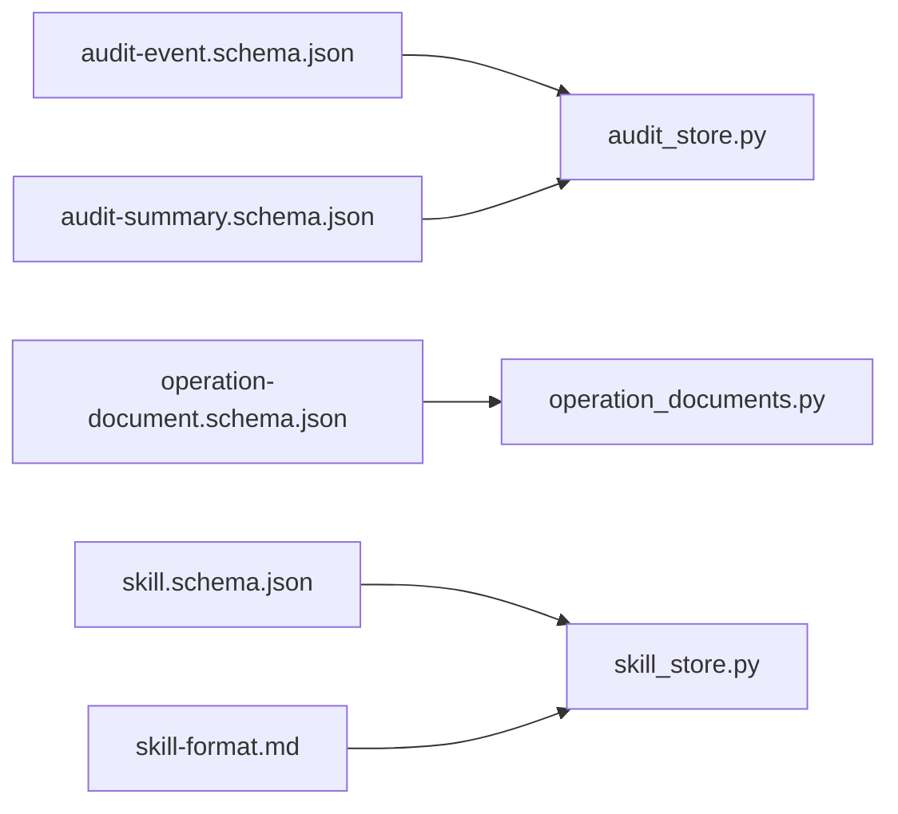

# Audit and Observability Schemas

<cite>
**Referenced Files in This Document**
- [audit-event.schema.json](file://shared/shared-contracts/schemas/audit-event.schema.json)
- [audit-summary.schema.json](file://shared/shared-contracts/schemas/audit-summary.schema.json)
- [operation-document.schema.json](file://shared/shared-contracts/schemas/operation-document.schema.json)
- [skill.schema.json](file://shared/shared-contracts/schemas/skill.schema.json)
- [skill-format.md](file://shared/shared-contracts/skill-format.md)
- [audit_store.py](file://products/audit-service/src/audit_service/services/audit_store.py)
- [export.py](file://products/audit-service/src/audit_service/api/routes/export.py)
- [operation_documents.py](file://products/agent-platform/src/agent_service/services/operation_documents.py)
- [skill_store.py](file://products/skills-hub/src/skills_hub/services/skill_store.py)
</cite>

## Table of Contents
1. [Introduction](#introduction)
2. [Project Structure](#project-structure)
3. [Core Components](#core-components)
4. [Architecture Overview](#architecture-overview)
5. [Detailed Component Analysis](#detailed-component-analysis)
6. [Dependency Analysis](#dependency-analysis)
7. [Performance Considerations](#performance-considerations)
8. [Troubleshooting Guide](#troubleshooting-guide)
9. [Conclusion](#conclusion)
10. [Appendices](#appendices)

## Introduction
This document describes the audit and observability schemas that power compliance tracking and operational insights across the platform. It covers:
- The audit event schema for capturing platform activities, user actions, and system events with full provenance.
- The audit summary schema for aggregated metrics and reporting.
- The operation document schema for storing procedural guidance and runbooks.
- The skill schema for operational automation definitions.
It also provides examples of audit trails, summary reports, operational documents, and skill definitions, and addresses data retention, privacy considerations, and export capabilities.

## Project Structure
The schemas are centrally defined under shared contracts and consumed by services:
- Shared JSON schemas define canonical shapes for audit events, summaries, operation documents, and skills.
- The audit service persists and queries audit events, computes deterministic summaries, and exports filtered trails to CSV.
- The agent platform’s operation document repository stores immutable typed documents (shift summaries, incident reports).
- The skills hub ingests, validates, and serves skill documents and executable flows.



**Diagram sources**
- [audit-event.schema.json:1-94](file://shared/shared-contracts/schemas/audit-event.schema.json#L1-L94)
- [audit-summary.schema.json:1-109](file://shared/shared-contracts/schemas/audit-summary.schema.json#L1-L109)
- [operation-document.schema.json:1-115](file://shared/shared-contracts/schemas/operation-document.schema.json#L1-L115)
- [skill.schema.json:1-125](file://shared/shared-contracts/schemas/skill.schema.json#L1-L125)
- [skill-format.md:1-203](file://shared/shared-contracts/skill-format.md#L1-L203)
- [audit_store.py:1-565](file://products/audit-service/src/audit_service/services/audit_store.py#L1-L565)
- [export.py:1-164](file://products/audit-service/src/audit_service/api/routes/export.py#L1-L164)
- [operation_documents.py:1-573](file://products/agent-platform/src/agent_service/services/operation_documents.py#L1-L573)
- [skill_store.py:1-498](file://products/skills-hub/src/skills_hub/services/skill_store.py#L1-L498)

**Section sources**
- [audit-event.schema.json:1-94](file://shared/shared-contracts/schemas/audit-event.schema.json#L1-L94)
- [audit-summary.schema.json:1-109](file://shared/shared-contracts/schemas/audit-summary.schema.json#L1-L109)
- [operation-document.schema.json:1-115](file://shared/shared-contracts/schemas/operation-document.schema.json#L1-L115)
- [skill.schema.json:1-125](file://shared/shared-contracts/schemas/skill.schema.json#L1-L125)
- [skill-format.md:1-203](file://shared/shared-contracts/skill-format.md#L1-L203)
- [audit_store.py:1-565](file://products/audit-service/src/audit_service/services/audit_store.py#L1-L565)
- [export.py:1-164](file://products/audit-service/src/audit_service/api/routes/export.py#L1-L164)
- [operation_documents.py:1-573](file://products/agent-platform/src/agent_service/services/operation_documents.py#L1-L573)
- [skill_store.py:1-498](file://products/skills-hub/src/skills_hub/services/skill_store.py#L1-L498)

## Core Components
- Audit Event envelope: Captures who did what, when, where, and the outcome, with per-event-type details and provenance fields such as subject, actor, roles, session_id, and request_id.
- Audit Summary response: Deterministic aggregates over envelope columns only, including counts by event type, outcome, service, top actors, and a decision chain projection for approval-to-execution lineage.
- Operation Document: Immutable typed snapshot (draft/published) with provenance anchors, deterministic digest, optional prose, summary, and blurb; supports shift_summary and incident_report types.
- Skill: Canonical skill envelope supporting knowledge and executable_flow kinds, with optional web_target, risk_class, flow_intent, and steps replay list.

**Section sources**
- [audit-event.schema.json:1-94](file://shared/shared-contracts/schemas/audit-event.schema.json#L1-L94)
- [audit-summary.schema.json:1-109](file://shared/shared-contracts/schemas/audit-summary.schema.json#L1-L109)
- [operation-document.schema.json:1-115](file://shared/shared-contracts/schemas/operation-document.schema.json#L1-L115)
- [skill.schema.json:1-125](file://shared/shared-contracts/schemas/skill.schema.json#L1-L125)

## Architecture Overview
The audit pipeline emits canonical envelopes from multiple services into the audit service, which persists them verbatim and exposes query, summary, and export endpoints. Operation documents are authored and published through the agent platform, while skills are ingested and served via the skills hub.

```mermaid
sequenceDiagram
participant Emitter as "Platform Services"
participant AuditAPI as "Audit Service API"
participant Store as "AuditStore"
participant DB as "PostgreSQL"
participant Export as "CSV Export"
Emitter->>AuditAPI : POST /api/v1/audit/events
AuditAPI->>Store : add(events)
Store->>DB : INSERT audit_events
DB-->>Store : OK
Store-->>AuditAPI : inserted count
AuditAPI-->>Emitter : 201 Created
Note over Emitter,AuditAPI : Envelopes stored verbatim; no field rewriting
Emitter->>AuditAPI : GET /api/v1/audit/summary?filters
AuditAPI->>Store : summarize(filters)
Store->>DB : GROUP BY envelope columns
DB-->>Store : buckets + totals
Store-->>AuditAPI : AuditSummary
AuditAPI-->>Emitter : 200 OK
Emitter->>Export : GET /api/v1/audit/export?filters
Export->>Store : query(filters, cursor, limit)
Store->>DB : SELECT ... ORDER BY occurred_at DESC
DB-->>Store : page of events
Store-->>Export : page + next_cursor
Export-->>Emitter : Streaming CSV with truncation headers
```

**Diagram sources**
- [audit_store.py:188-219](file://products/audit-service/src/audit_service/services/audit_store.py#L188-L219)
- [audit_store.py:324-489](file://products/audit-service/src/audit_service/services/audit_store.py#L324-L489)
- [export.py:87-163](file://products/audit-service/src/audit_service/api/routes/export.py#L87-L163)

## Detailed Component Analysis

### Audit Event Schema
- Purpose: Canonical envelope for all audited actions emitted by platform services.
- Key fields: event_id, occurred_at, event_type, service, request_id, outcome, plus identity/context fields (subject, username, actor, roles, session_id) and per-event-type details.
- Provenance: event_id correlates with emitter logs; request_id ties related events together; session_id scopes events to an agent session when applicable.
- Extensibility: details is per-event-type payload; additionalProperties is false at the envelope level to constrain shape.

Example audit trail entries (described):
- tool_invoked: includes tool_name, status, duration_ms, redacted_spans.
- policy_decision: includes action, decision, reason.
- execution_requested/completed/rejected: includes confirm_id, execution_id, call_id, tool_name, args_digest or status/duration/request_id.
- document_created/published/read: includes document_id, document_type, counts, and owner_user_id on cross-owner reads.
- skill_searched/retrieved/synced: includes query, limits, result_count, skill_ids, source filters, and sync outcomes.
- skill_graduated: includes mode, validation, step_count, web_target, and declaration context.

**Section sources**
- [audit-event.schema.json:1-94](file://shared/shared-contracts/schemas/audit-event.schema.json#L1-L94)

### Audit Summary Schema
- Purpose: Deterministic aggregates over envelope columns only; details payloads are never excavated.
- Fields: total_events, window echo, by_event_type, by_outcome, by_service, top_actors (up to 10), and decision_chain counts for confirmation_decided, execution_requested, execution_completed, execution_rejected.
- Sorting: All lists sort by count descending then name ascending for determinism.

Example summary report (described):
- Counts grouped by event_type, outcome, and emitting service.
- Top 10 usernames by event volume.
- Decision chain showing zero-filled counts when any link is absent, enabling governance reconciliation without reading the type table.

**Section sources**
- [audit-summary.schema.json:1-109](file://shared/shared-contracts/schemas/audit-summary.schema.json#L1-L109)
- [audit_store.py:188-219](file://products/audit-service/src/audit_service/services/audit_store.py#L188-L219)

### Operation Document Schema
- Purpose: Immutable typed operations document persisted by the agent platform’s document repository.
- Types: shift_summary and incident_report.
- Lifecycle: draft -> published (one-way); drafts visible only to owner; published visible to documents:read holders.
- Provenance: sessions and cited_record_ids serve as anchors; record ids are never live references.
- Digest: Type-specific deterministic content copied verbatim from durable stores; never model output.
- Optional prose layer: prose_status indicates included/failed/not_requested; summary and blurb provide bounded, digest-anchored metadata for listings.

Example operational document (described):
- Shift summary: covered-session counts, decision/execution details for own coverage, counts-only for foreign coverage, open items, quiet flag for empty shifts.
- Incident report: incident envelope (minus raw triage text), validated triage report or not_triaged marker, connector dispatch outcomes, linked triage session posture.

**Section sources**
- [operation-document.schema.json:1-115](file://shared/shared-contracts/schemas/operation-document.schema.json#L1-L115)
- [operation_documents.py:49-87](file://products/agent-platform/src/agent_service/services/operation_documents.py#L49-L87)
- [operation_documents.py:217-331](file://products/agent-platform/src/agent_service/services/operation_documents.py#L217-L331)

### Skill Schema and Format
- Purpose: Canonical skill envelope for operational automation definitions.
- Kinds: knowledge (default) and executable_flow.
- Web-check flows: optional web_target declares browser-driven checks; risk_class defaults to read when present without explicit value.
- Executable flows: kind=executable_flow requires non-empty steps and risk_class=write; steps carry tool names and arguments; credentials are references resolved at runtime.
- Validation: frontmatter keys strictly enforced; unknown keys rejected; size caps apply; slug derived from file path for stable id scoping.

Example skill definition (described):
- Knowledge skill: title, description, tags, version, source_url.
- Executable flow skill: kind, web_target, risk_class, flow_intent, ordered steps with tool and args; credential values use set/field references rather than literals.

**Section sources**
- [skill.schema.json:1-125](file://shared/shared-contracts/schemas/skill.schema.json#L1-L125)
- [skill-format.md:1-203](file://shared/shared-contracts/skill-format.md#L1-L203)
- [skill_store.py:158-200](file://products/skills-hub/src/skills_hub/services/skill_store.py#L158-L200)
- [skill_store.py:318-362](file://products/skills-hub/src/skills_hub/services/skill_store.py#L318-L362)

### Data Flows and Processing Logic

#### Audit Ingest and Query Flow


**Diagram sources**
- [audit_store.py:103-111](file://products/audit-service/src/audit_service/services/audit_store.py#L103-L111)
- [audit_store.py:357-384](file://products/audit-service/src/audit_service/services/audit_store.py#L357-L384)

#### Summary Aggregation Flow


**Diagram sources**
- [audit_store.py:288-321](file://products/audit-service/src/audit_service/services/audit_store.py#L288-L321)
- [audit_store.py:417-489](file://products/audit-service/src/audit_service/services/audit_store.py#L417-L489)

#### CSV Export Flow


**Diagram sources**
- [export.py:87-163](file://products/audit-service/src/audit_service/api/routes/export.py#L87-L163)
- [audit_store.py:386-415](file://products/audit-service/src/audit_service/services/audit_store.py#L386-L415)

## Dependency Analysis
- Audit service depends on shared audit-event and audit-summary schemas for ingestion and response contracts.
- Agent platform operation documents depend on the operation-document schema and enforce lifecycle and visibility rules.
- Skills hub depends on the skill schema and skill format conventions for ingestion, validation, and storage.



**Diagram sources**
- [audit-event.schema.json:1-94](file://shared/shared-contracts/schemas/audit-event.schema.json#L1-L94)
- [audit-summary.schema.json:1-109](file://shared/shared-contracts/schemas/audit-summary.schema.json#L1-L109)
- [operation-document.schema.json:1-115](file://shared/shared-contracts/schemas/operation-document.schema.json#L1-L115)
- [skill.schema.json:1-125](file://shared/shared-contracts/schemas/skill.schema.json#L1-L125)
- [skill-format.md:1-203](file://shared/shared-contracts/skill-format.md#L1-L203)
- [audit_store.py:1-565](file://products/audit-service/src/audit_service/services/audit_store.py#L1-L565)
- [operation_documents.py:1-573](file://products/agent-platform/src/agent_service/services/operation_documents.py#L1-L573)
- [skill_store.py:1-498](file://products/skills-hub/src/skills_hub/services/skill_store.py#L1-L498)

**Section sources**
- [audit_store.py:1-565](file://products/audit-service/src/audit_service/services/audit_store.py#L1-L565)
- [operation_documents.py:1-573](file://products/agent-platform/src/agent_service/services/operation_documents.py#L1-L573)
- [skill_store.py:1-498](file://products/skills-hub/src/skills_hub/services/skill_store.py#L1-L498)

## Performance Considerations
- Cursor-based pagination: Audit queries use encoded cursors to efficiently paginate newest-first, avoiding offset scans.
- Deterministic aggregation: Summaries group over indexed envelope columns; top actors limited to 10; decision chain uses targeted filtering.
- Batched eviction: Retention cleanup runs in batches to avoid long-running deletes.
- Streaming export: CSV export streams rows and pre-decides truncation using headers before streaming begins.

[No sources needed since this section provides general guidance]

## Troubleshooting Guide
- Invalid audit envelope: Ensure required fields are present and enum values match the closed vocabulary; verify details structure per event_type.
- Missing summary dimensions: If top_actors is empty, ensure username is populated on events; if decision_chain counts are zero, confirm the relevant event types exist in the window.
- Export truncated: Check X-Audit-Export-Truncated header; adjust filters or increase AUDIT_EXPORT_MAX_ROWS if appropriate.
- Operation document visibility: Drafts are owner-only; publish to make visible to documents:read holders.
- Skill ingestion failures: Validate frontmatter keys and constraints; ensure executable_flow skills declare steps and risk_class=write; web.* steps require web_target.

**Section sources**
- [audit-store tests](file://products/audit-service/tests/test_retention.py)
- [export.py:87-163](file://products/audit-service/src/audit_service/api/routes/export.py#L87-L163)
- [operation_documents.py:127-210](file://products/agent-platform/src/agent_service/services/operation_documents.py#L127-L210)
- [skill-format.md:142-160](file://shared/shared-contracts/skill-format.md#L142-L160)

## Conclusion
The audit and observability schemas provide a robust foundation for compliance tracking and operational insights. Audit events capture full provenance, summaries offer deterministic reporting, operation documents preserve immutable procedural records, and skills encode repeatable automation. Together with retention policies, privacy-conscious design, and export capabilities, these components enable secure, auditable, and actionable operations at scale.

[No sources needed since this section summarizes without analyzing specific files]

## Appendices

### Examples

- Audit trail example (described):
  - A sequence of events: chat_started, tool_invoked, policy_decision, confirmation_decided, execution_requested, execution_completed, chat_completed, each with consistent request_id and session_id, outcomes reflecting allow/deny/success/error, and details scoped to the event_type.

- Summary report example (described):
  - Total events over a time window, breakdowns by event_type/outcome/service, top 10 usernames, and decision_chain counts that reconcile approvals to executions even when some stages are missing.

- Operational document example (described):
  - A shift_summary document with provenance listing covered sessions, a deterministic digest summarizing decisions/executions/evidence, optional prose generated from the digest, and a concise summary/blurb suitable for list views.

- Skill definition example (described):
  - An executable_flow skill with kind, web_target, risk_class, flow_intent, and a steps array invoking gateway tools with credential-set references; a knowledge skill with title, description, tags, and optional version/source_url.

[No sources needed since this section provides conceptual examples]