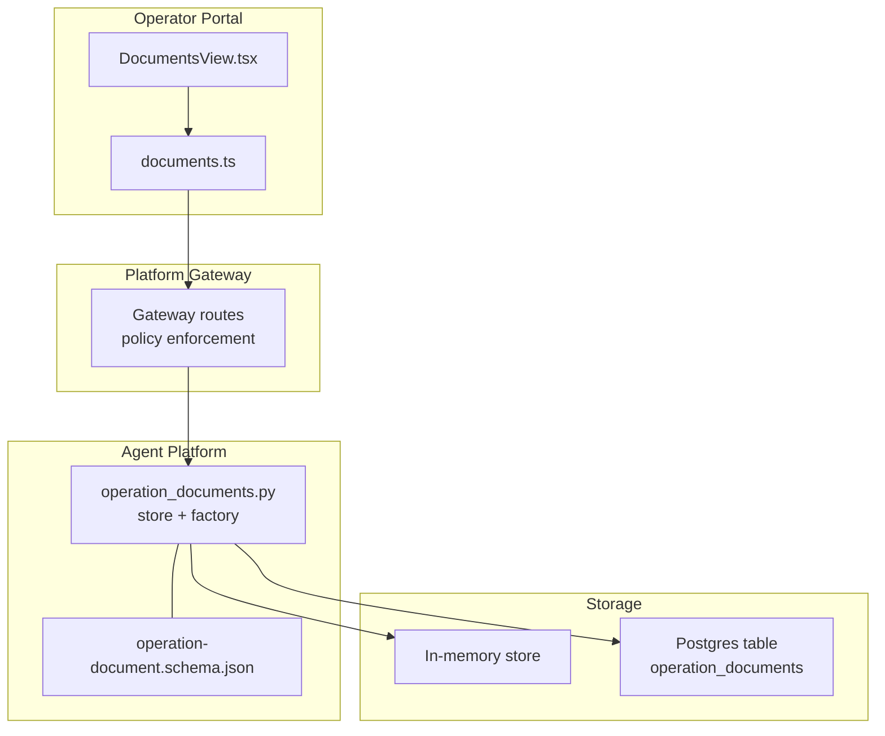
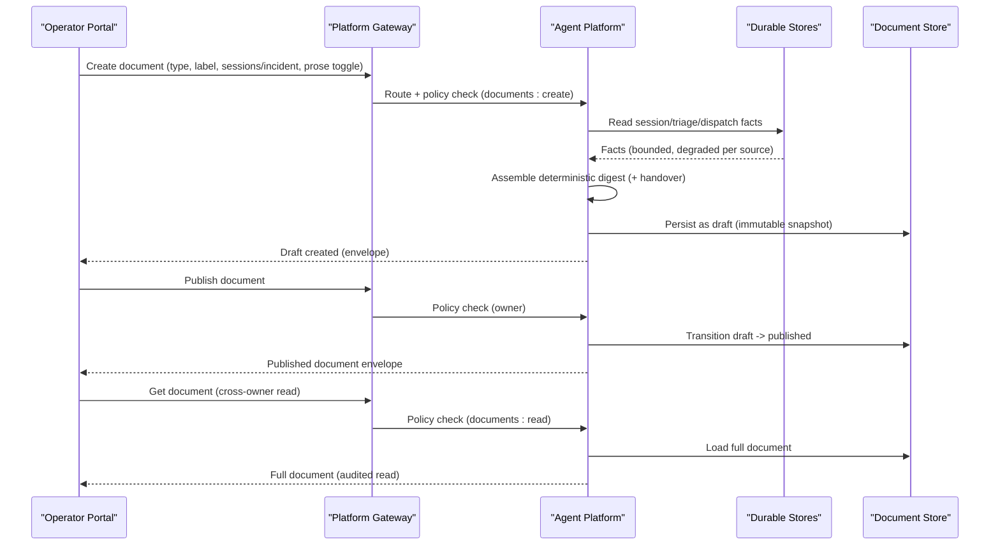
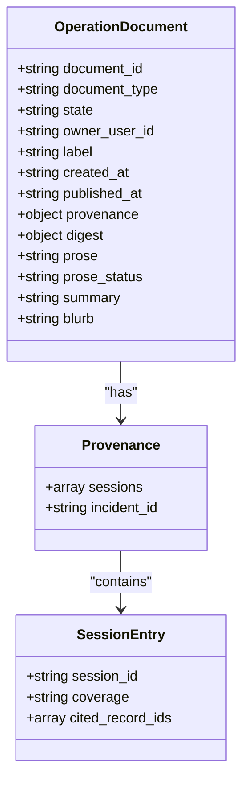
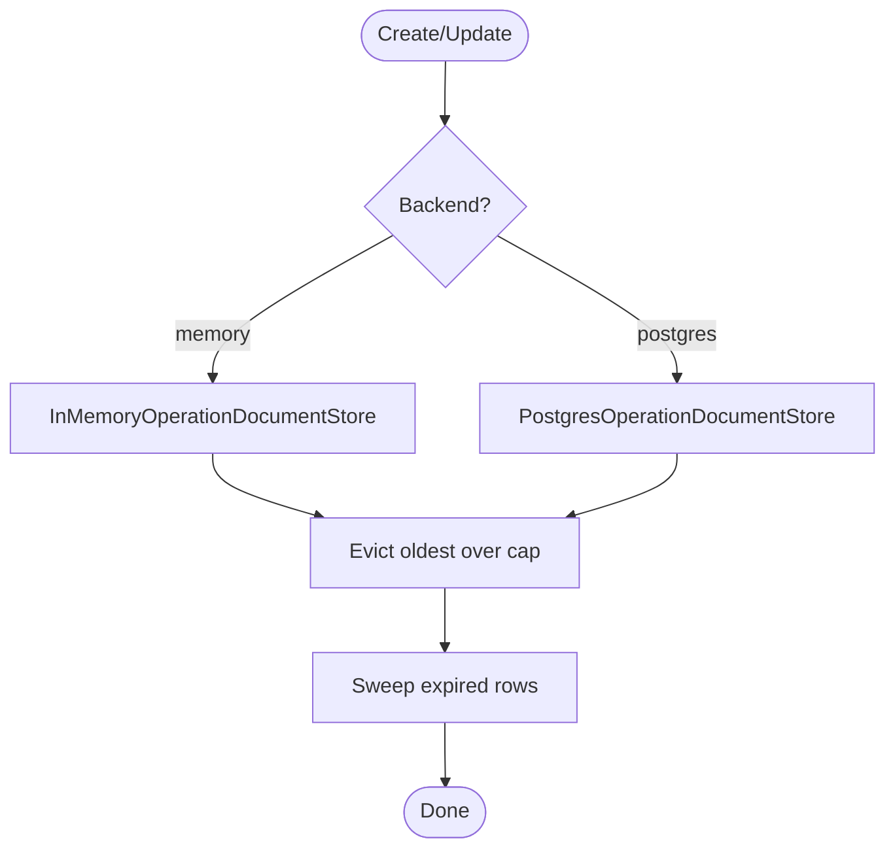
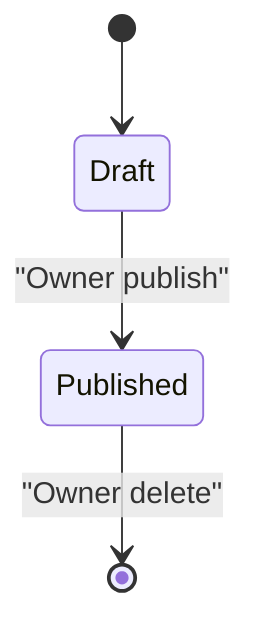
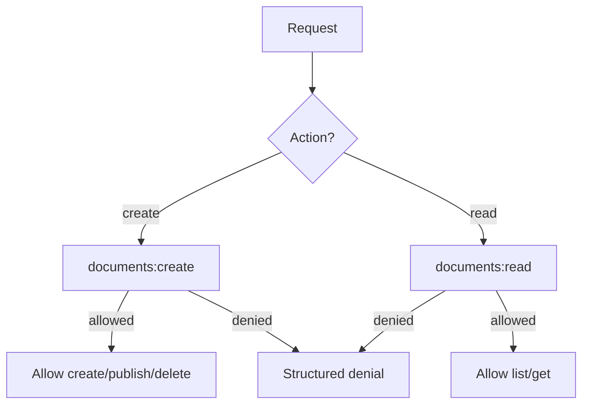
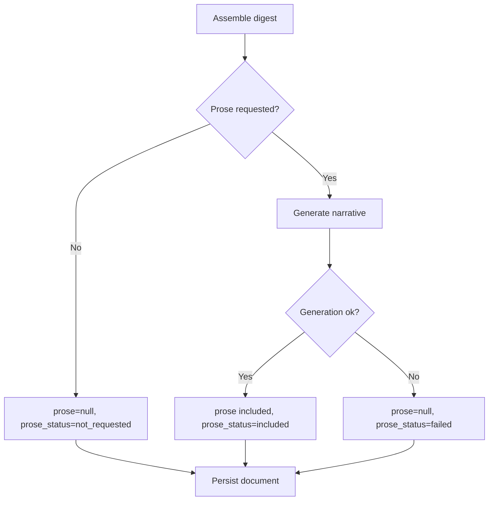
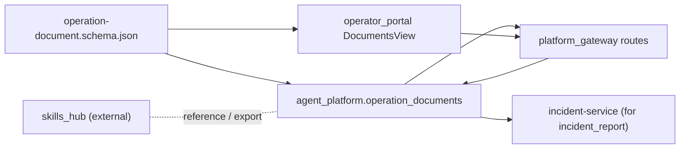

# Operation Document Schema

<cite>
**Referenced Files in This Document**
- [operation-document.schema.json](file://shared/shared-contracts/schemas/operation-document.schema.json)
- [operation_documents.py](file://products/agent-platform/src/agent_service/services/operation_documents.py)
- [documents.ts](file://products/operator-portal/web-ui/app/src/api/documents.ts)
- [DocumentsView.tsx](file://products/operator-portal/web-ui/app/src/views/workspace/DocumentsView.tsx)
- [SPEC-039 spec.md](file://docs/specs/SPEC-039-operations-document-repository/spec.md)
- [SPEC-043 spec.md](file://docs/specs/SPEC-043-incident-report-document-type/spec.md)
- [test_documents.py](file://products/agent-platform/tests/test_documents.py)
- [skills README.md](file://shared/platform-ops/skills/platform-runbooks/README.md)
</cite>

## Table of Contents
1. Introduction
2. Project Structure
3. Core Components
4. Architecture Overview
5. Detailed Component Analysis
6. Dependency Analysis
7. Performance Considerations
8. Troubleshooting Guide
9. Conclusion
10. Appendices

## Introduction
This document defines the operation document schema used to store procedural guidance and runbooks for platform operations. It covers the immutable document model, metadata, content sections, versioning through lifecycle states, access controls by role, supported formats (deterministic digest plus optional narrative), and how documents integrate with the skills system for automated procedure execution. It also describes the end-to-end lifecycle from creation through review to publication and archival, search and discovery mechanisms, collaborative editing workflows, and integration points with the skills hub.

## Project Structure
Operation documents are implemented as a typed repository inside the agent-platform service, persisted via an in-memory or Postgres backend, exposed through the platform gateway, and consumed by the operator portal. The canonical schema lives in shared contracts and is mirrored by client types in the portal.

**Diagram sources**
- [DocumentsView.tsx:1-1550](file://products/operator-portal/web-ui/app/src/views/workspace/DocumentsView.tsx#L1-L1550)
- [documents.ts:1-107](file://products/operator-portal/web-ui/app/src/api/documents.ts#L1-L107)
- [operation_documents.py:1-573](file://products/agent-platform/src/agent_service/services/operation_documents.py#L1-L573)
- [operation-document.schema.json:1-115](file://shared/shared-contracts/schemas/operation-document.schema.json#L1-L115)

**Section sources**
- [operation_documents.py:1-573](file://products/agent-platform/src/agent_service/services/operation_documents.py#L1-L573)
- [operation-document.schema.json:1-115](file://shared/shared-contracts/schemas/operation-document.schema.json#L1-L115)
- [documents.ts:1-107](file://products/operator-portal/web-ui/app/src/api/documents.ts#L1-L107)
- [DocumentsView.tsx:1-1550](file://products/operator-portal/web-ui/app/src/views/workspace/DocumentsView.tsx#L1-L1550)

## Core Components
- Canonical schema: A JSON Schema defines the immutable operation document shape, including identifiers, type, state, ownership, timestamps, provenance, deterministic digest, optional prose, and listing-friendly summary/blurb fields.
- Store protocol and backends: A Python Protocol exposes create, publish, load, list_for_owner, list_published, delete, and readiness checks; two implementations exist — in-memory (dev/CI/fallback) and Postgres (production).
- Lifecycle enforcement: Documents start as draft and transition once to published by the owner; published rows cannot be edited, only deleted.
- Envelope-only listings: List endpoints omit heavy content (digest/prose) so full content retrieval goes through the audited single-document fetch.
- Provenance anchors: Sessions and cited record ids are recorded as stable identifiers, not live references.
- Optional prose layer: An LLM-generated narrative can accompany the digest when requested; generation failures degrade gracefully while preserving the deterministic digest.

**Section sources**
- [operation-document.schema.json:1-115](file://shared/shared-contracts/schemas/operation-document.schema.json#L1-L115)
- [operation_documents.py:95-119](file://products/agent-platform/src/agent_service/services/operation_documents.py#L95-L119)
- [operation_documents.py:127-210](file://products/agent-platform/src/agent_service/services/operation_documents.py#L127-L210)
- [operation_documents.py:380-523](file://products/agent-platform/src/agent_service/services/operation_documents.py#L380-L523)
- [SPEC-039 spec.md:56-172](file://docs/specs/SPEC-039-operations-document-repository/spec.md#L56-L172)

## Architecture Overview
The operation document repository provides a typed, role-gated, auditable surface for operational recaps and incident reports. Creation flows assemble digests from durable stores, persist them as immutable snapshots, and optionally generate a labeled narrative. Publishing exposes documents to all readers with the appropriate role. Cross-owner reads are audited.

**Diagram sources**
- [operation_documents.py:253-318](file://products/agent-platform/src/agent_service/services/operation_documents.py#L253-L318)
- [operation_documents.py:425-473](file://products/agent-platform/src/agent_service/services/operation_documents.py#L425-L473)
- [SPEC-039 spec.md:56-172](file://docs/specs/SPEC-039-operations-document-repository/spec.md#L56-L172)
- [SPEC-043 spec.md:85-156](file://docs/specs/SPEC-043-incident-report-document-type/spec.md#L85-L156)

## Detailed Component Analysis

### Document Model and Schema
- Identifiers and ownership: Stable document_id, owner_user_id, human-readable label, created_at, and optional published_at.
- Type discriminator: shift_summary and incident_report extend the same substrate without changing persistence.
- State machine: draft and published; publishing is one-way and idempotent at the store level.
- Provenance: Lists covered sessions with coverage tier (owner/foreign) and cited_record_ids; incident_report adds incident_id anchor.
- Digest: Deterministic, verbatim copy from durable stores; never contains raw transcripts or unverified model output.
- Prose and status: Optional narrative generated from digest alone; prose_status indicates included/failed/not_requested.
- Listing helpers: summary (counts-only, deterministic) and blurb (one-line story extracted from prose) enable lightweight lists without exposing full content.

**Diagram sources**
- [operation-document.schema.json:19-112](file://shared/shared-contracts/schemas/operation-document.schema.json#L19-L112)

**Section sources**
- [operation-document.schema.json:1-115](file://shared/shared-contracts/schemas/operation-document.schema.json#L1-L115)
- [documents.ts:5-38](file://products/operator-portal/web-ui/app/src/api/documents.ts#L5-L38)

### Store Backends and Persistence
- In-memory backend: Suitable for development and CI; supports cap and retention sweep in-process.
- Postgres backend: DDL creates the table and indexes; additive migrations add summary and blurb columns; writes include opportunistic sweeps and eviction beyond per-owner cap.
- Factory: Chooses backend based on environment variables; falls back to in-memory if Postgres is unavailable.

**Diagram sources**
- [operation_documents.py:127-210](file://products/agent-platform/src/agent_service/services/operation_documents.py#L127-L210)
- [operation_documents.py:217-331](file://products/agent-platform/src/agent_service/services/operation_documents.py#L217-L331)
- [operation_documents.py:530-568](file://products/agent-platform/src/agent_service/services/operation_documents.py#L530-L568)

**Section sources**
- [operation_documents.py:127-210](file://products/agent-platform/src/agent_service/services/operation_documents.py#L127-L210)
- [operation_documents.py:217-331](file://products/agent-platform/src/agent_service/services/operation_documents.py#L217-L331)
- [operation_documents.py:530-568](file://products/agent-platform/src/agent_service/services/operation_documents.py#L530-L568)

### Lifecycle: Creation, Review, Publication, Archival
- Creation: Assembles deterministic digest from durable stores; persists as draft; optional prose generation may fail without affecting digest.
- Review: Operators edit label and choose prose; drafts visible only to owner.
- Publication: One-way owner action transitions to published; subsequent publishes are no-ops.
- Archival: Per-owner cap and retention window enforce bounded storage; expired rows are swept opportunistically.

**Diagram sources**
- [operation_documents.py:276-285](file://products/agent-platform/src/agent_service/services/operation_documents.py#L276-L285)
- [SPEC-039 spec.md:61-87](file://docs/specs/SPEC-039-operations-document-repository/spec.md#L61-L87)

**Section sources**
- [SPEC-039 spec.md:56-172](file://docs/specs/SPEC-039-operations-document-repository/spec.md#L56-L172)
- [operation_documents.py:253-318](file://products/agent-platform/src/agent_service/services/operation_documents.py#L253-L318)

### Access Controls and Audit
- Role-based matrix: documents:create gates creation/publish/delete; documents:read gates listing/getting.
- Visibility: Drafts visible only to owner; published visible to all documents:read holders.
- Audit: Creation and publishing emit events; cross-owner reads of published documents emit read events; own reads do not.

**Diagram sources**
- [SPEC-039 spec.md:88-107](file://docs/specs/SPEC-039-operations-document-repository/spec.md#L88-L107)
- [SPEC-039 spec.md:157-172](file://docs/specs/SPEC-039-operations-document-repository/spec.md#L157-L172)

**Section sources**
- [SPEC-039 spec.md:88-172](file://docs/specs/SPEC-039-operations-document-repository/spec.md#L88-L172)

### Formats and Content Sections
- Deterministic digest: Always present; type-specific sections (shift_summary handover; incident_report incident/triage/dispatch/session).
- Optional narrative: Clearly labeled, generated from digest only; failure yields prose_status=failed but preserves digest.
- Export: Client-side Markdown export includes metadata, provenance, digest, and narrative when available.

**Diagram sources**
- [operation-document.schema.json:91-112](file://shared/shared-contracts/schemas/operation-document.schema.json#L91-L112)
- [SPEC-039 spec.md:137-156](file://docs/specs/SPEC-039-operations-document-repository/spec.md#L137-L156)

**Section sources**
- [operation-document.schema.json:1-115](file://shared/shared-contracts/schemas/operation-document.schema.json#L1-L115)
- [DocumentsView.tsx:1453-1533](file://products/operator-portal/web-ui/app/src/views/workspace/DocumentsView.tsx#L1453-L1533)

### Examples of Operational Procedures
- Incident response playbooks: Modeled as incident_report documents that capture incident envelope, triage report, dispatch outcomes, and linked session digest under the two-tier posture.
- Maintenance tasks: Modeled as shift_summary documents summarizing decisions, executions, evidence counts, and open items across covered sessions.
- Troubleshooting guides: Stored as skills (Markdown with frontmatter) and ingested by the skills hub; operation documents can reference or link to these skills via provenance and narrative.

**Section sources**
- [SPEC-043 spec.md:16-27](file://docs/specs/SPEC-043-incident-report-document-type/spec.md#L16-L27)
- [SPEC-043 spec.md:85-128](file://docs/specs/SPEC-043-incident-report-document-type/spec.md#L85-L128)
- [SPEC-039 spec.md:109-136](file://docs/specs/SPEC-039-operations-document-repository/spec.md#L109-L136)
- [skills README.md:1-38](file://shared/platform-ops/skills/platform-runbooks/README.md#L1-L38)

### Search and Discovery
- Listing surfaces: Owner scope (mine) shows drafts and published; team scope (published) shows all published documents.
- Envelope-only lists: Avoids exposing full content; full details retrieved via audited get.
- Summary line: Deterministic counts-only summary aids quick scanning in lists.

**Section sources**
- [documents.ts:40-43](file://products/operator-portal/web-ui/app/src/api/documents.ts#L40-L43)
- [operation-document.schema.json:104-112](file://shared/shared-contracts/schemas/operation-document.schema.json#L104-L112)
- [SPEC-039 spec.md:98-107](file://docs/specs/SPEC-039-operations-document-repository/spec.md#L98-L107)

### Version Management
- Immutable snapshots: Each document is a fixed snapshot; no edits after creation.
- Lifecycle versions: State encodes version-like progression (draft → published); published documents are append-only via deletion/re-creation.
- Additive schema fields: New fields like summary and blurb are additive and backward-compatible; older documents degrade gracefully.

**Section sources**
- [operation_documents.py:239-251](file://products/agent-platform/src/agent_service/services/operation_documents.py#L239-L251)
- [SPEC-039 spec.md:61-87](file://docs/specs/SPEC-039-operations-document-repository/spec.md#L61-L87)

### Collaborative Editing Workflows
- Ownership: Only the owner can publish or delete; drafts are private to the owner.
- Team visibility: Once published, any documents:read holder can view; cross-owner reads are audited.
- No per-document grants: Access is role-based, not ACL-per-document.

**Section sources**
- [SPEC-039 spec.md:88-107](file://docs/specs/SPEC-039-operations-document-repository/spec.md#L88-L107)
- [SPEC-039 spec.md:157-172](file://docs/specs/SPEC-039-operations-document-repository/spec.md#L157-L172)

### Integration with Skills System
- Skills as procedural knowledge: Markdown skills with frontmatter define titles, descriptions, targets, and risk classes; ingested by the skills hub for agent use.
- Operation documents complement skills: Documents provide durable, attributed recaps and incident reports; skills provide reusable, executable procedures.
- Authoring workflow: Skills are authored in Git, validated locally, and ingested; operation documents are authored in the portal and persisted by the repository.

**Section sources**
- [skills README.md:1-38](file://shared/platform-ops/skills/platform-runbooks/README.md#L1-L38)
- [SPEC-039 spec.md:239-256](file://docs/specs/SPEC-039-operations-document-repository/spec.md#L239-L256)

## Dependency Analysis
Operation documents depend on durable stores for fact assembly, the platform gateway for policy enforcement and routing, and the operator portal for authoring and consumption. The schema is shared across services and clients.

**Diagram sources**
- [operation-document.schema.json:1-115](file://shared/shared-contracts/schemas/operation-document.schema.json#L1-L115)
- [operation_documents.py:1-573](file://products/agent-platform/src/agent_service/services/operation_documents.py#L1-L573)
- [DocumentsView.tsx:1-1550](file://products/operator-portal/web-ui/app/src/views/workspace/DocumentsView.tsx#L1-L1550)
- [SPEC-043 spec.md:129-156](file://docs/specs/SPEC-043-incident-report-document-type/spec.md#L129-L156)

**Section sources**
- [SPEC-043 spec.md:129-156](file://docs/specs/SPEC-043-incident-report-document-type/spec.md#L129-L156)
- [operation_documents.py:530-568](file://products/agent-platform/src/agent_service/services/operation_documents.py#L530-L568)

## Performance Considerations
- Bounded storage: Per-owner cap prevents unbounded growth; oldest entries evicted first.
- Opportunistic cleanup: Retention-based sweeps run on writes and startup to reclaim space.
- Envelope-only listings: Reduces payload size for list endpoints; full content fetched only when needed.
- Degraded assembly: Missing or unreadable sources degrade per section rather than failing the entire request.

[No sources needed since this section provides general guidance]

## Troubleshooting Guide
- Postgres unavailable: The factory falls back to in-memory; logs indicate fallback behavior.
- Unknown backend: Raises configuration error; ensure AGENT_STATE_STORE_BACKEND is set to memory or postgres.
- Missing database URL: When using postgres backend without AGENT_STATE_DB_URL, initialization fails; configure the URL.
- Incident report creation dependencies: If incident-service is unreachable or misconfigured, creation returns upstream errors; verify configuration and connectivity.

**Section sources**
- [operation_documents.py:530-568](file://products/agent-platform/src/agent_service/services/operation_documents.py#L530-L568)
- [SPEC-043 spec.md:129-156](file://docs/specs/SPEC-043-incident-report-document-type/spec.md#L129-L156)

## Conclusion
The operation document schema provides a robust, role-gated, and auditable substrate for operational recaps and incident reports. Its immutable snapshots, deterministic digests, optional narrative, and clear lifecycle support reliable handover and post-incident review. Combined with the skills system, it enables both durable records and executable procedures, improving platform operations reliability and collaboration.

[No sources needed since this section summarizes without analyzing specific files]

## Appendices

### Example: Creating and Publishing a Shift Summary
- Select covered sessions (own and optionally foreign), provide a label, and toggle prose generation.
- The system assembles a deterministic digest and persists a draft.
- Publish to expose to all documents:read holders; cross-owner reads are audited.

**Section sources**
- [SPEC-039 spec.md:109-156](file://docs/specs/SPEC-039-operations-document-repository/spec.md#L109-L156)
- [operation_documents.py:253-318](file://products/agent-platform/src/agent_service/services/operation_documents.py#L253-L318)

### Example: Creating an Incident Report
- Choose an incident; the system assembles incident, triage, dispatch, and linked session sections.
- Publish to share the report; cross-owner reads are audited.

**Section sources**
- [SPEC-043 spec.md:85-128](file://docs/specs/SPEC-043-incident-report-document-type/spec.md#L85-L128)
- [test_documents.py:618-630](file://products/agent-platform/tests/test_documents.py#L618-L630)