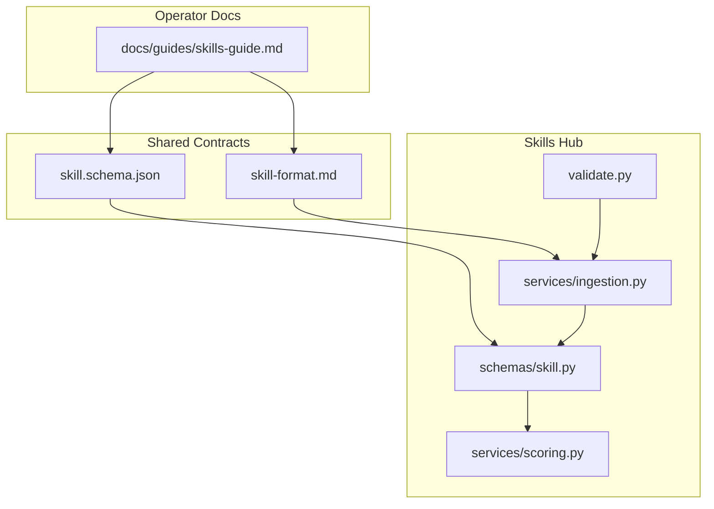
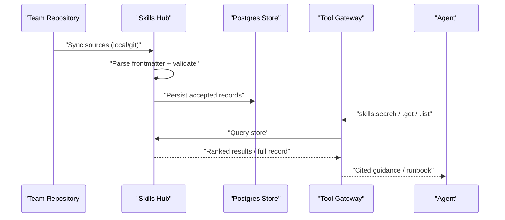
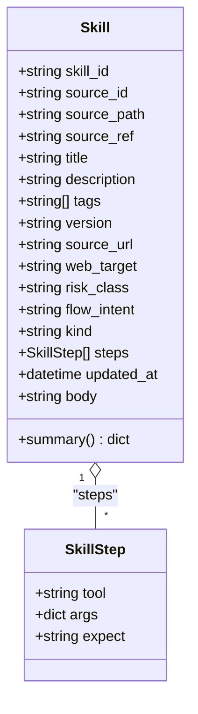
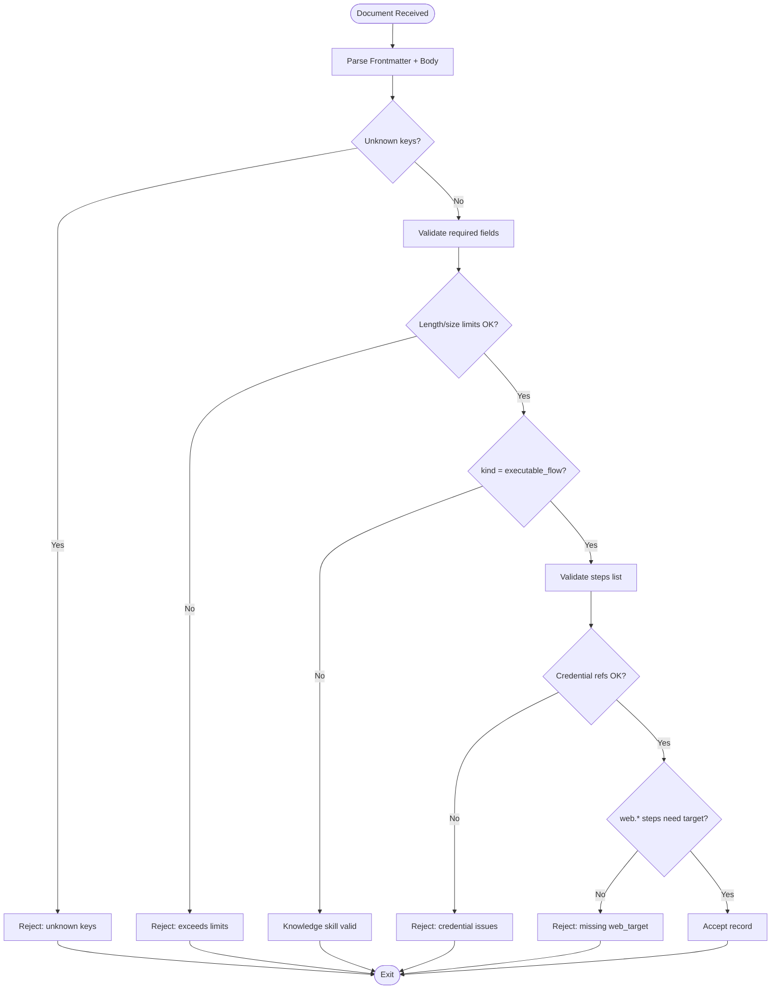
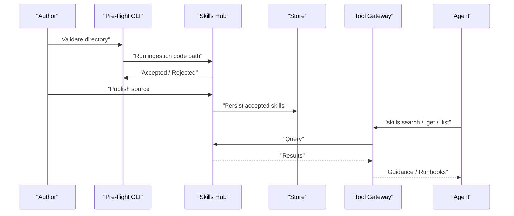
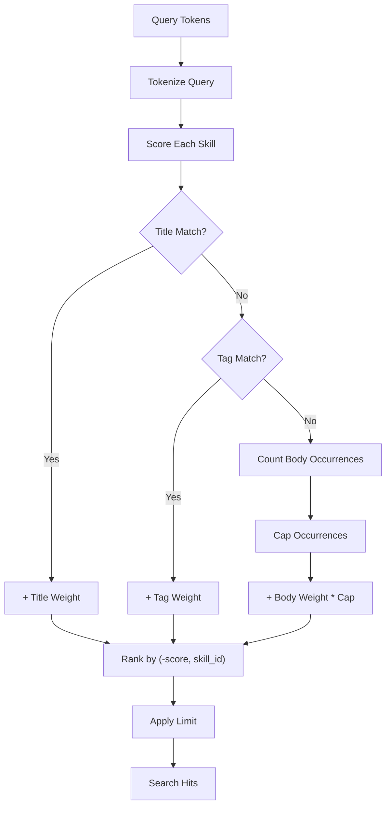
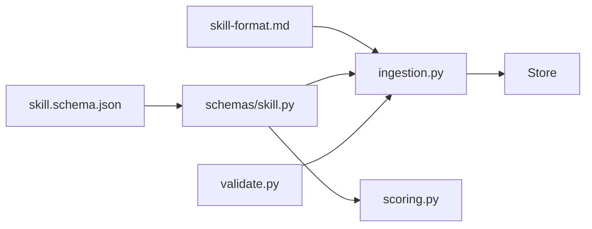

# Skill Schema

<cite>
**Referenced Files in This Document**
- [skill.schema.json](file://shared/shared-contracts/schemas/skill.schema.json)
- [skill-format.md](file://shared/shared-contracts/skill-format.md)
- [skill.py](file://products/skills-hub/src/skills_hub/schemas/skill.py)
- [ingestion.py](file://products/skills-hub/src/skills_hub/services/ingestion.py)
- [scoring.py](file://products/skills-hub/src/skills_hub/services/scoring.py)
- [validate.py](file://products/skills-hub/src/skills_hub/validate.py)
- [skills-guide.md](file://docs/guides/skills-guide.md)
</cite>

## Table of Contents
1. Introduction
2. Project Structure
3. Core Components
4. Architecture Overview
5. Detailed Component Analysis
6. Dependency Analysis
7. Performance Considerations
8. Troubleshooting Guide
9. Conclusion
10. Appendices

## Introduction
This document defines the skill schema that captures operational automation definitions and reusable procedures as declarative specifications. A skill is a Markdown document with YAML frontmatter that encodes metadata, optional executable steps, and validation rules consumed by the skills hub. Skills encapsulate operational knowledge so agents can ground answers and, when applicable, replay approved interactive flows safely. The lifecycle spans authoring, validation, testing, graduation into executable form, and production deployment through the skills hub store and agent tooling.

## Project Structure
The skill system spans shared contracts (schema and format), the skills hub service (validation, ingestion, storage, search), and operator guides.

**Diagram sources**
- [skill.schema.json:1-125](file://shared/shared-contracts/schemas/skill.schema.json#L1-L125)
- [skill-format.md:1-203](file://shared/shared-contracts/skill-format.md#L1-L203)
- [skill.py:1-66](file://products/skills-hub/src/skills_hub/schemas/skill.py#L1-L66)
- [ingestion.py:1-559](file://products/skills-hub/src/skills_hub/services/ingestion.py#L1-L559)
- [scoring.py:1-97](file://products/skills-hub/src/skills_hub/services/scoring.py#L1-L97)
- [validate.py:1-48](file://products/skills-hub/src/skills_hub/validate.py#L1-L48)
- [skills-guide.md:1-374](file://docs/guides/skills-guide.md#L1-L374)

**Section sources**
- [skill.schema.json:1-125](file://shared/shared-contracts/schemas/skill.schema.json#L1-L125)
- [skill-format.md:1-203](file://shared/shared-contracts/skill-format.md#L1-L203)
- [skill.py:1-66](file://products/skills-hub/src/skills_hub/schemas/skill.py#L1-L66)
- [ingestion.py:1-559](file://products/skills-hub/src/skills_hub/services/ingestion.py#L1-L559)
- [scoring.py:1-97](file://products/skills-hub/src/skills_hub/services/scoring.py#L1-L97)
- [validate.py:1-48](file://products/skills-hub/src/skills_hub/validate.py#L1-L48)
- [skills-guide.md:1-374](file://docs/guides/skills-guide.md#L1-L374)

## Core Components
- Skill envelope model: Defines fields for identity, provenance, classification, optional executable flow, and body content.
- Validation contract: JSON schema and prose format specification enforce required keys, types, lengths, and constraints.
- Ingestion pipeline: Parses Markdown frontmatter, validates against the contract, enforces size caps, step list rules, and credential reference policy, then produces validated records.
- Search and ranking: Deterministic keyword scoring ranks results consistently across backends.
- Pre-flight CLI: Validates local directories using the same code path as sync.

Key responsibilities:
- Envelope: Stable, versioned representation stored and served verbatim.
- Ingestion: Fail-closed validation; rejects invalid documents with actionable reasons.
- Ranking: Title > tags > body weighting with bounded occurrence counts and deterministic tie-breaking.
- CLI: Author-friendly pre-flight to catch errors before publishing.

**Section sources**
- [skill.py:15-66](file://products/skills-hub/src/skills_hub/schemas/skill.py#L15-L66)
- [skill.schema.json:1-125](file://shared/shared-contracts/schemas/skill.schema.json#L1-L125)
- [skill-format.md:31-160](file://shared/shared-contracts/skill-format.md#L31-L160)
- [ingestion.py:149-473](file://products/skills-hub/src/skills_hub/services/ingestion.py#L149-L473)
- [scoring.py:28-97](file://products/skills-hub/src/skills_hub/services/scoring.py#L28-L97)
- [validate.py:23-47](file://products/skills-hub/src/skills_hub/validate.py#L23-L47)

## Architecture Overview
Skills originate as Markdown documents in team repositories or local directories. The skills hub periodically syncs sources, validates each document, stores accepted records, and exposes read-only access via tools. Agents discover and use skills through gateway tools.

**Diagram sources**
- [skills-guide.md:12-35](file://docs/guides/skills-guide.md#L12-L35)
- [ingestion.py:476-559](file://products/skills-hub/src/skills_hub/services/ingestion.py#L476-L559)
- [scoring.py:85-97](file://products/skills-hub/src/skills_hub/services/scoring.py#L85-L97)

## Detailed Component Analysis

### Skill Envelope and Types
- Identity and provenance: namespaced id derived from source and file path, source identifiers, and update timestamp.
- Classification: kind discriminator between knowledge and executable_flow; risk_class indicates effect of interactive steps; optional web_target for browser-driven checks; optional flow_intent for confirmation card context.
- Executable flow: ordered steps with tool name, arguments, and optional expect post-condition; strict key allowance and JSON compatibility enforced.
- Body: Markdown content with size cap; included in full-record responses only.

**Diagram sources**
- [skill.py:15-66](file://products/skills-hub/src/skills_hub/schemas/skill.py#L15-L66)

**Section sources**
- [skill.schema.json:7-121](file://shared/shared-contracts/schemas/skill.schema.json#L7-L121)
- [skill-format.md:31-117](file://shared/shared-contracts/skill-format.md#L31-L117)
- [skill.py:15-66](file://products/skills-hub/src/skills_hub/schemas/skill.py#L15-L66)

### Validation Rules and Enforcement
- Frontmatter keys are strictly enumerated; unknown keys cause rejection.
- Required fields: title and description with length limits.
- Optional fields: tags, version, source_url, web_target, risk_class, flow_intent, kind, steps with specific constraints.
- Size caps: body ≤ 64 KiB; steps list ≤ 200 items and ≤ 64 KiB serialized; per-field character limits enforced.
- Credential policy: no literal secrets; credential-filling steps must reference named sets; unresolved placeholders rejected.
- Executable flow rules: kind must be declared; steps require non-empty list and risk_class=write; any web.* step requires web_target.

**Diagram sources**
- [ingestion.py:149-473](file://products/skills-hub/src/skills_hub/services/ingestion.py#L149-L473)
- [skill-format.md:93-160](file://shared/shared-contracts/skill-format.md#L93-L160)

**Section sources**
- [ingestion.py:149-473](file://products/skills-hub/src/skills_hub/services/ingestion.py#L149-L473)
- [skill-format.md:31-160](file://shared/shared-contracts/skill-format.md#L31-L160)

### Skill Lifecycle: Authoring, Validation, Testing, Graduation, Deployment
- Authoring: Write Markdown with YAML frontmatter following the skill format.
- Validation: Use the CLI to pre-validate locally; service validates during sync.
- Testing: Inspect status endpoint for rejections and last error; verify catalog and search endpoints.
- Graduation: Approved sessions produce executable-flow artifacts with replay steps; blast-radius re-validation ensures safe bounds.
- Deployment: Skills hub syncs sources, persists accepted records, and serves them via read-only tools to agents.

**Diagram sources**
- [validate.py:23-47](file://products/skills-hub/src/skills_hub/validate.py#L23-L47)
- [skills-guide.md:85-108](file://docs/guides/skills-guide.md#L85-L108)
- [skills-guide.md:12-35](file://docs/guides/skills-guide.md#L12-L35)

**Section sources**
- [skills-guide.md:85-108](file://docs/guides/skills-guide.md#L85-L108)
- [skills-guide.md:12-35](file://docs/guides/skills-guide.md#L12-L35)
- [skill-format.md:176-186](file://shared/shared-contracts/skill-format.md#L176-L186)

### Examples of Skill Types
- Diagnostic procedure (knowledge): Provides grounded guidance without execution; includes title, description, tags, and body.
- Remediation action (executable_flow): Declares kind=executable_flow with steps invoking tools like k8s.* or web.*; requires risk_class=write and, for web.* steps, web_target.
- Monitoring task (web-check): Uses web_target and risk_class=read to declare a browser-driven check flow without a step list.

These examples follow the same schema; differences lie in kind, presence of steps, and risk_class/web_target usage.

**Section sources**
- [skill-format.md:55-117](file://shared/shared-contracts/skill-format.md#L55-L117)
- [skill.schema.json:63-111](file://shared/shared-contracts/schemas/skill.schema.json#L63-L111)

### Skill Composition Patterns and Parameter Binding
- Composition: Knowledge skills provide grounding; executable_flow skills compose tool invocations into an ordered replay.
- Parameter binding: Steps carry args; credentials are bound via references to platform-managed sets at replay time, never embedded in skills.
- Expectation aids: Optional expect strings describe post-conditions for display/replay; not security inputs.

**Section sources**
- [skill-format.md:107-140](file://shared/shared-contracts/skill-format.md#L107-L140)
- [skill.py:15-29](file://products/skills-hub/src/skills_hub/schemas/skill.py#L15-L29)

### Error Handling Strategies
- Fail-closed validation: Unknown keys, invalid types, exceeded sizes, and structural mismatches result in explicit rejections.
- Credential safety: Unresolved placeholders and missing set/field references are rejected; no literals allowed.
- Source resilience: Failed syncs keep previous snapshots; status endpoint reports per-source outcomes and last errors.

**Section sources**
- [ingestion.py:149-473](file://products/skills-hub/src/skills_hub/services/ingestion.py#L149-L473)
- [skills-guide.md:340-368](file://docs/guides/skills-guide.md#L340-L368)

### Relationship Between Skills and Tools
- Skills invoke tools via canonical dotted names in steps (e.g., web.navigate, web.fill_credential).
- For executable flows, the gateway binds web.* steps to a declared web_target to enforce origin and step budget.
- Credentials are resolved from platform-managed sets at replay time; skills never contain secrets.

**Section sources**
- [skill-format.md:107-117](file://shared/shared-contracts/skill-format.md#L107-L117)
- [skill-format.md:103-106](file://shared/shared-contracts/skill-format.md#L103-L106)

### Skill Ranking Algorithms and Discovery Mechanisms
- Scoring weights: Title matches score highest, followed by tags, then body occurrences capped to prevent long-body dominance.
- Determinism: Tokenization and scoring are pure functions; ties break by skill_id ascending.
- Discovery: Agents use read-only tools to search, list, and get skills; excerpts aid readability.

**Diagram sources**
- [scoring.py:28-97](file://products/skills-hub/src/skills_hub/services/scoring.py#L28-L97)

**Section sources**
- [scoring.py:1-97](file://products/skills-hub/src/skills_hub/services/scoring.py#L1-L97)

## Dependency Analysis
- Ingestion depends on schema and format contracts; it constructs Skill envelopes and enforces all constraints.
- Model layer provides typed boundaries and serialization helpers.
- Scoring depends on Skill envelopes to compute relevance deterministically.
- CLI delegates to ingestion to reuse the same validation logic.

**Diagram sources**
- [skill-format.md:1-203](file://shared/shared-contracts/skill-format.md#L1-L203)
- [skill.schema.json:1-125](file://shared/shared-contracts/schemas/skill.schema.json#L1-L125)
- [skill.py:1-66](file://products/skills-hub/src/skills_hub/schemas/skill.py#L1-L66)
- [ingestion.py:1-559](file://products/skills-hub/src/skills_hub/services/ingestion.py#L1-L559)
- [scoring.py:1-97](file://products/skills-hub/src/skills_hub/services/scoring.py#L1-L97)
- [validate.py:1-48](file://products/skills-hub/src/skills_hub/validate.py#L1-L48)

**Section sources**
- [ingestion.py:1-559](file://products/skills-hub/src/skills_hub/services/ingestion.py#L1-L559)
- [scoring.py:1-97](file://products/skills-hub/src/skills_hub/services/scoring.py#L1-L97)
- [validate.py:1-48](file://products/skills-hub/src/skills_hub/validate.py#L1-L48)

## Performance Considerations
- Step list and body size caps protect storage and response payloads.
- Scoring uses bounded occurrence counts to avoid long bodies dominating rankings.
- Deterministic tokenization and scoring ensure consistent performance across backends.

[No sources needed since this section provides general guidance]

## Troubleshooting Guide
Common symptoms and actions:
- New or revised skill not visible: Wait for sync interval or restart deployment; verify ConfigMap wiring.
- Source reports rejections: Inspect status endpoint for reasons; fix frontmatter or step structure.
- Git source errors: Check tokens and subpath configuration; previous snapshot remains served until fixed.
- Search returns no matches: Confirm existence via catalog; adjust query or tags.

**Section sources**
- [skills-guide.md:340-368](file://docs/guides/skills-guide.md#L340-L368)

## Conclusion
The skill schema provides a robust, declarative foundation for operational automation. It separates knowledge from execution, enforces safety through strict validation and credential policies, and enables reliable discovery and ranking. The lifecycle supports iterative authoring, rigorous validation, safe graduation, and production deployment through a resilient skills hub.

[No sources needed since this section summarizes without analyzing specific files]

## Appendices

### Field Reference Summary
- Required: skill_id, source_id, source_path, source_ref, title, description, updated_at.
- Optional: tags, version, source_url, web_target, risk_class, flow_intent, kind, steps, body (in full records).
- Constraints: Length limits, enum values, URL validation, step list bounds, JSON compatibility, credential reference policy.

**Section sources**
- [skill.schema.json:7-121](file://shared/shared-contracts/schemas/skill.schema.json#L7-L121)
- [skill-format.md:31-160](file://shared/shared-contracts/skill-format.md#L31-L160)