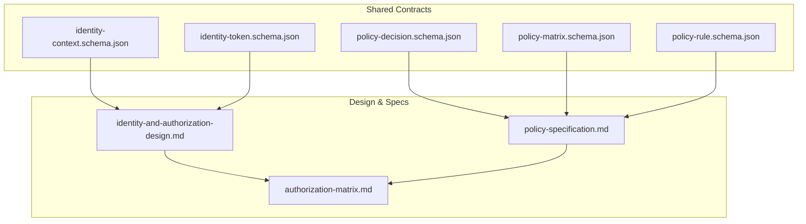
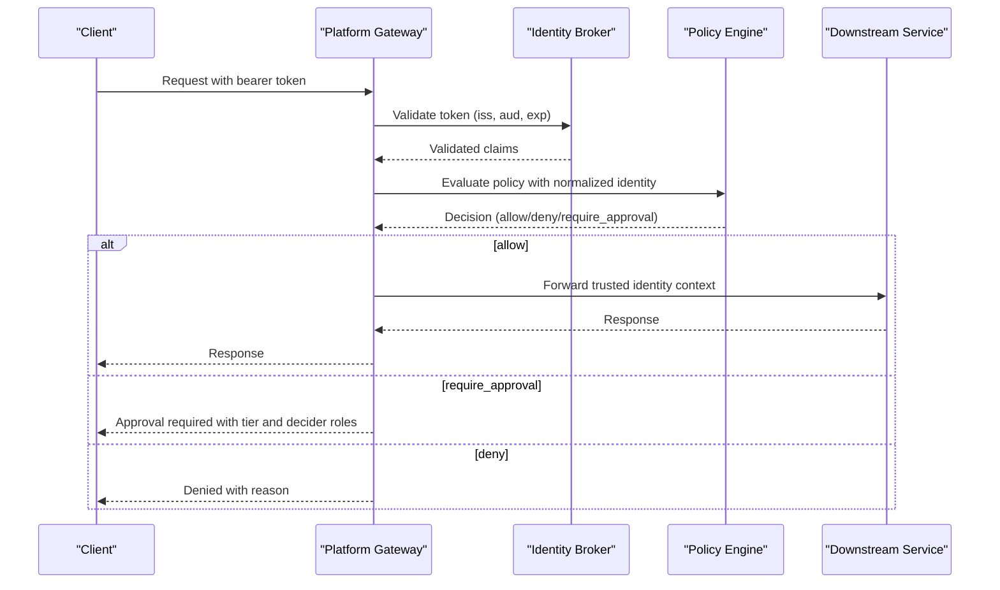
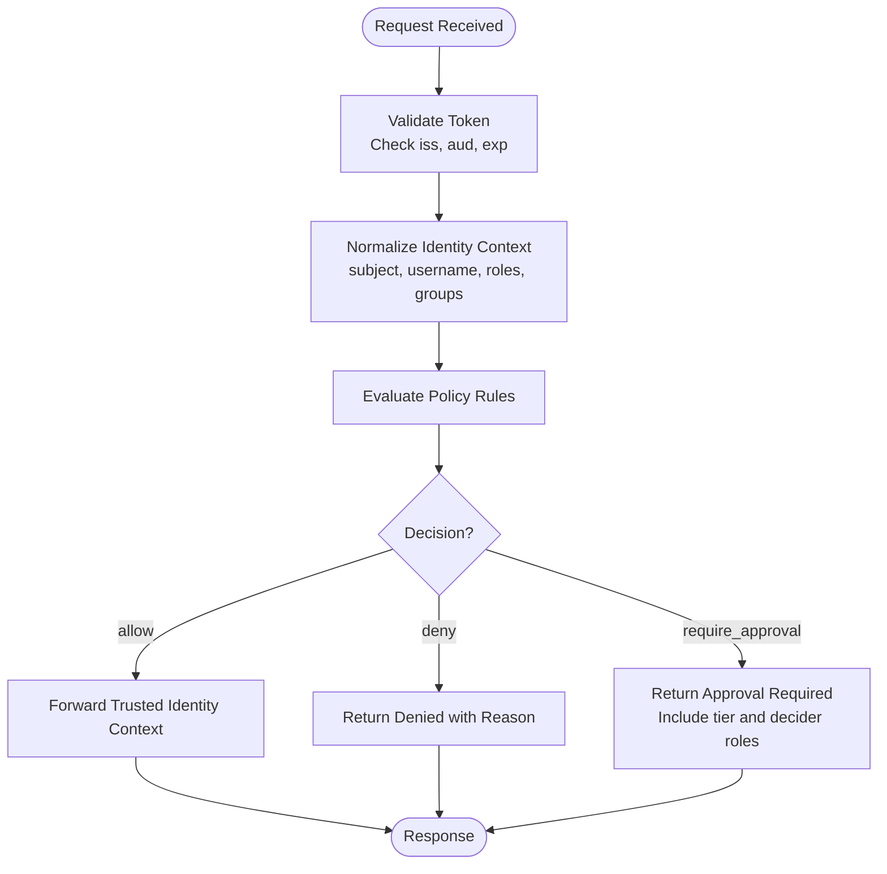
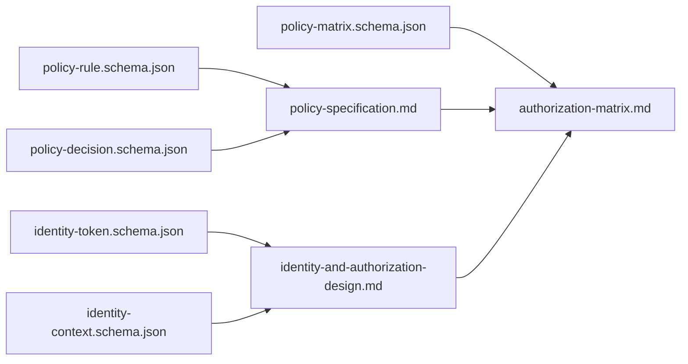

# Identity and Security Schemas

<cite>
**Referenced Files in This Document**
- [identity-context.schema.json](file://shared/shared-contracts/schemas/identity-context.schema.json)
- [identity-token.schema.json](file://shared/shared-contracts/schemas/identity-token.schema.json)
- [policy-decision.schema.json](file://shared/shared-contracts/schemas/policy-decision.schema.json)
- [policy-matrix.schema.json](file://shared/shared-contracts/schemas/policy-matrix.schema.json)
- [policy-rule.schema.json](file://shared/shared-contracts/schemas/policy-rule.schema.json)
- [identity-and-authorization-design.md](file://docs/agentic-aiops-platform/identity-and-authorization-design.md)
- [policy-specification.md](file://docs/agentic-aiops-platform/policy-specification.md)
- [authorization-matrix.md](file://docs/agentic-aiops-platform/authorization-matrix.md)
</cite>

## Table of Contents
1. Introduction
2. Project Structure
3. Core Components
4. Architecture Overview
5. Detailed Component Analysis
6. Dependency Analysis
7. Performance Considerations
8. Troubleshooting Guide
9. Conclusion

## Introduction
This document defines the identity and security schemas that govern authentication, authorization, and policy enforcement across the platform. It covers:
- Identity context schema for carrying user and service identity across service boundaries
- Identity token schema (JWT claims, validation rules, and audience scoping)
- Policy decision, matrix, and rule schemas that define authorization logic, risk assessment, and approval workflows
- Examples of identity propagation, policy evaluation results, and authorization decisions
- Security considerations including token rotation and policy versioning

The goal is to provide a single source of truth for how identities are represented, how tokens are validated, and how policies are evaluated and enforced consistently across services.

## Project Structure
The identity and security surface is defined by shared JSON Schema contracts and design/spec documents:
- Shared schemas under shared/shared-contracts/schemas define the canonical shapes for identity context, identity tokens, and policy artifacts
- Design and specification documents under docs/agentic-aiops-platform describe the intended behavior, roles, tiers, and enforcement model

**Diagram sources**
- [identity-context.schema.json:1-37](file://shared/shared-contracts/schemas/identity-context.schema.json#L1-L37)
- [identity-token.schema.json:1-56](file://shared/shared-contracts/schemas/identity-token.schema.json#L1-L56)
- [policy-decision.schema.json:1-60](file://shared/shared-contracts/schemas/policy-decision.schema.json#L1-L60)
- [policy-matrix.schema.json:1-85](file://shared/shared-contracts/schemas/policy-matrix.schema.json#L1-L85)
- [policy-rule.schema.json:1-105](file://shared/shared-contracts/schemas/policy-rule.schema.json#L1-L105)
- [identity-and-authorization-design.md:1-482](file://docs/agentic-aiops-platform/identity-and-authorization-design.md#L1-L482)
- [policy-specification.md:1-567](file://docs/agentic-aiops-platform/policy-specification.md#L1-L567)
- [authorization-matrix.md:1-528](file://docs/agentic-aiops-platform/authorization-matrix.md#L1-L528)

**Section sources**
- [identity-context.schema.json:1-37](file://shared/shared-contracts/schemas/identity-context.schema.json#L1-L37)
- [identity-token.schema.json:1-56](file://shared/shared-contracts/schemas/identity-token.schema.json#L1-L56)
- [policy-decision.schema.json:1-60](file://shared/shared-contracts/schemas/policy-decision.schema.json#L1-L60)
- [policy-matrix.schema.json:1-85](file://shared/shared-contracts/schemas/policy-matrix.schema.json#L1-L85)
- [policy-rule.schema.json:1-105](file://shared/shared-contracts/schemas/policy-rule.schema.json#L1-L105)
- [identity-and-authorization-design.md:1-482](file://docs/agentic-aiops-platform/identity-and-authorization-design.md#L1-L482)
- [policy-specification.md:1-567](file://docs/agentic-aiops-platform/policy-specification.md#L1-L567)
- [authorization-matrix.md:1-528](file://docs/agentic-aiops-platform/authorization-matrix.md#L1-L528)

## Core Components
- Identity Context: A normalized, transportable representation of who is acting (user or service), including subject, username, email, groups, roles, and optional actor attribution for delegated calls.
- Identity Token: A JWT claim set issued by the identity broker with strict required fields, audience scoping, issuer verification, and optional RFC 8693 actor support for service-to-service delegation.
- Policy Rule: The atomic authorization unit describing match criteria and outcomes (allow, deny, require_approval) with explicit approval tier semantics.
- Policy Decision: The machine-readable result of evaluating rules against a request, including matched rules, reason, and approval details when applicable.
- Policy Matrix: A read-only transparency view of the effective role × action authorization derived from the loaded policy bundle, including approval requirements as an additive third cell state.

These components together enable consistent identity propagation, deterministic policy evaluation, and auditable authorization decisions across service boundaries.

**Section sources**
- [identity-context.schema.json:1-37](file://shared/shared-contracts/schemas/identity-context.schema.json#L1-L37)
- [identity-token.schema.json:1-56](file://shared/shared-contracts/schemas/identity-token.schema.json#L1-L56)
- [policy-rule.schema.json:1-105](file://shared/shared-contracts/schemas/policy-rule.schema.json#L1-L105)
- [policy-decision.schema.json:1-60](file://shared/shared-contracts/schemas/policy-decision.schema.json#L1-L60)
- [policy-matrix.schema.json:1-85](file://shared/shared-contracts/schemas/policy-matrix.schema.json#L1-L85)

## Architecture Overview
The platform separates authentication from authorization and enforces identity-aware policy at the gateway and downstream services. Tokens are validated at the edge; normalized identity flows into policy evaluation; approvals are first-class outcomes; execution proceeds only after allowed or approved decisions.

**Diagram sources**
- [identity-token.schema.json:1-56](file://shared/shared-contracts/schemas/identity-token.schema.json#L1-L56)
- [policy-decision.schema.json:1-60](file://shared/shared-contracts/schemas/policy-decision.schema.json#L1-L60)
- [identity-and-authorization-design.md:1-482](file://docs/agentic-aiops-platform/identity-and-authorization-design.md#L1-L482)
- [policy-specification.md:1-567](file://docs/agentic-aiops-platform/policy-specification.md#L1-L567)

**Section sources**
- [identity-and-authorization-design.md:1-482](file://docs/agentic-aiops-platform/identity-and-authorization-design.md#L1-L482)
- [policy-specification.md:1-567](file://docs/agentic-aiops-platform/policy-specification.md#L1-L567)

## Detailed Component Analysis

### Identity Context Schema
Purpose:
- Normalizes identity across service boundaries
- Carries both human and service attribution where applicable

Key fields:
- subject: unique identifier for the principal
- username: human-readable name used downstream
- email: optional email address
- groups: raw group memberships
- roles: normalized platform roles
- actor: optional acting service identifier for delegated tokens (audit attribution only)

Validation rules:
- Required: subject, username, roles
- Additional properties disallowed
- actor is nullable and present only for delegated contexts

Security notes:
- actor is not used for policy decisions; it is logged for audit attribution
- Roles must be normalized before use in policy evaluation

Example usage:
- Propagate normalized identity from gateway to agent service and tool-gateway
- Include actor when relaying delegated tokens so audits show both human subject and acting service

**Section sources**
- [identity-context.schema.json:1-37](file://shared/shared-contracts/schemas/identity-context.schema.json#L1-L37)
- [identity-and-authorization-design.md:1-482](file://docs/agentic-aiops-platform/identity-and-authorization-design.md#L1-L482)

### Identity Token Schema (JWT Claims)
Purpose:
- Defines the JWT claim set issued by the identity broker and verified by gateways
- Supports two token kinds: portal tokens and delegated tokens

Required claims:
- iss: issuer must match configured identity broker
- sub: unique subject identifier
- username: mapped to downstream headers/contexts
- aud: audience array; each verifying gateway checks its configured audience
- iat/exp: issued-at and expiry timestamps; default TTL documented

Optional/conditional claims:
- email: optional user email
- roles/groups: normalized roles and raw groups
- act: RFC 8693 actor object present only on delegated tokens; used for audit attribution

Validation rules:
- Audience must include the verifying gateway’s configured audience
- Issuer must match configured identity broker
- Expiry must be checked; short-lived tokens reduce replay risk

Token rotation and lifecycle:
- Portal tokens are issued at login/refresh and bound to the gateway audience
- Delegated tokens are minted for service-to-service calls with target audience and actor
- Short TTL encourages refresh and reduces exposure window

**Section sources**
- [identity-token.schema.json:1-56](file://shared/shared-contracts/schemas/identity-token.schema.json#L1-L56)
- [identity-and-authorization-design.md:1-482](file://docs/agentic-aiops-platform/identity-and-authorization-design.md#L1-L482)

### Policy Rule Schema
Purpose:
- Encodes a single authorization rule with match criteria and outcome
- Supports allow, deny, and require_approval with explicit approval tiers

Key fields:
- id: stable unique identifier
- domain: fixed to action_authz for this schema scope
- description: human-readable explanation
- priority: numeric precedence; higher wins within same outcome class
- enabled: whether the rule participates in evaluation
- match: roles_any and actions_any
- decision: outcome and optional approval block

Approval semantics:
- require_approval mandates an approval block with tier and decided_by_roles
- tier_1 allows self-approval by default; tier_2 forbids self-approval by default
- allow_with_conditions is reserved for future revisions

Evaluation precedence:
- deny overrides require_approval and allow
- require_approval overrides allow
- Among same outcome classes, higher priority wins

**Section sources**
- [policy-rule.schema.json:1-105](file://shared/shared-contracts/schemas/policy-rule.schema.json#L1-L105)
- [policy-specification.md:1-567](file://docs/agentic-aiops-platform/policy-specification.md#L1-L567)

### Policy Decision Schema
Purpose:
- Returns the final outcome of policy evaluation with matched rules and reasons
- Includes approval details when require_approval is triggered

Key fields:
- decision: allow, deny, or require_approval
- matched_rule_ids: identifiers of matching rules
- reason: human-readable explanation
- action: the evaluated action
- subject: principal subject
- approval_tier: tier_1 or tier_2 when require_approval
- approval: mirror of winning rule’s approval block (tier, decided_by_roles, optional allow_self_approval)

Behavior:
- deny is the default when no rule matches
- require_approval activates previously reserved approval_tier and includes approval metadata

**Section sources**
- [policy-decision.schema.json:1-60](file://shared/shared-contracts/schemas/policy-decision.schema.json#L1-L60)
- [policy-specification.md:1-567](file://docs/agentic-aiops-platform/policy-specification.md#L1-L567)

### Policy Matrix Schema
Purpose:
- Read-only transparency surface showing effective role × action permissions
- Reflects the currently loaded policy bundle with provenance

Key fields:
- version: bundle version
- source: configured or packaged-default
- sha256: load-time digest of the exact bundle text
- scope: full (platform-admin) or own (other roles)
- roles: roles included in response
- actions: action catalog
- matrix: boolean allow/not-immediately-allowed per role × action
- approval_requirements: additive third cell state for require_approval cells, including tier, decider roles, and matched rule id

Usage:
- UI surfaces render granted permissions based on the live matrix
- Cells answering require_approval appear as false in matrix but detailed in approval_requirements

**Section sources**
- [policy-matrix.schema.json:1-85](file://shared/shared-contracts/schemas/policy-matrix.schema.json#L1-L85)
- [authorization-matrix.md:1-528](file://docs/agentic-aiops-platform/authorization-matrix.md#L1-L528)

### Identity Propagation Flow
End-to-end flow from client to downstream services:

**Diagram sources**
- [identity-token.schema.json:1-56](file://shared/shared-contracts/schemas/identity-token.schema.json#L1-L56)
- [identity-context.schema.json:1-37](file://shared/shared-contracts/schemas/identity-context.schema.json#L1-L37)
- [policy-decision.schema.json:1-60](file://shared/shared-contracts/schemas/policy-decision.schema.json#L1-L60)
- [policy-specification.md:1-567](file://docs/agentic-aiops-platform/policy-specification.md#L1-L567)

**Section sources**
- [identity-and-authorization-design.md:1-482](file://docs/agentic-aiops-platform/identity-and-authorization-design.md#L1-L482)
- [policy-specification.md:1-567](file://docs/agentic-aiops-platform/policy-specification.md#L1-L567)

### Authorization Decisions and Examples
- Allow example: An authenticated operator requests a read-only action in dev/test/staging/prod and receives allow with matched rule ids and reason.
- Require approval example: An operator requests a production restart and receives require_approval with tier_2 and decider roles approver/platform-admin; the caller must proceed through the approval workflow.
- Deny example: Any role attempts a destructive action and receives deny with reason indicating default denial.

These examples align with the decision schema fields and the policy specification’s evaluation order and precedence rules.

**Section sources**
- [policy-decision.schema.json:1-60](file://shared/shared-contracts/schemas/policy-decision.schema.json#L1-L60)
- [policy-specification.md:1-567](file://docs/agentic-aiops-platform/policy-specification.md#L1-L567)
- [authorization-matrix.md:1-528](file://docs/agentic-aiops-platform/authorization-matrix.md#L1-L528)

## Dependency Analysis
Relationships between schemas and design/specs:

**Diagram sources**
- [identity-token.schema.json:1-56](file://shared/shared-contracts/schemas/identity-token.schema.json#L1-L56)
- [identity-context.schema.json:1-37](file://shared/shared-contracts/schemas/identity-context.schema.json#L1-L37)
- [policy-rule.schema.json:1-105](file://shared/shared-contracts/schemas/policy-rule.schema.json#L1-L105)
- [policy-decision.schema.json:1-60](file://shared/shared-contracts/schemas/policy-decision.schema.json#L1-L60)
- [policy-matrix.schema.json:1-85](file://shared/shared-contracts/schemas/policy-matrix.schema.json#L1-L85)
- [identity-and-authorization-design.md:1-482](file://docs/agentic-aiops-platform/identity-and-authorization-design.md#L1-L482)
- [policy-specification.md:1-567](file://docs/agentic-aiops-platform/policy-specification.md#L1-L567)
- [authorization-matrix.md:1-528](file://docs/agentic-aiops-platform/authorization-matrix.md#L1-L528)

**Section sources**
- [identity-token.schema.json:1-56](file://shared/shared-contracts/schemas/identity-token.schema.json#L1-L56)
- [identity-context.schema.json:1-37](file://shared/shared-contracts/schemas/identity-context.schema.json#L1-L37)
- [policy-rule.schema.json:1-105](file://shared/shared-contracts/schemas/policy-rule.schema.json#L1-L105)
- [policy-decision.schema.json:1-60](file://shared/shared-contracts/schemas/policy-decision.schema.json#L1-L60)
- [policy-matrix.schema.json:1-85](file://shared/shared-contracts/schemas/policy-matrix.schema.json#L1-L85)
- [identity-and-authorization-design.md:1-482](file://docs/agentic-aiops-platform/identity-and-authorization-design.md#L1-L482)
- [policy-specification.md:1-567](file://docs/agentic-aiops-platform/policy-specification.md#L1-L567)
- [authorization-matrix.md:1-528](file://docs/agentic-aiops-platform/authorization-matrix.md#L1-L528)

## Performance Considerations
- Keep identity context minimal and normalized to reduce payload size and parsing overhead
- Cache policy bundles and precompute matrices where appropriate to avoid repeated evaluation
- Use short-lived tokens to limit cryptographic operations and reduce storage of long-lived secrets
- Prefer deterministic rule ordering and early exits for deny-by-default to minimize evaluation cost

[No sources needed since this section provides general guidance]

## Troubleshooting Guide
Common issues and resolutions:
- Invalid issuer: Ensure the token’s iss matches the configured identity broker; misconfiguration leads to immediate rejection
- Audience mismatch: Verify aud includes the verifying gateway’s audience; cross-service replay is prevented by audience binding
- Expired token: Check exp and implement refresh flows; short TTLs reduce risk but require robust refresh handling
- Missing required fields: Validate identity context requires subject, username, roles; missing fields cause normalization failures
- Policy mismatches: Review matched_rule_ids and reason in decision responses; adjust roles/actions or priorities accordingly
- Approval blocked: For tier_2, ensure the requester is not self-approving; confirm decider roles have authority

Operational checks:
- Inspect policy matrix to verify effective permissions for the current bundle
- Compare bundle sha256 to intended canonical file to ensure correct deployment
- Audit logs should record both human subject and acting service for delegated calls

**Section sources**
- [identity-token.schema.json:1-56](file://shared/shared-contracts/schemas/identity-token.schema.json#L1-L56)
- [identity-context.schema.json:1-37](file://shared/shared-contracts/schemas/identity-context.schema.json#L1-L37)
- [policy-decision.schema.json:1-60](file://shared/shared-contracts/schemas/policy-decision.schema.json#L1-L60)
- [policy-matrix.schema.json:1-85](file://shared/shared-contracts/schemas/policy-matrix.schema.json#L1-L85)

## Conclusion
The identity and security schemas provide a clear, enforceable foundation for authentication, authorization, and policy-driven approvals:
- Identity context normalizes and propagates trust across boundaries
- Identity tokens bind identity to audiences and issuers with short lifetimes
- Policy rules encode precise authorization logic with explicit approval tiers
- Policy decisions return actionable outcomes with matched rules and reasons
- Policy matrix offers transparent, versioned visibility into enforced permissions

Adhering to these schemas ensures consistent, auditable, and secure behavior across the platform while supporting enterprise-grade operational workflows.

[No sources needed since this section summarizes without analyzing specific files]