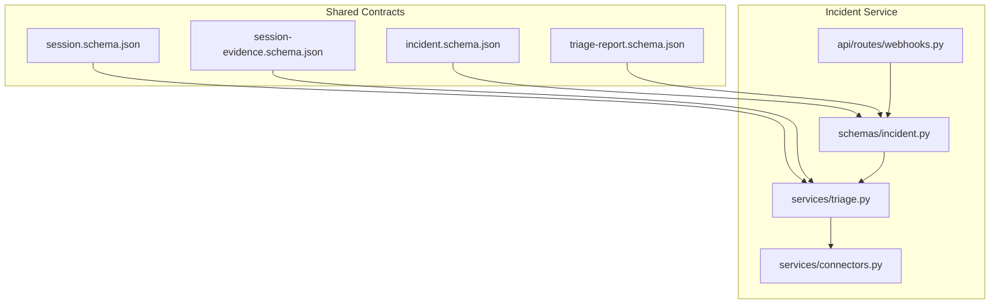
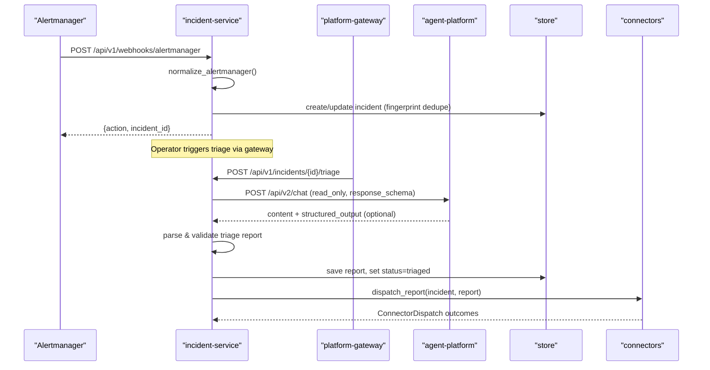
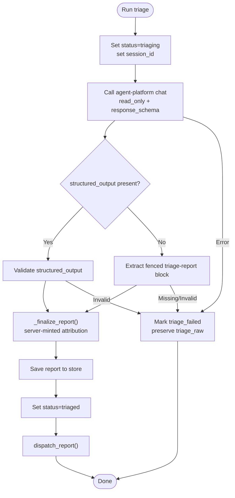
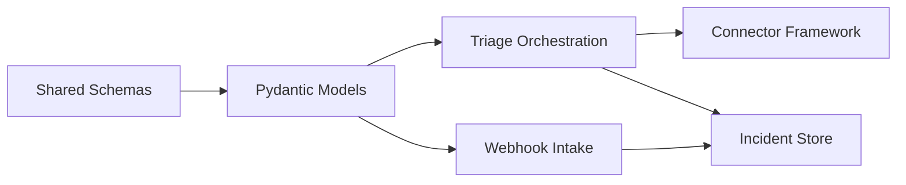

# Incident Data Schemas

<cite>
**Referenced Files in This Document**
- [incident.schema.json](file://shared/shared-contracts/schemas/incident.schema.json)
- [triage-report.schema.json](file://shared/shared-contracts/schemas/triage-report.schema.json)
- [session-evidence.schema.json](file://shared/shared-contracts/schemas/session-evidence.schema.json)
- [session.schema.json](file://shared/shared-contracts/schemas/session.schema.json)
- [incident.py](file://products/incident-service/src/incident_service/schemas/incident.py)
- [triage.py](file://products/incident-service/src/incident_service/services/triage.py)
- [webhooks.py](file://products/incident-service/src/incident_service/api/routes/webhooks.py)
- [connectors.py](file://products/incident-service/src/incident_service/services/connectors.py)
- [SPEC-015 spec.md](file://docs/specs/SPEC-015-incident-triage-and-collaboration/spec.md)
</cite>

## Table of Contents
1. Introduction
2. Project Structure
3. Core Components
4. Architecture Overview
5. Detailed Component Analysis
6. Dependency Analysis
7. Performance Considerations
8. Troubleshooting Guide
9. Conclusion
10. Appendices

## Introduction
This document defines the incident data schemas that standardize alert intake, triage reporting, and incident collaboration across the platform. It covers:
- The canonical incident envelope for alert sources, severity levels, timestamps, and correlation identifiers
- The triage report schema capturing agent investigation results, findings, hypotheses, and recommended actions
- Examples of incoming alerts, triage reports, and incident status updates
- Relationships between incidents and sessions, evidence linking, and collaboration features

The design ensures a single source of truth for incident state, durable auditability, and operator-driven triage with read-only tooling.

## Project Structure
Incident-related contracts and implementation are split between shared schemas and product code:
- Shared JSON schemas define the canonical shapes used by all services
- Incident-service implements intake, triage orchestration, storage, and collaboration dispatch
- Session and session evidence schemas link triage conversations and tool evidence to incidents

**Diagram sources**
- [incident.schema.json:1-95](file://shared/shared-contracts/schemas/incident.schema.json#L1-L95)
- [triage-report.schema.json:1-120](file://shared/shared-contracts/schemas/triage-report.schema.json#L1-L120)
- [session.schema.json:1-26](file://shared/shared-contracts/schemas/session.schema.json#L1-L26)
- [session-evidence.schema.json:1-58](file://shared/shared-contracts/schemas/session-evidence.schema.json#L1-L58)
- [incident.py:1-116](file://products/incident-service/src/incident_service/schemas/incident.py#L1-L116)
- [triage.py:1-371](file://products/incident-service/src/incident_service/services/triage.py#L1-L371)
- [webhooks.py:1-206](file://products/incident-service/src/incident_service/api/routes/webhooks.py#L1-L206)
- [connectors.py:1-127](file://products/incident-service/src/incident_service/services/connectors.py#L1-L127)

**Section sources**
- [incident.schema.json:1-95](file://shared/shared-contracts/schemas/incident.schema.json#L1-L95)
- [triage-report.schema.json:1-120](file://shared/shared-contracts/schemas/triage-report.schema.json#L1-L120)
- [incident.py:1-116](file://products/incident-service/src/incident_service/schemas/incident.py#L1-L116)
- [triage.py:1-371](file://products/incident-service/src/incident_service/services/triage.py#L1-L371)
- [webhooks.py:1-206](file://products/incident-service/src/incident_service/api/routes/webhooks.py#L1-L206)
- [connectors.py:1-127](file://products/incident-service/src/incident_service/services/connectors.py#L1-L127)

## Core Components
- Incident envelope: Canonical record for each normalized alert group or manual report, including deduplication fingerprint, source, severity, lifecycle status, human-readable title/summary, labels, timestamps, and optional fields for session linkage and raw triage text on failure.
- Triage report: Structured output from an agent run containing summary, severity assessment, evidence references, ranked hypotheses, advisory next steps, cited skills, session attribution, and server-minted timestamps and operator identity.
- Sessions and evidence: Dedicated per-incident sessions store conversation context; session evidence captures tool call/result frames for replay and audit.

Key attributes and constraints:
- Incident fields include globally unique id, fingerprint (dedupe key), source enum, severity enum, lifecycle status enum, title, summary, labels map, optional reporter, session_id, triage_raw, created_at/updated_at/resolved_at timestamps.
- Triage report fields include incident_id, summary, severity_assessment, evidence list (source + description), hypotheses list, next_steps list (title, rationale, priority), skills_cited list, session_id, generated_at, generated_by.
- Session evidence includes turn_index, request_id, created_at, and ordered frames with optional truncation markers.

**Section sources**
- [incident.schema.json:1-95](file://shared/shared-contracts/schemas/incident.schema.json#L1-L95)
- [triage-report.schema.json:1-120](file://shared/shared-contracts/schemas/triage-report.schema.json#L1-L120)
- [session-evidence.schema.json:1-58](file://shared/shared-contracts/schemas/session-evidence.schema.json#L1-L58)
- [incident.py:18-116](file://products/incident-service/src/incident_service/schemas/incident.py#L18-L116)

## Architecture Overview
End-to-end flow from alert intake through triage and collaboration:

**Diagram sources**
- [webhooks.py:69-206](file://products/incident-service/src/incident_service/api/routes/webhooks.py#L69-L206)
- [triage.py:122-371](file://products/incident-service/src/incident_service/services/triage.py#L122-L371)
- [connectors.py:87-127](file://products/incident-service/src/incident_service/services/connectors.py#L87-L127)
- [SPEC-015 spec.md:77-206](file://docs/specs/SPEC-015-incident-triage-and-collaboration/spec.md#L77-L206)

## Detailed Component Analysis

### Incident Envelope Schema
- Purpose: Canonical representation of an incident created from Alertmanager webhooks or manual operator reports.
- Correlation identifier: fingerprint is the dedupe key (Alertmanager groupKey or stable hash of label set).
- Source: Enumerated intake channel (alertmanager or manual).
- Severity: Normalized to critical, warning, or info; webhook intake maps Alertmanager severity with a default.
- Lifecycle status: new → triaging → triaged | triage_failed; resolved is terminal.
- Timestamps: created_at, updated_at, and optional resolved_at in RFC 3339 UTC.
- Optional linkage: session_id appears after triage runs; triage_raw preserves raw agent reply when validation fails.

Example usage patterns:
- Webhook firing creates a new incident with status new and sets created_at/updated_at.
- Subsequent firing updates severity/title/summary/labels and updated_at without creating duplicates.
- Resolved payload marks status resolved and sets resolved_at.

**Section sources**
- [incident.schema.json:1-95](file://shared/shared-contracts/schemas/incident.schema.json#L1-L95)
- [incident.py:18-63](file://products/incident-service/src/incident_service/schemas/incident.py#L18-L63)
- [webhooks.py:69-206](file://products/incident-service/src/incident_service/api/routes/webhooks.py#L69-L206)

### Triage Report Schema
- Purpose: Captures agent investigation results during operator-initiated triage.
- Required fields: incident_id, summary, severity_assessment, evidence, hypotheses, next_steps, skills_cited, session_id, generated_at, generated_by.
- Evidence: Provenance references with source and description; bounded to prevent abuse.
- Hypotheses: Ranked likely causes, most likely first.
- Next steps: Advisory recommendations with title, rationale, and priority; not executed in R3.
- Attribution: Server-minted session_id, generated_at, generated_by to prevent spoofing.

Example usage patterns:
- Agent returns either structured_output or a fenced triage-report block; both paths are validated against the schema.
- On success, the report is stored and incident status becomes triaged.
- On failure, incident status becomes triage_failed and raw agent text is preserved for inspection.

**Section sources**
- [triage-report.schema.json:1-120](file://shared/shared-contracts/schemas/triage-report.schema.json#L1-L120)
- [incident.py:66-103](file://products/incident-service/src/incident_service/schemas/incident.py#L66-L103)
- [triage.py:139-186](file://products/incident-service/src/incident_service/services/triage.py#L139-L186)
- [triage.py:290-371](file://products/incident-service/src/incident_service/services/triage.py#L290-L371)

### Sessions and Evidence Linking
- Dedicated session per incident: session_id_for(incident_id) produces a deterministic session name for triage continuity.
- Per-operator fallback: if the primary session is owned by another operator, a per-operator suffix is tried to enable re-triage.
- Session evidence: Each assistant turn’s tool interactions are persisted as frames with optional truncation markers; these support replay and audit.

Relationship to incidents:
- After triage starts, incident.session_id points to the dedicated session used.
- Evidence turns correlate with audit trail via request_id and can be surfaced alongside incident details.

**Section sources**
- [triage.py:99-119](file://products/incident-service/src/incident_service/services/triage.py#L99-L119)
- [triage.py:189-216](file://products/incident-service/src/incident_service/services/triage.py#L189-L216)
- [session.schema.json:1-26](file://shared/shared-contracts/schemas/session.schema.json#L1-L26)
- [session-evidence.schema.json:1-58](file://shared/shared-contracts/schemas/session-evidence.schema.json#L1-L58)

### Collaboration and Dispatch
- Connector framework: Pluggable adapters implement a common protocol to push triage reports onto collaboration surfaces.
- Built-in connector: Audit sink emits structured events carrying incident envelope highlights and report summaries.
- Isolation: Connector failures do not fail triage; outcomes are recorded per incident with status and optional reference/error.

Operational notes:
- Connectors are selected via configuration; unknown names fail startup fast.
- Dispatch outcomes are persisted and queryable alongside the incident.

**Section sources**
- [connectors.py:1-127](file://products/incident-service/src/incident_service/services/connectors.py#L1-L127)
- [SPEC-015 spec.md:183-206](file://docs/specs/SPEC-015-incident-triage-and-collaboration/spec.md#L183-L206)

### Alert Intake Flow
- Authentication: Webhook endpoint requires a bearer token configured at service level; missing or mismatched token returns unauthorized.
- Normalization: Alert payloads are normalized into the canonical incident model; malformed payloads return bad request.
- Deduplication: Existing open incidents with matching fingerprint are updated; resolved payloads mark incidents resolved.
- Idempotency: Resolving an unknown fingerprint is a no-op success.

**Section sources**
- [webhooks.py:1-206](file://products/incident-service/src/incident_service/api/routes/webhooks.py#L1-L206)

### Triage Orchestration Flow
- Prompt construction: Builds a prompt with incident context, triage discipline, and output format requirements.
- Agent call: Calls agent-platform chat with read_only mode and response_schema for structured output; falls back to fenced block parsing.
- Validation: Forces server-known attribution and validates against the triage report schema; rejects non-conforming reports.
- Outcome handling: Success stores report and sets status triaged; failure sets status triage_failed and preserves raw text.

**Diagram sources**
- [triage.py:122-186](file://products/incident-service/src/incident_service/services/triage.py#L122-L186)
- [triage.py:290-371](file://products/incident-service/src/incident_service/services/triage.py#L290-L371)

**Section sources**
- [triage.py:122-371](file://products/incident-service/src/incident_service/services/triage.py#L122-L371)

## Dependency Analysis
- Incident-service depends on shared schemas for contract enforcement and on agent-platform for triage execution.
- Triage relies on session management and evidence persistence to maintain context and auditability.
- Connectors depend on configuration and registry to select and instantiate collaboration adapters.

**Diagram sources**
- [incident.schema.json:1-95](file://shared/shared-contracts/schemas/incident.schema.json#L1-L95)
- [triage-report.schema.json:1-120](file://shared/shared-contracts/schemas/triage-report.schema.json#L1-L120)
- [incident.py:1-116](file://products/incident-service/src/incident_service/schemas/incident.py#L1-L116)
- [triage.py:1-371](file://products/incident-service/src/incident_service/services/triage.py#L1-L371)
- [webhooks.py:1-206](file://products/incident-service/src/incident_service/api/routes/webhooks.py#L1-L206)
- [connectors.py:1-127](file://products/incident-service/src/incident_service/services/connectors.py#L1-L127)

**Section sources**
- [incident.py:1-116](file://products/incident-service/src/incident_service/schemas/incident.py#L1-L116)
- [triage.py:1-371](file://products/incident-service/src/incident_service/services/triage.py#L1-L371)
- [webhooks.py:1-206](file://products/incident-service/src/incident_service/api/routes/webhooks.py#L1-L206)
- [connectors.py:1-127](file://products/incident-service/src/incident_service/services/connectors.py#L1-L127)

## Performance Considerations
- Deduplication by fingerprint avoids duplicate incidents and reduces storage growth.
- Bounded arrays in triage report (evidence, hypotheses, next_steps, skills_cited) limit payload size and processing overhead.
- Read-only triage mode prevents expensive or risky operations during investigation.
- Connector isolation ensures downstream failures do not block triage completion.

[No sources needed since this section provides general guidance]

## Troubleshooting Guide
Common issues and resolutions:
- Webhook authentication failure: Ensure INCIDENT_WEBHOOK_TOKEN is configured and matches the presented bearer token; otherwise requests are rejected.
- Malformed alert payload: Normalize step validates input; invalid JSON or missing fields result in a bad request response.
- Triage parse/validation failure: If structured_output is absent or the fenced block is invalid, the incident is marked triage_failed and raw agent text is preserved for inspection.
- Session ownership conflicts: If the primary session is owned by another operator, a per-operator fallback session is used automatically.
- Connector dispatch failure: Outcomes are recorded but do not affect triage status; inspect connector logs and dispatch records for errors.

**Section sources**
- [webhooks.py:57-102](file://products/incident-service/src/incident_service/api/routes/webhooks.py#L57-L102)
- [triage.py:139-186](file://products/incident-service/src/incident_service/services/triage.py#L139-L186)
- [triage.py:279-349](file://products/incident-service/src/incident_service/services/triage.py#L279-L349)
- [connectors.py:87-127](file://products/incident-service/src/incident_service/services/connectors.py#L87-L127)

## Conclusion
The incident data schemas provide a robust foundation for standardized alert intake, triage reporting, and collaboration. The incident envelope captures essential metadata and lifecycle state, while the triage report enforces grounded, evidence-backed investigations with clear next steps. Sessions and evidence ensure traceability and replayability. The connector framework enables extensible collaboration without compromising triage reliability. Together, these components deliver a coherent, auditable workflow for incident management.

[No sources needed since this section summarizes without analyzing specific files]

## Appendices

### Example Incoming Alerts (Conceptual)
- Alertmanager firing: Creates a new incident with status new, normalizes severity and labels, sets created_at/updated_at.
- Alertmanager update: Updates existing open incident’s severity/title/summary/labels and updated_at.
- Alertmanager resolution: Marks matching open incident resolved and sets resolved_at.

[No sources needed since this section describes conceptual workflows]

### Example Triage Reports (Conceptual)
- Successful triage: Returns structured_output or fenced block with summary, severity_assessment, evidence, hypotheses, next_steps, skills_cited, session_id, generated_at, generated_by; incident becomes triaged.
- Failed triage: Invalid or missing report leads to triage_failed with triage_raw preserved for debugging.

[No sources needed since this section describes conceptual workflows]

### Example Status Updates (Conceptual)
- new → triaging: When triage starts.
- triaging → triaged: On successful report validation and storage.
- triaging → triage_failed: On parse/validation or agent-call failure.
- any → resolved: On Alertmanager resolved payload.

[No sources needed since this section describes conceptual workflows]