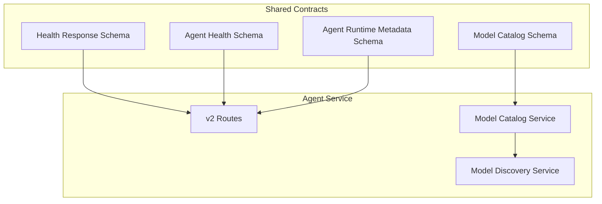
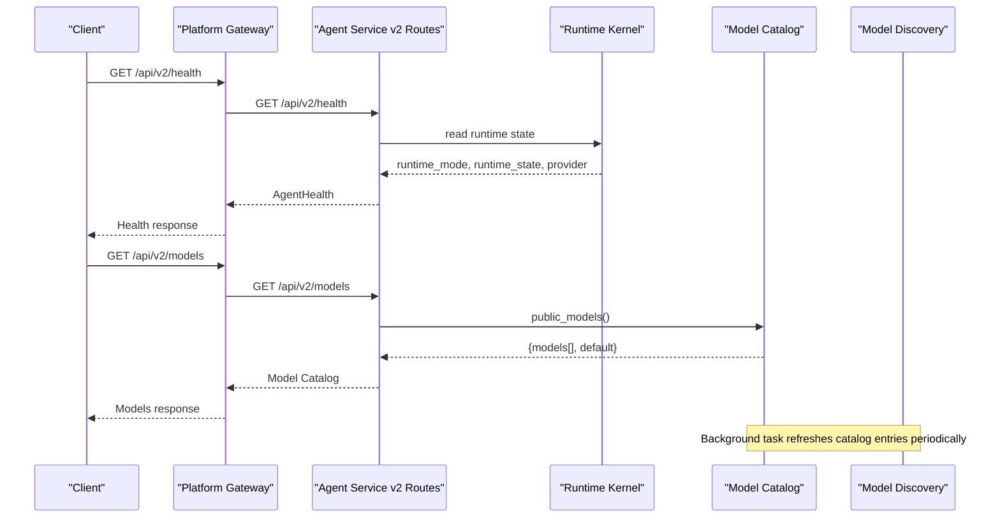
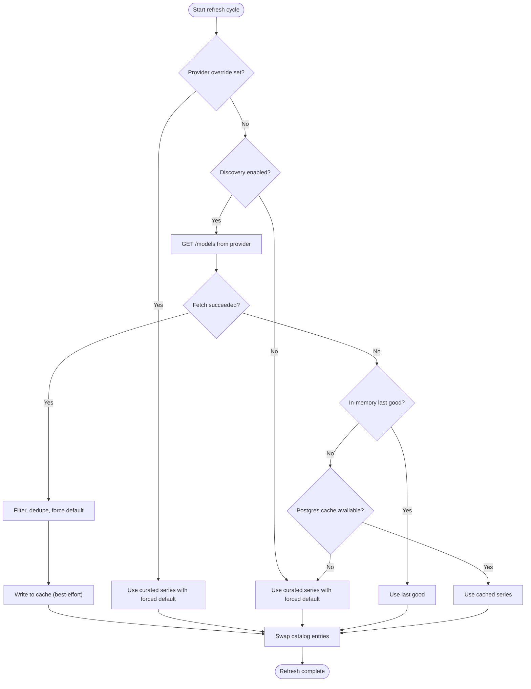
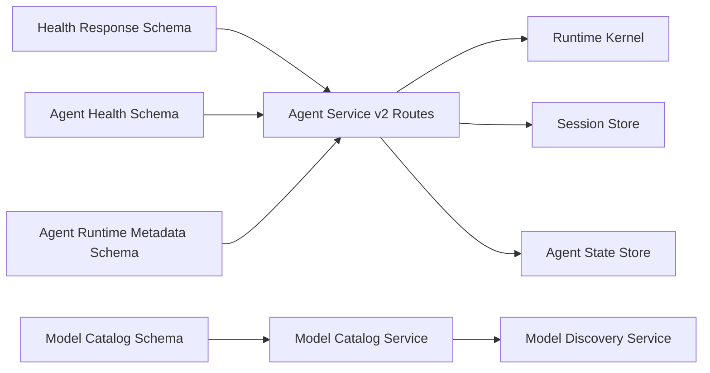

# Platform Metadata Schemas

<cite>
**Referenced Files in This Document**
- [health-response.schema.json](file://shared/shared-contracts/schemas/health-response.schema.json)
- [agent-health.schema.json](file://shared/shared-contracts/schemas/agent-health.schema.json)
- [agent-runtime-metadata.schema.json](file://shared/shared-contracts/schemas/agent-runtime-metadata.schema.json)
- [model-catalog.schema.json](file://shared/shared-contracts/schemas/model-catalog.schema.json)
- [routes.py](file://products/agent-platform/src/agent_service/api/v2/routes.py)
- [metadata.py](file://products/agent-platform/src/agent_service/metadata.py)
- [metadata.py](file://products/platform-gateway/src/platform_gateway/metadata.py)
- [model_catalog.py](file://products/agent-platform/src/agent_service/services/model_catalog.py)
- [model_discovery.py](file://products/agent-platform/src/agent_service/services/model_discovery.py)
</cite>

## Table of Contents
1. Introduction
2. Project Structure
3. Core Components
4. Architecture Overview
5. Detailed Component Analysis
6. Dependency Analysis
7. Performance Considerations
8. Troubleshooting Guide
9. Conclusion

## Introduction
This document describes the platform metadata schemas that power health checks, runtime information, and system capabilities for the agent service and related components. It focuses on:
- Health check schemas used by orchestrators and the gateway for liveness/readiness probes.
- Agent runtime metadata schema exposing kernel mode, provider state, model identity, and configuration hints.
- Model catalog schema describing available LLM providers, selectable models, defaults, and switching behavior.
- Examples of responses and queries for monitoring integration and operational visibility.

## Project Structure
The schemas are defined under shared contracts and consumed by the agent-service API layer and services. The agent-service exposes v2 endpoints for health and runtime metadata, and a credential-gated model catalog with live discovery support.

**Diagram sources**
- [health-response.schema.json:1-21](file://shared/shared-contracts/schemas/health-response.schema.json#L1-L21)
- [agent-health.schema.json:1-69](file://shared/shared-contracts/schemas/agent-health.schema.json#L1-L69)
- [agent-runtime-metadata.schema.json:1-37](file://shared/shared-contracts/schemas/agent-runtime-metadata.schema.json#L1-L37)
- [model-catalog.schema.json:1-43](file://shared/shared-contracts/schemas/model-catalog.schema.json#L1-L43)
- [routes.py:1800-1856](file://products/agent-platform/src/agent_service/api/v2/routes.py#L1800-L1856)
- [model_catalog.py:225-331](file://products/agent-platform/src/agent_service/services/model_catalog.py#L225-L331)
- [model_discovery.py:202-299](file://products/agent-platform/src/agent_service/services/model_discovery.py#L202-L299)

**Section sources**
- [health-response.schema.json:1-21](file://shared/shared-contracts/schemas/health-response.schema.json#L1-L21)
- [agent-health.schema.json:1-69](file://shared/shared-contracts/schemas/agent-health.schema.json#L1-L69)
- [agent-runtime-metadata.schema.json:1-37](file://shared/shared-contracts/schemas/agent-runtime-metadata.schema.json#L1-L37)
- [model-catalog.schema.json:1-43](file://shared/shared-contracts/schemas/model-catalog.schema.json#L1-L43)
- [routes.py:1800-1856](file://products/agent-platform/src/agent_service/api/v2/routes.py#L1800-L1856)
- [model_catalog.py:225-331](file://products/agent-platform/src/agent_service/services/model_catalog.py#L225-L331)
- [model_discovery.py:202-299](file://products/agent-platform/src/agent_service/services/model_discovery.py#L202-L299)

## Core Components
- Health response envelope: A minimal, versioned health envelope used across services.
- Agent health (v2): Readiness probe for the agent service including runtime mode, provider state, session store status, and tech-stack versions.
- Agent runtime metadata (v2): Kernel state surface without framework internals; includes provider, model name, hint, and last error.
- Model catalog (v2): Credential-gated list of selectable models per provider, default selection, and discovery-safe fields.

Key implementation points:
- Agent service v2 routes implement /api/v2/health and /api/v2/runtime using the above schemas.
- Model catalog is built from environment-driven provider credentials and supports live discovery to refresh model series at runtime.
- Service metadata constants provide service names and versions for inventory and telemetry.

**Section sources**
- [health-response.schema.json:1-21](file://shared/shared-contracts/schemas/health-response.schema.json#L1-L21)
- [agent-health.schema.json:1-69](file://shared/shared-contracts/schemas/agent-health.schema.json#L1-L69)
- [agent-runtime-metadata.schema.json:1-37](file://shared/shared-contracts/schemas/agent-runtime-metadata.schema.json#L1-L37)
- [model-catalog.schema.json:1-43](file://shared/shared-contracts/schemas/model-catalog.schema.json#L1-L43)
- [routes.py:1800-1856](file://products/agent-platform/src/agent_service/api/v2/routes.py#L1800-L1856)
- [metadata.py:1-12](file://products/agent-platform/src/agent_service/metadata.py#L1-L12)
- [metadata.py:1-6](file://products/platform-gateway/src/platform_gateway/metadata.py#L1-L6)

## Architecture Overview
The agent-service exposes standardized metadata endpoints backed by the runtime kernel and services. The model catalog is constructed from configured providers and can be refreshed via live discovery.

**Diagram sources**
- [routes.py:1800-1856](file://products/agent-platform/src/agent_service/api/v2/routes.py#L1800-L1856)
- [model_catalog.py:285-293](file://products/agent-platform/src/agent_service/services/model_catalog.py#L285-L293)
- [model_discovery.py:272-289](file://products/agent-platform/src/agent_service/services/model_discovery.py#L272-L289)

## Detailed Component Analysis

### Health Check Schemas and Endpoints
- Health response envelope defines a minimal object with status, service, and optional version fields.
- Agent health (v2) defines readiness semantics, runtime mode/state, provider, configuration flag, session store details, and informational tech-stack versions.
- Agent service implements GET /api/v2/health returning an AgentHealth object derived from the runtime kernel and stores.

Operational guidance:
- Use /api/v2/health for readiness probes; status indicates whether the kernel has valid credentials and dependencies are reachable.
- Inspect session_store_ready and agent_state_ready to validate backends.
- Use python_version, fastapi_version, agentscope_version for inventory and compatibility checks.

Example health response shape (described):
- status: "ready" or "not_ready"
- runtime_mode: string identifier
- runtime_state: "ready", "not_configured", or "provider_error"
- provider: active provider name
- configured: boolean indicating valid credentials
- session_store: backend type
- session_store_ready: boolean reachability
- agent_state: backend type
- agent_state_ready: boolean reachability
- python_version, fastapi_version, agentscope_version: strings or null
- session_store_version, agent_state_version: server versions when available

**Section sources**
- [health-response.schema.json:1-21](file://shared/shared-contracts/schemas/health-response.schema.json#L1-L21)
- [agent-health.schema.json:1-69](file://shared/shared-contracts/schemas/agent-health.schema.json#L1-L69)
- [routes.py:1812-1856](file://products/agent-platform/src/agent_service/api/v2/routes.py#L1812-L1856)

### Agent Runtime Metadata Endpoint
- GET /api/v2/runtime returns AgentRuntimeMetadata with runtime_mode, runtime_state, provider, model_name, hint, and last_error.
- The route composes these values from kernel metadata and normalizes types to conform to the schema.

Operational guidance:
- Monitor runtime_state to detect not_configured or provider_error conditions.
- Use hint and last_error for diagnostics during outages.
- model_name shows the resolved model identity for the current runtime.

Example runtime metadata query and response shape (described):
- runtime_mode: e.g., "agentscope"
- runtime_state: "ready", "not_configured", "provider_error"
- provider: e.g., "dashscope", "deepseek", "openai"
- model_name: resolved model id
- hint: human-readable status hint
- last_error: last provider error message or null

**Section sources**
- [agent-runtime-metadata.schema.json:1-37](file://shared/shared-contracts/schemas/agent-runtime-metadata.schema.json#L1-L37)
- [routes.py:1800-1807](file://products/agent-platform/src/agent_service/api/v2/routes.py#L1800-L1807)

### Model Catalog Schema and Discovery
- Model catalog (v2) returns a credential-gated list of selectable models and the default model id.
- Each model entry includes id (the model name), label, provider enum, and default flag.
- The catalog is built from environment-configured providers and can be refreshed via live discovery.

Discovery flow:
- Periodically fetch each provider’s /models endpoint behind a fail-soft ladder.
- Cache last-good results in memory and optionally persist to Postgres.
- Apply per-provider filters, deduplication, and force-include of the default model.
- Swap catalog contents atomically so readers always see a consistent snapshot.

**Diagram sources**
- [model_discovery.py:233-289](file://products/agent-platform/src/agent_service/services/model_discovery.py#L233-L289)
- [model_catalog.py:225-331](file://products/agent-platform/src/agent_service/services/model_catalog.py#L225-L331)

Example model discovery result shape (described):
- models: array of objects with id, label, provider, default
- default: model id string or null

Switching capabilities:
- Requests may select a model by id; unknown ids fail closed with validation errors.
- Sessions can pin a model; pinned model degrades to default if evicted by discovery or key revocation.
- Bare provider names alias to the provider’s default model for backward compatibility.

**Section sources**
- [model-catalog.schema.json:1-43](file://shared/shared-contracts/schemas/model-catalog.schema.json#L1-L43)
- [model_catalog.py:141-233](file://products/agent-platform/src/agent_service/services/model_catalog.py#L141-L233)
- [model_catalog.py:236-331](file://products/agent-platform/src/agent_service/services/model_catalog.py#L236-L331)
- [model_discovery.py:161-299](file://products/agent-platform/src/agent_service/services/model_discovery.py#L161-L299)
- [routes.py:246-270](file://products/agent-platform/src/agent_service/api/v2/routes.py#L246-L270)

### Monitoring Integration and Operational Visibility
- Health endpoint provides readiness signals for orchestrators and gateways.
- Runtime metadata exposes provider and model context for tracing and dashboards.
- Model catalog enables operator UIs to present selectable models and defaults.
- Service metadata constants allow consistent identification and version reporting across services.

Operational tips:
- Alert on runtime_state transitions to not_configured or provider_error.
- Track session_store_ready and agent_state_ready to detect backend issues.
- Observe catalog size changes after discovery refresh cycles.
- Correlate last_error messages with provider outages.

**Section sources**
- [agent-health.schema.json:1-69](file://shared/shared-contracts/schemas/agent-health.schema.json#L1-L69)
- [agent-runtime-metadata.schema.json:1-37](file://shared/shared-contracts/schemas/agent-runtime-metadata.schema.json#L1-L37)
- [model-catalog.schema.json:1-43](file://shared/shared-contracts/schemas/model-catalog.schema.json#L1-L43)
- [metadata.py:1-12](file://products/agent-platform/src/agent_service/metadata.py#L1-L12)
- [metadata.py:1-6](file://products/platform-gateway/src/platform_gateway/metadata.py#L1-L6)

## Dependency Analysis
The following diagram maps how schemas and services interact to produce metadata responses.

**Diagram sources**
- [health-response.schema.json:1-21](file://shared/shared-contracts/schemas/health-response.schema.json#L1-L21)
- [agent-health.schema.json:1-69](file://shared/shared-contracts/schemas/agent-health.schema.json#L1-L69)
- [agent-runtime-metadata.schema.json:1-37](file://shared/shared-contracts/schemas/agent-runtime-metadata.schema.json#L1-L37)
- [model-catalog.schema.json:1-43](file://shared/shared-contracts/schemas/model-catalog.schema.json#L1-L43)
- [routes.py:1800-1856](file://products/agent-platform/src/agent_service/api/v2/routes.py#L1800-L1856)
- [model_catalog.py:225-331](file://products/agent-platform/src/agent_service/services/model_catalog.py#L225-L331)
- [model_discovery.py:202-299](file://products/agent-platform/src/agent_service/services/model_discovery.py#L202-L299)

**Section sources**
- [routes.py:1800-1856](file://products/agent-platform/src/agent_service/api/v2/routes.py#L1800-L1856)
- [model_catalog.py:225-331](file://products/agent-platform/src/agent_service/services/model_catalog.py#L225-L331)
- [model_discovery.py:202-299](file://products/agent-platform/src/agent_service/services/model_discovery.py#L202-L299)

## Performance Considerations
- Health checks should be lightweight; avoid expensive dependency checks beyond reachability flags.
- Model discovery runs asynchronously and uses a fail-soft ladder to prevent blocking chat operations.
- Catalog swaps are atomic and lock-protected to ensure consistent reads during refresh.
- Postgres cache writes are best-effort; failures degrade gracefully without impacting availability.

[No sources needed since this section provides general guidance]

## Troubleshooting Guide
Common issues and diagnostics:
- Not configured: runtime_state indicates missing credentials; verify provider keys and base URLs.
- Provider error: last_error contains the most recent failure; check provider endpoints and network connectivity.
- Session store unavailable: session_store_ready false; validate database connectivity and credentials.
- Agent state store unavailable: agent_state_ready false; validate database connectivity and credentials.
- Model catalog empty: no providers configured or all gated; ensure API keys and required base URLs are set.

Where to look:
- Health endpoint for overall readiness and backend statuses.
- Runtime metadata for provider-specific hints and errors.
- Model catalog for discovered and curated model lists.
- Logs around discovery refresh cycles for errors and fallback decisions.

**Section sources**
- [agent-health.schema.json:1-69](file://shared/shared-contracts/schemas/agent-health.schema.json#L1-L69)
- [agent-runtime-metadata.schema.json:1-37](file://shared/shared-contracts/schemas/agent-runtime-metadata.schema.json#L1-L37)
- [model_discovery.py:233-289](file://products/agent-platform/src/agent_service/services/model_discovery.py#L233-L289)

## Conclusion
The platform metadata schemas standardize health checks, runtime information, and model discovery across services. The agent-service v2 endpoints expose readiness and runtime state, while the model catalog provides a secure, discoverable view of available LLM models. Together, they enable robust monitoring, operational visibility, and flexible model switching within the platform.

[No sources needed since this section summarizes without analyzing specific files]