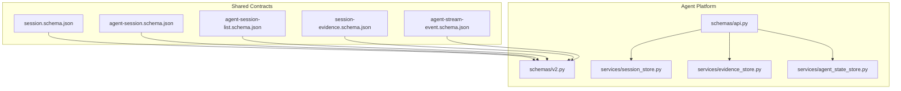
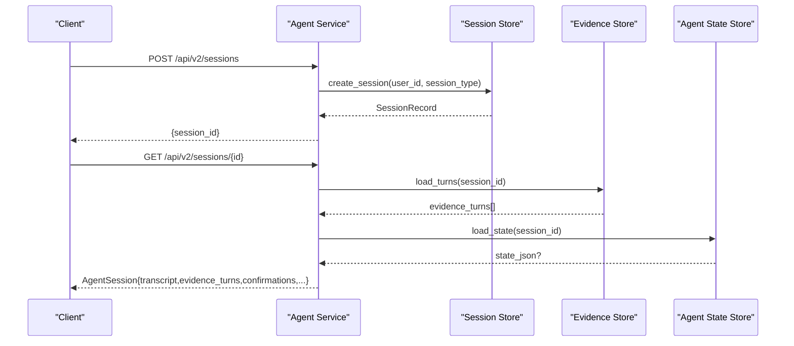
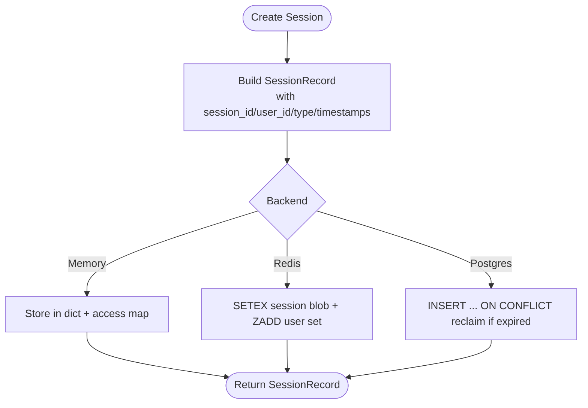
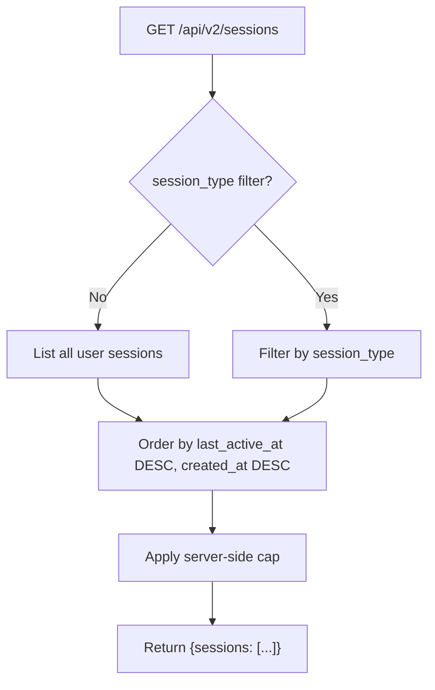
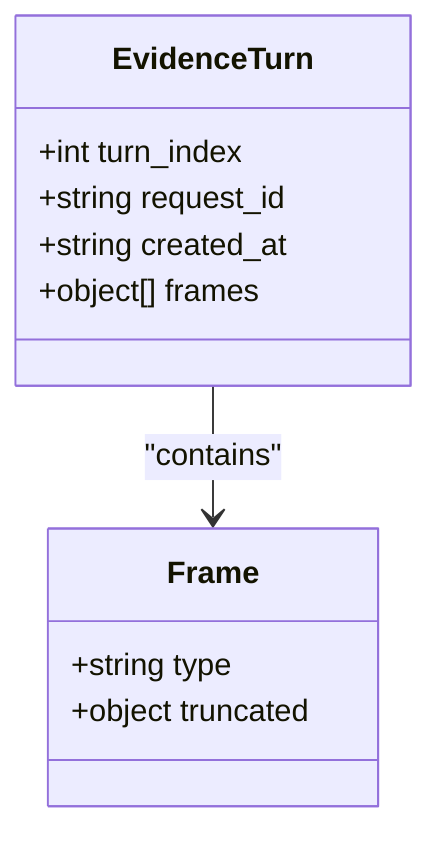
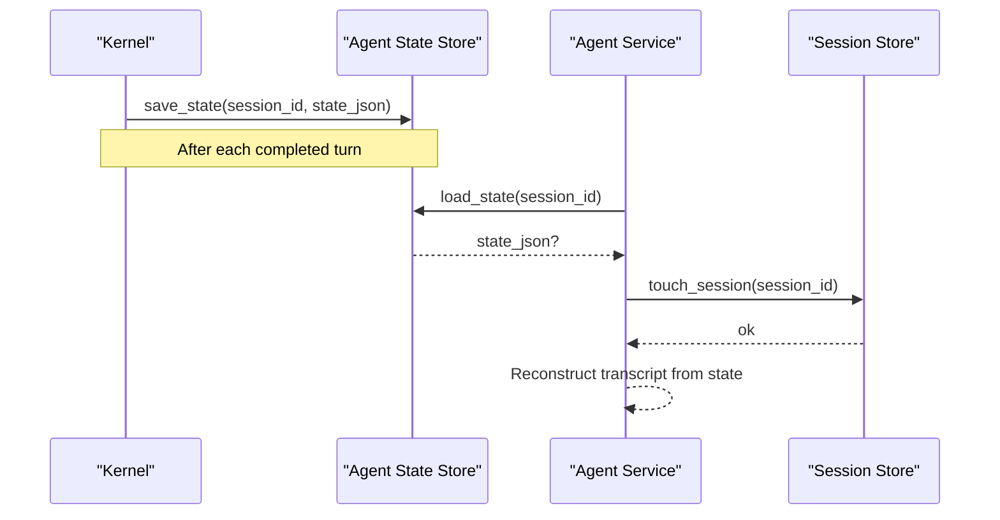
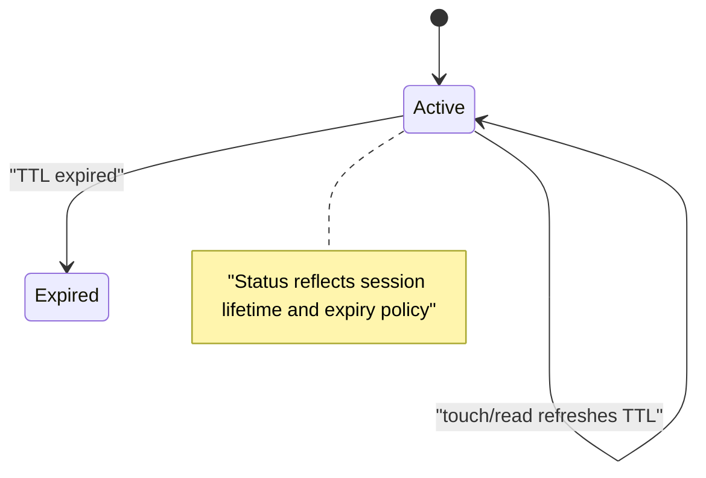
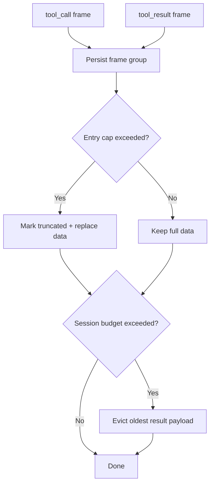
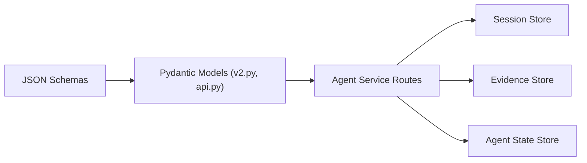

# Session Management Schemas

<cite>
**Referenced Files in This Document**
- [session.schema.json](file://shared/shared-contracts/schemas/session.schema.json)
- [agent-session.schema.json](file://shared/shared-contracts/schemas/agent-session.schema.json)
- [agent-session-list.schema.json](file://shared/shared-contracts/schemas/agent-session-list.schema.json)
- [session-evidence.schema.json](file://shared/shared-contracts/schemas/session-evidence.schema.json)
- [agent-stream-event.schema.json](file://shared/shared-contracts/schemas/agent-stream-event.schema.json)
- [v2.py](file://products/agent-platform/src/agent_service/schemas/v2.py)
- [api.py](file://products/agent-platform/src/agent_service/schemas/api.py)
- [session_store.py](file://products/agent-platform/src/agent_service/services/session_store.py)
- [agent_state_store.py](file://products/agent-platform/src/agent_service/services/agent_state_store.py)
- [evidence_store.py](file://products/agent-platform/src/agent_service/services/evidence_store.py)
</cite>

## Table of Contents
1. Introduction
2. Project Structure
3. Core Components
4. Architecture Overview
5. Detailed Component Analysis
6. Dependency Analysis
7. Performance Considerations
8. Troubleshooting Guide
9. Conclusion

## Introduction
This document describes the session management schemas and persistence layers that govern agent sessions across their lifecycle: creation, updates, and deletion; metadata and status tracking; evidence collection; runtime state recovery; and list pagination/filtering. It focuses on the shared JSON Schema contracts for API payloads and the pluggable storage backends used by the agent platform to persist sessions, evidence, and kernel state snapshots.

## Project Structure
The session management surface is defined in two layers:
- Shared JSON Schema contracts under shared/shared-contracts/schemas define the stable wire formats for sessions, session lists, evidence turns, and stream events.
- The agent platform product implements Pydantic models that validate against those schemas and provides pluggable storage backends for session records, per-turn evidence, and kernel state snapshots.

**Diagram sources**
- [session.schema.json:1-26](file://shared/shared-contracts/schemas/session.schema.json#L1-L26)
- [agent-session.schema.json:1-224](file://shared/shared-contracts/schemas/agent-session.schema.json#L1-L224)
- [agent-session-list.schema.json:1-47](file://shared/shared-contracts/schemas/agent-session-list.schema.json#L1-L47)
- [session-evidence.schema.json:1-58](file://shared/shared-contracts/schemas/session-evidence.schema.json#L1-L58)
- [agent-stream-event.schema.json:1-160](file://shared/shared-contracts/schemas/agent-stream-event.schema.json#L1-L160)
- [v2.py:1-576](file://products/agent-platform/src/agent_service/schemas/v2.py#L1-L576)
- [api.py:1-47](file://products/agent-platform/src/agent_service/schemas/api.py#L1-L47)
- [session_store.py:1-800](file://products/agent-platform/src/agent_service/services/session_store.py#L1-L800)
- [evidence_store.py:1-551](file://products/agent-platform/src/agent_service/services/evidence_store.py#L1-L551)
- [agent_state_store.py:1-324](file://products/agent-platform/src/agent_service/services/agent_state_store.py#L1-L324)

**Section sources**
- [session.schema.json:1-26](file://shared/shared-contracts/schemas/session.schema.json#L1-L26)
- [agent-session.schema.json:1-224](file://shared/shared-contracts/schemas/agent-session.schema.json#L1-L224)
- [agent-session-list.schema.json:1-47](file://shared/shared-contracts/schemas/agent-session-list.schema.json#L1-L47)
- [session-evidence.schema.json:1-58](file://shared/shared-contracts/schemas/session-evidence.schema.json#L1-L58)
- [agent-stream-event.schema.json:1-160](file://shared/shared-contracts/schemas/agent-stream-event.schema.json#L1-L160)
- [v2.py:1-576](file://products/agent-platform/src/agent_service/schemas/v2.py#L1-L576)
- [api.py:1-47](file://products/agent-platform/src/agent_service/schemas/api.py#L1-L47)
- [session_store.py:1-800](file://products/agent-platform/src/agent_service/services/session_store.py#L1-L800)
- [evidence_store.py:1-551](file://products/agent-platform/src/agent_service/services/evidence_store.py#L1-L551)
- [agent_state_store.py:1-324](file://products/agent-platform/src/agent_service/services/agent_state_store.py#L1-L324)

## Core Components
- Session record model (internal): lightweight row with identifiers, timestamps, title, last activity, pinned model, and birth entry type.
- Agent session response model (API v2): enriched session view including transcript availability, evidence turns, durable confirmation cards, and execution rows.
- Evidence turn model: grouped tool_call/tool_result frames per assistant turn with truncation markers.
- Stream event model: SSE frames carrying message deltas, tool calls/results, and HITL confirmation frames.
- Storage backends:
  - Session store: in-memory, Redis, or Postgres with TTL-based expiration and user-scoped listing.
  - Evidence store: in-memory or Postgres with per-entry caps and per-session budgets.
  - Agent state store: in-memory or Postgres for kernel state snapshots with TTL refresh on read.

**Section sources**
- [api.py:9-30](file://products/agent-platform/src/agent_service/schemas/api.py#L9-L30)
- [v2.py:200-332](file://products/agent-platform/src/agent_service/schemas/v2.py#L200-L332)
- [session-store.py:46-120](file://products/agent-platform/src/agent_service/services/session_store.py#L46-L120)
- [evidence_store.py:86-107](file://products/agent-platform/src/agent_service/services/evidence_store.py#L86-L107)
- [agent_state_store.py:37-58](file://products/agent-platform/src/agent_service/services/agent_state_store.py#L37-L58)

## Architecture Overview
The system separates concerns into three persistent concerns:
- Session metadata and workspace fields live in the session store.
- Per-turn tool evidence is persisted separately so large payloads can be bounded and evicted without losing metadata.
- Kernel runtime state snapshots are stored independently to support recovery after restarts.

**Diagram sources**
- [session_store.py:697-733](file://products/agent-platform/src/agent_service/services/session_store.py#L697-L733)
- [evidence_store.py:165-180](file://products/agent-platform/src/agent_service/services/evidence_store.py#L165-L180)
- [agent_state_store.py:210-228](file://products/agent-platform/src/agent_service/services/agent_state_store.py#L210-L228)
- [v2.py:283-332](file://products/agent-platform/src/agent_service/schemas/v2.py#L283-L332)

## Detailed Component Analysis

### Session Creation, Updates, and Deletion
- Creation:
  - Internal request model supports optional user_id.
  - Public v2 create request supports optional named session_id, skill_target, and immutable session_type discriminator.
  - Backends create a SessionRecord with created_at and last_active_at; Postgres uses an idempotent insert that reclaims expired rows while preserving birth type for live conflicts.
- Updates:
  - Title: set-once minting via Redis NX key or Postgres guard; owner rename overwrites via update path.
  - Model pinning: overwritten per resolved turn to maintain affinity across restarts.
  - Last active timestamp: refreshed on touch/read to keep sessions warm within TTL.
- Deletion:
  - Removes session blob/key and associated title index; cleans user-scoped indexes where applicable.

**Diagram sources**
- [api.py:32-34](file://products/agent-platform/src/agent_service/schemas/api.py#L32-L34)
- [v2.py:334-363](file://products/agent-platform/src/agent_service/schemas/v2.py#L334-L363)
- [session_store.py:163-181](file://products/agent-platform/src/agent_service/services/session_store.py#L163-L181)
- [session_store.py:285-309](file://products/agent-platform/src/agent_service/services/session_store.py#L285-L309)
- [session_store.py:697-733](file://products/agent-platform/src/agent_service/services/session_store.py#L697-L733)

**Section sources**
- [api.py:9-30](file://products/agent-platform/src/agent_service/schemas/api.py#L9-L30)
- [v2.py:334-363](file://products/agent-platform/src/agent_service/schemas/v2.py#L334-L363)
- [session_store.py:163-227](file://products/agent-platform/src/agent_service/services/session_store.py#L163-L227)
- [session_store.py:285-446](file://products/agent-platform/src/agent_service/services/session_store.py#L285-L446)
- [session_store.py:697-733](file://products/agent-platform/src/agent_service/services/session_store.py#L697-L733)

### Session List Pagination and Filtering
- Response envelope returns a capped array of session summaries ordered most-recently-active first.
- Each row includes session_id, session_type, title, created_at, last_active_at, and pending_confirmation flag.
- Backend filtering:
  - In-memory and Redis filter client-side or via sorted sets; Postgres applies server-side limit and optional session_type scope.
- Sorting:
  - Ordered by last_active_at descending, falling back to created_at when absent.

**Diagram sources**
- [agent-session-list.schema.json:1-47](file://shared/shared-contracts/schemas/agent-session-list.schema.json#L1-L47)
- [v2.py:314-332](file://products/agent-platform/src/agent_service/schemas/v2.py#L314-L332)
- [session_store.py:766-798](file://products/agent-platform/src/agent_service/services/session_store.py#L766-L798)

**Section sources**
- [agent-session-list.schema.json:1-47](file://shared/shared-contracts/schemas/agent-session-list.schema.json#L1-L47)
- [v2.py:314-332](file://products/agent-platform/src/agent_service/schemas/v2.py#L314-L332)
- [session_store.py:191-201](file://products/agent-platform/src/agent_service/services/session_store.py#L191-L201)
- [session_store.py:342-364](file://products/agent-platform/src/agent_service/services/session_store.py#L342-L364)
- [session_store.py:766-798](file://products/agent-platform/src/agent_service/services/session_store.py#L766-L798)

### Evidence Collection and Attachment Format
- Evidence is captured as ordered frames per assistant turn:
  - Frames follow tool_call/tool_result shapes from the stream event schema.
  - Per-entry cap replaces oversized data with truncated preview plus marker.
  - Per-session budget evicts oldest result payloads while preserving metadata.
- Grouping:
  - Evidence is grouped by turn_index and request_id, with created_at assigned at persistence time.
- Retrieval:
  - Load returns groups sorted by turn_index and frame_index, suitable for replay in the owner transcript.

**Diagram sources**
- [session-evidence.schema.json:1-58](file://shared/shared-contracts/schemas/session-evidence.schema.json#L1-L58)
- [v2.py:200-213](file://products/agent-platform/src/agent_service/schemas/v2.py#L200-L213)
- [evidence_store.py:118-180](file://products/agent-platform/src/agent_service/services/evidence_store.py#L118-L180)

**Section sources**
- [session-evidence.schema.json:1-58](file://shared/shared-contracts/schemas/session-evidence.schema.json#L1-L58)
- [v2.py:200-213](file://products/agent-platform/src/agent_service/schemas/v2.py#L200-L213)
- [evidence_store.py:46-70](file://products/agent-platform/src/agent_service/services/evidence_store.py#L46-L70)
- [evidence_store.py:118-180](file://products/agent-platform/src/agent_service/services/evidence_store.py#L118-L180)
- [evidence_store.py:211-273](file://products/agent-platform/src/agent_service/services/evidence_store.py#L211-L273)
- [evidence_store.py:362-488](file://products/agent-platform/src/agent_service/services/evidence_store.py#L362-L488)

### Runtime Session State, Transcript, and Execution Context
- Kernel state snapshot:
  - Saved after each completed turn and restored on session construction to recover conversation context.
  - Supports memory and Postgres backends; failures degrade gracefully without failing turns.
- Transcript:
  - Best-effort reconstruction from kernel state snapshot; transcript_available indicates success/failure.
- Execution context:
  - Pinned model id per session ensures affinity across restarts.
  - Confirmation cards and execution rows provide durable auditability for approved actions.

**Diagram sources**
- [agent_state_store.py:1-11](file://products/agent-platform/src/agent_service/services/agent_state_store.py#L1-L11)
- [agent_state_store.py:190-228](file://products/agent-platform/src/agent_service/services/agent_state_store.py#L190-L228)
- [session_store.py:86-100](file://products/agent-platform/src/agent_service/services/session_store.py#L86-L100)
- [v2.py:283-312](file://products/agent-platform/src/agent_service/schemas/v2.py#L283-L312)

**Section sources**
- [agent_state_store.py:1-11](file://products/agent-platform/src/agent_service/services/agent_state_store.py#L1-L11)
- [agent_state_store.py:190-228](file://products/agent-platform/src/agent_service/services/agent_state_store.py#L190-L228)
- [v2.py:283-312](file://products/agent-platform/src/agent_service/schemas/v2.py#L283-L312)

### Session Status Tracking and Transitions
- Session-level status:
  - Legacy session schema defines active/closed.
  - Agent session schema defines active/expired for v2 responses.
- Pending confirmations:
  - Boolean flag indicates unresolved parked HITL confirmations.
- Evidence and confirmation durability:
  - Evidence turns and confirmation cards are persisted separately and degrade gracefully when stores are unreadable.

**Diagram sources**
- [session.schema.json:1-26](file://shared/shared-contracts/schemas/session.schema.json#L1-L26)
- [agent-session.schema.json:1-224](file://shared/shared-contracts/schemas/agent-session.schema.json#L1-L224)
- [session_store.py:545-547](file://products/agent-platform/src/agent_service/services/session_store.py#L545-L547)

**Section sources**
- [session.schema.json:1-26](file://shared/shared-contracts/schemas/session.schema.json#L1-L26)
- [agent-session.schema.json:1-224](file://shared/shared-contracts/schemas/agent-session.schema.json#L1-L224)
- [session_store.py:545-547](file://products/agent-platform/src/agent_service/services/session_store.py#L545-L547)

### Stream Events and Evidence Correlation
- Stream events carry tool_call/tool_result frames and HITL confirmation frames.
- Evidence persistence mirrors these frames, enabling replay of the same evidence card seen during live streaming.
- Truncation markers indicate when size caps replaced payloads.

**Diagram sources**
- [agent-stream-event.schema.json:1-160](file://shared/shared-contracts/schemas/agent-stream-event.schema.json#L1-L160)
- [evidence_store.py:46-70](file://products/agent-platform/src/agent_service/services/evidence_store.py#L46-L70)
- [evidence_store.py:150-164](file://products/agent-platform/src/agent_service/services/evidence_store.py#L150-L164)

**Section sources**
- [agent-stream-event.schema.json:1-160](file://shared/shared-contracts/schemas/agent-stream-event.schema.json#L1-L160)
- [evidence_store.py:46-70](file://products/agent-platform/src/agent_service/services/evidence_store.py#L46-L70)
- [evidence_store.py:150-164](file://products/agent-platform/src/agent_service/services/evidence_store.py#L150-L164)

## Dependency Analysis
- Schemas drive validation:
  - Pydantic models in v2.py validate against shared JSON Schema files.
  - Internal api.py models represent compact session rows and requests.
- Backends depend on environment configuration:
  - SESSION_STORE_BACKEND selects session backend.
  - AGENT_STATE_STORE_BACKEND selects both agent state and evidence backends.
- Data flow dependencies:
  - Session store manages lifecycle and workspace fields.
  - Evidence store persists tool frames with size enforcement.
  - Agent state store persists kernel snapshots for recovery.

**Diagram sources**
- [v2.py:1-5](file://products/agent-platform/src/agent_service/schemas/v2.py#L1-L5)
- [session_store.py:1-7](file://products/agent-platform/src/agent_service/services/session_store.py#L1-L7)
- [evidence_store.py:1-15](file://products/agent-platform/src/agent_service/services/evidence_store.py#L1-L15)
- [agent_state_store.py:1-11](file://products/agent-platform/src/agent_service/services/agent_state_store.py#L1-L11)

**Section sources**
- [v2.py:1-5](file://products/agent-platform/src/agent_service/schemas/v2.py#L1-L5)
- [session_store.py:1-7](file://products/agent-platform/src/agent_service/services/session_store.py#L1-L7)
- [evidence_store.py:1-15](file://products/agent-platform/src/agent_service/services/evidence_store.py#L1-L15)
- [agent_state_store.py:1-11](file://products/agent-platform/src/agent_service/services/agent_state_store.py#L1-L11)

## Performance Considerations
- TTL-based expiration:
  - Sessions, evidence, and state snapshots use idle TTL refreshed on read/write to keep active sessions warm.
- Size enforcement:
  - Evidence enforces per-entry caps and per-session budgets to control storage growth.
- Opportunistic sweep:
  - Expired rows are reclaimed piggybacked on writes to avoid long-running background tasks.
- Backend selection:
  - Memory backend for dev/CI; Postgres for production with graceful fallback on failure.

[No sources needed since this section provides general guidance]

## Troubleshooting Guide
- Session not found:
  - Check TTL expiration and whether the session was deleted or expired.
- Missing evidence:
  - Verify evidence store readiness and whether entries were truncated or evicted due to budget.
- Transcript unavailable:
  - Indicates kernel state snapshot could not be recovered; check agent state store health.
- Backend errors:
  - Errors are recorded via metrics; services degrade gracefully to in-memory backends when configured backends are unavailable.

**Section sources**
- [session_store.py:735-752](file://products/agent-platform/src/agent_service/services/session_store.py#L735-L752)
- [evidence_store.py:504-546](file://products/agent-platform/src/agent_service/services/evidence_store.py#L504-L546)
- [agent_state_store.py:276-319](file://products/agent-platform/src/agent_service/services/agent_state_store.py#L276-L319)

## Conclusion
The session management layer combines strict schema contracts with resilient, pluggable storage backends to ensure sessions are created, updated, and deleted consistently; evidence is captured and bounded; and runtime state survives restarts. Pagination and filtering are supported at the service layer with server-side limits in Postgres. Durability and recovery are achieved through TTL-aware persistence, opportunistic sweeps, and best-effort degradation paths that keep the platform usable even when backends are temporarily unavailable.