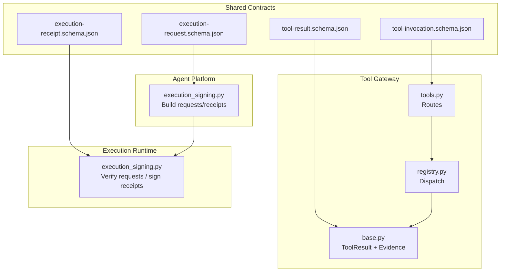
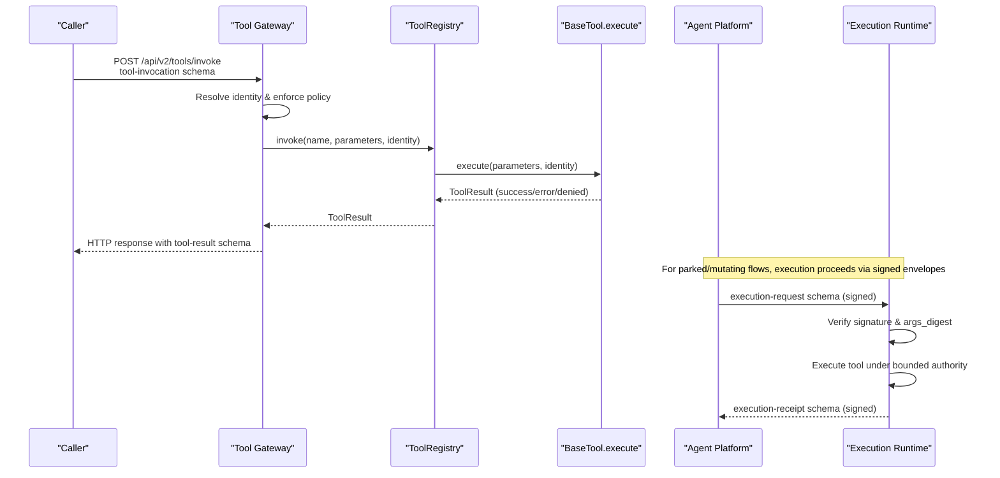
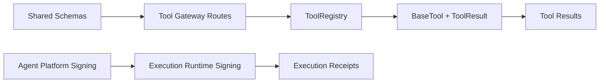
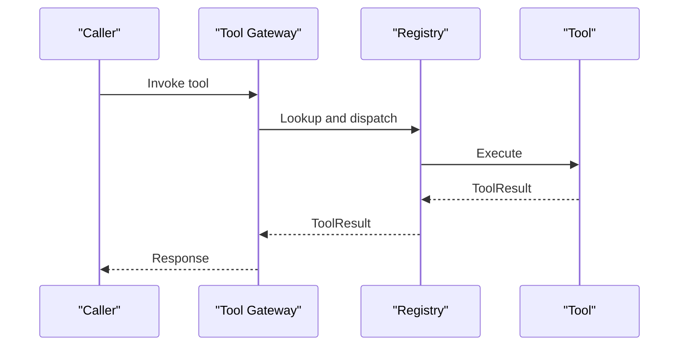
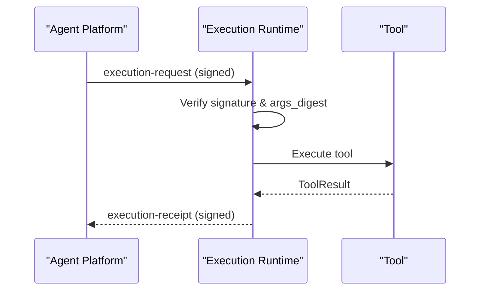

# Tool Execution Schemas

<cite>
**Referenced Files in This Document**
- [tool-invocation.schema.json](file://shared/shared-contracts/schemas/tool-invocation.schema.json)
- [tool-result.schema.json](file://shared/shared-contracts/schemas/tool-result.schema.json)
- [execution-request.schema.json](file://shared/shared-contracts/schemas/execution-request.schema.json)
- [execution-receipt.schema.json](file://shared/shared-contracts/schemas/execution-receipt.schema.json)
- [base.py](file://products/tool-gateway/src/tool_gateway/tools/base.py)
- [registry.py](file://products/tool-gateway/src/tool_gateway/tools/registry.py)
- [tools.py](file://products/tool-gateway/src/tool_gateway/api/routes/tools.py)
- [execution_signing.py (agent-platform)](file://products/agent-platform/src/agent_service/services/execution_signing.py)
- [execution_signing.py (execution-runtime)](file://products/execution-runtime/src/execution_runtime/services/execution_signing.py)
</cite>

## Table of Contents
1. [Introduction](#introduction)
2. [Project Structure](#project-structure)
3. [Core Components](#core-components)
4. [Architecture Overview](#architecture-overview)
5. [Detailed Component Analysis](#detailed-component-analysis)
6. [Dependency Analysis](#dependency-analysis)
7. [Performance Considerations](#performance-considerations)
8. [Troubleshooting Guide](#troubleshooting-guide)
9. [Conclusion](#conclusion)
10. [Appendices](#appendices)

## Introduction
This document defines the schemas and execution workflows for tool invocation, results, and distributed execution envelopes across the platform. It explains:
- How tools are invoked with validated parameters and identity context
- How tool results are structured, including success, error, and policy-denied outcomes
- How signed execution requests and receipts provide tamper-evident audit trails across workers
- How evidence is attached to tool results for provenance and UI rendering
- Examples of calls, result formats, error scenarios, and end-to-end workflows

## Project Structure
The tool execution surface spans shared JSON schemas and product services:
- Shared schemas define the contract between components
- The tool gateway exposes discovery and invocation endpoints and enforces policies
- The agent platform builds signed execution requests when approvals resume
- The execution runtime verifies incoming requests and signs receipts after execution

**Diagram sources**
- [tool-invocation.schema.json:1-35](file://shared/shared-contracts/schemas/tool-invocation.schema.json#L1-L35)
- [tool-result.schema.json:1-69](file://shared/shared-contracts/schemas/tool-result.schema.json#L1-L69)
- [execution-request.schema.json:1-71](file://shared/shared-contracts/schemas/execution-request.schema.json#L1-L71)
- [execution-receipt.schema.json:1-47](file://shared/shared-contracts/schemas/execution-receipt.schema.json#L1-L47)
- [tools.py:1-51](file://products/tool-gateway/src/tool_gateway/api/routes/tools.py#L1-L51)
- [registry.py:1-89](file://products/tool-gateway/src/tool_gateway/tools/registry.py#L1-L89)
- [base.py:1-123](file://products/tool-gateway/src/tool_gateway/tools/base.py#L1-L123)
- [execution_signing.py (agent-platform):1-175](file://products/agent-platform/src/agent_service/services/execution_signing.py#L1-L175)
- [execution_signing.py (execution-runtime):1-93](file://products/execution-runtime/src/execution_runtime/services/execution_signing.py#L1-L93)

**Section sources**
- [tools.py:1-51](file://products/tool-gateway/src/tool_gateway/api/routes/tools.py#L1-L51)
- [registry.py:1-89](file://products/tool-gateway/src/tool_gateway/tools/registry.py#L1-L89)
- [base.py:1-123](file://products/tool-gateway/src/tool_gateway/tools/base.py#L1-L123)
- [execution_signing.py (agent-platform):1-175](file://products/agent-platform/src/agent_service/services/execution_signing.py#L1-L175)
- [execution_signing.py (execution-runtime):1-93](file://products/execution-runtime/src/execution_runtime/services/execution_signing.py#L1-L93)

## Core Components
- Tool Invocation Schema: Defines the request envelope sent to the tool gateway, including tool name, parameters, identity context, and a unique request ID.
- Tool Result Schema: Defines the response envelope returned by tools, including status, data, evidence, and optional error details.
- Execution Request Schema: Signed envelope created when an approved parked tool call resumes; binds approver intent to executed arguments via a digest and HMAC signature.
- Execution Receipt Schema: Signed envelope written after execution completes; closes the corresponding request with a mapped outcome and a digest of the tool result.

Key implementation anchors:
- Tool registry dispatches invocations and returns structured errors for unknown or failing tools
- Base tool utilities build evidence and standardized error/denied results
- Agent platform signs execution requests and receipts using canonical JSON and HMAC-SHA256
- Execution runtime verifies incoming requests and signs receipts, ensuring fail-closed behavior without a signing key

**Section sources**
- [tool-invocation.schema.json:1-35](file://shared/shared-contracts/schemas/tool-invocation.schema.json#L1-L35)
- [tool-result.schema.json:1-69](file://shared/shared-contracts/schemas/tool-result.schema.json#L1-L69)
- [execution-request.schema.json:1-71](file://shared/shared-contracts/schemas/execution-request.schema.json#L1-L71)
- [execution-receipt.schema.json:1-47](file://shared/shared-contracts/schemas/execution-receipt.schema.json#L1-L47)
- [registry.py:1-89](file://products/tool-gateway/src/tool_gateway/tools/registry.py#L1-L89)
- [base.py:1-123](file://products/tool-gateway/src/tool_gateway/tools/base.py#L1-L123)
- [execution_signing.py (agent-platform):1-175](file://products/agent-platform/src/agent_service/services/execution_signing.py#L1-L175)
- [execution_signing.py (execution-runtime):1-93](file://products/execution-runtime/src/execution_runtime/services/execution_signing.py#L1-L93)

## Architecture Overview
End-to-end flow from approval to execution and receipt:

**Diagram sources**
- [tools.py:24-51](file://products/tool-gateway/src/tool_gateway/api/routes/tools.py#L24-L51)
- [registry.py:65-89](file://products/tool-gateway/src/tool_gateway/tools/registry.py#L65-L89)
- [base.py:35-123](file://products/tool-gateway/src/tool_gateway/tools/base.py#L35-L123)
- [execution-signing (agent-platform):70-149](file://products/agent-platform/src/agent_service/services/execution_signing.py#L70-L149)
- [execution-signing (execution-runtime):64-93](file://products/execution-runtime/src/execution_runtime/services/execution_signing.py#L64-L93)

## Detailed Component Analysis

### Tool Invocation Schema
- Purpose: Envelope for invoking a registered tool through the tool gateway.
- Required fields: tool_name, request_id
- Optional fields: parameters (tool-specific), identity_context (sub, username, roles)
- Validation:
  - tool_name must match a registered tool
  - parameters shape is defined per tool’s parameters_schema
  - identity_context is forwarded from gateway authentication and not trusted from body
- Usage:
  - Callers send this envelope to the gateway’s invoke endpoint
  - The gateway resolves identity from the bearer token and enforces policy before dispatch

Example call outline:
- Method: POST
- Path: /api/v2/tools/invoke
- Body: tool-invocation schema
- Headers: Authorization (bearer token), optional x-request-id

**Section sources**
- [tool-invocation.schema.json:1-35](file://shared/shared-contracts/schemas/tool-invocation.schema.json#L1-L35)
- [tools.py:38-51](file://products/tool-gateway/src/tool_gateway/api/routes/tools.py#L38-L51)

### Tool Result Schema
- Purpose: Structured response envelope returned by tool invocation.
- Required fields: tool_name, status, evidence
- Status values: success, error, denied
- Fields:
  - data: present on success
  - evidence: includes executed_at, duration_ms, risk_level, source_system
  - error: present on error or denied; includes code and message
- Evidence building:
  - Use the base utility to construct evidence with current UTC time, measured duration, declared risk level, and source system
- Error handling:
  - Unknown tools return TOOL_NOT_FOUND
  - Exceptions during execution return TOOL_EXECUTION_ERROR
  - Policy denials return POLICY_DENIED with appropriate risk_level

Example result outlines:
- Success: status=success, data populated, evidence present
- Error: status=error, error.code/message, evidence present
- Denied: status=denied, error.code=message POLICY_DENIED, evidence present

**Section sources**
- [tool-result.schema.json:1-69](file://shared/shared-contracts/schemas/tool-result.schema.json#L1-L69)
- [base.py:35-105](file://products/tool-gateway/src/tool_gateway/tools/base.py#L35-L105)
- [registry.py:65-89](file://products/tool-gateway/src/tool_gateway/tools/registry.py#L65-L89)

### Execution Request Schema
- Purpose: Signed envelope built when a parked confirmation resumes with approval; one per approved parked tool call.
- Required fields: execution_id, confirm_id, call_id, session_id, owner_user_id, decider_user_id, tool_name, args_digest, requested_at, signature
- Optional field: approval_kind ("action" or "flow")
- Security properties:
  - args_digest is SHA-256 hex of canonical JSON of parked arguments
  - signature is HMAC-SHA256 hex over canonical JSON of all other fields
  - approval_kind is stamped before signing so it is covered by the HMAC
- Construction:
  - Agent platform builds these envelopes on approval resume
  - Flow-based auto-unlocks use a different builder that stamps approval_kind="flow"

Verification at the worker:
- Signature verification against the platform execution-signing key
- args_digest recomputation from executed arguments and mismatch rejection
- Fail-closed if signing key is missing

**Section sources**
- [execution-request.schema.json:1-71](file://shared/shared-contracts/schemas/execution-request.schema.json#L1-L71)
- [execution_signing.py (agent-platform):70-149](file://products/agent-platform/src/agent_service/services/execution_signing.py#L70-L149)
- [execution_signing.py (execution-runtime):1-19](file://products/execution-runtime/src/execution_runtime/services/execution_signing.py#L1-L19)

### Execution Receipt Schema
- Purpose: Signed envelope written after the executed tool result lands; closes one execution request.
- Required fields: execution_id, status, outcome_digest, request_id, completed_at, signature
- Mapping:
  - status maps from tool result outcome to succeeded/failed/timeout
  - outcome_digest is SHA-256 hex of canonical JSON of the tool result
- Construction:
  - Built by both agent platform and execution runtime depending on path
  - Uses same canonicalization and HMAC scheme as requests

Audit trail:
- request_id joins the receipt to the resumed stream’s audit trail
- outcome_digest enables integrity checks without storing full results

**Section sources**
- [execution-receipt.schema.json:1-47](file://shared/shared-contracts/schemas/execution-receipt.schema.json#L1-L47)
- [execution_signing.py (agent-platform):152-175](file://products/agent-platform/src/agent_service/services/execution_signing.py#L152-L175)
- [execution_signing.py (execution-runtime):70-93](file://products/execution-runtime/src/execution_runtime/services/execution_signing.py#L70-L93)

### Tool Registry and Dispatch
- Responsibilities:
  - Register tools with validated risk levels
  - Refuse mutating tools unless explicitly allowed
  - Dispatch invocations by name and return structured ToolResult envelopes
- Error handling:
  - Unknown tool names produce a structured error result
  - Exceptions during tool execution are caught and converted to structured error results
- Risk tiers:
  - read/write/admin vocabulary enforced at registration
  - Mutating tools gated behind configuration

**Section sources**
- [registry.py:1-89](file://products/tool-gateway/src/tool_gateway/tools/registry.py#L1-L89)
- [base.py:9-13](file://products/tool-gateway/src/tool_gateway/tools/base.py#L9-L13)

### Evidence and Error Utilities
- Evidence construction:
  - Captures executed_at (UTC ISO), duration_ms, risk_level, source_system
- Standardized results:
  - make_error_result: creates error ToolResult with evidence and error object
  - make_denied_result: creates policy-denied ToolResult with honest risk_level
- BaseTool interface:
  - Implementations must measure execution time and build evidence via provided utilities

**Section sources**
- [base.py:58-105](file://products/tool-gateway/src/tool_gateway/tools/base.py#L58-L105)
- [base.py:108-123](file://products/tool-gateway/src/tool_gateway/tools/base.py#L108-L123)

## Dependency Analysis
High-level dependencies among components:

**Diagram sources**
- [tools.py:1-51](file://products/tool-gateway/src/tool_gateway/api/routes/tools.py#L1-L51)
- [registry.py:1-89](file://products/tool-gateway/src/tool_gateway/tools/registry.py#L1-L89)
- [base.py:1-123](file://products/tool-gateway/src/tool_gateway/tools/base.py#L1-L123)
- [execution_signing.py (agent-platform):1-175](file://products/agent-platform/src/agent_service/services/execution_signing.py#L1-L175)
- [execution_signing.py (execution-runtime):1-93](file://products/execution-runtime/src/execution_runtime/services/execution_signing.py#L1-L93)

**Section sources**
- [tools.py:1-51](file://products/tool-gateway/src/tool_gateway/api/routes/tools.py#L1-L51)
- [registry.py:1-89](file://products/tool-gateway/src/tool_gateway/tools/registry.py#L1-L89)
- [base.py:1-123](file://products/tool-gateway/src/tool_gateway/tools/base.py#L1-L123)
- [execution_signing.py (agent-platform):1-175](file://products/agent-platform/src/agent_service/services/execution_signing.py#L1-L175)
- [execution_signing.py (execution-runtime):1-93](file://products/execution-runtime/src/execution_runtime/services/execution_signing.py#L1-L93)

## Performance Considerations
- Canonical JSON and HMAC operations are lightweight but should be avoided in hot paths where possible; they are used only around critical envelopes.
- Evidence duration_ms measurement should be efficient; avoid heavy logging inside tight loops.
- Registry lookups are O(1) dictionary access; ensure tool registrations occur at startup.
- Streaming responses should minimize payload sizes; evidence contains only necessary provenance metadata.

[No sources needed since this section provides general guidance]

## Troubleshooting Guide
Common issues and resolutions:
- Unknown tool name:
  - Symptom: TOOL_NOT_FOUND in tool result
  - Resolution: Ensure the tool is registered and the name matches exactly
- Tool execution exception:
  - Symptom: TOOL_EXECUTION_ERROR with message from exception
  - Resolution: Inspect tool implementation logs and parameter validation
- Policy denial:
  - Symptom: POLICY_DENIED with reason
  - Resolution: Review permissions and mutation gating; adjust policy or authorization
- Missing signing key:
  - Symptom: Handoff fails closed; no unsigned execution occurs
  - Resolution: Provision the execution-signing key in the environment
- Args digest mismatch:
  - Symptom: Rejection due to args_digest_mismatch
  - Resolution: Ensure executed arguments match the parked arguments seen by the approver

**Section sources**
- [registry.py:65-89](file://products/tool-gateway/src/tool_gateway/tools/registry.py#L65-L89)
- [execution_signing.py (agent-platform):29-34](file://products/agent-platform/src/agent_service/services/execution_signing.py#L29-L34)
- [execution_signing.py (execution-runtime):29-34](file://products/execution-runtime/src/execution_runtime/services/execution_signing.py#L29-L34)

## Conclusion
The tool execution framework standardizes how tools are invoked, how results are returned, and how distributed execution is secured with signed envelopes. The shared schemas define a clear contract, while the tool gateway and signing services enforce policy, identity, and integrity. Evidence and receipts provide auditable provenance for every action, enabling transparency and compliance.

[No sources needed since this section summarizes without analyzing specific files]

## Appendices

### Example Workflows

#### Direct Tool Invocation
- Caller sends a tool-invocation envelope to the gateway
- Gateway resolves identity and enforces policy
- Registry dispatches to the tool implementation
- Tool returns a tool-result envelope with evidence

**Diagram sources**
- [tools.py:38-51](file://products/tool-gateway/src/tool_gateway/api/routes/tools.py#L38-L51)
- [registry.py:65-89](file://products/tool-gateway/src/tool_gateway/tools/registry.py#L65-L89)

#### Approval-Resumed Execution with Signed Envelopes
- Approver resumes a parked confirmation
- Agent platform builds a signed execution request with args_digest and approval_kind
- Execution runtime verifies signature and args_digest, executes tool, and signs a receipt

**Diagram sources**
- [execution_signing.py (agent-platform):70-149](file://products/agent-platform/src/agent_service/services/execution_signing.py#L70-L149)
- [execution_signing.py (execution-runtime):64-93](file://products/execution-runtime/src/execution_runtime/services/execution_signing.py#L64-L93)