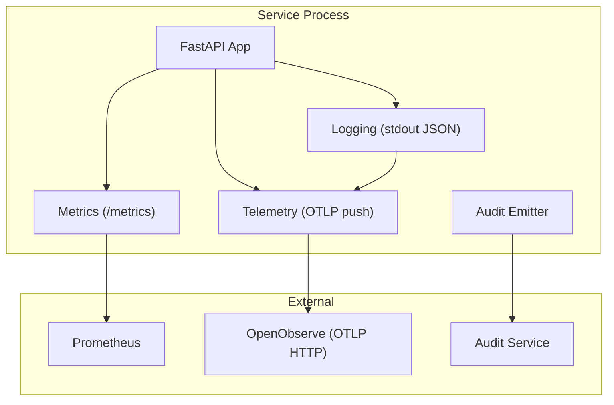
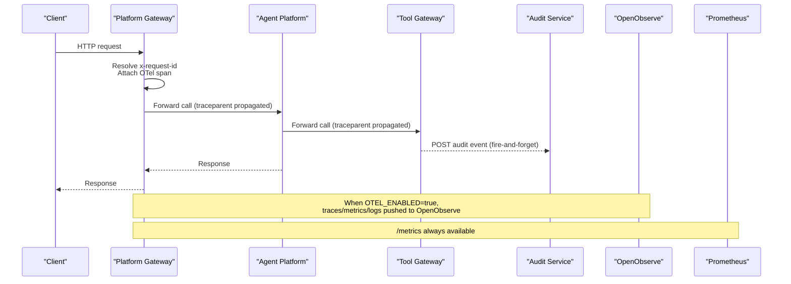
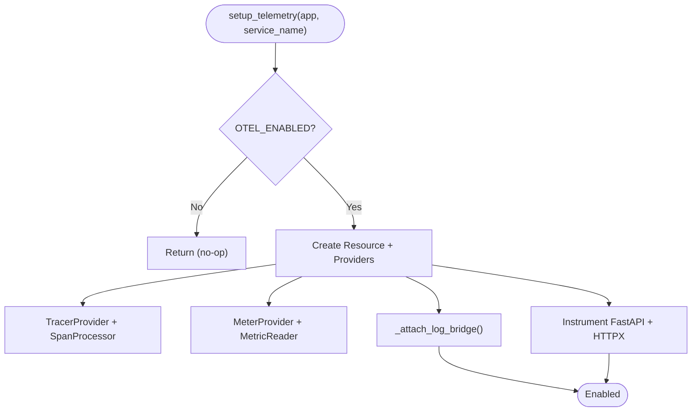
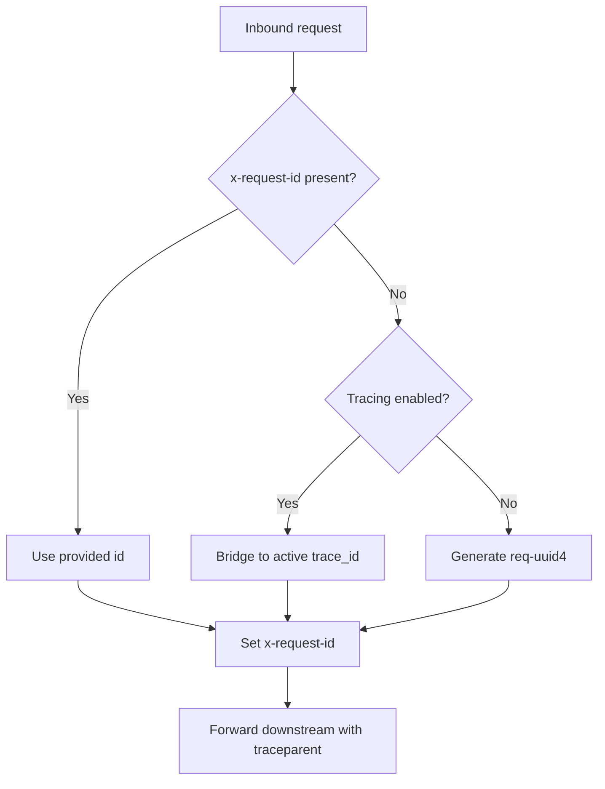
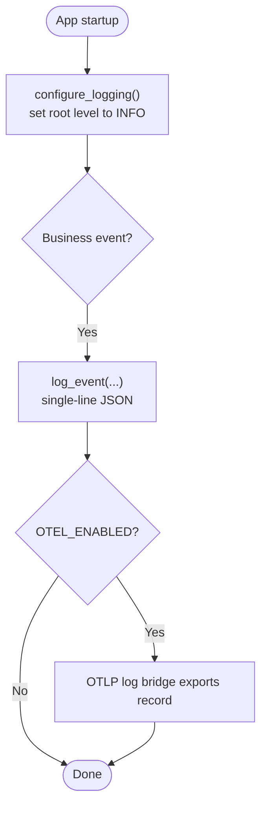
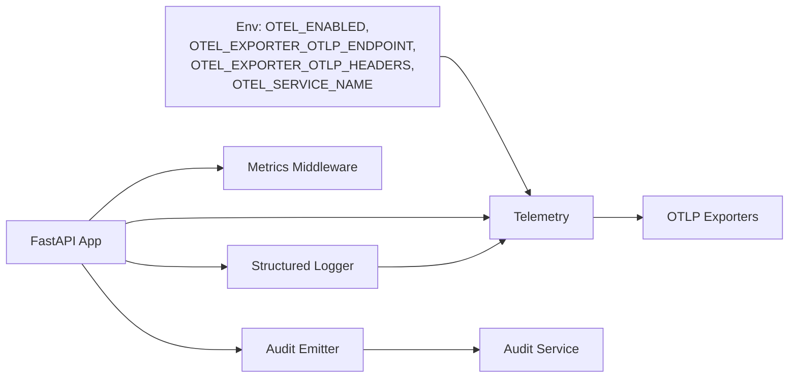

# Observability Conventions

<cite>
**Referenced Files in This Document**
- [observability-conventions.md](file://shared/shared-contracts/observability-conventions.md)
- [audit-event.schema.json](file://shared/shared-contracts/schemas/audit-event.schema.json)
- [telemetry.py (platform-gateway)](file://products/platform-gateway/src/platform_gateway/core/telemetry.py)
- [metrics.py (platform-gateway)](file://products/platform-gateway/src/platform_gateway/core/metrics.py)
- [request_context.py (platform-gateway)](file://products/platform-gateway/src/platform_gateway/core/request_context.py)
- [telemetry.py (agent-platform)](file://products/agent-platform/src/agent_service/core/telemetry.py)
- [metrics.py (agent-platform)](file://products/agent-platform/src/agent_service/core/metrics.py)
- [observability.py (tool-gateway)](file://products/tool-gateway/src/tool_gateway/core/observability.py)
- [observability.py (execution-runtime)](file://products/execution-runtime/src/execution_runtime/core/observability.py)
- [observability.py (identity-broker)](file://products/identity-broker/src/identity_service/core/observability.py)
- [audit_emitter.py (platform-gateway)](file://products/platform-gateway/src/platform_gateway/services/audit_emitter.py)
- [audit_emitter.py (agent-platform)](file://products/agent-platform/src/agent_service/services/audit_emitter.py)
- [audit_emitter.py (tool-gateway)](file://products/tool-gateway/src/tool_gateway/services/audit_emitter.py)
- [audit_emitter.py (identity-broker)](file://products/identity-broker/src/identity_service/services/audit_emitter.py)
- [audit_store.py (audit-service)](file://products/audit-service/src/audit_service/services/audit_store.py)
- [test_telemetry.py (platform-gateway)](file://products/platform-gateway/tests/test_telemetry.py)
- [test_telemetry.py (agent-platform)](file://products/agent-platform/tests/test_telemetry.py)
- [test_telemetry.py (incident-service)](file://products/incident-service/tests/test_telemetry.py)
- [test_observability.py (tool-gateway)](file://products/tool-gateway/tests/test_observability.py)
</cite>

## Table of Contents
1. Introduction
2. Project Structure
3. Core Components
4. Architecture Overview
5. Detailed Component Analysis
6. Dependency Analysis
7. Performance Considerations
8. Troubleshooting Guide
9. Conclusion
10. Appendices

## Introduction
This document defines the platform-wide observability conventions that ensure consistent metrics, tracing, and logging across all services. It explains how each service exposes a pull-based Prometheus endpoint, an opt-in OpenTelemetry push pipeline for traces, metrics, and mirrored logs, and how structured logs form the audit trail. It also documents metric naming, label cardinality rules, trace context propagation, log formatting, and the relationship between operational events and the durable audit trail.

## Project Structure
Observability is implemented per service with a consistent layout:
- A telemetry module initializes OpenTelemetry providers when enabled.
- A metrics module registers Prometheus counters/histograms and exposes /metrics.
- An observability/logging helper configures the root logger to INFO and emits single-line JSON events.
- Audit emitters ship canonical audit events to the audit service.
- Request context resolves correlation IDs bridging OTel trace context and x-request-id.



**Diagram sources**
- [telemetry.py (platform-gateway):69-117](file://products/platform-gateway/src/platform_gateway/core/telemetry.py#L69-L117)
- [metrics.py (platform-gateway):74-95](file://products/platform-gateway/src/platform_gateway/core/metrics.py#L74-L95)
- [observability.py (tool-gateway):9-24](file://products/tool-gateway/src/tool_gateway/core/observability.py#L9-L24)
- [audit_emitter.py (platform-gateway):77-98](file://products/platform-gateway/src/platform_gateway/services/audit_emitter.py#L77-L98)

**Section sources**
- [observability-conventions.md:9-16](file://shared/shared-contracts/observability-conventions.md#L9-L16)
- [telemetry.py (platform-gateway):1-13](file://products/platform-gateway/src/platform_gateway/core/telemetry.py#L1-L13)
- [metrics.py (platform-gateway):1-11](file://products/platform-gateway/src/platform_gateway/core/metrics.py#L1-L11)
- [observability.py (tool-gateway):9-24](file://products/tool-gateway/src/tool_gateway/core/observability.py#L9-L24)

## Core Components
- Pull metrics surface: Always-on Prometheus endpoint via prometheus_client with RED middleware.
- Opt-in OTel push: Traces, metrics, and logs exported over OTLP HTTP/protobuf; gated by OTEL_ENABLED; fails open.
- Structured logs: Single-line JSON at INFO level; OTLP mirror attached when OTel is enabled.
- Correlation: x-request-id bridges W3C trace_id when tracing is active; otherwise generated UUID.
- Audit trail: Canonical event envelope shipped to the audit service with bounded enums and stable fields.

Key implementation references:
- Telemetry initialization and log bridge attachment are identical across services.
- Metrics modules define service-specific counters/gauges and expose /metrics.
- Logging helpers raise root logger to INFO and emit structured events.
- Audit emitters post canonical envelopes to the audit service.

**Section sources**
- [observability-conventions.md:18-57](file://shared/shared-contracts/observability-conventions.md#L18-L57)
- [observability-conventions.md:58-77](file://shared/shared-contracts/observability-conventions.md#L58-L77)
- [telemetry.py (platform-gateway):69-117](file://products/platform-gateway/src/platform_gateway/core/telemetry.py#L69-L117)
- [metrics.py (platform-gateway):74-95](file://products/platform-gateway/src/platform_gateway/core/metrics.py#L74-L95)
- [observability.py (tool-gateway):9-24](file://products/tool-gateway/src/tool_gateway/core/observability.py#L9-L24)
- [audit-event.schema.json:1-94](file://shared/shared-contracts/schemas/audit-event.schema.json#L1-L94)

## Architecture Overview
The platform uses two decoupled surfaces:
- /metrics: collector-independent Prometheus scraping endpoint.
- OTLP push: opt-in traces, metrics, and logs sent to OpenObserve via OTLP HTTP/protobuf.

Request flow spans multiple services with automatic trace propagation via W3C Trace Context and explicit correlation via x-request-id.



**Diagram sources**
- [request_context.py (platform-gateway):8-19](file://products/platform-gateway/src/platform_gateway/core/request_context.py#L8-L19)
- [telemetry.py (platform-gateway):69-117](file://products/platform-gateway/src/platform_gateway/core/telemetry.py#L69-L117)
- [audit_emitter.py (platform-gateway):77-98](file://products/platform-gateway/src/platform_gateway/services/audit_emitter.py#L77-L98)
- [audit-event.schema.json:1-94](file://shared/shared-contracts/schemas/audit-event.schema.json#L1-L94)

**Section sources**
- [observability-conventions.md:9-16](file://shared/shared-contracts/observability-conventions.md#L9-L16)
- [observability-conventions.md:47-57](file://shared/shared-contracts/observability-conventions.md#L47-L57)
- [observability-conventions.md:71-77](file://shared/shared-contracts/observability-conventions.md#L71-L77)

## Detailed Component Analysis

### OpenTelemetry Integration
Each service provides a telemetry module that:
- Reads OTEL_ENABLED to decide whether to initialize providers.
- Creates Resource with service.name from OTEL_SERVICE_NAME or metadata.
- Configures TracerProvider with BatchSpanProcessor and OTLPSpanExporter.
- Configures MeterProvider with PeriodicExportingMetricReader and OTLPMetricExporter.
- Attaches a LoggingHandler to the root logger to mirror structured logs to OTLP.
- Instruments FastAPI and HTTPX clients automatically.
- Exposes current_trace_id() for correlation bridging.



**Diagram sources**
- [telemetry.py (platform-gateway):69-117](file://products/platform-gateway/src/platform_gateway/core/telemetry.py#L69-L117)
- [telemetry.py (agent-platform):69-117](file://products/agent-platform/src/agent_service/core/telemetry.py#L69-L117)

**Section sources**
- [telemetry.py (platform-gateway):1-13](file://products/platform-gateway/src/platform_gateway/core/telemetry.py#L1-L13)
- [telemetry.py (platform-gateway):28-35](file://products/platform-gateway/src/platform_gateway/core/telemetry.py#L28-L35)
- [telemetry.py (platform-gateway):37-66](file://products/platform-gateway/src/platform_gateway/core/telemetry.py#L37-L66)
- [telemetry.py (platform-gateway):69-117](file://products/platform-gateway/src/platform_gateway/core/telemetry.py#L69-L117)
- [telemetry.py (platform-gateway):120-133](file://products/platform-gateway/src/platform_gateway/core/telemetry.py#L120-L133)

### Metric Naming and Labels
- Format: <service>_<noun>_<unit>, snake_case.
- Counters use _total suffix.
- Standard labels include method, handler, status for HTTP RED metrics.
- Domain counters use bounded enum labels only (e.g., decision ∈ {allow, deny}).
- High-cardinality labels (raw URL, user id, session id, request id) are forbidden.

Examples implemented in gateway and agent platform:
- HTTP requests and duration histograms.
- Policy decisions, token verification, delegation cache/exchange counters.
- Agent sessions created, chat requests, model discovery refreshes.

**Section sources**
- [observability-conventions.md:18-45](file://shared/shared-contracts/observability-conventions.md#L18-L45)
- [metrics.py (platform-gateway):25-65](file://products/platform-gateway/src/platform_gateway/core/metrics.py#L25-L65)
- [metrics.py (agent-platform):23-43](file://products/agent-platform/src/agent_service/core/metrics.py#L23-L43)
- [metrics.py (agent-platform):202-224](file://products/agent-platform/src/agent_service/core/metrics.py#L202-L224)

### Trace Context Propagation and Correlation
- x-request-id is the portal-facing correlation key; preserved if present, else bridged to active OTel trace_id when tracing is on, else generated UUID.
- traceparent (W3C Trace Context) is managed by OTel instrumentation across hops.
- current_trace_id() returns the active span’s W3C trace_id when tracing is enabled.



**Diagram sources**
- [request_context.py (platform-gateway):8-19](file://products/platform-gateway/src/platform_gateway/core/request_context.py#L8-L19)
- [telemetry.py (platform-gateway):120-133](file://products/platform-gateway/src/platform_gateway/core/telemetry.py#L120-L133)

**Section sources**
- [observability-conventions.md:71-77](file://shared/shared-contracts/observability-conventions.md#L71-L77)
- [request_context.py (platform-gateway):8-19](file://products/platform-gateway/src/platform_gateway/core/request_context.py#L8-L19)
- [telemetry.py (platform-gateway):120-133](file://products/platform-gateway/src/platform_gateway/core/telemetry.py#L120-L133)

### Structured Logging Standards
- All business and request events are emitted as single-line JSON via log_event(...) at INFO level.
- configure_logging() raises the root logger from WARNING to INFO so audit records survive.
- LOG_LEVEL can override per deployment; default must remain INFO.
- When OTel is enabled, a LoggingHandler mirrors stdout JSON into OTLP logs; stdout remains source of truth.



**Diagram sources**
- [observability.py (tool-gateway):9-24](file://products/tool-gateway/src/tool_gateway/core/observability.py#L9-L24)
- [observability.py (execution-runtime):9-24](file://products/execution-runtime/src/execution_runtime/core/observability.py#L9-L24)
- [observability.py (identity-broker):9-24](file://products/identity-broker/src/identity_service/core/observability.py#L9-L24)
- [telemetry.py (platform-gateway):37-66](file://products/platform-gateway/src/platform_gateway/core/telemetry.py#L37-L66)

**Section sources**
- [observability-conventions.md:58-69](file://shared/shared-contracts/observability-conventions.md#L58-L69)
- [observability.py (tool-gateway):9-24](file://products/tool-gateway/src/tool_gateway/core/observability.py#L9-L24)
- [observability.py (execution-runtime):9-24](file://products/execution-runtime/src/execution_runtime/core/observability.py#L9-L24)
- [observability.py (identity-broker):9-24](file://products/identity-broker/src/identity_service/core/observability.py#L9-L24)

### Audit Trail Relationship
- Emitters mint event_id and occurred_at, then post canonical envelopes to the audit service.
- The audit service stores and returns envelopes verbatim; queries aggregate by event_type, outcome, service, and decision chains.
- Operational events (http_request) are observability data and excluded from the audit contract.

```mermaid
sequenceDiagram
participant Svc as "Service"
participant Aud as "Audit Service"
Svc->>Svc : Build audit envelope<br/>event_id, occurred_at, event_type, service, request_id, outcome
Svc->>Aud : POST /api/v1/audit/events
Aud-->>Svc : 202 Accepted
Note over Svc,Aud : Envelope stored verbatim; queries aggregate counts and chains
```

**Diagram sources**
- [audit-event.schema.json:1-94](file://shared/shared-contracts/schemas/audit-event.schema.json#L1-L94)
- [audit_store.py (audit-service):467-496](file://products/audit-service/src/audit_service/services/audit_store.py#L467-L496)
- [audit_emitter.py (platform-gateway):77-98](file://products/platform-gateway/src/platform_gateway/services/audit_emitter.py#L77-L98)

**Section sources**
- [audit-event.schema.json:1-94](file://shared/shared-contracts/schemas/audit-event.schema.json#L1-L94)
- [audit_store.py (audit-service):467-496](file://products/audit-service/src/audit_service/services/audit_store.py#L467-L496)
- [audit_emitter.py (platform-gateway):77-98](file://products/platform-gateway/src/platform_gateway/services/audit_emitter.py#L77-L98)
- [audit_emitter.py (agent-platform):77-98](file://products/agent-platform/src/agent_service/services/audit_emitter.py#L77-L98)
- [audit_emitter.py (tool-gateway):76-97](file://products/tool-gateway/src/tool_gateway/services/audit_emitter.py#L76-L97)
- [audit_emitter.py (identity-broker):78-99](file://products/identity-broker/src/identity_service/services/audit_emitter.py#L78-L99)

## Dependency Analysis
Services depend on shared conventions and internal modules:
- Telemetry depends on environment variables and optional OTLP backend.
- Metrics depend on prometheus_client and FastAPI middleware.
- Logging depends on Python logging and optional OTel LoggingHandler.
- Audit emission depends on configured audit service URL and credentials.



**Diagram sources**
- [telemetry.py (platform-gateway):1-13](file://products/platform-gateway/src/platform_gateway/core/telemetry.py#L1-L13)
- [metrics.py (platform-gateway):74-95](file://products/platform-gateway/src/platform_gateway/core/metrics.py#L74-L95)
- [observability.py (tool-gateway):9-24](file://products/tool-gateway/src/tool_gateway/core/observability.py#L9-L24)
- [audit_emitter.py (platform-gateway):77-98](file://products/platform-gateway/src/platform_gateway/services/audit_emitter.py#L77-L98)

**Section sources**
- [observability-conventions.md:47-57](file://shared/shared-contracts/observability-conventions.md#L47-L57)
- [telemetry.py (platform-gateway):69-117](file://products/platform-gateway/src/platform_gateway/core/telemetry.py#L69-L117)
- [metrics.py (platform-gateway):74-95](file://products/platform-gateway/src/platform_gateway/core/metrics.py#L74-L95)

## Performance Considerations
- OTel push is off by default; when enabled, batch processors minimize overhead.
- Unbounded label cardinality is prohibited to avoid storage and query cost spikes.
- Fail-open semantics ensure unreachable backends do not break requests.
- /metrics is lightweight and independent of OTel.

[No sources needed since this section provides general guidance]

## Troubleshooting Guide
Common issues and diagnostics:
- OTel disabled: setup_telemetry returns early; no providers initialized.
- OTel enabled but unreachable: exporters drop telemetry; health and /metrics remain functional.
- Logging level too high: ensure configure_logging() sets root to INFO; audit records will be lost otherwise.
- Missing correlation: verify x-request-id resolution and presence of traceparent across hops.

Relevant tests validate behavior:
- Disabled initialization leaves no providers or bridge attached.
- Enabled initialization attaches LoggingHandler and instruments app.
- Unreachable collector still serves /health/live and /metrics.

**Section sources**
- [test_telemetry.py (platform-gateway):45-66](file://products/platform-gateway/tests/test_telemetry.py#L45-L66)
- [test_telemetry.py (agent-platform):45-66](file://products/agent-platform/tests/test_telemetry.py#L45-L66)
- [test_telemetry.py (incident-service):45-66](file://products/incident-service/tests/test_telemetry.py#L45-L66)
- [test_observability.py (tool-gateway):128-157](file://products/tool-gateway/tests/test_observability.py#L128-L157)

## Conclusion
The platform enforces a uniform observability model: always-on Prometheus metrics, opt-in OTel push for traces/metrics/logs, structured JSON logs as the audit trail, and robust correlation across service boundaries. Services implement these conventions consistently, enabling reliable dashboards, distributed tracing, and auditable operations.

[No sources needed since this section summarizes without analyzing specific files]

## Appendices

### Implementing Observability in a New Service
- Add a telemetry module following the existing pattern: read OTEL_ENABLED, initialize providers, attach log bridge, instrument FastAPI and HTTPX, expose current_trace_id().
- Add a metrics module: register counters/histograms with bounded labels, add RED middleware, expose GET /metrics.
- Add logging configuration: call configure_logging() at startup; emit structured events via log_event(...).
- Add audit emission: build canonical envelopes per schema and post to the audit service using the standard emitter pattern.
- Wire correlation: resolve x-request-id using the request context helper.

**Section sources**
- [telemetry.py (platform-gateway):69-117](file://products/platform-gateway/src/platform_gateway/core/telemetry.py#L69-L117)
- [metrics.py (platform-gateway):74-95](file://products/platform-gateway/src/platform_gateway/core/metrics.py#L74-L95)
- [observability.py (tool-gateway):9-24](file://products/tool-gateway/src/tool_gateway/core/observability.py#L9-L24)
- [audit-event.schema.json:1-94](file://shared/shared-contracts/schemas/audit-event.schema.json#L1-L94)
- [request_context.py (platform-gateway):8-19](file://products/platform-gateway/src/platform_gateway/core/request_context.py#L8-L19)

### Configuring Monitoring Dashboards
- Scrape /metrics from each service for RED metrics and domain counters.
- Use OTLP ingestion to correlate logs with traces via shared trace_id/x-request-id.
- Filter logs by service name and event types defined in the audit schema.

**Section sources**
- [observability-conventions.md:9-16](file://shared/shared-contracts/observability-conventions.md#L9-L16)
- [audit-event.schema.json:25-50](file://shared/shared-contracts/schemas/audit-event.schema.json#L25-L50)

### Debugging Issues Using the Unified Stack
- Start with /metrics to identify hotspots and error rates.
- Follow x-request-id across services; when tracing is enabled, it equals the active trace_id.
- Inspect OTLP logs correlated to the same trace/span to understand failures.
- Review audit events for policy decisions, tool invocations, and execution outcomes.

**Section sources**
- [observability-conventions.md:71-77](file://shared/shared-contracts/observability-conventions.md#L71-L77)
- [audit_store.py (audit-service):467-496](file://products/audit-service/src/audit_service/services/audit_store.py#L467-L496)
- [audit_emitter.py (platform-gateway):77-98](file://products/platform-gateway/src/platform_gateway/services/audit_emitter.py#L77-L98)