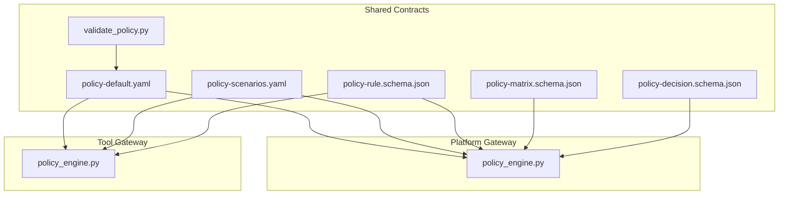
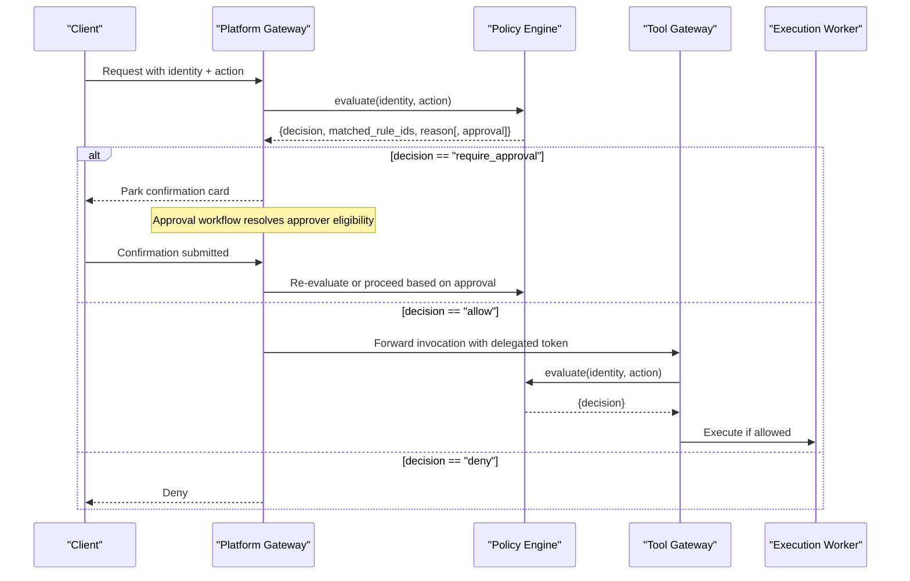
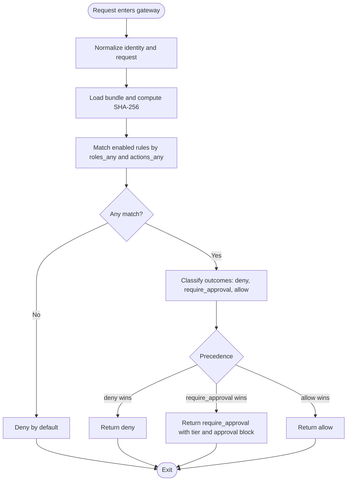
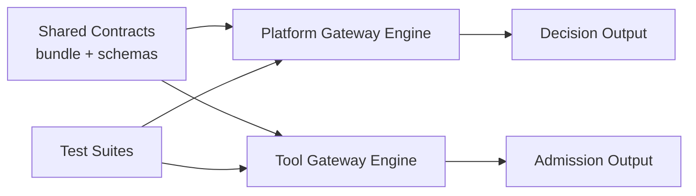

# Policy Definitions

<cite>
**Referenced Files in This Document**
- [policy-specification.md](file://docs/agentic-aiops-platform/policy-specification.md)
- [policy-default.yaml](file://shared/shared-contracts/policies/policy-default.yaml)
- [policy-scenarios.yaml](file://shared/shared-contracts/policies/policy-scenarios.yaml)
- [policy-rule.schema.json](file://shared/shared-contracts/schemas/policy-rule.schema.json)
- [policy-matrix.schema.json](file://shared/shared-contracts/schemas/policy-matrix.schema.json)
- [policy-decision.schema.json](file://shared/shared-contracts/schemas/policy-decision.schema.json)
- [validate_policy.py](file://shared/shared-contracts/scripts/validate_policy.py)
- [platform-gateway policy_engine.py](file://products/platform-gateway/src/platform_gateway/services/policy_engine.py)
- [tool-gateway policy_engine.py](file://products/tool-gateway/src/tool_gateway/services/policy_engine.py)
- [platform-gateway test_policy_engine.py](file://products/platform-gateway/tests/test_policy_engine.py)
- [tool-gateway test_policy_engine.py](file://products/tool-gateway/tests/test_policy_engine.py)
</cite>

## Table of Contents
1. Introduction
2. Project Structure
3. Core Components
4. Architecture Overview
5. Detailed Component Analysis
6. Dependency Analysis
7. Performance Considerations
8. Troubleshooting Guide
9. Conclusion
10. Appendices

## Introduction
This document explains the platform’s YAML-based policy definition format used for authorization and risk management across services. It covers rule structure, risk tiers, approval workflows, permission matrices, evaluation order, decision outcomes, and enforcement at service boundaries. It also provides guidance on testing, validation, migration strategies, and integration points with the platform gateway and tool gateway.

The policy model is a strict subset of the Tier-1 specification focused on action authorization with three outcomes: allow, deny, and require_approval. The default bundle defines role-to-action grants and a tier_2 approval requirement for mutating tool execution. A scenario file pins expected outcomes for every grant and named denial to prevent drift.

**Section sources**
- [policy-specification.md:1-120](file://docs/agentic-aiops-platform/policy-specification.md#L1-L120)
- [policy-default.yaml:1-52](file://shared/shared-contracts/policies/policy-default.yaml#L1-L52)

## Project Structure
Policy assets are centrally defined under shared contracts and consumed by both gateways:
- Canonical bundle: shared/shared-contracts/policies/policy-default.yaml
- Scenario expectations: shared/shared-contracts/policies/policy-scenarios.yaml
- Schemas: shared/shared-contracts/schemas/*
- Validation script: shared/shared-contracts/scripts/validate_policy.py
- Platform gateway engine: products/platform-gateway/src/platform_gateway/services/policy_engine.py
- Tool gateway engine: products/tool-gateway/src/tool_gateway/services/policy_engine.py

**Diagram sources**
- [policy-default.yaml:1-52](file://shared/shared-contracts/policies/policy-default.yaml#L1-L52)
- [policy-scenarios.yaml:1-20](file://shared/shared-contracts/policies/policy-scenarios.yaml#L1-L20)
- [policy-rule.schema.json:1-105](file://shared/shared-contracts/schemas/policy-rule.schema.json#L1-L105)
- [policy-matrix.schema.json:1-85](file://shared/shared-contracts/schemas/policy-matrix.schema.json#L1-L85)
- [policy-decision.schema.json:1-60](file://shared/shared-contracts/schemas/policy-decision.schema.json#L1-L60)
- [validate_policy.py:1-91](file://shared/shared-contracts/scripts/validate_policy.py#L1-L91)
- [platform-gateway policy_engine.py:1-127](file://products/platform-gateway/src/platform_gateway/services/policy_engine.py#L1-L127)
- [tool-gateway policy_engine.py:1-52](file://products/tool-gateway/src/tool_gateway/services/policy_engine.py#L1-L52)

**Section sources**
- [policy-default.yaml:1-52](file://shared/shared-contracts/policies/policy-default.yaml#L1-L52)
- [policy-scenarios.yaml:1-20](file://shared/shared-contracts/policies/policy-scenarios.yaml#L1-L20)
- [policy-rule.schema.json:1-105](file://shared/shared-contracts/schemas/policy-rule.schema.json#L1-L105)
- [policy-matrix.schema.json:1-85](file://shared/shared-contracts/schemas/policy-matrix.schema.json#L1-L85)
- [policy-decision.schema.json:1-60](file://shared/shared-contracts/schemas/policy-decision.schema.json#L1-L60)
- [validate_policy.py:1-91](file://shared/shared-contracts/scripts/validate_policy.py#L1-L91)
- [platform-gateway policy_engine.py:1-127](file://products/platform-gateway/src/platform_gateway/services/policy_engine.py#L1-L127)
- [tool-gateway policy_engine.py:1-52](file://products/tool-gateway/src/tool_gateway/services/policy_engine.py#L1-L52)

## Core Components
- Policy bundle: versioned YAML containing rules that map roles to actions with decisions (allow, deny, require_approval).
- Rule schema: JSON Schema enforcing required fields, match constraints, and outcome/approval compatibility.
- Decision schema: standardized response shape returned by evaluation, including matched rule IDs and optional approval context.
- Matrix schema: read-only effective matrix derived from the loaded bundle for transparency.
- Scenarios: curated expectations covering all grants and named denials across API and tools surfaces.
- Engines: per-service evaluators implementing deny-by-default, precedence, and approval semantics with service-specific bridging.

Key behaviors enforced by engines:
- Deny by default when no rule matches.
- Explicit deny overrides require_approval and allow.
- require_approval overrides allow within matching rules.
- Higher priority wins among same-outcome matches.
- Disabled rules are ignored.

Approval tiers:
- tier_1: destructive-but-routine; self-approval allowed by default unless overridden.
- tier_2: critical destructive; self-approval forbidden by default and cannot be explicitly enabled.

**Section sources**
- [policy-rule.schema.json:1-105](file://shared/shared-contracts/schemas/policy-rule.schema.json#L1-L105)
- [policy-decision.schema.json:1-60](file://shared/shared-contracts/schemas/policy-decision.schema.json#L1-L60)
- [policy-matrix.schema.json:1-85](file://shared/shared-contracts/schemas/policy-matrix.schema.json#L1-L85)
- [policy-default.yaml:14-52](file://shared/shared-contracts/policies/policy-default.yaml#L14-L52)
- [platform-gateway policy_engine.py:119-127](file://products/platform-gateway/src/platform_gateway/services/policy_engine.py#L119-L127)
- [tool-gateway policy_engine.py:44-52](file://products/tool-gateway/src/tool_gateway/services/policy_engine.py#L44-L52)

## Architecture Overview
Policies are authored as a single canonical YAML bundle and validated against schemas before deployment. Both gateways load the bundle at startup and evaluate requests against it. The platform gateway bridges require_approval to a confirmation flow; the tool gateway enforces admission using allow/deny only.

**Diagram sources**
- [platform-gateway policy_engine.py:1-127](file://products/platform-gateway/src/platform_gateway/services/policy_engine.py#L1-L127)
- [tool-gateway policy_engine.py:1-52](file://products/tool-gateway/src/tool_gateway/services/policy_engine.py#L1-L52)
- [policy-default.yaml:119-152](file://shared/shared-contracts/policies/policy-default.yaml#L119-L152)

**Section sources**
- [policy-specification.md:484-517](file://docs/agentic-aiops-platform/policy-specification.md#L484-L517)
- [policy-default.yaml:119-152](file://shared/shared-contracts/policies/policy-default.yaml#L119-L152)

## Detailed Component Analysis

### Policy Bundle Format
- Top-level fields: version, rules.
- Each rule includes id, domain, description, priority, enabled, match, decision.
- Match supports roles_any and actions_any; additional properties are rejected by schema.
- Decision supports outcome and optional approval block when outcome is require_approval.
- Default bundle defines role grants for chat, sessions, tools, audit, incidents, skills, documents, approvals, and models.

Validation:
- Bundles must validate against policy-rule.schema.json.
- Duplicate rule IDs are rejected by the validator script.
- Version must be supported (currently 1).

**Section sources**
- [policy-rule.schema.json:1-105](file://shared/shared-contracts/schemas/policy-rule.schema.json#L1-L105)
- [policy-default.yaml:53-326](file://shared/shared-contracts/policies/policy-default.yaml#L53-L326)
- [validate_policy.py:32-86](file://shared/shared-contracts/scripts/validate_policy.py#L32-L86)

### Risk Tiers and Approval Workflows
- require_approval carries an approval block with tier and decided_by_roles.
- tier_1 allows self-approval by default; tier_2 forbids self-approval and rejects explicit allow_self_approval=true.
- Only actions with a bridged enforcement path can carry require_approval in each gateway.
- Platform gateway bridges tools:mutate through the confirm flow; tool gateway has no bridged actions and skips require_approval rules at load.

Decision output:
- When require_approval, the decision includes approval_tier and a mirrored approval block so callers do not re-read the bundle.

**Section sources**
- [policy-decision.schema.json:1-60](file://shared/shared-contracts/schemas/policy-decision.schema.json#L1-L60)
- [platform-gateway policy_engine.py:119-127](file://products/platform-gateway/src/platform_gateway/services/policy_engine.py#L119-L127)
- [tool-gateway policy_engine.py:44-52](file://products/tool-gateway/src/tool_gateway/services/policy_engine.py#L44-L52)
- [policy-default.yaml:139-152](file://shared/shared-contracts/policies/policy-default.yaml#L139-L152)

### Permission Matrix
- The matrix is a read-only view of effective permissions derived from the loaded bundle.
- It exposes version, source, sha256, scope, roles, actions, matrix cells, and approval_requirements.
- Cells answering require_approval read false in the matrix and appear in approval_requirements with tier and decider roles.

**Section sources**
- [policy-matrix.schema.json:1-85](file://shared/shared-contracts/schemas/policy-matrix.schema.json#L1-L85)

### Evaluation Order and Precedence
- Evaluate normalized identity and request attributes.
- Apply feature_access, action_authz, approval, and execution_gate domains in order.
- Within action_authz:
  - deny > require_approval > allow.
  - Among same outcome class, higher priority wins.
  - Disabled rules are ignored.
  - No match => deny.

**Section sources**
- [policy-specification.md:256-273](file://docs/agentic-aiops-platform/policy-specification.md#L256-L273)
- [policy-default.yaml:14-19](file://shared/shared-contracts/policies/policy-default.yaml#L14-L19)

### Service Boundary Enforcement

#### Platform Gateway
- Enforces portal-facing actions and bridges require_approval for tools:mutate via confirmation.
- Protected actions include chat, session operations, audit, incidents, policies, tools listing/mutating, skills, models, approvals, documents, and skill drafts/graduation.

**Section sources**
- [platform-gateway policy_engine.py:30-117](file://products/platform-gateway/src/platform_gateway/services/policy_engine.py#L30-L117)
- [platform-gateway test_policy_engine.py:320-349](file://products/platform-gateway/tests/test_policy_engine.py#L320-L349)

#### Tool Gateway
- Enforces tools:list, tools:invoke, and tools:mutate.
- Skips require_approval rules at load; admission remains allow/deny per SPEC-021.
- Protection surface limited to tool actions.

**Section sources**
- [tool-gateway policy_engine.py:32-42](file://products/tool-gateway/src/tool_gateway/services/policy_engine.py#L32-L42)
- [tool-gateway test_policy_engine.py:321-329](file://products/tool-gateway/tests/test_policy_engine.py#L321-L329)

### Default Policies
- Grants operators, approvers, developers, and observers access to chat and session operations.
- Observers may list and invoke read-only tools.
- Mutating tool execution requires tier_2 approval by designated approvers distinct from requester.
- Auditors may read audit trails; incident and skills surfaces have targeted grants.
- All roles may read policy and skills inventories.

**Section sources**
- [policy-default.yaml:53-326](file://shared/shared-contracts/policies/policy-default.yaml#L53-L326)

### Scenario Testing Configurations
- Scenarios enumerate expected outcomes for every granted (role, action) pair and named denials across api and tools surfaces.
- They enforce that new grants must be recorded alongside changes, preventing silent behavior shifts.

**Section sources**
- [policy-scenarios.yaml:1-20](file://shared/shared-contracts/policies/policy-scenarios.yaml#L1-L20)
- [policy-scenarios.yaml:21-238](file://shared/shared-contracts/policies/policy-scenarios.yaml#L21-L238)

### Custom Policy Authoring
- Add rules with unique ids, clear descriptions, appropriate priorities, and precise match sets.
- Use require_approval only for actions with a bridged enforcement path in the target gateway.
- For tier_1, rely on default self-approval unless you explicitly override; for tier_2, never set allow_self_approval=true.
- Keep disabled rules for safe rollouts; remove them after verification.

**Section sources**
- [policy-rule.schema.json:1-105](file://shared/shared-contracts/schemas/policy-rule.schema.json#L1-L105)
- [platform-gateway policy_engine.py:119-127](file://products/platform-gateway/src/platform_gateway/services/policy_engine.py#L119-L127)
- [tool-gateway policy_engine.py:44-52](file://products/tool-gateway/src/tool_gateway/services/policy_engine.py#L44-L52)

### Policy Evaluation Process and Decision Outcomes

**Diagram sources**
- [policy-specification.md:256-273](file://docs/agentic-aiops-platform/policy-specification.md#L256-L273)
- [policy-default.yaml:14-19](file://shared/shared-contracts/policies/policy-default.yaml#L14-L19)
- [platform-gateway policy_engine.py:119-127](file://products/platform-gateway/src/platform_gateway/services/policy_engine.py#L119-L127)
- [tool-gateway policy_engine.py:44-52](file://products/tool-gateway/src/tool_gateway/services/policy_engine.py#L44-L52)

**Section sources**
- [policy-specification.md:256-273](file://docs/agentic-aiops-platform/policy-specification.md#L256-L273)
- [policy-default.yaml:14-19](file://shared/shared-contracts/policies/policy-default.yaml#L14-L19)

## Dependency Analysis
- Shared contracts define the canonical bundle and schemas; both gateways depend on these artifacts.
- Platform gateway depends on approval bridging for tools:mutate; tool gateway does not bridge approvals.
- Tests assert contract alignment, protected action sets, precedence, and provenance hashes.

**Diagram sources**
- [policy-default.yaml:1-52](file://shared/shared-contracts/policies/policy-default.yaml#L1-L52)
- [policy-rule.schema.json:1-105](file://shared/shared-contracts/schemas/policy-rule.schema.json#L1-L105)
- [platform-gateway policy_engine.py:1-127](file://products/platform-gateway/src/platform_gateway/services/policy_engine.py#L1-L127)
- [tool-gateway policy_engine.py:1-52](file://products/tool-gateway/src/tool_gateway/services/policy_engine.py#L1-L52)
- [platform-gateway test_policy_engine.py:269-349](file://products/platform-gateway/tests/test_policy_engine.py#L269-L349)
- [tool-gateway test_policy_engine.py:270-329](file://products/tool-gateway/tests/test_policy_engine.py#L270-L329)

**Section sources**
- [platform-gateway test_policy_engine.py:269-349](file://products/platform-gateway/tests/test_policy_engine.py#L269-L349)
- [tool-gateway test_policy_engine.py:270-329](file://products/tool-gateway/tests/test_policy_engine.py#L270-L329)

## Performance Considerations
- Bundles are small and evaluated per request; caching occurs at module level keyed by configured path.
- SHA-256 provenance is computed once per load and reused for readiness/matrix surfaces.
- Avoid excessive rule counts and overly broad match sets to keep evaluation predictable.

[No sources needed since this section provides general guidance]

## Troubleshooting Guide
Common issues and how to detect them:
- Invalid YAML or malformed rules: load fails with PolicyLoadError.
- Unsupported bundle version or missing rules list: validation script reports errors.
- require_approval without approval block or invalid tier/deciders: load fails.
- tier_2 with allow_self_approval=true: rejected at load time.
- Unknown outcome values: rejected at load time.
- Missing configured policy path: load raises error; unset path falls back to packaged default.
- Drift between packaged and overlay bundles: tests enforce byte-identical copies.

Remediation steps:
- Run the validation script against your bundle before deployment.
- Review scenario expectations to ensure new grants are covered.
- Confirm protected action sets align with your gateway surface.
- Verify readiness/matrix surfaces report the expected bundle SHA-256.

**Section sources**
- [validate_policy.py:32-86](file://shared/shared-contracts/scripts/validate_policy.py#L32-L86)
- [platform-gateway test_policy_engine.py:170-202](file://products/platform-gateway/tests/test_policy_engine.py#L170-L202)
- [platform-gateway test_policy_engine.py:482-585](file://products/platform-gateway/tests/test_policy_engine.py#L482-L585)
- [tool-gateway test_policy_engine.py:179-211](file://products/tool-gateway/tests/test_policy_engine.py#L179-L211)
- [tool-gateway test_policy_engine.py:332-419](file://products/tool-gateway/tests/test_policy_engine.py#L332-L419)

## Conclusion
The platform uses a single, versioned YAML policy bundle validated against strict schemas and enforced consistently by both gateways. The model centers on deny-by-default, explicit precedence, and tiered approvals where bridged. The default bundle establishes operational posture, while scenarios lock down expected behavior. Operators author custom policies by adding rules with clear intent, validating them, and verifying outcomes through scenarios and tests.

[No sources needed since this section summarizes without analyzing specific files]

## Appendices

### Appendix A: Rule Fields and Constraints
- id: unique identifier.
- domain: currently action_authz.
- description: human-readable explanation.
- priority: numeric precedence.
- enabled: participation flag.
- match: roles_any, actions_any.
- decision: outcome and optional approval block for require_approval.

**Section sources**
- [policy-rule.schema.json:1-105](file://shared/shared-contracts/schemas/policy-rule.schema.json#L1-L105)

### Appendix B: Decision Fields
- decision: allow, deny, require_approval.
- matched_rule_ids: identifiers of matching rules.
- reason: human-readable explanation.
- action, subject: contextual fields.
- approval_tier, approval: present when require_approval.

**Section sources**
- [policy-decision.schema.json:1-60](file://shared/shared-contracts/schemas/policy-decision.schema.json#L1-L60)

### Appendix C: Matrix Surface
- version, source, sha256, scope, roles, actions, matrix, approval_requirements.
- Provides transparency into effective permissions and approval requirements.

**Section sources**
- [policy-matrix.schema.json:1-85](file://shared/shared-contracts/schemas/policy-matrix.schema.json#L1-L85)

### Appendix D: Migration Strategy
- Maintain a single canonical bundle under shared contracts.
- Bump version on every rule change and keep Git history as authority.
- Use make sync-policy to propagate identical bundles to overlays; tests enforce byte equality.
- Validate with the provided script and run scenario checks before deployment.
- Roll out changes incrementally using disabled rules, then enable after verification.

**Section sources**
- [policy-default.yaml:7-12](file://shared/shared-contracts/policies/policy-default.yaml#L7-L12)
- [platform-gateway test_policy_engine.py:285-301](file://products/platform-gateway/tests/test_policy_engine.py#L285-L301)
- [tool-gateway test_policy_engine.py:286-302](file://products/tool-gateway/tests/test_policy_engine.py#L286-L302)
- [validate_policy.py:1-91](file://shared/shared-contracts/scripts/validate_policy.py#L1-L91)