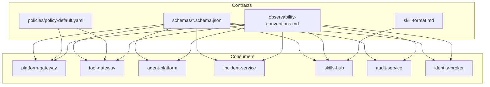
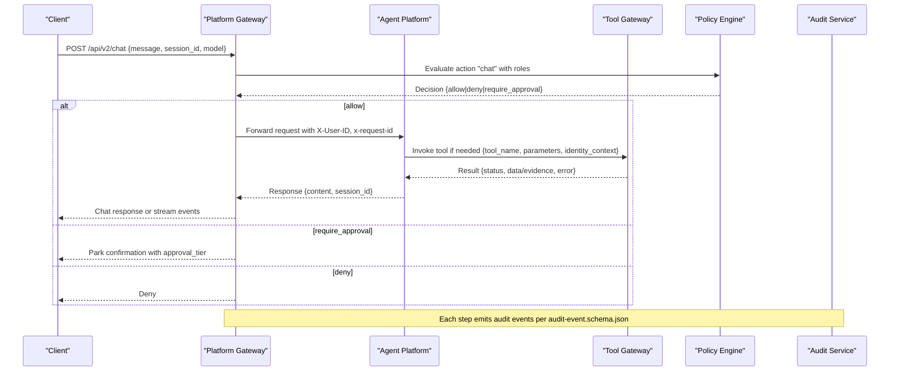
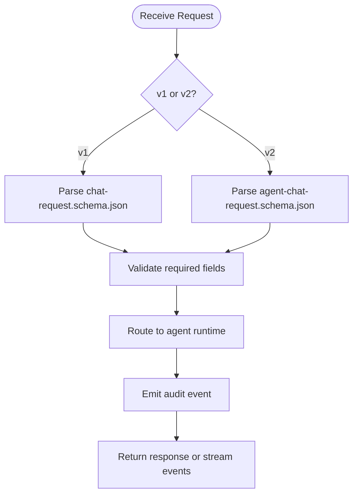
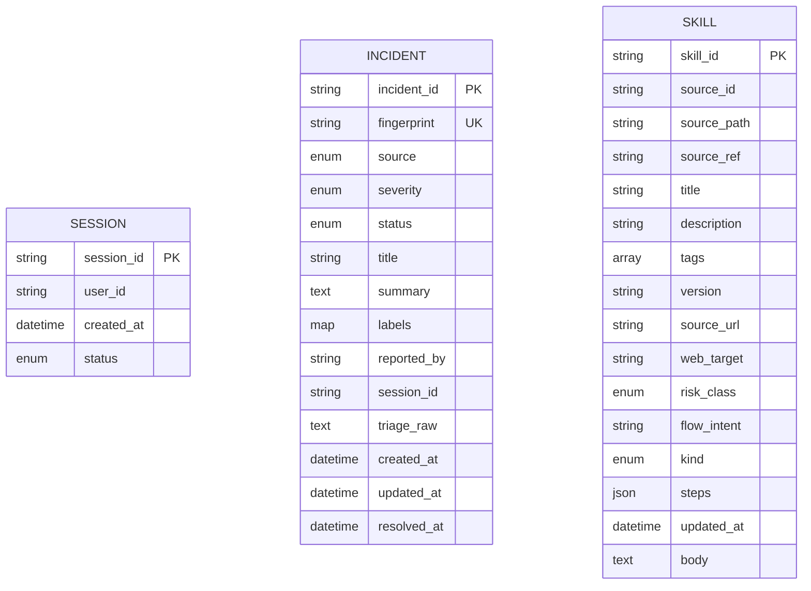
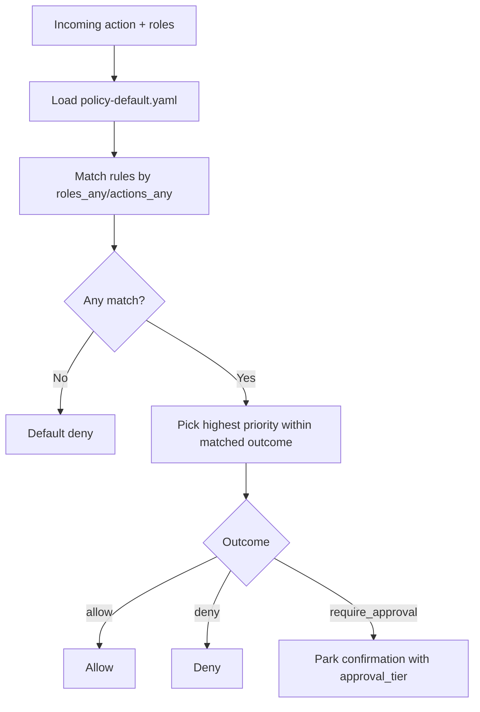
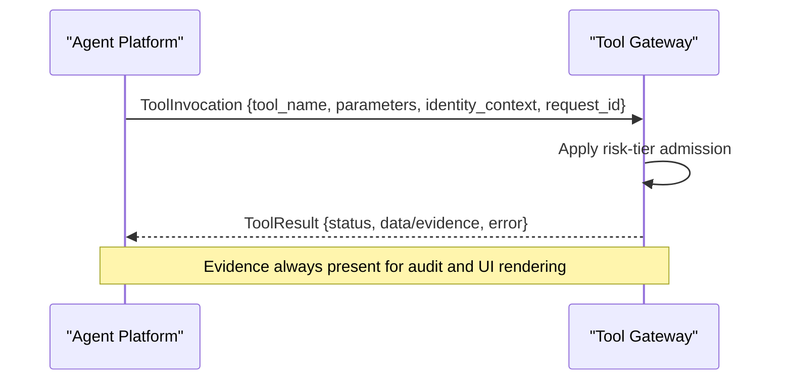
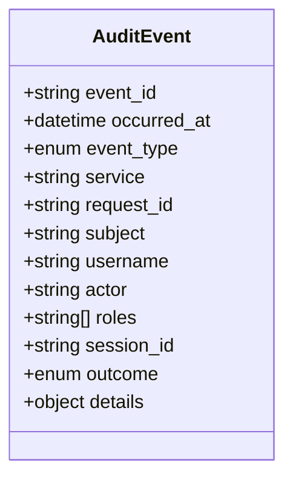
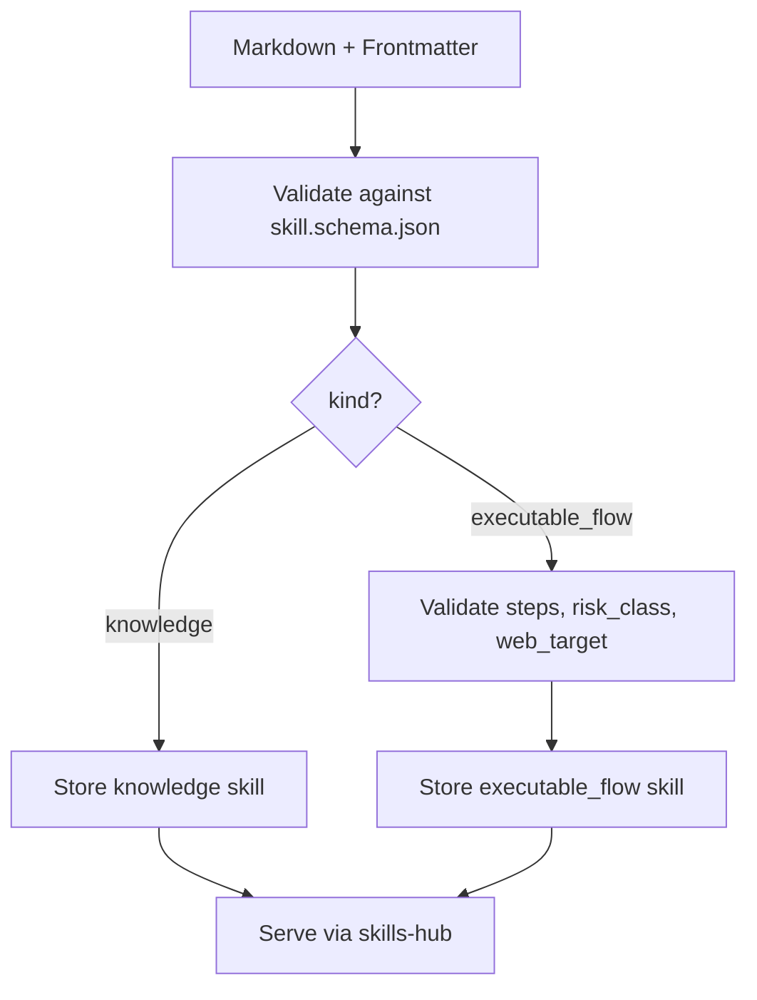
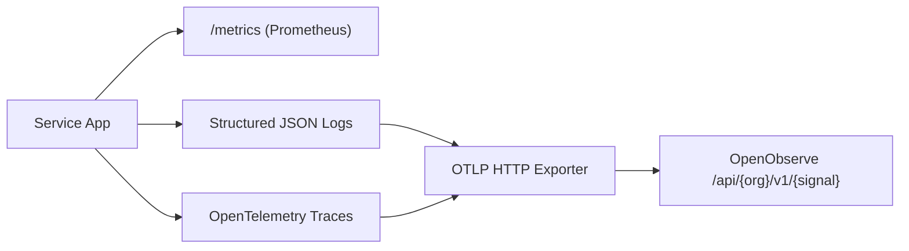
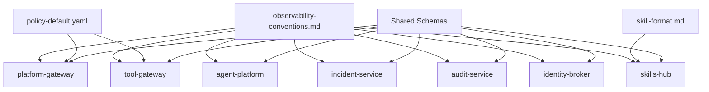

# Shared Contracts

<cite>
**Referenced Files in This Document**
- [README.md](file://shared/shared-contracts/README.md)
- [agent-chat-request.schema.json](file://shared/shared-contracts/schemas/agent-chat-request.schema.json)
- [chat-request.schema.json](file://shared/shared-contracts/schemas/chat-request.schema.json)
- [chat-response.schema.json](file://shared/shared-contracts/schemas/chat-response.schema.json)
- [stream-event.schema.json](file://shared/shared-contracts/schemas/stream-event.schema.json)
- [session.schema.json](file://shared/shared-contracts/schemas/session.schema.json)
- [incident.schema.json](file://shared/shared-contracts/schemas/incident.schema.json)
- [skill.schema.json](file://shared/shared-contracts/schemas/skill.schema.json)
- [policy-decision.schema.json](file://shared/shared-contracts/schemas/policy-decision.schema.json)
- [audit-event.schema.json](file://shared/shared-contracts/schemas/audit-event.schema.json)
- [tool-invocation.schema.json](file://shared/shared-contracts/schemas/tool-invocation.schema.json)
- [tool-result.schema.json](file://shared/shared-contracts/schemas/tool-result.schema.json)
- [identity-context.schema.json](file://shared/shared-contracts/schemas/identity-context.schema.json)
- [policy-default.yaml](file://shared/shared-contracts/policies/policy-default.yaml)
- [validate_policy.py](file://shared/shared-contracts/scripts/validate_policy.py)
- [skill-format.md](file://shared/shared-contracts/skill-format.md)
- [observability-conventions.md](file://shared/shared-contracts/observability-conventions.md)
</cite>

## Table of Contents
1. Introduction
2. Project Structure
3. Core Components
4. Architecture Overview
5. Detailed Component Analysis
6. Dependency Analysis
7. Performance Considerations
8. Troubleshooting Guide
9. Conclusion
10. Appendices

## Introduction
This document defines the shared contracts that establish communication boundaries between platform services. It covers JSON Schema definitions for API requests, responses, events, and domain models; the policy bundle format used for authorization rules, risk tiers, and approval workflows; the skill format specification for Markdown-based operational guidance authoring; and observability conventions for metrics, tracing, and logging. It also explains schema validation processes, versioning strategies, migration guidelines, and provides examples of how services consume and produce these standardized formats.

## Project Structure
The shared contracts live under shared/shared-contracts and are organized into:
- schemas: JSON Schema files defining request/response/event/domain contracts
- policies: YAML bundles encoding authorization rules and approval workflows
- scripts: CLI tools to validate policy bundles against their schema
- skill-format.md: Authoring contract for skills consumed by skills-hub
- observability-conventions.md: Cross-service standards for metrics, tracing, and logging

**Diagram sources**
- [README.md:21-50](file://shared/shared-contracts/README.md#L21-L50)

**Section sources**
- [README.md:1-50](file://shared/shared-contracts/README.md#L1-L50)

## Core Components
- API request/response envelopes: chat v1/v2, streaming events, health, identity context
- Domain models: session, incident, skill
- Policy models: rule, decision, matrix (described via bundle and decision schema)
- Tool execution envelope: invocation and result
- Audit event envelope
- Observability conventions: metrics naming, OTel switches, correlation bridging
- Skill authoring contract: Markdown + frontmatter with optional executable-flow steps

Key responsibilities:
- Enforce consistent wire formats across services
- Provide a single source of truth for authorization rules
- Standardize audit and observability signals
- Define safe, validated skill artifacts for knowledge and executable flows

**Section sources**
- [README.md:21-122](file://shared/shared-contracts/README.md#L21-L122)
- [observability-conventions.md:1-81](file://shared/shared-contracts/observability-conventions.md#L1-L81)

## Architecture Overview
The shared contracts define clear boundaries:
- Identity travels in headers on v2 agent endpoints; tokens are issued by identity-broker and verified at gateways
- Platform-gateway and tool-gateway enforce policy using the canonical bundle
- Agent-platform invokes tools through tool-gateway using the tool invocation/result envelope
- Incident-service persists incidents conforming to the incident schema
- Skills-hub ingests skills from Markdown documents validated against the skill schema and skill-format rules
- All services emit audit events and telemetry following shared conventions

**Diagram sources**
- [agent-chat-request.schema.json:1-35](file://shared/shared-contracts/schemas/agent-chat-request.schema.json#L1-L35)
- [policy-decision.schema.json:1-60](file://shared/shared-contracts/schemas/policy-decision.schema.json#L1-L60)
- [tool-invocation.schema.json:1-35](file://shared/shared-contracts/schemas/tool-invocation.schema.json#L1-L35)
- [tool-result.schema.json:1-69](file://shared/shared-contracts/schemas/tool-result.schema.json#L1-L69)
- [audit-event.schema.json:1-94](file://shared/shared-contracts/schemas/audit-event.schema.json#L1-L94)

## Detailed Component Analysis

### API Contracts: Chat v1 and v2, Streaming Events
- Chat v1 request/response and stream events define the portal/gateway boundary
- Chat v2 (agent-* schemas) moves identity to headers, renames content/delta fields, and standardizes stream event type field
- Both versions include correlation identifiers and session scoping

**Diagram sources**
- [chat-request.schema.json:1-38](file://shared/shared-contracts/schemas/chat-request.schema.json#L1-L38)
- [chat-response.schema.json:1-26](file://shared/shared-contracts/schemas/chat-response.schema.json#L1-L26)
- [stream-event.schema.json:1-27](file://shared/shared-contracts/schemas/stream-event.schema.json#L1-L27)
- [agent-chat-request.schema.json:1-35](file://shared/shared-contracts/schemas/agent-chat-request.schema.json#L1-L35)

**Section sources**
- [chat-request.schema.json:1-38](file://shared/shared-contracts/schemas/chat-request.schema.json#L1-L38)
- [chat-response.schema.json:1-26](file://shared/shared-contracts/schemas/chat-response.schema.json#L1-L26)
- [stream-event.schema.json:1-27](file://shared/shared-contracts/schemas/stream-event.schema.json#L1-L27)
- [agent-chat-request.schema.json:1-35](file://shared/shared-contracts/schemas/agent-chat-request.schema.json#L1-L35)
- [README.md:52-67](file://shared/shared-contracts/README.md#L52-L67)

### Domain Models: Session, Incident, Skill
- Session: minimal lifecycle state with timestamps and ownership
- Incident: canonical envelope for alertmanager/manual intake with lifecycle states and triage metadata
- Skill: Markdown-backed knowledge or executable flow with frontmatter constraints, optional steps, and risk class

**Diagram sources**
- [session.schema.json:1-26](file://shared/shared-contracts/schemas/session.schema.json#L1-L26)
- [incident.schema.json:1-95](file://shared/shared-contracts/schemas/incident.schema.json#L1-L95)
- [skill.schema.json:1-125](file://shared/shared-contracts/schemas/skill.schema.json#L1-L125)

**Section sources**
- [session.schema.json:1-26](file://shared/shared-contracts/schemas/session.schema.json#L1-L26)
- [incident.schema.json:1-95](file://shared/shared-contracts/schemas/incident.schema.json#L1-L95)
- [skill.schema.json:1-125](file://shared/shared-contracts/schemas/skill.schema.json#L1-L125)

### Policy Bundle and Decision Model
- The policy bundle is a YAML file with a versioned list of rules, each with match criteria and decisions (allow, deny, require_approval)
- Approval tiers: tier_1 (self-approval allowed by default), tier_2 (requires designated approver distinct from requester)
- Precedence: deny > require_approval > allow; higher priority wins within an outcome
- Decision object mirrors winning rule’s approval block when applicable

**Diagram sources**
- [policy-default.yaml:1-326](file://shared/shared-contracts/policies/policy-default.yaml#L1-L326)
- [policy-decision.schema.json:1-60](file://shared/shared-contracts/schemas/policy-decision.schema.json#L1-L60)

**Section sources**
- [policy-default.yaml:1-326](file://shared/shared-contracts/policies/policy-default.yaml#L1-L326)
- [policy-decision.schema.json:1-60](file://shared/shared-contracts/schemas/policy-decision.schema.json#L1-L60)
- [README.md:79-96](file://shared/shared-contracts/README.md#L79-L96)

### Tool Execution Contract
- Invocation envelope carries tool name, parameters, identity context, and request correlation
- Result envelope includes status, data or error, and evidence with provenance fields
- Status values: success, error, denied; denied indicates policy rejection

**Diagram sources**
- [tool-invocation.schema.json:1-35](file://shared/shared-contracts/schemas/tool-invocation.schema.json#L1-L35)
- [tool-result.schema.json:1-69](file://shared/shared-contracts/schemas/tool-result.schema.json#L1-L69)

**Section sources**
- [tool-invocation.schema.json:1-35](file://shared/shared-contracts/schemas/tool-invocation.schema.json#L1-L35)
- [tool-result.schema.json:1-69](file://shared/shared-contracts/schemas/tool-result.schema.json#L1-L69)
- [README.md:98-113](file://shared/shared-contracts/README.md#L98-L113)

### Audit Event Contract
- Canonical envelope emitted by all services for audited actions
- Closed vocabulary of event types and outcomes
- Details carry per-event-type payloads including tool invocations, policy decisions, sessions, confirmations, incidents, skills, executions, documents, and graduation

**Diagram sources**
- [audit-event.schema.json:1-94](file://shared/shared-contracts/schemas/audit-event.schema.json#L1-L94)

**Section sources**
- [audit-event.schema.json:1-94](file://shared/shared-contracts/schemas/audit-event.schema.json#L1-L94)

### Skill Format Specification
- Skills are Markdown files with YAML frontmatter validated against the skill schema
- Knowledge skills: prose-only; executable_flow skills: include ordered steps with tool names and arguments
- Constraints: size caps, tag limits, credential references only (no literals), web_target requirements for browser steps
- Graduation produces executable-flow drafts with deterministic re-validation

**Diagram sources**
- [skill.schema.json:1-125](file://shared/shared-contracts/schemas/skill.schema.json#L1-L125)
- [skill-format.md:1-203](file://shared/shared-contracts/skill-format.md#L1-L203)

**Section sources**
- [skill.schema.json:1-125](file://shared/shared-contracts/schemas/skill.schema.json#L1-L125)
- [skill-format.md:1-203](file://shared/shared-contracts/skill-format.md#L1-L203)

### Observability Conventions
- Two surfaces: always-on Prometheus /metrics and opt-in OpenTelemetry push
- Metric naming: <service>_<noun>_<unit>, counters with _total suffix
- Cardinality rules: no high-cardinality labels (e.g., raw URLs, user ids, session ids)
- OTel switch semantics: OTEL_ENABLED gates all OTel signal initialization
- Structured logging: INFO-level JSON records; OTLP log bridge joins logs to traces
- Correlation: x-request-id bridges logs and traces via W3C traceparent

**Diagram sources**
- [observability-conventions.md:1-81](file://shared/shared-contracts/observability-conventions.md#L1-L81)

**Section sources**
- [observability-conventions.md:1-81](file://shared/shared-contracts/observability-conventions.md#L1-L81)

## Dependency Analysis
- Services depend on shared schemas for request/response/event validation
- Gateways depend on the canonical policy bundle for authorization
- Skills-hub depends on skill-format.md and skill.schema.json for ingestion
- All services depend on observability-conventions.md for consistent telemetry

**Diagram sources**
- [README.md:21-50](file://shared/shared-contracts/README.md#L21-L50)
- [observability-conventions.md:1-81](file://shared/shared-contracts/observability-conventions.md#L1-L81)

**Section sources**
- [README.md:21-50](file://shared/shared-contracts/README.md#L21-L50)

## Performance Considerations
- Keep metric labels bounded to avoid cardinality explosion
- Use templated handler labels instead of raw URLs
- Disable OTel push when not needed to eliminate overhead
- Prefer streaming responses for long-running agent interactions
- Cache JWKS and policy bundle fingerprints to reduce network calls

[No sources needed since this section provides general guidance]

## Troubleshooting Guide
Common issues and resolutions:
- Policy bundle validation failures: run the validator script to check bundle structure and rule schema compliance
- Unexpected denials: verify role/action matches and precedence rules; inspect decision reason and matched_rule_ids
- Missing correlation: ensure x-request-id is propagated across services and OTLP export is configured correctly
- Skill ingestion errors: validate Markdown frontmatter against skill-format.md and schema constraints; ensure steps use credential references, not literals

Validation entry points:
- Policy bundle: validate_policy.py checks bundle version, rules list, and per-rule schema conformance
- Skills: local lint command walks directories and reports rejections with reasons

**Section sources**
- [validate_policy.py:1-91](file://shared/shared-contracts/scripts/validate_policy.py#L1-L91)
- [skill-format.md:176-186](file://shared/shared-contracts/skill-format.md#L176-L186)

## Conclusion
The shared contracts provide a stable, versioned foundation for cross-service communication, authorization, auditing, and observability. By adhering to these schemas, policy bundles, skill authoring rules, and observability conventions, services can evolve independently while maintaining interoperability and safety.

[No sources needed since this section summarizes without analyzing specific files]

## Appendices

### Versioning and Migration Guidelines
- Policy bundles: bump version on every rule change; maintain backward-compatible changes where possible; use policy-diff to review outcome transitions before rollout
- Schemas: prefer additive changes (new optional fields) to maintain compatibility; introduce new versions only when breaking changes are unavoidable
- Skills: keep knowledge skills compatible with v1; add executable_flow features additively; enforce strict validation during ingestion and graduation

**Section sources**
- [README.md:79-96](file://shared/shared-contracts/README.md#L79-L96)
- [skill-format.md:9-12](file://shared/shared-contracts/skill-format.md#L9-L12)

### Examples of Consumption and Production
- Platform gateway consumes agent-chat-request.schema.json and returns chat-response.schema.json or stream events
- Tool gateway validates tool-invocation.schema.json and produces tool-result.schema.json
- Incident service persists incident.schema.json envelopes
- Skills hub ingests Markdown documents validated against skill.schema.json and skill-format.md
- All services emit audit-event.schema.json records and follow observability-conventions.md

**Section sources**
- [agent-chat-request.schema.json:1-35](file://shared/shared-contracts/schemas/agent-chat-request.schema.json#L1-L35)
- [chat-response.schema.json:1-26](file://shared/shared-contracts/schemas/chat-response.schema.json#L1-L26)
- [stream-event.schema.json:1-27](file://shared/shared-contracts/schemas/stream-event.schema.json#L1-L27)
- [tool-invocation.schema.json:1-35](file://shared/shared-contracts/schemas/tool-invocation.schema.json#L1-L35)
- [tool-result.schema.json:1-69](file://shared/shared-contracts/schemas/tool-result.schema.json#L1-L69)
- [incident.schema.json:1-95](file://shared/shared-contracts/schemas/incident.schema.json#L1-L95)
- [skill.schema.json:1-125](file://shared/shared-contracts/schemas/skill.schema.json#L1-L125)
- [audit-event.schema.json:1-94](file://shared/shared-contracts/schemas/audit-event.schema.json#L1-L94)
- [observability-conventions.md:1-81](file://shared/shared-contracts/observability-conventions.md#L1-L81)